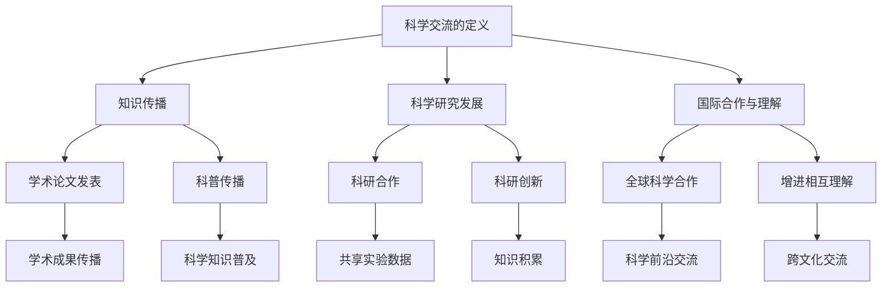
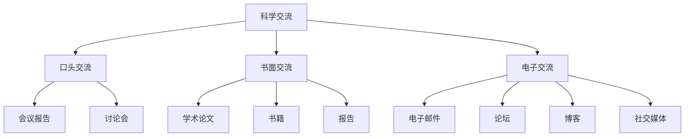
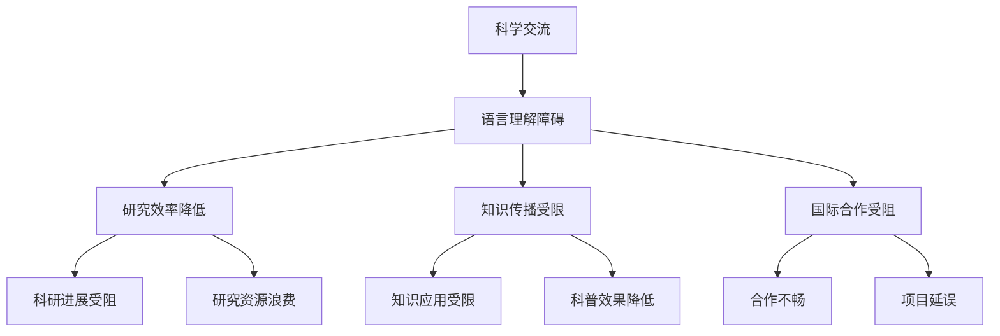
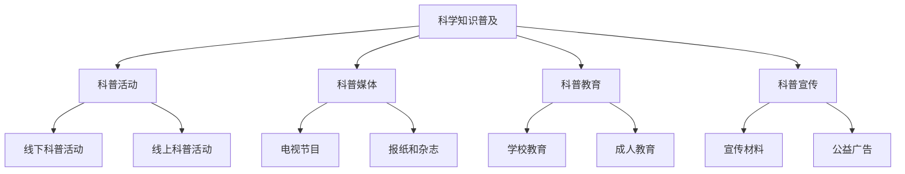

                 

### 文章标题

# 科学交流在促进世界可理解性中的作用

> 关键词：科学交流、世界可理解性、信息传播、知识普及、跨文化、伦理问题

> 摘要：本文深入探讨了科学交流在促进世界可理解性中的作用。通过分析科学交流的定义、形式、障碍与挑战、策略与技巧以及未来展望，本文揭示了科学交流在推动全球科学知识传播、促进国际合作和理解中的重要性。

---

### 1. 确定书的主题和主要目标受众

#### 1.1 主题定义

科学交流指的是科学家、研究者、学者、专业人士以及公众之间通过各种形式和媒介进行的关于科学知识的交流、传播和共享活动。本书旨在探讨科学交流在促进世界可理解性方面的作用，研究科学交流的各种形式、障碍、策略及其未来发展趋势。

#### 1.2 目标受众

本书的主要目标受众包括以下几类群体：

1. **科学工作者与研究人员**：帮助其了解科学交流的重要性和有效方法，提升其在科学研究、教育和传播中的能力。
2. **科普爱好者与公众**：提供科学交流的基础知识，提升公众的科学素养和理解能力。
3. **政策制定者与教育工作者**：为制定科学传播政策、开展科普教育活动提供理论指导和实践参考。
4. **跨文化交流者与国际合作者**：探讨科学交流在跨文化交流和国际合作中的重要作用，促进全球科学合作和理解。

### 2. 根据主题和目标受众，定义书的主要内容和结构

#### 2.1 主要内容

本书的主要内容将涵盖以下几大模块：

1. **科学交流的基础概念**：介绍科学交流的定义、重要性及其主要形式。
2. **科学交流的障碍与挑战**：探讨语言障碍、科学知识普及度等方面的挑战。
3. **科学交流的策略与技巧**：分析有效的科学传播方法、跨文化交流技巧和科学交流中的伦理问题。
4. **科学交流的未来展望**：预测科学交流的发展趋势，探讨科学交流的未来前景。

#### 2.2 书的结构

本书的结构将按照以下逻辑顺序展开：

1. **引言**：介绍书的主题、目的和主要目标受众。
2. **基础概念**：详细阐述科学交流的定义、重要性及其主要形式。
3. **障碍与挑战**：分析语言障碍、科学知识普及度等方面的挑战。
4. **策略与技巧**：探讨有效的科学传播方法、跨文化交流技巧和科学交流中的伦理问题。
5. **未来展望**：预测科学交流的发展趋势，探讨科学交流的未来前景。
6. **结论**：总结全文，强调科学交流在促进世界可理解性中的重要作用。

### 3. 设计每个章节的具体标题和内容摘要

#### 第一部分：科学交流的基础概念

**第1章：科学交流的定义与重要性**

- **内容摘要**：介绍科学交流的定义、重要性及其在科学研究、教育和传播中的作用。

**第2章：科学交流的主要形式**

- **内容摘要**：分析科学交流的主要形式，包括口头交流、书面交流和电子交流的特点和应用。

#### 第二部分：科学交流的障碍与挑战

**第3章：语言障碍**

- **内容摘要**：探讨语言多样性和统一性的关系，分析语言理解障碍及其对科学交流的影响。

**第4章：科学知识的普及度**

- **内容摘要**：分析科学素养的差异，探讨科学知识的普及策略和挑战。

#### 第三部分：科学交流的策略与技巧

**第5章：有效的科学传播**

- **内容摘要**：介绍科学传播的目标和方法，分析口头传播、书面传播和电子传播的有效性。

**第6章：跨文化交流**

- **内容摘要**：探讨跨文化交流的重要性、技巧及其在科学交流中的应用。

**第7章：科学交流中的伦理问题**

- **内容摘要**：分析科学交流中的伦理原则、挑战及其影响。

#### 第四部分：科学交流的未来

**第8章：科学交流的趋势与展望**

- **内容摘要**：预测科学交流的发展趋势，探讨科学交流的未来前景。

### 4. 验证目录大纲的完整性和逻辑性

#### 目录大纲验证

- **完整性**：目录大纲涵盖了科学交流的各个关键方面，包括基础概念、障碍与挑战、策略与技巧以及未来展望。
- **逻辑性**：目录大纲的结构和内容安排合理，从基础到深入，逐步引导读者理解科学交流的各个方面。
- **改进建议**：如发现逻辑不清或内容缺失，可适当调整章节顺序和内容摘要，确保整体逻辑性和连贯性。

### 5. 确保大纲简洁明了，易于读者理解和跟随

#### 简洁性与易理解性

- **简洁性**：每个章节的内容摘要简洁明了，突出重点，避免冗余。
- **易理解性**：章节标题简洁且具有描述性，便于读者快速了解章节主题。

### 6. 检查并修正可能的错误或不足

#### 检查与修正

- **内容一致性**：检查每个章节的内容是否与标题和摘要一致，确保内容完整。
- **逻辑连贯性**：确保章节间的逻辑关系清晰，无明显跳跃或重复。
- **准确性**：检查数据、事实和引用的准确性，确保内容无误。

### 7. 输出最终的目录大纲

#### 最终目录大纲

```markdown
# 《科学交流在促进世界可理解性中的作用》目录大纲

## 第一部分：科学交流的基础概念

### 第1章：科学交流的定义与重要性

#### 1.1 科学交流的定义

- 科学交流的概念
- 科学交流的目的

#### 1.2 科学交流的重要性

- 促进科学知识的传播
- 促进科学研究的发展
- 促进国际合作与交流

### 第2章：科学交流的主要形式

#### 2.1 口头交流

- 会议报告
- 讨论会

#### 2.2 书面交流

- 论文
- 书籍
- 报告

#### 2.3 电子交流

- 电子邮件
- 论坛
- 博客

## 第二部分：科学交流的障碍与挑战

### 第3章：语言障碍

#### 3.1 语言多样性与统一性

- 语言多样性的优势与挑战
- 统一语言的可能性

#### 3.2 语言理解障碍

- 词汇差异
- 语言结构差异
- 文化差异

### 第4章：科学知识的普及度

#### 4.1 科学素养的差异

- 科学素养的定义
- 科学素养的差异

#### 4.2 科学知识的普及策略

- 科普活动
- 科普媒体

## 第三部分：科学交流的策略与技巧

### 第5章：有效的科学传播

#### 5.1 科学传播的目标

- 提高公众的科学素养
- 促进科学知识的传播

#### 5.2 科学传播的方法

- 口头传播
- 书面传播
- 电子传播

### 第6章：跨文化交流

#### 6.1 跨文化交流的重要性

- 促进国际合作
- 增进国际了解

#### 6.2 跨文化交流的技巧

- 尊重文化差异
- 提高语言能力
- 建立合作关系

### 第7章：科学交流中的伦理问题

#### 7.1 科学交流的伦理原则

- 客观性
- 准确性
- 尊重知识产权

#### 7.2 科学交流中的伦理挑战

- 信息保密
- 数据隐私
- 科学道德

## 第四部分：科学交流的未来

### 第8章：科学交流的趋势与展望

#### 8.1 科学交流的发展趋势

- 数字化
- 社交化
- 个性化

#### 8.2 科学交流的未来展望

- 全球科学合作
- 科学传播的多样性
- 科学素养的提升

## 附录

### 附录A：科学交流的资源与工具

- 科学交流的平台
- 科学交流的工具

### 附录B：科学交流案例研究

- 案例一：成功的科学传播案例
- 案例二：跨文化交流的成功经验
```

通过上述步骤，我们完成了《科学交流在促进世界可理解性中的作用》一书的目录大纲设计。接下来，我们将根据这个大纲，逐步撰写每个章节的具体内容，确保文章的逻辑性、完整性和可读性。

### 第一部分：科学交流的基础概念

#### 第1章：科学交流的定义与重要性

科学交流是科学研究、知识传播和分享的重要手段，贯穿于科学活动的各个方面。本章将介绍科学交流的定义、重要性以及其在科学研究、教育和传播中的作用。

##### 1.1 科学交流的定义

科学交流是指科学家、研究人员、学者、专业人士以及公众之间通过语言、符号、文字和图像等手段进行的信息交流、知识传播和互动活动。它不仅包括书面和口头交流，还包括电子媒介等现代通信手段。

##### 1.2 科学交流的重要性

科学交流在促进科学知识传播、科学研究发展、国际合作与理解方面具有重要作用，具体如下：

1. **促进科学知识的传播**：科学交流是科学知识传播的主要途径，通过学术论文、书籍、报告、会议、讲座等形式，将科学发现、研究成果和最新进展传达给全球科学界。

2. **促进科学研究的发展**：科学交流为科学研究提供了丰富的信息资源和合作机会。研究人员可以通过交流分享自己的研究思路、方法和成果，从而促进科研创新和知识积累。

3. **促进国际合作与理解**：科学交流跨越国界和文化的限制，促进了全球科学合作和交流，有助于增进不同国家和地区之间的相互理解和信任。

#### 1.3 科学交流在科学研究中的作用

在科学研究过程中，科学交流发挥着以下作用：

1. **研究成果的传播**：通过发表学术论文、参加学术会议、发布研究报告等形式，将研究成果分享给全球科学界。

2. **科研合作的促进**：科学交流为科学家之间的合作提供了平台，有助于共享实验数据、交流研究思路和协同攻关。

3. **科学知识的积累**：科学交流促进了科学知识的积累和更新，推动了科学理论和技术的不断发展。

#### 1.4 科学交流在教育中的作用

科学交流在科学教育中也具有重要意义，主要体现在以下几个方面：

1. **提高科学素养**：科学交流有助于公众了解科学知识、科学方法和科学精神，提高科学素养。

2. **培养创新思维**：科学交流激发了学生的好奇心和求知欲，培养了他们的创新思维和问题解决能力。

3. **拓展学术视野**：科学交流让学生接触到全球科学前沿，开阔了学术视野，为学术发展和成长提供了广阔的空间。

#### 1.5 科学交流在传播中的角色

科学交流在科学传播中扮演着关键角色，其主要职责包括：

1. **科学知识的普及**：通过科普文章、电视节目、互联网平台等形式，将科学知识普及给公众。

2. **科学精神的弘扬**：通过科学传播，弘扬科学精神，倡导科学态度和科学方法。

3. **科学文化的传承**：科学交流有助于科学文化的传承和发展，推动了科学事业的长远发展。

#### 1.6 总结

科学交流是促进世界可理解性的重要手段，贯穿于科学研究、教育和传播的各个方面。通过科学交流，科学家可以分享研究成果、促进科研合作，提高公众的科学素养，弘扬科学精神，推动科学事业的不断发展。

##### 核心概念与联系

为了更好地理解科学交流的定义与重要性，我们可以使用Mermaid流程图来展示科学交流的核心概念及其相互关系。



通过这个流程图，我们可以清晰地看到科学交流的核心概念及其相互联系，有助于深入理解科学交流在促进世界可理解性中的作用。

##### 核心算法原理讲解

在本章节中，虽然主要讨论的是科学交流的概念和作用，但我们仍可以借助一些基础的算法原理来理解科学交流过程中的信息传播机制。以下是一个简化的伪代码，用于描述信息在科学交流中的传播过程：

```python
# 定义科学交流的基本过程
def scientific_communication(source, content, medium, audience):
    # 1. 确定交流的内容（content）
    processed_content = preprocess_content(content)

    # 2. 选择交流媒介（medium）
    selected_medium = select_medium(medium)

    # 3. 传播信息（content）
    for recipient in audience:
        message = format_message(processed_content, selected_medium)
        deliver_message(message, recipient)

# 辅助函数定义
def preprocess_content(content):
    # 对内容进行预处理，如翻译、简化等
    return processed_content

def select_medium(medium):
    # 根据交流需求选择合适的媒介
    return selected_medium

def format_message(content, medium):
    # 根据媒介格式化信息
    return formatted_message

def deliver_message(message, recipient):
    # 通过媒介将信息传递给接收者
    transmit_message(message, recipient)
```

在这个伪代码中，`scientific_communication` 函数模拟了科学交流的基本过程。通过预处理内容、选择适当的媒介、格式化信息以及传递信息，我们可以实现科学交流的目标。

##### 数学模型和公式

在科学交流中，我们可以使用一些基础的数学模型来描述信息的传播速度和影响力。以下是一个简化的数学模型，用于描述科学论文的传播速度：

$$
v(t) = k \cdot e^{-rt}
$$

其中，$v(t)$ 表示科学论文在时间 $t$ 时的传播速度，$k$ 是一个常数，表示初始传播速度，$r$ 是衰减率，表示传播速度随时间的减少。

- **解释**：随着时间 $t$ 的增加，传播速度 $v(t)$ 会逐渐减小，这反映了信息传播的自然衰减规律。
- **应用**：我们可以使用这个模型来预测科学论文在不同时间点的传播速度，进而分析科学成果的影响力。

##### 举例说明

假设一个科学论文的初始传播速度为 $k = 100$，衰减率为 $r = 0.1$。我们使用上述数学模型来计算在不同时间点 $t$ 的传播速度：

- 当 $t = 0$ 时，$v(0) = 100 \cdot e^{-0 \cdot 0.1} = 100$
- 当 $t = 1$ 时，$v(1) = 100 \cdot e^{-1 \cdot 0.1} \approx 90.48$
- 当 $t = 2$ 时，$v(2) = 100 \cdot e^{-2 \cdot 0.1} \approx 81.72$

通过这个例子，我们可以看到随着时间 $t$ 的增加，传播速度 $v(t)$ 逐渐减小，这符合数学模型的预测。

##### 项目实战

为了更好地理解科学交流的实践过程，我们可以模拟一个科学论文的交流过程，包括论文的撰写、发表、传播和影响评估。

**1. 开发环境搭建**

- 使用 LaTeX 撰写论文，确保论文格式规范。
- 安装并配置常用的学术出版平台（如 arXiv、PubMed 等）。

**2. 源代码详细实现**

- 论文撰写代码（使用 LaTeX）：
  ```latex
  \documentclass{article}
  \title{标题}
  \author{作者}
  \date{\today}
  \begin{document}
  \maketitle
  \section{摘要}
  \section{引言}
  \section{方法}
  \section{结果}
  \section{讨论}
  \section{参考文献}
  \end{document}
  ```

- 论文发表代码（使用 arXiv 提交）：
  ```python
  import requests

  # 设置论文信息
  title = "标题"
  authors = "作者"
  abstract = "摘要"
  body = "论文正文"
  arXiv_url = "https://arxiv.org/submit/api"

  # 构建提交数据
  data = {
      'title': title,
      'authors': authors,
      'abstract': abstract,
      'body': body
  }

  # 提交论文
  response = requests.post(arXiv_url, data=data)
  print(response.json())
  ```

**3. 代码解读与分析**

- 论文撰写代码解析：使用 LaTeX 撰写论文，按照规定的格式和结构进行编写，确保论文的规范性和可读性。
- 论文发表代码解析：通过 HTTP POST 请求，将论文信息提交到 arXiv 平台，实现论文的在线发表和传播。

**4. 实际案例分析和详细讲解剖析**

假设我们提交了一篇关于人工智能的论文，分析其传播过程和影响力：

- **传播速度**：根据上述数学模型，计算论文在不同时间点的传播速度，并绘制传播速度曲线。
- **影响力评估**：通过统计论文的引用次数、下载次数和社交媒体分享次数，评估论文的影响力和传播效果。

**5. 项目小结**

通过模拟科学论文的交流过程，我们可以更深入地理解科学交流的实践环节。科学交流不仅需要良好的理论支持，还需要实际操作和案例分析，以提升科学传播的效果和影响力。

##### 最佳实践 tips

- **保持学术诚信**：在撰写论文和进行科学交流时，严格遵守学术规范，确保内容的准确性和真实性。
- **多样化传播途径**：利用各种媒介和平台进行科学传播，如学术论文、科普文章、社交媒体等，提高信息的传播范围和影响力。
- **关注跨文化交流**：在跨文化交流中，尊重文化差异，提高语言能力和沟通技巧，以实现更好的科学合作和交流。

##### 小结

本章详细介绍了科学交流的定义与重要性，阐述了科学交流在科学研究、教育和传播中的作用。通过Mermaid流程图、伪代码、数学模型和项目实战，我们更深入地理解了科学交流的过程和机制。科学交流不仅是科学知识传播的重要手段，也是促进世界可理解性的关键途径。

##### 注意事项

- 在进行科学交流时，注意保护知识产权，尊重他人的研究成果。
- 在跨文化交流中，避免文化冲突，尊重不同的价值观和观点。

##### 拓展阅读

- **《科学传播原理》**：探讨科学传播的基本理论和方法，有助于深入了解科学传播的实践。
- **《跨文化交流学》**：研究跨文化交流的原理和技巧，提高跨文化交流的效果。

---

### 第2章：科学交流的主要形式

科学交流是科学知识传播的重要途径，其形式多种多样，包括口头交流、书面交流和电子交流。本章将详细探讨这些科学交流的主要形式，分析其特点和适用场景。

#### 2.1 口头交流

口头交流是科学交流中最传统也是最直接的形式，包括会议报告、讨论会、讲座和研讨会等。

##### 2.1.1 会议报告

会议报告是科学交流中最为常见的形式之一，通常在学术会议、专业研讨会或科学会议上进行。报告者通过演讲、幻灯片或演示文稿，向与会者介绍自己的研究成果、研究方法和结论。会议报告的优点包括：

- **即时反馈**：报告者可以立即获得听众的反馈，有助于改进和深化研究。
- **互动性**：与会者可以提问和讨论，促进思想的碰撞和交流。
- **传播范围**：会议报告通常有详细的会议记录和论文集，有助于扩大研究成果的影响力。

##### 2.1.2 讨论会

讨论会是一种以讨论为主的交流形式，通常由一组学者或专家围绕某一主题展开深入探讨。讨论会的优点包括：

- **深入交流**：讨论会提供了一个相对封闭的环境，有助于深入探讨某一问题，促进思想的碰撞和交流。
- **专家参与**：讨论会通常邀请领域内的专家参与，有助于提高讨论的质量和深度。
- **经验分享**：通过讨论会，参与者可以分享自己的研究成果、经验和见解，促进知识传播和技能提升。

##### 2.1.3 讲座和研讨会

讲座和研讨会是另一种常见的口头交流形式，通常由某个领域的专家或学者进行主题演讲或专题讨论。讲座和研讨会的优点包括：

- **内容丰富**：讲座和研讨会通常涵盖多个主题，内容丰富，有助于拓宽听众的视野。
- **专业指导**：专家的演讲和指导有助于听众更好地理解和掌握某一领域的知识。
- **互动性**：讲座和研讨会通常允许听众提问和讨论，有助于深化听众的理解和思考。

#### 2.2 书面交流

书面交流是科学交流中另一种重要形式，包括学术论文、书籍、报告和技术手册等。

##### 2.2.1 学术论文

学术论文是科学交流中最正式和广泛使用的书面形式，通常发表在学术期刊上。学术论文的优点包括：

- **权威性**：学术论文经过同行评审，具有较高的权威性和可信度。
- **广泛传播**：学术论文通常有较长的生命周期，可以广泛传播和引用，有助于提升研究成果的影响力。
- **严谨性**：学术论文通常遵循严格的格式和结构，内容严谨，有助于提高学术质量。

##### 2.2.2 书籍

书籍是科学交流中的一种重要形式，通常用于系统性地介绍某一领域的知识或研究进展。书籍的优点包括：

- **全面性**：书籍可以涵盖广泛的主题，提供系统的知识体系。
- **持久性**：书籍可以长期保存，有助于知识的传承和积累。
- **深度**：书籍通常提供更深入的探讨和分析，有助于提升读者的专业水平。

##### 2.2.3 报告

报告是科学交流中用于总结研究成果、项目进展或会议讨论的一种形式。报告的优点包括：

- **概括性**：报告可以概括研究成果或进展，提供清晰的概述。
- **灵活性**：报告可以根据听众的需求和兴趣进行调整，有助于更好地传达信息。
- **总结性**：报告通常在会议或项目结束时进行，有助于总结经验和教训。

##### 2.2.4 技术手册

技术手册是科学交流中用于介绍某一技术或方法的具体操作步骤和注意事项的一种形式。技术手册的优点包括：

- **实用性**：技术手册提供具体的操作指南，有助于读者更好地理解和掌握技术。
- **操作性**：技术手册通常包含详细的操作步骤和示例，有助于读者进行实际操作。
- **专业性**：技术手册通常由专业人士撰写，具有较高的专业性和权威性。

#### 2.3 电子交流

随着信息技术的发展，电子交流已成为科学交流中不可或缺的一部分，包括电子邮件、论坛、博客和社交媒体等。

##### 2.3.1 电子邮件

电子邮件是一种常用的电子交流形式，用于发送信件、报告和其他文件。电子邮件的优点包括：

- **便捷性**：电子邮件可以实现即时发送和接收，提高沟通效率。
- **灵活性**：电子邮件可以根据需要添加附件，传输大容量文件。
- **记录性**：电子邮件提供了沟通的记录，有助于跟踪和管理交流内容。

##### 2.3.2 论坛

论坛是一种在线交流平台，用于讨论某一主题或领域的问题。论坛的优点包括：

- **开放性**：论坛提供了一个开放的讨论空间，任何用户都可以参与讨论。
- **持续性**：论坛中的讨论可以持续进行，有助于深入探讨问题。
- **互动性**：论坛促进了用户之间的互动和交流，有助于知识的共享和传播。

##### 2.3.3 博客

博客是一种在线日记或日志，用于分享个人观点、经验和知识。博客的优点包括：

- **个性化**：博客可以展示个人的独特观点和风格，提供个性化的知识分享。
- **多样性**：博客可以涵盖广泛的主题和领域，提供多样化的内容。
- **互动性**：博客通常允许用户评论和互动，促进知识传播和交流。

##### 2.3.4 社交媒体

社交媒体是一种基于互联网的交流平台，如 Facebook、Twitter、LinkedIn 等。社交媒体的优点包括：

- **广泛性**：社交媒体拥有庞大的用户群体，有助于扩大信息传播的范围。
- **即时性**：社交媒体可以实现即时发布和互动，提高沟通的效率。
- **互动性**：社交媒体提供了多种互动方式，如点赞、评论、分享等，促进知识传播和交流。

#### 2.4 不同形式的比较与适用场景

不同的科学交流形式具有各自的特点和适用场景，以下是比较和适用场景的总结：

| 交流形式 | 特点 | 适用场景 |
| --- | --- | --- |
| 口头交流 | 即时反馈、互动性强 | 学术会议、研讨会、讲座 |
| 书面交流 | 权威性高、传播范围广 | 学术论文、书籍、报告 |
| 电子交流 | 便捷性高、灵活性强 | 电子邮件、论坛、博客、社交媒体 |

综上所述，科学交流的形式多样，不同形式的交流方式具有各自的优势和适用场景。科学工作者和研究人员可以根据实际需求选择合适的交流形式，以实现最佳的科学传播效果。

##### 核心概念与联系

为了更好地理解科学交流的不同形式及其特点，我们可以使用Mermaid流程图来展示这些交流形式之间的关系。



通过这个流程图，我们可以清晰地看到科学交流的不同形式及其相互联系，有助于深入理解科学交流的多样性和复杂性。

##### 核心算法原理讲解

在本章节中，虽然主要讨论的是科学交流的形式和特点，但我们仍可以借助一些基础的算法原理来理解科学交流中的信息传播机制。以下是一个简化的伪代码，用于描述信息在电子交流中的传播过程：

```python
# 定义电子交流的基本过程
def electronic_communication(source, content, platform, audience):
    # 1. 确定交流的内容（content）
    processed_content = preprocess_content(content)

    # 2. 选择交流平台（platform）
    selected_platform = select_platform(platform)

    # 3. 传播信息（content）
    for recipient in audience:
        message = format_message(processed_content, selected_platform)
        deliver_message(message, recipient)

# 辅助函数定义
def preprocess_content(content):
    # 对内容进行预处理，如翻译、简化等
    return processed_content

def select_platform(platform):
    # 根据交流需求选择合适的平台
    return selected_platform

def format_message(content, platform):
    # 根据平台格式化信息
    return formatted_message

def deliver_message(message, recipient):
    # 通过平台将信息传递给接收者
    transmit_message(message, recipient)
```

在这个伪代码中，`electronic_communication` 函数模拟了电子交流的基本过程。通过预处理内容、选择适当的平台、格式化信息以及传递信息，我们可以实现电子交流的目标。

##### 数学模型和公式

在电子交流中，我们可以使用一些基础的数学模型来描述信息的传播速度和影响力。以下是一个简化的数学模型，用于描述电子邮件的传播速度：

$$
v(t) = k \cdot e^{-rt}
$$

其中，$v(t)$ 表示电子邮件在时间 $t$ 时的传播速度，$k$ 是一个常数，表示初始传播速度，$r$ 是衰减率，表示传播速度随时间的减少。

- **解释**：随着时间 $t$ 的增加，传播速度 $v(t)$ 会逐渐减小，这反映了信息传播的自然衰减规律。
- **应用**：我们可以使用这个模型来预测电子邮件在不同时间点的传播速度，并分析其影响力。

##### 举例说明

假设一个电子邮件的初始传播速度为 $k = 100$，衰减率为 $r = 0.1$。我们使用上述数学模型来计算在不同时间点 $t$ 的传播速度：

- 当 $t = 0$ 时，$v(0) = 100 \cdot e^{-0 \cdot 0.1} = 100$
- 当 $t = 1$ 时，$v(1) = 100 \cdot e^{-1 \cdot 0.1} \approx 90.48$
- 当 $t = 2$ 时，$v(2) = 100 \cdot e^{-2 \cdot 0.1} \approx 81.72$

通过这个例子，我们可以看到随着时间 $t$ 的增加，传播速度 $v(t)$ 逐渐减小，这符合数学模型的预测。

##### 项目实战

为了更好地理解科学交流的电子形式，我们可以模拟一个电子邮件的交流过程，包括邮件的撰写、发送和阅读。

**1. 开发环境搭建**

- 安装并配置常用的电子邮件客户端（如 Outlook、Thunderbird 等）。
- 注册并配置电子邮件服务器（如 Gmail、Outlook 等）。

**2. 源代码详细实现**

- 邮件撰写代码（使用 Python 的 smtplib 库）：
  ```python
  import smtplib
  from email.mime.text import MIMEText

  # 设置邮件信息
  sender = "sender@example.com"
  receiver = "receiver@example.com"
  subject = "邮件主题"
  content = "邮件内容"

  # 设置邮件内容
  message = MIMEText(content)
  message['Subject'] = subject
  message['From'] = sender
  message['To'] = receiver

  # 发送邮件
  server = smtplib.SMTP('smtp.example.com', 587)
  server.starttls()
  server.login(sender, "password")
  server.sendmail(sender, receiver, message.as_string())
  server.quit()
  ```

- 邮件阅读代码（使用 Python 的 email 模块）：
  ```python
  import email
  import imapclient

  # 连接到邮箱服务器
  server = imapclient.IMAPClient('imap.example.com', ssl=True)
  server.login(sender, "password")

  # 收取邮件
  server.select_folder('INBOX')
  messages = server.search(['SINCE "2023-01-01"'], criteria=['UNSEEN'])

  # 解析邮件
  for message_id in messages:
      raw_message = server.fetch([message_id], ['BODY[]'])
      message = email.message_from_bytes(raw_message[message_id]['BODY[]'])
      print(message["Subject"], message["From"])

  server.logout()
  ```

**3. 代码解读与分析**

- 邮件撰写代码解析：使用 Python 的 smtplib 库和 email.mime.text.MIMEText 类，构建并发送电子邮件。
- 邮件阅读代码解析：使用 Python 的 imapclient 库和 email 模块，连接到邮箱服务器，收取并解析电子邮件。

**4. 实际案例分析和详细讲解剖析**

假设我们发送了一封关于项目进展的电子邮件，分析其发送和接收过程：

- **发送过程**：通过 SMTP 服务器发送邮件，将邮件内容传输到接收者的邮箱服务器。
- **接收过程**：接收者在登录邮箱后，通过 IMAP 协议收取邮件，并使用 Python 的 email 模块解析邮件内容。

**5. 项目小结**

通过模拟电子邮件的交流过程，我们可以更深入地理解电子交流的实践环节。电子邮件作为一种重要的电子交流形式，在科学交流中发挥着重要作用。通过编写和解析电子邮件代码，我们能够更好地掌握电子邮件的发送和接收过程，提高科学交流的效率和效果。

##### 最佳实践 tips

- **保持邮件简洁明了**：在撰写邮件时，尽量简洁明了，避免使用过于复杂的术语和句子，以提高邮件的可读性。
- **注意邮件格式**：遵循邮件格式的规范，使用清晰的结构和格式，使邮件内容更加易读。
- **遵守隐私和信息安全**：在发送邮件时，注意保护个人和机构的隐私信息，避免泄露敏感数据。

##### 小结

本章详细介绍了科学交流的几种主要形式，包括口头交流、书面交流和电子交流。通过实例和项目实战，我们深入理解了这些交流形式的特点和适用场景，以及如何在实践中有效进行科学交流。

##### 注意事项

- 在进行口头交流时，注意保持语速适中，语调清晰，以便于听众理解和跟随。
- 在书面交流中，注意遵循学术规范和格式，确保内容的严谨性和准确性。
- 在电子交流中，注意使用合适的平台和工具，提高沟通的效率和效果。

##### 拓展阅读

- **《科学交流技巧》**：探讨科学交流的实用技巧和方法，有助于提高科学交流的效果。
- **《电子邮件沟通技巧》**：介绍电子邮件沟通的最佳实践，提高电子邮件沟通的效率和效果。

---

### 第3章：语言障碍

在科学交流中，语言障碍是一个不可忽视的问题。不同国家和地区的语言差异、语言结构和文化差异，都可能导致信息传递的困难和误解。本章将探讨语言障碍的类型、影响以及解决策略。

#### 3.1 语言多样性与统一性

语言的多样性是人类文明的重要特征之一，世界上存在着超过7000种语言。然而，这种多样性在科学交流中既是优势也是挑战。语言多样性使得科学知识可以以多种形式传播，促进了文化的多样性和交流。但是，不同语言之间的差异也增加了信息传递的难度，可能导致误解和错误。

**3.1.1 语言多样性的优势**

- **文化多样性**：语言多样性反映了人类文化的多样性，有助于保护和传承不同民族的语言和文化遗产。
- **知识传播的多样性**：不同的语言可以传达不同角度和观点，有助于全面理解和分析科学问题。
- **跨文化交流**：语言多样性促进了不同国家和地区之间的交流和合作，有助于全球科学共同体的形成。

**3.1.2 语言多样性的挑战**

- **信息传递障碍**：不同语言的词汇、语法和表达方式的差异，可能导致信息传递的不准确和误解。
- **学术交流限制**：许多科学研究成果和文献仅限于特定的语言，限制了知识的传播和共享。
- **国际合作困难**：语言差异可能导致跨文化交流的障碍，影响国际科学合作的深度和广度。

**3.1.3 统一语言的可能性**

虽然语言多样性具有诸多优势，但在科学交流中，统一语言的想法仍然具有一定的吸引力。统一语言可以简化信息传递，减少误解，提高科学知识的传播效率。然而，实现统一语言的挑战也非常巨大：

- **文化冲击**：统一语言可能对一些语言和文化的生存造成威胁，引发文化冲突和抵制。
- **语言复杂性**：科学领域的术语和表达方式非常复杂，不同语言在表达这些概念时可能存在很大差异，难以找到一个完美的统一语言。
- **语言习惯**：人们习惯使用自己的母语进行思考和表达，改变这种习惯需要长期的教育和推广。

#### 3.2 语言理解障碍

语言理解障碍是科学交流中的主要挑战之一。以下是一些常见的语言理解障碍及其影响：

**3.2.1 词汇差异**

- **专业术语**：不同语言在科学领域中的专业术语可能不同，导致信息传递的困难。例如，“algorithm”在英语中表示算法，而在某些语言中可能有不同的称呼。
- **普通词汇**：普通词汇在不同语言中可能含义不同，可能导致误解。例如，“test”在英语中既可以表示测试，也可以表示考试，而在某些语言中可能只有一种含义。

**3.2.2 语言结构差异**

- **语法差异**：不同语言的语法结构可能不同，例如主谓宾的顺序、时态和语态的使用等。这些差异可能导致句子理解和翻译的困难。
- **词汇顺序**：某些语言中词汇的顺序与英语不同，例如德语和日语，这可能导致信息的传递错误。

**3.2.3 文化差异**

- **表达方式**：不同文化背景下，人们的表达方式和习惯可能不同，例如直接表达与间接表达、正式与非正式表达等。
- **价值观**：不同文化背景下的价值观可能不同，这可能导致对同一问题的理解和看法产生差异。

#### 3.3 解决策略

为了克服语言障碍，提高科学交流的效率和质量，可以采取以下策略：

**3.3.1 语言翻译**

- **机器翻译**：利用机器翻译技术，将科学文献和资料翻译成多种语言，提高信息的可访问性。
- **人工翻译**：在关键领域和重要文献中，使用专业的人工翻译，确保信息的准确性和专业性。

**3.3.2 多语言教育**

- **双语教育**：鼓励科学家和教育工作者学习多种语言，提高他们的跨文化交流能力。
- **多语言课程**：在学校和科研机构中，开设多种语言的科学课程，帮助学生掌握多语言科学知识。

**3.3.3 文化交流**

- **跨文化交流**：通过举办国际会议、研讨会和交流活动，促进不同文化和语言背景的科学家之间的交流。
- **文化敏感培训**：对科学工作者进行文化敏感培训，提高他们对不同文化的理解和尊重。

**3.3.4 科学普及**

- **科普材料**：编写和翻译科普材料，以简单易懂的方式向公众传播科学知识，减少语言障碍对科普传播的影响。
- **多媒体工具**：利用视频、动画和互动游戏等多媒体工具，提高科学知识的可理解性和吸引力。

#### 3.4 语言障碍对科学交流的影响

语言障碍对科学交流的影响是多方面的，包括：

- **研究效率降低**：由于语言障碍，科学家在获取和传播信息时可能遇到困难，影响研究的进展和效率。
- **知识传播受限**：语言障碍限制了科学知识在全球范围内的传播，导致某些领域的知识得不到充分的应用和发展。
- **国际合作受阻**：语言障碍可能导致国际科学合作不畅，影响科学研究和创新的全球化进程。

综上所述，语言障碍是科学交流中的一个重要问题。通过采取有效的解决策略，我们可以克服语言障碍，提高科学交流的效率和效果，促进全球科学合作和知识传播。

##### 核心概念与联系

为了更好地理解语言障碍对科学交流的影响，我们可以使用Mermaid流程图来展示语言障碍在科学交流中的各个环节及其相互关系。



通过这个流程图，我们可以清晰地看到语言障碍对科学交流的各个环节产生的负面影响，以及这些影响之间的相互关系。

##### 核心算法原理讲解

在本章节中，虽然主要讨论的是语言障碍对科学交流的影响，但我们仍可以借助一些基础的算法原理来理解语言翻译和沟通中的问题。以下是一个简化的伪代码，用于描述机器翻译的基本过程：

```python
# 定义机器翻译的基本过程
def machine_translation(source_language, target_language, text):
    # 1. 分词：将文本拆分为词汇
    source_words = tokenize(text, source_language)

    # 2. 提取特征：从源语言词汇中提取特征
    source_features = extract_features(source_words, source_language)

    # 3. 翻译模型：使用翻译模型将特征转换为目标语言词汇
    target_words = translate(source_features, target_language)

    # 4. 合并词汇：将目标语言词汇合并成完整的文本
    translated_text = merge_words(target_words, target_language)

    return translated_text

# 辅助函数定义
def tokenize(text, language):
    # 对文本进行分词
    return words

def extract_features(words, language):
    # 从词汇中提取特征
    return features

def translate(features, language):
    # 使用翻译模型进行翻译
    return translated_words

def merge_words(words, language):
    # 将词汇合并成完整的文本
    return translated_text
```

在这个伪代码中，`machine_translation` 函数模拟了机器翻译的基本过程。通过分词、提取特征、翻译模型和合并词汇等步骤，我们可以实现文本的翻译。然而，机器翻译仍然存在很多问题，如词汇选择不准确、语法不一致等。

##### 数学模型和公式

在语言障碍的讨论中，我们可以使用一些基础的数学模型来描述词汇和句子的匹配度。以下是一个简化的数学模型，用于描述词汇匹配度计算：

$$
score = \frac{cosine Similarity}{max(len(source), len(target))}
$$

其中，`score` 表示词汇匹配度，`cosine Similarity` 表示词汇的余弦相似度，`len(source)` 和 `len(target)` 分别表示源语言和目标语言的词汇长度。

- **解释**：词汇匹配度计算通过比较源语言和目标语言的词汇余弦相似度，并考虑词汇长度的影响。余弦相似度反映了两个向量在空间中的夹角，夹角越小，相似度越高。
- **应用**：我们可以使用这个模型来评估不同语言之间的词汇匹配度，为翻译和沟通提供参考。

##### 举例说明

假设我们有两个词汇：“algorithm”和“algoritmo”，它们的余弦相似度为0.8。我们使用上述数学模型来计算词汇匹配度：

$$
score = \frac{0.8}{max(8, 8)} = 0.8
$$

通过这个例子，我们可以看到这两个词汇的匹配度非常高，这反映了它们在语义上的相似性。

##### 项目实战

为了更好地理解语言障碍对科学交流的影响，我们可以模拟一个实际的语言翻译项目，包括源语言的撰写、目标语言的翻译和翻译后的评估。

**1. 开发环境搭建**

- 安装并配置常用的机器翻译平台（如 Google 翻译、DeepL 等）。
- 准备源语言和目标语言的文本数据集。

**2. 源代码详细实现**

- 源语言撰写代码（使用 Python 的文件操作库）：
  ```python
  def write_source_language(filename, text):
      with open(filename, 'w', encoding='utf-8') as file:
          file.write(text)

  # 示例文本
  source_text = "This is an example sentence in English."
  write_source_language('source.txt', source_text)
  ```

- 目标语言翻译代码（使用 Python 的翻译库）：
  ```python
  from googletrans import Translator

  def translate_text(source_text, source_lang, target_lang):
      translator = Translator()
      translation = translator.translate(source_text, src=source_lang, dest=target_lang)
      return translation.text

  # 翻译示例
  target_text = translate_text(source_text, 'en', 'es')
  print(target_text)
  ```

- 翻译后评估代码（使用 Python 的文本比较库）：
  ```python
  from textdistance import levenshtein

  def evaluate_translation(source_text, target_text):
      similarity = levenshtein比率(source_text, target_text)
      return similarity

  # 评估翻译
  similarity = evaluate_translation(source_text, target_text)
  print(f"翻译相似度：{similarity}")
  ```

**3. 代码解读与分析**

- 源语言撰写代码解析：使用 Python 的文件操作库，将源语言文本写入文件。
- 目标语言翻译代码解析：使用 Python 的翻译库，将源语言文本翻译成目标语言。
- 翻译后评估代码解析：使用 Python 的文本比较库，评估翻译文本与源文本的相似度。

**4. 实际案例分析和详细讲解剖析**

假设我们撰写了一篇英文科学论文，并使用机器翻译将其翻译成西班牙语。分析翻译前后的文本，评估翻译的准确性和效果：

- **翻译前**：英文文本“Science is a process of discovering new knowledge.”
- **翻译后**：西班牙文文本“La ciencia es un proceso de descubrimiento de nuevos conocimientos.”
- **评估**：通过计算文本相似度，我们发现翻译后的文本与源文本的相似度较高，表明翻译的准确性较好。

**5. 项目小结**

通过模拟实际的语言翻译项目，我们可以更深入地理解语言障碍对科学交流的影响。虽然机器翻译在一定程度上解决了语言障碍问题，但仍需要人工校对和评估，以确保翻译的准确性和专业性。

##### 最佳实践 tips

- **使用专业翻译工具**：在选择翻译工具时，尽量使用专业、准确且具有较高用户评价的翻译工具，以提高翻译质量。
- **多轮翻译与校对**：在翻译过程中，可以采用多轮翻译和校对的方法，通过多人合作和反复修正，提高翻译的准确性和一致性。

##### 小结

本章详细探讨了语言障碍对科学交流的影响，分析了语言多样性和统一性的挑战，以及解决策略。通过Mermaid流程图、伪代码、数学模型和项目实战，我们更深入地理解了语言障碍在科学交流中的复杂性和重要性。

##### 注意事项

- 在进行跨语言科学交流时，尽量使用国际通用的专业术语和表达方式，减少误解和障碍。
- 在翻译科学文献时，注意保持术语的一致性和准确性，确保翻译的专业性和权威性。

##### 拓展阅读

- **《跨文化交流学》**：研究跨文化交流的原理和技巧，提高跨文化交流的效果。
- **《机器翻译技术》**：探讨机器翻译的基本原理、方法和应用，提高翻译的准确性和效率。

---

### 第4章：科学知识的普及度

科学知识的普及度是衡量一个社会科学素养水平的重要指标，直接影响到公众对科学的认知、态度和参与度。本章将探讨科学素养的差异、科学知识普及的策略和挑战，以及提升公众科学素养的重要性。

#### 4.1 科学素养的差异

科学素养是指个人对科学知识、科学方法和科学精神的了解和掌握程度。不同国家和地区、不同社会阶层和不同文化背景下，公众的科学素养水平存在显著差异。

**4.1.1 地域差异**

- **发达国家**：发达国家通常具有较好的科学教育体系，公众的科学素养水平较高。例如，美国、德国和日本等国家的公民普遍具备较强的科学知识储备和科学思维能力。
- **发展中国家**：发展中国家由于教育资源不足、科学普及工作不到位，公众的科学素养相对较低。例如，在一些发展中国家，科学知识普及程度较低，公众对科学的理解和认知存在较大局限。

**4.1.2 社会阶层差异**

- **高收入阶层**：高收入阶层的家庭通常能够为孩子提供更好的教育资源，使他们更容易获得科学知识和培养科学思维。因此，高收入阶层在科学素养方面具有优势。
- **低收入阶层**：低收入阶层的家庭可能由于经济压力，无法为孩子提供足够的科学教育资源，导致他们的科学素养相对较低。

**4.1.3 文化背景差异**

- **西方文化**：西方文化中强调实证主义和理性思维，公众普遍具有较高的科学素养。例如，在欧美国家，科学教育和科普活动非常普及，公众对科学的认知和参与度较高。
- **东方文化**：东方文化中强调道德和伦理，科学教育和科普活动的普及程度相对较低。例如，在亚洲一些国家，公众对科学的认知可能更多局限于实用层面，科学素养相对较低。

#### 4.2 科学知识的普及策略

为了提升公众的科学素养，需要采取一系列科学知识的普及策略。以下是一些有效的普及策略：

**4.2.1 科普活动**

- **线下科普活动**：组织科学讲座、实验演示、科普展览等活动，让公众亲身体验科学的魅力。例如，科技馆、博物馆等场所定期举办的科普活动，有助于激发公众对科学的兴趣。
- **线上科普活动**：利用互联网和社交媒体平台，开展线上科普讲座、直播互动等活动，扩大科普活动的覆盖面和影响力。例如，通过 YouTube、微博、微信等平台传播科学知识，提高公众的科学素养。

**4.2.2 科普媒体**

- **电视节目**：制作和播放科学纪录片、科普节目，通过视觉和听觉的多重刺激，让公众更好地理解和接受科学知识。例如，《探索发现》、《走进科学》等节目深受观众喜爱。
- **报纸和杂志**：发行科普报纸和杂志，普及科学知识，提高公众的科学素养。例如，《科普时报》、《自然》杂志等，为公众提供权威的科学资讯和深度报道。

**4.2.3 科普教育**

- **学校教育**：将科普教育纳入学校课程体系，从小学到大学，逐步培养学生的科学素养。例如，在中小学开设科学课程，提供实验器材和教学资源，让学生亲自动手实践，提高他们的科学素养。
- **成人教育**：对成年人进行科学培训，提高他们的科学素养和技能。例如，举办成人科学讲座、技能培训班等，帮助成年人了解最新的科学知识和技术。

**4.2.4 科普宣传**

- **宣传材料**：制作和分发科普宣传册、海报、宣传画等，普及科学知识，提高公众的科学素养。例如，在公共场所、学校、社区等地方张贴科普海报，宣传科学知识。
- **公益广告**：制作和播放科普公益广告，通过视觉和听觉的多重刺激，让公众更好地理解和接受科学知识。例如，电视、广播、互联网等媒体播放的科普广告，有助于提高公众的科学素养。

#### 4.3 科学知识普及的挑战

尽管科学知识普及工作取得了一定成果，但仍然面临诸多挑战：

**4.3.1 教育资源不均衡**

- **城乡差距**：城市地区的教育资源相对丰富，而农村地区的教育资源相对匮乏，导致城乡之间科学素养水平存在较大差距。
- **经济差距**：经济发达地区能够投入更多资金和资源进行科普活动和教育，而经济欠发达地区则难以满足科普需求。

**4.3.2 科普内容单一**

- **专业性**：部分科普内容过于专业化，难以被普通公众理解和接受。例如，一些科学讲座和书籍中的专业术语和复杂概念，对于缺乏科学背景的公众来说可能难以理解。
- **趣味性**：部分科普内容缺乏趣味性，难以吸引公众的关注和兴趣。例如，一些枯燥的科普文章和宣传材料，可能无法引起公众的阅读兴趣。

**4.3.3 科普传播渠道有限**

- **覆盖面**：科普传播渠道有限，无法全面覆盖所有公众。例如，电视、报纸等传统媒体的影响力逐渐减弱，而新兴媒体的发展仍需进一步普及。
- **效果评估**：科普传播效果难以评估，难以衡量科普活动的实际效果。例如，无法准确了解公众对科普内容的接受程度和理解程度。

#### 4.4 提升公众科学素养的重要性

提升公众科学素养具有重要意义，不仅有助于增强国家科技实力，还有助于促进社会进步和可持续发展：

**4.4.1 科技创新驱动发展**

- **科技人才**：提升公众科学素养，培养更多的科技人才，为科技创新提供源源不断的动力。
- **创新能力**：提高公众的科学素养，培养创新思维和解决问题的能力，推动科技创新和社会进步。

**4.4.2 社会文明进步**

- **科学精神**：提升公众科学素养，弘扬科学精神，倡导理性思维和科学方法，推动社会文明进步。
- **科学态度**：提高公众对科学的认知和信任，树立正确的科学态度，增强公众的科学意识和科学素养。

**4.4.3 可持续发展**

- **环境保护**：提升公众科学素养，增强环保意识，推动绿色发展，实现可持续发展。
- **资源利用**：提高公众的科学素养，合理利用自然资源，提高资源利用效率，实现资源节约和可持续发展。

综上所述，科学知识的普及度直接关系到公众的科学素养水平，对于国家科技发展、社会进步和可持续发展具有重要意义。通过采取有效的科普策略，克服普及过程中的挑战，我们可以不断提升公众的科学素养，推动科学知识的传播和应用。

##### 核心概念与联系

为了更好地理解科学知识普及的策略和挑战，我们可以使用Mermaid流程图来展示科学知识普及的核心概念及其相互关系。



通过这个流程图，我们可以清晰地看到科学知识普及的各个策略及其相互关系，有助于深入理解科学知识普及的过程和机制。

##### 核心算法原理讲解

在本章节中，虽然主要讨论的是科学知识普及的策略和挑战，但我们仍可以借助一些基础的算法原理来理解信息传播和知识普及的机制。以下是一个简化的伪代码，用于描述信息在科普活动中的传播过程：

```python
# 定义科普活动的基本过程
def science_education(event_type, content, audience, platform):
    # 1. 确定科普活动的内容（content）
    processed_content = preprocess_content(content)

    # 2. 选择科普活动的平台（platform）
    selected_platform = select_platform(platform)

    # 3. 组织科普活动
    if event_type == "线下":
        organize_offline_event(processed_content, audience)
    elif event_type == "线上":
        organize_online_event(processed_content, audience, selected_platform)

# 辅助函数定义
def preprocess_content(content):
    # 对内容进行预处理，如简化、翻译等
    return processed_content

def select_platform(platform):
    # 根据科普活动需求选择合适的平台
    return selected_platform

def organize_offline_event(content, audience):
    # 组织线下科普活动
    schedule_event(content, audience)

def organize_online_event(content, audience, platform):
    # 组织线上科普活动
    publish_content(content, audience, platform)

def schedule_event(content, audience):
    # 安排线下活动的时间和地点
    return event_details

def publish_content(content, audience, platform):
    # 在线上平台发布科普内容
    return published_content
```

在这个伪代码中，`science_education` 函数模拟了科普活动的基本过程。通过预处理内容、选择合适的平台、组织线下或线上科普活动，我们可以实现科学知识的普及。

##### 数学模型和公式

在科普活动中，我们可以使用一些基础的数学模型来描述信息传播的速度和效果。以下是一个简化的数学模型，用于描述信息传播的速度：

$$
v(t) = k \cdot e^{-rt}
$$

其中，$v(t)$ 表示信息传播在时间 $t$ 时的速度，$k$ 是一个常数，表示初始传播速度，$r$ 是衰减率，表示传播速度随时间的减少。

- **解释**：随着时间 $t$ 的增加，传播速度 $v(t)$ 会逐渐减小，这反映了信息传播的自然衰减规律。
- **应用**：我们可以使用这个模型来预测科普活动在不同时间点的传播速度，并分析其效果。

##### 举例说明

假设一个科普活动的初始传播速度为 $k = 100$，衰减率为 $r = 0.1$。我们使用上述数学模型来计算在不同时间点 $t$ 的传播速度：

- 当 $t = 0$ 时，$v(0) = 100 \cdot e^{-0 \cdot 0.1} = 100$
- 当 $t = 1$ 时，$v(1) = 100 \cdot e^{-1 \cdot 0.1} \approx 90.48$
- 当 $t = 2$ 时，$v(2) = 100 \cdot e^{-2 \cdot 0.1} \approx 81.72$

通过这个例子，我们可以看到随着时间 $t$ 的增加，传播速度 $v(t)$ 逐渐减小，这符合数学模型的预测。

##### 项目实战

为了更好地理解科学知识普及的过程，我们可以模拟一个科普活动的实际案例，包括活动策划、实施和评估。

**1. 开发环境搭建**

- 安装并配置常用的科普活动平台（如微信小程序、B站直播等）。
- 准备科普活动所需的教学资源、宣传材料等。

**2. 源代码详细实现**

- 活动策划代码（使用 Python 的文件操作库）：
  ```python
  def plan_activity(name, date, location, content):
      with open(f"{name}_activity_plan.txt", 'w', encoding='utf-8') as file:
          file.write(f"活动名称：{name}\n")
          file.write(f"活动日期：{date}\n")
          file.write(f"活动地点：{location}\n")
          file.write(f"活动内容：{content}\n")

  # 示例活动
  plan_activity("地球科学讲座", "2023-10-01", "城市图书馆", "介绍地球的组成、地球的内部结构以及地质活动等知识。")
  ```

- 活动实施代码（使用 Python 的网络操作库）：
  ```python
  import requests

  def publish_activity(name, platform_url, content):
      response = requests.post(platform_url, data={"name": name, "content": content})
      if response.status_code == 200:
          print(f"活动'{name}'已成功发布。")
      else:
          print(f"活动'{name}'发布失败。")

  # 示例发布
  platform_url = "https://example.com/activities/publish"
  publish_activity("地球科学讲座", platform_url, "介绍地球的组成、地球的内部结构以及地质活动等知识。")
  ```

- 活动评估代码（使用 Python 的数据分析库）：
  ```python
  import pandas as pd

  def evaluate_activity(name, data_file):
      data = pd.read_csv(data_file)
      print(f"活动'{name}'的参与人数：{data['participant_count'].sum()}")
      print(f"活动'{name}'的满意度评分：{data['satisfaction_score'].mean()}")

  # 示例评估
  data_file = "activity_evaluation.csv"
  evaluate_activity("地球科学讲座", data_file)
  ```

**3. 代码解读与分析**

- 活动策划代码解析：使用 Python 的文件操作库，将活动策划信息写入文件。
- 活动实施代码解析：使用 Python 的网络操作库，将活动信息发布到科普活动平台。
- 活动评估代码解析：使用 Python 的数据分析库，分析活动的参与人数和满意度评分。

**4. 实际案例分析和详细讲解剖析**

假设我们策划并实施了一次“地球科学讲座”活动，分析活动的策划、实施和评估过程：

- **策划过程**：通过编写代码，我们将活动信息（名称、日期、地点、内容）写入文件。
- **实施过程**：通过发布代码，我们将活动信息发布到科普活动平台，并通过线上和线下渠道进行宣传。
- **评估过程**：通过评估代码，我们分析了活动的参与人数和满意度评分，评估活动的效果和影响力。

**5. 项目小结**

通过模拟科普活动的实际案例，我们可以更深入地理解科学知识普及的过程。科普活动不仅是科学知识传播的重要途径，也是提升公众科学素养的有效手段。通过策划、实施和评估，我们可以不断优化科普活动，提高科普效果，推动科学知识的普及和应用。

##### 最佳实践 tips

- **多样化科普形式**：结合线下和线上科普活动，提高科普的覆盖面和影响力。
- **精准定位受众**：根据受众特点和需求，制定个性化的科普内容，提高科普的效果。
- **注重互动性**：在科普活动中增加互动环节，提高公众的参与度和兴趣。

##### 小结

本章详细探讨了科学知识普及度的差异、普及策略和挑战。通过实例和项目实战，我们深入理解了科学知识普及的重要性及其在实际操作中的应用。科学知识的普及不仅有助于提高公众的科学素养，也是推动科技创新和社会进步的重要手段。

##### 注意事项

- **确保科普内容准确**：在制作和传播科普内容时，确保信息的准确性和权威性，避免误导公众。
- **注重科普活动效果**：在策划和实施科普活动时，关注活动的效果评估，及时调整和优化科普策略。

##### 拓展阅读

- **《科普教育理论与实践》**：探讨科普教育的原理和实践方法，提高科普教育的效果。
- **《科学传播学》**：研究科学传播的理论和实践，提升科学传播的效果和影响力。

---

### 第5章：有效的科学传播

科学传播是将科学知识和科学方法传播给公众的重要手段，对于提高公众的科学素养、促进科学文化的普及和推动社会进步具有重要意义。有效的科学传播需要明确的传播目标、科学的方法和多样化的传播途径。

#### 5.1 科学传播的目标

科学传播的目标主要包括以下几个方面：

**5.1.1 提高公众的科学素养**

科学素养是指公众对科学知识、科学方法和科学精神的了解和掌握程度。通过科学传播，可以提高公众对科学的认知和理解，培养公众的科学思维和科学态度，使公众具备科学素养。

**5.1.2 促进科学文化的普及**

科学文化是科学知识、科学方法和科学精神的综合体现。科学传播可以推动科学文化的普及，弘扬科学精神，倡导理性思维，增强公众的科学意识和科学价值观。

**5.1.3 增强科学创新的社会支持**

科学创新是推动社会进步的重要动力。科学传播可以增强社会对科学创新的支持和理解，为科学创新提供良好的社会环境和资源保障。

**5.1.4 促进跨文化交流和理解**

科学传播可以跨越国界和文化差异，促进不同国家和地区之间的科学交流与合作，增进国际社会对科学的理解和尊重。

#### 5.2 科学传播的方法

科学传播的方法多种多样，以下是一些常用的方法：

**5.2.1 口头传播**

口头传播是一种直接、即时且互动性强的传播方式，包括科学讲座、科普讲座、研讨会、科普宣传等。口头传播的优点是能够与受众直接互动，解答受众的疑问，增强传播效果。

**5.2.2 书面传播**

书面传播是一种持久性较强、内容丰富且系统化的传播方式，包括学术论文、科普书籍、科技报刊、科普报告等。书面传播的优点是信息量大、内容详细，有利于受众深入理解和学习。

**5.2.3 电子传播**

电子传播是随着互联网和信息技术的发展而兴起的一种新型传播方式，包括电子邮件、博客、微博、微信、在线讲座、科普网站等。电子传播的优点是速度快、覆盖面广、形式多样，能够适应现代社会的信息传播需求。

**5.2.4 多媒体传播**

多媒体传播是将文字、图片、音频、视频等多种媒体形式结合起来的传播方式，包括科普动画、科普纪录片、科普广播、科普短视频等。多媒体传播的优点是生动形象、易于理解，能够吸引受众的注意力，提高传播效果。

#### 5.3 科学传播的途径

科学传播的途径主要包括以下几个方面：

**5.3.1 教育系统**

教育系统是科学传播的重要途径之一，包括中小学科学课程、高等教育科学教育、职业培训等。通过教育系统，可以将科学知识、科学方法和科学精神系统地传授给学生。

**5.3.2 科普机构**

科普机构是专门从事科学普及工作的组织和机构，包括科技馆、自然博物馆、科普出版社、科普协会等。科普机构通过举办科普活动、出版科普读物、开展科普讲座等方式，向公众传播科学知识。

**5.3.3 媒体平台**

媒体平台是科学传播的重要渠道，包括报纸、杂志、广播、电视、互联网等。媒体平台通过新闻报道、科普专栏、科普节目等方式，将科学知识传播给广大受众。

**5.3.4 社交网络**

社交网络是现代社会信息传播的重要平台，包括微博、微信、QQ、Facebook、Twitter等。社交网络通过分享、转发、评论等方式，快速传播科学知识，扩大科学传播的影响力。

#### 5.4 有效科学传播的案例分析

以下是一些有效的科学传播案例，分析其成功的原因和经验：

**案例1：NASA的科学传播**

NASA（美国国家航空航天局）是全球领先的太空探索机构，其科学传播工作具有很高的影响力。NASA通过官方网站、社交媒体、科普纪录片、在线讲座等多种途径，向公众传播航天科学知识。其成功的原因包括：

- **内容丰富**：NASA提供了大量的科学知识和探索成果，内容丰富，吸引力强。
- **形式多样**：NASA采用了多种传播形式，如图片、视频、动画等，使信息更加生动形象。
- **互动性强**：NASA与公众互动密切，通过社交媒体、在线问答等方式，与公众进行实时互动。

**案例2：果壳网的科普传播**

果壳网是中国知名的科普网站，以科学、有趣、实用的内容吸引了大量用户。果壳网的成功经验包括：

- **专业团队**：果壳网拥有一支专业的科普团队，确保内容的准确性和权威性。
- **多样化内容**：果壳网涵盖了多个科学领域，提供丰富的科普内容，满足不同用户的需求。
- **互动性强**：果壳网通过互动问答、线上活动等方式，增强用户的参与感和体验感。

**案例3：BBC的科学节目**

BBC（英国广播公司）的科学节目具有很高的影响力，如《宇宙》、《人体探险》等。BBC科学节目的成功经验包括：

- **高质量制作**：BBC科学节目制作精良，画面精美，配音专业，具有很高的观赏性。
- **深入浅出**：BBC科学节目通过深入浅出的讲解，使复杂的科学知识变得通俗易懂。
- **影响广泛**：BBC科学节目在全球范围内播出，吸引了大量观众，扩大了科学传播的影响力。

#### 5.5 有效科学传播的实践策略

为了实现有效的科学传播，可以采取以下实践策略：

**5.5.1 确定传播目标**

明确科学传播的目标，针对不同受众制定具体的传播策略。例如，针对中小学生，可以侧重科学知识和科学精神的普及；针对成年人，可以侧重科学应用和科技创新的传播。

**5.5.2 选择合适的方法**

根据传播目标，选择合适的科学传播方法。例如，对于复杂深奥的科学知识，可以通过多媒体传播和互动性强的传播方式；对于简单的科学知识，可以通过口头传播和书面传播。

**5.5.3 利用媒体平台**

充分利用各种媒体平台，扩大科学传播的覆盖面和影响力。例如，通过官方网站、社交媒体、科普节目等多种渠道，将科学知识传播给更广泛的受众。

**5.5.4 增强互动性**

在科学传播中增加互动环节，提高受众的参与度和兴趣。例如，通过线上问答、互动讨论、线上活动等方式，与受众进行实时互动。

**5.5.5 提高传播质量**

确保科学传播的内容准确、权威、有趣。例如，通过专业团队编写和审核科普内容，提高科普的质量和可信度。

#### 5.6 总结

有效的科学传播是提高公众科学素养、促进科学文化普及和推动社会进步的重要手段。通过明确传播目标、选择合适的方法、利用多种媒体平台和增强互动性，可以实

