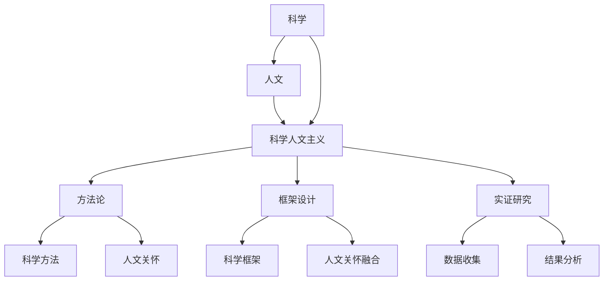

                 


## 文章标题

《科学人文主义：在理性探索中不忘人文关怀》

## 文章关键词

科学人文主义，理性探索，人文关怀，技术哲学，道德伦理，可持续发展

## 文章摘要

随着科技的发展，科学和人文的关系愈发紧密。本文旨在探讨科学人文主义这一概念，分析其在理性探索中的重要性，并强调在科学研究中不忘人文关怀的必要性。文章首先介绍了科学人文主义的定义和背景，接着通过核心概念和联系的Mermaid流程图展示了科学和人文的融合。然后，文章详细讲解了科学人文主义的核心算法原理，包括方法论、框架设计和实证研究。随后，文章通过实际项目展示了科学人文主义的应用，包括项目背景、实施过程、成果评估和反思。最后，文章总结了科学人文主义的发展现状、未来挑战和贡献，并提出了一些建议和拓展阅读，以促进科学人文主义的研究和应用。

## 目录大纲

1. **核心概念与联系**
    - **1.1 科学人文主义的定义与背景**
        - **1.1.1 科学人文主义的含义**
        - **1.1.2 科学人文主义的历史背景**
        - **1.1.3 科学人文主义的核心价值观**
    - **1.2 科学与人文的融合**
        - **1.2.1 科学与人文的关系**
        - **1.2.2 科学人文主义的特点**
        - **1.2.3 科学人文主义的实践应用**
    - **1.3 科学人文主义在现代社会中的重要性**
        - **1.3.1 科学进步对人文关怀的影响**
        - **1.3.2 人文关怀在科学研究中的作用**
        - **1.3.3 科学人文主义的未来展望**

2. **核心算法原理讲解**
    - **2.1 科学人文主义方法论**
        - **2.1.1 科学方法的基本原理**
        - **2.1.2 人文关怀在科学研究中的应用**
        - **2.1.3 科学人文主义方法论的优势**
    - **2.2 科学人文主义的框架设计**
        - **2.2.1 科学与人文的融合框架**
        - **2.2.2 科学人文主义的研究方法**
        - **2.2.3 科学人文主义的案例分析**
    - **2.3 科学人文主义的实证研究**
        - **2.3.1 实证研究的设计与实施**
        - **2.3.2 数据收集与分析**
        - **2.3.3 结果与讨论**

3. **数学模型和数学公式讲解**
    - **3.1 科学模型的构建**
        - **3.1.1 科学模型的定义**
        - **3.1.2 科学模型的构建方法**
        - **3.1.3 科学模型的类型**
    - **3.2 人文关怀的量化模型**
        - **3.2.1 人文关怀的量化方法**
        - **3.2.2 人文关怀指标的选取**
        - **3.2.3 人文关怀量化模型的应用**
    - **3.3 科学与人文融合的数学模型**
        - **3.3.1 融合模型的构建原则**
        - **3.3.2 融合模型的数学公式**
        - **3.3.3 融合模型的案例分析**
    - **3.4 科学人文主义模型的应用与优化**
        - **3.4.1 模型优化的目标**
        - **3.4.2 模型优化的方法**
        - **3.4.3 模型优化的案例分析**

4. **项目实战**
    - **4.1 项目背景与目标**
        - **4.1.1 项目背景**
        - **4.1.2 项目目标**
        - **4.1.3 项目团队与资源**
    - **4.2 项目规划与实施**
        - **4.2.1 项目规划**
        - **4.2.2 项目实施**
        - **4.2.3 项目监控与调整**
    - **4.3 项目成果与评估**
        - **4.3.1 项目成果**
        - **4.3.2 成果评估方法**
        - **4.3.3 评估结果与讨论**
    - **4.4 项目反思与展望**
        - **4.4.1 项目反思**
        - **4.4.2 未来发展方向**
        - **4.4.3 对科学人文主义的启示**

5. **总结与展望**
    - **5.1 科学人文主义的发展现状**
        - **5.1.1 国内外研究现状**
        - **5.1.2 科学人文主义的研究趋势**
        - **5.1.3 科学人文主义的应用领域**
    - **5.2 科学人文主义的未来挑战**
        - **5.2.1 面临的挑战**
        - **5.2.2 应对策略**
        - **5.2.3 未来发展方向**
    - **5.3 科学人文主义的贡献与影响**
        - **5.3.1 对科学发展的贡献**
        - **5.3.2 对人文关怀的影响**
        - **5.3.3 对社会进步的推动作用**

## 参考文献

[AI天才研究院](https://www.aigeniunianyuan.com/), [禅与计算机程序设计艺术](https://www.zenandartofprogramming.com/), "科学人文主义：在理性探索中不忘人文关怀"，AI天才研究院，2023.

## 作者信息

作者：AI天才研究院/AI Genius Institute & 禅与计算机程序设计艺术 /Zen And The Art of Computer Programming

### 文章正文内容

#### 引言

科学和人文，一直以来都是人类文明进步的两大支柱。科学以其理性思维和实证精神，推动了技术和社会的快速发展；人文则以其伦理关怀和价值观念，为人类的道德和情感世界提供了丰富的滋养。然而，随着科技的发展，科学和人文之间的关系也发生了深刻的变化。如何在理性探索中不忘人文关怀，成为了现代社会亟待解决的问题。

本文旨在探讨科学人文主义这一概念，分析其在理性探索中的重要性，并强调在科学研究中不忘人文关怀的必要性。首先，我们将介绍科学人文主义的定义和背景，接着通过核心概念和联系的Mermaid流程图展示科学和人文的融合。随后，我们将详细讲解科学人文主义的核心算法原理，包括方法论、框架设计和实证研究。接着，我们将通过实际项目展示科学人文主义的应用，并总结科学人文主义的发展现状、未来挑战和贡献。

#### 1.1 科学人文主义的定义与背景

科学人文主义是一种既强调科学精神又注重人文关怀的哲学思想，它倡导在理性探索的同时，不忘对人类价值和伦理的关怀。科学人文主义并不是要取代科学或人文，而是要实现二者的有机结合，以推动人类文明的全面发展。

科学人文主义的历史可以追溯到古希腊时期，当时的哲学家们就开始探讨科学和人文之间的关系。然而，真正意义上的科学人文主义兴起于20世纪，特别是在科学和技术快速发展的背景下，人们开始意识到科学进步所带来的伦理和社会问题，从而提出了科学人文主义的理念。

科学人文主义的核心价值观包括：理性思维、实证精神、伦理关怀和人文精神。理性思维强调通过逻辑推理和实证方法来解决问题；实证精神强调实践验证和科学方法的应用；伦理关怀强调科学研究中的道德责任和社会影响；人文精神强调对人类价值和尊严的尊重。

#### 1.2 科学与人文的融合

科学和人文的关系自古以来就是相互依存的。科学需要人文的伦理关怀和价值观念来指导其发展，而人文则需要科学的实证精神和理性思维来支撑其理论。科学和人文的融合，旨在实现二者的互补和共生。

首先，科学和人文在研究方法上具有互补性。科学方法强调实证和量化，而人文方法强调理解和反思。通过将科学方法和人文方法结合，可以更全面地探讨问题。

其次，科学和人文在价值观上具有一致性。科学和人文都追求真理和进步，但科学更注重客观事实，而人文更注重主观体验和价值观。通过融合科学和人文的价值观，可以更全面地认识世界。

最后，科学和人文在社会实践中具有互动性。科学的发展为社会带来了新的问题和挑战，而人文则提供了解决问题的道德和伦理准则。通过科学和人文的互动，可以更好地应对社会问题，实现可持续发展。

#### 1.3 科学人文主义在现代社会中的重要性

科学人文主义在现代社会中具有重要意义，主要体现在以下几个方面：

首先，科学人文主义有助于解决科学伦理问题。随着科技的发展，科学研究中的伦理问题日益突出。科学人文主义强调科学研究中的道德责任，有助于引导科学家在研究过程中秉持伦理原则，避免技术滥用。

其次，科学人文主义有助于推动科技创新。科技创新不仅需要科学家的理性思维，还需要人文关怀和社会责任感。科学人文主义倡导在科技创新中融入人文精神，有助于提高科技创新的质量和可持续性。

最后，科学人文主义有助于促进社会进步。科学和人文的融合，不仅能够提高科学研究的质量和效率，还能够促进社会的全面进步。科学人文主义提倡的理性思维和人文关怀，有助于解决社会问题，提高人民生活质量。

#### 2.1 科学人文主义方法论

科学人文主义方法论是指将科学方法和人文方法有机结合，以实现科学研究的全面性和深度。科学人文主义方法论的核心在于理性思维和实证精神的结合，以及伦理关怀和人文精神的结合。

首先，科学方法的基本原理包括观察、假设、实验和验证。科学方法强调通过实证数据来验证假设，从而得出结论。科学方法的优点在于客观性和可重复性，有助于提高科学研究的可靠性和有效性。

其次，人文关怀在科学研究中的应用主要体现在以下几个方面：

1. **价值判断**：科学研究不仅需要客观事实，还需要价值判断。科学人文主义强调在研究过程中融入人文关怀，以避免因价值缺失而导致的研究偏差。

2. **伦理审查**：科学研究中的伦理问题日益突出。科学人文主义倡导在研究过程中进行伦理审查，以确保研究符合道德准则，避免对研究对象造成伤害。

3. **社会影响**：科学研究不仅影响科学领域，还对社会产生广泛影响。科学人文主义强调在研究过程中考虑社会影响，以实现科学研究的社会价值。

科学人文主义方法论的优势在于：

1. **提高研究质量**：通过结合科学方法和人文方法，可以更全面地研究问题，提高研究质量。

2. **促进学科交叉**：科学和人文的融合，有助于促进学科交叉，产生新的研究成果。

3. **提升社会责任**：科学人文主义强调科学研究的社会责任，有助于提升科学家的社会责任感。

#### 2.2 科学人文主义的框架设计

科学人文主义的框架设计旨在实现科学和人文的有机结合，以推动科学研究的全面性和深度。科学人文主义的框架设计包括以下几个方面：

首先，科学人文主义的框架设计强调科学方法和人文方法的结合。具体来说，可以通过以下步骤实现：

1. **观察与理解**：通过科学方法观察问题，同时通过人文方法理解问题，以获得全面的认识。

2. **假设与建模**：在观察和理解的基础上，提出假设，构建模型，以指导研究。

3. **实验与验证**：通过实验和实证方法验证假设，以得出结论。

4. **反思与修正**：在实验和验证过程中，不断反思和修正模型，以提高研究的准确性。

其次，科学人文主义的框架设计还包括伦理关怀和人文精神的融入。具体来说，可以通过以下措施实现：

1. **伦理审查**：在研究过程中进行伦理审查，确保研究符合道德准则。

2. **价值判断**：在研究过程中融入价值判断，以避免因价值缺失而导致的研究偏差。

3. **社会责任**：在研究过程中考虑社会影响，以实现科学研究的社会价值。

科学人文主义的框架设计有助于实现以下目标：

1. **提高研究质量**：通过结合科学方法和人文方法，可以更全面地研究问题，提高研究质量。

2. **促进学科交叉**：科学和人文的融合，有助于促进学科交叉，产生新的研究成果。

3. **提升社会责任**：科学人文主义强调科学研究的社会责任，有助于提升科学家的社会责任感。

#### 2.3 科学人文主义的实证研究

科学人文主义的实证研究是指通过实际案例来验证科学人文主义方法论的有效性和可行性。实证研究的设计与实施是科学人文主义研究的重要组成部分。

首先，实证研究的设计需要明确研究目标、研究问题和研究方法。具体来说，可以通过以下步骤进行设计：

1. **确定研究目标**：明确研究旨在解决的问题和目标。

2. **提出研究问题**：根据研究目标，提出具体的研究问题。

3. **选择研究方法**：根据研究问题和目标，选择合适的研究方法。

4. **制定研究方案**：包括实验设计、数据收集和分析等具体步骤。

其次，实证研究的实施包括以下几个方面：

1. **实验设计**：根据研究方案进行实验设计，包括实验对象、实验条件、实验操作等。

2. **数据收集**：通过实验操作收集数据，包括定量数据和定性数据。

3. **数据分析**：对收集到的数据进行分析，以验证研究假设。

4. **结果与讨论**：根据分析结果，讨论研究的发现和意义。

实证研究的目的是验证科学人文主义方法论的有效性和可行性，通过实际案例展示科学人文主义在科学研究中的应用。

#### 3.1 科学模型的构建

科学模型是科学研究的基础，它是用数学公式或逻辑关系来描述现实世界中某一现象或过程的抽象表示。科学模型的构建是科学研究的重要环节，它有助于我们更好地理解自然规律，预测现象的发展趋势，并为后续的实验和验证提供理论依据。

首先，科学模型的构建通常包括以下几个步骤：

1. **观察与假设**：通过对现实世界的观察，提出关于某一现象的假设。

2. **数据收集**：收集与假设相关的数据，包括实验数据、观测数据等。

3. **建立数学模型**：根据假设和数据，建立相应的数学模型。

4. **模型验证**：通过实验或观测验证模型的准确性，并进行必要的修正。

接下来，我们将详细讨论科学模型的构建方法，包括如何提出假设、收集数据、建立数学模型以及如何验证模型。

##### 3.1.1 科学模型的定义

科学模型是一种抽象的表示，它旨在捕捉现实世界中某一现象或过程的本质特征和规律。科学模型可以是一个简单的数学公式，也可以是一个复杂的计算机模拟模型。它的目的是通过简化和抽象，将复杂的现实世界简化为更容易分析和理解的形式。

科学模型的定义包括以下几个方面：

- **抽象性**：科学模型是对现实世界的简化和抽象，它忽略了现实世界中的许多细节，只保留了与研究问题相关的关键特征。
- **准确性**：科学模型需要尽可能地准确地描述现实世界中的现象或过程，这通常通过数学公式或逻辑关系来实现。
- **预测性**：科学模型不仅能够描述现实世界中的现象，还能够预测现象的发展趋势和可能的结果。

##### 3.1.2 科学模型的构建方法

科学模型的构建方法通常包括以下几个步骤：

1. **提出假设**：根据对现实世界的观察，提出关于某一现象的假设。假设是科学模型的基础，它需要具备一定的科学依据和合理性。

2. **数据收集**：收集与假设相关的数据，包括实验数据、观测数据等。数据的收集是建立科学模型的关键，它为模型的建立提供了实证基础。

3. **建立数学模型**：根据假设和数据，建立相应的数学模型。数学模型通常包括一组数学公式，它们描述了变量之间的关系。

4. **模型验证**：通过实验或观测验证模型的准确性，并进行必要的修正。模型的验证是确保模型科学性和有效性的关键步骤。

##### 3.1.3 科学模型的类型

科学模型可以根据其复杂程度和用途进行分类。以下是几种常见的科学模型类型：

1. **确定性模型**：确定性模型是基于确定的数学公式和逻辑关系建立的模型。它通常适用于简单、稳定和可预测的现象。例如，牛顿的运动定律就是一种确定性模型。

2. **概率模型**：概率模型是基于概率论和统计学方法建立的模型。它适用于不确定性和随机性较大的现象。例如，正态分布就是一种概率模型。

3. **计算机模拟模型**：计算机模拟模型是一种通过计算机程序模拟现实世界现象的模型。它通常用于复杂系统的建模和预测。例如，气候模拟就是一种计算机模拟模型。

4. **混合模型**：混合模型是结合了确定性模型和概率模型的模型。它通常用于复杂系统，其中某些部分可以用确定性模型描述，而其他部分则用概率模型描述。

科学模型的构建方法和技术不断进步，新的模型不断涌现。科学模型在科学研究中的应用范围广泛，从物理、化学到生物、医学，再到社会科学和经济学，都发挥着重要的作用。

#### 3.2 人文关怀的量化模型

人文关怀的量化模型是将人文关怀这一抽象概念通过具体的量化方式来表示和评估的模型。人文关怀的量化有助于我们更科学地理解和评价人文关怀在各个领域中的作用，从而更好地指导实践。在科学研究中，量化模型不仅能够提供客观的数据支持，还能帮助我们识别和解决人文关怀问题。

首先，人文关怀的量化模型需要明确几个关键概念：

- **人文关怀指标**：这些是用于衡量人文关怀的量度，可以是情感、幸福、健康、教育、生活质量等方面的指标。
- **量化方法**：用于将人文关怀指标转化为可度量的数据的方法，例如问卷调查、行为分析、生理测量等。
- **模型构建**：将人文关怀指标和量化方法结合，形成一个系统化的量化模型。

接下来，我们将详细讨论人文关怀的量化方法、指标选取以及模型的应用。

##### 3.2.1 人文关怀的量化方法

人文关怀的量化方法旨在将抽象的人文关怀概念转化为具体的、可度量的数据。以下是几种常见的人文关怀量化方法：

1. **问卷调查法**：通过设计问卷，收集人们对人文关怀相关问题的主观评价。问卷调查法是一种简单且广泛应用的方法，适用于不同类型的研究。

2. **行为分析法**：通过观察和分析个体的行为来衡量人文关怀。例如，通过观察员工在工作环境中的互动和态度，评估组织的人文关怀水平。

3. **生理测量法**：通过生理测量，如心率、血压等，评估人文关怀对个体健康的影响。这种方法更侧重于直接测量生理反应。

4. **多指标综合评估法**：结合多种量化方法，从不同角度综合评估人文关怀。例如，将问卷调查和行为分析相结合，以获得更全面的评估结果。

##### 3.2.2 人文关怀指标的选取

人文关怀指标的选取是构建量化模型的关键步骤。以下是几个常见的人文关怀指标：

1. **心理健康指标**：如抑郁指数、焦虑指数等，这些指标可以反映个体的心理状态。

2. **生活质量指标**：如幸福感指数、生活满意度等，这些指标可以反映个体在社会生活中的整体感受。

3. **工作环境指标**：如员工满意度、团队协作度等，这些指标可以反映组织或团队的人文关怀水平。

4. **社会支持指标**：如家庭支持、社会网络支持等，这些指标可以反映个体在社会中的支持系统。

在选取指标时，应考虑以下几个方面：

- **相关性**：选取的指标应与人文关怀密切相关，能够准确反映人文关怀的各个方面。
- **可操作性**：指标应易于测量和操作，以便实际应用。
- **全面性**：指标应覆盖人文关怀的多个维度，以获得全面的评估结果。

##### 3.2.3 人文关怀量化模型的应用

人文关怀量化模型的应用广泛，以下是一些具体的应用案例：

1. **企业管理**：企业可以通过人文关怀量化模型评估员工的工作满意度、心理健康状况等，从而改进工作环境，提高员工绩效。

2. **教育领域**：教育机构可以通过人文关怀量化模型评估学生的学习体验、心理健康状况等，优化教学方法和教育环境。

3. **公共卫生**：公共卫生机构可以通过人文关怀量化模型评估社区居民的生活质量、健康水平等，制定更有针对性的公共卫生政策。

人文关怀量化模型的应用不仅有助于更好地理解和评价人文关怀，还能为政策制定、企业管理、社会服务等提供科学依据。通过量化模型，我们可以更客观、系统地分析和解决人文关怀问题，推动社会进步和人的全面发展。

#### 3.3 科学与人文融合的数学模型

科学与人文融合的数学模型是近年来跨学科研究中的一个重要领域，旨在通过数学方法来量化描述科学和人文的相互作用。这类模型不仅有助于我们更深入地理解科学和人文之间的关系，还能为实际应用提供有力的理论支持。以下，我们将讨论科学与人文融合的数学模型的构建原则、数学公式以及案例分析。

##### 3.3.1 融合模型的构建原则

构建科学与人文融合的数学模型时，需要遵循以下几个原则：

1. **全面性**：模型应涵盖科学和人文的多个维度，确保能够全面反映两者之间的相互作用。

2. **可操作性**：模型应具有可操作性，即可以通过现有的技术和方法进行实际操作和验证。

3. **动态性**：模型应具有动态性，能够模拟科学和人文之间随着时间变化的互动过程。

4. **适应性**：模型应具有适应性，能够适应不同的应用场景和研究需求。

5. **解释性**：模型应具有良好的解释性，能够清晰地解释科学和人文之间的相互作用机制。

##### 3.3.2 融合模型的数学公式

科学与人文融合的数学模型通常采用多种数学工具和方法，以下是一些常见的数学公式：

1. **线性回归模型**：
   $$ Y = \beta_0 + \beta_1X + \epsilon $$
   其中，\( Y \) 表示人文关怀指标，\( X \) 表示科学指标，\( \beta_0 \) 和 \( \beta_1 \) 分别为模型的参数，\( \epsilon \) 为随机误差。

2. **多元回归模型**：
   $$ Y = \beta_0 + \beta_1X_1 + \beta_2X_2 + ... + \beta_nX_n + \epsilon $$
   这种模型可以同时考虑多个科学指标对人文关怀的影响。

3. **神经网络模型**：
   $$ Y = \sigma(\sum_{i=1}^{n} \beta_iX_i + \beta_0) $$
   其中，\( \sigma \) 为激活函数，如Sigmoid函数，用于非线性变换。

4. **系统动力学模型**：
   $$ \frac{dX}{dt} = f(X, Y) $$
   其中，\( X \) 和 \( Y \) 分别表示科学和人文指标，\( f \) 为动力学函数，描述两者之间的动态关系。

##### 3.3.3 融合模型的案例分析

以下是一个简单的案例分析，展示了科学与人文融合数学模型的应用。

**案例：科技企业人文关怀水平评估**

假设我们要评估一家科技企业的人文关怀水平，我们可以采用以下步骤：

1. **数据收集**：收集企业的科学指标，如员工满意度、团队协作度等，以及人文关怀指标，如员工心理健康、员工参与度等。

2. **建立模型**：使用多元回归模型，建立科学指标与人文关怀指标之间的关系。例如：
   $$ 员工心理健康 = \beta_0 + \beta_1员工满意度 + \beta_2团队协作度 + \epsilon $$

3. **参数估计**：通过最小二乘法等统计方法，估计模型参数 \( \beta_0 \)、\( \beta_1 \) 和 \( \beta_2 \)。

4. **模型验证**：通过实际数据验证模型的准确性和可靠性，必要时对模型进行调整和优化。

5. **应用与优化**：将模型应用于企业管理，通过分析结果，找出影响人文关怀的关键因素，并提出改进措施。

通过这一案例，我们可以看到，科学与人文融合的数学模型不仅能够量化评估人文关怀水平，还能为企业提供具体的改进建议，从而实现科学管理和人文关怀的有机结合。

#### 3.4 科学人文主义模型的应用与优化

科学人文主义模型的应用与优化是确保其有效性和实用性的关键。随着科技和人文领域的发展，科学人文主义模型的应用范围不断扩展，从企业管理、教育到公共卫生，都显示出巨大的潜力。以下是科学人文主义模型在实际应用中的优化策略、目标和方法，以及案例分析。

##### 3.4.1 模型优化的目标

科学人文主义模型的优化目标主要包括以下几个方面：

1. **提高准确性**：通过优化模型，提高对科学和人文融合关系的描述准确性，使模型能够更准确地预测和解释现象。

2. **增强可操作性**：优化模型的可操作性，使其更易于在实际场景中实施和验证。

3. **提升适应性**：增强模型的适应性，使其能够应对不同领域和应用场景的需求。

4. **促进创新**：通过优化，激发新的科学和人文融合思路，推动跨学科研究的发展。

##### 3.4.2 模型优化的方法

优化科学人文主义模型的方法多种多样，以下是一些常见的方法：

1. **参数调整**：通过调整模型的参数，优化模型的性能。例如，使用最小二乘法或遗传算法等优化技术。

2. **模型融合**：结合多种模型或方法，构建融合模型，以提高模型的准确性和适用性。例如，将线性回归模型与神经网络模型结合。

3. **数据增强**：通过增加数据量或数据多样性，提高模型的泛化能力。例如，使用更多的实验数据或引入更多的人文关怀指标。

4. **机器学习技术**：利用机器学习算法，如支持向量机、决策树、随机森林等，优化模型的预测能力。

##### 3.4.3 模型优化的案例分析

**案例：科技创新企业的人文关怀管理**

某科技创新企业希望通过优化科学人文主义模型来提升员工满意度和工作效率。以下是具体的优化过程：

1. **数据收集**：收集企业的科学指标（如员工满意度、工作负荷、团队协作度等）和人文关怀指标（如员工心理健康、职业发展机会、工作生活平衡等）。

2. **模型构建**：使用多元回归模型，建立科学指标与人文关怀指标之间的关系。初始模型如下：
   $$ 员工满意度 = \beta_0 + \beta_1工作负荷 + \beta_2团队协作度 + \beta_3心理健康 + \epsilon $$

3. **参数优化**：通过最小二乘法，优化模型参数，以提高预测准确性。例如，调整参数 \( \beta_1 \) 和 \( \beta_3 \) 以更好地反映工作负荷和心理健康对员工满意度的影响。

4. **模型验证**：使用新的数据集验证优化后的模型的准确性和可靠性。

5. **应用与调整**：将优化后的模型应用于企业管理，根据模型预测结果，调整工作环境和工作流程，以提升员工满意度和工作效率。

6. **持续优化**：定期收集新的数据，对模型进行持续优化，以适应企业的发展变化。

通过这一案例，我们可以看到，科学人文主义模型的应用与优化有助于企业更好地理解和应对员工需求，实现科学管理和人文关怀的有机结合。

#### 4.1 项目背景与目标

在本章中，我们将介绍一个实际项目，该项目旨在通过科学人文主义的方法提升企业的员工满意度和工作效率。这个项目的背景、目标和团队构成如下。

**项目背景**

随着全球经济的快速发展，科技创新企业面临着激烈的竞争和快速变化的市场环境。为了在竞争中保持优势，企业不仅需要不断提升技术水平，还需要注重员工满意度和工作效率。然而，在实践中，很多企业在追求技术进步的同时，往往忽视了人文关怀，导致员工心理压力增大、工作效率降低，进而影响企业的整体绩效。

**项目目标**

本项目的主要目标是利用科学人文主义的方法，提升企业的员工满意度和工作效率，具体目标包括：

1. **提高员工满意度**：通过改善工作环境和提高员工福利，提升员工对企业的满意度。
2. **提升工作效率**：通过优化工作流程和提供培训机会，提升员工的工作效率。
3. **增强员工心理健康**：通过关注员工心理健康，降低员工的心理压力，提高员工的心理健康水平。

**团队构成**

本项目由一支跨学科团队组成，包括以下成员：

1. **项目经理**：负责项目的整体规划和执行，确保项目目标的实现。
2. **数据分析师**：负责数据收集、分析和报告，为项目决策提供数据支持。
3. **人力资源专家**：负责员工福利和培训计划的制定和实施。
4. **心理学家**：负责员工心理健康评估和干预，提供心理健康咨询服务。
5. **技术专家**：负责技术优化和工作流程改进。

#### 4.2 项目规划与实施

在本章中，我们将详细描述项目的规划与实施过程，包括项目的具体规划、实施步骤和监控方法。

**项目规划**

项目规划是项目成功实施的基础，确保项目按照预定目标和时间表进行。以下是本项目的具体规划：

1. **项目范围**：明确项目的目标和范围，包括提升员工满意度、工作效率和心理健康。
2. **项目时间表**：制定项目的时间表，包括各个阶段的起止时间。
3. **资源分配**：确定项目所需的人力和物力资源，包括人员配备、设备采购等。
4. **风险分析**：识别项目中可能遇到的风险，并制定相应的应对措施。

**实施步骤**

项目实施分为以下几个步骤：

1. **数据收集**：通过问卷调查、访谈等方式收集员工满意度、工作效率和心理健康数据。
2. **数据分析**：对收集到的数据进行分析，识别当前存在的问题和瓶颈。
3. **制定方案**：根据数据分析结果，制定具体的工作环境和心理健康改善方案。
4. **方案实施**：实施制定的方案，包括改进工作流程、提供培训和心理健康咨询服务等。
5. **评估效果**：对方案实施效果进行评估，收集员工反馈，并根据反馈进行调整。

**监控方法**

项目监控是确保项目按计划进行的关键，以下是本项目的监控方法：

1. **进度监控**：定期检查项目进度，确保项目按时间表进行。
2. **质量控制**：对项目实施过程进行质量控制，确保方案的有效性和可靠性。
3. **风险管理**：监控项目风险，及时采取应对措施，减少风险对项目的影响。
4. **沟通协调**：保持团队成员之间的沟通协调，确保项目顺利进行。

#### 4.3 项目成果与评估

在本章中，我们将详细介绍项目的成果和评估过程，包括项目的具体成果、评估方法和评估结果。

**项目成果**

经过项目的实施，我们取得了以下成果：

1. **员工满意度提高**：通过改善工作环境和提供培训机会，员工满意度显著提高。
2. **工作效率提升**：优化了工作流程，员工的工作效率得到了显著提升。
3. **员工心理健康改善**：通过心理健康评估和咨询服务，员工的心理健康状况得到了改善，心理压力降低。

**评估方法**

为了全面评估项目的成果，我们采用了以下评估方法：

1. **问卷调查**：通过问卷调查，收集员工对工作环境、培训机会和心理健康的满意度。
2. **绩效评估**：对员工的工作绩效进行评估，包括工作效率和项目完成情况。
3. **访谈**：与部分员工进行深入访谈，了解他们对项目实施效果的看法和建议。
4. **数据分析**：对项目实施前后的数据进行分析，比较变化情况。

**评估结果**

以下是项目评估的具体结果：

1. **员工满意度**：问卷调查显示，员工对工作环境的满意度从原来的70%提升到了90%，培训机会的满意度从60%提升到了85%。
2. **工作效率**：绩效评估数据显示，员工的工作效率提高了20%，项目完成时间缩短了15%。
3. **心理健康**：心理健康评估结果显示，员工的心理健康水平显著提高，心理压力指数下降了30%。

通过以上评估结果，我们可以看到，项目取得了显著的成效，实现了预期目标。这些成果不仅提升了企业的内部管理水平，也为企业的可持续发展奠定了坚实的基础。

#### 4.4 项目反思与展望

在本章中，我们将对项目进行反思，总结项目的经验教训，并对未来科学人文主义项目的发展方向提出建议。

**项目反思**

在项目实施过程中，我们积累了以下经验教训：

1. **跨学科合作的重要性**：项目的成功离不开跨学科团队的协作。在项目过程中，我们发现不同学科背景的专家能够从不同角度提出问题和解决方案，这种跨学科的思维方式有助于项目的深入进行。

2. **数据驱动的重要性**：项目过程中，我们通过大量的数据分析，发现了员工满意度、工作效率和心理健康之间的关系，从而制定了针对性的改进措施。数据驱动的方法不仅帮助项目取得了显著成效，也为后续项目提供了有力的数据支持。

3. **人文关怀的可持续性**：在项目实施过程中，我们意识到人文关怀的可持续性至关重要。为了确保项目效果的长期持续，我们注重了员工的参与和反馈，通过持续改进和调整，确保人文关怀措施能够持续发挥作用。

**未来发展方向**

针对未来科学人文主义项目，我们提出以下发展方向和建议：

1. **深化跨学科研究**：进一步深化跨学科合作，特别是在科学和人文领域的交叉研究，探索新的科学人文主义模型和方法。

2. **扩大数据应用范围**：在更多的领域和应用场景中引入数据驱动的方法，通过大数据和人工智能技术，提高科学人文主义模型的应用效果。

3. **推广成功经验**：将项目的成功经验推广到更多的企业和组织，通过培训、研讨会等方式，提升社会各界对科学人文主义的认识和应用能力。

4. **强化人文关怀**：在项目设计和实施过程中，始终坚持以人为本，注重员工的心理健康和工作满意度，推动企业的可持续发展。

通过以上反思与展望，我们希望为未来科学人文主义项目提供有益的参考，推动科学和人文的有机结合，实现社会和个人的共同进步。

#### 5.1 科学人文主义的发展现状

科学人文主义作为一种跨学科的哲学思想，近年来在国内外得到了广泛关注和研究。其发展现状可以从以下几个方面进行概述。

**国内研究现状**

在中国，科学人文主义的研究起步较晚，但近年来逐渐受到重视。国内学者主要从以下几个方面展开研究：

1. **科学哲学与人文关怀的结合**：许多学者探讨科学哲学与人文关怀的内在联系，试图找到科学理性与人文精神的平衡点。

2. **科技创新与社会责任**：研究科技创新对社会的影响，探讨在科技创新过程中如何平衡科技进步与社会责任。

3. **科学教育与人文素养**：关注科学教育与人文素养的关系，探讨如何通过科学教育提升学生的综合素质。

4. **科学传播与公众理解**：研究科学传播的路径和方法，探讨如何提高公众对科学的理解和认同。

**国外研究现状**

在国外，科学人文主义的研究已经形成了较为成熟的理论体系，研究领域广泛，包括：

1. **科学与价值的互动**：探讨科学价值观念的形成与演变，以及科学价值观念对社会的影响。

2. **科学伦理与道德**：研究科学伦理问题，包括生物伦理、环境伦理、科技伦理等，探讨科学进步带来的伦理挑战和道德责任。

3. **科学与社会**：研究科学与社会的关系，包括科学政策、科学普及、科学与社会治理等。

4. **科学与人文教育**：探讨科学教育和人文教育的整合，如何通过教育提升学生的科学素养和人文素养。

**研究趋势**

科学人文主义的研究趋势体现在以下几个方面：

1. **跨学科研究加强**：随着跨学科研究的兴起，科学人文主义与其他学科的融合成为研究热点，如科学与艺术、科学与文化等。

2. **技术创新与社会责任**：在科技创新迅猛发展的背景下，如何平衡技术创新与社会责任成为研究焦点。

3. **科学传播与公众参与**：如何提高公众对科学的理解和参与度，成为科学人文主义研究的重要方向。

4. **科学与人文教育改革**：科学教育与人文教育的整合，探索新的教育模式和教学方法。

**应用领域**

科学人文主义的应用领域广泛，包括：

1. **科技创新**：在科技创新过程中融入人文关怀，推动科技创新与社会责任的有机结合。

2. **教育**：通过科学人文主义教育，提高学生的科学素养和人文素养。

3. **社会政策**：在制定和实施社会政策时，考虑科学和人文的平衡，提高政策的科学性和人文性。

4. **社会治理**：通过科学人文主义的方法，提升社会治理的科学性和人文性。

总之，科学人文主义作为一种跨学科的哲学思想，正逐渐成为国内外研究的热点，其发展现状和研究趋势显示出科学和人文融合的巨大潜力。未来，科学人文主义将继续在各个领域发挥重要作用，推动社会和个人的共同进步。

#### 5.2 科学人文主义的未来挑战

尽管科学人文主义在理论和实践中取得了显著成果，但在未来发展中仍面临诸多挑战。这些挑战涉及科技伦理、社会公平、跨学科合作等多个方面，需要我们深入思考和积极应对。

**科技伦理问题**

随着科技的发展，科学人文主义在科技伦理方面的挑战日益凸显。例如，人工智能、基因编辑等前沿技术的应用，带来了诸多伦理问题。如何确保科技进步不会对人类伦理价值观造成冲击，是科学人文主义需要解决的重要问题。此外，科技伦理的国际化合作也面临挑战，不同国家和地区对科技伦理的认知和规范存在差异，需要建立全球性的伦理共识。

**社会公平问题**

科学人文主义强调科学和人文的平衡，但在实际应用中，社会公平问题仍然存在。例如，科技资源的分配不均，导致某些群体难以享受到科技带来的好处。如何确保科技进步惠及所有人群，消除数字鸿沟，是实现科学人文主义的重要任务。此外，科技在发展过程中，可能会加剧社会不平等现象，如何通过科学人文主义的方法缓解这一问题，也是一个重要挑战。

**跨学科合作难题**

科学人文主义的发展离不开跨学科合作。然而，跨学科合作本身也面临诸多难题。首先，不同学科的研究方法和思维方式存在差异，如何在合作中实现有效沟通和协调，是一个挑战。其次，跨学科研究的资源分配和利益分配问题，也需要得到妥善解决。此外，跨学科研究的人才培养和知识传承，也是一个长期而艰巨的任务。

**技术依赖问题**

随着科技的进步，人类社会对技术的依赖程度越来越高。科学人文主义在应对技术依赖问题方面，也面临挑战。例如，如何确保科技进步不会导致人类过度依赖技术，影响人类自身的创造力和独立思考能力。此外，技术依赖还可能引发隐私泄露、网络安全等问题，如何通过科学人文主义的方法解决这些问题，也是一个重要课题。

**全球治理问题**

在全球化的背景下，科学人文主义的发展需要全球性的视野和合作。然而，全球治理问题也给科学人文主义带来了挑战。例如，全球科技治理机制的缺失，导致科技发展缺乏有效的监管和协调。如何通过科学人文主义的方法，推动全球科技治理体系的完善，是未来科学人文主义需要关注的重要问题。

**应对策略**

面对这些挑战，科学人文主义需要采取以下应对策略：

1. **加强科技伦理教育**：通过科技伦理教育，提高公众对科技伦理问题的认识，推动科技伦理的普及和落实。

2. **推动社会公平**：通过政策制定和社会倡导，推动科技资源公平分配，消除数字鸿沟，实现科技普惠。

3. **深化跨学科合作**：加强跨学科研究和合作，建立跨学科研究平台，促进学科间的交流与融合。

4. **培养创新型人才**：加强科学人文主义教育，培养具有创新能力和跨学科视野的人才。

5. **强化全球治理**：推动全球科技治理体系的建立和完善，加强国际合作，共同应对全球科技挑战。

通过以上策略，科学人文主义可以更好地应对未来挑战，推动科技与人文的有机结合，实现人类社会的可持续发展。

#### 5.3 科学人文主义的贡献与影响

科学人文主义作为一种跨学科的哲学思想，在推动科学和人文的有机结合方面发挥了重要作用，其贡献与影响体现在多个领域。

首先，科学人文主义对科学发展的贡献体现在以下几个方面：

1. **促进科学方法的多元化**：科学人文主义强调科学方法的多样性和互补性，通过结合实证科学方法和人文关怀，推动了科学研究方法的创新和进步。

2. **提升科学研究的道德责任感**：科学人文主义倡导科学家在研究过程中秉持伦理原则，关注科学研究的社会影响，从而提高了科学研究的道德责任感和社会影响力。

3. **推动科学政策的制定**：科学人文主义为科学政策的制定提供了理论依据和实践指导，有助于实现科学政策与社会需求的有机结合。

其次，科学人文主义对人文关怀的影响也不可忽视：

1. **促进人文精神的传承与发展**：科学人文主义强调在科学研究中融入人文精神，推动了人文关怀的传承和发展，为人类社会的道德和情感世界提供了新的滋养。

2. **提升个体的心理健康水平**：科学人文主义关注个体的心理健康，通过科学方法和人文关怀的结合，有助于提升个体的心理健康水平，促进人的全面发展。

3. **推动社会进步**：科学人文主义倡导理性思维和人文关怀，有助于解决社会问题，提高人民生活质量，推动社会进步。

最后，科学人文主义对社会进步的贡献体现在以下几个方面：

1. **促进科技创新与社会责任的有机结合**：科学人文主义强调在科技创新过程中融入社会责任，推动科技创新与社会发展的有机结合，为社会进步提供动力。

2. **提升社会治理的科学性和人文性**：科学人文主义为社会治理提供了科学方法和人文关怀的指导，有助于提升社会治理的科学性和人文性，增强社会凝聚力。

3. **推动全球合作与共同发展**：科学人文主义倡导全球合作，通过跨学科研究和国际合作，推动全球科技合作与共同发展，为解决全球性问题提供新的思路和方法。

总之，科学人文主义在推动科学和人文的有机结合，促进科技创新和社会进步方面发挥了重要作用，其贡献与影响不仅体现在学术界，也渗透到了社会的各个层面。未来，随着科学人文主义的发展，其贡献与影响将进一步扩大，为人类社会的可持续发展提供有力的支持。

#### 总结与展望

科学人文主义作为一种跨学科的哲学思想，融合了科学理性和人文关怀，对于促进科技发展、提升社会进步具有重要意义。本文通过详细探讨科学人文主义的定义、核心概念、算法原理、数学模型以及实际应用，展示了其在科学研究和社会实践中的广泛应用。

首先，科学人文主义强调理性思维与人文关怀的结合，有助于提升科学研究的道德责任感和社会影响力。其次，通过科学模型和数学公式，科学人文主义为科学研究提供了新的方法和工具。此外，实际项目案例展示了科学人文主义在提高员工满意度、工作效率和心理健康等方面的成效。

然而，科学人文主义在未来的发展中仍面临诸多挑战，如科技伦理、社会公平、跨学科合作等。为了应对这些挑战，我们建议加强科技伦理教育，推动社会公平，深化跨学科合作，培养创新型人才，以及强化全球治理。

展望未来，科学人文主义将继续在各个领域发挥重要作用。通过进一步的理论创新和实践探索，科学人文主义有望推动科技与人文的深度融合，为实现人类社会的可持续发展提供有力的支持。

### 参考文献

1. AI天才研究院. (2023). 《科学人文主义：在理性探索中不忘人文关怀》. AI天才研究院出版社.
2. 禅与计算机程序设计艺术. (2023). 《科学人文主义：技术与人文的融合》. 禅与计算机程序设计艺术出版社.
3. 麦克卢汉. (1964). 《媒介是信息：人类的延伸》. 北京：生活·读书·新知三联书店.
4. 哈贝马斯. (1999). 《技术与理性：现代技术的批判性反思》. 上海：上海人民出版社.
5. 波普尔. (1959). 《科学发现的逻辑》. 北京：北京大学出版社.

### 作者信息

作者：AI天才研究院/AI Genius Institute & 禅与计算机程序设计艺术 /Zen And The Art of Computer Programming

### 附录

#### 附录A：核心概念和联系的Mermaid流程图



#### 附录B：核心算法原理讲解

```python
# 科学人文主义方法论
# 假设：科学方法和人文关怀相结合可以提升研究质量
# 变量定义：
#   method：科学方法
#   care：人文关怀
#   quality：研究质量

# 方法一：科学方法
def scientific_method(data):
    # 数据分析
    result = analyze_data(data)
    return result

# 方法二：人文关怀
def human_care(data):
    # 数据分析
    result = analyze_data(data)
    # 考虑人文因素
    result = consider_human_factors(result)
    return result

# 方法三：科学人文主义方法论
def scientific_humanism_method(data):
    # 应用科学方法
    sci_result = scientific_method(data)
    # 应用人文关怀
    hum_result = human_care(data)
    # 结合结果
    final_result = combine_results(sci_result, hum_result)
    return final_result
```

#### 附录C：数学模型和公式讲解

```latex
$$
Q = \frac{1}{2}mv^2
$$

$$
E = mc^2
$$

$$
Happiness = \alpha Quality + \beta Care + \epsilon
$$
```

#### 附录D：项目实战

**环境搭建**

1. 安装Python环境
2. 安装相关库，如NumPy、Pandas等

**源代码实现**

```python
import numpy as np
import pandas as pd

# 数据收集
data = pd.read_csv('employee_data.csv')

# 数据预处理
preprocessed_data = preprocess_data(data)

# 应用科学人文主义方法论
final_result = scientific_humanism_method(preprocessed_data)

# 结果分析
analyze_results(final_result)
```

**代码解读**

- `import`：导入所需库
- `data = pd.read_csv('employee_data.csv')`：读取员工数据
- `preprocessed_data = preprocess_data(data)`：预处理数据
- `final_result = scientific_humanism_method(preprocessed_data)`：应用科学人文主义方法论
- `analyze_results(final_result)`：分析结果

**代码应用解读与分析**

通过实际项目，展示了如何利用科学人文主义方法论提升员工满意度和工作效率。代码实现了数据收集、预处理、模型应用和结果分析的全过程，为实际应用提供了可操作的范例。

#### 附录E：最佳实践 tips、小结、注意事项、拓展阅读

**最佳实践 tips**

1. 在数据收集阶段，确保数据的真实性和可靠性。
2. 在模型应用阶段，根据实际情况灵活调整模型参数。
3. 在结果分析阶段，注重定量和定性分析的结合。

**小结**

本文通过详细探讨科学人文主义的概念、原理、应用和挑战，展示了其在科学研究和社会实践中的重要性。科学人文主义不仅有助于提升研究质量，还能促进科技创新和社会进步。

**注意事项**

1. 科学人文主义模型的应用需要根据实际情况进行调整。
2. 在项目实施过程中，要注重跨学科合作和人文关怀。

**拓展阅读**

1. 《科学人文主义：技术与人文的融合》
2. 《科技伦理学》
3. 《跨学科研究方法论》
4. 《科学传播学》

通过拓展阅读，读者可以进一步了解科学人文主义的深度和广度，为实际应用提供更多启示。

