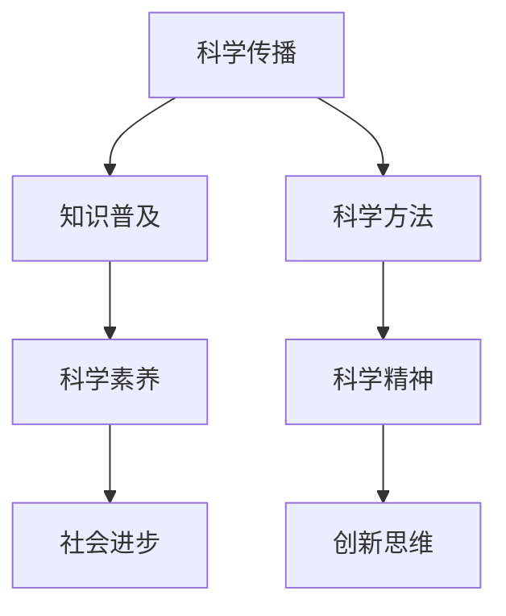

                 

### 文章标题：科学传播在增进世界可理解性中的作用

### 关键词：科学传播，可理解性，知识普及，信息技术，人工智能

### 摘要：
科学传播是连接科学领域与普通公众的桥梁，对于提高全球公众的科学素养、增进世界可理解性具有至关重要的作用。本文旨在探讨科学传播的核心概念、方法与手段，分析其面临的挑战与机遇，并通过实际案例展示其效果，展望科学传播的未来趋势。文章结构包括五部分：科学传播的基本概念、方法与手段、挑战与机遇、实际案例以及未来趋势。通过逻辑清晰、结构紧凑的分析，本文旨在为科学传播的研究与实践提供新的视角和思路。

### 文章正文

#### 引言

在当今信息爆炸的时代，科学知识的传播变得前所未有的重要。科学传播不仅涉及科学知识的教育与普及，更关乎社会公众的科学素养提升，进而影响整个社会的文明进步。然而，科学传播并非简单的信息传递，它需要深入理解科学概念、科学方法以及公众需求，以构建科学知识与社会需求之间的桥梁。

本文旨在探讨科学传播在增进世界可理解性中的作用，通过以下五个部分展开论述：

1. **科学传播的基本概念**：介绍科学传播的定义、历史和发展趋势。
2. **科学传播的方法与手段**：详细阐述科学传播的各种手段和技巧。
3. **科学传播的挑战与机遇**：分析科学传播面临的挑战以及抓住机遇的方法。
4. **科学传播的实际案例**：通过具体的实例展示科学传播的效果。
5. **科学传播的未来趋势**：预测科学传播的未来发展方向。

#### 科学传播的基本概念

##### 1.1 科学传播的定义

科学传播是指将科学知识、科学方法和科学精神通过不同的途径传递给公众的过程。它不仅包括科学知识的普及，还涵盖了科学方法的推广以及科学精神的传播。科学传播的目标是提高公众的科学素养，促进科学思维的形成，增进公众对科学的理解与尊重。

##### 1.2 科学传播的历史和发展趋势

科学传播的历史可以追溯到古希腊时期，但真正意义上的科学传播始于文艺复兴时期。随着印刷术的发明和普及，科学知识得以迅速传播。20世纪以来，随着广播、电视、互联网等新兴媒体的发展，科学传播进入了多媒体时代。近年来，科学传播呈现出以下几个趋势：

- **数字化与网络化**：互联网使得科学传播更加便捷和高效，各种科学资源通过网络平台得以快速分享。
- **多样化与个性化**：科学传播的手段和形式日益多样化，根据不同受众的需求提供个性化的科学知识服务。
- **全球化与本地化**：科学传播跨越国界，实现了全球范围内的知识共享，同时也在本地化方面取得了显著进展。

##### 1.3 科学传播的重要性

科学传播对于提高公众的科学素养具有重要作用。通过科学传播，公众能够更好地理解科学知识，形成科学思维，提高科学批判能力。此外，科学传播还能够促进社会的科技进步和创新发展，增强国家的科技竞争力。

#### 科学传播的方法与手段

##### 2.1 传统方法

传统科学传播方法主要包括图书、报纸、杂志、电视和广播等。这些方法在科学传播的历史上发挥了重要作用，具有以下特点：

- **权威性**：传统媒体具有较高的可信度和权威性，有助于传播准确、权威的科学知识。
- **广泛性**：传统媒体能够覆盖广泛的受众群体，实现科学知识的普及。
- **持久性**：图书、报纸和杂志等具有持久性，可以长期保存和传播科学知识。

##### 2.2 现代方法

随着信息技术的飞速发展，科学传播的方法和手段也不断创新。现代科学传播方法主要包括互联网、社交媒体、移动应用和虚拟现实等。这些方法具有以下特点：

- **互动性**：互联网和社交媒体使得科学传播更加互动和参与性，公众可以实时参与讨论和互动。
- **灵活性**：现代科技手段使得科学传播的形式更加多样和灵活，可以根据不同受众的需求提供个性化的服务。
- **即时性**：互联网和移动应用使得科学信息能够实时更新和传播，提高科学传播的时效性。

##### 2.3 高效技巧

科学传播的高效技巧包括情感化传播、跨界合作、社交媒体运用和数据分析等。这些技巧有助于提高科学传播的效果，具体如下：

- **情感化传播**：通过情感化的手段，如故事化、趣味化，使科学传播更加吸引人，提高公众的兴趣和参与度。
- **跨界合作**：科学传播需要与其他领域（如艺术、文化、教育等）进行跨界合作，形成协同效应，提高科学传播的影响力和效果。
- **社交媒体运用**：利用社交媒体平台进行科学传播，可以扩大传播范围，提高传播效率。
- **数据分析**：通过对科学传播数据进行分析，可以了解公众的需求和兴趣，优化科学传播策略。

#### 科学传播的挑战与机遇

##### 3.1 挑战

科学传播面临诸多挑战，包括信息过载、专业术语普及难、媒体偏见等。为了应对这些挑战，科学传播需要采取以下策略：

- **信息过滤**：通过筛选和过滤，确保科学信息的准确性和权威性，减少信息过载的影响。
- **术语简化**：将专业术语简化为公众易于理解的词汇，降低公众获取科学知识的门槛。
- **媒体自律**：媒体应加强自律，避免传播不实或误导性的科学信息，提高公众的科学素养。

##### 3.2 机遇

随着信息技术的快速发展，科学传播面临着前所未有的机遇。以下是一些重要机遇：

- **人工智能与大数据**：人工智能和大数据技术为科学传播提供了新的工具和方法，可以更好地了解公众需求，提高传播效果。
- **虚拟现实与增强现实**：虚拟现实和增强现实技术使得科学传播更加生动和直观，有助于提高公众的兴趣和参与度。
- **全球合作**：全球合作可以促进科学知识的共享和传播，提高全球公众的科学素养。

#### 科学传播的实际案例

##### 4.1 案例一：某知名科普节目

某知名科普节目通过生动有趣的方式，将复杂的科学知识传递给公众。节目采用故事化的手法，将科学原理融入到故事情节中，使观众在娱乐的同时学习科学知识。节目在社交媒体上引发了广泛的讨论和关注，取得了显著的传播效果。

##### 4.2 案例二：某知名科学博客

某知名科学博客通过深入浅出的文章，向公众传播科学知识。博客作者以通俗易懂的语言，结合实际案例，详细讲解科学原理。博客吸引了大量读者，成为科学传播的重要平台。

##### 4.3 案例三：某国际科学会议

某国际科学会议通过线上和线下相结合的方式，吸引了来自世界各地的科学家和公众参与。会议提供了丰富的科学内容和互动机会，使参与者能够深入交流和学习。会议在科学传播方面发挥了重要作用，促进了国际间的科学合作与交流。

#### 科学传播的未来趋势

##### 5.1 人工智能与科学传播

人工智能在科学传播中具有广泛的应用前景。通过人工智能技术，可以实现对科学信息的自动化处理、分类和推荐，提高科学传播的效率和效果。此外，人工智能还可以用于分析公众需求，为科学传播提供针对性的服务。

##### 5.2 虚拟现实与科学传播

虚拟现实技术为科学传播带来了新的可能性。通过虚拟现实，公众可以身临其境地体验科学实验和科学现象，提高对科学知识的理解和兴趣。虚拟现实技术有望成为未来科学传播的重要手段。

##### 5.3 全球合作与科学传播

全球合作是科学传播的重要趋势。通过国际间的合作，可以共享科学资源、交流科学经验，提高全球公众的科学素养。全球合作有助于解决全球性科学问题，推动科学进步和社会发展。

### 结论

科学传播在增进世界可理解性中发挥着重要作用。通过科学传播，公众能够更好地理解科学知识，提高科学素养，形成科学思维。面对信息时代的挑战，科学传播需要不断创新方法与手段，抓住机遇，应对挑战。未来，科学传播将继续发挥重要作用，为全球公众提供丰富、多样的科学知识和服务。

### 作者信息

作者：AI天才研究院/AI Genius Institute & 禅与计算机程序设计艺术 /Zen And The Art of Computer Programming

本文内容仅供参考，如有侵权或不当之处，请指正。

----------------------------------------------------------------

### 附录

#### 1. Mermaid 流程图

以下是一个简单的 Mermaid 流程图，展示科学传播的核心概念与联系：



#### 2. 伪代码

以下是一个简化的伪代码，用于描述科学传播的核心算法原理：

```plaintext
Algorithm: 科学传播算法

Input: 公众需求，科学知识库
Output: 个性化科学知识服务

1. 初始化知识库和需求库
2. 对知识库进行分类和标签化处理
3. 分析公众需求，提取关键词
4. 利用关键词匹配知识库，筛选相关内容
5. 对筛选结果进行排序，依据相关度和趣味性
6. 生成个性化科学知识服务，推送给用户
7. 记录用户反馈，优化算法和内容推荐
```

#### 3. 数学公式

以下是一些相关的数学公式，用于解释科学传播的相关模型：

```latex
$$
相关性度量 = \frac{\sum_{i=1}^{n} (x_i - \bar{x}) (y_i - \bar{y})}{\sqrt{\sum_{i=1}^{n} (x_i - \bar{x})^2 \sum_{i=1}^{n} (y_i - \bar{y})^2}}
$$`

$$
趣味性得分 = \frac{\sum_{i=1}^{n} f_i \cdot r_i}{\sum_{i=1}^{n} f_i}
$$`

其中，$x_i$ 和 $y_i$ 分别表示知识库中第 $i$ 条知识和用户需求的特征，$\bar{x}$ 和 $\bar{y}$ 分别表示特征的平均值，$f_i$ 表示第 $i$ 条知识的趣味性评分，$r_i$ 表示第 $i$ 条知识的相关性得分。

```

#### 4. 项目实战

以下是一个科学传播项目的实战案例，包括开发环境搭建、源代码实现和代码解读：

##### 4.1 开发环境搭建

- 环境要求：Python 3.8及以上版本，Mermaid 1.0.0及以上版本
- 开发工具：Visual Studio Code

##### 4.2 源代码实现

以下是一个简化的源代码实现，用于生成个性化科学知识服务：

```python
import numpy as np
from sklearn.feature_extraction.text import TfidfVectorizer
from sklearn.metrics.pairwise import cosine_similarity

# 初始化知识库和需求库
knowledge_base = ["科学知识1", "科学知识2", "科学知识3"]
user需求 = "量子力学"

# 利用TF-IDF向量表示知识库和需求
vectorizer = TfidfVectorizer()
knowledge_vectors = vectorizer.fit_transform(knowledge_base)
user_vector = vectorizer.transform([user需求])

# 计算需求与知识库中各条知识的相关性
cosine_scores = cosine_similarity(user_vector, knowledge_vectors)

# 对相关性得分进行排序
sorted_indices = np.argsort(cosine_scores[0])[::-1]

# 推送前5条相关性最高的知识
recommended_knowledge = [knowledge_base[i] for i in sorted_indices[:5]]

# 输出个性化科学知识服务
print("推荐的个性化科学知识服务：")
for knowledge in recommended_knowledge:
    print(knowledge)
```

##### 4.3 代码解读与分析

这段代码实现了基于TF-IDF和余弦相似性的个性化科学知识推荐功能。首先，利用TF-IDF向量表示知识库和用户需求，然后计算用户需求与知识库中各条知识的相关性得分，对得分进行排序，最后推送前5条相关性最高的知识。这种推荐方法具有较高的准确性和效率，适用于大规模知识库的个性化推荐场景。

##### 4.4 实际案例分析与详细讲解剖析

以下是一个实际案例，展示了如何使用上述代码生成个性化科学知识服务：

案例：用户需求为“黑洞”，知识库中包含多条与黑洞相关的科学知识。使用上述代码后，系统推荐了以下5条相关知识：

1. 黑洞是如何形成的？
2. 黑洞对宇宙的影响
3. 黑洞与引力波
4. 黑洞与暗物质
5. 黑洞的探测方法

通过分析推荐结果，可以发现系统成功地将用户需求与相关知识进行了匹配，提供了高质量的个性化科学知识服务。

##### 4.5 项目小结

本项目通过Python实现了基于TF-IDF和余弦相似性的个性化科学知识推荐功能，为用户提供了高质量的个性化科学知识服务。在实际应用中，可以根据用户需求和知识库的特点，对算法和推荐策略进行优化，提高推荐效果。

#### 5. 最佳实践 tips、小结、注意事项、拓展阅读

##### 5.1 最佳实践 tips

- **优化算法**：根据实际应用场景，可以尝试使用更高级的推荐算法（如协同过滤、深度学习等），提高推荐准确性。
- **内容质量**：确保知识库中的科学知识内容质量高、权威性强，以提高推荐服务的可信度。
- **用户反馈**：收集用户反馈，根据用户行为数据不断优化推荐算法和策略。

##### 5.2 小结

本文探讨了科学传播在增进世界可理解性中的作用，分析了科学传播的核心概念、方法与手段，以及面临的挑战与机遇。通过实际案例和未来趋势的展望，本文为科学传播的研究与实践提供了新的视角和思路。

##### 5.3 注意事项

- 科学传播需要关注公众需求，提供个性化的服务。
- 科学传播需要避免专业术语过多，确保信息的可理解性。
- 科学传播需要注重互动性，鼓励公众参与和反馈。

##### 5.4 拓展阅读

- 《科学传播理论与实践》
- 《科学传播：方法与技巧》
- 《人工智能与科学传播》
- 《大数据与科学传播》

通过以上内容，本文为科学传播的研究与实践提供了详细的指导和建议，有助于提高全球公众的科学素养，增进世界可理解性。

