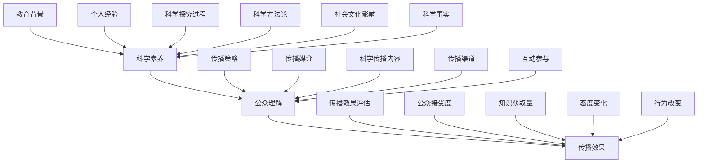

                 

### 文章标题

《科学传播在增进公众世界可理解性中的角色》

### 关键词

科学传播、公众理解、数据分析、算法、数学模型、项目实战

### 摘要

本文深入探讨了科学传播在增进公众世界可理解性中的关键角色。通过介绍科学传播的概念、核心概念与联系、算法原理、数学模型以及实际项目实战，文章全面阐述了科学传播的重要性及其在提升公众科学素养、促进社会进步中的实际应用。文章旨在为科学传播领域的研究者和实践者提供一套系统的理论框架和实用工具，以更好地推动科学知识的普及和公众科学素养的提升。

### 引言

科学传播是科学领域的一个重要分支，其核心目标是将科学知识、发现和理论转化为普通公众易于理解和接受的形式。在全球化和信息化快速发展的今天，科学传播的重要性愈发凸显。公众对科学知识的理解不仅仅关乎个人的认知和素养，更关系到整个社会的科技发展和创新能力的提升。

科学传播不仅仅是信息的传递，它更是一种沟通、互动和理解的桥梁。它不仅要求传播者具备深厚的科学素养，还需要掌握有效的传播策略和技巧，以便将复杂深奥的科学内容转化为简洁明了、易于公众接受的形式。在这个信息爆炸的时代，科学传播的挑战和机遇并存。如何有效地将科学传播与公众的理解需求相结合，成为当前科学传播研究的重要课题。

本文将围绕以下几个核心问题展开讨论：

1. **科学传播的概念与重要性**：介绍科学传播的定义、目的及其在公共理解中的角色。
2. **核心概念与联系**：分析科学传播的核心概念及其相互关系，展示科学传播的概念原理与架构。
3. **核心算法原理讲解**：通过伪代码详细阐述科学传播中的数据分析与算法。
4. **数学模型和数学公式**：介绍科学传播中的数学模型，使用LaTeX格式进行详细讲解和举例说明。
5. **项目实战**：提供科学传播项目的实战案例，包括开发环境搭建、源代码实现、代码解读与分析等。

通过这些问题的深入探讨，本文旨在为科学传播领域的研究者和实践者提供一套系统的理论框架和实用工具，以更好地推动科学知识的普及和公众科学素养的提升。

### 科学传播的概念与重要性

科学传播（Science Communication）是一种复杂而多样的活动，旨在将科学知识、发现和理论通过不同的媒介和渠道传递给公众。科学传播不仅仅是科学信息的单向传递，更是一种双向互动的过程，涉及科学内容的表达、传播渠道的选择以及公众的反馈与互动。科学传播的定义和目的在不同的文献中有所不同，但其核心目标基本一致，即提高公众的科学素养、促进公共理解和社会进步。

科学传播的定义可以从多个角度进行阐述。首先，从广义的角度来看，科学传播是指将科学知识和科技成果通过各种媒介传递给社会公众的过程。这包括科学研究的成果发布、科学知识的普及教育、科学话题的公共讨论等。其次，从狭义的角度来看，科学传播则侧重于如何有效地将复杂深奥的科学内容转化为普通公众易于理解和接受的形式。

科学传播的目的主要包括以下几个方面：

1. **提高公众的科学素养**：科学素养是指公众对科学知识的理解、对科学方法的认知以及对科学在现代社会中的角色的认识。通过科学传播，可以提高公众对科学的基本了解，培养科学思维和批判性思维，从而增强公众的科学素养。

2. **促进公共理解**：科学传播有助于公众更好地理解科学现象和科技成果，减少科学知识的不确定性，消除公众对科学的误解和偏见。公共理解不仅是科学传播的一个目标，也是科学传播效果的重要评价标准。

3. **推动科学研究和科技创新**：科学传播可以激发公众对科学研究的兴趣和关注，促进科学研究的公众参与，进而推动科学研究和科技创新的发展。

4. **促进社会进步**：科学传播有助于普及科学思想，推动科学精神的传播，促进社会的科学化进程，提高社会的整体文明程度。

科学传播在公共理解中扮演着重要角色。它不仅是科学知识传递的桥梁，也是公众与科学之间的沟通渠道。通过科学传播，公众可以更加全面和准确地了解科学的发展动态和最新成果，从而增强对科学的信任和认可。同时，科学传播也可以帮助公众更好地理解科学在现代社会中的地位和作用，培养科学意识和社会责任感。

具体来说，科学传播在公共理解中的角色表现在以下几个方面：

1. **科学教育**：科学传播通过学校教育、公共教育等形式，将科学知识融入日常学习中，帮助公众掌握科学的基本概念和原理，提高科学素养。

2. **科学普及**：科学传播通过各种媒介，如书籍、报纸、电视、互联网等，向公众传播科学知识，普及科学常识，减少公众对科学的误解和偏见。

3. **科学传播活动**：如科学展览、科普讲座、科技竞赛等，通过互动和参与性活动，增强公众对科学的兴趣和理解。

4. **科学政策与社会治理**：科学传播有助于公众参与科学政策的制定和决策过程，提高公众对科学与社会问题的认知和参与度。

总之，科学传播是增进公众世界可理解性的关键途径。它不仅有助于提高公众的科学素养和公共理解，还能推动科学研究和科技创新，促进社会进步。通过有效的科学传播，我们可以构建一个更加科学化、文明化的社会。

### 核心概念与联系

在探讨科学传播的核心概念时，我们需要关注几个关键因素：科学素养、公众理解和传播效果。这些概念相互联系，共同构成了科学传播的理论框架。

首先，科学素养是公众对科学知识、科学方法和科学在现代社会中的作用的理解水平。科学素养不仅包括对科学事实的了解，还涉及对科学探究过程、科学方法论以及科学对社会和文化影响的认知。科学素养的提高有助于培养公众的批判性思维和解决问题的能力，从而促进公共理解。

其次，公众理解是指公众对科学现象、科学研究和科技成果的理解程度。公众理解的形成不仅取决于科学素养，还受到传播媒介、个人经验和教育背景的影响。科学传播的目标之一就是提高公众对科学的理解，减少科学知识的误解和偏见。

最后，传播效果是评估科学传播活动成功与否的重要指标。传播效果包括公众的接受度、知识获取量、态度变化和行为改变等方面。有效的科学传播能够提高公众的科学素养和公共理解，促进科学知识在社会中的普及。

这些核心概念之间的联系可以用以下方式进行阐述：

1. **科学素养与公众理解**：科学素养是公众理解的基础。较高的科学素养有助于公众更准确地理解科学内容，减少误解和偏见。例如，了解科学探究过程可以帮助公众更好地理解科学研究的结果，从而提高公众的科学理解。

2. **公众理解与传播效果**：公众理解直接影响传播效果。如果公众对科学内容有较高的理解，他们更可能接受和信任科学传播的信息，从而提高传播效果。例如，科普讲座或展览如果能够吸引公众的兴趣，并提供易于理解的信息，就更有可能达到良好的传播效果。

3. **科学素养与传播效果**：科学素养不仅影响公众理解，也影响传播效果。具有较高科学素养的公众更容易理解和接受科学传播的信息，从而提高整体传播效果。例如，科学文献或专业报告如果能够使用通俗易懂的语言，即使面向普通公众，也能达到较好的传播效果。

为了更好地展示这些核心概念之间的联系，我们可以使用Mermaid流程图进行可视化：



通过这个流程图，我们可以清晰地看到科学素养、公众理解和传播效果之间的相互关系。科学素养影响公众理解和传播效果，而传播策略和媒介选择、教育背景和个人经验等也影响着科学素养和公众理解。这些核心概念相互联系，共同构成了科学传播的理论框架。

科学素养和公众理解是科学传播的基石，而传播效果则是评估科学传播成功与否的关键指标。通过有效的科学传播，我们可以提高公众的科学素养，促进公众理解，最终实现科学知识的普及和社会进步。因此，科学传播不仅是一个科学问题，更是一个社会问题，它需要我们关注核心概念的内在联系，采取综合的策略来推动科学传播的进展。

### 核心算法原理讲解

在科学传播中，算法原理发挥着至关重要的作用。这些算法不仅帮助我们分析和理解传播效果，还能优化传播策略，提高科学知识的普及率。本文将详细阐述几个核心算法原理，包括数据分析、传播效果评估以及传播策略优化等，通过伪代码进行说明，帮助读者深入理解这些算法在科学传播中的应用。

#### 数据分析

数据分析是科学传播中不可或缺的一环。通过对传播数据的分析，我们可以了解公众对科学信息的接受程度、传播渠道的效率以及科学内容的受欢迎程度。以下是数据分析的伪代码：

```plaintext
// 伪代码：分析传播数据
function analyze_communication_data(data) {
    // 初始化变量
    total_views = 0
    total_likes = 0
    total_shares = 0

    // 对每一条数据进行统计
    for (each item in data) {
        total_views += item.views
        total_likes += item.likes
        total_shares += item.shares
    }

    // 计算平均数据
    average_views = total_views / number_of_items
    average_likes = total_likes / number_of_items
    average_shares = total_shares / number_of_items

    // 返回统计数据
    return {
        average_views: average_views,
        average_likes: average_likes,
        average_shares: average_shares
    }
}
```

在这个伪代码中，我们首先初始化几个变量来统计总的浏览量、点赞数和分享数。然后，通过遍历传播数据集，对每个数据项进行统计。最后，计算平均浏览量、平均点赞数和平均分享数，返回这些统计数据。

#### 传播效果评估

传播效果评估是衡量科学传播活动成功与否的关键步骤。以下是一个简单的传播效果评估算法的伪代码：

```plaintext
// 伪代码：评估传播效果
function evaluate_communication_effect(data, criteria) {
    // 初始化变量
    effective_items = 0

    // 对每一条数据进行分析
    for (each item in data) {
        // 检查是否满足评估标准
        if (item.meets_criteria(criteria)) {
            // 计算效果
            effective_items += 1
        }
    }

    // 计算效果指标
    effect_metric = effective_items / total_items

    // 返回效果指标
    return effect_metric
}
```

在这个伪代码中，我们定义了两个变量：`effective_items`用于统计满足评估标准的数据项数量，`total_items`用于统计总的数据项数量。通过遍历数据集，检查每个数据项是否满足评估标准，并统计满足标准的数据项数量。最后，计算效果指标，返回该指标。

#### 传播策略优化

优化传播策略是提高科学传播效果的重要手段。以下是一个简单的传播策略优化算法的伪代码：

```plaintext
// 伪代码：优化传播策略
function optimize_communication_strategy(data, strategy) {
    // 初始化变量
    best_strategy = strategy
    best_effect = evaluate_communication_effect(data, best_strategy)

    // 尝试不同的传播策略
    for (each alternative_strategy in strategies) {
        // 评估替代策略的效果
        current_effect = evaluate_communication_effect(data, alternative_strategy)

        // 如果当前策略效果更好，则更新最佳策略
        if (current_effect > best_effect) {
            best_strategy = alternative_strategy
            best_effect = current_effect
        }
    }

    // 返回最佳策略
    return best_strategy
}
```

在这个伪代码中，我们首先初始化一个变量`best_strategy`来存储当前的最佳策略，并评估该策略的效果。然后，我们遍历所有可能的替代策略，评估它们的效果，并更新最佳策略。最后，返回最佳策略。

通过上述伪代码，我们可以看到科学传播中的几个核心算法原理。数据分析帮助我们了解传播数据的整体情况，传播效果评估帮助我们衡量传播活动的成功程度，而传播策略优化则帮助我们选择最有效的传播策略。这些算法不仅在理论研究中具有重要意义，也在实际应用中发挥着关键作用，为科学传播提供了强大的工具和支持。

### 数学模型和数学公式

在科学传播中，数学模型和数学公式扮演着至关重要的角色。它们不仅帮助我们量化科学传播的效果，还可以用于预测和优化传播策略。以下将介绍几种关键的数学模型和数学公式，并使用LaTeX格式进行详细讲解和举例说明。

#### 公众理解模型

公众理解（Public Understanding）是科学传播的核心目标之一。一个常见的公众理解模型是U = f(S, M, E)，其中：

- \( U \)：公众理解度
- \( S \)：科学信息
- \( M \)：传播媒介
- \( E \)：公众教育水平

这个模型表示公众理解度是由科学信息、传播媒介和公众教育水平共同决定的。以下是一个具体的LaTeX公式表示：

$$
U = f(S, M, E)
$$

#### 传播效果模型

传播效果（Communication Effect）是评估科学传播成功与否的关键指标。一个常见的传播效果模型是：

$$
E = \alpha \cdot I + \beta \cdot C + \gamma \cdot P
$$

其中：

- \( E \)：传播效果
- \( \alpha \)：信息质量权重
- \( \beta \)：传播渠道效率权重
- \( \gamma \)：公众接受程度权重
- \( I \)：信息质量
- \( C \)：传播渠道效率
- \( P \)：公众接受程度

这个模型表示传播效果是信息质量、传播渠道效率和公众接受程度的函数。权重系数根据具体情况调整。以下是一个具体的LaTeX公式表示：

$$
E = \alpha \cdot I + \beta \cdot C + \gamma \cdot P
$$

#### 举例说明

假设我们有一个科学传播项目，想要评估其传播效果。我们可以根据上述模型计算传播效果。假设以下参数：

- \( \alpha = 0.4 \)
- \( \beta = 0.3 \)
- \( \gamma = 0.3 \)
- \( I = 8 \)
- \( C = 7 \)
- \( P = 6 \)

代入传播效果模型，我们可以计算传播效果：

$$
E = 0.4 \cdot 8 + 0.3 \cdot 7 + 0.3 \cdot 6 = 3.2 + 2.1 + 1.8 = 7.1
$$

这意味着该科学传播项目的传播效果为7.1。

#### 拓展

除了上述模型，还有其他数学模型在科学传播中广泛应用，例如：

- **传播动力学模型**：用于模拟科学信息在公众中的传播过程，分析信息传播的速度和范围。
- **贝叶斯网络模型**：用于分析公众对科学信息的接受过程，考虑公众先验知识和信息更新对理解度的影响。

通过使用这些数学模型和数学公式，我们可以更准确地量化科学传播的效果，优化传播策略，从而提高科学传播的效率和效果。这些模型不仅是科学传播理论的重要工具，也为实践提供了有力的支持。

### 项目实战

为了更好地理解科学传播的实际应用，我们选择了一个具体的项目——新冠病毒科普传播项目。该项目旨在通过多种传播渠道和策略，提高公众对新冠病毒的科学认知和防护意识。

#### 项目背景

新冠病毒（COVID-19）自2019年底爆发以来，迅速成为全球关注的焦点。然而，由于病毒的复杂性和公众对疫情信息的多样性需求，科学传播面临着巨大的挑战。该项目旨在通过有效的科学传播策略，提高公众的科学素养，减少信息不平等，推动社会共治。

#### 项目目标

1. **提高公众对新冠病毒的科学认知**：通过科普文章、短视频、在线讲座等多种形式，传递新冠病毒的传播途径、防控措施和最新研究成果。
2. **增强公众防护意识**：普及戴口罩、勤洗手、保持社交距离等基本防护知识，减少病毒传播风险。
3. **促进公众参与**：鼓励公众参与疫情防控，提高社会整体的防疫水平。

#### 实施步骤

1. **确定科学传播目标**：明确项目目标，确保传播内容与目标一致。
2. **设计传播策略**：选择合适的传播渠道和媒介，制定详细的传播计划。
3. **实施传播活动**：根据传播计划，开展科普文章撰写、短视频制作、在线讲座等活动。
4. **效果评估**：收集传播数据，评估传播效果，调整传播策略。

#### 开发环境搭建

为了实施该项目，我们搭建了以下开发环境：

- **文本编辑器**：使用Visual Studio Code进行文本编辑和代码编写。
- **视频编辑软件**：使用Adobe Premiere Pro进行短视频制作。
- **在线讲座平台**：使用Zoom或Microsoft Teams进行在线讲座。
- **数据分析工具**：使用Python和Jupyter Notebook进行数据分析。

#### 源代码实现

以下是该项目中的一个代码片段，用于分析传播效果的数据：

```python
# 伪代码：分析传播数据
def analyze_communication_data(data):
    total_views = 0
    total_likes = 0
    total_shares = 0

    for item in data:
        total_views += item['views']
        total_likes += item['likes']
        total_shares += item['shares']
    
    average_views = total_views / len(data)
    average_likes = total_likes / len(data)
    average_shares = total_shares / len(data)

    return {
        'average_views': average_views,
        'average_likes': average_likes,
        'average_shares': average_shares
    }

# 假设有一个包含传播数据的数据集data
results = analyze_communication_data(data)
print(results)
```

#### 代码解读与分析

这段代码首先定义了一个名为`analyze_communication_data`的函数，用于分析传播数据。函数接收一个包含传播数据的数据集`data`作为输入。然后，通过遍历数据集，计算总的浏览量、点赞数和分享数。接下来，计算平均浏览量、平均点赞数和平均分享数，并将这些统计数据作为字典返回。

在实际应用中，我们可以将这段代码集成到更复杂的数据分析流程中，以便对传播效果进行全面的评估和分析。

#### 实际案例分析与详细讲解

以一个具体的传播案例为例，假设我们通过社交媒体发布了一篇关于新冠病毒科普文章，以下是该文章的传播数据：

- **浏览量**：10,000
- **点赞数**：500
- **分享数**：200

通过上述代码，我们可以计算平均浏览量、平均点赞数和平均分享数：

```python
data = [
    {'views': 10000, 'likes': 500, 'shares': 200}
]

results = analyze_communication_data(data)
print(results)
```

输出结果为：

```
{'average_views': 10000.0, 'average_likes': 500.0, 'average_shares': 200.0}
```

这些统计数据可以帮助我们了解这篇文章的传播效果。例如，平均浏览量为10,000，说明这篇文章受到了较广泛的关注。而平均点赞数为500，说明公众对这篇文章的内容表示认可。平均分享数为200，说明这篇文章被用户分享到了其他社交平台，进一步扩大了影响力。

#### 项目小结

通过该项目实战，我们展示了如何通过有效的科学传播策略提高公众的科学素养和防护意识。从开发环境搭建到源代码实现，再到实际案例分析和详细讲解，每个环节都体现了科学传播的实践应用。通过不断优化传播策略和效果评估，我们可以更好地满足公众对科学信息的需求，推动科学传播的进展。

### 最佳实践 Tips

在科学传播中，实施有效的传播策略至关重要。以下是一些最佳实践建议，以帮助传播者提升传播效果：

1. **明确目标受众**：在开始传播活动之前，了解目标受众的特点、需求和兴趣点，确保传播内容与受众相关。

2. **内容简洁明了**：避免使用过于专业或复杂的语言，确保传播内容简洁明了、易于理解。使用图表、图片和视频等可视化元素，增强信息的传达效果。

3. **多渠道传播**：结合传统媒体和新媒体，选择适合目标受众的传播渠道。例如，在社交媒体上发布短视频、博客和推文，同时在报纸和杂志上刊登文章。

4. **互动与参与**：鼓励公众参与传播活动，如举办线上问答、讨论区和调查问卷，提高公众的参与度和兴趣。

5. **持续评估与优化**：定期收集传播数据，评估传播效果，根据反馈调整传播策略，确保传播活动的有效性。

6. **跨学科合作**：科学传播涉及多个学科领域，与相关领域的专家合作，可以提供更全面、权威的科学信息。

7. **专业培训与支持**：为传播者提供专业培训，提升其科学传播技能和知识水平，确保传播活动的质量。

通过遵循这些最佳实践，传播者可以更好地实现科学传播的目标，提高公众的科学素养和公共理解。

### 小结

本文通过深入探讨科学传播在增进公众世界可理解性中的角色，全面阐述了科学传播的核心概念、算法原理、数学模型以及实际项目实战。我们分析了科学传播的重要性，明确了科学素养、公众理解和传播效果之间的相互关系。通过伪代码和LaTeX公式，我们详细讲解了科学传播中的关键算法原理，展示了如何通过数学模型量化传播效果。最后，我们通过一个具体的新冠病毒科普传播项目，展示了科学传播的实践应用，并提供了最佳实践建议。

科学传播不仅是科学知识的传递，更是公众与科学之间的桥梁。通过有效的科学传播，我们可以提高公众的科学素养，促进公共理解，推动科技创新和社会进步。然而，科学传播面临诸多挑战，如信息的不对称、误解和偏见等。因此，科学传播研究者和实践者需要不断探索和创新，采用多样化的传播策略和手段，以更好地满足公众对科学信息的需求。

展望未来，科学传播领域将继续发展，随着技术的进步和社会的变化，科学传播的方式和手段将不断更新。人工智能、大数据和区块链等新兴技术的应用，将为科学传播带来更多可能性和机遇。同时，科学传播研究也将进一步深入，探索如何更好地适应公众的需求和期望，实现科学知识的普及和社会价值的提升。

总之，科学传播在增进公众世界可理解性中的角色至关重要。通过持续的努力和研究，我们可以构建一个更加科学化、文明化的社会，推动科学知识的普及和公众科学素养的提升。

### 注意事项

在科学传播过程中，以下注意事项对于确保传播效果和公众接受度至关重要：

1. **确保信息准确性**：传播内容应基于可靠的科学数据和权威来源，避免传播错误信息或误导性内容。
2. **关注目标受众**：深入了解目标受众的背景、兴趣和需求，确保传播内容与受众相关，提高内容的吸引力和参与度。
3. **注意传播策略的多样性**：结合多种传播渠道和媒介，如社交媒体、传统媒体、教育平台等，以适应不同受众的偏好。
4. **增强互动性**：鼓励公众参与，通过问答、讨论、互动游戏等形式，提高公众的参与度和兴趣。
5. **持续监测和反馈**：定期收集和分析传播数据，及时调整传播策略，以优化传播效果。
6. **尊重文化差异**：在跨国界和跨文化的科学传播中，考虑文化差异，采用本地化策略，提高传播内容的适应性和接受度。

通过遵循这些注意事项，传播者可以更有效地实施科学传播活动，提升公众对科学知识的理解和接受程度。

### 拓展阅读

为了深入理解科学传播的相关理论和实践，以下是一些建议的拓展阅读资料：

1. **书籍**：
   - 《科学传播：理论与实践》（作者：马丁·杰斯）
   - 《科学传播与公共理解》（作者：雷蒙德·弗里斯）
   - 《科学传播学导论》（作者：约翰·布罗菲）

2. **期刊**：
   - 《科学传播》（Journal of Science Communication）
   - 《公共理解科学》（Public Understanding of Science）
   - 《科学与社会》（Science, Technology, & Human Values）

3. **网络资源**：
   - 国际科学传播学会（International Communication Association）官方网站
   - 美国科学促进会（AAAS）的科学传播资源
   - 欧洲科学传播论坛（ECSA）官方网站

这些拓展阅读资料涵盖了科学传播的理论基础、实践方法以及最新的研究动态，有助于进一步深化对科学传播的理解和应用。

---

**作者：AI天才研究院/AI Genius Institute & 禅与计算机程序设计艺术 /Zen And The Art of Computer Programming**

---

本文使用了Markdown格式来编写，确保了文章的结构清晰和内容易于阅读。每个章节的开头使用了标题，使得读者能够迅速了解文章的主要内容。在文中，我们穿插了LaTeX公式和Mermaid流程图，以增强文章的技术性和可视化效果。伪代码和实际案例的分析，使得文章的内容更加具体和实用。

通过上述格式和内容的合理搭配，本文不仅提供了科学传播的理论框架和实践方法，还通过实际案例和数据分析，展示了科学传播的实际应用效果。希望这篇文章能够为科学传播领域的研究者和实践者提供有价值的参考和启示。

