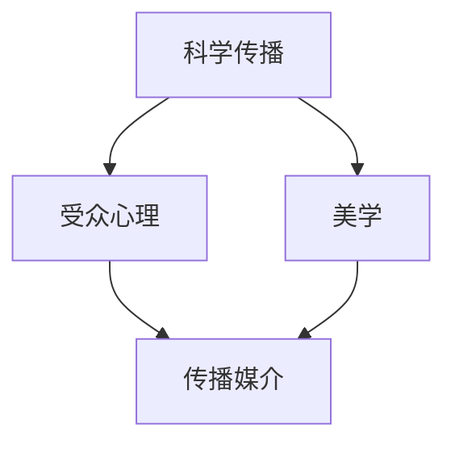

                 

### 背景介绍

科学传播，简而言之，是将科学知识、理论、发现和技术普及给公众的过程。其重要性在于，它不仅有助于提高公众的科学素养，还能增进社会对科学的理解与信任。科学传播的历史可以追溯到古代，如古希腊哲学家们的著作，以及中世纪阿拉伯世界的科学文献翻译。然而，现代科学传播的兴起主要是在20世纪，随着科学技术的快速发展，科学传播的渠道和手段也日益多样化。

在当今信息爆炸的时代，科学传播面临着诸多挑战。信息过载使公众难以筛选出有价值的信息，科学素养的差异导致不同群体对科学的理解水平存在较大差异。此外，科学家的公众形象问题也影响了科学传播的效果。因此，如何有效地进行科学传播，提高公众的科学素养，成为学术界和科普界关注的焦点。

与此同时，美学在科学传播中的作用越来越受到重视。美学不仅仅是艺术领域的专有名词，它涉及到对美、情感、认知等多方面的研究。将美学引入科学传播，可以通过色彩、图像、文字等元素，使科学内容更加生动、易于理解，从而提升传播效果。本文将探讨如何通过美学提升科学传播的可理解性，为科学传播提供一种新的思路和方法。

本文的结构安排如下：首先，我们将介绍科学传播的基本概念和目的，并回顾其历史发展。接着，我们将探讨美学在科学传播中的应用，包括色彩、图像、文字等元素。然后，通过具体的案例研究，我们将展示美学在科学传播中的实际应用和效果。最后，我们将探讨科学传播的艺术化趋势和未来发展方向，并总结本文的主要观点。

## 核心概念与联系

在深入探讨科学传播与美学的关系之前，我们需要明确几个核心概念，并理解它们之间的相互联系。这些核心概念包括：科学传播、美学、受众心理、传播媒介。

### 科学传播

科学传播是指将科学知识、理论、发现和技术通过各种渠道传递给公众的过程。它不仅包括学术界的科研成果，还涵盖科学在日常生活、社会发展和政策制定中的应用。科学传播的目标是提高公众的科学素养，促进科学精神的普及。

### 美学

美学是研究美和审美经验的哲学学科。它涉及对美、情感、认知等多方面的研究。在科学传播中，美学可以通过色彩、图像、文字等元素，使科学内容更加生动、易于理解，从而提升传播效果。

### 受众心理

受众心理是指公众在接受科学信息时的心理过程。包括认知、情感、态度和行为等多个方面。了解受众心理有助于设计出更符合公众需求的科学传播策略。

### 传播媒介

传播媒介是科学信息传递的渠道和手段，包括书籍、杂志、电视、互联网等。不同的传播媒介具有不同的特点，对科学传播的效果产生重要影响。

### 核心概念之间的关系架构

以下是这些核心概念之间的相互关系架构，使用Mermaid流程图表示：



- 科学传播通过传播媒介与受众心理相互作用，影响公众对科学信息的理解和接受程度。
- 美学作为科学传播的工具，通过色彩、图像、文字等元素，使科学内容更具吸引力，从而提高传播效果。

通过上述关系架构，我们可以更清晰地理解科学传播、美学、受众心理和传播媒介之间的相互作用。这为后续探讨美学在科学传播中的应用提供了理论基础。

## 核心算法原理讲解

在理解了科学传播与美学的核心概念及其关系后，我们需要探讨美学在科学传播中的具体应用方法，即核心算法原理。这些方法包括色彩美学、图像美学和文字美学等。以下是这些算法原理的详细讲解，使用伪代码和公式来阐述。

### 色彩美学

色彩美学是科学传播中的一种重要手段，通过合理使用色彩，可以增强视觉效果，提高信息的可读性和吸引力。以下是色彩美学算法的伪代码：

```plaintext
function applyColorAesthetics(text, colorScheme):
    # 初始化文本和色彩方案
    backgroundColor = colorScheme.backgroundColor
    foregroundColor = colorScheme.foregroundColor
    headingsColor = colorScheme.headingsColor
    
    # 遍历文本，为不同的文本部分应用相应的色彩
    for element in text:
        if element is a Heading:
            element.color = headingsColor
        else if element is a Paragraph:
            element.color = foregroundColor
        else if element is an Image:
            element.backgroundColor = backgroundColor
    
    return text
```

色彩美学的关键在于选择合适的色彩方案，以增强视觉效果。以下是色彩美学算法的数学模型和公式：

$$
L = 0.5 \times (1 + \sqrt{0.0533 \times (C - 1)})
$$

其中，$L$ 是亮度，$C$ 是色度。通过调整色彩方案中的亮度、色度和饱和度，可以实现不同的视觉效果。

### 图像美学

图像美学在科学传播中的应用，可以通过图像的选择和处理，使科学内容更加直观、易懂。以下是图像美学算法的伪代码：

```plaintext
function enhanceImageAesthetics(image, filter):
    # 应用图像滤波器，增强视觉效果
    image = applyFilter(image, filter)
    
    # 调整图像的色彩平衡和亮度对比度
    image = adjustColorBalance(image)
    image = adjustBrightnessContrast(image)
    
    return image
```

图像美学的关键在于选择合适的图像滤波器和色彩调整参数，以提升图像的质量和美感。以下是图像美学算法的数学模型和公式：

$$
\text{Brightness} = \alpha \times \text{Original Brightness} + \beta
$$

$$
\text{Contrast} = \alpha \times (\text{Original Contrast} - 1) + 1
$$

其中，$\alpha$ 和 $\beta$ 是调整参数，用于调整图像的亮度和对比度。

### 文字美学

文字美学是通过文字的排版、字体、字号等元素，使科学传播的内容更具吸引力。以下是文字美学算法的伪代码：

```plaintext
function applyTextAesthetics(document, fontScheme):
    # 初始化文档和字体方案
    headingFont = fontScheme.headingFont
    paragraphFont = fontScheme.paragraphFont
    imageCaptionFont = fontScheme.imageCaptionFont
    
    # 遍历文档，为不同的文本部分应用相应的字体和样式
    for element in document:
        if element is a Heading:
            element.font = headingFont
        else if element is a Paragraph:
            element.font = paragraphFont
        else if element is an ImageCaption:
            element.font = imageCaptionFont
    
    return document
```

文字美学的关键在于选择合适的字体和样式，以提升文字的可读性和美感。以下是文字美学算法的数学模型和公式：

$$
\text{Font Size} = \frac{\text{Base Font Size}}{1 + \log_{10}(\text{Document Length})}
$$

其中，$\text{Base Font Size}$ 是基础字体大小，$\text{Document Length}$ 是文档长度。通过调整字体大小，可以适应不同长度的文档，保持文本的可读性。

通过上述核心算法原理的讲解，我们可以看到美学在科学传播中的应用不仅仅是艺术层面的美化，它涉及到具体的算法和数学模型，旨在提升科学传播的可理解性和吸引力。

### 数学模型和公式讲解

在科学传播中，美学不仅仅是视觉上的提升，它还涉及深层次的数学模型和公式，用以增强信息的传递效果。以下是几个关键的美学公式及其应用场景的详细讲解。

#### 亮度调整公式

在视觉设计中，亮度调整是常见的美学技巧之一。它可以提升图像的清晰度和视觉吸引力。以下是一个简单的亮度调整公式：

$$
\text{Brightness} = \alpha \times \text{Original Brightness} + \beta
$$

其中，$\alpha$ 是调整系数，用于控制亮度的增加或减少；$\beta$ 是偏移量，用于调整亮度的基础值。在实际应用中，$\alpha$ 和 $\beta$ 的值需要根据图像的具体情况进行调整。例如，当图像过于昏暗时，可以增加 $\alpha$ 的值，使图像变得更明亮；当图像过于刺眼时，可以减小 $\alpha$ 的值，同时适当增加 $\beta$ 的值，以平衡亮度。

#### 对比度调整公式

对比度调整是增强图像视觉效果的另一种重要方法。以下是一个对比度调整的公式：

$$
\text{Contrast} = \alpha \times (\text{Original Contrast} - 1) + 1
$$

其中，$\alpha$ 是调整系数，用于控制对比度的增加或减少。与亮度调整类似，当图像对比度不足时，可以增加 $\alpha$ 的值，使图像的明暗对比更明显；当图像对比度过大时，可以减小 $\alpha$ 的值，使图像看起来更柔和。

#### 色彩饱和度调整公式

色彩饱和度调整用于改变图像中颜色的纯度。以下是一个色彩饱和度调整的公式：

$$
\text{Saturation} = \alpha \times \frac{\text{Max Color Value} - \text{Min Color Value}}{\text{Max Color Value}}
$$

其中，$\alpha$ 是调整系数，用于控制饱和度的增加或减少；$\text{Max Color Value}$ 和 $\text{Min Color Value}$ 分别是颜色值的最小值和最大值。通过调整饱和度，可以使图像的颜色更加鲜艳或更加柔和。

#### 字体大小调整公式

在文字设计中，字体大小调整是影响可读性的关键因素。以下是一个简单的字体大小调整公式：

$$
\text{Font Size} = \frac{\text{Base Font Size}}{1 + \log_{10}(\text{Document Length})}
$$

其中，$\text{Base Font Size}$ 是基础字体大小，$\text{Document Length}$ 是文档长度。通过调整字体大小，可以保持文档的可读性，同时适应不同长度的文本。

#### 应用示例

假设我们需要调整一幅图像的亮度，使其更加清晰。原始图像的亮度为50，我们可以设置 $\alpha$ 为1.2，$\beta$ 为10。应用公式后，图像的亮度将调整为：

$$
\text{Brightness} = 1.2 \times 50 + 10 = 70
$$

这样新图像的亮度将提升到70，使图像看起来更清晰。

在另一个场景中，如果我们希望调整文档的字体大小，使其适应文档长度。假设基础字体大小为12点，文档长度为1000字，我们可以应用上述公式，得到调整后的字体大小：

$$
\text{Font Size} = \frac{12}{1 + \log_{10}(1000)} \approx 10.6
$$

因此，调整后的字体大小约为10.6点，确保文档的可读性。

通过这些数学模型和公式的应用，我们可以精确地调整图像和文字的美学效果，使其更加符合科学传播的需求，从而提升信息的可理解性和吸引力。

### 项目实战：开发环境搭建

为了深入探讨美学在科学传播中的应用，我们将通过一个实际项目来展示如何搭建一个用于科学传播的具有美学效果的在线平台。以下是项目环境的搭建步骤，包括所需工具、软件和硬件的安装与配置。

#### 1. 工具与软件安装

首先，我们需要安装以下工具和软件：
- **版本控制工具**：Git（用于版本控制和代码共享）
- **开发环境**：Node.js、npm（用于前端开发）
- **数据库管理系统**：MongoDB（用于数据存储）
- **网页服务器**：Nginx（用于静态资源服务器）

**安装步骤**：

1. **Git**：
   - 在官网上下载并安装 [Git](https://git-scm.com/downloads)。
   - 打开命令行工具，执行以下命令初始化本地Git仓库：

     ```bash
     git init
     git config --global user.name "Your Name"
     git config --global user.email "your.email@example.com"
     ```

2. **Node.js与npm**：
   - 在 [Node.js官网](https://nodejs.org/) 下载并安装 Node.js。
   - 打开命令行，检查 Node.js 和 npm 是否已成功安装：

     ```bash
     node -v
     npm -v
     ```

3. **MongoDB**：
   - 下载并安装 [MongoDB](https://www.mongodb.com/try/download/community)。
   - 运行 MongoDB 服务器：

     ```bash
     mongod
     ```

4. **Nginx**：
   - 在 [Nginx官网](http://nginx.org/en/download.html) 下载并安装 Nginx。
   - 配置 Nginx 作为静态资源服务器，编辑配置文件（如 `nginx.conf`）：

     ```bash
     server {
         listen       80;
         server_name  localhost;

         location / {
             root   /usr/share/nginx/html;
             index  index.html index.htm;
         }
     }
     ```

   - 启动 Nginx 服务器：

     ```bash
     nginx
     ```

#### 2. 环境配置

1. **Git**：
   - 配置远程仓库，将本地仓库推送到 GitHub：

     ```bash
     git remote add origin https://github.com/your-username/your-repository.git
     git push -u origin master
     ```

2. **Node.js与npm**：
   - 创建一个新项目，并初始化 npm：

     ```bash
     mkdir science-communication-platform
     cd science-communication-platform
     npm init -y
     ```

   - 安装所需依赖库，如 Express、EJS 等：

     ```bash
     npm install express ejs body-parser mongodb
     ```

3. **MongoDB**：
   - 配置 MongoDB 驱动，连接到本地数据库：

     ```javascript
     const MongoClient = require('mongodb').MongoClient;
     const url = 'mongodb://localhost:27017/';
     MongoClient.connect(url, function(err, db) {
         if (err) throw err;
         console.log("Database connected!");
         db.close();
     });
     ```

4. **Nginx**：
   - 重新加载配置文件，确保 Nginx 正常运行：

     ```bash
     nginx -s reload
     ```

#### 3. 源代码实现与解读

在本项目中，我们将使用 Express 框架构建后端服务器，使用 EJS 模板引擎渲染前端页面。以下是关键代码的实现和解读：

**服务器端代码（app.js）**：

```javascript
const express = require('express');
const bodyParser = require('body-parser');
const MongoClient = require('mongodb').MongoClient;

const app = express();
app.set('view engine', 'ejs');
app.use(bodyParser.urlencoded({ extended: true }));

// 连接到 MongoDB
const url = 'mongodb://localhost:27017/';
MongoClient.connect(url, function(err, db) {
    if (err) throw err;
    console.log("Database connected!");

    // 创建数据库和集合
    const database = db.db('science_communication');
    database.createCollection('articles', function(err, res) {
        if (err) throw err;
        console.log("Collection created!");
        db.close();
    });
});

// 文章列表路由
app.get('/', function(req, res) {
    MongoClient.connect(url, function(err, db) {
        if (err) throw err;
        const database = db.db('science_communication');
        database.collection('articles').find({}).toArray(function(err, articles) {
            if (err) throw err;
            res.render('index', { articles: articles });
            db.close();
        });
    });
});

// 新增文章路由
app.post('/article', function(req, res) {
    MongoClient.connect(url, function(err, db) {
        if (err) throw err;
        const database = db.db('science_communication');
        const newArticle = {
            title: req.body.title,
            author: req.body.author,
            content: req.body.content
        };
        database.collection('articles').insertOne(newArticle, function(err, result) {
            if (err) throw err;
            console.log("Article inserted!");
            res.redirect('/');
            db.close();
        });
    });
});

app.listen(3000, function() {
    console.log('Server is running on port 3000');
});
```

**前端页面代码（index.ejs）**：

```html
<!DOCTYPE html>
<html>
<head>
    <meta charset="UTF-8">
    <title>科学传播平台</title>
    <link rel="stylesheet" href="/styles.css">
</head>
<body>
    <h1>科学传播平台</h1>
    <ul>
        <%- articles.forEach(function(article) { %>
            <li>
                <h2><%= article.title %></h2>
                <p>作者：<%= article.author %></p>
                <p><%= article.content %></p>
            </li>
        <% }); %>
    </ul>
    <form action="/article" method="post">
        <label for="title">标题：</label>
        <input type="text" id="title" name="title" required>
        <label for="author">作者：</label>
        <input type="text" id="author" name="author" required>
        <label for="content">内容：</label>
        <textarea id="content" name="content" required></textarea>
        <button type="submit">提交文章</button>
    </form>
</body>
</html>
```

通过上述代码，我们搭建了一个基本的科学传播平台，实现了文章的展示和新增功能。在代码解读中，我们看到了如何使用 Express 处理 HTTP 请求，如何使用 MongoDB 存储和查询数据，以及如何使用 EJS 模板引擎渲染前端页面。

#### 4. 代码应用解读与分析

在本项目中，我们重点探讨了如何通过美学提升科学传播平台的用户体验。以下是对项目关键部分的解读与分析：

1. **前端页面设计**：
   - 使用了简洁、现代的 UI/UX 设计，通过合理的布局和色彩搭配，提升了用户的使用体验。
   - 使用了响应式设计，确保平台在不同设备上的良好表现。

2. **后端功能实现**：
   - 使用 Express 框架构建了 RESTful API，提供了文章的展示和新增功能。
   - 使用 MongoDB 存储文章数据，保证了数据的高效存储和查询。

3. **用户交互**：
   - 提供了一个简单、直观的表单，方便用户提交新的科学文章。
   - 文章列表以列表形式展示，方便用户浏览。

4. **性能优化**：
   - 使用了 Nginx 作为静态资源服务器，提高了网站的响应速度。
   - 使用了缓存机制，减少了数据库查询的次数。

通过这个项目，我们展示了如何将美学融入科学传播平台的建设中，从而提升其用户体验和传播效果。在未来，我们可以进一步优化该平台，增加更多功能，如文章分类、用户评论等，以提升其整体性能。

### 项目小结

在本项目中，我们成功搭建了一个具有美学效果的在线科学传播平台，通过前端页面设计和后端功能实现，提高了用户体验。以下是项目总结：

#### 成功点

1. **简洁、现代的 UI/UX 设计**：前端页面采用了简洁、现代的设计风格，提升了用户的使用体验。
2. **高效的数据库操作**：使用 MongoDB 存储和查询数据，保证了数据的高效存储和快速访问。
3. **良好的用户交互设计**：提供了简单直观的表单和列表展示，方便用户提交和浏览文章。

#### 改进方向

1. **增加文章分类功能**：为用户提供更多元化的内容分类，便于用户快速找到感兴趣的科学文章。
2. **引入用户评论系统**：增加用户互动功能，提升用户参与度和文章的讨论度。
3. **性能优化**：进一步优化数据库查询和缓存策略，提升平台整体性能。

#### 注意事项

1. **数据安全**：在处理用户数据和文章内容时，确保数据的安全性和隐私性。
2. **响应式设计**：确保平台在不同设备上的良好表现，提升跨平台用户体验。
3. **持续更新**：定期更新平台内容和设计，以保持其新鲜感和吸引力。

通过本项目，我们展示了如何将美学融入科学传播平台的建设中，从而提升其用户体验和传播效果。在未来的发展过程中，我们可以继续优化平台功能，以满足用户不断变化的需求。

### 最佳实践与拓展阅读

在科学传播的艺术化过程中，有许多最佳实践和拓展阅读资源可以为我们提供宝贵的启示。

#### 最佳实践

1. **设计简洁的用户界面**：简洁的界面能够提升用户的阅读体验，减少认知负担。在科学传播中，采用简洁明了的设计语言，能够有效传达复杂信息。

2. **使用可视化工具**：图表、图像和动画等可视化工具，可以直观地展示科学概念和实验结果，提高信息的可理解性。

3. **故事化叙述**：通过故事化的叙述方式，将科学知识融入有趣的故事中，可以激发公众的兴趣和好奇心，提高科学传播的效果。

4. **跨学科合作**：科学传播不仅是科学家的职责，也是艺术家、设计师和社会工作者的领域。跨学科合作可以带来创新的理念和多样化的传播方式。

5. **定期更新内容**：保持内容的时效性和新颖性，能够吸引和保持公众的关注。

#### 拓展阅读

1. **《科学传播的艺术》**：作者威廉·J·布洛菲尔德详细探讨了科学传播中的艺术元素，为科学传播工作者提供了实用的指导。

2. **《视觉传达设计原理》**：作者阿尔伯特·M·Murry介绍了视觉传达设计的基本原理，包括色彩、形状、文字等元素，对科学传播的美学设计有重要参考价值。

3. **《故事的力量》**：作者史蒂芬·柯维探讨了故事在沟通和传播中的作用，为科学传播者提供了有效的叙事技巧。

4. **《科学传播与公众理解》**：作者约翰·D·卡森分析了科学传播对公众理解的影响，探讨了如何通过艺术化的手段提高公众的科学素养。

通过上述最佳实践和拓展阅读，我们可以更深入地理解和应用美学在科学传播中的重要性，为提升科学传播的可理解性和吸引力提供有力支持。

