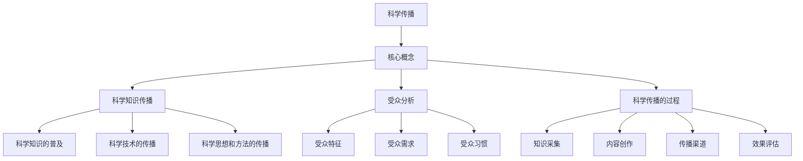

                 

# 科学传播的艺术：让世界可理解性触手可及

## 关键词：科学传播，可理解性，艺术，技术，教育，未来展望

## 摘要

本文旨在探讨科学传播的艺术，通过分析科学传播的基本原理、艺术实践以及未来展望，阐述如何通过艺术化的方式提升世界的可理解性。文章首先介绍了科学传播的重要性及其面临的挑战，随后详细阐述了科学传播的核心概念、策略、技术手段和艺术形式。通过案例分析和未来展望，本文揭示了科学传播在提升公众科学素养和促进社会进步中的关键作用。

## 引言

### 科学传播的重要性

科学传播作为一种特殊的社会实践活动，对于促进科学技术的发展、提升公众的科学素养以及推动社会进步具有重要意义。首先，科学传播是科学技术与社会之间的重要桥梁，有助于将科学知识转化为社会资源，推动科技创新成果的应用和普及。其次，科学传播有助于消除公众对科学的误解和恐惧，增强公众对科学的信任和认同。最后，科学传播还是培养公众科学精神和创新意识的重要途径。

### 科学传播的目标

科学传播的目标主要包括三个方面：一是让科学知识变得可理解，二是让科学成果变得可应用，三是让科学思想变得可接受。首先，科学传播需要将复杂的科学知识转化为通俗易懂的语言，使公众能够理解和掌握科学的基本概念。其次，科学传播需要关注科学成果的应用，推动科技成果转化为现实生产力。最后，科学传播需要传播科学思想，引导公众树立正确的科学观念。

### 科学传播的现状与挑战

当前，科学传播面临着诸多挑战。首先，科学传播内容的专业性较高，导致公众理解难度大。其次，科学传播的形式相对单一，缺乏创新和吸引力。此外，科学传播的渠道和平台较为有限，难以满足公众的多样化需求。最后，科学传播的人才短缺，缺乏专业的科学传播人才队伍。

## 第一部分：科学传播的基本原理

### 第2章：科学传播的核心概念

#### 2.1 科学知识传播的定义与分类

科学知识传播是指通过各种手段和途径，将科学知识传递给公众的过程。根据传播内容的不同，科学知识传播可以分为以下几个方面：

1. **科学知识的普及**：主要涉及基础科学知识的传播，目的是提高公众的科学素养。
2. **科学技术的传播**：主要涉及科技前沿的传播，目的是推动科技创新和成果应用。
3. **科学思想和方法的传播**：主要涉及科学方法论和科学精神的传播，目的是培养公众的科学思维和创新能力。

#### 2.2 受众分析

受众分析是科学传播的重要环节，旨在了解公众的需求和兴趣，以便更有效地进行科学传播。受众分析主要包括以下几个方面：

1. **受众特征**：包括年龄、性别、职业、教育背景等基本信息。
2. **受众需求**：包括对科学知识的需求、对科技成果的需求以及对科学思想的需求。
3. **受众习惯**：包括获取科学信息的途径、偏好和习惯。

#### 2.3 科学传播的过程

科学传播的过程可以概括为以下几个阶段：

1. **知识采集**：包括科学研究成果的收集、整理和筛选。
2. **内容创作**：根据受众需求和传播目的，对科学知识进行加工和创作。
3. **传播渠道**：选择合适的传播渠道，如媒体、互联网、展览等。
4. **效果评估**：对科学传播的效果进行评估，包括传播效果、受众反馈等。

### 第3章：科学传播的策略

#### 3.1 内容设计

内容设计是科学传播的关键环节，直接影响公众对科学知识的理解和接受程度。科学传播的内容设计应遵循以下原则：

1. **简洁明了**：避免使用过于专业的术语和复杂的结构，确保内容通俗易懂。
2. **生动有趣**：通过故事化、形象化的方式，增强内容的趣味性和吸引力。
3. **针对性**：根据受众的特点和需求，设计有针对性的内容。

#### 3.2 媒体选择

媒体选择是科学传播的重要策略，直接影响传播效果。科学传播的媒体选择应考虑以下几个方面：

1. **传播范围**：选择覆盖面广的媒体，如电视、报纸、互联网等。
2. **传播速度**：选择传播速度快的媒体，如互联网、社交媒体等。
3. **传播效果**：选择传播效果好的媒体，如具有影响力的科学节目、科普专栏等。

#### 3.3 沟通技巧

沟通技巧是科学传播的核心，直接影响公众对科学知识的理解和接受程度。科学传播的沟通技巧应包括以下几个方面：

1. **倾听**：了解公众的需求和意见，提高传播的针对性。
2. **表达**：用简单明了的语言表达科学知识，提高传播的易懂性。
3. **互动**：与公众进行互动，增强传播的参与感和互动性。

#### 3.4 效果评估

效果评估是科学传播的重要环节，旨在了解传播效果，为后续的传播活动提供参考。科学传播的效果评估应包括以下几个方面：

1. **传播效果**：包括传播的范围、速度和受众接受度等。
2. **受众反馈**：包括受众对科学传播内容的满意度和参与度等。
3. **社会影响**：包括科学传播对社会的影响，如提高公众科学素养、推动科技创新等。

### 第4章：科学传播的技术手段

#### 4.1 传统的科学传播方式

传统的科学传播方式主要包括媒体传播、展览传播和教育培训等。这些方式虽然历史悠久，但仍然在科学传播中发挥着重要作用。

1. **媒体传播**：如报纸、杂志、电视、广播等，具有覆盖面广、传播速度快的特点。
2. **展览传播**：如科技馆、博物馆等，通过实物展示和互动体验，增强公众对科学知识的理解。
3. **教育培训**：如科普讲座、科普课程等，通过专业讲解和互动交流，提高公众的科学素养。

#### 4.2 新媒体与科学传播

新媒体的发展为科学传播带来了新的机遇和挑战。新媒体具有传播速度快、互动性强、覆盖面广等特点，如互联网、社交媒体、短视频等。

1. **互联网**：通过门户网站、搜索引擎、科普网站等，提供丰富的科学知识资源和互动平台。
2. **社交媒体**：如微博、微信、抖音等，通过用户生成内容，实现科学知识的快速传播和互动。
3. **短视频**：如抖音、快手等，通过短视频的形式，生动有趣地传播科学知识。

#### 4.3 数据可视化

数据可视化是将科学数据通过图形、图表等方式进行展示，使公众能够直观地理解和分析数据。数据可视化在科学传播中具有重要作用，如科学实验结果展示、科技发展趋势分析等。

1. **图形展示**：如条形图、折线图、饼图等，用于展示数据的分布和趋势。
2. **动画展示**：如动画视频、交互式地图等，通过动态展示，增强数据的吸引力和理解性。
3. **虚拟现实**：通过虚拟现实技术，让公众身临其境地体验科学实验和科技场景。

#### 4.4 互动式科学传播

互动式科学传播是通过与公众的互动，提高科学传播的参与度和效果。互动式科学传播包括线上互动和线下互动两种形式。

1. **线上互动**：如在线问答、科普直播等，通过互联网平台，实现公众与科学家的实时互动。
2. **线下互动**：如科普讲座、科学实验体验等，通过现场互动，增强公众对科学知识的理解。

### 第5章：科学传播的艺术

#### 5.1 故事化传播

故事化传播是将科学知识通过故事的形式进行传播，使科学知识更具吸引力。故事化传播包括以下几个方面：

1. **科学史故事**：通过讲述科学家的故事，传播科学思想和方法。
2. **科技发展故事**：通过讲述科技发展的故事，展示科技成果的应用和影响。
3. **科学实验故事**：通过讲述科学实验的故事，展示科学研究的进展和成果。

#### 5.2 演讲技巧

演讲技巧是科学传播的重要手段，直接影响公众对科学知识的理解和接受程度。演讲技巧包括以下几个方面：

1. **开场吸引**：通过有趣的开场，吸引公众的注意力。
2. **内容组织**：通过逻辑清晰的结构，使科学知识易于理解。
3. **语言表达**：通过生动形象的语言，增强科学知识的表达力。
4. **互动引导**：通过与公众的互动，提高演讲的参与度和效果。

#### 5.3 展览设计

展览设计是将科学知识通过展览的形式进行展示，使公众能够直观地理解和体验科学。展览设计包括以下几个方面：

1. **主题策划**：根据科学传播的目的和受众特点，策划合适的展览主题。
2. **内容安排**：通过科学的布局和设计，使展览内容更加直观和易懂。
3. **互动体验**：通过互动体验，增强公众对科学知识的理解和兴趣。

#### 5.4 科普写作

科普写作是将科学知识通过文字的形式进行传播，使科学知识更具可读性和吸引力。科普写作包括以下几个方面：

1. **选题策划**：根据公众的兴趣和需求，选择合适的科普选题。
2. **内容创作**：通过生动的语言和形象的比喻，使科普文章更具吸引力。
3. **结构布局**：通过逻辑清晰的结构和生动的叙事方式，使科普文章易于理解。

### 第6章：科学传播的伦理与责任

#### 6.1 知识的正确性与客观性

科学传播的伦理与责任首先体现在知识的正确性与客观性。科学传播者应当确保传播的内容准确无误，避免误导公众。同时，科学传播应当保持客观公正，避免因个人偏见或利益驱动而影响传播的客观性。

#### 6.2 受众权益保护

科学传播应当尊重公众的知情权和选择权，确保公众在获取科学知识时有充分的自主权。此外，科学传播还应当关注公众的心理健康，避免过度传播可能引发恐慌或误解的科学知识。

#### 6.3 科学传播与意识形态

科学传播应当坚持科学精神和科学方法，避免陷入意识形态的纷争。科学传播者应当保持科学的态度和开放的视野，尊重不同文化和价值观，推动科学的全球传播和交流。

### 第7章：科学传播的教育作用

#### 7.1 科学传播与科学教育的关系

科学传播与科学教育是相辅相成的。科学传播是科学教育的重要补充，通过传播科学知识，提升公众的科学素养。而科学教育则为科学传播提供了坚实的基础，培养公众的科学思维和创新能力。

#### 7.2 科学传播在科学教育中的应用

科学传播在科学教育中具有广泛的应用，如科普课程、科普讲座、科普实验等。通过科学传播的手段，使科学教育更加生动有趣，提高学生的学习兴趣和参与度。

#### 7.3 科学传播对公众科学素养的影响

科学传播对公众科学素养具有显著的影响。通过科学传播，公众能够更好地理解和应用科学知识，提高科学思维能力，增强对科学的信任和认同。

## 第三部分：科学传播的艺术实践

### 第8章：案例分析

#### 8.1 国内科学传播实践案例

国内科学传播实践案例丰富多样，包括中央电视台的《科技之光》、中国科技馆的展览、中国科普作家的作品等。这些案例在提高公众科学素养、推动科技创新和成果转化等方面取得了显著成效。

#### 8.2 国际科学传播实践案例

国际科学传播实践案例也具有丰富的经验，如美国的《科学美国人》、英国的《新科学家》、日本的国家科学博物馆等。这些案例通过创新的传播手段和形式，有效地促进了科学知识的传播和普及。

#### 8.3 多元化的科学传播实践

多元化的科学传播实践包括线上和线下、传统媒体和新媒体、学术机构和民间组织等多种形式。通过多元化的实践，科学传播能够更好地满足公众的多样化需求，提高科学传播的覆盖面和效果。

## 第四部分：科学传播的未来展望

### 第9章：科学传播的挑战与机遇

#### 9.1 技术发展的驱动

技术发展，尤其是互联网和人工智能技术的飞速发展，为科学传播带来了前所未有的机遇。通过互联网，科学知识可以迅速传播到全球各地；人工智能技术则可以分析公众需求，提供个性化的科学知识服务。

#### 9.2 全球化与科学传播

全球化使得科学传播不再局限于某一地区或国家，而是成为全球性的活动。科学传播的全球化不仅促进了科学知识的传播，也促进了不同国家和地区之间的科学合作与交流。

#### 9.3 未来科学传播的趋势

未来科学传播的趋势将更加注重个性化、互动化和多元化。科学传播将更加注重公众的需求和兴趣，通过创新的传播手段和形式，提高科学传播的吸引力和效果。

### 第10章：科学传播的创新发展

#### 10.1 创新的传播模式

创新的传播模式将更加注重用户体验，通过互动式、沉浸式的方式，提高科学传播的参与度和效果。例如，虚拟现实技术可以将公众带入科学实验和科技场景，增强对科学知识的理解和兴趣。

#### 10.2 新兴技术与科学传播

新兴技术，如人工智能、虚拟现实、增强现实等，将为科学传播带来新的机遇。这些技术可以创造更加生动、有趣的科学传播体验，提高科学传播的效果。

#### 10.3 科普文化的构建

科普文化的构建是未来科学传播的重要任务。通过弘扬科学精神、传播科学思想，培养公众的科学素养和创新能力，推动科学文化的普及和发展。

### 第11章：科学传播的未来规划

#### 11.1 政策与策略

科学传播的未来规划需要政策支持和战略引导。政府应制定科学传播的政策，加大对科学传播的投入，推动科学传播事业的发展。

#### 11.2 产业与合作

科学传播产业的快速发展将促进科学传播的繁荣。同时，科学传播需要与其他产业，如教育、文化、媒体等，建立合作关系，实现资源共享和互利共赢。

#### 11.3 公众参与

公众参与是科学传播的重要一环。通过鼓励公众参与科学传播活动，如科普讲座、科学实验等，提高公众的科学素养和参与度，推动科学传播的普及和发展。

## 总结

科学传播的艺术在于如何让复杂的科学知识变得通俗易懂，如何通过艺术化的方式提升世界的可理解性。本文通过分析科学传播的基本原理、艺术实践和未来展望，阐述了科学传播在提升公众科学素养、推动科技创新和社会进步中的关键作用。未来，科学传播需要不断创新和发展，以适应时代的需求，让科学知识触手可及，让世界更加可理解。

### 附录

以下是本文提到的关键概念之间的关系架构 Mermaid 流程图：

### 作者信息

作者：AI天才研究院/AI Genius Institute & 禅与计算机程序设计艺术 /Zen And The Art of Computer Programming

