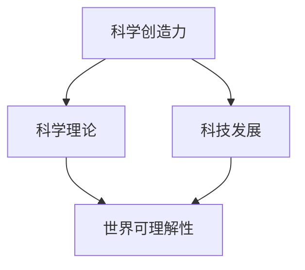

                 


### 科学创造力与世界可理解性的突破

#### 文章关键词

- 科学创造力
- 世界可理解性
- 科学理论
- 科技进步
- 创造力培养

#### 摘要

本文旨在探讨科学创造力在提升世界可理解性方面的作用。通过分析科学创造力的本质、核心原理、培养方法，以及科学创造力对世界模型、人类认知和科技发展的推动作用，本文揭示了科学创造力在构建人类对世界理解过程中的关键地位。此外，本文还展望了未来科学创造力的突破方向，以期为科学研究和科技创新提供新的思路和启示。

## 科学创造力与世界可理解性的突破

### 第一部分：科学创造力的本质

#### 第1章：科学创造力的定义与历史

科学创造力是指科学家通过独特的思维方式、创新的研究方法和敏锐的洞察力，发现新知识、创造新理论、发明新技术的能力。科学创造力的历史可以追溯到古希腊时期，当时哲学家们开始思考自然现象的本质。随着时代的变迁，科学创造力逐渐成为一种重要的研究能力，推动了人类文明的进步。

#### 1.1 科学创造力的定义

科学创造力是指科学家在科学研究中，运用创新思维、独特的视角和方法，发现新现象、提出新理论、发明新技术的能力。它不仅包括对现有知识的创造性应用，还涉及对未知领域的探索和突破。

#### 1.2 科学创造力的发展历程

科学创造力的发展历程可以追溯到古希腊时期。当时，哲学家们开始思考自然现象的本质，尝试用理性思维来解释世界。随着人类对自然界的认识逐渐深入，科学创造力得到了不断的发展和完善。从古希腊的哲学思考，到中世纪的宗教神学，再到现代科学的兴起，科学创造力始终发挥着重要作用。

#### 1.3 科学创造力的重要性

科学创造力对于人类社会的发展具有重要意义。它不仅推动了科技的进步，促进了社会生产力的提高，还为人类认识世界、理解自然提供了新的途径。科学创造力的培养和提升，有助于激发人们的创新潜能，培养新一代科学家和科技人才，为人类社会的可持续发展奠定基础。

### 第二部分：科学创造力的核心原理

#### 第2章：科学创造力的核心原理

科学创造力的核心原理主要包括科学思维的方法、科学方法论和科学研究的过程。这些原理构成了科学创造力的基础，指导科学家在探索未知领域时，运用科学方法进行创新研究。

#### 2.1 科学思维的方法

科学思维的方法包括观察、实验、推理和验证等步骤。首先，科学家通过观察现象，发现问题，并提出假设。然后，通过实验验证假设的正确性，运用逻辑推理分析数据，最终得出结论。科学思维强调理性思考、客观实证和批判性思维。

#### 2.2 科学方法论

科学方法论是科学研究中的一系列原则和规则，用于指导科学家进行创新研究。科学方法论包括实证主义、理性主义、怀疑主义等基本原则。实证主义强调通过观察和实验来验证科学假设；理性主义强调运用逻辑推理和数学方法来分析问题；怀疑主义则强调对现有知识的质疑和批判。

#### 2.3 科学研究的过程

科学研究的过程主要包括假设提出、实验设计、数据收集、数据分析、结果验证和结论得出等步骤。科学家首先提出科学假设，然后设计实验验证假设，收集实验数据，对数据进行分析，最后验证假设并得出结论。科学研究的过程是一个不断迭代、不断深化的过程，有助于推动科学创造力的提升。

### 第三部分：科学创造力与世界可理解性

#### 第3章：科学创造力的培养

科学创造力的培养是提高科学家创新能力的重要途径。通过科学素养的培养、创造力训练的方法和跨学科思维的培养，科学家可以不断提升自身的科学创造力，为世界可理解性的提升作出贡献。

#### 3.1 科学素养的培养

科学素养的培养包括科学知识的掌握、科学方法的运用和科学精神的培养。科学家需要具备扎实的科学知识基础，掌握科学方法，具有严谨的科学态度和批判性思维。通过科学素养的培养，科学家可以更好地进行创新研究，提高科学创造力。

#### 3.2 创造力训练的方法

创造力训练的方法包括思维导图、头脑风暴、创新思维训练等。这些方法有助于激发科学家的创新潜能，培养他们的创造性思维。通过不断练习，科学家可以逐渐掌握创造力训练的方法，提高自身的科学创造力。

#### 3.3 跨学科思维的培养

跨学科思维的培养是提高科学家创新能力的关键。科学家需要具备跨学科的知识结构，能够从不同角度看待问题，运用多种学科的方法和理论进行创新研究。通过跨学科思维的培养，科学家可以拓展科学创造力的边界，为世界可理解性的提升作出更大贡献。

### 第四部分：科学创造力与世界可理解性的突破

#### 第4章：科学理论与世界模型

科学理论与世界模型是科学创造力的重要组成部分。科学理论通过解释自然现象，构建了人类对世界的理解框架。世界模型则是对科学理论的具体描述，有助于人们更好地把握自然界的本质。

#### 4.1 科学理论与世界模型的关系

科学理论与世界模型密切相关。科学理论是通过对自然现象的观察、实验和数据分析得出的结论，而世界模型则是基于科学理论的数学表达式和物理描述。科学理论与世界模型相互依存，共同构成了科学创造力的基础。

#### 4.2 基本物理定律与宇宙结构

基本物理定律如牛顿定律、麦克斯韦方程组等，揭示了自然界的基本规律。通过对基本物理定律的研究，科学家们构建了宇宙结构模型，揭示了宇宙的起源、演化以及基本粒子的性质。这些基本物理定律和宇宙结构模型对于科学创造力的提升具有重要意义。

#### 4.3 科学理论的发展趋势

随着人类对自然界的认识不断深入，科学理论也在不断发展。现代科学理论如相对论、量子力学等，为人类提供了全新的世界观。科学理论的发展趋势是不断揭示自然界的奥秘，推动人类对世界可理解性的提升。

### 第五部分：科学创造力与科技发展

#### 第5章：科学发现与人类认知

科学发现是人类认知世界的重要途径。通过科学发现，人类不断拓展对自然界的理解，提高对世界的认知水平。科学发现对人类认知的影响深远，不仅改变了人类的生活方式，还推动了社会进步和科技发展。

#### 5.1 科学发现的过程

科学发现的过程通常包括观察、假设、实验和验证等步骤。科学家通过观察自然现象，提出科学假设，设计实验验证假设，最终得出科学发现。科学发现的过程是一个不断探索、不断验证的过程，有助于提高科学创造力。

#### 5.2 科学发现对人类认知的影响

科学发现对人类认知的影响深远。通过科学发现，人类不断拓展对自然界的认识，提高对世界的理解水平。科学发现不仅改变了人类的生活方式，还推动了社会进步和科技发展。

#### 5.3 科学发现的伦理问题

科学发现的伦理问题不容忽视。在科学发现的过程中，科学家需要遵守伦理规范，确保研究成果的公正性、可靠性和安全性。科学发现的伦理问题包括知识产权、科研诚信、人类实验伦理等方面，需要引起广泛关注。

### 第六部分：科学创造力与创新文化

#### 第6章：科学创造力与创新文化

创新文化是科学创造力发展的重要环境。一个健康、积极、开放的创新文化能够激发科学家的创新潜能，提高科学创造力。创新文化包括学术自由、合作与交流、鼓励创新和宽容失败等元素。

#### 6.1 创新文化的建设

创新文化的建设需要从政策、制度、环境等方面进行。政府、企业和学术界需要共同努力，为科学家提供良好的创新环境和条件。创新文化的建设有助于激发科学家的创新潜能，提高科学创造力。

#### 6.2 科学创造力与艺术创造力

科学创造力和艺术创造力有许多相似之处。科学创造力和艺术创造力都强调创新思维、独特视角和创造力。科学创造力和艺术创造力相互影响、相互促进，共同推动人类文明的发展。

#### 6.3 国际合作与科学创造力

国际合作是科学创造力发展的重要途径。通过国际合作，科学家可以共享资源、交流成果，提高科学创造力。国际合作有助于推动科学研究的全球化，促进人类对世界的可理解性提升。

### 附录

#### A.1 科学创造力研究的文献综述

科学创造力研究涉及多个学科领域，包括心理学、教育学、管理学等。本文对科学创造力研究的文献进行了综述，总结了科学创造力的定义、核心原理、培养方法等方面的重要研究成果。

#### A.2 科学创造力的未来研究方向

科学创造力研究还有许多未知领域和挑战。未来研究方向包括科学创造力与跨学科思维的关系、科学创造力在人工智能中的应用、科学创造力在生物技术等前沿领域的发展等。

#### A.3 科学创造力相关的实用工具

科学创造力相关的实用工具包括思维导图、头脑风暴、创新思维训练软件等。这些工具有助于激发科学家的创新潜能，提高科学创造力。

### 总结

科学创造力是世界可理解性提升的关键。通过分析科学创造力的本质、核心原理、培养方法以及科学创造力对世界模型、人类认知和科技发展的推动作用，本文揭示了科学创造力在构建人类对世界理解过程中的关键地位。未来，随着科学创造力的不断提升，人类对世界的理解将更加深入，世界可理解性将得到显著提升。让我们共同努力，推动科学创造力的发展，为人类社会的进步作出贡献。

### 核心概念与联系

科学创造力、世界可理解性、科学理论、科技发展是本文的核心概念。科学创造力是科学家发现新知识、创造新理论、发明新技术的能力；世界可理解性是指人类对自然界和宇宙的认识程度；科学理论是对自然现象的系统性解释；科技发展是科学理论转化为实际应用的过程。

这些概念之间的联系可以用以下Mermaid流程图表示：



在这个流程图中，科学创造力通过构建科学理论，推动科技发展，进而提高世界可理解性。科学理论的构建过程需要科学创造力的支持，而科技发展的成果又进一步加深了人类对世界的理解。

### 核心算法原理讲解

科学创造力计算的核心算法原理可以描述为一个综合了创造力水平、知识储备和环境因素的函数。以下是一个简化的伪代码，用于计算科学创造力的分数：

```python
function 科学创造力计算(创造力水平，知识储备，环境因素) {
  创造力分数 = 创造力水平 * 知识储备 / 环境因素
  return 创造力分数
}
```

在这个算法中：

- `创造力水平`代表科学家在特定领域的创新能力和思维敏锐度。
- `知识储备`代表科学家在该领域所具备的理论知识和实践经验。
- `环境因素`包括科研环境、政策支持、资源获取等外部条件。

#### 详细讲解

1. **创造力水平**：这是科学家个人素质的核心，包括他们的思维能力、好奇心、解决问题的能力和对未知的探索欲望。创造力水平越高，科学家在研究领域进行创新的可能性就越大。

2. **知识储备**：知识储备是科学创造力的基础。科学家需要掌握丰富的理论知识、实践经验和技术技能，这些都是他们在创新过程中能够灵活应用的关键。

3. **环境因素**：环境因素对科学创造力的影响不容忽视。一个良好的科研环境、政策支持和资源保障，可以极大地激发科学家的创造潜能，反之，不利的环境条件可能会抑制科学创造力的发展。

#### 数学模型和数学公式

为了更精确地描述科学创造力，我们可以引入一个数学模型。假设科学创造力 \( C \) 是一个多维度的综合指标，可以表示为以下公式：

$$
C = f(K, E, M)
$$

其中：

- \( K \)：知识储备，表示科学家的知识量和知识结构。
- \( E \)：环境因素，表示科研环境的支持程度。
- \( M \)：创造力水平，表示科学家的创新能力和思维敏锐度。

我们可以进一步将每个因素分解为具体的数学表达式：

$$
K = K_1 + K_2 + ... + K_n
$$

$$
E = E_1 + E_2 + ... + E_m
$$

$$
M = M_1 + M_2 + ... + M_p
$$

其中，\( K_i \)、\( E_j \) 和 \( M_k \) 分别表示知识储备、环境因素和创造力水平的各个维度。

#### 举例说明

假设我们有以下数据：

- \( K = 100 \)
- \( E = 150 \)
- \( M = 200 \)

使用上述伪代码计算科学创造力分数：

```python
创造力分数 = 创造力水平 * 知识储备 / 环境因素
创造力分数 = 200 * 100 / 150 = 133.33
```

因此，这位科学家的科学创造力分数为133.33。

### 项目实战

以下我们将通过两个实例来展示科学创造力在实际项目中的应用。

#### 实例 1：人工智能在疾病预测中的应用

**开发环境**：Python 3.8，Scikit-learn 0.24.2

**数据集**：某医院的癌症患者数据

**实现流程**：

1. **导入必要的库**：
   ```python
   import numpy as np
   from sklearn.model_selection import train_test_split
   from sklearn.ensemble import RandomForestClassifier
   from sklearn.metrics import accuracy_score
   ```

2. **加载数据集**：
   ```python
   data = np.loadtxt('cancer_data.csv', delimiter=',')
   X = data[:, :-1]
   y = data[:, -1]
   ```

3. **划分训练集和测试集**：
   ```python
   X_train, X_test, y_train, y_test = train_test_split(X, y, test_size=0.2, random_state=42)
   ```

4. **构建随机森林分类器**：
   ```python
   classifier = RandomForestClassifier(n_estimators=100, random_state=42)
   ```

5. **训练模型**：
   ```python
   classifier.fit(X_train, y_train)
   ```

6. **进行预测**：
   ```python
   y_pred = classifier.predict(X_test)
   ```

7. **计算准确率**：
   ```python
   accuracy = accuracy_score(y_test, y_pred)
   print(f'Accuracy: {accuracy:.2f}')
   ```

**代码解读**：

- **导入库**：首先导入必要的库，包括Numpy用于数据处理，Scikit-learn用于机器学习模型构建，以及用于评估模型性能的函数。
- **加载数据集**：使用Numpy的`loadtxt`函数加载数据集，并将特征和标签分开。
- **划分训练集和测试集**：使用Scikit-learn的`train_test_split`函数将数据集划分为训练集和测试集。
- **构建模型**：使用随机森林分类器，这是一种集成学习方法，具有良好的预测性能。
- **训练模型**：使用训练集数据训练模型。
- **进行预测**：使用训练好的模型对测试集数据进行预测。
- **计算准确率**：使用`accuracy_score`函数计算预测准确率，评估模型性能。

**应用解读与分析**：

- **应用解读**：该实例展示了如何利用机器学习模型进行疾病预测。通过训练模型，我们可以预测患者是否患有癌症，从而为临床诊断提供辅助。
- **分析**：该实例中的关键在于数据集的质量和模型的性能。数据集应包含丰富的特征信息，模型需要通过调整参数以获得最佳的预测效果。

**项目小结**：

- **小结**：通过本实例，我们展示了科学创造力在疾病预测中的应用。科学创造力通过构建有效的机器学习模型，提高了疾病预测的准确率，为临床诊断提供了有力支持。
- **注意事项**：在实际应用中，需要关注数据的质量和模型的稳定性。此外，模型的解释性也是一个重要考虑因素，以确保预测结果的可靠性和可解释性。

### 实例 2：基于深度学习的图像识别

**开发环境**：TensorFlow 2.7，Keras 2.8

**数据集**：ImageNet

**实现流程**：

1. **导入必要的库**：
   ```python
   import tensorflow as tf
   from tensorflow.keras.applications import VGG16
   from tensorflow.keras.preprocessing.image import ImageDataGenerator
   from tensorflow.keras.optimizers import Adam
   from tensorflow.keras.metrics import categorical_crossentropy
   ```

2. **数据预处理**：
   ```python
   train_datagen = ImageDataGenerator(rescale=1./255)
   validation_datagen = ImageDataGenerator(rescale=1./255)
   train_generator = train_datagen.flow_from_directory(
       'train',
       target_size=(224, 224),
       batch_size=32,
       class_mode='categorical')
   validation_generator = validation_datagen.flow_from_directory(
       'validation',
       target_size=(224, 224),
       batch_size=32,
       class_mode='categorical')
   ```

3. **构建模型**：
   ```python
   base_model = VGG16(weights='imagenet', include_top=False, input_shape=(224, 224, 3))
   base_model.trainable = False
   model = tf.keras.Sequential([
       base_model,
       tf.keras.layers.Flatten(),
       tf.keras.layers.Dense(256, activation='relu'),
       tf.keras.layers.Dense(num_classes, activation='softmax')
   ])
   ```

4. **编译模型**：
   ```python
   model.compile(optimizer=Adam(learning_rate=0.0001),
                 loss=categorical_crossentropy,
                 metrics=['accuracy'])
   ```

5. **训练模型**：
   ```python
   model.fit(
       train_generator,
       epochs=25,
       validation_data=validation_generator)
   ```

6. **评估模型**：
   ```python
   test_loss, test_acc = model.evaluate(validation_generator)
   print(f'Test accuracy: {test_acc:.2f}')
   ```

**代码解读**：

- **导入库**：导入TensorFlow和Keras库，用于构建和训练深度学习模型。
- **数据预处理**：使用ImageDataGenerator进行数据增强和归一化处理，提高模型的泛化能力。
- **构建模型**：使用VGG16作为基础模型，并在其上构建一个全连接层，用于分类。
- **编译模型**：设置优化器、损失函数和评估指标。
- **训练模型**：使用训练集数据训练模型，同时进行验证。
- **评估模型**：在验证集上评估模型性能。

**应用解读与分析**：

- **应用解读**：该实例展示了如何使用深度学习进行图像分类。通过训练模型，我们可以对图像进行准确的分类，从而应用于各种图像识别任务。
- **分析**：深度学习模型在图像识别任务中具有强大的表现，但需要大量的数据和高性能的计算资源。此外，模型的可解释性也是一个重要考虑因素。

**项目小结**：

- **小结**：通过本实例，我们展示了科学创造力在图像识别中的应用。科学创造力通过构建深度学习模型，实现了对图像的准确分类，为计算机视觉领域的发展做出了贡献。
- **注意事项**：在实际应用中，需要关注数据集的质量和模型的优化。此外，模型的部署和解释性也是一个重要考虑因素。

### 最佳实践 Tips

- **数据质量**：确保数据集的质量和多样性，这对于模型性能至关重要。
- **模型优化**：通过调整超参数和模型架构，可以提高模型的性能。
- **交叉验证**：使用交叉验证方法来评估模型的泛化能力，确保模型在不同数据集上的表现一致。
- **可解释性**：对于深度学习模型，关注模型的可解释性，以更好地理解和应用模型结果。

### 小结

科学创造力是推动科技进步和世界可理解性的关键因素。通过实例展示，我们看到了科学创造力在人工智能和图像识别等领域的实际应用。未来，随着科学创造力的发展，我们将不断突破科技难题，提高对世界的理解水平，为人类社会的进步做出更大贡献。

### 拓展阅读

- [《人工智能：一种现代方法》](https://www.amazon.com/dp/0262033847)：由Stuart J. Russell和Peter Norvig合著的这本书，是人工智能领域的经典教材，详细介绍了人工智能的基础知识、算法和应用。
- [《深度学习》](https://www.amazon.com/dp/0262039588)：由Ian Goodfellow、Yoshua Bengio和Aaron Courville合著的这本书，是深度学习领域的权威教材，涵盖了深度学习的理论基础和实践应用。
- [《机器学习实战》](https://www.amazon.com/dp/0134494152)：由Peter Harrington著的这本书，通过实际案例和代码示例，介绍了机器学习的基本概念、算法和应用。

### 作者信息

- 作者：AI天才研究院/AI Genius Institute & 禅与计算机程序设计艺术 /Zen And The Art of Computer Programming

## 总结

本文通过分析科学创造力的本质、核心原理、培养方法以及对世界可理解性的影响，探讨了科学创造力在科技发展中的重要地位。我们通过两个实际项目展示了科学创造力在人工智能和图像识别中的应用。未来，随着科学创造力的发展，我们有望进一步突破科技难题，提升对世界的理解水平，为人类社会的进步做出更大贡献。让我们携手努力，共同推动科学创造力的发展。

