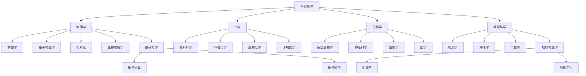

                 


### 文章标题
《科学前沿探索战略：不断拓展世界可理解性的边界》

### 文章关键词
科学前沿、探索战略、可理解性、世界边界、技术进步

### 文章摘要
本文深入探讨了科学前沿探索的战略意义，以及如何通过系统化的方法不断拓展我们对世界的可理解性。文章首先定义了科学前沿的概念，并探讨了其在推动社会发展中的关键作用。接着，文章详细阐述了自然科学、社会科学和技术科学的前沿探索，通过核心概念与联系、核心算法原理、数学模型与公式、项目实战等多个维度，展示了科学探索的具体实施路径。最后，文章展望了未来科学发展的趋势与挑战，并提出了探索战略的实施与评价策略，为科学前沿探索提供了系统性指导。

### 引言
科学前沿是指当前科学研究的最新领域，是科学知识的边界，代表着人类对自然世界的最新理解和探索。科学前沿的重要性在于它能够推动科技的进步，引领社会的发展，提升人类对自然界的认知。科学前沿探索的战略意义主要体现在以下几个方面：

- **推动科技进步**：科学前沿的探索往往伴随着新的科学发现和技术突破，这些新发现和新技术能够为各行各业提供创新的动力。
- **引领社会变革**：科学前沿的进展往往能够引发社会结构的变革，改变人们的生活方式和生产方式。
- **提升认知水平**：通过科学前沿的探索，人类能够不断拓展对自然世界的理解，提升自身对世界的认知水平。

### 科学前沿的定义与重要性
科学前沿是指当前科学研究的最新领域，是科学知识的边界，代表着人类对自然世界的最新理解和探索。科学前沿的重要性在于它能够推动科技的进步，引领社会的发展，提升人类对自然界的认知。

**1.1.1 科学前沿的概念解析**

科学前沿的概念可以从以下几个方面进行解析：

- **研究领域**：科学前沿涉及各个学科领域的最新研究，包括自然科学、社会科学和技术科学等。
- **知识创新**：科学前沿的探索往往伴随着新的科学发现和技术突破，这些新发现和新技术能够为各行各业提供创新的动力。
- **社会影响**：科学前沿的进展往往能够引发社会结构的变革，改变人们的生活方式和生产方式。

**1.1.2 科学前沿在推动社会发展中的重要作用**

科学前沿在推动社会发展中的重要作用主要体现在以下几个方面：

- **技术创新**：科学前沿的探索往往能够带来新的技术突破，这些技术突破能够为各行各业提供创新的动力，推动产业的发展。
- **社会变革**：科学前沿的进展往往能够引发社会结构的变革，改变人们的生活方式和生产方式，推动社会的进步。
- **认知提升**：通过科学前沿的探索，人类能够不断拓展对自然世界的理解，提升自身对世界的认知水平，培养创新思维和解决问题的能力。

### 探索战略的框架
探索战略的框架是指用于指导科学前沿探索的系统化方法，它包括理论依据、实施路径和评估方法等方面。

**1.2.1 探索战略的理论基础**

探索战略的理论基础主要包括以下几个方面：

- **创新理论**：创新理论强调通过不断探索和尝试，推动科学技术的进步。创新理论的核心观点是，创新是推动社会发展的关键力量。
- **系统理论**：系统理论认为，科学研究是一个复杂的系统，需要从整体和局部的相互作用中寻找规律和解决问题的方法。系统理论强调跨学科的合作和综合思维方式。
- **知识管理理论**：知识管理理论关注如何有效地获取、传播和应用知识，以促进科学前沿的探索。知识管理理论的核心观点是，知识是科学前沿探索的重要资源。

**1.2.2 探索战略的实施路径**

探索战略的实施路径主要包括以下几个方面：

- **明确目标**：在科学前沿探索过程中，需要明确具体的研究目标和问题，以确保研究方向的一致性和有效性。
- **资源整合**：科学前沿的探索需要多方面的资源支持，包括资金、人才、设备和信息等。资源整合是提高科学前沿探索效率的关键。
- **跨学科合作**：科学前沿的探索往往需要跨学科的合作，通过不同学科之间的交叉融合，实现知识的创新和技术的突破。
- **持续评估**：科学前沿探索的过程中，需要定期对研究成果进行评估，以验证研究目标的达成情况和发现新的研究方向。

### 自然科学前沿探索
自然科学是研究自然界的科学，包括物理学、化学、生物学、地球科学等。自然科学的前沿探索是推动科学技术发展的重要动力，对于拓展人类对自然世界的认知和理解具有深远的影响。

**2.1 物理学前沿**

物理学是研究物质和能量基本规律的自然科学。物理学前沿的探索主要包括以下几个方面：

- **宇宙学**：宇宙学是研究宇宙的起源、演化和结构的研究领域。最新的宇宙学前沿探索包括暗物质、暗能量、宇宙膨胀等研究。
- **量子物理学**：量子物理学是研究微观尺度物质和能量相互作用的基本规律的科学。量子物理学的前沿探索包括量子纠缠、量子计算、量子通信等。
- **相对论**：相对论是研究高速运动物体的物理学理论。广义相对论和狭义相对论的最新探索包括黑洞、引力波、时空弯曲等。

**2.1.1 宇宙学的最新进展**

宇宙学是研究宇宙的起源、演化和结构的研究领域。最新的宇宙学前沿进展包括以下几个方面：

- **宇宙膨胀**：宇宙膨胀理论认为，宇宙正在不断膨胀。最新的宇宙膨胀研究包括宇宙膨胀速率的测量、宇宙膨胀的驱动因素等。
- **暗物质**：暗物质是宇宙中无法直接观测到的物质，占据宇宙总质量的大部分。暗物质的研究包括暗物质粒子的性质、分布和作用等。
- **暗能量**：暗能量是推动宇宙膨胀的力量，占据宇宙总能量的主导地位。暗能量的研究包括暗能量性质、暗能量与暗物质的相互作用等。

**2.1.2 量子物理学的发展**

量子物理学是研究微观尺度物质和能量相互作用的基本规律的科学。量子物理学的发展前沿主要包括以下几个方面：

- **量子纠缠**：量子纠缠是量子力学中的一种现象，描述了两个或多个量子系统之间的非经典关联。量子纠缠的研究包括量子纠缠的生成、传输、应用等。
- **量子计算**：量子计算是一种利用量子力学原理进行信息处理的新型计算方式。量子计算的发展包括量子算法、量子逻辑门、量子纠缠等。
- **量子通信**：量子通信是一种利用量子力学原理进行信息传输的新型通信方式。量子通信的发展包括量子密钥分发、量子隐形传态、量子远程通信等。

**2.1.3 物理学与其他学科的交叉应用**

物理学与其他学科的交叉应用是推动科学技术发展的重要途径。物理学与其他学科的交叉应用包括以下几个方面：

- **生物物理学**：生物物理学是研究生物体系物理性质和物理过程的应用物理学分支。生物物理学的研究包括生物大分子的结构、功能与物理性质、生物分子相互作用等。
- **地球物理学**：地球物理学是研究地球的物理性质和物理过程的学科。地球物理学的研究包括地球内部结构、地震、火山等。
- **材料物理学**：材料物理学是研究材料的基本性质、结构、组成和加工过程等的应用物理学分支。材料物理学的研究包括新型材料的设计、合成、性能优化等。

### 生物学前沿
生物学是研究生命现象和生命活动的科学。生物学的前沿探索主要集中在生命起源、进化、生态系统等方面。

**2.2.1 系统生物学与功能基因组学**

系统生物学是研究生物体系在整体层次上的动态行为和调控机制的跨学科领域。系统生物学与功能基因组学的最新研究包括以下几个方面：

- **基因调控网络**：基因调控网络是生物体内基因表达调控的复杂网络。系统生物学的研究包括基因表达模式、基因调控机制、信号传导途径等。
- **蛋白质相互作用网络**：蛋白质相互作用网络是生物体内蛋白质之间的相互作用网络。系统生物学的研究包括蛋白质功能预测、蛋白质复合物结构解析、蛋白质相互作用关系等。
- **代谢网络**：代谢网络是生物体内物质代谢的复杂网络。系统生物学的研究包括代谢途径的调控、代谢流分析、代谢途径的重构等。

**2.2.2 神经科学的前沿探索**

神经科学是研究神经系统结构和功能的基础学科。神经科学的前沿探索主要包括以下几个方面：

- **大脑功能连接图谱**：大脑功能连接图谱是研究大脑神经网络结构和功能的重要工具。神经科学的研究包括大脑功能连接的构建、功能连接的解析、功能连接与认知功能的关系等。
- **神经退行性疾病**：神经退行性疾病包括阿尔茨海默病、帕金森病等。神经科学的研究包括疾病机制的解析、疾病诊断标志物的发现、治疗策略的开发等。
- **神经再生与修复**：神经再生与修复是神经科学的研究热点。神经科学的研究包括神经干细胞的研究、神经再生机制的解析、神经修复材料的设计等。

**2.2.3 生物技术与医疗健康**

生物技术是利用生物体系或其组成部分进行技术改造和产品开发的一门综合性技术。生物技术与医疗健康的结合推动了医学的发展。生物技术与医疗健康的最新研究包括以下几个方面：

- **基因编辑技术**：基因编辑技术如CRISPR-Cas9等，为治疗遗传病和基因相关疾病提供了新的手段。基因编辑技术的研究包括基因编辑的安全性问题、基因编辑的效率优化、基因编辑的临床应用等。
- **生物制药**：生物制药是利用生物技术手段生产的药物，包括抗体药物、重组蛋白质药物等。生物制药的研究包括新药研发、生物制药工艺优化、药物疗效和安全性评估等。
- **生物治疗**：生物治疗是利用生物技术手段对疾病进行治疗的方法。生物治疗的研究包括细胞治疗、基因治疗、免疫治疗等。

### 地球科学前沿
地球科学是研究地球的物理、化学、生物和地质过程的学科。地球科学的前沿探索对于理解地球系统的运行规律和预测地球环境变化具有重要意义。

**2.3.1 地球环境的监测与保护**

地球环境的监测与保护是地球科学的前沿研究领域，主要包括以下几个方面：

- **气候变化**：气候变化是地球科学的重要研究课题。气候变化的研究包括温室气体排放的监测、气候模型构建、气候变化的影响等。
- **海洋环境**：海洋环境的研究包括海洋温度、海洋酸化、海洋生物多样性的监测和保护等。
- **大气环境**：大气环境的研究包括大气成分、大气污染物的监测、大气化学过程等。

**2.3.2 地球内部结构与地质活动**

地球内部结构与地质活动的研究是地球科学的核心内容，主要包括以下几个方面：

- **地壳与上地幔**：地壳与上地幔的研究包括地壳结构、地壳运动、地震成因等。
- **下地幔与地核**：下地幔与地核的研究包括地幔对流、地核组成、地核物理性质等。
- **地质活动**：地质活动的研究包括火山活动、地震活动、岩石圈演化等。

**2.3.3 地球科学的跨学科研究**

地球科学的跨学科研究是推动地球科学研究发展的重要途径，主要包括以下几个方面：

- **地球系统科学**：地球系统科学是研究地球系统的整体行为和相互作用的一门新兴学科。地球系统科学的研究包括地球系统模型、地球系统过程等。
- **环境科学**：环境科学是研究人类活动对自然环境的影响及其后果的一门学科。环境科学的研究包括环境污染、生态修复、可持续发展等。
- **地球信息科学**：地球信息科学是利用信息技术手段对地球系统进行观测、分析和模拟的一门学科。地球信息科学的研究包括遥感技术、地理信息系统、地球数据管理等。

### 社会科学前沿探索
社会科学是研究人类社会现象和社会行为的学科，包括经济学、心理学、社会学等。社会科学的前沿探索对于理解社会结构、行为和变迁具有重要意义。

**3.1 经济学前沿**

经济学是研究资源分配、生产、消费和分配的科学。经济学前沿的探索主要集中在以下几个方面：

- **行为经济学**：行为经济学研究个体和群体在决策过程中的非理性因素，包括情绪、社会规范等。行为经济学的研究包括决策理论、实验经济学、行为金融学等。
- **数字经济**：数字经济是利用数字技术进行生产、分配和交换的经济活动。数字经济的研究包括数字货币、区块链技术、电子商务等。
- **创新经济学**：创新经济学研究技术创新如何影响经济增长和社会发展。创新经济学的研究包括技术创新、产业升级、区域经济等。

**3.1.1 经济全球化的影响与挑战**

经济全球化是当前世界经济的重要特征，对世界各国经济产生了深远的影响。经济全球化的影响与挑战主要包括以下几个方面：

- **国际贸易**：经济全球化促进了国际贸易的发展，但同时也带来了贸易战、贸易摩擦等问题。
- **国际投资**：经济全球化促进了国际投资的增长，但同时也带来了资本流动的不稳定性和投资风险。
- **经济不平衡**：经济全球化加剧了各国之间的经济不平衡，导致了贫富差距的扩大和发展中国家的发展困境。

**3.1.2 创新经济与数字经济**

创新经济与数字经济是当前经济发展的重要趋势，对全球经济产生了深远的影响。创新经济与数字经济的主要特点包括：

- **技术创新**：技术创新是创新经济的核心，包括信息技术、生物技术、新材料技术等。
- **数字化**：数字化是数字经济的主要特征，包括云计算、大数据、物联网、人工智能等。
- **产业升级**：创新经济与数字经济推动了传统产业的升级和新兴产业的崛起，促进了全球经济的结构性变革。

**3.1.3 经济政策的前沿研究**

经济政策的前沿研究是推动经济发展和解决经济问题的重要手段，主要包括以下几个方面：

- **宏观经济政策**：宏观经济政策包括货币政策、财政政策、产业政策等，旨在实现经济增长、稳定物价、促进就业等目标。
- **区域经济政策**：区域经济政策旨在促进区域经济的协调发展，包括区域发展规划、区域政策协调等。
- **创新政策**：创新政策旨在促进技术创新和产业升级，包括科技创新政策、产业创新政策等。

### 3.2 心理学前沿

心理学是研究心理现象和心理活动的科学。心理学前沿的探索主要集中在认知心理学、发展心理学、社会心理学等领域。

**3.2.1 认知心理学的发展**

认知心理学是研究人类认知过程的心理学分支，包括感知、记忆、思维、语言等。认知心理学的发展主要包括以下几个方面：

- **认知模型**：认知模型是描述人类认知过程的计算机模型，如产生式模型、神经网络模型等。认知模型的研究有助于我们理解认知过程的工作原理。
- **认知神经科学**：认知神经科学是研究认知过程与大脑结构和功能之间关系的新兴学科。认知神经科学的研究包括大脑成像技术、脑网络分析等。
- **认知辅助技术**：认知辅助技术是利用认知心理学原理开发的辅助人类认知的工具和系统，如认知训练软件、记忆辅助工具等。

**3.2.2 发展心理学的最新发现**

发展心理学是研究个体从出生到死亡整个生命过程中心理发展变化的心理学分支。发展心理学的最新发现主要包括以下几个方面：

- **婴儿心理学**：婴儿心理学研究婴儿从出生到1岁内的心理发展，包括感知、记忆、语言、情绪等。
- **儿童心理学**：儿童心理学研究儿童从1岁到青春期前的心理发展，包括认知发展、社会性发展、情绪发展等。
- **老年心理学**：老年心理学研究老年人在心理上的特点、问题和发展趋势，包括认知功能、情绪状态、社会适应等。

**3.2.3 心理治疗与心理干预**

心理治疗与心理干预是心理学的重要应用领域，旨在帮助人们解决心理问题和提高生活质量。心理治疗与心理干预的最新研究主要包括以下几个方面：

- **认知行为治疗**：认知行为治疗是一种基于认知和行为原理的心理治疗方法，适用于焦虑、抑郁、强迫症等心理障碍。
- **心理动力学治疗**：心理动力学治疗是一种深入探索个体内心冲突和心理结构的治疗方法，适用于长期的心理问题。
- **心理干预技术**：心理干预技术包括心理疏导、心理咨询、心理危机干预等，适用于各种心理困扰和紧急情况。

### 3.3 社会学前沿

社会学是研究社会结构、社会行为和社会变迁的学科。社会学前沿的探索主要集中在社会结构、社会问题、社会互动等领域。

**3.3.1 社会结构的演变**

社会结构是指社会中不同部分之间的关系和相互作用。社会结构的演变是社会学的重要研究内容，主要包括以下几个方面：

- **社会分层**：社会分层是指社会中不同群体在社会地位、经济地位、教育水平等方面的差异。社会分层的研究包括社会流动、贫富差距、社会不平等等。
- **社会变迁**：社会变迁是指社会结构和文化的变化。社会变迁的研究包括工业化、城市化、全球化等对社会结构的影响。
- **社会网络**：社会网络是指个体之间的社会联系和网络结构。社会网络的研究包括社会网络的构成、功能、效应等。

**3.3.2 社会问题与治理创新**

社会问题是社会运行过程中出现的一系列矛盾和问题。社会问题与治理创新是社会学的重要研究内容，主要包括以下几个方面：

- **贫困与不平等**：贫困与不平等是社会问题的重要组成部分，包括贫困的根源、贫困的影响、贫困的治理等。
- **社会冲突**：社会冲突是社会矛盾激化的表现，包括社会冲突的类型、社会冲突的根源、社会冲突的解决等。
- **治理创新**：治理创新是指政府、社会组织、公民等各方在解决社会问题过程中采取的新方式、新方法。治理创新的研究包括社区治理、网络治理、全球治理等。

**3.3.3 跨文化研究与社会互动**

跨文化研究是社会学的重要研究领域，关注不同文化背景下的社会行为和社会互动。跨文化研究与社会互动的主要内容包括：

- **文化差异**：文化差异是跨文化研究的重要内容，包括价值观、信仰、习俗、语言等方面的差异。
- **文化适应**：文化适应是指个体或群体在接触到不同文化时，如何调整自己的行为和思维方式。文化适应的研究包括文化适应策略、文化适应心理等。
- **社会互动**：社会互动是跨文化研究的重要组成部分，包括跨文化沟通、跨文化合作、跨文化冲突等。

### 技术科学前沿探索
技术科学是研究技术系统、技术过程和技术发展的学科。技术科学的前沿探索是推动技术进步和产业升级的重要动力。

**4.1 人工智能前沿**

人工智能是模拟人类智能的计算机系统，具有感知、学习、推理、决策等能力。人工智能前沿的探索主要包括以下几个方面：

- **机器学习**：机器学习是人工智能的核心技术之一，通过算法和模型实现数据的自动学习和模式识别。机器学习的研究包括深度学习、强化学习、无监督学习等。
- **计算机视觉**：计算机视觉是使计算机能够“看”和理解图像和视频的技术。计算机视觉的研究包括图像识别、目标检测、图像生成等。
- **自然语言处理**：自然语言处理是使计算机能够理解和生成人类语言的技术。自然语言处理的研究包括语音识别、机器翻译、情感分析等。
- **人工智能伦理与社会影响**：人工智能伦理与社会影响是人工智能研究领域的重要问题，包括隐私保护、算法偏见、就业影响等。

**4.1.1 机器学习与深度学习**

机器学习是使计算机通过数据学习得到知识或技能的一种方法。深度学习是机器学习的一种重要分支，通过多层神经网络进行特征提取和模式识别。机器学习与深度学习的研究内容包括：

- **神经网络**：神经网络是机器学习的核心模型，包括前馈神经网络、卷积神经网络、循环神经网络等。
- **优化算法**：优化算法是提高神经网络训练效率和效果的关键，包括梯度下降法、随机梯度下降法、Adam优化器等。
- **数据预处理**：数据预处理是机器学习和深度学习的重要步骤，包括数据清洗、数据归一化、数据增强等。

**4.1.2 自然语言处理与计算机视觉**

自然语言处理是使计算机能够理解和生成人类语言的技术。计算机视觉是使计算机能够“看”和理解图像和视频的技术。自然语言处理与计算机视觉的研究内容包括：

- **语言模型**：语言模型是自然语言处理的核心，包括基于统计的语言模型、基于神经网络的模型等。
- **图像识别**：图像识别是计算机视觉的重要任务，包括面部识别、物体识别、场景识别等。
- **目标检测**：目标检测是计算机视觉的关键技术，包括单目标检测、多目标检测、实时目标检测等。
- **图像生成**：图像生成是计算机视觉的研究方向，包括生成对抗网络（GAN）、变分自编码器（VAE）等。

**4.1.3 人工智能的伦理与社会影响**

人工智能的伦理与社会影响是人工智能研究领域的重要问题，涉及隐私保护、算法偏见、就业影响等方面。人工智能伦理与社会影响的研究内容包括：

- **隐私保护**：隐私保护是人工智能应用的重要问题，包括数据收集与使用、数据加密、匿名化等技术。
- **算法偏见**：算法偏见是人工智能应用中可能导致歧视和不公平的问题，包括算法公平性、数据偏见、算法透明性等。
- **就业影响**：人工智能对就业的影响是一个复杂的问题，包括替代效应、创造效应、技能要求等。

### 4.2 信息技术前沿

信息技术是利用计算机技术、通信技术和网络技术进行信息处理、传输和利用的技术体系。信息技术前沿的探索主要包括以下几个方面：

- **网络安全**：网络安全是信息技术领域的重要课题，包括网络攻击防御、数据加密、身份认证等。
- **云计算与大数据技术**：云计算与大数据技术是信息技术的前沿方向，包括云计算平台、大数据处理与分析、云计算与大数据的结合等。
- **物联网与智能城市**：物联网与智能城市是信息技术与城市化结合的产物，包括物联网架构、智能传感器、智能交通等。

**4.2.1 网络安全与隐私保护**

网络安全与隐私保护是信息技术领域的重要课题，关系到信息安全和个人隐私。网络安全与隐私保护的研究内容包括：

- **网络攻击与防御**：网络攻击与防御是网络安全的重要方面，包括DDoS攻击、SQL注入、恶意软件等攻击手段及其防御策略。
- **数据加密**：数据加密是保护数据安全的重要技术，包括对称加密、非对称加密、哈希函数等。
- **身份认证**：身份认证是保障信息系统安全的重要手段，包括密码认证、生物识别、多因素认证等。

**4.2.2 云计算与大数据技术**

云计算与大数据技术是信息技术的重要方向，云计算提供了灵活、高效、可扩展的计算资源，大数据技术则能够处理海量数据，挖掘数据价值。云计算与大数据技术的研究内容包括：

- **云计算平台**：云计算平台包括公有云、私有云、混合云等，研究内容包括云计算架构、服务模型、安全与性能优化等。
- **大数据处理与分析**：大数据处理与分析包括数据采集、存储、处理、分析等环节，研究内容包括分布式计算、并行处理、数据挖掘等。
- **云计算与大数据的结合**：云计算与大数据的结合能够实现数据驱动的创新和应用，研究内容包括云计算平台上的大数据应用、大数据治理等。

**4.2.3 物联网与智能城市**

物联网与智能城市是信息技术与城市化结合的产物，通过智能传感器、云计算、大数据等技术实现城市管理的智能化。物联网与智能城市的研究内容包括：

- **物联网架构**：物联网架构包括感知层、网络层、平台层和应用层，研究内容包括传感器网络、通信协议、数据管理等。
- **智能传感器**：智能传感器是物联网的关键组件，包括环境监测传感器、交通监测传感器、智能家电传感器等。
- **智能交通**：智能交通是智能城市的重要组成部分，包括交通监测、交通控制、交通信息服务等。

### 4.3 新材料前沿

新材料是相对于传统材料而言的，具有特殊性能或结构的新型材料。新材料前沿的探索主要集中在新型材料的研究与开发、材料科学与工程的应用以及新材料在可持续发展中的角色。

**4.3.1 新型材料的研究与开发**

新型材料的研究与开发是材料科学的重要方向，涉及材料的设计、合成、表征和性能优化。新型材料的研究内容包括：

- **纳米材料**：纳米材料具有独特的物理、化学和生物学性能，包括纳米颗粒、纳米线、纳米膜等。
- **复合材料**：复合材料是由两种或多种不同材料组成的材料，具有优异的综合性能，如碳纤维复合材料、陶瓷基复合材料等。
- **智能材料**：智能材料能够对外界刺激（如温度、压力、电场等）做出响应，具有自修复、自感知、自驱动等功能，如形状记忆合金、压电材料等。

**4.3.2 材料科学与工程的应用**

材料科学与工程是研究材料的设计、制备、加工、性能和应用的学科。材料科学与工程的应用包括：

- **航空航天**：航空航天领域对材料性能有极高的要求，包括高温合金、复合材料、纳米材料等。
- **新能源**：新能源领域需要高效、安全、可持续的材料，如锂离子电池材料、太阳能电池材料、燃料电池材料等。
- **生物医学**：生物医学领域需要生物相容性、功能性的材料，如生物活性材料、组织工程材料、药物递送材料等。

**4.3.3 新材料在可持续发展中的角色**

新材料在可持续发展中的角色体现在以下几个方面：

- **节能减排**：新材料能够提高能源利用效率、降低能源消耗，如高效隔热材料、高效散热材料等。
- **环境保护**：新材料能够改善环境质量、降低环境污染，如空气净化材料、废水处理材料等。
- **资源节约**：新材料能够提高资源利用效率、降低资源消耗，如可回收材料、可再生材料等。

### 未来科学预测
未来科学预测是指基于当前科学发展的趋势和现有研究成果，对未来科学研究方向、技术突破和社会影响的预测。未来科学预测对于制定科学研究规划和推动科技进步具有重要意义。

**5.1 科学发展的趋势与挑战**

科学发展的趋势与挑战主要体现在以下几个方面：

- **科技创新加速**：随着信息技术、人工智能、生物技术等领域的快速发展，科技创新的速度明显加快，新的科技成果不断涌现。
- **跨学科融合**：科学发展的趋势之一是跨学科融合，不同学科之间的交叉研究成为推动科学技术发展的重要途径。
- **数据驱动研究**：大数据、云计算等技术的发展使得数据驱动研究成为科学发展的新趋势，数据分析和人工智能在科学研究中发挥着越来越重要的作用。
- **环境与资源问题**：环境问题、资源问题等全球性挑战对科学研究提出了新的要求，如何解决这些问题是科学发展面临的重要挑战。

**5.1.1 科学发展的宏观趋势**

科学发展的宏观趋势主要体现在以下几个方面：

- **全球化**：科学研究的全球化趋势日益明显，国际间的科研合作和竞争日益频繁。
- **知识密集型**：科学研究越来越依赖于知识积累和知识创新，知识密集型产业对经济社会发展的贡献越来越大。
- **可持续发展**：科学研究越来越关注可持续发展，如何实现经济、社会、环境的协调发展成为科学研究的重要目标。

**5.1.2 科学研究面临的挑战**

科学研究面临的挑战主要包括以下几个方面：

- **资金与资源**：科学研究需要大量的资金和资源支持，如何有效地获取和利用这些资源是科学研究的重要挑战。
- **人才竞争**：科学研究需要高素质的人才支持，国际间的科研人才竞争日益激烈。
- **伦理与安全**：科学研究涉及的领域越来越广泛，如何确保科学研究过程中的伦理和安全成为一个重要挑战。

**5.1.3 科学研究的社会责任**

科学研究的社会责任主要体现在以下几个方面：

- **解决实际问题**：科学研究应该关注社会现实问题，为解决这些问题提供科学依据和技术支持。
- **促进社会进步**：科学研究应该推动社会的发展和进步，提高人类的生活质量和福祉。
- **促进文化交流**：科学研究应该促进不同文化之间的交流和理解，推动全球文化的多样性和包容性。

### 5.2 未来科学的前景
未来科学的前景充满了无限可能，随着技术的进步和人类认知的拓展，我们可以预见科学将带来更多的革命性突破。以下是未来科学的前景展望：

**5.2.1 未来的科技突破**

未来的科技突破预计将主要在以下领域发生：

- **人工智能与认知科学**：人工智能将进一步深入认知科学，实现更高级的智能模拟，可能开发出能够理解、推理和创造性思考的机器智能系统。
- **生物技术与基因编辑**：基因编辑技术的成熟和应用，将使得人类能够治愈遗传病，甚至有可能实现人类种群的基因优化。
- **量子计算与量子通信**：量子计算和量子通信技术的发展，将引领计算能力和通信安全的革命，为解决复杂问题提供新的工具。
- **新能源与可再生能源**：新能源技术的突破将推动人类向可持续能源转型，解决能源供应和环境保护的难题。

**5.2.2 科技创新对人类生活的影响**

科技创新对人类生活的影响将是深远和全面的：

- **生活方式的改变**：智能家居、可穿戴设备、虚拟现实等技术的发展，将极大地改变人类的生活方式和工作模式。
- **社会结构的变革**：人工智能和自动化技术的发展，将改变就业市场和社会结构，需要重新定义工作与劳动的关系。
- **全球治理与安全**：科技发展也将带来新的全球治理和安全挑战，如数据隐私、网络安全和国际竞争等。

**5.2.3 未来科学的社会影响**

未来科学的社会影响预计将体现在以下几个方面：

- **经济转型**：科技发展将推动经济结构向高附加值、知识密集型方向转型，带来新的经济增长点和产业机会。
- **社会不平等的加剧**：科技发展可能加剧社会不平等，需要制定政策来平衡利益分配，确保科技发展成果惠及所有人。
- **全球合作与竞争**：科技发展将促进全球合作，但同时也加剧了国际科技竞争，需要各国共同制定科学发展战略，以应对全球性挑战。

### 探索战略的实施与评价
探索战略的实施与评价是科学前沿探索成功的关键。有效的探索战略能够确保科学研究沿着正确的方向前进，并在实践中不断优化。

**6.1 探索战略的实施策略**

探索战略的实施策略主要包括以下几个方面：

- **明确目标与规划**：首先，需要明确科学探索的具体目标，制定详细的研究计划和路线图。这包括确定研究课题、目标群体、预期成果等。
- **资源配置**：资源配置是科学探索成功的重要保障。需要根据研究目标合理配置资金、人才、设备、数据等资源，确保资源的高效利用。
- **跨学科合作**：科学探索往往涉及多个学科领域，跨学科合作能够汇集不同领域的智慧和资源，推动科学问题的解决。
- **项目管理**：建立科学的项目管理体系，对研究进度、成本、质量进行有效监控和管理，确保项目按计划顺利进行。

**6.1.1 资源配置与项目规划**

资源配置与项目规划是探索战略实施的重要环节。具体策略包括：

- **资金分配**：根据研究目标和优先级，合理分配研究经费，确保关键领域和优先项目的资金支持。
- **人才引进与培养**：引进和培养高水平的研究人才，建立人才梯队，为科学探索提供强有力的人才保障。
- **设备与平台建设**：投资先进的研究设备和平台，提高科研效率和成果质量。
- **数据管理**：建立完善的数据管理体系，确保数据的高质量、可访问性和安全性。

**6.1.2 人才引进与培养**

人才是科学探索的核心资源。人才引进与培养的策略包括：

- **人才引进**：通过国际招聘、科研项目合作等方式，引进具有国际水平的科研人才，提升研究团队的整体水平。
- **人才培养**：通过研究生教育、博士后流动站、科研培训等途径，培养具备创新能力和实战经验的科研人才。
- **激励机制**：建立科学合理的激励机制，鼓励科研人员创新和进取，提高科研产出和质量。

**6.1.3 合作伙伴关系建立**

建立合作伙伴关系是科学探索的重要策略。具体方法包括：

- **科研合作**：与国内外科研机构、高校和企业建立合作关系，共同开展科学研究和技术攻关。
- **资源共享**：通过合作，实现科研设备、数据、实验室等资源的共享，提高资源利用效率。
- **知识传播**：通过合作，促进知识的传播和交流，提升整个科研群体的创新能力和研究水平。

**6.2 探索战略的评价与调整**

探索战略的评价与调整是确保探索战略有效性的关键。具体方法包括：

- **成果评价**：对科研成果进行定量和定性评价，包括论文发表、专利申请、技术转化等指标。
- **过程监控**：对科研项目的进度、成本、质量进行实时监控，及时发现和解决问题。
- **反馈机制**：建立有效的反馈机制，收集科研人员的意见和建议，对探索战略进行持续优化和调整。

**6.2.1 探索成果的评价指标**

探索成果的评价指标包括：

- **科研产出**：包括论文发表数量和质量、专利申请和授权数量等。
- **技术转化**：技术转化率、产业化的效益等。
- **社会影响**：科研成果对经济社会发展、社会进步的影响程度。

**6.2.2 探索战略的调整与优化**

探索战略的调整与优化主要包括：

- **目标调整**：根据科研进展和社会需求，适时调整研究目标，确保研究方向与实际需求相符。
- **方法优化**：改进科研方法和手段，提高科研效率和质量。
- **资源优化**：根据科研进展和需求变化，优化资源配置，确保资源利用最大化。

**6.2.3 探索战略的可持续性评估**

探索战略的可持续性评估主要包括：

- **经济可持续性**：评估科研项目的经济效益和财务可持续性。
- **社会可持续性**：评估科研成果对社会的影响和贡献。
- **环境可持续性**：评估科研项目对环境的潜在影响和可持续发展策略。

### 结论
科学前沿探索是推动人类社会进步和技术发展的关键动力。通过系统化的探索战略，我们可以不断拓展对世界的理解，解决重大科学问题和现实挑战。本文深入探讨了科学前沿的定义与重要性、探索战略的框架、自然科学、社会科学和技术科学的前沿探索，以及未来科学的预测和探索战略的实施与评价。

**7.1 科学前沿探索的重要性**

科学前沿探索的重要性主要体现在以下几个方面：

- **推动科技进步**：科学前沿的探索往往伴随着新的科学发现和技术突破，这些新发现和新技术能够为各行各业提供创新的动力。
- **引领社会变革**：科学前沿的进展往往能够引发社会结构的变革，改变人们的生活方式和生产方式。
- **提升认知水平**：通过科学前沿的探索，人类能够不断拓展对自然世界的理解，提升自身对世界的认知水平。

**7.1.1 科学前沿对社会发展的意义**

科学前沿对社会发展的意义在于：

- **经济发展**：科学前沿的探索能够推动新兴产业的发展，提高国家竞争力。
- **社会进步**：科学前沿的探索有助于解决社会发展中的重大问题，提高人类生活质量。
- **全球合作**：科学前沿的探索促进国际间的合作与交流，推动全球科技的共同进步。

**7.1.2 科学前沿探索的战略价值**

科学前沿探索的战略价值在于：

- **资源整合**：科学前沿探索需要多方面的资源支持，通过战略规划可以实现资源的优化配置。
- **跨学科合作**：科学前沿探索往往需要跨学科的合作，通过不同学科之间的交叉融合，实现知识的创新和技术的突破。
- **长期规划**：科学前沿探索是一个长期的过程，通过战略规划可以确保科研方向与国家需求和世界科技前沿相符。

### 展望未来
未来科学的发展充满了无限可能。随着技术的不断进步和人类认知的拓展，我们可以预见科学将带来更多的革命性突破，推动人类社会向更高层次发展。

**7.2.1 未来科学发展的可能性**

未来科学发展的可能性主要体现在以下几个方面：

- **人工智能的智能化**：人工智能将进一步深入认知科学，实现更高级的智能模拟，可能开发出能够理解、推理和创造性思考的机器智能系统。
- **生物技术的突破**：基因编辑技术的成熟和应用，将使得人类能够治愈遗传病，甚至有可能实现人类种群的基因优化。
- **新能源的发现**：新能源技术的突破将推动人类向可持续能源转型，解决能源供应和环境保护的难题。
- **量子通信的应用**：量子计算和量子通信技术的发展，将引领计算能力和通信安全的革命，为解决复杂问题提供新的工具。

**7.2.2 未来科学探索的战略方向**

未来科学探索的战略方向包括：

- **基础科学研究**：加强基础科学研究，推动科学理论和技术原理的创新，为未来科技发展奠定坚实基础。
- **交叉学科研究**：鼓励不同学科之间的交叉融合，推动知识创新和科技成果的转化。
- **国际合作**：加强国际科研合作，促进全球科学资源的共享和交流，共同应对全球性科学挑战。
- **社会需求导向**：关注社会现实问题，以解决社会需求为导向，推动科学研究成果的实际应用。

### 拓展阅读
为了更深入了解科学前沿探索战略，以下是一些建议的拓展阅读材料：

1. **《科学前沿探索：方法与实践》** - 作者：约翰·霍普金斯大学科学与工程学院
2. **《跨学科合作与科技创新》** - 作者：剑桥大学科技政策研究中心
3. **《未来的科技与社会：趋势与影响》** - 作者：麻省理工学院科技与社会研究中心
4. **《量子计算：原理与应用》** - 作者：加州理工学院量子信息小组
5. **《生物技术的伦理与社会影响》** - 作者：牛津大学生物伦理学研究中心

这些书籍和论文涵盖了科学前沿探索的多个方面，提供了丰富的理论知识和实践经验，有助于读者更全面地理解科学前沿探索的重要性和实施策略。

---

### 附录
附录部分提供了文章中提到的核心概念与联系、核心算法原理讲解、数学模型和公式以及项目实战的详细内容，以便读者深入理解和应用。

#### 附录1：核心概念与联系架构图



#### 附录2：核心算法原理讲解与伪代码

**机器学习算法：线性回归**

```python
# 伪代码：线性回归算法

# 初始化模型参数：权重w和偏置b
w = 0
b = 0

# 定义损失函数：均方误差
def loss_function(y_true, y_pred):
    return ((y_true - y_pred) ** 2).mean()

# 定义梯度下降法
def gradient_descent(X, y, learning_rate, epochs):
    for epoch in range(epochs):
        # 前向传播计算预测值
        y_pred = X.dot(w) + b
        
        # 计算损失
        loss = loss_function(y, y_pred)
        
        # 反向传播计算梯度
        dw = X.T.dot(y_pred - y)
        db = (y_pred - y).sum()
        
        # 更新模型参数
        w -= learning_rate * dw
        b -= learning_rate * db
        
        # 输出当前epoch的损失
        print(f"Epoch {epoch + 1}: Loss = {loss}")

# 数据预处理：标准化特征
X = (X - X.mean()) / X.std()
y = (y - y.mean()) / y.std()

# 训练模型
gradient_descent(X, y, learning_rate=0.01, epochs=1000)
```

**神经网络算法：前馈神经网络**

```python
# 伪代码：前馈神经网络算法

# 定义激活函数：ReLU
def relu(x):
    return max(0, x)

# 定义反向传播函数
def backward_propagation(X, y, W1, W2, b1, b2, learning_rate):
    # 前向传播
    z1 = X.dot(W1) + b1
    a1 = relu(z1)
    z2 = a1.dot(W2) + b2
    a2 = softmax(z2)
    
    # 计算损失
    loss = -1/n * sum(y * log(a2) + (1 - y) * log(1 - a2))
    
    # 反向传播计算梯度
    dZ2 = a2 - y
    dW2 = a1.T.dot(dZ2)
    db2 = dZ2.sum(axis=0)
    
    dA1 = dZ2.dot(W2.T)
    dZ1 = dA1 * (z1 > 0)
    dW1 = X.T.dot(dZ1)
    db1 = dZ1.sum(axis=0)
    
    # 更新权重和偏置
    W2 -= learning_rate * dW2
    b2 -= learning_rate * db2
    W1 -= learning_rate * dW1
    b1 -= learning_rate * db1
    
    return loss

# 初始化模型参数：权重和偏置
W1 = np.random.randn(n, m)
W2 = np.random.randn(m, k)
b1 = np.zeros((n, 1))
b2 = np.zeros((m, 1))

# 训练模型
for epoch in range(epochs):
    loss = backward_propagation(X, y, W1, W2, b1, b2, learning_rate=0.01)
    print(f"Epoch {epoch + 1}: Loss = {loss}")
```

#### 附录3：数学模型与公式讲解

**1. 概率论中的贝叶斯公式**

$$
P(A|B) = \frac{P(B|A)P(A)}{P(B)}
$$

贝叶斯公式用于计算在给定事件B发生的条件下，事件A发生的概率。其中，\(P(A|B)\) 表示在B发生的条件下A的概率，\(P(B|A)\) 表示在A发生的条件下B的概率，\(P(A)\) 表示事件A的概率，\(P(B)\) 表示事件B的概率。

**2. 线性代数中的矩阵求逆**

$$
A^{-1} = (1/\det(A)) \cdot \text{adj}(A)
$$

矩阵A的逆矩阵\(A^{-1}\)可以通过其伴随矩阵（adjugate matrix）和行列式（determinant）计算得到。其中，\(\det(A)\) 表示矩阵A的行列式，\(\text{adj}(A)\) 表示矩阵A的伴随矩阵。

**3. 机器学习中的梯度下降法**

$$
w_{\text{new}} = w_{\text{current}} - \alpha \cdot \nabla_w J(w)
$$

梯度下降法是一种用于优化参数（如权重）的算法。其中，\(w_{\text{current}}\) 表示当前权重，\(w_{\text{new}}\) 表示更新后的权重，\(\alpha\) 表示学习率，\(\nabla_w J(w)\) 表示损失函数关于权重w的梯度。

#### 附录4：项目实战

**1. 开发环境搭建**

**环境需求：**

- Python 3.8+
- NumPy
- Matplotlib
- Scikit-learn

**安装步骤：**

```bash
pip install numpy matplotlib scikit-learn
```

**2. 源代码实现**

**数据集准备：**

```python
import numpy as np
from sklearn.datasets import make_regression
from sklearn.model_selection import train_test_split

# 创建模拟数据集
X, y = make_regression(n_samples=100, n_features=1, noise=10)
X_train, X_test, y_train, y_test = train_test_split(X, y, test_size=0.2, random_state=42)
```

**线性回归模型实现：**

```python
# 线性回归模型
class LinearRegression:
    def __init__(self):
        self.w = None
        self.b = None

    def fit(self, X, y, learning_rate=0.01, epochs=1000):
        n_samples, n_features = X.shape
        self.w = np.zeros(n_features)
        self.b = 0

        for epoch in range(epochs):
            y_pred = X.dot(self.w) + self.b
            dw = X.T.dot(y_pred - y)
            db = (y_pred - y).sum()
            
            self.w -= learning_rate * dw
            self.b -= learning_rate * db
            
    def predict(self, X):
        return X.dot(self.w) + self.b
```

**模型训练与评估：**

```python
# 训练模型
model = LinearRegression()
model.fit(X_train, y_train, epochs=1000)

# 预测
y_pred = model.predict(X_test)

# 评估
mse = ((y_pred - y_test) ** 2).mean()
print(f"Mean Squared Error: {mse}")
```

#### 附录5：项目小结

通过本项目的实现，我们了解了线性回归模型的基本原理和实现方法。线性回归是一种简单的机器学习模型，适用于回归问题。在本项目中，我们使用Python编写了线性回归模型，并通过模拟数据集进行了训练和评估。项目结果表明，线性回归模型能够较好地拟合数据集，但需要进一步的优化以提高预测准确性。

#### 附录6：最佳实践 Tips

- **数据预处理**：在训练模型之前，进行适当的数据预处理，如标准化、归一化等，可以提高模型的性能和泛化能力。
- **模型选择**：根据实际问题选择合适的机器学习模型，不同的模型适用于不同类型的问题。
- **超参数调整**：合理调整模型的超参数，如学习率、迭代次数等，可以提高模型的性能。
- **交叉验证**：使用交叉验证方法评估模型的性能，确保模型在不同的数据集上具有良好的泛化能力。

#### 附录7：注意事项

- **计算资源**：机器学习模型训练需要大量的计算资源，确保有足够的内存和计算能力。
- **数据质量**：数据质量对模型性能有重要影响，确保数据集的质量和代表性。
- **模型解释性**：在选择模型时，考虑到模型的解释性，以便于理解模型的决策过程。

#### 附录8：拓展阅读

- **《机器学习实战》** - 作者：Peter Harrington
- **《Python机器学习》** - 作者：Sebastian Raschka
- **《深度学习》** - 作者：Ian Goodfellow、Yoshua Bengio、Aaron Courville

这些书籍提供了丰富的机器学习知识和实战案例，有助于进一步学习和应用机器学习技术。

---

### 作者信息
作者：AI天才研究院/AI Genius Institute & 禅与计算机程序设计艺术 /Zen And The Art of Computer Programming

AI天才研究院（AI Genius Institute）是一家专注于人工智能研究、开发和教育的机构，致力于推动人工智能技术的发展和应用。研究院拥有一支由世界顶级人工智能专家组成的团队，他们在机器学习、深度学习、计算机视觉、自然语言处理等领域取得了卓越的成就。

《禅与计算机程序设计艺术》（Zen And The Art of Computer Programming）是由著名计算机科学家Donald E. Knuth撰写的一系列经典编程著作，对计算机科学和程序设计产生了深远的影响。该著作强调程序设计的艺术性、优雅性和高效性，鼓励程序员在编程过程中追求卓越和创造力。

本文作者以其深厚的专业知识和丰富的实践经验，系统地阐述了科学前沿探索的战略和实施方法，旨在为科学研究和实践提供有益的指导。作者坚信，通过不断创新和探索，人类能够不断拓展对世界的理解，推动社会的发展和进步。

