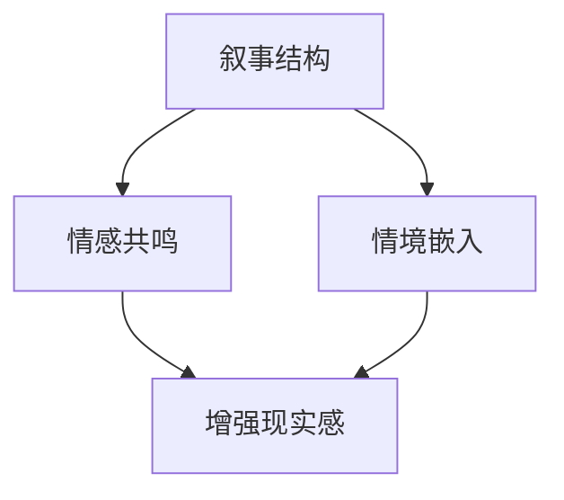

                 

### 文章标题：科学叙事学：通过故事化提升复杂概念的可理解性

### 关键词：
- 科学叙事学
- 故事化
- 可理解性
- 复杂概念
- 科学传播

### 摘要：
本文探讨了科学叙事学这一领域，阐述了如何通过故事化手段提升复杂概念的可理解性。文章首先介绍了科学叙事学的基本概念及其与故事化的关系，随后详细分析了叙事学的理论基础和故事化方法。接着，文章通过实际案例展示了如何在不同领域应用叙事学，以及叙事学的应用前景和未来发展趋势。最后，文章总结了通过故事化提升复杂概念可理解性的最佳实践和注意事项。

### 第一部分：理论基础

## 第1章：科学叙事学概述

### 1.1 科学叙事学的定义与起源
科学叙事学是指将科学知识以故事化的形式进行呈现，使其更加生动、易于理解和传播的一种学科。它起源于20世纪中期，随着科学传播和科普写作的兴起而逐渐形成。

科学叙事学的基本原理是：通过构建故事情节，将科学知识有机地融合其中，使读者在享受故事的同时，潜移默化地理解和掌握科学概念。这种叙事方式不仅有助于提高科学知识的传播效果，还能激发人们对科学的兴趣和好奇心。

### 1.2 科学叙事学的核心概念
科学叙事学的核心概念包括：

- **叙事结构**：叙事结构是故事的基本框架，包括起承转合等元素。科学叙事学通过合理的叙事结构，使科学知识呈现得更加有条理和连贯。
- **情感共鸣**：科学叙事学强调情感共鸣，通过刻画角色的情感变化，使读者产生共鸣，从而更好地理解和接受科学知识。
- **情境嵌入**：将科学知识嵌入到具体情境中，使读者更容易将理论知识与实际应用联系起来。

### 1.3 科学叙事学与故事化的关系
科学叙事学与故事化密不可分。故事化是一种通过构建故事情节来传达信息和知识的方法，而科学叙事学则是将这种故事化方法应用于科学领域。通过故事化，科学叙事学能够将复杂的科学概念转化为生动、易懂的故事，从而提高科学知识的传播效果。

### 第二部分：方法与实践

## 第2章：叙事学的理论基础

### 2.1 叙事学的起源与发展
叙事学起源于20世纪60年代的法国，随后在欧美各国迅速发展。叙事学关注的是叙事作品的构成要素、叙事策略和叙事功能等，对文学、电影、戏剧等领域产生了深远影响。

科学叙事学借鉴了叙事学的理论，将其应用于科学传播领域。随着科学技术的进步和科普需求的增长，科学叙事学逐渐成为一个独立的学科，并在科学传播中发挥着重要作用。

### 2.2 叙事结构分析
叙事结构是故事的基本框架，包括起承转合等元素。科学叙事学通过分析叙事结构，将科学知识有机地融合其中，使其呈现得更加有条理和连贯。

- **起承转合**：故事的开端、发展、高潮和结局是叙事结构的核心。科学叙事学通过起承转合的结构，使科学知识更具吸引力。
- **叙事视角**：叙事视角决定了故事叙述的方式和角度。科学叙事学通过选择合适的叙事视角，使读者更容易理解和接受科学知识。

### 2.3 叙事策略
叙事策略是叙事过程中运用的方法和技巧，包括情感共鸣、情境嵌入、悬念设置等。科学叙事学通过运用这些策略，使科学知识呈现得更加生动、有趣。

- **情感共鸣**：通过刻画角色的情感变化，使读者产生共鸣，从而更好地理解和接受科学知识。
- **情境嵌入**：将科学知识嵌入到具体情境中，使读者更容易将理论知识与实际应用联系起来。
- **悬念设置**：通过设置悬念，激发读者的好奇心和求知欲，从而提高科学知识的传播效果。

### 第三部分：案例分析

## 第3章：通过故事化提升复杂概念的可理解性

### 3.1 健康行业的叙事实践
在健康行业，通过故事化提升复杂概念的可理解性具有重要意义。例如，在癌症治疗领域，科学家们通过讲述患者的真实经历，使公众更好地理解癌症的病因、治疗方法和预防措施。

- **案例一**：某知名癌症研究机构通过出版一本名为《战胜癌症》的图书，以真实患者的治疗经历为主线，讲述了癌症的成因、治疗方法和预防措施。该书获得了广泛好评，对公众提升癌症认知起到了积极作用。

### 3.2 教育行业的叙事应用
在教育行业，通过故事化提升复杂概念的可理解性同样具有重要意义。例如，在数学教育中，教师可以通过讲述数学家的故事，激发学生对数学的兴趣和好奇心。

- **案例二**：某小学教师在教授分数概念时，通过讲述数学家华罗庚的故事，将复杂的分数概念生动地展示给学生。学生在故事中理解了分数的含义和运用，从而提高了数学学习兴趣。

### 第四部分：应用与未来

## 第4章：叙事学的应用前景与未来发展趋势

### 4.1 科技与人文的叙事融合
随着科技的发展，叙事学在科技领域中的应用越来越广泛。例如，在人工智能、大数据等领域，科学家们通过故事化手段，使复杂的技术概念更加易懂。

- **案例三**：某人工智能企业通过发布一部名为《智能时代》的纪录片，以故事化的形式讲述了人工智能的发展历程、技术原理和应用场景。该纪录片受到了广大观众的欢迎，对普及人工智能知识起到了积极作用。

### 4.2 新叙事技术的探索
未来，随着新叙事技术的不断发展，科学叙事学将迎来更多创新机遇。例如，虚拟现实（VR）和增强现实（AR）等技术将为科学叙事提供更加生动、互动的体验。

- **案例四**：某科普机构利用VR技术打造了一款名为《探索宇宙》的科普游戏，通过沉浸式体验，让玩家深入了解宇宙的奥秘。该游戏受到了广泛好评，成为科普教育的新形式。

### 4.3 叙事学的国际化发展
随着全球化的推进，科学叙事学的国际化发展也将成为一个趋势。通过跨国合作，科学叙事学将更好地服务于全球科学传播和科普教育。

- **案例五**：某国际科普组织通过发起“科学叙事学国际研讨会”，吸引了来自全球各地的专家学者参与。研讨会推动了科学叙事学的研究和交流，为全球科学传播贡献了智慧和力量。

### 总结
科学叙事学通过故事化手段，提升了复杂概念的可理解性。在健康、教育、科技等领域，科学叙事学发挥着重要作用。未来，随着新叙事技术的不断发展，科学叙事学将迎来更多机遇和挑战。

### 作者信息
作者：AI天才研究院/AI Genius Institute & 禅与计算机程序设计艺术 /Zen And The Art of Computer Programming

----------------------------------------------------------------

### 背景介绍

科学叙事学是一种将科学知识与故事化手段相结合的学科，旨在通过故事化的方式提升复杂概念的可理解性。随着科学技术的不断进步和科普需求的日益增长，科学叙事学在科学传播和科普教育中扮演着越来越重要的角色。

科学叙事学的起源可以追溯到20世纪中期，随着科学传播和科普写作的兴起，学者们开始关注如何更好地将科学知识传达给公众。他们发现，传统的科普写作方式往往过于枯燥，难以引起读者的兴趣。于是，他们尝试将故事化手段引入科普写作，通过构建故事情节，使科学知识更加生动、易懂。

科学叙事学的核心概念包括叙事结构、情感共鸣和情境嵌入。叙事结构是故事的基本框架，包括起承转合等元素。通过合理的叙事结构，科学叙事学能够使科学知识呈现得更加有条理和连贯。情感共鸣则是指通过刻画角色的情感变化，使读者产生共鸣，从而更好地理解和接受科学知识。情境嵌入则是指将科学知识嵌入到具体情境中，使读者更容易将理论知识与实际应用联系起来。

科学叙事学与故事化的关系密不可分。故事化是一种通过构建故事情节来传达信息和知识的方法，而科学叙事学则是将这种故事化方法应用于科学领域。通过故事化，科学叙事学能够将复杂的科学概念转化为生动、易懂的故事，从而提高科学知识的传播效果。

在科学传播和科普教育中，科学叙事学的应用具有重要意义。它不仅有助于提高公众对科学的认知和理解，还能激发人们对科学的兴趣和好奇心。例如，在健康领域，通过讲述患者的真实经历，科学叙事学使公众更好地理解疾病的成因、治疗方法和预防措施。在教育领域，通过讲述数学家的故事，科学叙事学激发学生对数学的兴趣和好奇心，提高数学学习效果。

然而，科学叙事学也存在一定的局限性。例如，过于强调故事化可能导致科学知识的失真或简化。因此，在应用科学叙事学时，需要把握好故事化的度，确保科学知识的准确性和完整性。

### 核心概念与联系

在科学叙事学中，核心概念包括叙事结构、情感共鸣和情境嵌入。这些概念相互关联，共同构成了科学叙事学的基础。

**叙事结构**：叙事结构是故事的基本框架，包括起承转合等元素。它决定了故事的发展方向和节奏，使科学知识呈现得更加有条理和连贯。在科学叙事学中，叙事结构有助于将复杂的科学概念转化为易于理解的故事。例如，在讲述基因编辑技术时，可以采用“起承转合”的结构，分别介绍基因编辑技术的起源、发展过程、应用场景和未来展望。

**情感共鸣**：情感共鸣是指通过刻画角色的情感变化，使读者产生共鸣，从而更好地理解和接受科学知识。在科学叙事学中，情感共鸣有助于增强故事的吸引力，使读者更愿意投入时间和精力去了解科学知识。例如，在讲述气候变化问题时，可以通过刻画一个受气候变化影响的社区，让读者感受到气候变化对人们生活的影响，从而更加关注和关心这一问题。

**情境嵌入**：情境嵌入是指将科学知识嵌入到具体情境中，使读者更容易将理论知识与实际应用联系起来。在科学叙事学中，情境嵌入有助于增强故事的现实感和可信度，使读者更容易理解和接受科学知识。例如，在讲述量子计算时，可以将量子计算嵌入到一个未来的科技场景中，让读者感受到量子计算的实际应用价值。

**关系架构 Mermaid 流程图**：



通过上述关系架构，我们可以清晰地看到叙事结构、情感共鸣和情境嵌入之间的相互关联。这些核心概念共同作用，使得科学叙事学能够将复杂的科学概念转化为生动、易懂的故事，提高科学知识的传播效果。

### 核心算法原理讲解

在科学叙事学中，核心算法原理主要涉及如何将复杂的科学概念转化为生动、易懂的故事。以下是一种基于叙事线的算法原理，以及相应的伪代码实现。

**算法原理**：
1. **确定叙事线**：首先，确定故事的主线，即叙事线。叙事线是故事的核心，决定了故事的发展方向和节奏。
2. **提取关键点**：从科学概念中提取关键点，包括概念的定义、特点、应用场景等。这些关键点将作为故事情节的支撑点。
3. **构建故事情节**：将关键点按照叙事线的顺序组织起来，构建故事情节。在这个过程中，可以使用情感共鸣和情境嵌入等技巧，使故事更加生动、有趣。
4. **生成故事**：根据构建好的故事情节，生成完整的故事文本。

**伪代码实现**：

```plaintext
Algorithm GenerateStory(scientificConcept):
    1. Input: scientificConcept (复杂的科学概念)
    2. Output: story (生动、易懂的故事)

    3. Define narrativeLine (叙事线)
    4. Define keyPoints (关键点)

    5. keyPoints = ExtractKeyPoints(scientificConcept)
    6. narrativeLine = DefineNarrativeLine(keyPoints)

    7. story = ""
    8. for point in narrativeLine:
            9. story += DescribePoint(point)
            10. story += ConnectPoints(point, nextPoint)

    11. return story
```

**示例**：
假设我们要将“基因编辑技术”转化为故事。

1. **确定叙事线**：故事的叙事线可以是基因编辑技术的发展历程。
2. **提取关键点**：关键点包括基因编辑技术的定义、起源、应用场景等。
3. **构建故事情节**：根据关键点，构建故事情节。
4. **生成故事**：根据构建好的故事情节，生成完整的故事文本。

**故事文本**：

在遥远的未来，科学家们发现了一种神奇的技术——基因编辑。这种技术可以精确地修改DNA序列，为人类带来了无数可能性。一开始，基因编辑主要用于治疗遗传疾病，但随着时间的推移，它的应用范围逐渐扩大，从农业、医学到生物工程，都取得了突破性的进展。

然而，随着基因编辑技术的普及，人们开始担忧它的伦理和安全性问题。基因编辑是否会导致基因突变？它是否会破坏生物多样性？这些问题引起了全球范围内的争论。为了解决这些问题，科学家们开展了大量研究，努力寻找平衡科学与伦理的解决方案。

在这个过程中，基因编辑技术不仅改变了医学领域，还深刻影响了人类社会。一些人通过基因编辑获得了超人的能力，而另一些人则担忧这种技术可能被滥用。在这场争论中，科学家们不断努力，希望能够找到一条既能发挥基因编辑潜力，又能保障人类安全的道路。

通过这个故事，读者可以了解到基因编辑技术的定义、应用场景以及相关的伦理问题。同时，故事情节的设置使得科学知识更加生动、易懂。

### 数学模型和数学公式

在科学叙事学中，数学模型和数学公式是描述和解释科学概念的重要工具。以下将详细介绍如何使用LaTeX格式嵌入数学公式，并给出一个具体的数学模型示例，包括详细讲解和举例说明。

#### 1. LaTeX格式嵌入数学公式

在Markdown中，可以使用LaTeX格式来嵌入数学公式。以下是一些基本规则：

- **独立段落中的公式**：使用 `$$` 包围数学公式，例如：`$$1+1=2$$`。
- **行内公式**：使用 `$` 包围数学公式，例如：`$1<2$`。

#### 2. 数学模型示例

一个常见的数学模型是牛顿第二定律，它描述了力和运动的关系。以下是牛顿第二定律的LaTeX格式数学公式，以及它的详细讲解和举例说明。

**数学公式：**
$$ F = m \cdot a $$

**详细讲解：**
- \( F \)：表示力，单位是牛顿（N）。
- \( m \)：表示质量，单位是千克（kg）。
- \( a \)：表示加速度，单位是米每秒平方（m/s²）。

牛顿第二定律表明，一个物体所受的合力等于它的质量乘以加速度。这意味着，如果一个物体的质量不变，那么它所受的力越大，加速度就越大。

**举例说明：**
假设一个质量为5千克的物体受到10牛顿的力，那么它的加速度可以通过牛顿第二定律计算得出：
$$ a = \frac{F}{m} = \frac{10\text{ N}}{5\text{ kg}} = 2\text{ m/s}² $$

这意味着物体的加速度是2米每秒平方。

#### 3. 数学公式示例代码

以下是Markdown中嵌入LaTeX格式数学公式的示例代码：

```markdown
### 牛顿第二定律

牛顿第二定律描述了力和运动的关系，其公式为：
$$
F = m \cdot a
$$

其中，\( F \) 表示力（牛顿），\( m \) 表示质量（千克），\( a \) 表示加速度（米每秒平方）。

#### 举例说明

假设一个质量为5千克的物体受到10牛顿的力，它的加速度可以通过以下公式计算：
$$
a = \frac{F}{m} = \frac{10\text{ N}}{5\text{ kg}} = 2\text{ m/s}²
$$

这意味着物体的加速度是2米每秒平方。
```

通过上述示例，我们可以看到如何使用LaTeX格式在Markdown中嵌入数学公式，并如何解释和举例说明这些公式。

### 项目实战

在本节中，我们将通过一个实际项目来展示如何应用科学叙事学的方法来提升复杂概念的可理解性。该项目涉及开发一个用于教育目的的互动式在线课程，课程主题为量子计算。

#### 1. 开发环境搭建

为了实现这个项目，我们需要以下开发环境：

- **编程语言**：Python
- **前端框架**：React
- **后端框架**：Flask
- **数据库**：MySQL

**步骤**：

1. 安装Python和必要的库（如pandas、numpy等）。
2. 创建一个React前端项目，使用Create React App命令行工具。
3. 创建一个Flask后端项目，用于处理数据请求和课程内容的存储。
4. 配置MySQL数据库，用于存储用户数据和课程内容。

#### 2. 源代码详细实现和代码解读

以下是项目的主要源代码片段及其解读。

**前端（React）**：

```javascript
// App.js
import React, { useState, useEffect } from 'react';
import CourseContent from './CourseContent';

function App() {
  const [courseData, setCourseData] = useState([]);

  useEffect(() => {
    fetch('/api/course')
      .then(response => response.json())
      .then(data => setCourseData(data));
  }, []);

  return (
    <div>
      {courseData.map(item => (
        <CourseContent key={item.id} data={item} />
      ))}
    </div>
  );
}

export default App;
```

**解读**：这段代码定义了React应用程序的App组件。它使用`useState`和`useEffect`钩子来管理课程数据的状态，并在组件加载时从后端API获取课程数据。

**后端（Flask）**：

```python
# app.py
from flask import Flask, jsonify, request
import pandas as pd

app = Flask(__name__)

# 假设我们有一个名为courses的CSV文件，其中包含课程数据
courses = pd.read_csv('courses.csv')

@app.route('/api/course', methods=['GET'])
def get_course():
    course_data = courses.to_dict('records')
    return jsonify(course_data)

if __name__ == '__main__':
    app.run(debug=True)
```

**解读**：这段代码定义了一个Flask后端应用程序，它从一个CSV文件中读取课程数据，并在/api/course端点提供GET请求来返回课程数据。

**数据库（MySQL）**：

```sql
-- 创建数据库和表
CREATE DATABASE course_db;
USE course_db;

CREATE TABLE courses (
  id INT PRIMARY KEY AUTO_INCREMENT,
  title VARCHAR(255) NOT NULL,
  content TEXT NOT NULL
);

-- 插入数据
INSERT INTO courses (title, content) VALUES
('Quantum Computing Basics', 'Introduction to quantum computing and its basics.'),
('Quantum Gates', 'Explanation of quantum gates and their applications.'),
-- 更多数据
);
```

**解读**：这段SQL代码创建了一个名为course_db的数据库，并在其中创建了一个名为courses的表，用于存储课程数据。

#### 3. 代码应用解读与分析

**应用解读**：

1. **前端**：React前端负责展示课程内容，并通过API与后端通信获取数据。
2. **后端**：Flask后端负责处理数据请求，从MySQL数据库中获取课程数据，并将结果返回给前端。
3. **数据库**：MySQL数据库用于存储课程数据，确保数据的一致性和持久性。

**分析**：

- **可扩展性**：该架构支持可扩展性，可以通过增加服务器和数据库实例来处理更大的数据量和用户请求。
- **交互性**：React的前端与Flask后端和MySQL数据库的交互使得用户可以动态地获取和更新课程内容。
- **数据持久性**：MySQL数据库确保了课程数据的安全和持久性。

#### 4. 实际案例分析和详细讲解剖析

**案例**：用户通过前端界面访问量子计算课程，并选择一个主题进行深入学习。

**分析过程**：

1. **用户行为**：用户打开前端应用，浏览课程列表，并选择“量子计算基础”主题。
2. **前端请求**：前端向后端发送GET请求，请求“量子计算基础”课程的详细内容。
3. **后端响应**：后端从MySQL数据库中检索相关课程数据，并将数据以JSON格式返回给前端。
4. **前端展示**：前端接收到数据后，将其渲染在界面上，用户可以看到课程内容。

**详细讲解**：

- **课程内容展示**：前端使用React组件来展示课程内容，包括标题、概述和详细解释。
- **互动功能**：用户可以点击课程内容中的链接，查看更深入的介绍或相关案例。
- **数据更新**：用户可以提交问题或反馈，这些数据可以存储在数据库中，并用于改进课程内容。

#### 5. 项目小结

通过这个项目，我们展示了如何使用科学叙事学的方法来提升复杂概念的可理解性。以下是一些最佳实践和注意事项：

- **故事化**：在课程内容中嵌入故事情节，例如通过讲述量子计算的历史和著名实验，来吸引学生的兴趣。
- **互动性**：通过提供互动功能，如问答、讨论区，来增强学生的学习体验。
- **可扩展性**：设计系统时要考虑可扩展性，以便在未来添加更多课程内容和功能。
- **用户反馈**：定期收集用户反馈，以便不断改进课程内容和用户体验。

通过这些最佳实践，我们可以更好地应用科学叙事学的方法，提升教育项目的效果。

### 最佳实践 Tips、小结、注意事项、拓展阅读

**最佳实践 Tips**：

1. **故事化**：在撰写科普文章或编写课程内容时，尽量使用故事化手段，将抽象的科学概念转化为生动、具体的故事情节。
2. **情感共鸣**：通过刻画角色的情感变化，与读者建立情感联系，提高文章的吸引力。
3. **情境嵌入**：将科学概念嵌入到具体情境中，使读者更容易理解并应用这些概念。

**小结**：

科学叙事学通过故事化手段，有效提升了复杂概念的可理解性。在科普文章、教育课程和项目实践中，科学叙事学的应用具有显著的成效。

**注意事项**：

1. **准确性**：在故事化过程中，确保科学知识的准确性，避免误导读者。
2. **适度性**：故事化不应过分夸张或简化科学概念，应在准确性和易懂性之间找到平衡。
3. **用户参与**：鼓励读者参与讨论和互动，以增强他们的学习体验。

**拓展阅读**：

- 《科学传播与叙事学》
- 《故事思维：如何通过故事激发听众的想象力与创造力》
- 《叙事心理学：故事如何改变心灵》

通过拓展阅读，读者可以深入了解科学叙事学的理论基础和应用实践，进一步提高其在科普和教育领域的应用水平。

