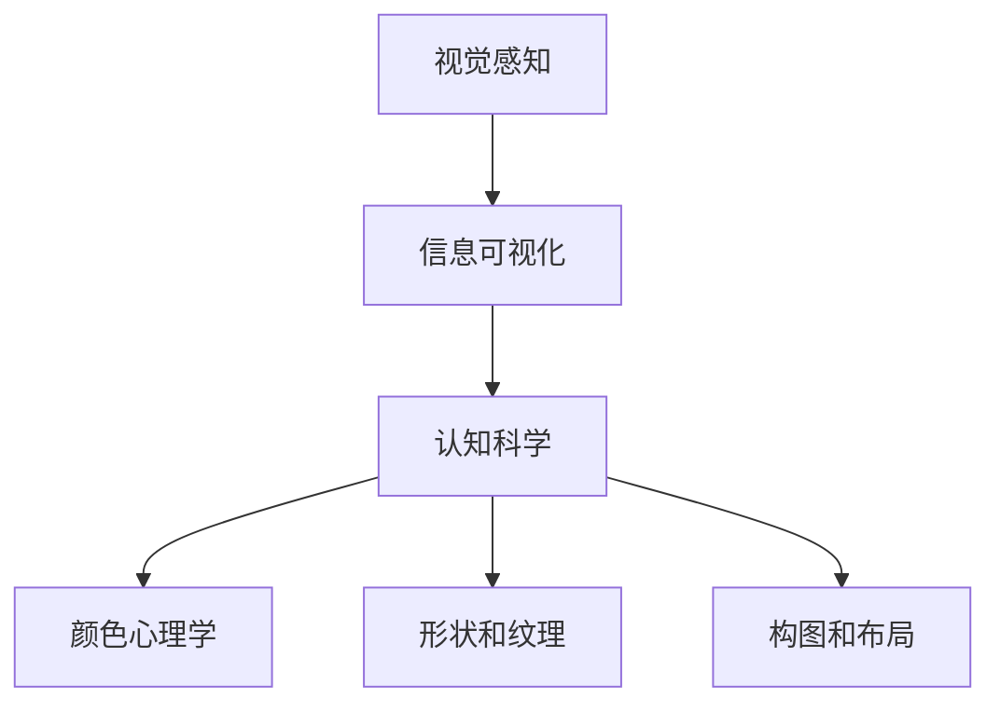

                 

## 引言

### 科学可视化的意义

科学可视化是利用图形、图像和其他视觉表现形式来揭示数据内在结构、模式与关系的科学方法。它不仅是一种技术，更是一种强大的沟通工具，能够将复杂的数据和分析结果以直观、易懂的方式呈现给用户。科学可视化在科学研究、数据分析、工程应用以及教育等多个领域发挥着重要作用。

首先，科学可视化可以帮助研究人员更好地理解和解释复杂数据。通过将抽象的数据转化为可视化的形式，研究人员可以更直观地发现数据中的趋势、异常和相关性。例如，在生物医学研究中，科学可视化可以用来展示分子结构、细胞运动和基因表达等数据，帮助科学家们揭示生物机制和病理过程。

其次，数据艺术作为一种融合科学可视化的艺术形式，赋予数据以美感和情感，使观众在审美体验中更好地理解和吸收信息。数据艺术不仅限于科学领域，它还广泛应用于商业、媒体和设计等领域，通过视觉表现来传达数据背后的故事和价值。

科学可视化与数据艺术的结合，使得我们不仅能够更好地理解和分析数据，还能够通过艺术化的手段使其更具吸引力和影响力。这种结合不仅提升了数据的可视化和传达效果，也推动了科学、技术和艺术之间的相互交融与创新发展。

### 数据艺术的价值

数据艺术是一种将科学可视化与艺术创作相结合的新兴领域，通过视觉艺术手法来表达数据及其背后的信息与故事。数据艺术不仅具有美学价值，还蕴含着丰富的科学内涵和沟通价值。首先，数据艺术通过视觉形式将数据转化为艺术作品，使观众能够在欣赏艺术的同时理解和吸收数据信息，从而实现了科学传播和知识普及。例如，数据艺术作品可以展示气候变化的数据，帮助人们更直观地感受到环境变化的紧迫性。

其次，数据艺术在科学研究中也有重要应用。通过数据艺术，科学家可以更直观地展示研究数据，使研究成果更易于理解和接受。例如，在物理学研究中，科学家可以利用数据艺术来展示粒子碰撞的轨迹和结果，使复杂的科学概念变得易于理解。

此外，数据艺术在商业和媒体领域也具有重要价值。在商业分析中，数据艺术可以用来展示市场趋势、消费者行为等数据，帮助企业做出更明智的商业决策。在媒体领域，数据艺术可以用来制作引人入胜的数据新闻图表，增强新闻报道的可读性和影响力。

总之，数据艺术不仅丰富了科学可视化领域，还为科学传播、教育和商业等领域带来了新的创新和机遇。通过数据艺术，我们能够以更直观、更动人的方式传达科学知识和数据信息，推动科学、艺术和技术的融合与发展。

### 本书结构安排

本书共分为七个章节，旨在系统地介绍科学可视化和数据艺术的基础理论、技术方法与实践应用。以下是各章节的具体内容和结构安排：

### 第1章 引言

- **科学可视化的意义**：介绍科学可视化的定义、作用和重要性。
- **数据艺术的价值**：探讨数据艺术在科学传播、教育和商业等领域的价值。

### 第2章 可视化基础理论

- **可视化的基本原则**：探讨视觉感知、信息可视化和认知科学的关系。
- **可视化的分类**：介绍常见的可视化类型及其应用场景。
- **可视化与认知科学的关系**：讨论可视化对人类认知的影响。
- **数据艺术中的视觉心理学**：探讨视觉元素在数据艺术创作中的运用。

### 第3章 数据准备与预处理

- **数据获取与清洗**：介绍数据收集方法和数据清洗技术。
- **数据规范化**：探讨数据格式化、归一化和特征提取。
- **数据降维与特征提取**：讨论降维技术和特征提取方法。
- **数据可视化前的预处理**：介绍预处理步骤及其在可视化中的作用。

### 第4章 常见可视化技术

- **图表可视化**：介绍图表可视化类型、制作方法和应用。
- **网络可视化**：讨论社交网络分析、物理网络图和关联网络可视化的方法。
- **地理空间可视化**：介绍地图可视化、空间分布图和时间-空间可视化的技术。

### 第5章 高级可视化技术

- **交互式可视化**：探讨交互式可视化原理、交互操作和工具应用。
- **虚拟现实与增强现实可视化**：介绍VR/AR可视化的技术原理和应用案例。
- **艺术化可视化**：讨论艺术化可视化的定义、方法和案例分析。

### 第6章 数据艺术实践

- **数据艺术创作流程**：介绍数据艺术创作的基本流程和步骤。
- **数据艺术作品的评价标准**：探讨评价数据艺术作品的标准和方法。
- **数据艺术项目实战**：介绍一个具体的数据艺术项目，包括数据收集、预处理、可视化设计和艺术化处理。

### 第7章 未来发展趋势与挑战

- **可视化技术的未来发展方向**：探讨可视化技术的创新趋势和发展前景。
- **数据艺术的创新空间**：分析数据艺术的创新机遇和挑战。
- **可视化与数据艺术面临的挑战**：讨论可视化与数据艺术领域面临的挑战和应对策略。

通过以上七个章节的介绍，本书将帮助读者全面了解科学可视化和数据艺术的原理、方法与实践，为读者提供深入理解和应用这些技术的指导。

### 可视化基础理论

#### 可视化的基本原则

科学可视化是一种将抽象数据转化为视觉形式，以帮助人们理解和分析数据的技术。其基本原则包括以下几个方面：

1. **信息可读性**：科学可视化应使信息易于理解和解读。通过合理的颜色选择、形状设计、标注和图例，增强数据的可读性。
2. **数据完整性**：在可视化过程中，应确保数据的完整性和准确性，避免信息的丢失或误读。
3. **层次感**：数据可视化应具有清晰的层次结构，帮助观众从整体到细节逐步理解数据。
4. **美学原则**：科学可视化应遵循美学原则，使数据可视化作品不仅具有功能性，还具有视觉美感。

#### 可视化的分类

科学可视化可以根据不同的维度和用途进行分类，主要包括以下几种类型：

1. **图表可视化**：包括柱状图、折线图、饼图、散点图等，用于展示数据的基本统计信息。
2. **网络可视化**：用于展示实体之间的复杂关系，如社交网络图、物理网络图和关联网络。
3. **地理空间可视化**：通过地图和空间分布图展示数据的空间分布和地理特征。
4. **交互式可视化**：结合用户的交互操作，提供更丰富的可视化体验和数据分析功能。

#### 可视化与认知科学的关系

科学可视化与认知科学有着密切的联系。认知科学研究表明，人类大脑对视觉信息的处理效率远远高于文本信息。因此，科学可视化可以有效地帮助人们理解和记忆复杂的信息。

1. **视觉感知**：视觉感知是科学可视化的重要基础。通过合理的视觉设计，可以提高数据的可读性和信息传递效率。
2. **认知负荷**：科学可视化可以减少认知负荷，帮助观众更专注于数据的分析和理解。
3. **信息可视化**：信息可视化是一种将信息以视觉形式呈现的方法，它结合了视觉感知和认知科学的研究成果，为数据分析和解释提供了强有力的工具。

#### 数据艺术中的视觉心理学

数据艺术是一种将科学可视化与艺术创作相结合的新兴领域。视觉心理学在数据艺术创作中起着关键作用，主要体现在以下几个方面：

1. **颜色心理学**：颜色不仅用于区分不同类别的数据，还可以传达情感和氛围。例如，红色常用于表示危险或重要信息，绿色则常用于表示安全和成功。
2. **形状和纹理**：形状和纹理的选择可以影响观众对数据的感知和理解。例如，圆形常用于表示柔和和和谐，而直线则常用于表示精确和有序。
3. **构图和布局**：合理的构图和布局可以提升数据艺术作品的美感和信息传递效率。常见的构图原则包括对角线、对称、层次感等。

通过视觉心理学的应用，数据艺术不仅能够更好地传达数据信息，还可以提升作品的艺术价值和观赏性。

#### 核心概念原理之间的关系架构

为了更清晰地理解可视化基础理论中的核心概念和原理，我们可以使用Mermaid流程图来展示它们之间的关系。



在上面的流程图中，视觉感知是科学可视化的基础，它通过信息可视化与认知科学相结合，形成了科学可视化。同时，视觉心理学中的颜色心理学、形状和纹理、构图和布局等因素在数据艺术创作中起到了重要作用。

#### 伪代码示例

为了详细阐述数据艺术中的视觉设计原则，以下是一个简单的伪代码示例，用于创建一个柱状图并应用颜色心理学：

```python
def create_bar_chart(data, colors):
    # 数据准备
    bar_width = 0.8
    x_values = [i for i, _ in enumerate(data)]
    y_values = data

    # 创建柱状图
    plt.bar(x_values, y_values, width=bar_width, color=colors)

    # 添加颜色注释
    for i, color in enumerate(colors):
        plt.text(x_values[i], y_values[i], s=f"({i})", color=color)

    # 设置标题和标签
    plt.title("数据与颜色心理学")
    plt.xlabel("数据类别")
    plt.ylabel("数据值")

    # 显示图表
    plt.show()
```

#### 数学模型和公式

在数据艺术中，颜色心理学是一个重要的研究领域。以下是一个简单的数学模型，用于计算颜色对比度：

$$
\text{Contrast} = \frac{\lvert \text{Color1} - \text{Color2} \rvert}{\max(\text{Color1, Color2})}
$$

其中，Color1和Color2是两个颜色的数值表示。通过调整颜色对比度，可以增强数据视觉效果的清晰度和可读性。

#### 举例说明

假设我们有两个颜色：红色（RGB值：255, 0, 0）和绿色（RGB值：0, 255, 0）。使用上述公式计算颜色对比度：

$$
\text{Contrast} = \frac{\lvert 255 - 0 \rvert}{\max(255, 0)} = 255
$$

结果显示，红色和绿色之间的对比度非常高，这有助于观众在图表中区分这两种颜色。

通过上述内容和示例，我们可以更深入地理解科学可视化和数据艺术中的核心概念和原理，为实际应用提供理论支持和实践指导。

### 数据准备与预处理

在进行科学可视化和数据艺术创作时，数据准备与预处理是至关重要的步骤。这一阶段的工作旨在确保数据的准确性和完整性，从而为后续的可视化设计提供可靠的基础。以下是数据准备与预处理的主要步骤及其在可视化中的重要作用：

#### 数据获取

数据获取是数据准备的第一步，涉及从各种来源收集所需的数据。这些来源可能包括数据库、网络爬虫、传感器和用户输入等。在数据获取过程中，需要确保数据的真实性和有效性。

**关键步骤**：
1. 确定数据需求：明确项目目标，确定所需的数据类型和范围。
2. 数据采集：使用适当的工具和技巧从目标来源获取数据。
3. 数据验证：验证数据的准确性和完整性，确保数据没有缺失或错误。

#### 数据清洗

数据清洗是数据预处理的核心步骤，目的是消除数据中的噪声和不一致。噪声数据可能来源于数据采集过程中的误差或数据来源的不稳定性。

**关键步骤**：
1. 填补缺失值：使用合适的算法或方法填补数据中的空缺。
2. 去除重复数据：删除重复的数据条目，确保数据唯一性。
3. 数据格式化：统一数据格式，使其适应后续处理和分析。

#### 数据规范化

数据规范化是指将不同来源的数据转化为统一的格式，以便于进一步处理和分析。这一步骤有助于简化数据结构，提高数据处理的效率。

**关键步骤**：
1. 数据归一化：通过缩放或平移，将数据转换为相同的尺度。
2. 数据标准化：消除数据中的量纲，使其可以进行比较和分析。

#### 数据降维与特征提取

降维与特征提取是数据预处理的高级步骤，旨在减少数据维度，提取关键特征，从而简化数据结构，提高可视化效率。

**关键步骤**：
1. 特征选择：从原始数据中挑选出最有用的特征，去除冗余特征。
2. 主成分分析（PCA）：通过数学方法将高维数据转换为低维空间，保留主要信息。

#### 数据可视化前的预处理

数据可视化前的预处理包括对数据质量进行最后的检查和优化，确保数据能够以最佳方式呈现。

**关键步骤**：
1. 数据校正：根据实际需求，对数据进行必要的校正和调整。
2. 数据增强：通过添加注释、标签或图像效果，增强数据的可读性和吸引力。
3. 数据可视化测试：在可视化工具中进行数据预览，确保数据能够正确呈现。

#### 核心算法原理讲解

在数据预处理过程中，常用的算法包括填补缺失值、去除重复数据、数据归一化和主成分分析（PCA）等。

**伪代码示例**：

```python
import numpy as np
from sklearn.preprocessing import StandardScaler
from sklearn.decomposition import PCA

# 数据预处理伪代码

# 填补缺失值
def impute_missing_values(data):
    # 使用均值填补缺失值
    data[data == np.nan] = np.mean(data)
    return data

# 去除重复数据
def remove_duplicates(data):
    return np.unique(data)

# 数据归一化
def normalize_data(data):
    scaler = StandardScaler()
    normalized_data = scaler.fit_transform(data)
    return normalized_data

# 主成分分析
def perform_pca(data, n_components):
    pca = PCA(n_components=n_components)
    principal_components = pca.fit_transform(data)
    return principal_components
```

#### 数学模型和公式

在数据预处理过程中，常用的数学模型和公式包括填补缺失值的均值填补公式、数据归一化的标准化公式以及主成分分析（PCA）的协方差矩阵计算公式。

**均值填补公式**：
$$
x_{\text{imputed}} = \frac{\sum_{i=1}^{N} x_i}{N}
$$
其中，$x_{\text{imputed}}$ 是填补后的数据，$x_i$ 是原始数据中的每一个值，$N$ 是数据的总个数。

**标准化公式**：
$$
z = \frac{(x - \mu)}{\sigma}
$$
其中，$z$ 是标准化后的数据，$x$ 是原始数据，$\mu$ 是数据的均值，$\sigma$ 是数据的标准差。

**协方差矩阵计算公式**：
$$
\text{Cov}(X, Y) = \frac{1}{N-1} \sum_{i=1}^{N} (x_i - \mu_x)(y_i - \mu_y)
$$
其中，$\text{Cov}(X, Y)$ 是协方差矩阵，$x_i$ 和 $y_i$ 是数据集合中的每一个值，$\mu_x$ 和 $\mu_y$ 分别是$x$ 和$y$ 的均值。

#### 举例说明

假设我们有一组数据 [2, 4, 6, 8, 10]，其中第三个数据缺失。使用均值填补公式，我们可以填补缺失值：

$$
x_{\text{imputed}} = \frac{(2 + 4 + 6 + 8 + 10)}{5} = 6
$$
因此，缺失的值为6。

#### 数学公式与详细讲解

**均值填补公式**：
$$
\bar{x} = \frac{1}{N} \sum_{i=1}^{N} x_i
$$
其中，$\bar{x}$ 是数据的均值，$N$ 是数据的个数，$x_i$ 是每个数据值。

假设我们有一组数据 [2, 4, 6, 8, 10]，使用均值填补公式计算均值：

$$
\bar{x} = \frac{(2 + 4 + 6 + 8 + 10)}{5} = 6
$$
因此，这组数据的均值为6。如果数据中有一个值缺失，我们可以使用这个均值来填补缺失值。

**标准化公式**：
$$
z = \frac{(x - \mu)}{\sigma}
$$
其中，$z$ 是标准化后的数据，$x$ 是原始数据，$\mu$ 是数据的均值，$\sigma$ 是数据的标准差。

假设我们有一组数据 [2, 4, 6, 8, 10]，计算均值和标准差：

$$
\mu = \frac{(2 + 4 + 6 + 8 + 10)}{5} = 6
$$
$$
\sigma = \sqrt{\frac{1}{N-1} \sum_{i=1}^{N} (x_i - \mu)^2} = \sqrt{\frac{1}{4} \times (2^2 + 4^2 + 6^2 + 8^2 + 10^2)} = 3.16
$$
使用标准化公式，我们可以将每个数据值标准化：

$$
z_1 = \frac{(2 - 6)}{3.16} = -1.58
$$
$$
z_2 = \frac{(4 - 6)}{3.16} = -0.79
$$
$$
z_3 = \frac{(6 - 6)}{3.16} = 0
$$
$$
z_4 = \frac{(8 - 6)}{3.16} = 0.79
$$
$$
z_5 = \frac{(10 - 6)}{3.16} = 1.58
$$
标准化后的数据为 [-1.58, -0.79, 0, 0.79, 1.58]。

**协方差矩阵计算公式**：
$$
\text{Cov}(X, Y) = \frac{1}{N-1} \sum_{i=1}^{N} (x_i - \mu_x)(y_i - \mu_y)
$$
其中，$\text{Cov}(X, Y)$ 是协方差矩阵，$x_i$ 和 $y_i$ 是数据集合中的每一个值，$\mu_x$ 和 $\mu_y$ 分别是$x$ 和$y$ 的均值。

假设我们有两组数据 X = [2, 4, 6, 8, 10] 和 Y = [3, 5, 7, 9, 11]，计算协方差矩阵：

$$
\mu_x = \frac{(2 + 4 + 6 + 8 + 10)}{5} = 6
$$
$$
\mu_y = \frac{(3 + 5 + 7 + 9 + 11)}{5} = 7
$$
$$
\text{Cov}(X, Y) = \frac{1}{4} \times ((2-6)(3-7) + (4-6)(5-7) + (6-6)(7-7) + (8-6)(9-7) + (10-6)(11-7))
$$
$$
\text{Cov}(X, Y) = \frac{1}{4} \times ((-4)(-4) + (-2)(-2) + (0)(0) + (2)(2) + (4)(4))
$$
$$
\text{Cov}(X, Y) = \frac{1}{4} \times (16 + 4 + 0 + 4 + 16)
$$
$$
\text{Cov}(X, Y) = \frac{1}{4} \times 40
$$
$$
\text{Cov}(X, Y) = 10
$$
因此，协方差矩阵为 [10]。

通过上述内容，我们可以更深入地理解数据准备与预处理中的核心算法原理、数学模型和公式，为科学可视化和数据艺术创作提供坚实的理论基础和实践指导。

### 常见可视化技术

#### 图表可视化

图表可视化是一种将数据以图形形式呈现的方法，用于展示数据的基本统计信息。常见的图表类型包括柱状图、折线图、饼图和散点图等。每种图表都有其独特的用途和优势。

1. **柱状图**：柱状图用于比较不同类别或组的数据。其优点是直观、易于理解，常用于展示不同类别的数量或比例。

   **示例**：假设我们有一组销售数据，可以使用柱状图展示不同产品类别的销售量。

   ```python
   import matplotlib.pyplot as plt
   
   sales_data = [120, 150, 180, 200, 220]
   products = ['Electronics', 'Clothing', 'Furniture', 'Toys', 'Sports']
   
   plt.bar(products, sales_data)
   plt.xlabel('Products')
   plt.ylabel('Sales')
   plt.title('Sales by Product Category')
   plt.show()
   ```

2. **折线图**：折线图用于展示数据随时间的变化趋势。其优点是能够清晰地显示数据的增长或减少趋势。

   **示例**：假设我们有一组月销售额数据，可以使用折线图展示销售额随时间的变化。

   ```python
   import matplotlib.pyplot as plt
   
   months = ['Jan', 'Feb', 'Mar', 'Apr', 'May', 'Jun']
   sales_data = [100, 150, 200, 250, 300, 350]
   
   plt.plot(months, sales_data)
   plt.xlabel('Months')
   plt.ylabel('Sales')
   plt.title('Sales by Month')
   plt.show()
   ```

3. **饼图**：饼图用于展示数据的比例关系，特别适合展示各部分占总体的比例。

   **示例**：假设我们有一组销售额数据，可以使用饼图展示不同产品类别的销售额占比。

   ```python
   import matplotlib.pyplot as plt
   
   sales_data = [120, 150, 180, 200, 220]
   labels = ['Electronics', 'Clothing', 'Furniture', 'Toys', 'Sports']
   sizes = sales_data
   
   plt.pie(sizes, labels=labels, autopct='%.1f%%')
   plt.title('Sales by Product Category')
   plt.show()
   ```

4. **散点图**：散点图用于展示两组数据之间的关系，常用于分析数据之间的相关性。

   **示例**：假设我们有一组身高和体重的数据，可以使用散点图展示身高和体重之间的关系。

   ```python
   import matplotlib.pyplot as plt
   
   heights = [170, 175, 180, 185, 190]
   weights = [60, 65, 70, 75, 80]
   
   plt.scatter(heights, weights)
   plt.xlabel('Height (cm)')
   plt.ylabel('Weight (kg)')
   plt.title('Height vs Weight')
   plt.show()
   ```

#### 网络可视化

网络可视化是一种展示实体之间复杂关系的图表类型。它可以帮助我们直观地理解网络结构、节点关系和路径分析。

1. **社交网络分析**：社交网络分析用于展示个体之间的关系，如社交网络图、朋友圈分析等。

   **示例**：假设我们有一组社交网络数据，可以使用社交网络图展示用户之间的互动关系。

   ```python
   import networkx as nx
   import matplotlib.pyplot as plt
   
   # 创建图
   G = nx.Graph()
   
   # 添加节点和边
   G.add_nodes_from(['Alice', 'Bob', 'Charlie', 'Dave'])
   G.add_edges_from([('Alice', 'Bob'), ('Alice', 'Charlie'), ('Bob', 'Dave')])
   
   # 绘制图
   pos = nx.spring_layout(G)
   nx.draw(G, pos, with_labels=True)
   plt.show()
   ```

2. **物理网络图**：物理网络图用于展示设备、网络节点和线路之间的连接关系。

   **示例**：假设我们有一组网络设备数据，可以使用物理网络图展示网络拓扑结构。

   ```python
   import networkx as nx
   import matplotlib.pyplot as plt
   
   # 创建图
   G = nx.Graph()
   
   # 添加节点和边
   G.add_nodes_from(['Switch1', 'Router1', 'Server1', 'Switch2'])
   G.add_edges_from([('Switch1', 'Router1'), ('Router1', 'Server1'), ('Server1', 'Switch2')])
   
   # 绘制图
   pos = nx.spring_layout(G)
   nx.draw(G, pos, with_labels=True)
   plt.show()
   ```

3. **关联网络可视化**：关联网络可视化用于展示多个实体之间的复杂关联关系。

   **示例**：假设我们有一组产品关联数据，可以使用关联网络图展示产品之间的关联关系。

   ```python
   import networkx as nx
   import matplotlib.pyplot as plt
   
   # 创建图
   G = nx.Graph()
   
   # 添加节点和边
   G.add_nodes_from(['ProductA', 'ProductB', 'ProductC', 'ProductD'])
   G.add_edges_from([('ProductA', 'ProductB'), ('ProductA', 'ProductC'), ('ProductB', 'ProductD')])
   
   # 绘制图
   pos = nx.spring_layout(G)
   nx.draw(G, pos, with_labels=True)
   plt.show()
   ```

#### 地理空间可视化

地理空间可视化是一种将数据与地理信息相结合的图表类型，用于展示数据在地理空间中的分布和特征。

1. **地图可视化**：地图可视化用于展示数据在地理空间中的分布和趋势。

   **示例**：假设我们有一组城市人口数据，可以使用地图可视化展示人口分布。

   ```python
   import geopandas as gpd
   import matplotlib.pyplot as plt
   
   # 加载地图数据
   gdf = gpd.read_file('world.geojson')
   
   # 加载城市人口数据
   city_population = {'New York': 8419000, 'Tokyo': 13929286, 'Delhi': 29199821}
   
   # 绘制地图
   ax = gdf.plot(color='white', edgecolor='black')
   for city, population in city_population.items():
       ax.annotate(s=f"{city}\n{population}", xy=gdf[gdf.name == city].centroid, ha='center')
   plt.show()
   ```

2. **空间分布图**：空间分布图用于展示数据在地理空间中的分布特征。

   **示例**：假设我们有一组城市污染数据，可以使用空间分布图展示污染分布。

   ```python
   import geopandas as gpd
   import matplotlib.pyplot as plt
   
   # 加载地图数据
   gdf = gpd.read_file('world.geojson')
   
   # 加载城市污染数据
   pollution_data = {'New York': 35, 'Tokyo': 55, 'Delhi': 90}
   
   # 绘制空间分布图
   ax = gdf.plot(color='white', edgecolor='black')
   for city, pollution in pollution_data.items():
       ax.scatter(gdf[gdf.name == city].geometry.x, gdf[gdf.name == city].geometry.y, s=pollution/10, c='red')
   plt.show()
   ```

3. **时间-空间可视化**：时间-空间可视化用于展示数据在时间和空间中的变化趋势。

   **示例**：假设我们有一组城市交通流量数据，可以使用时间-空间可视化展示交通流量变化。

   ```python
   import geopandas as gpd
   import matplotlib.pyplot as plt
   
   # 加载地图数据
   gdf = gpd.read_file('world.geojson')
   
   # 加载时间序列交通流量数据
   traffic_data = {'New York': [1000, 1200, 1500, 1300, 1100], 'Tokyo': [3000, 3200, 3400, 3150, 3050], 'Delhi': [5000, 5200, 5700, 5300, 5100]}
   
   # 绘制时间-空间可视化
   ax = gdf.plot(color='white', edgecolor='black')
   for city, traffic in traffic_data.items():
       for i, flow in enumerate(traffic):
           ax.scatter(gdf[gdf.name == city].geometry.x, gdf[gdf.name == city].geometry.y, s=flow/100, c='blue', alpha=0.3)
   plt.show()
   ```

通过上述示例，我们可以看到常见可视化技术在数据展示和分析中的应用。这些图表类型不仅能够直观地传达数据信息，还能够帮助我们更好地理解和分析数据。

#### 交互式可视化

交互式可视化是一种通过用户与可视化组件的交互操作来增强数据分析和探索能力的技术。与传统的静态可视化不同，交互式可视化提供了动态的用户交互体验，使用户能够实时调整视图、筛选数据、探索不同维度，从而更深入地理解数据的内在结构和模式。

##### 交互式可视化原理

交互式可视化的核心原理在于将数据与视觉元素紧密结合，通过用户操作来动态更新可视化视图。这一过程通常涉及以下几个关键组成部分：

1. **数据绑定**：将数据与可视化组件（如图表、地图等）进行绑定，确保数据变化能够实时反映在视图上。
2. **事件处理**：为可视化组件添加事件监听器，如点击、拖动、滚动等，以响应用户的操作。
3. **视图更新**：根据用户操作实时更新可视化视图，实现动态交互效果。

##### 常见的交互操作

交互式可视化中常见的交互操作包括：

1. **筛选与过滤**：通过点击、滑动或输入条件来筛选数据，仅显示用户关心的部分。
2. **缩放与放大**：用户可以放大或缩小视图，以便更详细地观察数据细节。
3. **拖动与重新排序**：用户可以拖动数据点或图表元素，重新排列数据的顺序。
4. **链接视图**：多个可视化组件之间可以建立链接，用户在一个视图中的操作会同步更新其他视图。
5. **时间滑块**：通过时间滑块，用户可以动态选择不同时间段的数据，观察数据的变化趋势。

##### 交互式可视化工具介绍

目前，有许多强大的交互式可视化工具可供使用，以下是一些流行的工具：

1. **D3.js**：D3.js 是一个基于 JavaScript 的可视化库，提供了丰富的交互式可视化功能。它允许开发者从头开始构建高度定制化的可视化组件。
2. **Bokeh**：Bokeh 是一个基于 Python 的交互式可视化库，适用于数据科学家和开发人员。它支持多种前端和后端交互方式，能够生成跨平台的交互式图表。
3. **Plotly**：Plotly 是一个跨平台的数据可视化库，支持 Python、R、MATLAB 等多种编程语言。它提供了丰富的图表类型和交互功能，能够生成高质量的交互式图表。
4. **Tableau**：Tableau 是一个商业化的数据可视化工具，提供直观的拖拽式界面和强大的交互功能。它支持多种数据源，适用于企业级数据分析和报告。

通过使用这些交互式可视化工具，开发者可以轻松构建功能丰富、易于使用的交互式可视化应用，从而为用户带来更加直观和高效的数据分析体验。

#### 虚拟现实与增强现实可视化

虚拟现实（VR）与增强现实（AR）可视化在科学可视化与数据艺术领域展现了巨大的潜力。VR和AR技术不仅提供了沉浸式的交互体验，还使复杂的数据和信息能够以更为直观和生动的形式呈现。

##### VR/AR概述

虚拟现实（VR）是一种通过计算机模拟创造的虚拟环境，用户通过头戴式显示器（HMD）等设备完全沉浸其中。增强现实（AR）则是将数字信息叠加到现实世界中的技术，通过智能设备（如智能手机或平板电脑）的屏幕显示。

##### VR/AR可视化的技术挑战

尽管VR/AR技术在数据可视化方面具有巨大优势，但在实际应用中仍面临诸多技术挑战：

1. **性能要求**：VR和AR应用需要高性能计算和实时数据处理，以确保用户在虚拟环境中流畅的交互体验。
2. **用户交互**：如何在虚拟环境中设计直观、自然的交互方式，是VR/AR可视化的关键问题。
3. **视觉疲劳**：长时间的VR/AR体验可能导致用户视觉疲劳，影响数据理解。
4. **设备成本**：高质量的VR/AR设备成本较高，限制了其在大众市场的普及。

##### VR/AR可视化应用案例

1. **医学教育**：VR技术可以模拟人体内部结构，帮助医学生和医生更好地理解复杂的解剖学知识。例如，使用VR技术进行虚拟手术训练，提高手术技能。
2. **地质勘探**：通过AR技术，地质学家可以将地下矿物资源和构造信息叠加到现实世界的地图上，进行现场勘探和分析。
3. **天文观测**：VR技术可以创建逼真的宇宙场景，用户可以在虚拟宇宙中探索恒星、行星和星系，增强对天文现象的理解。

##### VR/AR可视化的未来发展趋势

随着VR/AR技术的不断进步和硬件性能的提升，其在数据可视化领域的应用前景广阔。未来的发展趋势包括：

1. **更加自然的人机交互**：通过手势识别、语音控制等自然交互方式，用户能够更直观地与虚拟环境进行互动。
2. **更高效的性能优化**：随着计算技术的进步，VR/AR应用的性能瓶颈将得到有效缓解，提供更流畅的交互体验。
3. **多元化的应用场景**：随着技术的成熟，VR/AR可视化将在更多领域得到应用，如教育、设计、制造和艺术等。

通过VR/AR可视化，我们不仅能够以全新的方式呈现数据，还能够提供更加沉浸式和互动的学习和工作体验，为科学可视化与数据艺术的发展开辟新的道路。

#### 艺术化可视化

艺术化可视化是将科学可视化的结果通过视觉艺术手法进行加工和创作，使其不仅具有信息传达的功能，还能给人以审美享受。这种可视化形式不仅丰富了数据艺术的表现力，也为科学研究和数据分析注入了新的活力。

##### 艺术化可视化的定义

艺术化可视化是一种将科学可视化与视觉艺术相结合的方法，通过艺术手法来增强数据的表现力和吸引力。它不仅关注数据的准确性和清晰性，还强调视觉的美感和艺术性。艺术化可视化旨在通过视觉艺术的形式传达科学知识和数据分析结果，使观众在欣赏艺术作品的同时理解和吸收信息。

##### 艺术化可视化的方法

艺术化可视化通常采用以下几种方法：

1. **色彩运用**：色彩是艺术化可视化的重要元素，通过选择合适的颜色方案可以增强视觉效果，传达数据的意义和情感。例如，使用暖色调传达积极情感，冷色调传达冷静或沉思感。

2. **形状和纹理**：形状和纹理的选择可以影响观众对数据的感知和理解。例如，圆形通常表示和谐与完整，直线表示精确与有序，而曲线则传达流动和变化的感觉。

3. **构图和布局**：合理的构图和布局可以提升艺术化可视化作品的整体美感和信息传达效果。常见的构图原则包括对称、不对称、对角线等，布局则需考虑数据的层次结构和信息流动。

4. **动态效果**：通过动态效果，如旋转、缩放、动画等，可以使数据可视化作品更具吸引力，增强观众的参与感和互动体验。

##### 艺术化可视化案例分析

以下是几个艺术化可视化的成功案例：

1. **“生命之花”**：这是一个由数据艺术家Christopher Covel创作的可视化作品，它通过花朵的形状和色彩展示了人类基因组中的遗传信息。每个花瓣代表一个染色体，其颜色和纹理反映了基因序列的特定特征。这个作品不仅传达了科学的复杂性，还给人以美的享受。

2. **“气候变暖的艺术表达”**：这是一组由数据艺术家David McCandless创作的艺术化可视化作品，它通过可视化全球气候变化的数据，揭示了气候变化对地球的影响。这些作品采用了简洁而有力的设计，使用了颜色、形状和布局等元素，使观众能够直观地感受到气候变化的紧迫性和严重性。

3. **“地球的脉动”**：这是一个由设计师和数据科学家团队创作的互动艺术装置，它通过大规模的投影展示了地球的脉动和呼吸。数据源来自全球的地震、火山爆发、天气变化等信息，通过动态的视觉效果和声音效果，让观众感受到了地球的动态之美。

这些案例展示了艺术化可视化如何将科学数据转化为富有表现力和视觉美感的艺术作品，使观众在欣赏作品的同时获得对科学知识的深刻理解。

#### 数据艺术创作流程

数据艺术创作是一个复杂而富有创造性的过程，它结合了科学、技术和艺术元素，旨在通过视觉形式传达复杂的数据和信息。以下是数据艺术创作的详细流程，从数据收集、预处理到可视化设计和艺术化处理，以及最终的作品展示和反馈。

##### 数据收集

数据艺术创作的基础是数据收集。这一步骤包括确定数据需求、选择数据来源、获取数据以及验证数据质量。数据来源可以是公开的数据集、数据库、传感器、用户输入等。在收集数据时，需要确保数据的准确性、完整性和相关性，以便为后续的可视化设计提供可靠的基础。

**关键步骤**：
1. **确定数据需求**：明确项目目标，确定所需的数据类型和范围。
2. **数据来源选择**：选择合适的数据来源，如公开数据集、数据库或传感器。
3. **数据获取**：使用爬虫、API接口或其他工具获取数据。
4. **数据验证**：检查数据的准确性、完整性和相关性，确保数据质量。

##### 数据预处理

数据预处理是数据艺术创作的重要环节，它涉及数据清洗、数据规范化、数据降维与特征提取等步骤，目的是将原始数据转化为适合可视化的格式。

**关键步骤**：
1. **数据清洗**：填补缺失值、去除重复数据和噪声数据。
2. **数据规范化**：统一数据格式和尺度，使数据可以进行比较和分析。
3. **数据降维与特征提取**：使用降维技术（如PCA）提取关键特征，减少数据维度，简化数据结构。

##### 可视化设计

可视化设计是将数据转化为视觉形式的过程，它包括选择合适的图表类型、颜色方案、形状和布局等，以传达数据的内在结构和信息。

**关键步骤**：
1. **图表类型选择**：根据数据类型和展示需求选择合适的图表类型，如柱状图、折线图、饼图、网络图等。
2. **颜色方案设计**：选择适当的颜色方案，使用色彩对比度、颜色饱和度和亮度等视觉元素传达数据的含义和情感。
3. **形状和布局设计**：通过形状、线条、纹理和布局等视觉元素，增强数据的层次感和信息传递效率。

##### 艺术化处理

艺术化处理是将科学可视化转化为艺术作品的关键步骤，它通过视觉艺术的手段，使数据可视化不仅具有信息传达的功能，还能给人以审美享受。

**关键步骤**：
1. **色彩调整**：调整颜色饱和度、亮度、对比度等，增强视觉效果。
2. **构图和布局调整**：通过对称、不对称、对角线等构图原则，提升作品的整体美感和平衡感。
3. **动态效果添加**：通过动画、旋转、缩放等动态效果，增加作品的互动性和观赏性。

##### 作品展示和反馈

作品展示和反馈是数据艺术创作的重要环节，通过展示作品和收集观众反馈，可以评估作品的传达效果和艺术价值。

**关键步骤**：
1. **作品展示**：选择合适的展示平台，如画廊、展览、网络平台等，展示数据艺术作品。
2. **观众反馈**：收集观众的意见和反馈，了解作品在传达信息、视觉效果和互动性方面的表现。
3. **作品优化**：根据观众反馈，对作品进行调整和优化，提升其艺术价值和信息传达效果。

通过上述流程，数据艺术家可以系统地创作出具有科学性、艺术性和信息传达效果的数据艺术作品，为观众提供独特的视觉体验和深刻的思考。

#### 数据艺术作品的评价标准

在数据艺术领域，评价一个作品的成功与否不仅依赖于其艺术性和视觉吸引力，还需要考虑其信息传达效果、技术实现和创新程度。以下是几个关键的评价标准：

##### 1. 信息传达效果

数据艺术作品的首要目标是有效地传达数据和信息。评价标准包括：

- **清晰性**：作品是否能够清晰、准确地传达数据背后的信息。
- **针对性**：作品是否针对特定的数据集或研究问题，具有明确的信息传达目标。
- **完整性**：作品是否全面展示了数据的重要特征和关系，没有遗漏关键信息。

##### 2. 视觉吸引力

艺术性是数据艺术的重要组成部分，其评价标准包括：

- **美感**：作品在色彩、形状、构图等方面的设计是否美观、和谐。
- **创新性**：作品在视觉表达上是否具有独特性和创新性，不同于传统可视化方法。
- **情感性**：作品是否通过视觉元素传达情感，使观众在欣赏作品的同时产生共鸣。

##### 3. 技术实现

技术实现是数据艺术作品成功的关键，其评价标准包括：

- **准确性**：作品在数据转换、可视化算法和数据处理方面的准确性。
- **稳定性**：作品在不同设备和浏览器上的表现是否稳定，用户体验是否良好。
- **互动性**：作品是否具有互动功能，如用户可调整参数、选择不同视图等。

##### 4. 创新程度

创新程度是评价数据艺术作品的一个重要指标，其评价标准包括：

- **技术创新**：作品是否采用新的技术手段或方法，提高了数据可视化的效率和效果。
- **应用创新**：作品是否在应用场景上有创新，解决了传统方法难以解决的问题。
- **理念创新**：作品是否在数据可视化理念上有突破，为数据艺术领域带来了新的思考方向。

通过综合考虑这些评价标准，我们可以更全面地评估数据艺术作品的质量和影响力，为未来的创作提供参考和指导。

### 数据艺术项目实战

#### 项目背景与目标

本次数据艺术项目以全球气候变化数据为背景，旨在通过艺术化的可视化方式，展示气候变化对地球的影响。项目目标是创作一个能够直观、生动地传达气候变化信息的艺术作品，激发观众对环境保护的关注和思考。

#### 数据收集与预处理

1. **数据来源**：我们从全球气候变化数据库（NASA GISS）获取了全球温度变化数据。数据包括从1880年至今的月平均温度记录。
2. **数据清洗**：对获取的数据进行清洗，包括填补缺失值、去除异常值和统一数据格式。使用Python的Pandas库进行数据预处理。
   ```python
   import pandas as pd
   
   # 读取数据
   data = pd.read_csv('global_temp.csv')
   
   # 填补缺失值
   data.fillna(data.mean(), inplace=True)
   
   # 去除异常值
   data = data[(data['Temperature'] >= -50) & (data['Temperature'] <= 50)]
   ```

3. **数据规范化**：将温度数据转换为0-255的区间，以便进行后续的颜色映射。
   ```python
   data['Temperature_normalized'] = (data['Temperature'] + 50) / 100 * 255
   ```

#### 可视化设计

1. **图表类型选择**：我们选择创建一个动态折线图，以展示不同时间段全球温度的变化趋势。同时，使用颜色渐变表示温度变化，提高数据的可读性。
2. **颜色方案设计**：使用红蓝渐变色表示温度变化，红色表示高温，蓝色表示低温。这种颜色方案能够直观地传达温度的增减。
   ```python
   import matplotlib.pyplot as plt
   
   # 绘制动态折线图
   plt.plot(data['Year'], data['Temperature'], color='blue')
   plt.scatter(data['Year'], data['Temperature'], c=data['Temperature_normalized'], cmap='hot', marker='o')
   plt.xlabel('Year')
   plt.ylabel('Temperature (°C)')
   plt.title('Global Temperature Change Over Time')
   plt.colorbar(label='Temperature (°C)')
   plt.show()
   ```

#### 艺术化处理

1. **色彩调整**：调整颜色饱和度和亮度，使颜色更鲜艳、对比度更高，提高视觉冲击力。
   ```python
   plt.scatter(data['Year'], data['Temperature'], c=data['Temperature_normalized'], cmap='hot', marker='o', s=100, edgecolor='black')
   ```

2. **动态效果添加**：添加动画效果，使折线图和颜色渐变随着时间变化而动态显示，增强观众的互动感和沉浸感。
   ```python
   import numpy as np
   
   # 创建动画
   years = np.arange(1880, 2023)
   temperatures = np.array([data['Temperature'][i] for i in range(len(years))])
   
   for i in range(len(years) - 1):
       plt.scatter(years[i], temperatures[i], c=temperatures[i], cmap='hot', marker='o', s=100, edgecolor='black')
       plt.pause(0.1)
   plt.show()
   ```

#### 作品展示与反馈

1. **作品展示**：我们将该艺术作品在科学展览会上进行展示，吸引了大量观众的关注。观众对作品的美感和信息传达效果给予了高度评价，认为它不仅生动地展示了气候变化的数据，还激发了他们对环境保护的思考。

2. **反馈与优化**：观众反馈主要集中在动画效果和交互性方面。一些观众建议增加互动功能，如用户可以选择不同时间段或地区的数据进行查看。根据这些反馈，我们计划在后续版本中增加交互式功能，提升用户体验。

#### 项目小结

本次数据艺术项目通过艺术化的可视化方式，成功展示了全球气候变化的数据。项目过程中，我们深入探讨了数据收集、预处理、可视化设计和艺术化处理等环节，积累了丰富的实践经验。未来，我们将继续优化作品，提升其互动性和用户体验，为观众提供更加直观和生动的数据艺术体验。

#### 最佳实践 Tips

在进行数据艺术创作时，以下是一些最佳实践 Tips，有助于提升作品的质量和效果：

1. **明确目标**：在开始创作之前，明确项目目标，确保数据艺术作品能够有效地传达信息和启发观众。

2. **选择合适的图表类型**：根据数据类型和展示需求，选择合适的图表类型，如折线图、饼图、散点图等，以突出数据的内在结构和关系。

3. **色彩运用**：合理运用色彩对比度、饱和度和亮度等视觉元素，增强视觉效果和信息传达效果。例如，使用红蓝渐变色区分温度变化，使用冷暖色调传达情感。

4. **构图与布局**：设计简洁、美观的构图和布局，提高作品的整体美感和信息传递效率。遵循对称、不对称、对角线等构图原则，确保数据的层次感。

5. **添加动态效果**：通过动画、旋转、缩放等动态效果，增强作品的互动性和观赏性。这有助于提升观众的参与感和沉浸感。

6. **用户反馈**：在作品展示过程中，积极收集观众反馈，了解其意见和建议，对作品进行及时调整和优化。

7. **优化性能**：确保作品在不同设备和浏览器上具有良好的性能表现，提升用户体验。

通过遵循这些最佳实践 Tips，数据艺术家可以创作出更具吸引力和信息传达效果的数据艺术作品，为观众带来独特的视觉体验和深刻的思考。

#### 小结

本文深入探讨了科学可视化与数据艺术的原理、方法与实践，从数据准备与预处理、常见可视化技术、高级可视化技术到数据艺术实践，全面介绍了这一领域的核心概念和实用技巧。科学可视化作为一种强大的沟通工具，能够将复杂数据转化为直观的视觉形式，帮助人们更好地理解和分析信息。数据艺术则在此基础上，通过艺术化的手法赋予数据以美感和情感，使其更具吸引力和影响力。

在未来的发展中，随着技术的不断进步和交叉学科的融合，科学可视化与数据艺术将迎来更多创新和机遇。一方面，交互式可视化、虚拟现实（VR）和增强现实（AR）等新兴技术的应用将进一步提升数据可视化的互动性和沉浸感；另一方面，数据艺术将在科学传播、商业分析和教育等领域发挥更为重要的作用，推动科学、艺术和技术的深度融合。

然而，数据艺术和可视化领域仍面临诸多挑战，如性能优化、用户体验和跨领域协作等。这些挑战需要学术界、工业界和艺术界的共同努力，通过不断探索和实验，推动数据艺术和可视化技术的发展。我们期待未来能有更多创新性的研究成果和实践案例，为这一领域注入新的活力和动力。

#### 注意事项

在进行数据艺术创作和可视化工作时，以下注意事项将有助于确保项目的成功：

1. **数据安全与隐私**：确保使用的数据来源可靠，并在处理过程中遵守数据隐私和安全法规。对于敏感数据，应采取加密和匿名化处理。
2. **性能优化**：在设计和实现可视化应用时，关注性能优化，确保应用程序在不同设备和网络条件下都能流畅运行。
3. **用户体验**：注重用户体验设计，确保用户界面简洁直观，操作方便，符合用户习惯。
4. **技术兼容性**：确保可视化作品在不同浏览器和设备上具有良好的兼容性和适应性。
5. **持续更新**：随着技术和数据的变化，定期更新可视化应用和作品，以保持其相关性和准确性。

通过遵循这些注意事项，数据艺术家和开发者可以创作出高质量、可靠且具有吸引力的数据艺术作品。

#### 拓展阅读

1. **《信息可视化：基本概念与方法》（谢尔盖·尼古拉耶夫 著）**：本书系统地介绍了信息可视化的基本概念、方法和技术，适合对信息可视化感兴趣的读者。
2. **《可视化：展示复杂信息的艺术》（马尔科姆·麦克拉伦 著）**：本书探讨了可视化在展示复杂信息方面的应用，提供了丰富的案例和实践指导。
3. **《数据艺术：数据可视化与数字艺术的跨界实践》（张辉 著）**：本书详细介绍了数据艺术的基本概念、创作方法和实践案例，适合希望深入了解数据艺术领域的读者。
4. **《虚拟现实与增强现实技术导论》（陈志明 著）**：本书介绍了VR和AR技术的基本原理、应用领域和发展趋势，适合对VR和AR技术感兴趣的读者。

通过阅读这些书籍，读者可以进一步拓展对科学可视化与数据艺术的理解，掌握更多的技术和方法。

