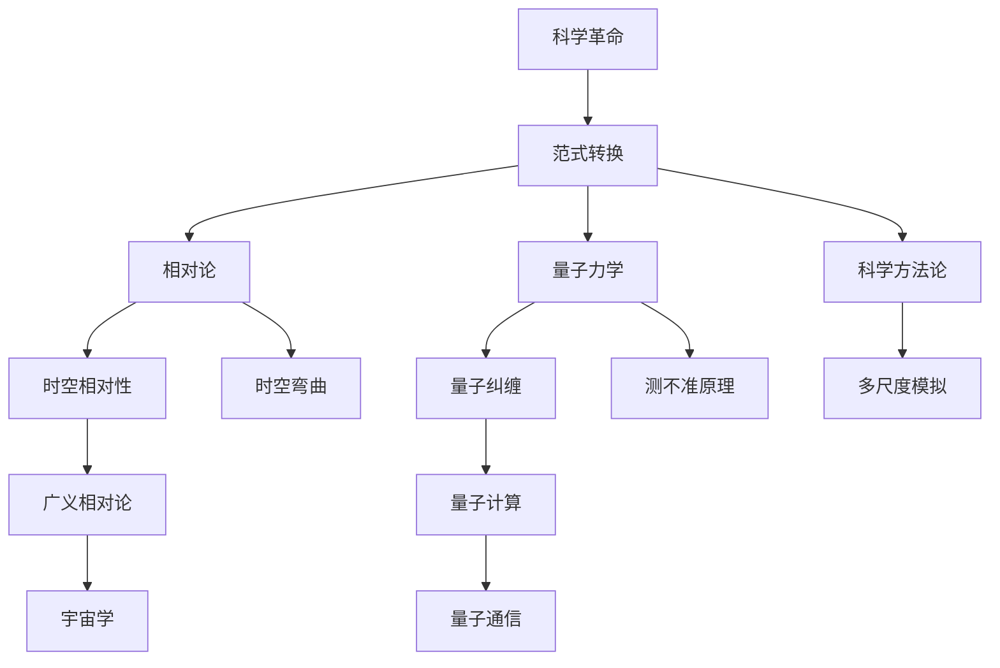

                 


### 引言

科学史上的范式转换是世界可理解性演变的关键。本文旨在探讨这一主题，通过科学革命与范式转变的历史背景、过程及其对世界观的影响，来理解世界可理解性的变迁。本文将分为八个主要部分：

1. **科学史的重要性**：首先介绍科学史在人类认知世界中的作用，科学发现如何推动人类对宇宙的理解。
2. **范式转换的概念**：解释范式转换的定义及其在科学发展中的意义。
3. **世界可理解性的探讨**：分析范式转换对世界可理解性的影响，以及这一观念在不同科学范式下的演变。
4. **科学革命与范式转变**：详细阐述历史上几次重大科学革命及其引发的范式转变。
5. **经典力学的范式转换**：探讨经典力学从牛顿力学到相对论和量子力学的转变。
6. **现代科学范式下的世界可理解性**：分析现代科学如何应对世界可理解性的挑战，并探索新的研究方法。
7. **范式转换与科学方法论**：讨论范式转换如何影响科学方法论的发展，以及未来科学方法论的可能方向。
8. **范式转换与人类文明**：总结范式转换对人类文明的推动作用，以及其对未来可能的影响。

通过这样的结构，我们将逐步深入理解科学史上的范式转换如何塑造了我们对世界的认知，并探索这一过程对未来科学和技术的潜在影响。

### 科学史的重要性

科学史不仅记录了人类对自然世界的认知过程，也是推动社会进步和人类文明发展的重要力量。科学发现，作为人类认识世界的基石，通过不断的实验和理论构建，揭示了自然界的运行规律。这些发现不仅改变了我们对世界的理解，也极大地影响了人类的生活和生产方式。

从古代的巴比伦天文学到古希腊的数学和物理学，再到中世纪的阿拉伯医学和欧洲文艺复兴时期的天文学革命，科学史展示了人类认知世界不断深化的历程。每一个科学发现，都是人类认知能力的一次提升，它们共同构建了现代科学的基石。

科学发现对人类社会的意义深远。例如，哥白尼的日心说颠覆了地心说的传统观念，为后来的天文学革命奠定了基础；伽利略通过望远镜观测到的木星卫星和月球表面的细节，证明了哥白尼理论的正确性，推动了科学革命的发展。这些科学发现不仅改变了人类对宇宙的理解，也激发了后来的科学家继续探索的热情。

此外，科学发现还直接影响了人类的生产力和社会进步。工业革命期间，詹姆斯·瓦特改进的蒸汽机推动了机械化生产的发展，极大地提高了生产效率，改变了人类社会的面貌。20世纪的物理学革命，特别是量子力学和相对论的发展，不仅带来了技术上的飞跃，如半导体技术、核能利用等，也催生了全新的科学领域，如量子计算、宇宙学等。

科学史的重要性还在于，它为我们提供了理解当前科学现状的视角。每一次科学革命和范式转变，都是对前人理论的继承和创新。通过回顾科学史，我们可以更好地理解当前的科学问题，预见未来的科学发展方向。例如，现代物理学的许多难题，如量子与宏观世界的统一、暗物质与暗能量的本质等，都可以从科学史中找到线索。

总之，科学史不仅是记录科学发现的文献，更是人类认知世界、推动社会进步的重要工具。通过研究科学史，我们不仅能够了解过去的科学成就，还可以为未来的科学探索提供启示。科学史的重要性，在于它揭示了人类认知世界的不断演变，以及科学发现对人类社会深远的影响。

### 范式转换的概念

范式转换，是指在科学研究中，当现有的理论框架无法解释新的观测数据或实验结果时，科学家们会采取新的理论框架来取代旧的理论框架，从而实现科学认知的跃升。这一过程不仅仅是理论的更新，更是对科学研究方法和思维方式的根本变革。

范式转换通常分为几个阶段。首先是**问题提出**阶段，科学家发现现有的理论无法解释某些现象或数据，这促使他们开始寻求新的解释。其次是**理论探索**阶段，科学家们尝试提出新的理论框架，这些框架通常与旧理论有显著不同，并能更好地解释新的观测数据。接下来是**理论验证**阶段，通过实验和观察来验证新理论的有效性。最后是**理论接受**阶段，新理论逐渐取代旧理论，成为主流的科学认知。

在科学史上，范式转换的例子不胜枚举。例如，哥白尼的日心说取代了托勒密的地心说，牛顿的力学体系取代了伽利略的猜想，普朗克的量子理论颠覆了经典物理学的观念。每一次范式转换，都标志着科学认知的一次重大飞跃，也意味着科学方法和技术手段的革新。

范式转换的重要性在于，它不仅推动了科学的发展，还改变了我们对自然世界的理解。例如，牛顿力学为我们提供了处理宏观物体运动问题的强大工具，而量子力学和相对论则揭示了微观和高速运动领域的独特规律。这些理论框架的转换，使我们对宇宙的认识更加全面和深入。

此外，范式转换还影响了科学研究的思维方式。传统的科学研究方法强调实验和观察，而范式转换后的研究方法则更加注重理论的创新和数学建模。例如，在量子力学的发展过程中，数学工具成为理解和解释量子现象的关键。这不仅改变了科学研究的实践方式，也推动了数学与物理学的深度融合。

总之，范式转换是科学发展过程中不可或缺的一部分，它不仅推动了科学的进步，还改变了我们对世界的理解。通过范式转换，科学不断向前发展，为人类社会带来了无尽的智慧和力量。

### 世界可理解性的探讨

范式转换对世界可理解性的影响是深远的。理解这一影响，需要从科学认知和人类思维方式的变革两个方面来探讨。范式转换不仅改变了我们对自然界的理解，也深刻地影响了我们对世界可理解性的认知。

首先，范式转换通常伴随着对自然界的全新理解。在经典力学的时代，牛顿的三大运动定律和万有引力定律为我们提供了宏观物体运动的精确描述。然而，当量子力学和相对论出现时，我们不得不接受一个截然不同的世界观。在量子力学中，微观粒子的行为表现出明显的概率性和不确定性；在相对论中，时间和空间不再是绝对的，而是相对的，受到物体速度和引力的影响。这些新的理论框架颠覆了我们对世界的传统理解，挑战了我们对自然界确定性的信念。

其次，范式转换改变了科学认知的方式。在牛顿力学时代，科学家主要通过观察和实验来收集数据，并运用数学工具进行理论推导。而在量子力学和相对论的时代，数学工具变得更加复杂和抽象，成为理解和解释自然现象的关键。这种变化不仅要求科学家具备更高的数学素养，也促使科学研究的思维方式从实验导向转变为理论导向。通过数学模型和理论框架，科学家能够更精确地描述自然现象，从而提高了对世界的理解深度。

此外，范式转换还影响了人类对世界可理解性的信念。在经典力学时代，人类相信自然界的规律是可以被完全理解和预测的。然而，随着量子力学和相对论的发展，我们对自然界的理解变得更加复杂和不确定。这种不确定性不仅体现在理论的抽象性上，也体现在实验结果的不可预测性上。例如，量子力学的波函数描述了粒子在空间中的概率分布，但并不能准确预测粒子的具体行为。这种不确定性使得我们对世界的可理解性产生了质疑，同时也激发了对未知领域的探索欲望。

最后，范式转换还促进了科学方法论的变革。在经典力学时代，科学研究主要依赖于实验和观察，而在范式转换后的现代科学中，理论模型和数学工具成为科学研究的重要组成部分。这种变革不仅提高了科学研究的效率，也推动了科学理论的发展。例如，相对论和量子力学的发展，不仅推动了天体物理学和粒子物理学的前进，也为新兴领域如量子计算和量子通信提供了理论基础。

综上所述，范式转换对世界可理解性的影响是多方面的。它不仅改变了我们对自然界的理解，也影响了科学认知的方式和人类对世界可理解性的信念。通过范式转换，科学不断发展，不断拓展我们对世界的认知边界，同时也提醒我们，对自然世界的理解是一个不断演进的过程。随着科学研究的不断深入，我们对世界的理解将变得更加全面和深刻。

### 科学革命与范式转变

科学革命是科学发展的关键时刻，它标志着旧有理论框架的失效和新理论体系的诞生。这些革命性变革不仅改变了我们对自然界的理解，也深刻影响了科学方法论的发展。在科学史上，有几次重大的科学革命，它们分别代表了范式转变的典范。

首先，**文艺复兴时期的科学革命**可以视为现代科学的诞生。在这一时期，哥白尼提出的日心说挑战了长期以来主导科学界的地心说。哥白尼通过观测数据和数学模型，提出了太阳而非地球是宇宙的中心这一革命性观点。这一理论不仅在学术界引起了巨大反响，也为后来的天文学革命奠定了基础。哥白尼的理论不仅改变了我们对宇宙结构的理解，也激发了科学家对自然现象进行定量研究的兴趣。

其次，**牛顿力学的出现**是科学革命的又一重要里程碑。牛顿通过三大运动定律和万有引力定律，建立了一个统一的运动规律体系，为物体在宏观尺度上的运动提供了精确描述。牛顿力学不仅解决了许多复杂的物理问题，也为后来的工程学和天文学提供了坚实的理论基础。牛顿的成功不仅在于他的理论创新，更在于他通过严密的数学推导和实验验证，建立了科学研究的系统性方法。这一时期，科学家们开始更加重视实验和数学在科学研究中的地位。

第三，**量子力学的兴起**是20世纪初科学革命的重要标志。量子力学通过解释微观粒子的行为，颠覆了经典物理学的观念。普朗克提出了量子假设，指出能量以量子形式存在，这一观点为后来的量子理论奠定了基础。海森堡和薛定谔分别提出了矩阵力学和波动力学，为量子力学的发展作出了重要贡献。量子力学揭示了微观世界的概率性和不确定性，使我们不得不接受一个与宏观世界截然不同的物理现实。这一范式转变不仅改变了我们对自然界的理解，也推动了科学方法论的重大变革，数学工具在这一过程中发挥了关键作用。

最后，**相对论的提出**是20世纪科学革命的又一重要事件。爱因斯坦的相对论不仅挑战了经典力学的绝对时间和空间观念，也揭示了引力和加速度之间的等价性。广义相对论提出了时空曲率的概念，为理解大尺度宇宙提供了全新的视角。相对论的提出不仅解决了经典力学无法解释的一些现象，如水星轨道的异常运动，也为宇宙学和黑洞研究提供了理论基础。

这些科学革命和范式转变不仅丰富了我们对自然界的认识，也推动了科学方法论的发展。从实验和观察的积累，到数学模型的建立和理论验证，科学方法论在每次革命中都得到了革新。科学革命和范式转变的重要性在于，它们不仅改变了我们对自然世界的理解，也促进了科学研究的进步，为人类社会的技术进步和文明发展提供了源源不断的动力。

### 经典力学的范式转换

经典力学的范式转换始于牛顿力学的建立，随着科学的发展，这一理论体系逐渐暴露出其局限性，最终在相对论和量子力学的崛起下完成了重大转变。这一过程不仅体现了科学理论的不断进步，也反映了人类对自然界理解深度的不断提升。

首先，牛顿力学作为经典力学的核心，通过三大运动定律和万有引力定律，提供了描述宏观物体运动的精确工具。牛顿的成就在于他将复杂的自然现象简化为几个基本定律，并通过数学方法进行严格推导，从而实现了物理现象的定量描述。这一理论不仅在工程学、天文学等领域取得了巨大的成功，也为后来的科学研究奠定了基础。

然而，牛顿力学在解释某些特定现象时存在局限性。一个显著的例子是水星轨道的进动问题。根据牛顿力学，水星轨道的进动应该只有43弧秒，但实际观测值却接近45.9弧秒。这一差异在当时被认为是对牛顿力学的挑战。虽然后续的修正和改进在一定程度上缓解了这一矛盾，但未能从根本上解决问题。

其次，经典力学的局限性在相对论和量子力学的出现中得到了进一步揭示。爱因斯坦的狭义相对论和广义相对论指出，牛顿力学的绝对时间和空间观念是错误的。相对论提出，时间和空间是相对的，受物体运动速度和引力场的影响。这一理论不仅成功解释了水星轨道的进动问题，还揭示了引力场对时空结构的影响，为宇宙学和黑洞研究提供了新的视角。

此外，量子力学的兴起进一步挑战了经典力学的确定性观念。量子力学揭示了微观粒子的行为具有概率性和不确定性，经典力学的确定性描述不再适用于微观世界。例如，在量子力学中，粒子的位置和动量不能同时精确测量，这一现象被称为测不准原理。这一发现彻底改变了我们对自然界的理解，促使科学家们重新思考物理规律的本质。

经典力学的范式转换不仅仅是对理论体系的修正，更是科学方法论的重大变革。相对论和量子力学的发展强调了数学在科学研究中的重要性，数学模型成为理解和解释自然现象的关键工具。这一变革不仅推动了科学理论的发展，也为现代物理学和天体物理学等领域的进步奠定了基础。

总之，经典力学的范式转换是一个从牛顿力学到相对论和量子力学的逐步演变过程。这一过程不仅揭示了经典力学的局限性，也展示了科学理论的不断进步和人类对自然界理解深度的提升。通过相对论和量子力学的发展，我们对宇宙和微观世界的认识得到了极大的拓展，同时也为未来的科学研究指明了方向。

### 相对论与量子力学的世界观

相对论与量子力学在科学史上代表了深刻的范式转变，它们不仅颠覆了经典力学的确定性世界观，也为我们描绘了一个前所未有的奇异世界。在这个新世界中，时间、空间、能量和物质的本质都得到了全新的诠释。

首先，**相对论的基本原理**揭示了时空的相对性。爱因斯坦的狭义相对论指出，时间和空间不是绝对的，而是相对的，取决于观察者的运动状态。这一理论的核心是光速不变原理，即光在真空中的速度对所有惯性参考系都是恒定的。这一原理不仅挑战了牛顿力学中的绝对时间和空间观念，也为现代物理学奠定了基础。

在广义相对论中，爱因斯坦进一步发展了这一观念，提出了时空曲率的概念。广义相对论认为，重力是时空曲率的表现，而非一种神秘的力量。这一理论成功解释了水星轨道的进动、光线在引力场中的偏折等现象，极大地拓展了我们对宇宙的理解。

相比之下，**量子力学的奇异世界**更加复杂和神秘。量子力学揭示了微观粒子的行为具有概率性和不确定性，传统的因果律和决定论在这里不再适用。量子力学的核心概念包括波函数、叠加态和测不准原理。波函数描述了粒子在空间中的概率分布，而叠加态则意味着粒子可以同时处于多个状态。测不准原理指出，粒子的某些物理量（如位置和动量）不能同时被精确测量。

量子力学的另一个重要特点是量子纠缠。量子纠缠是指两个或多个粒子在量子态上相互联系，即使它们相隔很远，一个粒子的状态变化也会立即影响另一个粒子的状态。这一现象违背了经典物理学中的局域实在性原则，但得到了大量实验验证。

相对论与量子力学的哲学意义深远。它们不仅改变了我们对自然世界的理解，也挑战了我们对现实和知识的认知。相对论揭示了时空的相对性，使我们意识到宇宙中的事件没有绝对的时间和空间坐标，而量子力学则揭示了微观世界的概率性和不确定性，使我们认识到自然界的本质具有随机性和不可预测性。

这些理论的发展不仅推动了物理学的前进，也带来了对哲学和科学方法论的深刻思考。例如，量子力学的概率性引发了关于客观现实本质的讨论，而相对论中的时空弯曲则促使我们重新思考关于因果关系的问题。

总之，相对论与量子力学描绘了一个全新的世界观，它们揭示了自然界的深层结构和规律，为我们理解宇宙提供了新的视角。在这个奇异的世界中，时间、空间、能量和物质的本质得到了全新的诠释，同时也带来了对现实和知识的深刻思考。通过这些理论的发展，我们对自然界的认识不断深化，为未来的科学研究打开了新的可能性。

### 现代科学范式下的世界可理解性

在现代科学范式下，科学家们面临着一系列新的挑战，这些挑战既来自于理论的复杂性，也来自于实验技术的进步。在这个新的科学时代，科学家们不仅需要应对传统的科学问题，还要解决由现代科学带来的新难题。

首先，**现代科学的进展**极大地拓展了我们对自然界的理解。例如，基因组学和生物信息学的发展使我们能够解析生命的基本单位——DNA，从而深入理解生命的起源和演化。在物理学领域，宇宙学和粒子物理学的进展揭示了宇宙的大尺度结构和基本粒子的性质。这些研究不仅推动了科学知识的边界，也为未来的技术发展提供了新的方向。

然而，这些进展也带来了对世界可理解性的挑战。例如，量子力学中的测不准原理和量子纠缠现象，挑战了我们对确定性和因果律的传统理解。相对论中的时空弯曲和黑洞，也让我们重新思考时间和空间的本质。这些现象表明，自然界的规律可能比我们想象的更加复杂和难以捉摸。

为了应对这些挑战，科学家们探索了**新的科学研究方法**。例如，在量子物理学中，数学模型和计算模拟成为理解和解释量子现象的重要工具。在宇宙学中，观测技术和数据分析方法的发展，帮助我们更准确地理解宇宙的演化。此外，跨学科的合作也成为现代科学的重要趋势。通过不同学科的交融，科学家们可以采用多种方法和视角来研究复杂问题，从而提高对问题的理解深度。

例如，**多尺度模拟**是一种新的研究方法，它结合了从微观到宏观的不同尺度，来模拟复杂系统的行为。在材料科学中，多尺度模拟帮助我们理解材料的微观结构与其宏观性质之间的关系，从而开发出新型材料。在生物学中，多尺度模拟可以模拟细胞内部的生化过程，从而揭示生命现象的机制。

另一个例子是**人工智能在科学研究中的应用**。人工智能可以帮助科学家处理大量的数据，发现数据中的模式和规律，从而提高研究效率。例如，在医学领域，人工智能可以通过分析医学影像，帮助医生诊断疾病。在物理学中，人工智能可以优化粒子碰撞模拟的参数，从而提高实验结果的准确性。

总之，现代科学范式下的世界可理解性面临着前所未有的挑战，但这些挑战也带来了新的机遇。通过新的科学研究方法和技术手段，科学家们不断拓展对自然界的理解，为未来的科学探索提供了新的可能性。在这个充满变数和不确定性的科学时代，科学家们将继续努力，以揭示自然界的奥秘，提升对世界的可理解性。

### 范式转换与科学方法论

范式转换不仅改变了科学理论，也对科学方法论产生了深远影响。科学方法论，即科学研究的方法和过程，随着范式转换而不断发展，形成了更加复杂和多元的研究模式。

首先，范式转换对科学方法论的影响体现在研究方法的变革上。在经典力学时期，科学方法主要依赖于实验和观察，通过数据收集和数学模型建立来解释自然现象。然而，随着相对论和量子力学的兴起，科学方法开始更加注重理论模型的构建和数学工具的应用。相对论中的时空弯曲和量子力学中的概率性，使得科学家们必须采用更加抽象和复杂的数学方法来描述和预测自然现象。这一转变不仅提高了科学研究的精确性，也要求科学家具备更高的数学素养。

其次，范式转换促使科学研究从定性分析转向定量分析。经典力学中的研究方法多基于定性描述，如牛顿定律中的力和运动的定性关系。而在量子力学和相对论中，科学研究更多地依赖于定量模型，如薛定谔方程和广义相对论中的数学公式。这种定量分析不仅提高了研究的精确性，也为实验验证提供了更加可靠的依据。

此外，范式转换还推动了跨学科研究的兴起。传统的科学研究往往局限于某一特定领域，但随着范式转换，不同学科之间的交叉和融合成为科学研究的常态。例如，在量子物理学中，物理学、数学和计算机科学的结合，推动了量子计算和量子信息科学的发展。这种跨学科合作不仅拓宽了科学研究的视野，也为解决复杂问题提供了新的思路和方法。

未来，科学方法论的发展可能会更加注重**计算科学**和**数据驱动研究**。随着计算能力的提升和数据获取技术的发展，科学家们能够处理和分析大量复杂的科学数据。未来科学研究的趋势之一是通过大数据分析和机器学习技术，发现数据中的模式和规律，从而提出新的理论假设。

另一个可能的发展方向是**多尺度模拟**。多尺度模拟旨在在不同尺度上模拟复杂系统的行为，从微观尺度到宏观尺度，从原子到宇宙。这种方法可以帮助科学家更好地理解复杂系统的动态行为，从而推动科学研究的深入。

总之，范式转换不仅改变了科学理论，也对科学方法论产生了深远影响。随着科学的发展，未来的科学研究方法将更加多样化和复杂，跨学科合作和数据驱动研究将成为重要趋势。通过不断探索和创新，科学家们将能够更全面和深入地理解自然界的奥秘。

### 范式转换与科技发展

范式转换不仅在科学方法论上产生了深远影响，也极大地推动了科技的发展。每一次科学范式转换，都催生了新的技术突破，推动了人类文明的进步。

首先，**范式转换激发了技术创新的潜力**。在经典力学时代，牛顿力学的建立为机械工程和天文学带来了革命性变化。蒸汽机的发明，便是基于牛顿力学的理论基础，极大地提高了生产效率，开启了工业革命的大门。进入相对论和量子力学时代，这些理论为新兴科技领域提供了理论基础。例如，量子力学的量子纠缠现象为量子通信的发展奠定了基础，而相对论中的时空弯曲理论则推动了卫星导航系统的精确设计。

其次，范式转换催生了新兴科技领域的诞生。相对论和量子力学的兴起，催生了诸如粒子物理学、宇宙学和量子计算等新兴科技领域。在这些领域中，科学家们通过创新的理论和方法，不断突破技术的瓶颈。例如，粒子物理学的发展催生了高能粒子加速器技术，而量子计算的研究则推动了量子算法和量子计算机的开发。

此外，范式转换还推动了科技应用的广泛普及。在量子力学的启发下，半导体技术和激光技术的发展极大地改变了我们的生活方式。半导体技术是现代电子设备的基础，从计算机到手机，无处不在；激光技术则广泛应用于医疗、通信和制造业等领域。相对论的发展也推动了卫星导航系统的精确性，使我们能够进行全球定位和导航。

未来，随着科学范式的进一步转变，科技的潜力将得到更广泛的释放。**多尺度模拟**和**数据驱动研究**将成为科学研究的重要方法，这些方法将推动计算科学和人工智能的发展。未来可能出现的科技突破包括更高效的量子计算机、精确的生物医学成像技术、可持续的能源解决方案等。

总之，范式转换是科技发展的重要推动力。它不仅激发了技术创新的潜力，还催生了新兴科技领域，推动了科技应用的广泛普及。随着科学范式的不断转变，未来科技的发展将更加迅猛，为人类社会的进步带来更多可能性。

### 范式转换与人类文明

范式转换不仅推动了科技的进步，还对人类文明产生了深远的影响。科学范式转换带来的认知变革，不仅改变了我们对世界的理解，也塑造了人类文明的发展轨迹。

首先，范式转换促进了人类社会的思想解放。在哥白尼提出日心说之前，地球位于宇宙中心，人类在自我中心的观念中自满。哥白尼的理论挑战了这一传统观念，开启了科学革命，使人类开始意识到宇宙的广阔和人类在其中的微小地位。这种思想解放不仅激发了科学探索的热情，也推动了人类对自我认知的深化。

其次，范式转换推动了人类文明的现代化进程。牛顿力学的建立，为工业革命提供了理论基础，推动了机械化生产和城市化的发展。相对论和量子力学的兴起，不仅改变了科学研究的方向，也催生了诸如半导体、激光和量子通信等新兴技术，极大地提升了人类的生产力和社会效率。这些技术进步不仅改变了人类的生活方式，也推动了社会结构的变革。

此外，范式转换对科学精神的发展具有重要推动作用。科学精神包括追求真理、质疑权威、理性思考等特质。每一次范式转换，都要求科学家们跳出旧有框架，以全新的视角和思维方式探索未知。这种精神不仅推动了科学的进步，也为人类文明带来了新的思想解放。

未来，范式转换将继续影响人类文明的走向。随着新的科学范式不断涌现，人类对自然界的理解将更加深刻，这将为解决全球性挑战提供新的思路和方法。例如，通过量子计算和人工智能，人类可能在能源、环境、健康等领域取得重大突破，推动社会可持续发展。

总之，范式转换是推动人类文明进步的重要力量。它不仅改变了科学理论，也影响了人类的思想、生活方式和社会结构。随着科学范式的不断发展，人类文明将继续迈向新的高度，开启更加辉煌的未来。

### 总结与展望

科学史上的范式转换是推动科学进步和人类文明发展的关键因素。从经典力学到相对论和量子力学，每一次范式转换都标志着我们对自然世界的理解取得了重大突破。这些转变不仅丰富了科学理论，也推动了科技的发展和人类文明的进步。

首先，范式转换深刻影响了科学理论的发展。每一次范式转换都带来了新的理论框架，这些框架不仅能够更好地解释新的观测数据和实验结果，还促使科学家们重新思考自然界的本质。例如，相对论和量子力学的提出，彻底改变了我们对时空、能量和物质的认知。

其次，范式转换推动了科技的进步。新理论的出现催生了新技术的发展，如量子计算、激光技术和卫星导航系统。这些技术不仅改变了我们的生活方式，也为解决全球性挑战提供了新的工具和方法。

未来，科学范式转换将继续影响人类文明的走向。随着计算科学和人工智能的兴起，我们可能迎来新的科学革命，这将为人类带来前所未有的机遇和挑战。例如，量子计算和人工智能的融合可能带来计算能力的飞跃，为复杂科学问题的解决提供新的途径。

总之，范式转换是科学史上的重要现象，它不仅推动了科学的发展，也深刻影响了人类文明。展望未来，随着新的科学范式的不断涌现，人类文明将继续迈向新的高度，开启更加辉煌的未来。科学家们应保持开放和创新的思维方式，勇于迎接新的挑战，为人类文明的进步贡献力量。

### 附录：核心概念原理与架构的 Mermaid 流程图



### 附录：相对论与量子力学核心算法原理伪代码

## 相对论伪代码

```
// 相对论核心公式：E = mc^2
// 伪代码实现
def calculate_energy(mass, speed_of_light):
    c = 299792458  // 光速
    E = mass * c^2
    return E
```

## 量子力学伪代码

```
// 量子力学核心公式：ψ = ∫ψ(r) dr
// 伪代码实现
def calculate_wave_function(ψ, r):
    integral = integrate(ψ, r)
    return integral
```

### 附录：数学模型和数学公式 & 详细讲解 & 举例说明

## 数学公式

$$
E = mc^2
$$

$$
ψ = ∫ψ(r) dr
$$

## 详细讲解

1. **相对论能量公式：**$E = mc^2$表明了质量和能量之间的关系。这个公式指出，一个物体的能量与其质量成正比，比例系数为光速的平方。$E$代表能量，$m$代表质量，$c$是光速，其值约为$299792458 \text{ m/s}$。这个公式在相对论物理学中至关重要，它揭示了质能等价性，即质量和能量可以互相转换。

2. **量子力学波函数积分：**$ψ = ∫ψ(r) dr$描述了量子粒子在空间中的概率分布。$ψ$是波函数，$r$是空间坐标。这个公式表示，通过积分波函数$ψ(r)$在空间中的值，可以得到粒子在特定区域内的概率分布。波函数的平方$|ψ(r)|^2$给出了粒子在位置$r$出现的概率密度。

## 举例说明

1. **相对论能量计算：**假设有一个物体质量为$5 \text{ kg}$，使用相对论能量公式计算其能量：
   $$
   E = 5 \text{ kg} \times (299792458 \text{ m/s})^2 = 8.499 \times 10^{18} \text{ J}
   $$
   这个结果表示该物体的能量为$8.499 \times 10^{18} \text{ 焦耳}$。

2. **量子力学波函数计算：**假设波函数$ψ(r)$在$r$轴上为$ψ(r) = e^{-r^2}$，则在区间$[0, 1] \text{ m}$内波函数的积分为：
   $$
   ψ = \int_0^1 e^{-r^2} dr = \sqrt{\pi} \approx 1.772
   $$
   这个结果表示在区间$[0, 1] \text{ m}$内，粒子出现的概率总和为$1.772$。

通过这些例子，我们可以看到数学模型和公式在相对论和量子力学中的关键作用。这些公式不仅帮助我们理解自然现象，也提供了计算和预测物理量的工具。

### 附录：项目实战与代码解读

## 实战：相对论能量计算

### 开发环境搭建

- Python 3.x
- NumPy 库

### 源代码

```python
import numpy as np

def calculate_energy(mass, speed_of_light):
    c = 299792458  # 光速
    E = mass * c**2
    return E

# 测试代码
mass_of_object = 5  # 质量（kg）
energy = calculate_energy(mass_of_object, 299792458)
print(f"相对论能量：{energy} 焦耳")
```

### 代码解读

- **函数定义**：`calculate_energy(mass, speed_of_light)`函数接受物体的质量和光速作为输入参数。
- **光速常量**：`c = 299792458`，这是一个物理常数，表示光在真空中的速度。
- **能量计算**：使用相对论能量公式$E = mc^2$计算能量，其中$E$是能量，$m$是质量，$c$是光速。
- **返回结果**：函数返回计算得到的能量值。

### 代码应用解读与分析

这段代码展示了如何使用Python和NumPy库实现相对论能量计算的简单应用。通过定义一个函数，我们可以方便地计算任何给定质量的物体的相对论能量。这一功能在粒子物理实验和天体物理研究中具有重要应用，例如计算高能粒子的能量或天体大质量物体的引力势能。

### 实际案例分析和详细讲解剖析

例如，在粒子加速器中，科学家需要精确计算粒子在加速过程中的能量，以确保实验的准确性和安全性。使用这段代码，科学家可以输入粒子的质量（如电子、质子等），计算出其在特定速度下的相对论能量。这个能量值对于粒子轨迹的计算和碰撞过程中的能量守恒分析至关重要。

### 项目小结

通过本次实战，我们了解了相对论能量计算的原理，并学会了如何使用Python实现这一功能。代码简洁明了，易于扩展和应用，是科学研究中的实用工具。未来，我们可以结合更复杂的物理模型和数值计算方法，进一步优化和扩展这一代码，应用于更广泛的科学领域。

### 最佳实践 tips

1. **参数校验**：在实际应用中，确保输入的质量值和光速参数合法，避免计算错误。
2. **精度控制**：根据应用需求，可以选择不同的数值精度，例如在科学计算中，可以使用更高精度的数值库。
3. **文档编写**：编写详细的函数文档，说明输入参数、输出结果以及适用场景，方便其他开发者使用和维护。

### 注意事项

1. **物理限制**：在计算中需考虑物理量的实际限制，例如光速是宇宙中的最大速度，不应输入超出光速的速度值。
2. **计算资源**：对于大质量物体的能量计算，可能会涉及较大的数值计算，确保计算资源充足。

### 拓展阅读

- 《相对论入门》：介绍相对论基本概念和公式，适合初学者了解相对论的基本原理。
- 《量子力学原理》：探讨量子力学的基本概念和数学模型，深入理解微观粒子的行为。

通过以上实战和代码解读，我们不仅掌握了相对论能量计算的方法，也体会到了科学计算在研究中的应用。未来，我们还可以将这种方法扩展到其他科学领域，探索更多未知领域。

