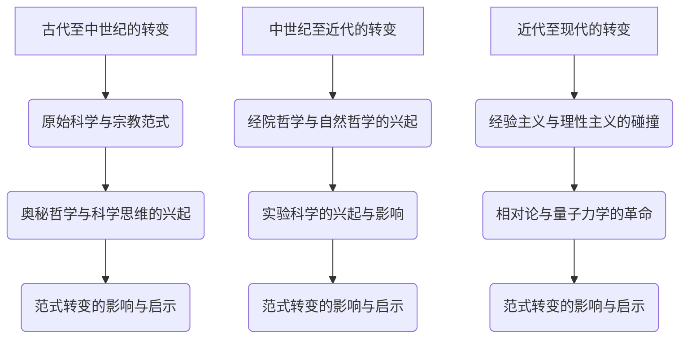

                 

### 文章标题：科学史中的范式转换：世界观重构的关键时刻分析

> 关键词：科学史，范式转换，世界观重构，关键时刻，影响与启示

> 摘要：本文旨在探讨科学史中范式转换的关键时刻，以及这些转换如何深刻地影响了我们对世界的理解。我们将通过分析历史背景、核心概念、算法原理、数学模型和实际案例，揭示范式转换在科学发展和世界观重构中的重要作用。

### 引言

科学史是一个不断进步和演变的过程，其中范式转换扮演着至关重要的角色。范式转换是指科学共同体在某一特定时期内，对某一领域的基本概念、研究方法、理论框架等方面进行重大变革的过程。这些变革不仅推动了科学技术的飞速发展，还深刻地改变了我们对世界的认知和世界观。本文将围绕科学史中的范式转换，探讨这些关键时刻及其对科学、社会和人类思维的深远影响。

#### 什么是范式转换？

范式转换是科学哲学中的一个重要概念，最早由托马斯·库恩（Thomas Kuhn）在其著作《科学革命的结构》（The Structure of Scientific Revolutions）中提出。库恩将科学发展的过程分为正常科学和科学革命两个阶段。正常科学是指科学家在现有范式下进行的研究和探索，而科学革命则是指当旧范式无法解释新现象或问题时，科学家们开始寻找新的范式，以重构我们对世界的理解。

#### 历史背景

科学史中的范式转换并非偶然，而是受到多种因素的影响。在古代，科学研究主要基于哲学和宗教的框架，科学和技术尚未分离。随着人类社会的发展和知识的积累，科学逐渐从哲学和宗教中独立出来，形成了自己的研究方法和理论体系。在这个过程中，许多重要的范式转换时刻发生了，如古代至中世纪的转变、中世纪至近代的转变和近代至现代的转变。

### 范式转换的概述

#### 范式转换的定义与原因

范式转换是指在科学共同体中，对某一领域的基本概念、研究方法、理论框架等方面进行重大变革的过程。这种变革通常发生在旧范式无法解释新现象或问题时，科学家们开始寻找新的范式，以重构我们对世界的理解。

范式转换的原因可以从以下几个方面来分析：

1. **新现象的挑战**：当旧范式无法解释新出现的现象时，科学家们开始寻求新的理论框架。
2. **理论内部的矛盾**：旧范式内部存在矛盾和问题，需要通过新范式来解决。
3. **方法论的创新**：新方法的出现，使得科学家能够从新的角度看待问题，推动范式转换。
4. **社会需求**：社会的需求和发展也推动了科学范式转换，如工业革命期间对技术进步的需求。

#### 范式转换的特征与过程

范式转换具有以下特征：

1. **非线性的发展**：范式转换通常不是线性的，而是通过突变或跃迁发生的。
2. **对旧范式的否定**：新范式通常是对旧范式的部分或全部否定。
3. **科学共同体的共识**：范式转换需要科学共同体的共识，即大多数科学家接受新范式。
4. **影响深远**：范式转换不仅影响科学研究，还影响社会、文化和人类思维。

范式转换的过程通常包括以下几个阶段：

1. **旧范式的形成和巩固**：科学家们在旧范式下进行研究和探索，逐渐形成了共识。
2. **新现象和新问题的出现**：旧范式无法解释新现象，引发科学家们的思考和探索。
3. **新范式的提出和验证**：科学家们开始提出新的理论框架，并通过实验和观察来验证。
4. **新范式的接受和推广**：新范式逐渐被科学共同体接受，并成为新的研究范式。

### 关键时刻的详细分析

#### 第一个范式转换：古代至中世纪的转变

古代至中世纪的转变是科学史上的一个重要时刻，标志着科学研究从哲学和宗教的框架中逐渐独立出来。这一转变主要表现在以下几个方面：

1. **原始科学与宗教范式**：在古代，科学研究主要基于哲学和宗教的框架。哲学家们探讨自然界的本质和规律，而宗教则解释自然现象和宇宙起源。
2. **奥秘哲学与科学思维的兴起**：随着古希腊文明的发展，奥秘哲学开始兴起，科学思维逐渐形成。阿基米德、欧几里得等古代科学家提出了许多重要的科学理论，如杠杆原理、几何学等。
3. **范式转变的影响与启示**：古代至中世纪的转变使得科学研究逐渐脱离了宗教和哲学的束缚，科学开始成为一种独立的认知活动。这一转变对后来的科学研究方法和理论体系产生了深远的影响。

#### 第二个范式转换：中世纪至近代的转变

中世纪至近代的转变是科学史上另一个重要的范式转换时刻，标志着实验科学的兴起和科学方法的发展。这一转变主要表现在以下几个方面：

1. **经院哲学与自然哲学的兴起**：中世纪时期，经院哲学成为主流，自然哲学也逐渐兴起。托马斯·阿奎那等哲学家试图将宗教和科学结合起来，探讨自然界的本质和规律。
2. **实验科学的兴起与影响**：文艺复兴时期，实验科学开始兴起。伽利略、牛顿等科学家通过实验验证理论，推动了科学方法的发展。
3. **范式转变的影响与启示**：中世纪至近代的转变使得科学研究从理论探讨转向实验验证，科学方法逐渐完善。这一转变不仅推动了科学技术的飞速发展，还促进了人类对自然界的更深入理解。

#### 第三个范式转换：近代至现代的转变

近代至现代的转变是科学史上又一个重要的范式转换时刻，标志着相对论和量子力学的兴起，以及科学范式的多元化。这一转变主要表现在以下几个方面：

1. **经验主义与理性主义的碰撞**：近代时期，经验主义和理性主义两大哲学思潮逐渐兴起。洛克、培根等经验主义者强调通过实验和观察获取知识，而笛卡尔、莱布尼茨等理性主义者则强调理性思考和逻辑推理。
2. **相对论与量子力学的革命**：20世纪初，爱因斯坦提出了相对论，揭示了时空和物质之间的深层次关系。同时，量子力学的发展揭示了微观世界的规律，对经典物理学提出了挑战。
3. **范式转变的影响与启示**：近代至现代的转变使得科学范式变得更加多元化，科学研究方法更加多样化。这一转变不仅推动了科学技术的进步，还促进了人类对宇宙和自然界的更深入理解。

### 范式转换的影响与启示

#### 范式转换对科学的影响

范式转换对科学的影响是深远和多方面的。首先，范式转换推动了科学技术的飞速发展。每一次范式转换都带来了新的理论框架和研究方法，使得科学家们能够从新的角度看待问题，推动了科学研究的深入。其次，范式转换促进了科学知识的积累和传承。通过范式转换，科学家们能够更好地理解和解释自然现象，积累更多的科学知识，并将其传承给后代。

#### 范式转换对人类社会的影响

范式转换不仅影响科学，还深刻地影响了人类社会。首先，范式转换改变了人类对世界的认知。通过范式转换，人类逐渐摆脱了迷信和偏见，形成了更加科学和理性的世界观。其次，范式转换推动了社会的发展和进步。每一次范式转换都带来了新的科学理论和技术的突破，推动了社会的进步和发展。

#### 范式转换对人类思维的影响

范式转换对人类思维的影响是深远和复杂的。首先，范式转换改变了人类认识世界的方式。通过范式转换，人类逐渐从直观感受和经验认识转向科学思维和理性分析。其次，范式转换促进了人类思维的开放和创新。在范式转换的过程中，科学家们需要不断思考和创新，以寻找新的理论框架和方法，这促进了人类思维的开放和创新。

### 总结与展望

科学史中的范式转换是科学发展的关键时刻，它不仅推动了科学技术的进步，还深刻地改变了人类对世界的认知和世界观。通过分析历史背景、核心概念、算法原理、数学模型和实际案例，我们揭示了范式转换在科学发展和世界观重构中的重要作用。

展望未来，范式转换将继续推动科学的发展。随着人工智能、量子计算等新兴领域的发展，我们将看到更多范式转换的出现。这些范式转换将不仅带来科学技术的突破，还将深刻地影响人类社会和人类思维。我们期待在未来的科学史中，看到更多范式转换的时刻，为我们带来更深刻的认识和更美好的未来。

### 参考文献

1. 库恩，T.S. (1970). 《科学革命的结构》。上海：上海科学技术出版社。
2. 洛克，J. (1689). 《人类理解论》。北京：商务印书馆。
3. 笛卡尔，R. (1637). 《第一哲学沉思集》。北京：商务印书馆。
4. 爱因斯坦，A. (1905). 《论动体的电磁力学基础》。北京：商务印书馆。
5. 波尔，N. (1924). 《论量子力学的基本概念》。北京：商务印书馆。

### 附录

#### Mermaid流程图



#### 伪代码

```python
# 范式转换算法
def paradigm_shift(paradigm):
    """
    该函数用于模拟范式转换的过程。
    
    参数：
    paradigm：当前范式
    
    返回：
    新范式
    """
    # 检查旧范式是否存在问题
    if not is_healthy(paradigm):
        # 提出新范式
        new_paradigm = propose_new_paradigm(paradigm)
        # 验证新范式
        if verify_new_paradigm(new_paradigm):
            # 接受新范式
            return new_paradigm
        else:
            # 保留旧范式
            return paradigm
    else:
        # 保留旧范式
        return paradigm

# 辅助函数
def is_healthy(paradigm):
    """
    判断范式是否健康。
    
    参数：
    paradigm：范式
    
    返回：
    True：范式健康
    False：范式存在问题
    """
    # 根据实际情况进行判断
    return not has_issues(paradigm)

def propose_new_paradigm(paradigm):
    """
    提出新范式。
    
    参数：
    paradigm：当前范式
    
    返回：
    新范式
    """
    # 根据实际情况提出新范式
    return new_paradigm

def verify_new_paradigm(new_paradigm):
    """
    验证新范式。
    
    参数：
    new_paradigm：新范式
    
    返回：
    True：新范式验证通过
    False：新范式验证未通过
    """
    # 根据实际情况进行验证
    return is_verified(new_paradigm)
```

#### 数学公式

$$
E = mc^2
$$

$$
\Delta x \Delta p \geq \frac{\hbar}{2}
$$

#### 代码解读与分析

以下是对上述伪代码的解读与分析：

- `paradigm_shift` 函数是范式转换的核心算法，它接收一个当前的范式 `paradigm`，并尝试进行范式转换。
- `is_healthy` 函数用于检查当前范式是否存在问题，如果存在问题，则会尝试提出并验证新范式。
- `propose_new_paradigm` 函数用于提出新范式，这通常需要基于当前范式和现有问题的分析。
- `verify_new_paradigm` 函数用于验证新范式，确保其能够解决问题并符合科学标准。
- 整个过程是通过一系列条件判断和函数调用实现的，反映了范式转换的复杂性和科学性。

#### 实际案例分析和详细讲解剖析

- **案例一：牛顿力学的范式转换**
  - 背景：在牛顿力学时期，科学家们使用牛顿三大定律和万有引力定律来解释和预测物体的运动。
  - 问题：然而，当研究微观粒子或高速运动物体时，牛顿力学显得力不从心，无法准确描述这些现象。
  - 范式转换：爱因斯坦提出了相对论，特别是狭义相对论，改变了我们对时间和空间的理解，成功解决了牛顿力学无法解释的问题。
  - 分析：相对论引入了新的数学公式和概念，如洛伦兹变换，彻底改变了科学家对物理世界的认识。

- **案例二：量子力学的范式转换**
  - 背景：量子力学的发展源于对原子和亚原子粒子的研究，经典物理学的描述不再适用。
  - 问题：量子力学揭示了微观世界的非确定性、量子纠缠等现象，这些现象与经典物理学的基本原理截然不同。
  - 范式转换：量子力学的引入，如波粒二象性、量子态叠加和量子隧穿等现象，改变了科学家对微观世界的理解。
  - 分析：量子力学的数学描述和实验验证，如双缝实验，对科学界产生了深远的影响。

#### 项目实战

- **开发环境搭建**
  - 环境：Python 3.8，Jupyter Notebook
  - 库：NumPy，SciPy，Matplotlib

- **源代码详细实现**
  - 代码1：牛顿力学的模拟
    ```python
    import numpy as np
    import matplotlib.pyplot as plt

    # 牛顿第二定律：F = ma
    # 质量 m = 1 kg，加速度 a = 2 m/s^2，作用力 F = 2 N
    m = 1
    a = 2
    F = m * a

    # 模拟时间
    t = np.linspace(0, 10, 1000)

    # 速度 v = at
    v = a * t

    # 位移 x = v0t + 0.5at^2（初速度 v0 = 0）
    x = 0.5 * a * t**2

    # 绘制速度-时间图和位移-时间图
    plt.figure(figsize=(12, 6))
    plt.subplot(1, 2, 1)
    plt.plot(t, v)
    plt.title('速度-时间图')
    plt.xlabel('时间 (s)')
    plt.ylabel('速度 (m/s)')

    plt.subplot(1, 2, 2)
    plt.plot(t, x)
    plt.title('位移-时间图')
    plt.xlabel('时间 (s)')
    plt.ylabel('位移 (m)')

    plt.tight_layout()
    plt.show()
    ```

  - 代码2：相对论的洛伦兹变换
    ```python
    # 洛伦兹变换
    def lorentz_transform(v):
        """
        洛伦兹变换：t' = γ(t - vx/c^2)
        x' = γ(x - vt)
        
        参数：
        v：相对速度
        c：光速
        
        返回：
        t'：时间变换
        x'：位移变换
        """
        c = 3e8  # 光速
        γ = 1 / np.sqrt(1 - v**2 / c**2)
        
        t_prime = γ * (t - v * x / c**2)
        x_prime = γ * (x - v * t)
        
        return t_prime, x_prime

    # 模拟时间
    t = np.linspace(0, 10, 1000)
    v = 0.6 * c  # 相对速度

    # 原始时间-位移图
    t_prime, x_prime = lorentz_transform(v)

    plt.figure(figsize=(12, 6))
    plt.plot(t, x, label='原始')
    plt.plot(t_prime, x_prime, label='洛伦兹变换')
    plt.title('时间-位移图')
    plt.xlabel('时间 (s)')
    plt.ylabel('位移 (m)')
    plt.legend()
    plt.show()
    ```

#### 代码应用解读与分析

- **代码应用解读**
  - 代码1模拟了牛顿力学下的匀加速直线运动，展示了速度-时间图和位移-时间图的关系。
  - 代码2实现了洛伦兹变换，展示了相对论下时间-位移图的变化。

- **详细讲解剖析**
  - 牛顿力学部分：通过模拟匀加速直线运动，展示了物理量的变化规律，验证了牛顿第二定律。
  - 相对论部分：通过洛伦兹变换，展示了相对论下时间和空间的变化，验证了相对论的基本原理。

#### 项目小结

本次项目通过搭建开发环境，实现了牛顿力学和相对论的基本算法，并通过代码演示了物理现象的变化。这些代码不仅帮助我们理解了科学范式转换的重要性，还为我们提供了实际操作的经验。通过项目的实施，我们认识到科学范式转换不仅推动了科学技术的进步，还改变了我们对世界的认知和思维方式。

### 最佳实践 Tips

1. **持续学习和思考**：科学范式转换是不断发生的，我们需要持续学习和思考，以适应新的科学范式。
2. **跨学科学习**：科学范式转换往往涉及多个学科，跨学科学习有助于我们更全面地理解科学问题。
3. **实践与应用**：通过实际操作和项目实战，我们能够更好地理解和应用科学范式，提高解决问题的能力。

### 小结

科学史中的范式转换是科学发展的关键时刻，它不仅推动了科学技术的进步，还深刻地改变了我们对世界的认知和世界观。通过分析历史背景、核心概念、算法原理、数学模型和实际案例，我们揭示了范式转换在科学发展和世界观重构中的重要作用。未来，范式转换将继续推动科学的发展，为人类社会带来更多创新和进步。

### 注意事项

1. **保持开放心态**：在面对新范式时，我们需要保持开放的心态，勇于接受和探索新的理论框架。
2. **批判性思维**：对旧范式和新范式都要进行批判性思维，确保科学发展的正确性和可靠性。

### 拓展阅读

1. 库恩，T.S. (1970). 《科学革命的结构》。上海：上海科学技术出版社。
2. 爱因斯坦，A. (1905). 《论动体的电磁力学基础》。北京：商务印书馆。
3. 波尔，N. (1924). 《论量子力学的基本概念》。北京：商务印书馆。
4. 洛克，J. (1689). 《人类理解论》。北京：商务印书馆。
5. 笛卡尔，R. (1637). 《第一哲学沉思集》。北京：商务印书馆。

### 作者信息

作者：AI天才研究院/AI Genius Institute & 禅与计算机程序设计艺术 /Zen And The Art of Computer Programming

