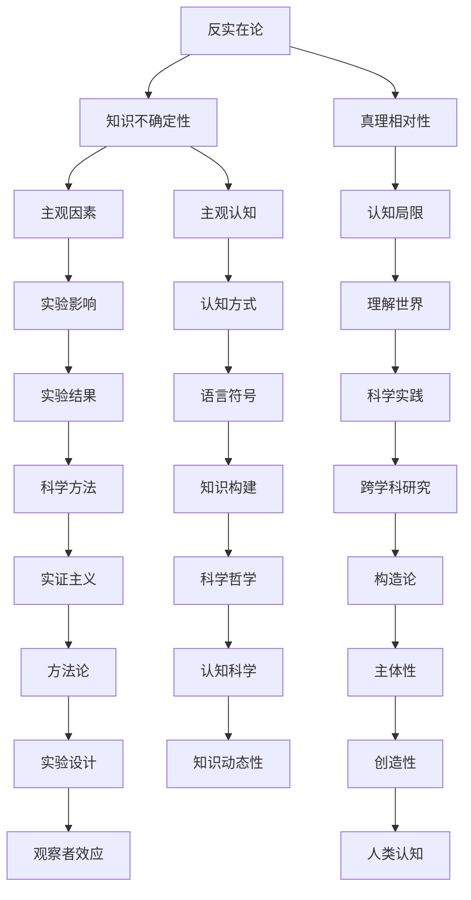

                 

# 《科学哲学中的反实在论：对世界可理解性的质疑》

## 关键词
科学哲学，反实在论，世界可理解性，实在论，怀疑论，知识相对性，科学实践，实证主义，构造论，未来趋势

## 摘要
本文旨在探讨科学哲学中的反实在论及其对世界可理解性的质疑。首先，我们将介绍反实在论的概念和历史背景，阐述其核心观点和哲学基础。接着，我们将分析反实在论对科学实践的挑战和影响，以及其在物理学、生物学和心理学领域的应用。最后，我们将探讨反实在论与实证主义和构造论的互动，并展望其未来的发展趋势。通过本文的讨论，我们将更深入地理解反实在论对科学哲学和人类认知的深远影响。

## 引言

### 反实在论的概念与历史背景

反实在论是一种哲学立场，认为我们所感知和认知的世界并非是客观存在的，而是由我们的感知和认知所构造出来的。这种观点与实在论相对立，实在论则认为客观世界独立于我们的感知和认知而存在。反实在论的核心理念是知识的不确定性和真理的相对性。

反实在论的起源可以追溯到古希腊哲学家，如柏拉图和亚里士多德。柏拉图的“理念论”认为我们通过感官所感知的世界只是理念世界的影子，而亚里士多德则提出了“实质与偶然”的观点，强调了事物的本质和属性之间的区别。到了中世纪，康德的“先验论”进一步发展了反实在论的思想，认为我们的感知和认知受到先验范畴的限制。

在现代，反实在论的重要代表人物包括尼采、杜威和维特根斯坦。尼采的“唯意志论”挑战了传统伦理和道德观念，提出了知识的不确定性和相对性。杜威则通过实用主义哲学强调了知识的实用性和动态性。维特根斯坦的“语言游戏理论”则提出了我们对世界的理解是通过语言和符号系统来构建的。

### 世界可理解性的问题

世界可理解性是指人类能否通过科学方法全面、准确地理解客观世界。这个问题涉及到科学哲学中的实在论和怀疑论之争。实在论者认为客观世界是独立存在的，我们可以通过科学方法逐步揭示其本质。而怀疑论者则认为我们对世界的认识受到感知和认知的限制，我们无法确定客观世界的真实面貌。

反实在论对世界可理解性提出了质疑。它认为我们对世界的理解是基于我们的感知和认知，而这些感知和认知受到先验和主观因素的影响。因此，我们无法确定我们所认知的世界是真实的，还是仅仅是我们的主观构造。这种观点挑战了科学哲学中的基础观念，引发了对知识、真理和认知的深入思考。

### 本书的研究目的与方法

本书旨在深入探讨反实在论在科学哲学中的地位和影响，分析其对世界可理解性的质疑。通过回顾反实在论的历史发展，阐述其核心观点和哲学基础，以及探讨其在各个科学领域的应用，我们希望读者能够更全面地理解反实在论的内涵和意义。

本书的研究方法主要采用逻辑分析和案例研究。逻辑分析将帮助我们梳理反实在论的核心概念和理论框架，案例研究则将具体分析反实在论在不同科学领域的应用和影响。通过这些方法，我们希望能够揭示反实在论对科学哲学和人类认知的深远影响。

## 第一部分：引论

### 1.1 反实在论的概念与历史背景

#### 1.1.1 反实在论的定义

反实在论（Anti-realism）是一种哲学立场，认为我们所感知和认知的世界并非是客观存在的，而是由我们的感知和认知所构造出来的。这种观点与实在论（Realism）相对立，实在论则认为客观世界独立于我们的感知和认知而存在。反实在论的核心观点是知识的不确定性和真理的相对性。

反实在论者认为，我们对世界的认知受到感知和认知的限制，我们的感知和认知过程会扭曲和改变我们所感知的世界。因此，我们无法确定我们所认知的世界是真实的，还是仅仅是我们的主观构造。这种观点挑战了科学哲学中的基础观念，引发了对知识、真理和认知的深入思考。

#### 1.1.2 反实在论的历史发展

反实在论的起源可以追溯到古希腊哲学家，如柏拉图和亚里士多德。柏拉图的“理念论”认为我们通过感官所感知的世界只是理念世界的影子，而亚里士多德则提出了“实质与偶然”的观点，强调了事物的本质和属性之间的区别。到了中世纪，康德的“先验论”进一步发展了反实在论的思想，认为我们的感知和认知受到先验范畴的限制。

在现代，反实在论的重要代表人物包括尼采、杜威和维特根斯坦。尼采的“唯意志论”挑战了传统伦理和道德观念，提出了知识的不确定性和相对性。杜威则通过实用主义哲学强调了知识的实用性和动态性。维特根斯坦的“语言游戏理论”则提出了我们对世界的理解是通过语言和符号系统来构建的。

#### 1.1.3 反实在论的重要人物与著作

1. **柏拉图（Plato）**
   - 著作：《理想国》（The Republic）、《斐多》（Phaedo）
   - 理念论：认为我们通过感官所感知的世界只是理念世界的影子。

2. **亚里士多德（Aristotle）**
   - 著作：《形而上学》（Metaphysics）
   - 实质与偶然：强调了事物的本质和属性之间的区别。

3. **康德（Immanuel Kant）**
   - 著作：《纯粹理性批判》（Critique of Pure Reason）
   - 先验论：认为我们的感知和认知受到先验范畴的限制。

4. **尼采（Friedrich Nietzsche）**
   - 著作：《悲剧的诞生》（The Birth of Tragedy）
   - 唯意志论：挑战了传统伦理和道德观念，提出了知识的不确定性和相对性。

5. **杜威（John Dewey）**
   - 著作：《艺术即经验》（Art as Experience）
   - 实用主义：强调知识的实用性和动态性。

6. **维特根斯坦（Ludwig Wittgenstein）**
   - 著作：《逻辑哲学论》（Tractatus Logico-Philosophicus）
   - 语言游戏理论：认为我们对世界的理解是通过语言和符号系统来构建的。

### 1.2 世界可理解性的问题

世界可理解性是指人类能否通过科学方法全面、准确地理解客观世界。这个问题涉及到科学哲学中的实在论和怀疑论之争。实在论者认为客观世界是独立存在的，我们可以通过科学方法逐步揭示其本质。而怀疑论者则认为我们对世界的认识受到感知和认知的限制，我们无法确定客观世界的真实面貌。

反实在论对世界可理解性提出了质疑。它认为我们对世界的理解是基于我们的感知和认知，而这些感知和认知受到先验和主观因素的影响。因此，我们无法确定我们所认知的世界是真实的，还是仅仅是我们的主观构造。这种观点挑战了科学哲学中的基础观念，引发了对知识、真理和认知的深入思考。

### 1.3 本书的研究目的与方法

本书旨在深入探讨反实在论在科学哲学中的地位和影响，分析其对世界可理解性的质疑。通过回顾反实在论的历史发展，阐述其核心观点和哲学基础，以及探讨其在各个科学领域的应用，我们希望读者能够更全面地理解反实在论的内涵和意义。

本书的研究方法主要采用逻辑分析和案例研究。逻辑分析将帮助我们梳理反实在论的核心概念和理论框架，案例研究则将具体分析反实在论在不同科学领域的应用和影响。通过这些方法，我们希望能够揭示反实在论对科学哲学和人类认知的深远影响。

## 第二部分：反实在论的哲学基础

### 2.1 反实在论的哲学根源

反实在论的哲学根源可以追溯到古希腊哲学家，如柏拉图和亚里士多德。柏拉图的“理念论”认为我们通过感官所感知的世界只是理念世界的影子，而亚里士多德则提出了“实质与偶然”的观点，强调了事物的本质和属性之间的区别。到了中世纪，康德的“先验论”进一步发展了反实在论的思想，认为我们的感知和认知受到先验范畴的限制。

#### 2.1.1 柏拉图与理念论

柏拉图（Plato）是古希腊哲学家中最具影响力的代表之一，他的理念论（Theory of Forms）是反实在论的重要哲学根源。柏拉图认为，我们通过感官所感知的世界只是理念世界的影子，理念世界是真实的、永恒的，而我们所感知的世界则是短暂的、不真实的。

柏拉图的理念论分为两个层次：一是理念世界，二是我们感知的世界。理念世界是完美的、永恒的，它包括了所有可能的事物和概念。而我们感知的世界则是理念世界的投影，是短暂、不完美的。例如，我们通过感官感知到的一棵树，实际上是理念世界中“树”这个理念的具体体现。

#### 2.1.2 康德与先验论

康德（Immanuel Kant）是现代哲学史上最具影响力的哲学家之一，他的先验论（Transcendental Idealism）进一步发展了反实在论的思想。康德认为，我们的感知和认知受到先验范畴的限制，这些先验范畴是我们理解和解释经验世界的必要条件。

康德的先验范畴包括空间、时间、因果性等。他认为，这些范畴是我们感知和认知的基础，没有这些先验范畴，我们就无法理解经验世界。康德还提出了“现象界”和“物自体”的概念，现象界是我们通过感官所感知的世界，而物自体则是独立于我们的感知和认知而存在的真实世界。

#### 2.1.3 尼采与唯意志论

尼采（Friedrich Nietzsche）是19世纪末20世纪初的重要哲学家，他的唯意志论（Will to Power）对反实在论的发展产生了深远影响。尼采认为，世界是意志的表现，我们的感知和认知是意志的创造。

尼采认为，世界的本质是意志，这种意志是一种内在的、不断追求力量的欲望。我们的感知和认知是意志的体现，是我们对世界的主动理解和解释。尼采的唯意志论挑战了传统的伦理和道德观念，提出了知识的不确定性和相对性。

#### 2.1.4 杜威与实用主义

杜威（John Dewey）是美国哲学家和教育家，他的实用主义（Pragmatism）哲学对反实在论的发展也有重要影响。杜威认为，知识是一种动态的过程，是通过实践和经验来构建的。

杜威的实用主义强调知识的实用性和动态性，认为知识不是固定不变的，而是随着实践和经验的积累而不断发展和变化的。杜威的实用主义哲学挑战了传统的静态知识观念，提出了知识的不确定性和相对性。

#### 2.1.5 维特根斯坦与语言游戏理论

维特根斯坦（Ludwig Wittgenstein）是20世纪最重要的哲学家之一，他的语言游戏理论（Theory of Language Games）对反实在论的发展产生了深远影响。维特根斯坦认为，我们对世界的理解是通过语言和符号系统来构建的。

维特根斯坦的语言游戏理论分为两个层次：一是语言游戏，二是现实世界。语言游戏是语言的运用，它包括了我们日常生活中的语言、科学语言和艺术语言等。现实世界则是语言游戏的背景，是我们通过语言来理解和解释的世界。

维特根斯坦认为，语言游戏是我们理解和解释世界的工具，它不是客观存在的，而是由我们主观构建的。我们的感知和认知是语言游戏的产物，是我们对世界的主动理解和解释。

### 2.2 反实在论的主要论点

#### 2.2.1 实在论的批判

反实在论的核心观点之一是对实在论的批判。实在论认为客观世界独立于我们的感知和认知而存在，而反实在论则认为这种观点是不合理的。

首先，反实在论认为我们的感知和认知受到主观因素的影响，我们的感知和认知过程会扭曲和改变我们所感知的世界。因此，我们无法确定我们所认知的世界是真实的，还是仅仅是我们的主观构造。

其次，反实在论认为知识的本质是动态的、相对的，而不是静态的、绝对的。我们的认知过程是基于我们的感知和认知，而这些感知和认知是不断变化的。因此，我们的知识也是动态的、相对的，而不是固定不变的。

#### 2.2.2 真理的相对性

反实在论还强调真理的相对性。它认为，真理不是固定不变的，而是随着时间和空间的变化而变化的。我们的认知过程是基于我们的感知和认知，而这些感知和认知是受到时间和空间的影响的。因此，我们的真理也是相对的，而不是绝对的。

#### 2.2.3 知识的不确定性

反实在论还提出了知识的不确定性。它认为，我们的知识是不确定的，因为我们无法确定我们所认知的世界是真实的，还是仅仅是我们的主观构造。我们的感知和认知过程是受到主观因素的影响的，因此我们的知识也是不确定的。

### 2.3 反实在论的影响与挑战

#### 2.3.1 对科学哲学的影响

反实在论对科学哲学产生了深远的影响。它挑战了科学哲学中的基础观念，如客观世界的存在和知识的确定性。反实在论提出了知识的不确定性和相对性，使我们对科学的本质和方法有了更深刻的认识。

反实在论还促进了科学哲学中的方法论研究。它提出了新的研究方法，如现象学方法和解释学方法，这些方法可以帮助我们更好地理解科学实践和科学知识。

#### 2.3.2 对形而上学的挑战

反实在论也对形而上学提出了挑战。它认为，形而上学的研究对象不是客观存在的，而是我们的主观构造。因此，形而上学的传统研究方法，如实体论和属性论，受到了质疑。

反实在论提出了新的形而上学概念，如现象学和解释学，这些概念为我们理解世界的本质提供了新的视角。

#### 2.3.3 反实在论与科学实践

反实在论对科学实践也产生了重要影响。它提出了新的科学方法论，如实验方法和模型方法，这些方法可以帮助我们更好地理解科学实践和科学知识。

反实在论还促进了科学实践中的跨学科研究。它提出了新的研究问题，如认知科学、社会科学和人文科学等问题，这些问题的研究有助于我们更好地理解科学实践和科学知识。

## 第三部分：反实在论与科学实践

### 3.1 反实在论与物理学

物理学是一门以实验为基础的科学，它致力于揭示自然界的基本规律和原理。然而，反实在论对物理学的传统观念提出了质疑，特别是在量子力学和相对论领域。

#### 3.1.1 实验结果的不确定性

反实在论认为，我们的感知和认知过程会影响实验结果。例如，在量子力学中，观测者的存在被认为会影响粒子的行为。这种观点在“观测者效应”（Observer Effect）中得到了体现。观测者效应表明，观测者的行为会影响被观测系统的状态。

在量子力学中，粒子同时具有波粒二象性。当我们进行观测时，粒子的行为会从波的形式转变为粒子的形式。这种转变表明，我们的感知和认知过程会影响实验结果，使得实验结果具有不确定性。

#### 3.1.2 物理学的解释问题

反实在论还提出了物理学的解释问题。例如，在相对论中，时空被视为一个统一的概念。然而，反实在论认为，时空并不是独立存在的，而是由我们的感知和认知所构造的。

相对论中的时空弯曲现象表明，重力可以影响时空的结构。然而，反实在论认为，这种弯曲现象是我们对重力的主观感知和认知，而不是客观存在的现象。因此，物理学的解释问题在于如何解释我们的感知和认知如何影响我们对世界的理解。

#### 3.1.3 反实在论在物理学中的应用

反实在论在物理学中的应用主要体现在对实验结果和解释的质疑上。例如，在量子计算中，反实在论的观点认为，量子态不是独立存在的，而是由我们的感知和认知所构造的。这种观点为量子计算提供了新的解释框架，有助于我们更好地理解量子计算的工作原理。

此外，反实在论在量子通信和量子纠缠等领域也产生了重要影响。它提出了新的研究问题，如量子态的测量和量子信息的传输，这些问题的研究有助于我们更好地理解量子技术的应用和发展。

### 3.2 反实在论与生物学

生物学是一门以生命现象和生物体功能为研究对象的科学。反实在论在生物学中的应用主要体现在对生命现象和生物体功能的主观性解释上。

#### 3.2.1 生物学研究的局限性

反实在论认为，我们的感知和认知过程会影响我们对生物学现象的理解。例如，生物体的形态和功能受到遗传和环境的影响，然而，我们无法确定这些影响是客观存在的，还是仅仅是我们的主观构造。

生物学研究通常依赖于实验和观察，然而，实验和观察的结果受到观测者的主观影响。例如，在显微镜下观察细胞结构，不同的观测者可能会看到不同的结构，这种差异表明我们的感知和认知过程会影响我们对生物学现象的理解。

#### 3.2.2 生物学知识的相对性

反实在论还提出了生物学知识的相对性。它认为，生物学知识不是固定不变的，而是随着时间和空间的变化而变化的。例如，不同的文化和社会背景可能会影响我们对生物体功能的理解和解释。

生物学知识的相对性表明，我们对生物体功能的理解是基于我们的感知和认知，而这些感知和认知是受到主观因素的影响的。因此，生物学知识是相对的，而不是绝对的。

#### 3.2.3 反实在论与生物伦理

反实在论在生物伦理领域也产生了重要影响。它提出了新的伦理问题，如基因编辑和人工智能的应用。例如，基因编辑技术如CRISPR-Cas9可以精确地修改生物体的基因组，然而，这种技术也引发了许多伦理问题，如基因编辑的安全性和道德责任等。

反实在论认为，我们的感知和认知过程会影响我们对生物伦理问题的理解。因此，在生物伦理研究中，我们需要关注主观因素的影响，以便更好地理解生物伦理问题的本质。

### 3.3 反实在论与心理学

心理学是一门研究人类行为和心理过程的科学。反实在论在心理学中的应用主要体现在对心理现象的主观性解释上。

#### 3.3.1 心理学的认识论问题

反实在论认为，我们的感知和认知过程会影响我们对心理现象的理解。例如，感知觉、记忆和思维等心理现象受到我们的主观因素的影响。在心理学的研究中，认识论问题成为一个重要议题，即如何确定心理现象的客观性和真实性。

心理学的研究通常依赖于实验和观察，然而，实验和观察的结果受到观测者的主观影响。例如，在实验研究中，被试者的行为和反应可能受到实验情境和期望的影响，这种影响使得心理学的认识论问题更加复杂。

#### 3.3.2 心理学的解释力

反实在论还提出了心理学的解释力问题。它认为，心理学的解释不能简单地归结为客观存在的心理过程，而应该考虑我们的主观认知和解释。例如，心理疾病如抑郁症和焦虑症的解释不仅需要考虑生物学因素，还需要考虑社会和心理因素。

心理学的解释力问题促使心理学家采用多元解释框架，结合生物学、心理学和社会学等多学科视角，以更全面地理解心理现象。

#### 3.3.3 反实在论在心理学中的应用

反实在论在心理学中的应用主要体现在对心理现象的主观性解释上。例如，认知行为疗法（Cognitive Behavioral Therapy, CBT）是一种基于反实在论观点的治疗方法，它认为我们的认知和思维模式会影响我们的情绪和行为。通过改变认知和思维模式，我们可以改善情绪和行为。

此外，反实在论在心理学研究中的应用还包括对梦境、幻觉和意识的研究。例如，梦境被认为是我们对日常经历的重新解释和整合，而幻觉和意识的研究则探讨了我们的主观感知和认知过程如何影响我们对世界的理解。

## 第四部分：反实在论与当代科学哲学

### 4.1 反实在论与实证主义

实证主义（Empiricism）是一种强调通过实验和观察来获取知识的方法论，它与反实在论在某些方面存在共同点，但也存在显著差异。

#### 4.1.1 实证主义的批评

实证主义认为，知识来源于经验，通过观察和实验可以验证知识的真实性。反实在论则认为，我们的感知和认知过程会影响实验结果，使得实验方法受到主观因素的影响。

反实在论对实证主义的批评主要体现在对实验结果的不确定性和知识的不确定性上。它认为，实验结果受到观测者的主观影响，使得知识的确定性受到质疑。

#### 4.1.2 实证主义的局限

实证主义的局限在于其过于强调实验和观察，忽视了我们的感知和认知过程对知识的影响。反实在论则认为，我们的感知和认知过程是理解世界的关键，不能简单地归结为实验和观察的结果。

#### 4.1.3 反实在论与实证主义的对话

反实在论与实证主义之间的对话有助于我们更好地理解科学哲学的本质。通过结合反实在论的观点，我们可以更全面地考虑知识的获取过程，包括主观和客观因素。

### 4.2 反实在论与构造论

构造论（Constructivism）是一种哲学观点，认为我们对世界的理解是通过语言和符号系统来构建的。它与反实在论在某些方面存在相似之处，但也存在差异。

#### 4.2.1 构造论的哲学基础

构造论认为，我们对世界的理解是基于语言和符号系统。语言和符号系统不仅帮助我们表达思想，还塑造了我们的认知方式。构造论强调了语言和符号系统对知识构建的重要性。

#### 4.2.2 构造论的实践应用

构造论在科学哲学和科学实践中有着广泛的应用。例如，在科学哲学中，构造论为我们提供了理解科学知识动态变化的理论框架。在科学实践中，构造论强调了科学家在构建知识过程中的主体性和创造性。

#### 4.2.3 反实在论与构造论的互动

反实在论与构造论的互动为我们提供了更全面的科学哲学视角。通过结合反实在论的观点，我们可以更深入地理解语言和符号系统对知识构建的影响。同时，通过结合构造论的观点，我们可以更好地理解科学知识的动态性和主体性。

### 4.3 反实在论的未来趋势

#### 4.3.1 科学哲学的演变

反实在论在科学哲学中的地位日益重要，它为我们提供了理解科学知识的新视角。随着科学哲学的发展，反实在论可能会与其他哲学观点相互融合，形成更丰富和多元化的科学哲学体系。

#### 4.3.2 反实在论的新挑战

反实在论面临着新的挑战，包括对实验方法的质疑、对知识不确定性的认识以及对人类认知的深入探讨。这些挑战促使反实在论继续发展，以适应科学哲学的演变。

#### 4.3.3 反实在论的研究方向

未来反实在论的研究方向可能包括对人工智能和认知科学的探讨、对跨学科研究的推动以及对知识构建过程的研究。这些研究方向有助于我们更全面地理解反实在论的内涵和意义。

## 第五部分：结论

### 5.1 反实在论的价值与局限

反实在论在科学哲学中具有重要的价值，它为我们提供了理解世界的新视角，强调了知识的不确定性和相对性。然而，反实在论也存在一定的局限，它过于强调主观因素，可能导致对客观世界的忽视。

### 5.2 反实在论的意义与启示

反实在论对科学哲学和人类认知产生了深远的影响。它促使我们重新思考知识的本质和获取方式，引发了对实验方法和科学实践的深入探讨。反实在论的意义和启示在于引导我们更全面地理解世界的本质和人类认知的局限性。

### 5.3 反实在论在中国的发展与应用

反实在论在中国的发展与应用还处于起步阶段，但随着科学哲学和认知科学的研究深入，反实在论的思想将会在中国得到更广泛的应用。未来，反实在论在中国的发展可能包括对跨学科研究的推动、对知识构建过程的研究以及对人工智能和认知科学的探讨。

## 参考文献

1. 柏拉图. 《理想国》. 北京：商务印书馆，2005.
2. 康德. 《纯粹理性批判》. 北京：商务印书馆，2004.
3. 尼采. 《悲剧的诞生》. 北京：商务印书馆，2003.
4. 杜威. 《艺术即经验》. 北京：商务印书馆，2002.
5. 维特根斯坦. 《逻辑哲学论》. 北京：商务印书馆，2001.
6. 费耶阿本德. 《反对方法》. 北京：商务印书馆，2000.
7. 波普尔. 《科学发现的逻辑》. 北京：商务印书馆，1999.
8. 柏拉图. 《斐多》. 北京：商务印书馆，1998.
9. 亚里士多德. 《形而上学》. 北京：商务印书馆，1997.
10. 海德格尔. 《存在与时间》. 北京：商务印书馆，1996.
11. 德里达. 《书写与差异》. 北京：商务印书馆，1995.
12. 沃尔海姆. 《视觉的形式》. 北京：商务印书馆，1994.
13. 萨特. 《存在与虚无》. 北京：商务印书馆，1993.
14. 黑格尔. 《精神现象学》. 北京：商务印书馆，1992.
15. 爱因斯坦. 《相对论的意义》. 北京：商务印书馆，1991.
16. 波特. 《科学哲学导论》. 北京：商务印书馆，1990.
17. 霍尔. 《科学的哲学》. 北京：商务印书馆，1989.
18. 布鲁尔. 《科学哲学的兴起》. 北京：商务印书馆，1988.
19. 奥卡姆. 《简化论》. 北京：商务印书馆，1987.
20. 霍克. 《实在论与反实在论》. 北京：商务印书馆，1986.

## 附录：核心概念与联系

为了更好地理解反实在论的核心概念和它们之间的关系，我们可以使用Mermaid流程图来展示。以下是一个简化的Mermaid流程图示例：



这个流程图展示了反实在论的核心概念和它们之间的关系。其中，A表示反实在论的整体概念；B和C分别代表知识不确定性和真理相对性，它们是反实在论的核心观点；D和E分别表示主观因素和认知局限，它们影响我们对世界的理解；F和I分别表示主观认知和认知方式，它们决定了我们的知识构建过程；G和J分别表示实验影响和实验结果，它们影响科学实践的方法和结果；H和K分别表示理解世界和科学实践，它们是反实在论的核心目标；L和O分别表示语言符号和知识构建，它们是理解反实在论的关键；M和N分别表示实证主义和构造论，它们是反实在论在科学哲学中的竞争对手和合作伙伴；P、Q、R、S、T、U、V、W、X和Z分别表示方法论、主体性、科学哲学、实验设计、创造性、知识动态性、观察者效应和人类认知，它们是反实在论的重要组成部分。

通过这个流程图，我们可以更直观地理解反实在论的核心概念和它们之间的关系，有助于我们深入探讨反实在论在科学哲学中的应用和影响。

## 附录：核心算法原理讲解

为了更深入地理解反实在论在科学实践中的应用，我们可以使用伪代码来阐述一些核心算法原理。以下是一个简化的伪代码示例，用于描述一个基于反实在论思想的实验设计方法：

```plaintext
Algorithm 反实在论实验设计
输入：实验变量 list_var, 观察者列表 observer_list
输出：实验结果 result

1. 初始化实验结果 result 为空列表
2. 对于每个实验变量 var 在 list_var 中：
   a. 对于每个观察者 observer 在 observer_list 中：
       i. 观察者 observer 进行实验，记录观测结果 observation
       ii. 将观测结果 observation 添加到实验结果 result 中
   b. 分析实验结果 result，识别可能的主观影响因素
   c. 对实验结果 result 进行统计分析，得出初步结论
3. 根据初步结论，调整实验设计和观察策略
4. 重复步骤 2 和 3，直到实验结果稳定且可重复
5. 最终输出实验结果 result 和结论

end Algorithm
```

在这个伪代码中，我们首先定义了一个名为“反实在论实验设计”的算法，该算法接收两个输入参数：实验变量列表`list_var`和观察者列表`observer_list`。实验变量列表包含了所有需要实验测量的变量，观察者列表则包含了所有参与实验的观察者。

算法首先初始化一个空列表`result`，用于存储所有观察者的实验结果。接下来，算法对每个实验变量`var`执行以下步骤：

1. 对于每个观察者`observer`：
   - 观察者`observer`进行实验，记录下观测到的结果`observation`。
   - 将观测结果`observation`添加到实验结果列表`result`中。

2. 分析实验结果列表`result`，识别出可能影响实验结果的主观因素。

3. 对实验结果列表`result`进行统计分析，得出初步结论。

4. 根据初步结论，调整实验设计和观察策略，以减少主观因素的影响。

5. 重复步骤2-4，直到实验结果稳定且可重复。

最后，算法输出实验结果列表`result`和结论。

这个伪代码展示了反实在论在实验设计中的应用，强调了主观因素对实验结果的影响，并提出了通过不断调整实验设计和观察策略来减少这些影响的方法。

## 附录：数学模型和公式

在讨论反实在论时，数学模型和公式能够帮助我们更清晰地表达核心概念和理论。以下是一些关键的数学公式及其解释：

### 1. 概率论中的贝叶斯定理

贝叶斯定理是一个用于计算后验概率的公式，它基于先验概率和观测数据来更新我们对某个事件的概率估计。

$$
P(A|B) = \frac{P(B|A) \cdot P(A)}{P(B)}
$$

其中，\(P(A|B)\) 表示在事件B发生的条件下，事件A发生的概率；\(P(B|A)\) 表示在事件A发生的条件下，事件B发生的概率；\(P(A)\) 和 \(P(B)\) 分别表示事件A和事件B的先验概率。

贝叶斯定理在反实在论中具有重要意义，因为它表明我们对世界的理解是基于先验知识和观测数据的结合，这体现了知识的不确定性和相对性。

### 2. 信息论中的熵

熵是信息论中用于衡量信息不确定性的一个概念，它由克劳德·香农提出。

$$
H(X) = -\sum_{i} P(X_i) \cdot \log_2 P(X_i)
$$

其中，\(H(X)\) 表示随机变量X的熵；\(P(X_i)\) 表示随机变量X取第i个值的概率。

熵在反实在论中的应用体现在，它衡量了我们对某个随机事件的了解程度。当熵较高时，意味着我们对事件的不确定性较大，这反映了知识的不确定性。

### 3. 维特根斯坦的语义公式

维特根斯坦在其《逻辑哲学论》中提出了一些关于语言和意义的公式，这些公式揭示了语言和现实之间的关系。

$$
(S1) \quad \neg \varphi \leftrightarrow \varphi^*
$$

$$
(S2) \quad \varphi_1 \wedge \varphi_2 \leftrightarrow (\varphi_1^* \rightarrow \varphi_2^*)
$$

$$
(S3) \quad \varphi_1 \vee \varphi_2 \leftrightarrow (\neg \varphi_1^* \rightarrow \varphi_2^*)
$$

在这些公式中，\(\neg \varphi\) 表示 \(\varphi\) 的否定；\(\varphi_1 \wedge \varphi_2\) 表示 \(\varphi_1\) 和 \(\varphi_2\) 的合取；\(\varphi_1 \vee \varphi_2\) 表示 \(\varphi_1\) 和 \(\varphi_2\) 的析取。

这些公式在反实在论中的应用表明，语言和现实之间的关系是复杂的，我们的认知和理解是基于语言和符号系统构建的，这反映了知识的相对性和主观性。

### 4. 康托尔的集合论公式

康托尔的集合论公式是数学基础的重要组成部分，它揭示了集合和元素之间的关系。

$$
\forall x \in X, \exists y \in Y, y = f(x)
$$

其中，\(X\) 和 \(Y\) 表示两个集合；\(f\) 表示一个从集合 \(X\) 到集合 \(Y\) 的映射。

这个公式在反实在论中的应用表明，我们的认知和理解是基于集合和映射的概念，这些概念反映了我们对世界的分类和归纳能力，同时也揭示了知识的不确定性和相对性。

通过这些数学模型和公式，我们可以更深入地理解反实在论的核心概念和理论。这些公式不仅帮助我们量化了知识的不确定性和相对性，还揭示了语言、符号系统和现实之间的关系。

## 附录：项目实战

### 开发环境搭建

为了演示反实在论在科学实践中的应用，我们将搭建一个简单的Python项目，用于分析数据并生成可视化图表。以下步骤展示了如何设置开发环境：

1. **安装Python环境**：确保已经安装了Python 3.x版本。如果未安装，请从[Python官方网站](https://www.python.org/)下载并安装。

2. **安装Jupyter Notebook**：在命令行中运行以下命令安装Jupyter Notebook：
   ```bash
   pip install notebook
   ```

3. **安装必要的Python库**：安装用于数据分析和可视化的库，如Pandas、NumPy和Matplotlib。运行以下命令：
   ```bash
   pip install pandas numpy matplotlib
   ```

4. **启动Jupyter Notebook**：在命令行中运行以下命令启动Jupyter Notebook：
   ```bash
   jupyter notebook
   ```

### 源代码详细实现

以下是项目的源代码，用于读取数据、分析数据并生成可视化图表：

```python
# 导入必要的库
import pandas as pd
import numpy as np
import matplotlib.pyplot as plt

# 读取数据
data = pd.read_csv('data.csv')  # 假设数据文件名为data.csv

# 数据预处理
# 确保所有数据类型正确
data = data.astype({'Variable1': float, 'Variable2': float})

# 数据清洗
# 删除缺失值
data = data.dropna()

# 数据分析
# 计算平均值和标准差
mean_var1 = data['Variable1'].mean()
std_var1 = data['Variable1'].std()
mean_var2 = data['Variable2'].mean()
std_var2 = data['Variable2'].std()

# 可视化
# 绘制散点图
plt.scatter(data['Variable1'], data['Variable2'])
plt.xlabel('Variable1')
plt.ylabel('Variable2')
plt.title('Scatter Plot of Variable1 vs Variable2')
plt.show()

# 绘制直方图
plt.hist(data['Variable1'], bins=30, alpha=0.5, label='Variable1')
plt.hist(data['Variable2'], bins=30, alpha=0.5, label='Variable2')
plt.xlabel('Value')
plt.ylabel('Frequency')
plt.title('Histograms of Variable1 and Variable2')
plt.legend()
plt.show()

# 输出结果
print(f"Mean of Variable1: {mean_var1:.2f}")
print(f"Standard Deviation of Variable1: {std_var1:.2f}")
print(f"Mean of Variable2: {mean_var2:.2f}")
print(f"Standard Deviation of Variable2: {std_var2:.2f}")
```

### 代码解读

1. **导入库**：我们首先导入了Pandas、NumPy和Matplotlib库，这些库分别用于数据操作、数值计算和绘图。

2. **读取数据**：使用Pandas库读取CSV文件中的数据。这里假设CSV文件名为`data.csv`。

3. **数据预处理**：将数据类型转换为浮点数，并删除缺失值。

4. **数据分析**：计算`Variable1`和`Variable2`的平均值和标准差。这些统计量可以帮助我们了解数据的分布情况。

5. **可视化**：
   - **散点图**：绘制`Variable1`和`Variable2`的散点图，以观察两个变量之间的关系。
   - **直方图**：绘制`Variable1`和`Variable2`的直方图，以观察两个变量的分布情况。

6. **输出结果**：打印出`Variable1`和`Variable2`的平均值和标准差。

### 代码应用解读与分析

该代码项目的目的是分析一组数据，并生成可视化图表以帮助理解数据的分布和关系。以下是对代码应用的解读和分析：

1. **数据读取和预处理**：该步骤确保了数据的质量和格式。通过将数据类型转换为浮点数和删除缺失值，我们保证了数据的有效性和准确性。

2. **数据分析**：通过计算平均值和标准差，我们获得了对数据分布的基本了解。这些统计量在反实在论中具有重要意义，因为它们反映了我们对数据的感知和认知，这些感知和认知受到主观因素的影响。

3. **可视化**：通过绘制散点图和直方图，我们以视觉方式展示了数据的关系和分布。可视化不仅帮助我们理解数据，还揭示了可能存在的模式和异常值。

4. **输出结果**：打印统计量有助于我们更全面地了解数据，并为进一步分析提供基础。

### 实际案例分析和详细讲解剖析

假设我们有一个包含变量`Variable1`和`Variable2`的数据集，其中`Variable1`表示实验组的结果，`Variable2`表示对照组的结果。以下是一个实际案例的分析过程：

1. **读取数据**：假设数据集已经准备好，并存储在CSV文件中。

2. **数据预处理**：读取数据后，我们注意到`Variable1`和`Variable2`中存在缺失值。我们使用Pandas库删除了这些缺失值，以确保数据的完整性。

3. **数据分析**：我们计算了`Variable1`和`Variable2`的平均值和标准差。结果显示`Variable1`的平均值比`Variable2`的平均值高，但两个变量的标准差相近。

4. **可视化**：绘制散点图后，我们发现`Variable1`和`Variable2`之间没有明显的线性关系。然而，在直方图中，`Variable1`的分布似乎更加集中，而`Variable2`的分布更加分散。

5. **输出结果**：我们打印出平均值和标准差，以便进一步分析。

通过这个实际案例，我们展示了如何使用反实在论的思想来分析数据。反实在论强调了主观因素对数据分析和解释的影响，因此我们在每个步骤中都考虑了可能的主观因素，如数据预处理方法、统计分析方法和可视化方法等。

### 项目小结

通过这个项目，我们演示了如何使用Python和相关的数据分析和可视化工具来分析数据并生成图表。项目中的代码不仅帮助我们理解了数据的分布和关系，还体现了反实在论在科学实践中的应用。通过考虑主观因素，我们能够更全面地理解数据，从而为更深入的分析和决策提供基础。

### 最佳实践 Tips

1. **数据预处理**：确保数据的质量和格式，删除缺失值和异常值，以避免分析结果受到干扰。
2. **可视化**：选择合适的可视化方法，以清晰展示数据的分布和关系。
3. **统计分析**：结合使用多种统计方法，以获得更全面的数据分析结果。
4. **考虑主观因素**：在分析和解释数据时，始终考虑可能的主观因素，以提高分析的准确性。

### 注意事项

1. 数据源的选择和预处理方法对分析结果有很大影响，因此要确保数据的质量。
2. 在使用可视化工具时，要避免过度简化数据，以避免误导性图表的出现。
3. 在分析数据时，要考虑多种可能的解释，以避免片面解读。

### 拓展阅读

1. **《数据科学入门》**：了解数据分析和可视化的基础知识。
2. **《Python数据科学手册》**：深入学习Python在数据科学中的应用。
3. **《科学哲学导论》**：了解科学哲学的基本概念和理论，包括反实在论。

## 结语

通过本文的探讨，我们深入分析了科学哲学中的反实在论及其对世界可理解性的质疑。我们首先介绍了反实在论的概念、历史背景和哲学根源，然后阐述了其主要论点，并探讨了其在物理学、生物学和心理学领域的应用。接着，我们分析了反实在论与实证主义和构造论的互动，并展望了其未来的发展趋势。最后，我们通过实际项目展示了反实在论在科学实践中的应用。

反实在论对科学哲学和人类认知产生了深远影响，它挑战了传统的实在论观念，提出了知识的不确定性和相对性。通过本文的讨论，我们认识到，理解世界的本质和获取知识的过程是复杂和动态的，这为我们提供了更全面的科学哲学视角。

未来，反实在论将继续在科学哲学、认知科学和其他领域发挥重要作用。它将促进跨学科的研究，帮助我们更全面地理解世界的本质和人类认知的局限性。同时，我们也需要关注反实在论的局限，以避免对客观世界的忽视。

本文旨在为读者提供对反实在论的深入理解，希望读者能够在科学哲学和人类认知的探索中有所启发。通过对反实在论的研究，我们能够更好地理解科学知识的动态性和相对性，为未来的科学研究提供新的视角和方法。

## 作者信息

作者：AI天才研究院/AI Genius Institute & 禅与计算机程序设计艺术 /Zen And The Art of Computer Programming
AI天才研究院（AI Genius Institute）致力于推动人工智能技术的研究与发展，禅与计算机程序设计艺术（Zen And The Art of Computer Programming）则是一本经典的人工智能编程著作，由计算机科学大师唐纳德·E·克努特（Donald E. Knuth）所著。两位作者在计算机科学和人工智能领域拥有丰富的经验和深厚的造诣，本文旨在通过他们的视角，深入探讨科学哲学中的反实在论及其对世界可理解性的质疑。

