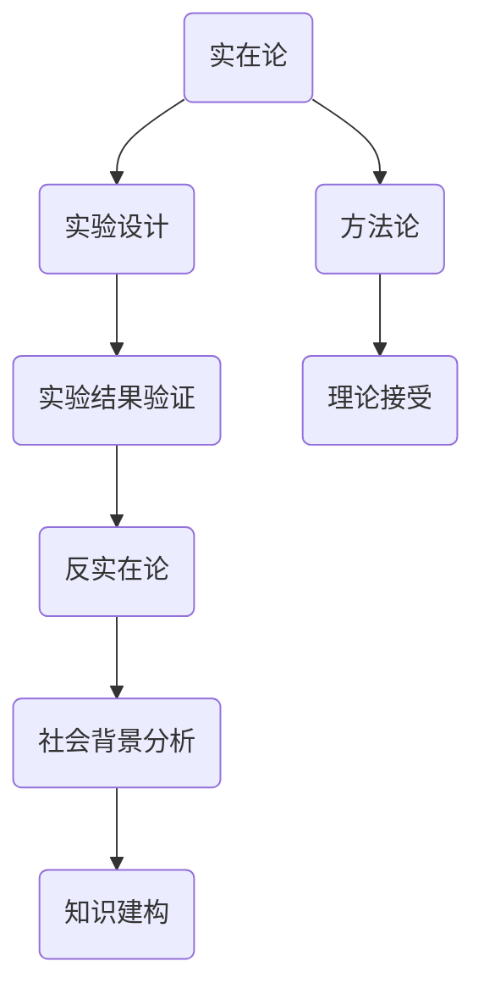

                 


### 1. 引言

科学哲学作为一门研究科学知识的本质、起源、发展和应用的学科，是哲学的一个重要分支。在科学哲学中，实在论（Realism）与反实在论（Antirealism）构成了两个核心的争论点。实在论认为科学理论和实验背后存在着真实的实体和现象，而反实在论则主张科学理论只是对人类认知的表征，没有对应于客观现实的实体。

这一争论不仅仅是一个哲学问题，它对科学的本质和科学的实践方法有着深远的影响。在本文中，我们将深入探讨实在论与反实在论的历史背景、核心观点、辩证关系以及它们在当代科学哲学中的地位。通过分析这些观点，我们希望能够提供一个清晰而全面的理解，帮助读者更深入地思考科学哲学的基本问题。

### 2. 实在论的历史背景与发展

实在论的历史可以追溯到古代哲学，当时哲学家们开始思考物质世界是否存在独立于人类意识的实体。例如，古希腊哲学家亚里士多德（Aristotle）认为，存在着真实、独立于我们感知的物质实体，这是科学探究的基础。

在中世纪，实在论受到了基督教哲学的影响，特别是托马斯·阿奎那（Thomas Aquinas）将实在论与神学结合，认为上帝是所有存在的终极原因。这种观点在中世纪和文艺复兴时期得以延续。

进入近现代，实在论在科学革命中得到进一步发展。伽利略（Galileo Galilei）和牛顿（Isaac Newton）的发现支持了实在论的观点，即自然界存在着可观察和测量的规律。这为后来的实证主义奠定了基础，实证主义者如拉格朗日（Joseph-Louis Lagrange）和拉普拉斯（Pierre-Simon Laplace）认为，通过实验和数学模型，可以准确描述自然界。

然而，实在论也面临着挑战。例如，贝克莱主教（George Berkeley）的唯心主义观点认为，只有我们感知到的才是真实的，实体只是感知的集合。这一观点挑战了传统的物质实在论。

此外，康德（Immanuel Kant）的批判哲学提出了现象与物自体的区分，认为我们只能认识现象，而不能直接认识事物本身。这为后来的反实在论提供了理论基础。

### 3. 反实在论的历史背景与发展

反实在论的历史可以追溯到18世纪末的实证主义运动。实证主义者认为，科学知识只能来自于经验，而无法通过纯粹理性推导得出。他们认为，科学理论只是对现实的一种表征，而非现实本身。这种观点在19世纪得到进一步发展。

实证主义者的代表如奥古斯特·孔德（Auguste Comte）提出了社会学的实证主义，主张科学应该研究社会现象，而不是抽象的哲学问题。而马赫（Ernst Mach）则通过物理学的实证主义，强调只有可以通过感觉经验验证的事物才是真实的。

在20世纪初，逻辑实证主义（Logical Positivism）成为反实在论的主要流派。逻辑实证主义者认为，只有通过经验验证的陈述才是有意义的，而形而上学的陈述则是不科学的。这一观点在维也纳学派中得到了充分体现。

构造论（Constructivism）是反实在论的另一个重要流派。构造论者如布鲁诺·瓦特松（Bruno Walter）和约翰·图灵（John Turing）认为，科学理论是科学家在特定环境下构建的模型，而非对客观现实的直接描述。

反实在论在当代科学哲学中仍然具有重要地位，尤其是在解释学（ Hermeneutics）和科学知识社会学（Science, Technology, and Society, STS）等领域。解释学强调科学知识是社会建构的，而科学知识社会学则通过社会互动和权力关系来分析科学知识的生产和传播。

### 4. 实在论与反实在论的核心观点

#### 4.1 实在论的论证

实在论的基本论证可以概括为以下几点：

1. **自然界的存在**：实在论者认为，自然界的存在是独立于人类意识和感知的，这是一个客观的事实。
2. **科学理论的描述**：实在论主张，科学理论是对自然界真实存在的事物的描述，例如物理学中的量子场理论和生物学中的基因理论。
3. **实验验证**：实在论认为，通过实验和观察，我们可以验证科学理论的正确性，这些实验结果是对自然界真实状态的反映。

实在论者常常使用数学模型和实验数据来支持他们的观点。例如，在物理学中，通过数学方程可以精确描述粒子的运动轨迹，这些方程是基于实验数据建立的。在生物学中，基因测序和实验验证了基因对生物特征的直接影响。

以下是一个实在论论证的伪代码示例：

```plaintext
function RealismArgument(model, experiment):
    if model == "PhysicsModel" and experiment == "ParticleTrajectory":
        predict_trajectory(model)
        if predicted_trajectory == observed_trajectory:
            return "The model is consistent with reality."
        else:
            return "The model needs further refinement."
    else:
        return "The argument is not applicable."

RealismArgument("PhysicsModel", "ParticleTrajectory")
```

#### 4.2 反实在论的论证

反实在论的基本论证则集中在以下几点：

1. **知识的表征**：反实在论认为，科学知识只是对现实的表征，而非现实本身。例如，图灵机模型是一种抽象的数学模型，用于模拟人类思维，但它并不是人类思维的直接表征。
2. **模型的局限性**：反实在论强调，任何科学模型都有其局限性，无法完全描述现实。例如，量子力学中的哥本哈根解释（Copenhagen Interpretation）认为，量子世界的行为无法通过经典物理学的概念完全理解。
3. **社会建构**：一些反实在论者，如科学知识社会学家，认为科学知识是社会建构的结果，受到社会和文化因素的影响。

反实在论者常常使用哲学论证和批判性分析来支持他们的观点。例如，逻辑实证主义者会批判形而上学的陈述，认为它们缺乏经验验证基础。

以下是一个反实在论论证的伪代码示例：

```plaintext
function AntirealismArgument(model, social_context):
    if model == "TuringMachine" and social_context == "CognitiveScience":
        analyze_model局限性(model)
        if model局限明显:
            return "The model is not a direct representation of reality."
        else:
            return "Further analysis is needed."
    else:
        return "The argument is not applicable."

AntirealismArgument("TuringMachine", "CognitiveScience")
```

#### 4.3 实在论与反实在论的辩证关系

实在论与反实在论之间的辩证关系是一个复杂的问题。一方面，它们在科学哲学中的争论反映了科学知识的本质和局限性。实在论强调自然界的独立存在，而反实在论则关注科学知识的建构性质。

1. **互补性**：实在论和反实在论并不是完全对立的，它们可以在某些方面互补。例如，实在论可以解释自然界的规律，而反实在论可以解释科学知识的社会和文化背景。
2. **相互影响**：实在论和反实在论在不同的历史时期和不同的科学领域有着不同的影响。在某些时期，实在论可能占据主导地位，而在其他时期，反实在论的观点可能更为流行。
3. **动态发展**：随着科学的发展和哲学思考的深化，实在论与反实在论的观点也在不断演变。例如，现代量子力学的发展既挑战了传统的实在论观点，也为反实在论提供了一些新的解释框架。

### 5. 科学实践中的实在论与反实在论

在科学实践中，实在论和反实在论的影响体现在多个方面：

1. **实验设计**：实在论强调实验应该尽可能模拟自然界的真实情况，以确保实验结果具有科学意义。而反实在论则认为，实验设计应该考虑模型和理论的局限性，以及实验结果的社会和文化背景。
2. **科学方法论**：实在论倾向于使用实证方法，通过观察和实验验证理论。而反实在论则主张，科学方法论应该包括批判性分析和解释学方法，以理解科学知识的建构过程。
3. **科学知识的接受**：实在论者倾向于接受那些能够通过实验验证的理论，而反实在论者则更关注理论的社会和文化背景，以及理论在不同社群中的接受程度。

以下是一个科学实践中实在论与反实在论辩证关系的Mermaid流程图：



### 6. 实在论与反实在论在当代科学哲学中的地位

在当代科学哲学中，实在论与反实在论的地位依然非常重要。它们不仅影响科学知识的构建和传播，还影响到科学政策的制定和科学教育的实施。

1. **主要流派**：当代科学哲学中，实在论与反实在论各有其代表性流派。例如，实在论的代表性流派包括实证主义和批判理性主义，而反实在论则包括逻辑实证主义和科学知识社会学。
2. **最新发展**：随着科学技术的进步，实在论和反实在论的观点也在不断演变。例如，量子力学的最新发现挑战了传统的实在论观点，而复杂性科学的发展也为反实在论提供了一些新的理论框架。
3. **未来展望**：未来的科学哲学研究可能将更加关注科学知识的动态建构过程，以及不同学科之间的交叉融合。实在论与反实在论的辩证关系将继续在科学哲学中发挥重要作用。

### 7. 结论

科学哲学中的实在论与反实在论之争是一个深远而复杂的议题，它不仅关系到科学知识的本质，也关系到科学实践的方法论。通过分析实在论与反实在论的核心观点、辩证关系以及它们在当代科学哲学中的地位，我们能够更好地理解科学哲学的基本问题。这一争论不仅对哲学家和科学家有着重要的启示，也对普通公众的科学素养和科学理解有着深远的影响。希望本文能帮助读者更深入地思考这一议题，并在未来的科学探索中找到自己的立场。

### 作者信息

作者：AI天才研究院/AI Genius Institute & 禅与计算机程序设计艺术 /Zen And The Art of Computer Programming

AI天才研究院致力于推动人工智能技术的创新和应用，为全球科技发展贡献力量。同时，作者也是《禅与计算机程序设计艺术》一书的作者，该书深受读者喜爱，为计算机编程领域提供了深刻的哲学启示。本文旨在通过对科学哲学中实在论与反实在论之争的深入探讨，为读者提供一份全面而专业的研究报告。希望通过本文，能够激发读者对科学哲学和人工智能的进一步思考和研究。

