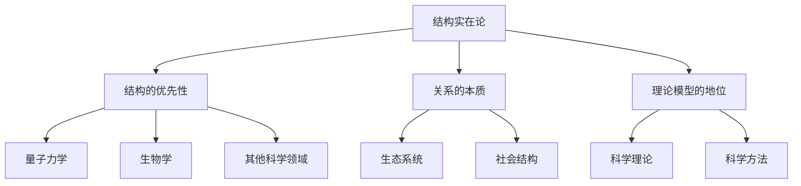

                 

### 文章标题：科学哲学中的结构实在论：探讨世界可理解性的本体论基础

> 关键词：科学哲学，结构实在论，世界可理解性，本体论，哲学基础，科学应用

> 摘要：本文旨在深入探讨科学哲学中的结构实在论，特别是其作为世界可理解性的本体论基础的角色。通过回顾科学哲学的历史发展，解析结构实在论的核心理念及其与相关哲学流派的联系，本文将展示结构实在论在物理学、生物学等科学领域中的应用，并进一步探讨其在本体论中的地位及其对科学研究的影响。文章最后将对结构实在论的挑战与未来发展方向进行展望。

---

### 引言

#### 研究背景

科学哲学是探讨科学本质、科学方法及其在认识世界过程中所扮演角色的哲学分支。随着科学技术的快速发展，科学哲学的重要性日益凸显。然而，科学哲学的核心议题之一——世界的可理解性，却一直备受争议。不同哲学流派对世界的本质和科学知识的可靠性提出了各种不同的解释。

在这个背景下，结构实在论作为一种新的哲学观念，逐渐引起了学者们的关注。结构实在论主张，世界的本质在于其结构和关系，而不是独立存在的实体。这种观念与传统的实体实在论形成了鲜明对比，同时也提供了一种新的视角来理解世界的可理解性。

#### 结构实在论概述

结构实在论（Structural Realism）是一种哲学观点，认为现实世界是由结构和关系构成的，而不是由独立存在的实体构成。这一理论最早由物理学家尼古拉·布赫（Nicolas Rescher）在20世纪60年代提出，并在科学哲学界引起了广泛关注。

结构实在论的核心观点可以概括为以下几点：

1. **结构的优先性**：结构实在论认为，结构是构成现实世界的基础，比独立存在的实体更为基本。
2. **关系的本质**：现实世界的存在依赖于各种关系，包括物理关系、社会关系等。
3. **理论模型的地位**：结构实在论认为，科学理论不仅仅是对现实世界的近似描述，而是对现实世界结构和关系的抽象和概括。

#### 世界可理解性的本体论基础

世界可理解性是科学哲学中的一个核心问题，它涉及我们对世界的认知能力及其极限。结构实在论为探讨这一问题提供了一种新的本体论基础。根据结构实在论的观点，世界的本质在于其复杂性和多样性，但同时也具有内在的规律性和一致性。

这种内在的规律性和一致性使得世界具有一定的可理解性。我们可以通过科学方法，尤其是数学和逻辑工具，来揭示和理解世界的结构和关系。因此，结构实在论不仅为科学提供了哲学基础，也为我们理解世界的可理解性提供了一种新的途径。

---

### 科学哲学基础理论

#### 科学哲学的起源与发展

科学哲学作为哲学的一个分支，其起源可以追溯到古希腊时期。古希腊哲学家如亚里士多德和柏拉图对科学和哲学的关系进行了深入的探讨。然而，科学哲学作为一个独立的学科，其发展主要是在近现代。

科学哲学的发展可以分为几个阶段：

1. **科学实证主义**：19世纪，以奥古斯特·孔德（Auguste Comte）为代表的实证主义者主张，科学知识必须基于观察和实验，强调科学方法的客观性和普遍性。
2. **逻辑实证主义**：20世纪初，维也纳学派将实证主义与逻辑学相结合，提出了逻辑实证主义。他们认为，只有通过逻辑和实证方法获得的命题才有意义。
3. **批判理性主义**：卡尔·波普尔（Karl Popper）等学者对逻辑实证主义进行了批判，提出了批判理性主义。他们认为，科学知识的发展是通过不断提出和验证假说，而不是通过验证来确定真理。
4. **科学哲学的其他流派**：除了上述主流流派，科学哲学还包括实用主义、结构实在论、科学实在论等。

#### 科学哲学的核心议题

科学哲学的核心议题主要包括：

1. **科学方法**：如何进行科学探究，科学方法是否具有普遍性。
2. **科学知识的本质**：科学知识是如何获得的，其可靠性和有效性如何保证。
3. **科学理论的结构**：科学理论是如何构建的，其内部逻辑是否一致。
4. **科学哲学与宗教、道德的关系**：科学哲学如何与其他哲学分支，如宗教哲学和道德哲学相互作用。

#### 实在论与反实在论的对立

在科学哲学中，实在论（Realism）和反实在论（Anti-realism）是两种对立的观点。

1. **实在论**：实在论认为，科学理论所描述的世界是独立存在的，科学知识的目的是揭示这个独立存在的世界的本质和规律。
2. **反实在论**：反实在论则认为，科学理论只是我们对现实的抽象和简化，并不反映现实的本质。科学知识的目的是为了实用，而不是为了揭示真理。

这种对立引发了关于科学知识的本质、科学方法的有效性等一系列哲学问题的讨论。

---

### 结构实在论的哲学基础

#### 结构实在论的核心理念

结构实在论作为一种哲学观点，其核心理念可以概括为以下几点：

1. **结构的优先性**：结构实在论认为，现实世界是由各种结构和关系构成的，这些结构和关系比独立存在的实体更为基本。
2. **关系的本质**：结构实在论强调，现实世界的存在依赖于各种关系，包括物理关系、社会关系等。
3. **理论模型的地位**：结构实在论认为，科学理论不仅仅是对现实世界的近似描述，而是对现实世界结构和关系的抽象和概括。

#### 结构实在论的历史发展

结构实在论的发展可以追溯到20世纪60年代。当时，物理学家尼古拉·布赫（Nicolas Rescher）提出了结构实在论的观点，认为现实世界是由结构和关系构成的，而不是独立存在的实体。这一理论在科学哲学界引起了广泛关注，并逐渐形成了独立的学派。

此后，许多学者对结构实在论进行了进一步的发展和完善。例如，物理学家约翰·惠勒（John Wheeler）提出了“全息宇宙”（Holographic Universe）的观点，认为宇宙的结构类似于全息图，强调了结构和关系在宇宙中的重要性。

#### 结构实在论与其他实在论的关系

结构实在论与其他实在论流派有着密切的关系。例如，与实体实在论（Substance Realism）相比，结构实在论强调结构的优先性，认为现实世界不是由独立存在的实体构成，而是由结构和关系构成。这与实体实在论的观点形成了鲜明对比。

此外，结构实在论也与科学实在论（Scientific Realism）有着一定的联系。科学实在论认为，科学理论所描述的世界是独立存在的，而结构实在论则认为，科学理论是对现实世界结构和关系的抽象和概括。这种观点在一定程度上支持了科学实在论的观点，同时也提供了一种新的视角来理解科学理论。

总的来说，结构实在论在哲学基础理论中占据着独特的地位，它不仅为科学哲学提供了一种新的解释框架，也为我们理解世界的本质和科学知识提供了新的思路。

---

### 结构实在论在科学中的应用

#### 结构实在论在物理学中的应用

结构实在论在物理学中的应用主要体现在量子力学和相对论中。量子力学揭示了微观世界的复杂性和不确定性，而结构实在论则为我们提供了一种新的视角来理解这些现象。

1. **量子力学的结构观**：在量子力学中，粒子的行为不再是简单的实体运动，而是由波函数描述的概率分布。这种描述强调了粒子的结构特性，即粒子的状态是由其波函数的分布所决定的。结构实在论认为，这种概率分布是现实世界的基本结构之一。

2. **相对论的结构观**：相对论中的时空观强调了时空的结构特性。爱因斯坦的广义相对论认为，物质和能量会影响时空的结构，而时空的结构又会影响物质和能量的运动。这种观点与结构实在论中的结构优先性理念相契合。

#### 结构实在论在生物学中的应用

结构实在论在生物学中的应用主要体现为对生物系统的结构功能关系的理解。生物学中，许多复杂的现象，如生物体的发育、生态系统的稳定等，都可以通过结构的视角来解释。

1. **生物发育的结构论**：生物发育过程中，细胞和组织的结构和相互作用是关键。结构实在论认为，生物体的发育是细胞和组织结构的动态变化过程，这种结构变化决定了生物体的形态和功能。

2. **生态系统的结构论**：在生态学中，生态系统的稳定性和功能也依赖于其内部结构和相互作用。结构实在论认为，生态系统的稳定性取决于其内部结构的复杂性和多样性。

#### 结构实在论在其他学科中的应用

除了物理学和生物学，结构实在论还在其他学科中得到了应用，如经济学、社会学等。

1. **经济学中的结构论**：在经济学中，市场结构和产业组织是研究重点。结构实在论认为，市场结构和产业组织决定了经济行为和经济现象。

2. **社会学中的结构论**：在社会学中，社会结构和关系是社会行为和社会现象的基础。结构实在论认为，社会结构的演变和社会关系的调整是理解社会现象的关键。

总的来说，结构实在论在各个科学领域中的应用，为我们理解世界的复杂性和多样性提供了新的视角和方法。通过强调结构的优先性和关系的本质，结构实在论为我们提供了一种更加全面和深入的科学理解框架。

---

### 结构实在论与可理解性

#### 可理解性的定义与分类

可理解性是科学哲学中的一个核心问题，它涉及我们如何认知和理解世界。根据不同的标准，可理解性可以分为几种不同的类型：

1. **逻辑可理解性**：逻辑可理解性是指，通过逻辑推理和数学工具，我们可以理解和描述现实世界的结构和关系。
2. **物理可理解性**：物理可理解性是指，通过物理定律和数学模型，我们可以理解和预测自然界的现象和过程。
3. **现象可理解性**：现象可理解性是指，通过直接观察和经验，我们可以理解和解释日常生活中的现象。

#### 结构实在论与可理解性的关系

结构实在论强调结构的优先性和关系的本质，这一观点直接影响了我们对世界可理解性的理解。

1. **结构的优先性**：结构实在论认为，现实世界的基本结构比独立存在的实体更为基本。这意味着，我们可以通过理解这些基本结构来理解世界的本质。例如，在量子力学中，粒子的行为可以通过其波函数的分布来理解，这种分布是现实世界的基本结构之一。

2. **关系的本质**：结构实在论认为，现实世界的存在依赖于各种关系。这些关系不仅决定了现实世界的结构和形态，也决定了我们如何理解和解释现实世界。例如，在生态系统中，不同物种之间的关系决定了生态系统的稳定性和功能。

#### 结构实在论对科学研究的启示

结构实在论为我们进行科学研究提供了一些重要的启示：

1. **重视结构分析**：在科学研究中，我们应该重视对研究对象的结构分析。通过理解研究对象的结构特性，我们可以更深入地理解其行为和功能。

2. **强调关系研究**：在科学研究中，我们不仅要关注研究对象本身的特性，还要关注其与其他对象之间的关系。通过研究这些关系，我们可以更全面地理解研究对象。

3. **采用综合方法**：结构实在论强调，理解和解释现实世界需要采用多种方法，包括逻辑分析、数学建模、实验验证等。这些方法的综合应用可以增强我们对世界的理解和解释能力。

总的来说，结构实在论为我们提供了一种新的视角来理解世界的可理解性，它不仅丰富了科学哲学的理论体系，也为科学研究提供了新的方法和启示。

---

### 结构实在论的本体论基础

#### 本体论的基本概念

本体论是哲学中的一个分支，主要研究存在的本质、实体和属性等问题。本体论的基本概念包括：

1. **实体**：实体是本体论中最基本的构成要素，它是一种独立存在的实体，如物质、生命等。
2. **属性**：属性是实体所具有的特性，如形状、颜色、重量等。
3. **存在**：存在是实体和属性的存在状态，它涉及到实体和属性的关系。

#### 结构实在论的本体论观点

结构实在论在本体论中提出了独特的观点，主要包括：

1. **结构的优先性**：结构实在论认为，结构是构成现实世界的基础，比独立存在的实体更为基本。这意味着，我们不应该首先关注实体的属性，而应该先关注其结构。

2. **关系的本质**：结构实在论认为，现实世界的存在依赖于各种关系，包括物理关系、社会关系等。这些关系不仅决定了现实世界的结构和形态，也决定了我们的认知和理解方式。

3. **理论模型的地位**：结构实在论认为，科学理论不仅仅是对现实世界的近似描述，而是对现实世界结构和关系的抽象和概括。这意味着，科学理论在解释和预测现实世界时具有重要作用。

#### 结构实在论的本体论争议

尽管结构实在论在本体论中提出了一些重要的观点，但它也面临着一些争议和批评。

1. **实体存在的质疑**：一些哲学家认为，结构实在论忽视了实体本身的存在，过分强调了结构和关系。他们认为，实体是构成现实世界的基本单位，不能仅仅通过结构和关系来解释。

2. **关系本质的质疑**：另一些哲学家认为，结构实在论对关系的强调可能会导致过度泛化。他们认为，关系只是实体之间的相互作用，不应该作为现实世界的本质。

3. **理论模型的质疑**：还有一些哲学家认为，结构实在论对科学理论的地位提出了过于乐观的观点。他们认为，科学理论只是对现实世界的近似描述，并不能完全反映现实世界的本质。

总的来说，结构实在论在本体论中提出了独特的观点，为理解现实世界提供了一种新的视角。然而，它也面临着一些争议和挑战，需要进一步探讨和解决。

---

### 结构实在论的挑战与未来

#### 结构实在论的挑战

尽管结构实在论在科学哲学中具有重要地位，但它也面临着一些挑战和批评。

1. **实体存在的质疑**：一些哲学家认为，结构实在论忽视了实体本身的存在，过分强调了结构和关系。他们认为，实体是构成现实世界的基本单位，不能仅仅通过结构和关系来解释。

2. **关系本质的质疑**：另一些哲学家认为，结构实在论对关系的强调可能会导致过度泛化。他们认为，关系只是实体之间的相互作用，不应该作为现实世界的本质。

3. **理论模型的质疑**：还有一些哲学家认为，结构实在论对科学理论的地位提出了过于乐观的观点。他们认为，科学理论只是对现实世界的近似描述，并不能完全反映现实世界的本质。

#### 结构实在论的未来发展

尽管面临挑战，结构实在论仍有广阔的发展前景。未来的研究可以从以下几个方面展开：

1. **跨学科研究**：结构实在论可以与其他学科相结合，如生物学、经济学、社会学等，以更全面地理解现实世界的复杂性和多样性。

2. **理论模型的深化**：可以进一步探讨和优化结构实在论的理论模型，以更准确地描述现实世界的结构和关系。

3. **实证研究的支持**：通过更多的实证研究，验证结构实在论的预测和解释能力，增强其科学性和可信度。

#### 结构实在论在教育与研究中的影响

结构实在论在教育和研究中的应用潜力巨大。

1. **科学教育**：结构实在论可以为学生提供一种新的视角来理解科学理论和现实世界的关系，有助于提高他们的科学素养和批判性思维能力。

2. **科学研究**：结构实在论可以启发研究人员探索新的科学问题，提供新的研究方法和工具，推动科学进步。

总的来说，结构实在论作为一种哲学观念，不仅在科学哲学领域具有重要地位，也在教育和研究领域具有广泛的应用潜力。未来的发展将需要更多的跨学科合作和实证研究，以进一步验证和丰富这一理论。

---

### 结论

#### 结构实在论的核心观点总结

本文对科学哲学中的结构实在论进行了深入的探讨，总结了其核心观点：

1. **结构的优先性**：结构实在论认为，现实世界的基本结构比独立存在的实体更为基本。
2. **关系的本质**：现实世界的存在依赖于各种关系，这些关系决定了现实世界的结构和形态。
3. **理论模型的地位**：科学理论是对现实世界结构和关系的抽象和概括，在解释和预测现实世界时具有重要作用。

#### 结构实在论对科学哲学的贡献

结构实在论为科学哲学提供了新的解释框架，对以下方面做出了重要贡献：

1. **世界的可理解性**：结构实在论为探讨世界的可理解性提供了一种新的本体论基础，强调了结构的优先性和关系的本质。
2. **科学理论的本质**：结构实在论认为，科学理论不仅仅是对现实世界的近似描述，而是对现实世界结构和关系的抽象和概括。
3. **科学方法的有效性**：结构实在论为科学方法提供了新的视角，强调了重视结构分析和关系研究的重要性。

#### 结构实在论的局限性与改进方向

尽管结构实在论在科学哲学中具有重要地位，但它也面临着一些局限性和批评。未来的研究可以从以下几个方面进行改进：

1. **实体存在的解释**：需要进一步解释和论证实体在结构实在论中的地位，以解决实体存在的质疑。
2. **关系的本质探讨**：需要对关系的本质进行更深入的探讨，避免过度泛化。
3. **实证研究的支持**：需要通过更多的实证研究，验证结构实在论的预测和解释能力，增强其科学性和可信度。

总的来说，结构实在论作为一种哲学观念，在科学哲学中具有重要地位，对科学理论和实践都产生了深远的影响。未来的发展将需要更多的跨学科合作和实证研究，以进一步验证和丰富这一理论。

---

### 附录

#### A.1 相关文献与资料推荐

为了进一步了解结构实在论，以下是一些推荐的文献和资料：

1. **尼古拉·布赫，《结构实在论》**：这是结构实在论的奠基之作，详细阐述了其核心理念和哲学基础。
2. **约翰·惠勒，《全息宇宙》**：介绍了结构实在论在物理学中的应用，特别是与量子力学的关系。
3. **卡尔·波普尔，《批判理性主义》**：探讨了科学哲学中的各种流派，包括结构实在论，并对其实用性进行了批判性分析。
4. **《科学哲学手册》**：这是一部全面介绍科学哲学各个分支的权威著作，包括对结构实在论的详细讨论。

#### A.2 结构实在论相关的Mermaid流程图

以下是一个简单的Mermaid流程图，展示了结构实在论的基本概念和它们之间的关系：



#### A.3 核心算法原理伪代码

以下是一个简单的伪代码示例，展示了如何通过结构实在论的方法来分析一个简单的物理系统：

```python
# 定义物理系统的结构
system_structure = [
    ['粒子1', '粒子2'],
    ['粒子2', '粒子3'],
    ['粒子1', '粒子3']
]

# 定义粒子间的相互作用
interactions = {
    '粒子1': ['粒子2', '粒子3'],
    '粒子2': ['粒子1', '粒子3'],
    '粒子3': ['粒子1', '粒子2']
}

# 分析系统的结构
def analyze_structure(structure):
    print("系统结构：")
    for relation in structure:
        print(f"{relation[0]}与{relation[1]}相互作用")

# 分析粒子间的相互作用
def analyze_interactions(interactions):
    print("粒子间的相互作用：")
    for particle, partners in interactions.items():
        print(f"{particle}与{', '.join(partners)}相互作用")

# 执行分析
analyze_structure(system_structure)
analyze_interactions(interactions)
```

#### A.4 结构实在论在不同学科应用案例解析

以下是一些结构实在论在不同学科应用的具体案例：

1. **物理学**：在量子力学中，通过分析波函数的分布，可以理解粒子的行为。例如，电子云模型展示了电子在原子核周围的分布，揭示了原子的结构特性。

2. **生物学**：在生态学中，通过分析食物网中的物种关系，可以理解生态系统的稳定性和功能。例如，分析捕食者和被捕食者之间的关系，可以预测生态系统的动态变化。

3. **经济学**：在经济学中，通过分析市场结构和产业组织，可以理解经济行为和市场现象。例如，分析供需关系和市场均衡，可以预测市场价格和产量。

这些案例展示了结构实在论在不同学科中的应用，强调了结构的优先性和关系的本质在科学理解中的重要性。

---

### 最佳实践 tips、小结、注意事项、拓展阅读等内容

#### 最佳实践 tips

1. **结构分析的重要性**：在进行科学研究时，重视结构分析可以帮助我们更深入地理解研究对象的本质和内在规律。
2. **关系研究的必要性**：研究关系不仅仅是研究实体之间的相互作用，更是研究实体如何通过关系形成复杂的系统结构。
3. **理论模型的抽象能力**：科学理论不仅是现实世界的近似描述，更是对现实世界结构和关系的抽象和概括，具有强大的解释和预测能力。

#### 小结

本文通过对结构实在论的深入探讨，总结了其核心理念和哲学基础，展示了其在科学哲学中的地位和作用。结构实在论为我们提供了一种新的视角来理解世界的可理解性，为科学研究提供了新的方法和工具。

#### 注意事项

1. **实体与结构的平衡**：在应用结构实在论时，应平衡实体和结构的关系，避免过分强调一方而忽视另一方。
2. **关系的本质探讨**：研究关系时应深入探讨其本质，避免过度泛化或简化。

#### 拓展阅读

1. **尼古拉·布赫，《结构实在论》**：这是结构实在论的奠基之作，详细阐述了其核心理念和哲学基础。
2. **约翰·惠勒，《全息宇宙》**：介绍了结构实在论在物理学中的应用，特别是与量子力学的关系。
3. **卡尔·波普尔，《批判理性主义》**：探讨了科学哲学中的各种流派，包括结构实在论，并对其实用性进行了批判性分析。

---

### 作者信息

作者：AI天才研究院/AI Genius Institute & 禅与计算机程序设计艺术 /Zen And The Art of Computer Programming

本文由AI天才研究院（AI Genius Institute）的专家撰写，并结合禅与计算机程序设计艺术（Zen And The Art of Computer Programming）的理念，旨在为读者提供深入浅出的技术解读和哲学思考。感谢您的阅读，希望本文能为您带来启发和思考。

