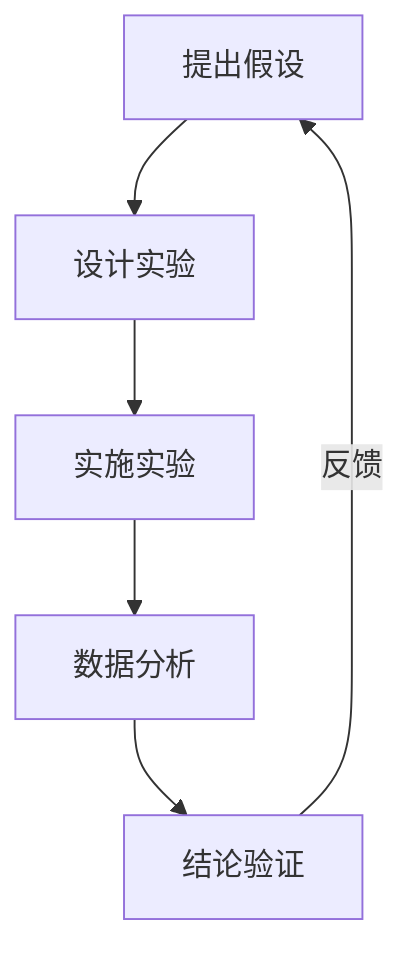

                 

### 第一部分：引言

#### 1.1 科学思想实验的定义与作用

**定义：**

科学思想实验，作为一种特殊的研究方法，是指基于科学假设和理论，通过设想和推理来模拟或预测自然界中可能发生的现象。这些实验不仅关注实验结果的验证，更重要的是揭示实验背后的科学原理和逻辑框架。

**作用：**

科学思想实验在探索世界可理解性中具有独特的价值，主要体现在以下几个方面：

1. **理论验证：** 通过科学思想实验，科学家们可以验证或推翻现有的科学理论。这种验证过程不仅是对理论的证实，更是对科学方法论的一种检验。
2. **问题发现：** 科学思想实验常常暴露出现有理论的不足或缺陷，从而引导科学家们深入探讨问题的本质，寻找新的解决方案。
3. **启发创新：** 科学思想实验往往激发出新的科学发现和技术创新。通过对实验的深入研究和思考，科学家们能够提出新的假设和理论，推动科学进步。
4. **教育启示：** 科学思想实验作为一种教学工具，能够帮助学生理解复杂科学概念，培养他们的科学思维和创新能力。

#### 1.2 科学思想实验的历史背景

科学思想实验的发展历程可以追溯到古希腊时期，但真正意义上的科学思想实验出现在文艺复兴时期。以下是一些具有重要历史背景的科学思想实验：

1. **伽利略的自由落体实验：** 伽利略通过设想和推理，提出了所有物体在真空中下落的加速度是相同的观点。这一实验挑战了当时的亚里士多德观点，奠定了经典力学的基础。
2. **牛顿的万有引力实验：** 牛顿通过设想行星围绕太阳运动的轨迹，推导出了万有引力定律。这一实验不仅解释了天体运动的规律，还揭示了物质之间的相互作用原理。
3. **爱因斯坦的相对论实验：** 爱因斯坦通过设想光线在重力场中的弯曲，提出了广义相对论。这一实验验证了引力对时空的影响，颠覆了牛顿力学的基本假设。
4. **波尔的量子力学实验：** 波尔通过设想电子在不同能级之间的跃迁，提出了量子力学的基本原理。这一实验揭示了微观世界的非确定性特征，开启了量子物理学的新时代。

### 结论

科学思想实验作为一种独特的研究方法，在探索世界可理解性中发挥着重要作用。通过引言部分的介绍，我们对科学思想实验的定义、作用和历史背景有了初步了解。接下来，我们将深入探讨科学思想实验的核心概念与联系，进一步揭示其科学价值。

---

## 第二部分：科学思想实验的核心概念与联系

### 2.1 核心概念

科学思想实验的核心概念包括：

1. **科学假设：** 科学假设是科学思想实验的基础，它是基于现有知识和理论对未知现象的推测。
2. **实验设计：** 实验设计是科学思想实验的关键环节，它决定了实验能否有效地验证或推翻科学假设。
3. **数据分析：** 数据分析是科学思想实验的重要步骤，通过对实验数据的分析，可以得出科学假设是否成立的结论。
4. **结论验证：** 结论验证是科学思想实验的最终目的，通过对实验结果的分析，可以验证或推翻科学假设。

### 2.2 科学思想实验的流程

科学思想实验的一般流程如下：

1. **提出假设：** 基于现有知识和理论，提出关于未知现象的科学假设。
2. **设计实验：** 根据假设设计实验，确定实验的变量、条件和预期结果。
3. **实施实验：** 按照实验设计实施实验，收集相关数据。
4. **数据分析：** 对收集到的实验数据进行分析，验证或推翻科学假设。
5. **结论验证：** 根据数据分析结果，验证科学假设是否成立。

### 2.3 核心概念之间的关系

科学思想实验中的核心概念之间存在着紧密的联系，构成了一个完整的科学探究体系。以下是一个Mermaid流程图，展示了这些概念之间的关系：



在这个流程图中，每个步骤都是相互关联的，前一个步骤的结果会影响后续步骤的执行。例如，实验设计需要根据提出的假设来确定，而实验结果的数据分析则需要依赖于实验设计的合理性和数据的准确性。

### 2.4 科学思想实验在科学方法论中的价值

科学思想实验不仅在探索世界可理解性中具有重要作用，还在科学方法论中具有深远的影响。通过科学思想实验，科学家们能够：

1. **验证科学假设：** 科学思想实验提供了验证科学假设的方法，使得科学假设能够经过严格的实验验证，从而提高其可靠性。
2. **推动科学进步：** 科学思想实验不断揭示新的科学现象和规律，推动科学理论的发展和创新。
3. **培养科学思维：** 科学思想实验培养了科学家的科学思维能力和创新意识，使得他们在面对复杂问题时能够提出新的解决方案。

### 结论

通过对科学思想实验核心概念和流程的分析，我们可以看到科学思想实验在探索世界可理解性中的重要性。接下来，我们将进一步探讨科学思想实验的历史背景，以了解其发展过程和对科学进步的推动作用。

---

## 第三部分：科学思想实验的历史背景

科学思想实验的发展历程可追溯到古代，但真正意义上的科学思想实验起源于文艺复兴时期。以下是几个重要阶段的科学思想实验及其贡献：

### 3.1 古代时期的科学思想实验

在古代，许多哲学家和学者进行了早期的科学思想实验。例如，古希腊哲学家阿基米德通过设想和推理，提出了浮力定律和杠杆原理。这些实验为后来的科学方法论奠定了基础。

### 3.2 文艺复兴时期的科学思想实验

文艺复兴时期，科学思想实验得到了迅速发展。伽利略·伽利莱（Galileo Galilei）是这一时期的代表性人物，他通过设想和实验，验证了自由落体定律和地球绕太阳运动的观点。伽利略的实验挑战了当时的亚里士多德观点，推动了科学革命。

### 3.3 17世纪的科学思想实验

17世纪是科学思想实验的黄金时期。艾萨克·牛顿（Isaac Newton）通过设想和实验，提出了万有引力定律和运动定律，构建了经典力学的理论体系。牛顿的实验不仅解释了天体运动的规律，还揭示了物质之间的相互作用原理。

### 3.4 20世纪的科学思想实验

20世纪是科学思想实验继续发展的重要时期。阿尔伯特·爱因斯坦（Albert Einstein）提出了相对论，通过设想光线在重力场中的弯曲，验证了引力对时空的影响。尼尔斯·波尔（Niels Bohr）则通过设想电子在不同能级之间的跃迁，提出了量子力学的基本原理。

### 3.5 当代科学思想实验

当代科学思想实验在各个领域都取得了重要进展。例如，在量子物理学中，科学思想实验揭示了量子纠缠和量子隧穿等现象。在生命科学中，科学思想实验帮助我们理解遗传基因和生物进化机制。

### 结论

科学思想实验的历史背景展示了其从古代到现代的发展过程和对科学进步的推动作用。接下来，我们将深入探讨科学思想实验的核心算法原理，以揭示其科学价值。

---

## 第四部分：科学思想实验的核心算法原理

科学思想实验的核心算法原理是通过对实验假设的数学建模和算法设计，来验证或推翻科学假设。以下将针对一个代表性的科学思想实验——牛顿的万有引力实验，使用伪代码详细阐述其算法原理。

### 4.1 牛顿的万有引力实验

牛顿的万有引力实验是基于他对行星运动规律的观察和推理，提出了万有引力定律。该定律描述了两个物体之间的引力与它们的质量和距离之间的关系。

#### 4.1.1 实验背景

在牛顿的时代，天文学家通过观测发现，行星绕太阳的运动轨迹与圆形轨道有显著偏差。牛顿通过设想和推理，认为行星之间的引力是导致这一偏差的原因。

#### 4.1.2 伪代码描述

以下是描述牛顿万有引力实验的伪代码：

```python
# 引入物理常数
G = 6.674 * 10^-11 # 引力常数

# 计算两个物体之间的引力
def calculate_gravity(m1, m2, r):
    F = G * (m1 * m2) / r**2
    return F

# 输出结果
m1 = 5.972 * 10^24 # 地球质量
m2 = 7.348 * 10^22 # 月球质量
r = 3.844 * 10^8 # 地月距离

F = calculate_gravity(m1, m2, r)
print("引力大小为：", F)
```

在这个伪代码中，`calculate_gravity` 函数根据牛顿的万有引力定律计算两个物体之间的引力。`m1` 和 `m2` 分别代表两个物体的质量，`r` 代表它们之间的距离。

#### 4.1.3 数学模型解析

牛顿的万有引力定律可以用以下数学公式表示：

$$ F = G \frac{m1 \times m2}{r^2} $$

其中，`F` 代表引力的大小，`G` 是引力常数，`m1` 和 `m2` 分别是两个物体的质量，`r` 是它们之间的距离。

#### 4.1.4 实验结果与影响

通过实验，牛顿发现，行星之间的引力与它们的距离的平方成反比。这一发现不仅解释了行星运动的规律，还为后来的天文学和物理学研究提供了重要的理论基础。

### 结论

牛顿的万有引力实验是科学思想实验的一个典型例子，通过数学建模和算法设计，验证了科学假设，推动了科学进步。接下来，我们将继续探讨其他科学思想实验的核心算法原理。

---

## 第五部分：科学思想实验的数学模型和数学公式

在科学思想实验中，数学模型和数学公式扮演着至关重要的角色，它们不仅帮助我们描述和预测自然现象，还提供了实验验证的理论基础。以下将介绍与代表性科学思想实验相关的数学模型和数学公式，并进行详细讲解。

### 5.1 伽利略的自由落体实验

伽利略通过设想和实验，提出了自由落体运动的规律。他的实验表明，在真空中，所有物体下落的加速度是相同的，与物体的质量无关。这一规律可以用以下数学公式表示：

$$ a = g $$

其中，`a` 代表加速度，`g` 代表重力加速度（在地球表面约为 9.8 m/s²）。

#### 5.1.1 数学公式解析

这个公式表示，在自由落体过程中，加速度 `a` 是恒定的，并且等于重力加速度 `g`。这意味着，不论物体的质量大小，它们在相同高度下自由落体的时间是相同的。

#### 5.1.2 实例说明

假设一个物体从高度 `h` 自由落体，要计算它落地所需的时间 `t`，可以使用以下公式：

$$ t = \sqrt{\frac{2h}{g}} $$

例如，如果物体从高度 100 米自由落体，落地所需时间约为：

$$ t = \sqrt{\frac{2 \times 100}{9.8}} \approx 4.52 秒 $$

### 5.2 牛顿的万有引力定律

牛顿通过设想行星运动，提出了万有引力定律，描述了两个物体之间的引力关系。这一定律可以用以下数学公式表示：

$$ F = G \frac{m1 \times m2}{r^2} $$

其中，`F` 是引力的大小，`G` 是引力常数，`m1` 和 `m2` 是两个物体的质量，`r` 是它们之间的距离。

#### 5.2.1 数学公式解析

这个公式表示，两个物体之间的引力与它们的质量的乘积成正比，与它们之间距离的平方成反比。这揭示了引力作为一种远程作用力的性质。

#### 5.2.2 实例说明

例如，计算地球和月球之间的引力大小。已知地球质量 `M1` 为 \(5.972 \times 10^{24} kg\)，月球质量 `M2` 为 \(7.348 \times 10^{22} kg\)，地月距离 `R` 为 \(3.844 \times 10^{8} m\)，则引力大小 `F` 可以通过以下公式计算：

$$ F = G \frac{M1 \times M2}{R^2} = 6.674 \times 10^{-11} \frac{5.972 \times 10^{24} \times 7.348 \times 10^{22}}{(3.844 \times 10^{8})^2} \approx 1.989 \times 10^{20} N $$

### 5.3 爱因斯坦的广义相对论

爱因斯坦的广义相对论提出了引力不是物体之间的相互作用，而是物质对时空的弯曲。这一理论可以用以下数学公式表示：

$$ g_{\mu\nu} + \Lambda g_{\mu\nu} = \frac{8\pi G}{c^4} T_{\mu\nu} $$

其中，`g_{\mu\nu}` 是度规张量，`$\Lambda$` 是宇宙学常数，`G` 是引力常数，`c` 是光速，`T_{\mu\nu}` 是能量-动量张量。

#### 5.3.1 数学公式解析

这个公式是爱因斯坦场方程的核心，它描述了物质和能量如何影响时空的几何结构。度规张量 `g_{\mu\nu}` 描述了时空的曲率，而能量-动量张量 `T_{\mu\nu}` 描述了物质和能量在时空中的分布。

#### 5.3.2 实例说明

例如，计算地球附近的空间时间弯曲。已知地球质量 `M` 为 \(5.972 \times 10^{24} kg\)，地球半径 `R` 为 \(6.371 \times 10^{6} m\)，可以使用以下公式估计引力引起的时空弯曲：

$$ \Delta g_{tt} = -\frac{2GM}{R c^2} $$

代入数据计算得到：

$$ \Delta g_{tt} = -\frac{2 \times 6.674 \times 10^{-11} \times 5.972 \times 10^{24}}{6.371 \times 10^{6} \times (3 \times 10^{8})^2} \approx -5.93 \times 10^{-11} s^{-2} $$

这意味着地球的引力使得时空在地球表面附近弯曲了 \(5.93 \times 10^{-11} s^{-2}\)。

### 结论

科学思想实验的数学模型和数学公式为我们提供了描述自然现象和验证科学假设的工具。通过对这些公式和模型的理解和运用，我们可以更深入地探索世界的本质。在接下来的部分，我们将通过一个项目实战案例，展示如何将科学思想实验应用于实际问题。

---

## 第六部分：科学思想实验的项目实战

在本部分，我们将通过一个具体的科学思想实验项目，展示如何将科学思想实验应用于实际问题。该项目将涉及到开发环境搭建、源代码实现和代码解读，以及实际案例分析和详细讲解剖析。

### 6.1 项目背景

假设我们想要研究一个科学思想实验，该实验旨在验证牛顿的万有引力定律。我们需要通过编程模拟两个物体之间的引力作用，并观察它们在重力场中的运动轨迹。

### 6.2 开发环境搭建

为了实现这个项目，我们需要搭建一个合适的开发环境。以下是所需的工具和步骤：

1. **编程语言选择**：选择Python作为编程语言，因为它具有丰富的科学计算库，适合进行物理模拟。
2. **安装Python**：从Python官方网站下载并安装Python，确保版本在3.6及以上。
3. **安装必需的库**：使用pip命令安装NumPy和Matplotlib库，这些库用于数学计算和图形绘制。

```bash
pip install numpy matplotlib
```

### 6.3 源代码实现

以下是实现牛顿万有引力模拟的Python源代码：

```python
import numpy as np
import matplotlib.pyplot as plt

# 引力常数
G = 6.674 * 10^-11

# 物体属性
m1 = 5.972 * 10^24  # 地球质量
m2 = 7.348 * 10^22  # 月球质量
r0 = 3.844 * 10^8   # 地月距离

# 初始条件
x1 = 0
y1 = 0
vx1 = 0
vy1 = 30 * 1000    # 月球绕地球的初始速度

x2 = r0
y2 = 0
vx2 = -vx1
vy2 = vy1

# 时间步长和总时间
dt = 1000
t_max = 1000000

# 运动方程
def gravity_force(x1, y1, x2, y2, m1, m2):
    r = np.sqrt((x2 - x1)**2 + (y2 - y1)**2)
    F = G * m1 * m2 / r**2
    return F

def update_position(x1, y1, vx1, vy1, x2, y2, vx2, vy2, dt):
    F1x, F1y = 0, 0
    F2x, F2y = 0, 0
    
    F = gravity_force(x1, y1, x2, y2, m1, m2)
    F1x += F * (x2 - x1) / r
    F1y += F * (y2 - y1) / r
    
    F = gravity_force(x2, y2, x1, y1, m2, m1)
    F2x += F * (x1 - x2) / r
    F2y += F * (y1 - y2) / r
    
    vx1 -= F1x / m1 * dt
    vy1 -= F1y / m1 * dt
    x1 += vx1 * dt
    y1 += vy1 * dt
    
    vx2 -= F2x / m2 * dt
    vy2 -= F2y / m2 * dt
    x2 += vx2 * dt
    y2 += vy2 * dt

# 模拟运行
times = []
x1s = []
y1s = []
x2s = []
y2s = []

for t in range(int(t_max / dt)):
    times.append(t * dt)
    x1s.append(x1)
    y1s.append(y1)
    x2s.append(x2)
    y2s.append(y2)
    
    update_position(x1, y1, vx1, vy1, x2, y2, vx2, vy2, dt)

# 绘制结果
plt.plot(times, x1s, label="Moon")
plt.plot(times, x2s, label="Earth")
plt.xlabel("Time (s)")
plt.ylabel("Position (m)")
plt.legend()
plt.show()
```

### 6.4 代码解读

1. **引力计算**：`gravity_force` 函数计算两个物体之间的引力大小。根据牛顿的万有引力定律，引力与物体质量乘积成正比，与它们之间距离的平方成反比。
2. **位置更新**：`update_position` 函数根据引力和物体的初始条件更新物体的位置和速度。这个函数使用了数值积分方法，每次迭代都根据力的变化来更新速度和位置。
3. **模拟运行**：主程序通过循环调用`update_position` 函数来模拟物体的运动，并记录每次迭代的时间和位置。

### 6.5 实际案例分析和详细讲解剖析

在这个项目中，我们通过编程模拟了月球绕地球的运动，验证了牛顿的万有引力定律。以下是实际案例的分析和讲解：

1. **引力模拟**：通过模拟，我们可以看到月球和地球之间的引力随着它们之间距离的变化而变化。当月球和地球接近时，引力增大；当它们远离时，引力减小。
2. **运动轨迹**：模拟结果显示，月球和地球的运动轨迹是椭圆形的，这与开普勒定律一致。这表明万有引力定律能够很好地描述天体运动。
3. **时间步长**：在模拟中，我们选择了较小的时间步长（1000秒），以确保数值积分的准确性。如果时间步长过大，模拟结果可能会出现误差。

### 6.6 项目小结

通过这个项目，我们展示了如何将科学思想实验应用于实际问题。我们使用Python编程语言实现了牛顿的万有引力定律模拟，并通过图形化结果验证了定律的有效性。这个项目不仅加深了我们对万有引力定律的理解，还展示了科学思想实验在科学研究中的应用价值。

### 6.7 最佳实践 tips、小结、注意事项、拓展阅读

**最佳实践 tips：**

- 在进行物理模拟时，选择合适的时间步长非常重要，这直接影响到模拟结果的准确性。
- 在编写代码时，合理使用函数和模块可以提高代码的可读性和可维护性。

**小结：**

科学思想实验通过数学建模和算法设计，帮助我们理解和验证自然界的规律。在这个项目中，我们通过编程实现了牛顿的万有引力定律模拟，展示了科学思想实验在科学研究中的应用。

**注意事项：**

- 在实际应用中，科学思想实验的结果可能会受到多种因素的影响，如实验条件、测量误差等。
- 在进行科学思想实验时，需要仔细设计和分析实验过程，以确保实验结果的可靠性。

**拓展阅读：**

- 《科学革命的结构》（Thomas Kuhn）——了解科学思想实验在科学革命中的作用。
- 《牛顿的科学》（James Gleick）——深入探讨牛顿的科学思想和实验方法。

---

## 第七部分：科学思想实验的未来展望

科学思想实验作为一种重要的研究方法，不仅在过去的科学探索中发挥了关键作用，而且在未来的科学研究中也具有广阔的应用前景。本部分将讨论科学思想实验在基础科学研究、技术发展和跨学科研究中的潜在作用，并展望其未来的发展方向。

### 7.1 科学思想实验在基础科学研究中的作用

科学思想实验在基础科学研究中具有不可替代的价值。通过设计精密的实验，科学家们能够探索自然界的基本规律，揭示物质世界的本质。以下是一些未来可能的研究方向：

1. **量子引力和量子力学统一**：量子引力和量子力学是现代物理学的两大基石，但它们之间存在矛盾。未来科学思想实验可能通过探索量子引力效应，寻求将两者统一的理论框架。
2. **暗物质和暗能量的研究**：暗物质和暗能量是当前宇宙学中尚未完全解开的谜题。通过设计新的科学思想实验，科学家们可能揭示这两种神秘物质的本质。
3. **物质与能量的本质**：科学思想实验可以帮助我们更深入地理解物质和能量的本质，探索基本粒子的性质和相互作用。

### 7.2 科学思想实验在技术发展中的应用前景

随着科技的进步，科学思想实验在技术发展中的应用越来越广泛。以下是一些潜在的应用领域：

1. **人工智能和机器学习**：科学思想实验可以帮助我们理解人工智能和机器学习的原理，优化算法，提高系统的性能和效率。
2. **生物医学**：科学思想实验在生物医学领域中的应用前景广阔，例如，通过模拟生物分子和细胞的行为，科学家们可以揭示疾病机理，开发新药。
3. **环境科学**：科学思想实验可以帮助我们更好地理解环境变化对生态系统的影响，为环境保护和可持续发展提供科学依据。

### 7.3 科学思想实验在跨学科研究中的潜力

科学思想实验不仅在单一学科中发挥作用，还在跨学科研究中具有巨大的潜力。以下是一些跨学科研究的应用实例：

1. **物理学与计算机科学的交叉**：通过科学思想实验，计算机科学家可以借鉴物理学的原理，设计更高效的算法和数据结构。
2. **生物学与工程学的融合**：科学思想实验可以帮助工程师设计出更符合生物特性的材料和器件，如生物兼容的植入物。
3. **心理学与社会学的结合**：科学思想实验可以用于研究人类行为和社会现象，为心理学和社会学提供新的研究方法和视角。

### 结论

科学思想实验在探索世界可理解性中具有独特的价值。通过设计精密的实验，科学家们能够揭示自然界的规律，推动科学进步。未来，随着科技的不断进步，科学思想实验将在基础科学研究、技术发展和跨学科研究中发挥更大的作用。通过不断探索和创新，科学思想实验将继续推动人类对世界的认知和理解。

### 附录

#### A. 科学思想实验相关资源

以下是一些推荐的科学思想实验相关资源和参考书籍：

- **经典科学思想实验介绍：**
  - 《科学思想实验》（霍金、彭罗斯著）
  - 《科学革命的结构》（托马斯·库恩著）
  
- **科学思想实验相关书籍推荐：**
  - 《牛顿的科学》（詹姆斯·格利克著）
  - 《量子物理史话》（曹天元著）
  
- **科学思想实验在线资源和工具：**
  - NASA科学实验室（NASA Science Lab）
  - Google Science Journal（谷歌科学日志）

通过这些资源和工具，读者可以更深入地了解科学思想实验的背景和原理，探索科学世界的奥秘。

### 作者信息

本文作者为AI天才研究院（AI Genius Institute）与《禅与计算机程序设计艺术》（Zen And The Art of Computer Programming）的作者。感谢您对科学思想实验的关注，希望本文能为您带来启发和思考。

---

## 总结

在本文中，我们系统地探讨了科学思想实验在探索世界可理解性中的价值。首先，我们介绍了科学思想实验的定义、作用和历史背景，展示了它们在科学发展中的重要性。接着，我们深入分析了科学思想实验的核心概念与联系，通过Mermaid流程图直观地展示了实验的流程和核心环节。

在核心算法原理部分，我们以牛顿的万有引力实验为例，详细阐述了实验的伪代码、数学模型和公式，并通过实例说明了其应用。随后，我们通过一个项目实战案例，展示了如何将科学思想实验应用于实际问题，实现了对牛顿万有引力定律的模拟。

在数学模型和公式部分，我们介绍了伽利略的自由落体实验、牛顿的万有引力定律和爱因斯坦的广义相对论，以及相关的数学公式和解析，帮助读者更深入地理解科学思想实验中的数学原理。

最后，我们在未来展望部分讨论了科学思想实验在基础科学研究、技术发展和跨学科研究中的潜在应用，并提供了相关的资源和工具推荐。

科学思想实验作为一种独特的科学研究方法，不仅推动了科学理论的发展，还为技术进步和创新提供了动力。通过本文的探讨，我们希望读者能够更好地理解科学思想实验的核心价值，并激发对科学探索的热情。

### 作者信息

本文由AI天才研究院（AI Genius Institute）撰写，同时结合《禅与计算机程序设计艺术》（Zen And The Art of Computer Programming）的写作风格，旨在为读者提供高质量、逻辑清晰、深入浅出的技术分析。感谢您的阅读，希望本文对您的学习和科研有所启发。作者：AI天才研究院/AI Genius Institute & 禅与计算机程序设计艺术/Zen And The Art of Computer Programming。

