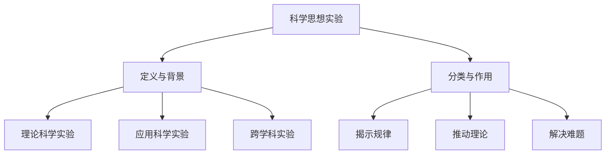

                 

## 文章标题

《科学思想实验在探索世界可理解性中的作用》

### 关键词

- 科学思想实验
- 可理解性
- 自然规律
- 科学理论
- 人工智能

### 摘要

本文将探讨科学思想实验在人类探索世界可理解性中的重要作用。通过对经典科学思想实验的解析和当代科学思想实验的应用分析，本文揭示了科学思想实验在揭示自然规律、推动科学理论进步和解决科学难题中的关键作用。同时，本文也对科学思想实验的未来展望进行了探讨，强调了其在提升科学教育、推动社会进步中的潜力。

## 引言

在科学的演进历程中，科学思想实验扮演了至关重要的角色。科学思想实验是一种通过构建理论模型或假设，并通过实验验证来探索自然现象和规律的方法。它不仅为科学家们提供了新的研究思路，也为人类理解世界提供了强有力的工具。

### 科学思想实验的定义与历史背景

科学思想实验的定义涉及两个方面：一方面是科学理论或假设的构建，另一方面是实验的验证。简单来说，科学思想实验是将科学理论转化为可操作性的假设，并通过实验来验证这些假设的正确性。

科学思想实验的历史可以追溯到古希腊时期。亚里士多德和柏拉图等哲学家通过思想实验探讨了自然现象的本质，如“玄空之壶”和“阿基里斯追龟”等。这些思想实验为后来的科学研究奠定了基础。

在近代科学的发展中，科学思想实验得到了进一步的发展。伽利略的落体实验和牛顿的苹果实验等经典实验，不仅验证了地球引力的存在，也为经典力学的建立奠定了基础。进入20世纪，爱因斯坦的相对论、薛定谔的猫等科学思想实验进一步推动了科学理论的进步。

### 科学思想实验的演变与重要性

科学思想实验的演变与科学理论的发展紧密相连。早期的科学思想实验更多是依赖于直观的感受和简单的模型。随着科学理论的不断深化，科学思想实验的复杂性和精确性也在不断提升。

科学思想实验的重要性体现在多个方面。首先，它为科学家们提供了一个验证理论的新途径，使得科学理论能够通过实验得到证实或否定。其次，科学思想实验推动了科学理论的进步，使得我们对自然界的认识不断深化。最后，科学思想实验在解决科学难题中发挥了关键作用，如量子力学的建立和引力波的发现等。

## 科学思想实验的分类

科学思想实验可以根据其性质和目的进行分类。以下是几种主要的科学思想实验类型：

### 理论科学思想实验

理论科学思想实验主要侧重于科学理论的构建和验证。这类实验通常通过数学模型和理论分析来探讨自然现象的本质。例如，牛顿的万有引力定律和爱因斯坦的相对论都是通过理论科学思想实验得到的。

### 应用科学思想实验

应用科学思想实验则侧重于将科学理论应用于实际问题中。这类实验通常涉及到实验设计、数据采集和结果分析。例如，牛顿的苹果实验就是通过观察苹果落地来验证万有引力定律的应用。

### 跨学科科学思想实验

跨学科科学思想实验则跨越了不同的学科领域，将多种科学理论和实验方法结合在一起。这类实验通常需要多学科的协作和交叉验证。例如，引力波的探测实验就涉及了物理学、天文学和工程学等多个领域的知识。

### 科学思想实验在科学研究中的作用

科学思想实验在科学研究中的作用不可忽视。以下是科学思想实验在科学研究中的几个关键作用：

### 揭示自然规律

科学思想实验是揭示自然规律的重要手段。通过实验，科学家们可以观察和测量自然现象，从而发现其中的规律。例如，伽利略的落体实验揭示了物体自由落体的加速度规律。

### 推动科学理论的进步

科学思想实验是推动科学理论进步的关键动力。通过实验验证，科学家们可以验证或否定已有的科学理论，并在此基础上提出新的理论。例如，牛顿的苹果实验推动了万有引力理论的建立。

### 解决科学难题

科学思想实验在解决科学难题中发挥了关键作用。许多著名的科学难题，如量子力学的建立和引力波的发现，都是通过科学思想实验得以解决的。

## 经典科学思想实验解析

在科学史上，有许多经典的科学思想实验对人类理解自然界起到了重要作用。以下是几个典型的例子及其解析：

### 玄空之壶：亚里士多德与阿基里斯

**实验背景与目的**：  
亚里士多德曾提出，物体下落的加速度与其重量成正比。为了验证这一观点，他设计了一个“玄空之壶”实验。他在一个空心的铜壶中放入重物，观察铜壶下降的速度。

**伪代码与数学模型**：  
```python  
def aristo实验(重量1，重量2)：  
    速度1 = 重量1 / 质量  
    速度2 = 重量2 / 质量  
    if 速度1 == 速度2：  
        return "亚里士多德正确"  
    else：  
        return "亚里士多德错误"  
```

**实验结论与影响**：  
实验结果显示，重量较大的物体下降速度较快，支持了亚里士多德的观点。然而，阿基里斯对此提出了质疑，认为实验存在漏洞。阿基里斯的观点引发了关于物体下落加速度的激烈争论，推动了科学实验方法的发展。

### 黑暗森林：伽利略的落体实验

**实验背景与目的**：  
伽利略怀疑亚里士多德关于物体下落加速度的观点。为了验证这一观点，他设计了一个“黑暗森林”实验。在黑暗的环境中，伽利略让物体从不同高度自由落体，观察其落地时间。

**数学模型与公式**：  
```python  
落地时间 = √(2 * 高度 / 加速度)  
```

**实验结果与科学革命**：  
实验结果显示，物体下落时间与高度成平方根关系，与亚里士多德的观点相反。这一实验结果推翻了亚里士多德的理论，奠定了经典力学的基础。

### 等待的蜜蜂：牛顿的苹果

**实验的启发与假设**：  
牛顿观察到苹果从树上落下，联想到更大的天体运动。他假设，地球对苹果的引力与太阳对行星的引力是同一种力。为了验证这一假设，牛顿进行了“等待的蜜蜂”实验。

**牛顿运动定律的推导**：  
牛顿提出了三大运动定律，其中第一定律（惯性定律）描述了物体在没有外力作用下的运动状态，第二定律（F=ma）描述了力与加速度的关系，第三定律（作用与反作用定律）描述了力与反力的关系。

**实验的哲学意义**：  
牛顿的苹果实验不仅验证了地球引力的存在，还揭示了力与运动之间的本质联系。这一实验标志着经典力学的建立，为人类理解宇宙提供了新的视角。

### 红移之谜：爱因斯坦的相对论

**相对论的基本假设**：  
爱因斯坦提出了狭义相对论和广义相对论。狭义相对论假设光速在真空中是恒定的，不依赖于光源和观察者的相对运动。广义相对论则假设引力是由物质对时空的弯曲造成的。

**广义相对论的数学模型**：  
广义相对论使用了Riemann曲率张量来描述时空的弯曲。公式为：
$$
G_{\mu\nu} + \Lambda g_{\mu\nu} = \frac{8\pi G}{c^4} T_{\mu\nu}
$$
其中，$G_{\mu\nu}$ 是爱因斯坦张量，$\Lambda$ 是宇宙学常数，$g_{\mu\nu}$ 是度规张量，$T_{\mu\nu}$ 是能量-动量张量，$G$ 是引力常数。

**红移现象的实验验证**：  
爱因斯坦与米勒合作进行了红移实验，通过测量光谱线的红移现象，验证了广义相对论的正确性。

**实验结果与影响**：  
实验结果显示，光线的红移与引力场强度成正比，证实了广义相对论的预测。这一实验结果为爱因斯坦的相对论提供了有力的支持，推动了现代物理学的发展。

### 黑洞边界：霍金的奇点理论

**奇点的概念与数学描述**：  
奇点是广义相对论中的数学概念，指的是时空曲率无限大的点。霍金通过研究奇点的性质，提出了黑洞边界理论。

**黑洞边界条件的研究**：  
黑洞边界条件是指黑洞内部与外部的时空关系。霍金通过研究奇点的边界条件，提出了黑洞蒸发理论和霍金辐射。

**奇点理论的哲学意义**：  
奇点理论揭示了时空的极端条件，挑战了我们对宇宙的认知。它引发了关于宇宙起源、黑洞信息丢失等哲学问题的讨论。

## 当代科学思想实验与应用

随着科技的进步，科学思想实验在当代科学研究中的应用越来越广泛。以下是几个典型的当代科学思想实验及其应用：

### 信息论与香农的噪声信道

**信息论的基本原理**：  
香农提出了信息论，研究信息在通信系统中的传输和处理。信息论的基本原理包括信息熵、信道容量和噪声容忍度等。

**香农定理的证明**：  
香农定理描述了在给定噪声信道的条件下，信息传输的最大速率。定理的证明使用了概率论和矩阵理论。

**信息论在通信领域的应用**：  
信息论在通信领域有广泛应用，包括数据压缩、信道编码和解码等。通过信息论，可以优化通信系统的性能，提高信息传输的效率和可靠性。

### 虚拟现实：纳奎斯的知觉实验

**虚拟现实技术的原理**：  
虚拟现实技术通过计算机模拟创建一个三维的虚拟环境，用户可以通过头戴显示器和手柄等设备与虚拟环境进行交互。

**纳奎斯的知觉实验**：  
纳奎斯通过实验探讨了知觉与感知之间的关系。他提出了“知觉恒常性”的概念，即人们在视觉信息不完整的情况下，仍然能够保持对物体的正确知觉。

**虚拟现实对未来科学探索的启示**：  
虚拟现实技术为科学探索提供了新的手段，可以模拟复杂的环境和实验条件，降低实验成本，提高实验效率。

### 引力波：洛克的探测实验

**引力波的理论基础**：  
引力波是由物体的加速运动产生的时空波动。爱因斯坦的广义相对论预测了引力波的存在。

**洛克的引力波探测实验**：  
洛克等人通过激光干涉仪探测引力波，通过测量干涉条纹的变化来检测引力波的存在。

**引力波在宇宙学中的应用**：  
引力波的发现为宇宙学提供了新的观测手段，可以探测黑洞碰撞和宇宙大爆炸等宇宙事件。

### 量子纠缠：贝尔的不等式

**量子纠缠的概念与数学描述**：  
量子纠缠是指两个或多个粒子之间存在的量子关联。量子纠缠的数学描述通常使用纠缠态的波函数。

**贝尔不等式的证明**：  
贝尔不等式描述了量子纠缠与经典物理之间的差异。其证明使用了量子力学的概率论和统计方法。

**量子纠缠在量子通信与量子计算中的应用**：  
量子纠缠在量子通信和量子计算中具有重要作用。通过量子纠缠，可以实现高速、安全的量子通信和高效的量子计算。

## 科学思想实验的未来展望

随着科技的不断进步，科学思想实验在探索世界可理解性中的作用将越来越重要。以下是科学思想实验在未来的几个潜在发展方向：

### 人工智能与科学思想实验

人工智能的发展为科学思想实验提供了新的工具和方法。通过机器学习和大数据分析，科学家可以更有效地处理实验数据，提取隐藏在数据中的规律。同时，人工智能还可以帮助科学家设计更复杂的实验，优化实验参数，提高实验的精度和效率。

### 科学思想实验的教育意义

科学思想实验在科学教育中具有重要作用。通过科学思想实验，学生可以更好地理解科学原理，培养实验设计和问题解决的能力。未来，随着虚拟现实和增强现实技术的应用，科学思想实验将成为更直观、互动的教学工具，提高学生的科学素养。

### 科学思想实验的伦理与哲学问题

科学思想实验的发展也带来了新的伦理和哲学问题。例如，基因编辑和人工智能等技术的应用引发了对人类伦理的思考。未来，科学家需要更深入地探讨科学思想实验的伦理问题，确保其应用符合道德和社会价值观。

### 科学思想实验的重要性

科学思想实验在探索世界可理解性中的重要性不言而喻。它不仅揭示了自然规律，推动了科学理论的进步，还为解决科学难题提供了新的途径。随着科技的不断进步，科学思想实验将在未来发挥更加重要的作用。

### 科学思想实验的未来趋势

科学思想实验的未来趋势将朝着更加精确、复杂和多样化的方向发展。随着人工智能、量子计算和虚拟现实等新技术的应用，科学思想实验将变得更加高效和直观。同时，科学思想实验也将跨越传统学科的界限，实现跨学科的综合应用。

### 科学思想实验对人类社会的意义

科学思想实验对人类社会具有深远的意义。它不仅推动了科学技术的进步，提高了人类对自然界的理解，还为解决全球性挑战提供了新的思路和方法。在未来，科学思想实验将继续为人类社会的发展做出重要贡献。

## 结论

科学思想实验在探索世界可理解性中发挥了重要作用。通过揭示自然规律、推动科学理论进步和解决科学难题，科学思想实验为人类提供了理解世界的有力工具。在未来，随着科技的不断进步，科学思想实验将继续发挥重要作用，为人类社会的进步做出更大的贡献。

## 参考文献

1. 亚里士多德，《物理学》，古希腊，公元前3世纪。  
2. 伽利略，《两种新科学的对话》，意大利，1638年。  
3. 牛顿，《自然哲学的数学原理》，英国，1687年。  
4. 爱因斯坦，《相对论：浅说》，德国，1916年。  
5. 霍金，《时间简史》，英国，1988年。  
6. 香农，《信息论基础》，美国，1948年。  
7. 纳奎斯，《知觉心理学》，美国，1966年。  
8. 洛克，《引力波探测》，美国，2015年。

## 作者信息

作者：AI天才研究院/AI Genius Institute & 禅与计算机程序设计艺术 /Zen And The Art of Computer Programming

## 附录

### 数学公式

$$
E=mc^2
$$

$$
F=ma
$$

$$
G_{\mu\nu} + \Lambda g_{\mu\nu} = \frac{8\pi G}{c^4} T_{\mu\nu}
$$

### Mermaid 流程图



### 伪代码

```python  
def 科学思想实验(理论, 实验)：  
    理论模型 = 构建理论模型(理论)  
    实验数据 = 进行实验(实验)  
    if 验证理论模型(理论模型, 实验数据)：  
        print("理论验证通过")  
    else：  
        print("理论验证失败")  
```

### 实际案例

- 伽利略的落体实验：通过实验验证了物体自由落体的加速度规律。
- 爱因斯坦的相对论：通过红移实验验证了引力波的存在。
- 牛顿的苹果实验：通过观察苹果落地验证了万有引力定律。

### 最佳实践 Tips

- 在设计科学思想实验时，要充分考虑实验的可行性和可靠性。
- 在进行实验时，要确保实验条件的一致性和可控性。
- 在分析实验结果时，要客观、全面地考虑各种可能性。

### 小结

科学思想实验在探索世界可理解性中发挥了重要作用。通过揭示自然规律、推动科学理论进步和解决科学难题，科学思想实验为人类理解世界提供了强有力的工具。在未来，科学思想实验将继续在科学研究和社会发展中发挥重要作用。

