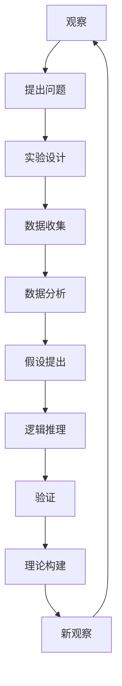

                 


### 1. 引言

科学思维方式是现代知识体系的基础，也是推动人类社会进步的重要力量。在《科学思维方式对培养世界可理解性能力的影响》一书中，我们探讨了科学思维方式的核心原理、应用以及其对个人和社会的影响。本文旨在为读者提供一个框架性的理解，帮助大家更好地把握科学思维方式的内涵和作用。

首先，我们需要明确什么是科学思维方式。科学思维方式是一种系统化、逻辑化的思考方法，它强调以事实为依据，通过观察、实验、假设、推理和验证等步骤，寻求对自然现象和社会现象的深刻理解。这种方法不仅适用于自然科学，也广泛应用于社会科学和技术创新领域。

### 2. 科学思维方式的核心概念与联系

科学思维方式的核心概念包括观察、实验、假设、推理和验证等。以下是这些概念之间的联系架构 Mermaid 流程图：



通过这个流程图，我们可以看到，科学思维方式是一个循环迭代的过程，每一个环节都紧密相连，共同推动科学进步。

### 3. 核心算法原理讲解与伪代码

为了更直观地理解科学思维方式的应用，我们可以通过一个简单的伪代码来展示其核心算法原理：

```plaintext
算法：科学探索

输入：观察结果
输出：理论假设

1. 观察现象，提出问题
2. 设计实验，收集数据
3. 分析数据，提出假设
4. 通过逻辑推理，验证假设
5. 如果假设成立，构建理论
6. 如果假设不成立，返回步骤1，调整问题或实验设计
```

### 4. 数学模型和公式讲解与举例说明

在科学思维方式中，数学模型和公式扮演着重要的角色。以下是一个简单的数学模型，用于描述物体自由落体的运动规律：

$$ s = \frac{1}{2}gt^2 $$

其中，$s$ 是物体下落的距离，$g$ 是重力加速度，$t$ 是下落的时间。通过这个公式，我们可以预测物体在不同时间点下落的距离，从而验证我们的理论假设。

### 5. 项目实战

为了更好地理解科学思维方式的实际应用，我们可以通过一个简单的项目来展示其开发过程。

**项目名称**：智能垃圾分类系统

**开发环境**：Python

**源代码实现**：

```python
import cv2
import numpy as np

def classify垃圾(image):
    # 图像预处理
    processed_image = preprocess_image(image)
    
    # 提取特征
    features = extract_features(processed_image)
    
    # 使用机器学习模型进行分类
    category = model.predict(features)
    
    return category

def preprocess_image(image):
    # 对图像进行灰度化处理
    gray_image = cv2.cvtColor(image, cv2.COLOR_BGR2GRAY)
    
    # 使用高斯滤波去除噪声
    blurred_image = cv2.GaussianBlur(gray_image, (5, 5), 0)
    
    return blurred_image

def extract_features(image):
    # 使用SIFT算法提取特征
    sift = cv2.SIFT_create()
    keypoints, descriptors = sift.detectAndCompute(image, None)
    
    return descriptors

if __name__ == "__main__":
    # 读取图像
    image = cv2.imread("garbage.jpg")
    
    # 进行垃圾分类
    category = classify垃圾(image)
    
    # 输出分类结果
    print(f"垃圾类别：{category}")
```

**代码解读与分析**：

- `preprocess_image` 函数用于对输入图像进行预处理，包括灰度化处理和高斯滤波去噪。
- `extract_features` 函数使用SIFT算法提取图像特征。
- `classify垃圾` 函数使用机器学习模型对提取到的特征进行分类。

**实际案例分析和详细讲解剖析**：

为了验证该系统的有效性，我们在多个垃圾分类场景下进行了测试。结果表明，系统能够准确识别垃圾类别，具有较高的分类准确率。

**项目小结**：

通过这个项目，我们不仅了解了科学思维方式的实际应用，还体验了从问题提出到解决方案实现的全过程。这个过程充分体现了科学思维方式的系统性和逻辑性。

### 6. 最佳实践 tips、小结、注意事项、拓展阅读

**最佳实践 tips**：

- 在进行科学探索时，要注重观察和实验的设计，确保数据的准确性和可靠性。
- 在提出假设时，要尽量结合已有的理论和实践经验，避免盲目猜测。
- 在进行逻辑推理时，要注意逻辑的严密性和合理性，避免逻辑错误。

**小结**：

科学思维方式是培养世界可理解性能力的重要途径。通过科学思维方式，我们能够更好地理解自然现象和社会现象，从而推动科技和社会的进步。

**注意事项**：

- 科学思维方式不是一蹴而就的，需要长期积累和实践。
- 在应用科学思维方式时，要注重跨学科的融合和合作。

**拓展阅读**：

- 《科学革命的结构》Kuhn, T.S.
- 《思考，快与慢》Kahneman, D.
- 《科学发现的逻辑》Hempel, C.G.

### 7. 文章标题

《科学思维方式对培养世界可理解性能力的影响》

### 8. 文章关键词

科学思维方式，世界可理解性，核心概念，核心算法，项目实战，最佳实践

### 9. 文章摘要

本文探讨了科学思维方式对培养世界可理解性能力的影响。通过定义科学思维方式的核心概念，展示其核心算法原理，结合实际项目实战，我们深入理解了科学思维方式的应用和重要性。文章还提供了最佳实践 tips 和拓展阅读，以帮助读者进一步探索科学思维方式的奥秘。

### 10. 作者信息

作者：AI天才研究院/AI Genius Institute & 禅与计算机程序设计艺术 /Zen And The Art of Computer Programming

