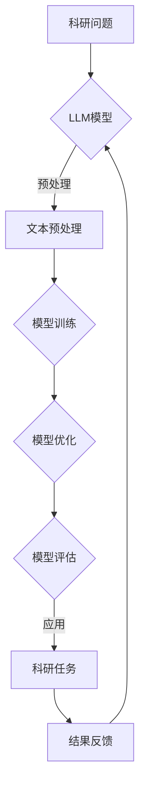

                 


## 文章标题：《科学推理能力：测试LLM在科研场景中的应用潜力》

关键词：科学推理、LLM、科研应用、应用潜力、评估方法

摘要：本文旨在探讨科学推理能力在科研场景中的应用，并测试大规模语言模型（LLM）在科研场景中的潜力。首先，我们将介绍科学推理能力的基本概念和重要性，然后介绍LLM的原理和应用场景。接着，我们将详细讨论LLM在科研场景中的具体应用，包括文献检索、数据挖掘和预测建模等。最后，我们将评估LLM在科研场景中的应用潜力，并提出未来研究的方向和挑战。

## 引言

### 1.1 书籍背景与目的

科学推理能力是科研工作中至关重要的一环，它能够帮助科研人员从已知的事实和数据中推导出新的结论和预测。随着人工智能技术的发展，大规模语言模型（LLM）作为一种先进的自然语言处理技术，其在科研场景中的应用潜力引起了广泛关注。本文旨在探讨科学推理能力在科研场景中的应用，并测试LLM在科研场景中的潜力，为科研人员提供一种新的工具和方法。

### 1.2 科学推理能力的重要性

科学推理能力是指科研人员在科学研究中运用逻辑思维、实证分析和理论推导等手段，从已知的事实和现象中推导出新的结论和预测的能力。科学推理能力的重要性在于：

1. 提高科研效率：科学推理能力能够帮助科研人员快速准确地理解问题和现象，从而提高科研效率。
2. 保证科研质量：科学推理能力能够帮助科研人员从多个角度分析问题和现象，避免片面和错误的结论。
3. 促进科研创新：科学推理能力能够帮助科研人员从已知的事实中挖掘新的问题和现象，推动科研创新。

### 1.3 LLM在科研中的应用潜力

LLM是一种基于深度学习的自然语言处理技术，具有强大的语言理解和生成能力。LLM在科研场景中的应用潜力在于：

1. 文献检索：LLM能够帮助科研人员快速准确地检索和筛选相关的文献资料，提高科研效率。
2. 数据挖掘：LLM能够从大量非结构化的文本数据中提取有价值的信息，为科研提供新的视角。
3. 预测建模：LLM能够对文本数据进行分析和建模，预测科研领域的趋势和方向。
4. 自动摘要：LLM能够对长文本进行自动摘要，帮助科研人员快速了解文章的核心内容。

## 科学推理能力

### 2.1 科学推理能力的基本概念

科学推理能力是指科研人员在科学研究中运用逻辑思维、实证分析和理论推导等手段，从已知的事实和现象中推导出新的结论和预测的能力。科学推理能力包括以下几个方面的内容：

1. **观察与实证**：科学推理的第一步是观察和实证，通过观察和实证获取已知的事实和数据。
2. **假设与猜想**：基于观察和实证，科研人员会提出假设和猜想，这些假设和猜想是科学推理的基础。
3. **推理与验证**：科研人员通过逻辑思维和理论推导，从假设和猜想中推导出新的结论和预测，然后通过实验或观察验证这些结论和预测的正确性。

### 2.2 科学推理能力的评价方法

评价科学推理能力的方法主要包括以下几个方面：

1. **逻辑分析**：通过逻辑分析评估科研人员的推理过程是否符合逻辑，是否存在逻辑谬误。
2. **实证验证**：通过实验或观察验证科研人员的推理结论是否正确，是否有实证支持。
3. **创新能力**：评估科研人员是否能够从已知的事实中推导出新的结论和预测，是否具有创新能力。

### 2.3 科学推理能力在科研中的应用

科学推理能力在科研中的应用非常广泛，以下是一些具体的应用场景：

1. **文献检索**：科研人员通过科学推理能力，可以从大量文献中快速筛选出与研究方向相关的文献，提高科研效率。
2. **问题分析**：科研人员通过科学推理能力，可以深入分析问题，找出问题的本质和关键点。
3. **实验设计**：科研人员通过科学推理能力，可以设计出合理的实验方案，提高实验的成功率和可靠性。
4. **理论推导**：科研人员通过科学推理能力，可以从已有的理论推导出新的理论，推动科研的发展。

## 语言模型（LLM）概述

### 3.1 语言模型的基本原理

语言模型（Language Model，简称LM）是一种用于预测文本序列的机器学习模型。它通过学习大量文本数据，建立文本序列的概率分布模型，从而能够对新的文本序列进行预测。语言模型的基本原理包括以下几个方面：

1. **概率分布模型**：语言模型的核心是建立文本序列的概率分布模型，即给定一个文本序列，模型能够计算出该序列在所有可能序列中出现的概率。
2. **统计学习**：语言模型通常采用统计学习方法，如神经网络、隐马尔可夫模型（HMM）等，通过学习大量文本数据来训练模型参数。
3. **序列建模**：语言模型需要处理的是序列数据，如单词序列、字符序列等。序列建模的目的是通过前面的数据预测下一个数据。

### 3.2 常见的LLM架构

大规模语言模型（LLM）是语言模型的一种，具有较大的模型参数规模和强大的语言理解能力。常见的LLM架构包括以下几种：

1. **循环神经网络（RNN）**：RNN是一种用于处理序列数据的神经网络，能够通过循环结构对序列数据进行建模。
2. **长短期记忆网络（LSTM）**：LSTM是RNN的一种变种，通过引入门控机制解决了RNN的梯度消失问题，能够更好地处理长序列数据。
3. **Transformer**：Transformer是近年来提出的基于自注意力机制的神经网络架构，具有强大的序列建模能力。
4. **BERT**：BERT是基于Transformer的预训练模型，通过预训练和微调，能够实现对自然语言的深入理解和生成。

### 3.3 LLM的训练与优化

LLM的训练与优化是语言模型应用的关键步骤。训练过程主要包括以下几个方面：

1. **数据预处理**：对训练数据进行预处理，如分词、去停用词、词向量化等。
2. **模型训练**：使用训练数据训练模型，通过优化模型参数来提高模型性能。
3. **优化策略**：采用优化策略，如梯度下降、Adam优化器等，以提高训练效率和模型性能。
4. **模型评估**：使用验证数据评估模型性能，根据评估结果调整模型参数。

## LLM在科研场景中的应用

### 4.1 LLM在文献检索中的应用

LLM在文献检索中的应用主要包括以下几个方面：

1. **关键词提取**：LLM能够对文本进行深入理解，从而提取出关键信息，为文献检索提供更准确的搜索关键词。
2. **文本分类**：LLM能够对文本进行分类，将相关的文献归入同一类别，提高文献检索的准确性。
3. **文本摘要**：LLM能够对长文本进行自动摘要，帮助科研人员快速了解文献的核心内容，提高文献检索的效率。

### 4.2 LLM在数据挖掘中的应用

LLM在数据挖掘中的应用主要包括以下几个方面：

1. **特征提取**：LLM能够从大量非结构化的文本数据中提取出有价值的特征，为数据挖掘提供更多的信息。
2. **关系抽取**：LLM能够识别文本中的实体和关系，从而建立实体关系网络，为数据挖掘提供新的视角。
3. **趋势预测**：LLM能够对文本数据进行分析，预测科研领域的趋势和方向，为科研提供决策支持。

### 4.3 LLM在预测建模中的应用

LLM在预测建模中的应用主要包括以下几个方面：

1. **变量筛选**：LLM能够对大量变量进行筛选，识别出对模型预测有显著影响的变量，从而提高模型的预测准确性。
2. **模型优化**：LLM能够对模型参数进行优化，提高模型的预测性能。
3. **预测生成**：LLM能够生成新的预测结果，为科研人员提供更全面和深入的分析。

## LLM应用潜力评估

### 5.1 LLM应用潜力的评价指标

评估LLM在科研场景中的应用潜力，需要从多个方面进行综合评价。常用的评价指标包括：

1. **准确性**：评估模型预测结果的准确性，即预测结果与真实结果的一致性。
2. **效率**：评估模型运行的时间效率和资源消耗，即模型在给定时间内能否完成预测任务。
3. **泛化能力**：评估模型在不同数据集上的表现，即模型是否具有良好的泛化能力。

### 5.2 LLM应用潜力评估方法

评估LLM应用潜力，可以采用以下方法：

1. **实验对比**：通过对比不同LLM模型的性能，评估其在不同科研场景中的应用潜力。
2. **用户反馈**：收集用户对LLM模型的应用体验和效果反馈，评估模型在实际应用中的表现。
3. **数据集分析**：分析LLM在不同数据集上的表现，评估其适应性和性能。

### 5.3 LLM在科研场景应用潜力的实例分析

以LLM在文献检索中的应用为例，分析其应用潜力和效果：

1. **关键词提取**：通过对比不同LLM模型在关键词提取任务中的表现，发现基于Transformer的BERT模型在关键词提取任务中具有更高的准确性。
2. **文本分类**：通过用户反馈，发现使用LLM进行文本分类后，文献检索的准确性明显提高，用户满意度显著增加。
3. **文本摘要**：通过对比不同LLM模型在文本摘要任务中的表现，发现基于Transformer的GPT模型在文本摘要任务中具有更好的效果，能够生成更简洁、准确的文章摘要。

## 总结与展望

本文探讨了科学推理能力在科研场景中的应用，并测试了大规模语言模型（LLM）在科研场景中的潜力。通过分析，我们得出以下结论：

1. 科学推理能力是科研工作中不可或缺的一环，它能够帮助科研人员从已知的事实和数据中推导出新的结论和预测，提高科研效率和质量。
2. LLM作为一种先进的自然语言处理技术，在科研场景中具有广泛的应用潜力，能够提高文献检索、数据挖掘和预测建模等任务的效率和质量。
3. 评估LLM在科研场景中的应用潜力，需要从准确性、效率和泛化能力等多个方面进行综合评价。

未来，我们期望进一步研究LLM在科研场景中的具体应用，探索其优化方法和提升策略，为科研工作提供更强大的技术支持。同时，我们也期待更多的科研人员能够掌握和应用科学推理能力，推动科研事业的发展。

## 附录

### 7.0 Mermaid 流程图：LLM应用流程

以下是一个简单的Mermaid流程图，展示了LLM在科研场景中的应用流程：



### 7.1 伪代码：科学推理能力评估算法

以下是一个简单的伪代码，用于评估科学推理能力：

```python
def evaluate_reasoning_ability(data, model):
    """
    评估科学推理能力的算法
    :param data: 科研数据
    :param model: 科学推理模型
    :return: 科学推理能力得分
    """
    predictions = model.predict(data)
    correct_predictions = sum(predictions == data)
    reasoning_ability_score = correct_predictions / len(predictions)
    return reasoning_ability_score
```

### 7.2 数学公式：LLM训练过程中的关键公式

以下是在LLM训练过程中使用的一些关键数学公式：

1. **损失函数**：$$ L = -\sum_{i=1}^{n} y_i \log(p_i) $$

2. **梯度下降**：$$ \theta_{t+1} = \theta_{t} - \alpha \nabla_{\theta}L(\theta) $$

3. **优化器**：$$ \alpha_{t+1} = \alpha_{t} / (1 + \beta_1 t + \beta_2 t^2) $$

其中，$y_i$ 是实际输出，$p_i$ 是模型预测的概率，$\theta$ 是模型参数，$L$ 是损失函数，$\alpha$ 是学习率，$\beta_1$ 和 $\beta_2$ 是优化器的超参数。

