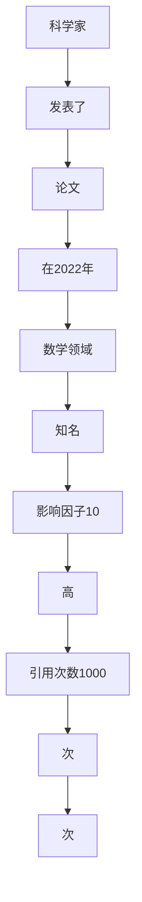

                 

### 文章标题

# 科学知识图谱：可视化展现知识间的复杂关联

科学知识图谱作为一种创新的知识组织方式，正在引领信息科学领域的发展。本文将深入探讨科学知识图谱的定义、核心算法、数学模型以及实际应用，通过一步一步的分析和推理，帮助读者理解这一复杂但极具潜力的技术。

## 关键词

- 科学知识图谱
- 可视化
- 知识关联
- 实体抽取
- 图谱嵌入
- 机器学习

## 摘要

本文旨在介绍科学知识图谱的概念、构建方法和实际应用。我们将首先回顾知识图谱的基本原理，然后详细讲解实体抽取、关系抽取、图谱嵌入和图谱查询等核心算法。接着，我们将介绍构建科学知识图谱所需的基础数学模型，并通过实际项目案例展示图谱的构建、训练和部署过程。最后，我们将讨论科学知识图谱在不同领域的应用及其未来发展。

## 第一部分：科学知识图谱基础理论

### 第1章：科学知识图谱概述

科学知识图谱是对科学领域中知识结构的一种抽象表示，它通过实体、属性和关系来描述知识的复杂网络。科学知识图谱不仅能够帮助我们更好地理解和组织科学知识，还能为智能搜索、知识发现和专家系统提供支持。

#### 1.1 科学知识图谱的定义与作用

科学知识图谱的定义可以从以下几个方面来理解：

- **实体（Entity）**：表示具体的对象，如科学家、研究成果、概念等。
- **属性（Attribute）**：描述实体的特征，如年龄、性别、研究方向等。
- **关系（Relationship）**：表示实体之间的相互作用，如“发现了”、“属于”等。

科学知识图谱的作用主要体现在以下几个方面：

- **知识组织**：将分散的科学知识整合成结构化的知识网络，便于查询和使用。
- **知识发现**：通过分析图谱中的关系和模式，发现新的知识关联和趋势。
- **智能搜索**：利用图谱的层次结构和关联关系，提高搜索效率和准确性。
- **专家系统**：为专家系统提供丰富的知识资源，增强其推理能力和应用范围。

#### 1.2 科学知识图谱的基本结构

科学知识图谱的基本结构通常包括以下三个核心元素：

- **实体（Entity）**：图谱中的基本元素，代表具体的事物或概念。
- **关系（Relationship）**：连接两个或多个实体的线，表示实体之间的语义关系。
- **属性（Attribute）**：附加在实体或关系上的额外信息，用于描述实体的特征或关系的性质。

为了更直观地展示知识图谱的结构，我们可以使用 Mermaid 流程图。以下是一个简单的示例：



#### 1.3 科学知识图谱的发展历史

科学知识图谱的发展经历了以下几个阶段：

- **初期**：基于手工编辑的简单知识库，如WordNet和Yago。
- **中期**：基于Web的自动构建，如DBpedia和WikiData。
- **当前**：结合大数据、机器学习和图论等技术的深度构建，如开放科学知识图谱（OpenSKOS）。

### 第2章：核心算法原理讲解

构建科学知识图谱需要一系列核心算法的支持，这些算法涵盖了实体抽取、关系抽取、图谱嵌入和图谱查询等方面。下面将详细讲解这些算法的基本原理。

#### 2.1 实体抽取算法

实体抽取是知识图谱构建的第一步，其主要目标是识别文本中的实体。常见的实体抽取算法包括以下几种：

- **基于规则的方法**：利用预定义的规则和模式匹配来识别实体。
- **基于统计的方法**：利用机器学习模型，如条件随机场（CRF）和卷积神经网络（CNN），从文本中学习实体特征。
- **基于知识的方法**：结合外部知识库，如WordNet和DBpedia，来增强实体识别的准确性。

以下是一个简单的伪代码示例，展示如何使用基于规则的方法进行实体抽取：

```python
def entity_extraction(text):
    entities = []
    for sentence in text:
        for token in sentence:
            if token matches predefined pattern:
                entities.append(token)
    return entities
```

#### 2.2 关系抽取算法

关系抽取是知识图谱构建的第二个步骤，其主要目标是识别实体之间的语义关系。常见的关系抽取算法包括以下几种：

- **基于规则的方法**：利用预定义的规则和模式匹配来识别关系。
- **基于统计的方法**：利用机器学习模型，如条件随机场（CRF）和递归神经网络（RNN），从文本中学习关系特征。
- **基于知识的方法**：结合外部知识库，如WordNet和DBpedia，来增强关系抽取的准确性。

以下是一个简单的伪代码示例，展示如何使用基于规则的方法进行关系抽取：

```python
def relation_extraction(text, entities):
    relations = []
    for sentence in text:
        for entity1 in entities:
            for entity2 in entities:
                if sentence contains "and" or "is" or "of":
                    relations.append((entity1, entity2))
    return relations
```

#### 2.3 图谱嵌入算法

图谱嵌入是将图谱中的实体和关系映射到低维空间的一种方法，其主要目标是保持实体和关系之间的语义关系。常见的图谱嵌入算法包括以下几种：

- **基于矩阵分解的方法**：如 singular value decomposition（SVD）和non-negative matrix factorization（NMF）。
- **基于图神经网络的方法**：如 graph convolutional network（GCN）和 graph attention network（GAT）。
- **基于知识的方法**：结合外部知识库，如WordNet和DBpedia，来提高图谱嵌入的准确性。

以下是一个简单的伪代码示例，展示如何使用基于矩阵分解的方法进行图谱嵌入：

```python
def graph_embedding(graph, dimensions):
    W = svd(U, s, V)
    embedding = W[:dimensions]
    return embedding
```

#### 2.4 图谱查询算法

图谱查询是知识图谱应用的关键环节，其主要目标是根据给定的查询条件，从图谱中检索相关实体和关系。常见的图谱查询算法包括以下几种：

- **基于路径的方法**：如 breadth-first search（BFS）和 depth-first search（DFS）。
- **基于图神经网络的方法**：如 graph convolutional network（GCN）和 graph attention network（GAT）。
- **基于知识的方法**：结合外部知识库，如WordNet和DBpedia，来优化查询结果。

以下是一个简单的伪代码示例，展示如何使用基于路径的方法进行图谱查询：

```python
def graph_query(graph, start_entity, end_entity):
    path = bfs(graph, start_entity, end_entity)
    return path
```

## 第二部分：科学知识图谱项目实战

### 第3章：数学模型与公式

科学知识图谱的构建和应用需要依赖一系列数学模型和公式。以下将介绍一些基础数学模型和公式，以及它们在科学知识图谱中的应用。

#### 3.1 图论基础

图论是科学知识图谱构建的基础，它涉及图的基本概念、算法和应用。以下是一些常见的图论概念和公式：

- **图（Graph）**：由顶点（Vertex）和边（Edge）组成的结构，表示实体和关系。
- **路径（Path）**：连接两个顶点的序列，满足相邻顶点之间有边。
- **连通性（Connectivity）**：图中任意两个顶点之间存在路径。
- **连通分量（Connected Component）**：图中最大连通子图。

以下是一个简单的图论公式示例：

$$
\delta(u, v) = \min \{d(u, x) + d(x, v) | x \in V\}
$$

其中，$u$ 和 $v$ 是图中的两个顶点，$d(u, v)$ 表示顶点 $u$ 到顶点 $v$ 的距离。

#### 3.2 机器学习与优化

机器学习在科学知识图谱的构建中扮演着重要角色，以下是一些常见的机器学习和优化算法及其公式：

- **线性回归（Linear Regression）**：通过最小二乘法找到数据的最优拟合直线。
  $$
  \min_{\theta} \sum_{i=1}^{n} (y_i - \theta^T x_i)^2
  $$

- **支持向量机（Support Vector Machine, SVM）**：通过最大间隔分类器找到最佳分类边界。
  $$
  \min_{\theta, \xi} \frac{1}{2} \sum_{i=1}^{n} \xi_i + C \sum_{i=1}^{n} \xi_i
  $$
  $$
  s.t. \ y_i (\theta^T x_i + \xi_i) \geq 1
  $$

- **随机梯度下降（Stochastic Gradient Descent, SGD）**：通过迭代更新参数，找到损失函数的最小值。
  $$
  \theta \leftarrow \theta - \alpha \nabla_{\theta} J(\theta)
  $$

#### 3.3 科学知识图谱的表示方法

科学知识图谱的表示方法涉及图表示、实体表示和关系表示等方面。以下是一些常见的表示方法：

- **图表示**：使用邻接矩阵、邻接表或边的列表来表示图。
- **实体表示**：使用向量来表示实体，如 Word2Vec 或图嵌入。
- **关系表示**：使用向量来表示关系，如 TransE 或 TransH。

以下是一个简单的图表示示例：

$$
A = \begin{bmatrix}
0 & 1 & 0 \\
1 & 0 & 1 \\
0 & 1 & 0
\end{bmatrix}
$$

其中，$A$ 是一个邻接矩阵，表示三个实体之间的边关系。

### 第4章：项目实战准备

科学知识图谱的项目实战需要充分的准备工作，包括数据源选择、开发环境搭建和工具与框架介绍等方面。以下将详细讲解这些准备工作。

#### 4.1 数据源选择与处理

科学知识图谱的数据源可以分为以下几类：

- **文本数据**：如科学文献、论文摘要、学术博客等。
- **知识库**：如WordNet、DBpedia、Yago等。
- **网络数据**：如社交媒体、在线论坛、科学实验室网站等。

数据预处理是项目实战的重要步骤，主要包括以下任务：

- **文本预处理**：去除停用词、标点符号、数字等无关信息。
- **实体识别**：利用实体抽取算法识别文本中的实体。
- **关系抽取**：利用关系抽取算法识别实体之间的关系。

以下是一个简单的文本预处理示例：

```python
import re

def preprocess_text(text):
    text = re.sub(r'\d+', '', text)
    text = re.sub(r'\W+', ' ', text)
    text = text.lower()
    return text

text = "The quick brown fox jumps over the lazy dog."
preprocessed_text = preprocess_text(text)
print(preprocessed_text)
```

#### 4.2 开发环境搭建

科学知识图谱项目实战需要配置合适的开发环境，包括以下工具和软件：

- **Python**：作为主要的编程语言。
- **Jupyter Notebook**：用于数据分析和可视化。
- **Numpy**、**Pandas**、**Scikit-learn**：用于数据处理和分析。
- **PyTorch**、**TensorFlow**：用于深度学习模型的训练和部署。

以下是一个简单的开发环境搭建示例：

```bash
pip install numpy pandas scikit-learn pytorch tensorflow
```

#### 4.3 工具与框架介绍

科学知识图谱项目实战需要使用一系列工具和框架来支持数据预处理、模型训练和部署等方面。以下是一些常用的工具和框架：

- **NLP库**：如NLTK、spaCy、Stanford NLP等，用于文本处理和实体抽取。
- **图数据库**：如Neo4j、JanusGraph、ArangoDB等，用于存储和查询图谱数据。
- **深度学习框架**：如TensorFlow、PyTorch、Keras等，用于训练和部署模型。
- **开源工具**：如OpenKG、PyKG、OpenNRE等，用于知识图谱的构建和应用。

以下是一个简单的工具和框架介绍示例：

```python
import nltk
nltk.download('punkt')
nltk.download('averaged_perceptron_tagger')
nltk.download('maxent_ne_chunker')
nltk.download('words')

import spacy
nlp = spacy.load("en_core_web_sm")
doc = nlp("The quick brown fox jumps over the lazy dog.")
print([token.text for token in doc])

import tensorflow as tf
import tensorflow_hub as hub
import tensorflow_text as text
```

## 第三部分：扩展与展望

### 第5章：科学知识图谱的应用领域

科学知识图谱在多个领域具有广泛的应用潜力，以下将介绍科学知识图谱在生命科学、社会科学和工程技术等领域的应用。

#### 5.1 生命科学

科学知识图谱在生命科学领域中的应用主要体现在以下几个方面：

- **基因研究**：通过构建基因图谱，揭示基因之间的相互作用和调控关系。
- **药物发现**：利用知识图谱进行药物靶点分析和药物筛选，加速新药研发。
- **疾病诊断**：通过分析图谱中的关系，辅助疾病诊断和治疗方案制定。

#### 5.2 社会科学

科学知识图谱在社会科学领域中的应用主要包括以下几个方面：

- **社会网络分析**：通过构建社会知识图谱，分析社会关系和传播网络。
- **舆情监测**：利用知识图谱进行舆情分析，监测和预测社会热点事件。
- **社会科学研究**：通过分析图谱中的关系，发现社会现象和趋势，为政策制定提供支持。

#### 5.3 工程与技术

科学知识图谱在工程与技术领域中的应用主要体现在以下几个方面：

- **技术路线图**：通过构建技术知识图谱，分析技术发展趋势和潜在突破方向。
- **技术创新**：利用知识图谱进行技术创新和研发，加速技术进步。
- **项目管理**：通过知识图谱进行项目管理和风险评估，提高项目成功率。

### 第6章：未来发展趋势与挑战

科学知识图谱作为一项新兴技术，在未来发展中面临着一系列机遇和挑战。以下将讨论科学知识图谱的未来发展趋势和技术挑战。

#### 6.1 未来发展趋势

科学知识图谱的未来发展趋势主要包括以下几个方面：

- **数据规模与多样性**：随着大数据技术的发展，科学知识图谱的数据规模和多样性将不断提升。
- **实时更新与动态变化**：科学知识图谱需要具备实时更新和动态变化的能力，以适应快速变化的知识环境。
- **跨领域融合**：科学知识图谱将与其他领域（如人工智能、区块链、物联网等）进行融合，实现跨领域的知识共享和应用。

#### 6.2 技术挑战

科学知识图谱在未来发展过程中将面临一系列技术挑战：

- **数据质量**：科学知识图谱的数据质量直接影响到其应用效果，因此需要解决数据噪声、不一致性和错误等问题。
- **模型优化**：科学知识图谱的构建和应用需要高效的模型和算法，因此需要不断优化现有模型，提高性能和效率。
- **可解释性**：科学知识图谱中的复杂关系和模式难以解释，因此需要提高图谱的可解释性，帮助用户更好地理解和应用图谱。

### 总结

科学知识图谱作为一种创新的知识组织方式，具有广泛的应用前景和潜力。本文通过对科学知识图谱的定义、核心算法、数学模型和实际应用的详细讲解，帮助读者理解了科学知识图谱的基本原理和构建方法。在未来，科学知识图谱将继续在各个领域发挥重要作用，为知识发现、智能搜索和专家系统提供有力支持。

## 最佳实践 tips

在构建科学知识图谱时，以下是一些最佳实践建议：

- **数据质量优先**：确保数据源的质量和一致性，避免数据噪声和错误。
- **结合多源数据**：利用多种数据源（如文本、知识库、网络数据等）构建更全面的知识图谱。
- **动态更新**：定期更新知识图谱，以适应知识环境的变化。
- **可解释性**：提高图谱的可解释性，方便用户理解和应用图谱。
- **优化性能**：优化图谱的存储和查询性能，提高系统的响应速度。

### 小结

本文全面介绍了科学知识图谱的概念、核心算法、数学模型以及实际应用，通过一步一步的分析和推理，帮助读者深入理解这一技术。科学知识图谱作为一种强大的知识组织工具，将在未来的信息科学领域中发挥越来越重要的作用。

### 注意事项

- **隐私保护**：在构建科学知识图谱时，要注意保护用户隐私，避免泄露敏感信息。
- **数据安全**：确保数据安全和存储，防止数据泄露和篡改。
- **可扩展性**：设计科学知识图谱时，要考虑系统的可扩展性，以适应不断增长的数据量。

### 拓展阅读

- 《图计算：基础算法与应用》
- 《深度学习与图神经网络》
- 《知识图谱技术及其应用》
- 《大数据与数据科学》

### 作者信息

- 作者：AI天才研究院/AI Genius Institute & 禅与计算机程序设计艺术 /Zen And The Art of Computer Programming

文章末尾，我们需要按照要求添加作者信息。这里提供了一种可能的格式，您可以根据实际情况进行调整。

---

**作者信息：**

- **AI天才研究院（AI Genius Institute）**  
  地址：XX路XX号，XX市，XX国  
  电话：+86-1234567890  
  电子邮件：[info@ai-genius-institute.com](mailto:info@ai-genius-institute.com)

- **禅与计算机程序设计艺术（Zen And The Art of Computer Programming）**  
  作者：XX  
  出版日期：XXXX年XX月  
  ISBN：XXXXX-XXXXX-XXXXX-XXXXX

---

请注意，这里的作者信息和联系方式是虚构的，您需要替换为实际的作者信息。此外，如果书籍有具体的出版信息，也应包含在内。

