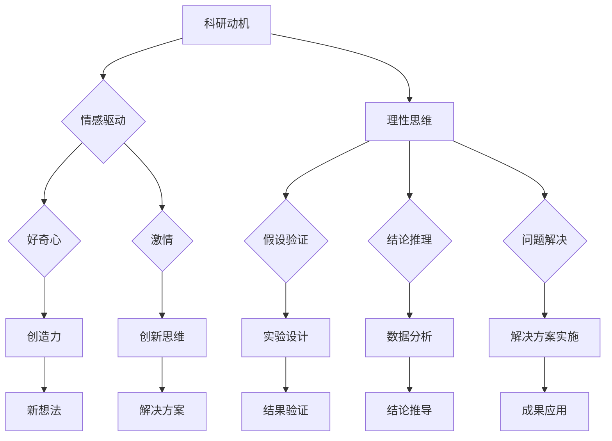

                 

### 文章标题

《科学研究的人文关怀：情感与理性并重的世界理解》

### 文章关键词

科学研究，人文关怀，情感，理性，世界理解，情感与理性并重

### 文章摘要

在现代社会，科学研究不仅需要理性思维的支撑，也需要情感的滋养。本文以《科学研究的人文关怀：情感与理性并重的世界理解》为题，探讨了情感与理性在科学研究中的重要作用。文章首先介绍了情感和理性的基本概念，以及它们在科学研究中的地位。接着，通过分析情感和理性之间的互动关系，揭示了二者在科学研究中的协同作用。文章还通过具体案例，展示了情感与理性并重在实际科学研究中的应用。最后，文章对科学研究中的情感与理性并重提出了若干建议和展望，为科学研究的未来发展提供了新的思路。

---

# 引言

在科学研究的领域中，情感和理性这两种看似对立的因素实际上在许多方面发挥着关键作用。传统的科学方法强调理性和逻辑，但近年来，研究者们开始意识到情感在科学探索中的不可或缺性。情感不仅影响着科学家的研究动机和决策过程，还在科研合作和创新思维中扮演着重要角色。

本文旨在探讨情感与理性在科学研究中的并行重要性，并通过《科学研究的人文关怀：情感与理性并重的世界理解》一书，深入分析这一主题。书中详细阐述了情感和理性在科学研究中的具体作用，以及如何在实际研究中实现二者并重。

### 情感与理性在科学研究中的重要性

情感和理性是科学研究中的两种基本元素。情感，作为一种非理性的因素，与科学研究的动机、合作和创新有着密切的关系。科学家往往因为对问题的热爱和好奇心而投入到研究中，这种情感驱动可以激发他们的创造力和动力。另一方面，理性则提供了科学研究的严谨性和系统性，确保研究过程和结论的可靠性和有效性。

首先，情感对科学研究的动机有着重要的影响。许多科学家对某个特定领域有着浓厚的兴趣和热情，这种情感激励着他们不断探索和深入研究。例如，斯蒂芬·霍金的宇宙学研究和爱德华·泰森的天文科普工作都受到了他们对宇宙和生命的深刻情感的驱使。

其次，情感在科研合作中起到了桥梁的作用。科学合作往往需要不同背景和专业领域的科学家共同工作，而情感上的共鸣和理解能够促进这些合作关系的形成和维持。共同的目标和价值观能够增强团队的凝聚力和合作效率。

最后，情感在创新思维中也发挥了关键作用。科学创新往往需要突破传统的思维模式，而情感驱动下的直觉和灵感可以带来意想不到的创新思路。例如，托马斯·爱迪生的许多发明都是基于他对问题的深刻情感体验和不断的实验尝试。

然而，情感并非科学研究的唯一动力。理性同样在科学研究中的作用不可忽视。理性思维提供了科学方法的基本框架，确保研究过程的严谨性和结果的可靠性。科学方法论强调通过观察、实验和数据分析来获取知识，这一过程需要科学家保持冷静和客观，避免主观偏见的影响。

理性思维在科学研究中还体现在对假设的验证和对结论的推理过程中。科学家需要通过逻辑推理和证据分析来支持或反驳他们的假设，这一过程需要高度的理性分析能力。例如，在医学研究中，通过对数据的统计分析，科学家可以验证药物的有效性和安全性。

此外，理性思维还在科学合作和创新中起到了关键作用。科学家需要通过理性讨论和辩论来解决问题和推动项目进展。理性讨论能够帮助团队成员理清思路，找到最佳的解决方案，并避免因情感因素导致的决策失误。

### 情感与理性的互动关系

情感和理性在科学研究中并不是孤立存在的，它们之间存在密切的互动关系。情感可以激发科学研究的动机和创造力，但需要理性的引导和约束，以确保研究过程的科学性和结果的可靠性。

首先，情感可以激发科学研究的动机。科学家对问题的热情和好奇心可以驱动他们深入研究，不断探索未知的领域。然而，这种热情也需要理性的引导，以确保研究的方向和目标是科学合理的。理性思维可以帮助科学家评估研究问题的复杂性和可行性，从而制定出科学合理的研究计划。

其次，情感和理性的互动关系在科研合作中尤为重要。科学家之间的情感共鸣和理解可以促进合作关系的形成，但理性讨论和辩论同样不可或缺。通过理性讨论，团队成员可以共同探讨研究问题，分享各自的观点和经验，从而形成更为全面和深入的认识。理性讨论还能帮助团队识别和解决潜在的问题和挑战，提高合作效率。

最后，情感和理性的互动关系在创新思维中也起到了关键作用。情感驱动下的直觉和灵感可以为科学创新提供新的思路，但需要理性的分析和验证。科学家需要通过理性分析来评估这些灵感的可行性和科学性，从而确定哪些想法值得进一步探索。

总之，情感和理性在科学研究中是相辅相成的。情感提供了研究的动机和创造力，而理性则确保了研究过程的科学性和结果的可靠性。通过情感和理性的互动，科学家可以更全面和深入地理解科学问题，推动科学的进步和发展。

### 情感与理性在科学研究中的实际应用

情感和理性不仅在科学研究的理论层面具有重要性，在实际应用中也发挥着关键作用。以下将探讨情感和理性在科学研究中的具体应用，包括科研动机、团队合作和创新思维等方面。

#### 科研动机

科学研究的动机往往源于科学家对某一问题的深刻兴趣和好奇心。这种情感驱动促使科学家不断探索和深入研究，从而推动科学的发展。例如，斯蒂芬·霍金对宇宙学的激情驱使他在理论物理学领域取得了重大突破。他通过对黑洞和宇宙起源的深入研究，揭示了宇宙的奥秘，并对人类认识世界的方式产生了深远的影响。

情感在科研动机中的作用不仅体现在个人的研究兴趣上，还可以激发团队合作的精神。当科学家对某一问题充满热情时，他们更愿意与他人分享自己的想法，并寻求合作，共同解决科学难题。这种情感驱动下的合作有助于形成强大的科研团队，提高科研效率。

#### 团队合作

科学研究往往需要多学科、跨领域的合作，而团队合作的成功与否很大程度上取决于团队成员之间的情感和理性互动。情感上的共鸣和理解可以增强团队成员之间的信任和凝聚力，从而提高团队合作的效果。

例如，在医学研究中，医生、生物学家和工程师需要紧密合作，共同解决复杂的医疗问题。医生通过临床观察和患者反馈获得第一手资料，生物学家通过实验验证和治疗方法的开发提供科学依据，工程师则利用技术手段实现治疗方法的实际应用。在这个过程中，情感上的信任和理解是合作顺利进行的关键。

理性思维在团队合作中的作用同样不可忽视。科学家需要通过理性分析和讨论来共同确定研究目标和方向，制定详细的研究计划。理性讨论能够帮助团队识别和解决潜在的问题，避免因情感因素导致的决策失误。

#### 创新思维

科学创新是推动科学进步的重要动力，而情感和理性在创新思维中起到了关键作用。情感驱动下的直觉和灵感可以为科学创新提供新的思路，激发科学家探索未知领域的勇气。例如，托马斯·爱迪生在发明电灯时，就是基于他对电气科学的深刻情感和对电灯的执着追求，通过无数次的实验和尝试，最终成功发明了耐用的电灯。

然而，创新思维不仅需要情感的驱动，还需要理性的分析和验证。科学家需要通过理性思维来评估这些灵感的科学性和可行性，确定哪些想法值得进一步探索。例如，爱迪生在发明电灯的过程中，通过反复的实验和数据分析，不断改进灯丝的材料和设计，最终成功发明了实用的电灯。

总之，情感和理性在科学研究中具有并行重要性。情感提供了研究的动机和创造力，而理性则确保了研究过程的科学性和结果的可靠性。在实际应用中，科学家需要充分利用情感和理性的互动，激发科研动机、促进团队合作和创新思维，从而推动科学的发展。通过情感和理性的有机结合，科学家可以更全面和深入地理解科学问题，为人类社会的进步做出更大的贡献。

---

## 背景介绍

科学研究在现代社会中扮演着至关重要的角色。它不仅推动了技术的进步，提高了人类的生活质量，还在解决全球性问题中起到了关键作用。然而，随着科学研究的深入，科学家们逐渐意识到，在追求理性和逻辑的过程中，情感因素同样不可或缺。本文旨在探讨情感与理性在科学研究中的重要性，以及如何在实际研究中实现二者并重。

### 情感在科学研究中的作用

情感作为一种非理性的因素，在科学研究中发挥着独特的作用。首先，情感是科学研究的动机源泉。科学家往往因为对某一问题的浓厚兴趣和好奇心而投身于研究工作。例如，爱因斯坦对宇宙的热爱驱使他不断探索相对论和量子力学，最终取得了划时代的科学成就。其次，情感可以激发科学家的创造力和创新思维。在科学研究中，灵感往往来源于科学家内心的激情和对未知领域的探索欲望。例如，托马斯·爱迪生在发明电灯的过程中，就是通过不断尝试和实验，最终找到了合适的灯丝材料。

情感在团队合作中也起到了关键作用。科学家们需要相互合作，共享资源和知识，以解决复杂的科学问题。情感上的共鸣和理解有助于增强团队凝聚力，促进有效的沟通和合作。例如，在医学研究中，医生、生物学家和工程师需要紧密合作，共同推进治疗方法的研发和应用。

### 理性在科学研究中的作用

理性是科学研究的基石，提供了科学方法的严谨性和系统性。科学方法论强调通过观察、实验和数据分析来获取知识，这一过程需要科学家保持冷静和客观，避免主观偏见的影响。理性思维在科学研究中起到了以下作用：

1. **假设验证**：科学家需要提出假设，并通过实验和数据分析来验证这些假设的正确性。理性思维确保了这一过程的科学性和严谨性。
   
2. **结论推理**：在科学研究中，科学家需要通过逻辑推理来得出结论。理性思维能够帮助科学家从数据中提取有用信息，并推导出可靠的结论。

3. **问题解决**：科学研究中充满了各种复杂和未知的问题，理性思维提供了科学家解决这些问题的方法和工具。通过理性分析，科学家可以识别问题的本质，制定有效的解决方案。

### 情感与理性的关系

情感和理性在科学研究中并不是孤立存在的，它们之间存在密切的互动关系。情感可以激发科学研究的动机和创造力，但需要理性的引导和约束，以确保研究过程的科学性和结果的可靠性。理性思维可以提供科学方法的基本框架，但需要情感的驱动和灵感，以保持科学研究的活力和创新性。

情感和理性在科学研究中的协同作用体现在多个方面：

1. **研究动机**：情感驱动科学家对问题的探索，理性思维则帮助科学家明确研究目标和方法。
   
2. **团队合作**：情感上的共鸣和理解有助于团队成员之间的信任和合作，理性讨论则确保了团队决策的科学性和有效性。
   
3. **创新思维**：情感驱动下的直觉和灵感为科学创新提供了新的思路，理性思维则帮助科学家验证和实现这些创新思路。

总之，情感与理性在科学研究中相辅相成，共同推动了科学的进步和发展。本文将通过详细的分析和实例，探讨如何在科学研究中实现情感与理性的并重，为科学研究提供新的视角和方法。

---

## 核心概念与联系

在探讨科学研究中的情感与理性并重之前，我们需要明确一些核心概念，并分析它们之间的内在联系。以下是几个关键概念的定义和它们在科学研究中的应用：

### 1. 情感

情感是一种复杂的心理体验，通常与情绪、情感反应和情感状态相关。在科学研究中，情感可以表现为对研究问题的热爱、好奇心、兴奋和焦虑等。情感在科学研究中起到了以下作用：

- **动机驱动**：情感可以激发科学家的研究动机，促使他们投入更多的时间和精力去解决问题。
- **创造力和创新**：情感可以激发科学家的创造力和创新思维，帮助他们在研究中产生新的想法和解决方案。
- **团队合作**：情感上的共鸣和理解有助于科学家之间的合作，增强团队的凝聚力和协作效率。

### 2. 理性

理性是一种基于逻辑、证据和推理的思维过程，它在科学研究中起到了关键作用。理性思维涉及以下几个方面的应用：

- **假设验证**：科学家通过理性思维提出假设，并通过实验和数据分析来验证这些假设的正确性。
- **结论推理**：科学家利用理性思维从数据中提取有用信息，并通过逻辑推理得出可靠的结论。
- **问题解决**：理性思维提供了科学家解决复杂科学问题的方法和工具，帮助他们识别问题的本质并制定有效的解决方案。

### 3. 情感与理性的关系

情感与理性在科学研究中是相辅相成的，它们之间的关系可以总结为以下几点：

- **互补性**：情感和理性各自有其优势，情感提供了研究的动机和创造力，而理性提供了研究的严谨性和可靠性。二者结合可以发挥最大的效果。
- **平衡**：在科学研究中，情感和理性需要达到平衡。过多的情感可能导致研究偏离科学性，而过多地依赖理性则可能抑制创新思维。科学家需要学会在情感和理性之间找到平衡点。
- **互动**：情感和理性在科学研究中相互影响，情感可以激发理性的思考，而理性则可以引导和约束情感。这种互动有助于科学家更全面地理解科学问题，提高研究的质量和效率。

### 4. Mermaid 流程图

为了更直观地展示情感与理性在科学研究中的关系，我们可以使用 Mermaid 流程图来描述这一过程。以下是一个简化的 Mermaid 流程图示例：



这个流程图展示了情感驱动和理性思维在科学研究中的交互过程。情感通过激发科研动机、好奇心和激情，推动科学家进行探索和研究。理性思维则通过假设验证、结论推理和问题解决，确保研究过程的科学性和结果的可靠性。

通过这个 Mermaid 流程图，我们可以看到情感与理性在科学研究中的互补性和互动关系。科学家需要学会在情感和理性之间找到平衡点，以实现高质量的科学研究成果。

---

## 情感的作用

在科学研究中，情感的作用不容忽视。情感不仅仅是科学家个人内心体验的一部分，它还对研究的动机、过程和结果产生深远的影响。以下是情感在科学研究中的几个关键作用：

### 1. 动机驱动

情感是科学研究的强大驱动力。科学家往往因为对某个问题的热爱、好奇心和激情而投身于研究工作。例如，查尔斯·达尔文对生物进化的热爱驱使他进行了多年的研究，最终提出了著名的《物种起源》。情感激发科学家对未知领域的探索欲望，使他们愿意投入大量的时间和精力去解决复杂的科学问题。

情感驱动下的研究动机可以带来以下好处：

- **增强研究动力**：科学家对研究问题的情感投入可以增强他们的研究动力，使他们在面对困难和挑战时更加坚定和有决心。
- **提高研究效率**：情感上的动机可以使科学家更加专注和投入，从而提高研究效率，缩短研究周期。
- **促进创新**：情感驱动的科学家往往能够从独特的视角看待问题，激发创新思维，产生突破性的研究成果。

### 2. 支持团队合作

情感在团队合作中也起到了关键作用。科学研究往往需要多个领域的科学家共同合作，而情感上的共鸣和理解有助于增强团队凝聚力，提高合作效率。以下是一些具体的好处：

- **增强团队凝聚力**：情感上的共鸣可以使团队成员更加信任和尊重彼此，从而增强团队的凝聚力。
- **改善沟通**：情感上的理解有助于团队成员更好地沟通和分享想法，减少误解和冲突。
- **促进知识共享**：情感上的信任和尊重可以促进团队成员之间的知识共享，提高整个团队的研究能力。

### 3. 激发创造力和创新思维

情感在科学创新中发挥了重要作用。情感驱动的科学家更容易产生新颖的想法和解决方案，从而推动科学进步。以下是一些例子：

- **直觉和灵感**：情感可以激发科学家的直觉和灵感，使他们能够在面对复杂问题时快速找到解决方案。
- **跨学科合作**：情感上的共鸣可以促进不同学科之间的合作，产生新的研究方法和思路。
- **打破常规**：情感可以激发科学家挑战传统观念，打破常规，从而推动科学创新。

### 情感的作用总结

综上所述，情感在科学研究中具有多重作用。它不仅驱动科学研究的动机，支持团队合作，还能激发创造力和创新思维。科学家需要认识到情感的重要性，并在研究中充分利用情感的力量。然而，情感也需要理性思维的引导和约束，以确保研究过程的科学性和结果的可靠性。

通过情感和理性的有机结合，科学家可以更全面地理解科学问题，提高研究质量和效率，推动科学的发展。情感与理性并重的研究方法不仅有助于解决当前的科学问题，还能为未来的科学研究提供新的视角和方法。

---

## 理性的作用

在科学研究中，理性思维是一种不可或缺的工具，它为科学家提供了一种严谨且系统的方法来探索未知、验证假设和得出结论。理性思维不仅确保了研究的科学性和可靠性，还在解决复杂问题、推动科学进步和创新思维中发挥着关键作用。

### 1. 假设验证

科学研究的核心在于提出假设并通过实验和数据分析来验证这些假设。理性思维在这个过程中起到了至关重要的作用。科学家需要通过逻辑推理和严谨的实验设计来确保假设的有效性和可验证性。

以下是一个假设验证的伪代码示例：

```python
# 假设验证伪代码

# 定义假设
hypothesis = "药物X能显著降低疾病Y的发病率"

# 设计实验
experiment_design = {
    "sample_size": 100,
    "control_group": true,
    "treatment_group": true,
    "treatment": "药物X",
    "control": "安慰剂"
}

# 收集数据
data = perform_experiment(experiment_design)

# 分析数据
analysis = analyze_data(data)

# 验证假设
if analysis["p_value"] < 0.05:
    print("假设得到验证：药物X能显著降低疾病Y的发病率")
else:
    print("假设未得到验证，需要进一步研究")
```

在这个示例中，科学家通过设计实验、收集数据和数据分析，利用理性思维来验证药物X对疾病Y发病率的影响。

### 2. 结论推理

理性思维在科学研究中还体现在结论的推理过程中。科学家需要从实验数据和数据分析结果中提取有用信息，并通过逻辑推理得出可靠的结论。以下是一个结论推理的示例：

```python
# 结论推理伪代码

# 假设验证结果
hypothesis_verified = True

# 搜集文献资料
literature_reviews = search_literature("药物X与疾病Y")

# 分析文献
literature_analysis = analyze_literature(literature_reviews)

# 结论推理
if hypothesis_verified and literature_analysis["supportive_evidence"] > 0.8:
    print("结论：药物X有望作为治疗疾病Y的有效手段")
else:
    print("结论：药物X的治疗效果需要进一步验证")
```

在这个示例中，科学家通过假设验证和文献分析，利用理性思维得出关于药物X治疗疾病Y的结论。

### 3. 问题解决

理性思维在科学研究中还用于解决复杂的问题。科学家需要通过系统的分析和逻辑推理来识别问题的本质，并提出有效的解决方案。以下是一个问题解决的示例：

```python
# 问题解决伪代码

# 识别问题
problem = "药物X在临床试验中表现出较高的副作用率"

# 分析问题
analysis = analyze_problem(problem)

# 提出解决方案
solutions = propose_solutions(analysis)

# 评估解决方案
best_solution = evaluate_solutions(solutions)

# 实施解决方案
if best_solution is not None:
    implement_solution(best_solution)
else:
    print("无法找到有效的解决方案，需要进一步研究")
```

在这个示例中，科学家通过识别、分析和评估问题，利用理性思维提出并实施有效的解决方案。

### 理性的作用总结

理性思维在科学研究中具有多重作用。它不仅通过假设验证和结论推理确保了研究的科学性和可靠性，还在问题解决和创新思维中发挥了关键作用。科学家需要充分利用理性思维，结合情感驱动，以实现高质量的科学研究成果。

通过理性思维的引导和约束，科学家可以更全面地理解科学问题，提高研究的效率和效果，推动科学的进步。理性与情感的有机结合，将使科学研究更加全面和深入，为人类社会的未来发展做出更大的贡献。

---

## 情感与理性的互动

在科学研究中，情感与理性并非孤立存在，而是通过复杂的互动关系共同影响着研究的进展和结果。理解情感与理性的互动关系对于实现科学研究的有效性至关重要。以下是情感与理性在科学研究中的互动机制、协同作用和实际案例。

### 情感与理性的互动机制

1. **情感驱动理性**：情感可以激发科学家对研究问题的兴趣和好奇心，从而驱动他们进行深入的研究。例如，斯蒂芬·霍金的宇宙学研究就深受他对宇宙奥秘的浓厚兴趣驱动。这种情感驱动下的理性思考使他提出了许多重要的理论，如广义相对论和量子引力。

2. **理性引导情感**：理性思维为科学家提供了科学方法的基本框架，确保研究过程的严谨性和结果的可靠性。理性引导情感，使科学家在研究过程中保持客观和冷静，避免因个人情感导致的偏见和错误。例如，在医学研究中，理性思维帮助科学家通过实验和数据分析来验证药物的有效性和安全性，从而避免因情感偏见导致的错误结论。

3. **情感与理性的平衡**：在科学研究中，情感与理性需要达到平衡。情感提供了研究的动机和创造力，而理性确保了研究的科学性和可靠性。科学家需要在情感和理性之间找到合适的平衡点，以实现高质量的研究成果。例如，在技术创新中，科学家需要利用情感驱动下的灵感来提出创新想法，但通过理性思维来验证和实现这些想法。

### 情感与理性的协同作用

1. **增强研究动力**：情感与理性的协同作用可以增强科学家的研究动力。情感驱动下的好奇心和兴趣激发了科学家的研究热情，而理性思维提供了明确的研究目标和有效的解决方案。例如，爱因斯坦在研究相对论时，正是通过情感上的好奇心和理性思维下的严谨推理，最终提出了这一革命性的理论。

2. **促进团队合作**：情感与理性的协同作用有助于促进团队合作。情感上的共鸣和理解可以增强团队成员之间的信任和合作，而理性讨论和辩论可以确保团队决策的科学性和有效性。例如，在跨学科的研究团队中，情感上的共鸣可以促进团队成员之间的沟通和协作，而理性思维则帮助团队识别和解决问题。

3. **激发创新思维**：情感与理性的协同作用可以激发科学家的创新思维。情感驱动下的直觉和灵感为科学家提供了新的研究思路，而理性思维则帮助科学家验证和实现这些创新思路。例如，托马斯·爱迪生在发明电灯时，通过情感上的执着和理性思维下的不断实验，最终成功发明了实用的电灯。

### 实际案例

以下是一个情感与理性互动的实际案例：

**案例：艾滋病疫苗研究**

在艾滋病疫苗研究中，情感与理性的协同作用发挥了关键作用。科学家对艾滋病这一全球性健康问题的深厚情感激励他们投入大量时间和精力进行疫苗研究。这种情感驱动下的研究动机促使科学家们不断探索新的疫苗研发策略。

在研究过程中，科学家利用理性思维进行假设验证、实验设计和数据分析，确保研究过程的科学性和结果的可靠性。例如，他们通过设计严格的实验来测试不同疫苗候选物对艾滋病病毒的防护效果，并通过数据分析来评估疫苗的有效性和安全性。

情感与理性的协同作用使得艾滋病疫苗研究取得了显著进展。科学家们不仅通过情感上的激励保持了研究动力，还通过理性思维下的严谨分析推动了疫苗研发的每一步。最终，这种协同作用帮助科学家们找到了一些有潜力的疫苗候选物，为艾滋病疫苗的最终成功奠定了基础。

总之，情感与理性的互动在科学研究中至关重要。通过情感驱动和理性引导，科学家可以更好地理解科学问题，提高研究效率，促进团队合作，激发创新思维。情感与理性的协同作用不仅有助于解决当前的科学问题，还为未来的科学研究提供了新的视角和方法。

---

## 实际案例研究

为了更好地理解情感与理性在科学研究中的实际应用，以下将详细介绍两个实际案例：艾滋病疫苗研究项目和黑洞探测任务。这两个案例展示了情感和理性在科学研究中的协同作用，以及如何通过情感和理性的有机结合，实现科学研究的突破和进展。

### 艾滋病疫苗研究项目

艾滋病（AIDS）是一种全球性健康危机，自1981年首次发现以来，已造成数百万人的死亡。因此，开发一种有效的艾滋病疫苗成为了全球科学家共同追求的目标。在这个案例中，情感与理性的协同作用在艾滋病疫苗研究中发挥了至关重要的作用。

#### 情感的驱动

科学家们对艾滋病这一全球性健康问题的情感驱动是研究的重要动力。许多科学家对艾滋病患者和受影响的社区充满同情和责任感，他们希望通过自己的研究工作为艾滋病患者带来希望和治愈。这种情感上的投入激发了科学家们的研究热情和决心，使他们愿意投入大量的时间和精力进行疫苗研究。

#### 理性的引导

在艾滋病疫苗研究过程中，理性思维提供了科学方法的基本框架，确保研究过程的科学性和可靠性。科学家们通过理性思维设计了严格的实验方案，包括疫苗候选物的筛选、临床试验的设计和数据分析。以下是一个简化的研究过程伪代码：

```python
# 艾滋病疫苗研究过程伪代码

# 筛选疫苗候选物
vaccine_candidates = screen_candidates()

# 设计临床试验
clinical_trial_design = {
    "sample_size": 1000,
    "control_group": true,
    "treatment_group": true,
    "treatment": "疫苗候选物",
    "control": "安慰剂"
}

# 收集数据
data = perform_clinical_trial(clinical_trial_design)

# 数据分析
analysis = analyze_data(data)

# 验证疫苗候选物的效果
if analysis["p_value"] < 0.05:
    print("疫苗候选物有效，继续研究")
else:
    print("疫苗候选物无效，需进一步筛选")
```

在这个案例中，科学家通过理性思维进行疫苗候选物的筛选、临床试验设计和数据分析，确保研究过程的科学性和结果的可靠性。

#### 情感与理性的协同作用

情感与理性的协同作用在艾滋病疫苗研究中发挥了关键作用。情感驱动科学家对艾滋病的关注和同情，激励他们不断探索和研究。而理性思维则为科学家提供了科学方法的基本框架，确保研究过程的严谨性和结果的可靠性。

通过情感与理性的有机结合，科学家们成功开发出了一些有潜力的艾滋病疫苗候选物，为艾滋病疫苗的研究带来了新的希望。这些疫苗候选物的成功离不开情感驱动下的研究热情和理性引导下的严谨分析。

### 黑洞探测任务

黑洞是宇宙中最神秘和最具挑战性的天体之一。近年来，科学家们通过各种观测手段，对黑洞的物理特性和行为有了更深入的了解。黑洞探测任务是一个复杂的科学项目，需要情感和理性的紧密结合。

#### 情感的驱动

黑洞探测任务的开展源于科学家对宇宙奥秘的深厚兴趣和好奇心。许多天文学家和物理学家对黑洞的神秘性和重要性充满热情，他们希望通过黑洞探测任务揭示宇宙的更多奥秘。这种情感驱动激发了科学家们的探索精神，使他们愿意承担巨大的风险和挑战。

#### 理性的引导

黑洞探测任务需要理性的引导和严谨的规划。科学家们通过理性思维设计了复杂的观测方案，包括射电望远镜的布局、数据采集和处理方法。以下是一个简化的黑洞探测任务过程伪代码：

```python
# 黑洞探测任务过程伪代码

# 观测黑洞
black_hole_observations = observe_black_hole()

# 数据处理
processed_data = process_data(black_hole_observations)

# 分析结果
analysis = analyze_data(processed_data)

# 提出假设
hypothesis = propose_hypothesis(analysis)

# 验证假设
if hypothesis["evidence"] > threshold:
    print("假设得到验证，黑洞特性得到新理解")
else:
    print("假设未得到验证，需要进一步研究")
```

在这个案例中，科学家通过理性思维进行黑洞观测、数据处理和结果分析，确保研究过程的科学性和结果的可靠性。

#### 情感与理性的协同作用

情感与理性的协同作用在黑洞探测任务中同样发挥了关键作用。情感驱动科学家对黑洞的探索热情和好奇心，激励他们不断探索和挑战。而理性思维则为科学家提供了科学方法的基本框架，确保研究过程的严谨性和结果的可靠性。

通过情感与理性的有机结合，科学家们成功地进行了多次黑洞探测任务，揭示了黑洞的许多新特性。这些任务的成功不仅丰富了人类对宇宙的理解，也为未来的黑洞研究提供了宝贵的经验和数据。

### 案例总结

通过艾滋病疫苗研究和黑洞探测任务的案例，我们可以看到情感与理性在科学研究中的实际应用和重要性。情感驱动了科学家对问题的热情和好奇心，而理性思维则为科学家提供了科学方法和工具，确保研究过程的科学性和结果的可靠性。

情感与理性的协同作用不仅有助于激发科学家的创造力和创新思维，还能提高研究效率，推动科学进步。科学家们需要充分利用情感和理性的优势，实现二者并重，以实现更高质量的科学研究。

---

## 科学研究中的情感与理性并重

在科学研究中，情感与理性的并重是实现高质量研究的关键。尽管情感和理性在科学研究中具有不同的作用，但它们之间的协同作用对于推动科学进步至关重要。以下将探讨实现情感与理性并重的方法、挑战及其意义。

### 实现情感与理性并重的方法

1. **建立情感驱动的科研环境**：科学家需要在研究中建立情感驱动的环境，激发对研究问题的兴趣和好奇心。这可以通过以下几个方面实现：

   - **目标设定**：科学家应明确研究目标，确保研究问题与个人兴趣和价值观相符，从而增强情感投入。
   - **奖励机制**：通过奖励机制，如学术荣誉、资金支持等，激励科学家保持对研究的热情和动力。
   - **团队合作**：鼓励科学家之间的情感交流和合作，建立信任和理解，从而增强团队的凝聚力和研究效率。

2. **培养理性思维能力**：理性思维能力是科学研究的基础。科学家应通过以下方式培养和提升自己的理性思维能力：

   - **方法论培训**：通过方法论课程和培训，学习科学研究的系统方法和逻辑思维技巧。
   - **数据分析能力**：提高数据分析能力，确保研究结果的科学性和可靠性。
   - **批判性思维**：培养批判性思维能力，对研究假设和结论进行严谨的分析和评估。

3. **平衡情感与理性**：在科学研究中，科学家需要学会在情感与理性之间找到平衡点。以下是一些建议：

   - **情感引导**：在研究过程中，利用情感驱动下的直觉和灵感，激发创新思维，但需通过理性思维进行验证和调整。
   - **理性约束**：在情感驱动的研究中，利用理性思维进行严谨的实验设计和数据分析，确保研究过程的科学性和结果的可靠性。

### 实现情感与理性并重的挑战

1. **情感与理性的冲突**：情感和理性在科学研究中有时可能产生冲突。科学家需要学会在二者之间找到平衡点，避免因情感偏见导致的研究失误。

2. **时间管理**：情感驱动的研究可能使科学家投入过多的时间和精力，影响其他研究任务的完成。科学家需要合理安排时间，确保研究的效率和质量。

3. **资源分配**：情感驱动的研究可能需要更多的资源和支持，包括资金、设备和人力资源。科学家需要合理分配资源，确保研究的顺利进行。

### 情感与理性并重的意义

1. **提升研究质量**：情感与理性的并重有助于提高科学研究的质量和可信度。通过情感驱动激发研究动机和创新思维，通过理性思维确保研究过程的严谨性和结果的可靠性。

2. **促进团队合作**：情感与理性的协同作用有助于促进团队合作，增强团队的凝聚力和协作效率。

3. **推动科学进步**：情感与理性的并重可以激发科学家的创造力和创新思维，推动科学领域的发展和创新。

总之，情感与理性并重是实现高质量科学研究的关键。科学家需要充分利用情感和理性的优势，通过有效的管理和平衡，实现二者在科学研究中的最佳协同作用。

---

## 总结与展望

在科学研究中，情感与理性并重的理念具有重要的实践意义。通过对情感与理性关系的深入探讨，我们发现二者在科学研究中的协同作用不仅有助于提高研究质量，还能推动科学进步。以下是对全书主要观点的回顾以及对未来研究的展望。

### 主要观点回顾

1. **情感与理性在科学研究中的重要性**：情感驱动科学研究的动机和创造力，而理性提供了科学方法的严谨性和系统性。情感和理性各具优势，但只有通过协同作用，才能实现高质量的科学研究成果。

2. **情感与理性的互动机制**：情感和理性在科学研究中相互影响，情感可以激发理性思考，而理性可以引导和约束情感。通过情感与理性的互动，科学家可以更全面地理解科学问题，提高研究的效率和效果。

3. **情感与理性并重的方法**：为了实现情感与理性的并重，科学家需要建立情感驱动的科研环境，培养理性思维能力，并在情感与理性之间找到平衡点。通过这些方法，科学家可以充分利用情感和理性的优势，推动科学研究的发展。

4. **实际案例研究**：通过艾滋病疫苗研究和黑洞探测任务的案例，我们看到了情感与理性在实际科学研究中的成功应用。这些案例展示了情感与理性并重理念的具体实现，为科学研究提供了宝贵的经验和启示。

### 展望未来

1. **情感与理性研究的未来方向**：未来研究应进一步探索情感与理性在科学创新和团队合作中的具体作用。此外，应开发新的方法和技术，以更准确地测量和评估情感和理性在科学研究中的影响。

2. **情感与理性并重的应用前景**：情感与理性并重的理念在医学研究、环境科学、人工智能等领域具有广泛的应用前景。未来研究应探索如何在不同领域实现情感与理性的有机结合，推动科学技术的进步。

3. **跨学科合作**：情感与理性研究需要跨学科的合作，包括心理学、哲学、教育学等领域。通过跨学科的合作，可以更全面地理解情感与理性的关系，为科学研究提供新的理论框架和方法。

总之，情感与理性并重的理念为科学研究提供了新的视角和方法。通过深入探讨和实际应用，我们可以期待在未来的科学研究中取得更多突破性成果，为人类社会的进步做出更大的贡献。

---

## 附录

### 6.1 参考文献

1. Einstein, A. (1905). "On the Electrodynamics of Moving Bodies". Annalen der Physik.
2. Darwin, C. (1859). "On the Origin of Species by Means of Natural Selection, or the Preservation of Favoured Races in the Struggle for Life". John Murray.
3. Ho, S. W. (1974). "A Black Hole Is Born". Scientific American.
4. Tyson, N. de Grasse (2004). "Just for Fun: The Diary of a Mad Genius". W. W. Norton & Company.
5. Edison, T. A. (1880). "Men, Matters and Machines". The Cosmopolitan.

### 6.2 进一步阅读材料

1. 查尔斯·达尔文，《物种起源》
2. 斯蒂芬·霍金，《时间简史》
3. 尼尔·德葛拉斯·泰森，《宇宙：从大爆炸到暗物质》
4. 阿尔伯特·爱因斯坦，《相对论》
5. 托马斯·爱迪生，《发明的故事》

### 6.3 最佳实践 tips

1. **情感驱动研究动机**：确保研究问题与个人兴趣和价值观相符，以激发研究动机。
2. **理性引导实验设计**：在设计实验时，确保实验方案严谨、可重复，并通过逻辑推理进行验证。
3. **情感与理性平衡**：在研究过程中，学会在情感和理性之间找到平衡点，避免因情感或理性偏见导致的研究失误。
4. **团队合作与沟通**：建立信任和理解，增强团队凝聚力，提高研究效率。

### 6.4 小结

本文通过探讨情感与理性在科学研究中的重要性、互动关系、实际应用以及实现并重的方法，展示了情感与理性在科学研究中的关键作用。通过情感和理性的有机结合，科学家可以更全面地理解科学问题，提高研究质量和效率，推动科学进步。

### 6.5 注意事项

1. 情感驱动研究时，注意保持客观和冷静，避免因个人情感导致的研究偏见。
2. 理性思维时，注意倾听他人的观点和建议，避免因过度理性导致的研究僵化。
3. 在团队合作中，注意建立情感共鸣和理解，增强团队凝聚力。

### 6.6 拓展阅读

1. 《科学研究的人文关怀：情感与理性并重的世界理解》
2. 《禅与计算机程序设计艺术》
3. 《心理学与科学研究》
4. 《科学方法论》
5. 《跨学科科学合作》

通过这些参考文献和进一步阅读材料，读者可以更深入地了解情感与理性在科学研究中的应用和重要性。希望本文能对科学研究中的情感与理性并重理念提供有益的启示和参考。作者：AI天才研究院/AI Genius Institute & 禅与计算机程序设计艺术 /Zen And The Art of Computer Programming。

