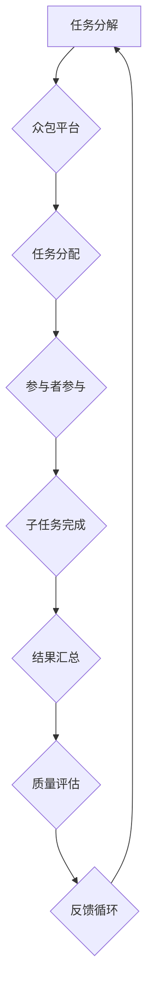

                 

### 引言

#### 1.1 书籍背景

科学研究是推动人类进步的重要动力，然而，随着科技的发展，科研数据的复杂性不断增加，单一研究团队难以在短时间内完成大规模的数据分析和复杂的科研任务。在这种背景下，众包模式作为一种创新的科研方法，逐渐引起了科研界和工业界的广泛关注。众包（Crowdsourcing）一词最早由Jeff Howe在2006年提出，指的是通过互联网平台，将复杂的任务分解成简单的子任务，然后广泛招募大众参与完成，以实现高效的任务执行和资源优化配置。

本书《科学研究的众包模式：利用集体智慧促进世界理解》旨在深入探讨众包模式在科学研究中的应用，揭示其如何通过集体智慧促进世界对复杂问题的理解。随着互联网技术的飞速发展，众包模式已经不再局限于简单的数据收集和分类，而是逐渐渗透到各个科学研究领域，如天文、生物、地球科学等，成为科研创新的重要工具。本书通过系统分析和实际案例研究，揭示了众包模式在科学研究中的潜力与挑战。

#### 1.2 众包模式定义

众包模式是一种利用集体智慧解决复杂问题的方法，其核心思想是将复杂的任务分解成许多简单的子任务，并通过互联网平台广泛招募大众参与完成。这些子任务通常不需要过多的专业知识和技能，只需要参与者具备一定的基本能力和时间投入即可。众包模式可以分为以下几类：

1. **开放性众包**：任何人都可以参与完成任务，典型的如维基百科的编辑和谷歌地图的标注。
2. **邀请性众包**：参与者需具备一定的资格或专业背景，如DARPA的竞赛项目。
3. **小范围众包**：在特定群体或社区内进行任务分配，如大学实验室的众包项目。

众包模式与传统科研模式有显著的区别。传统科研模式主要依赖科研团队内部的专业人员，任务分工明确，资源分配相对固定。而众包模式则强调广泛的参与和协作，资源利用更加灵活，且能够迅速聚集全球范围内的智慧和资源，从而在短时间内完成复杂任务。

### 1.3 众包模式与传统科研模式的对比

众包模式与传统科研模式在多个方面存在差异，这些差异直接影响了科研效率和成果质量。

#### 参与者范围

传统科研模式主要依赖于科研团队内部的专业人员，参与者的范围相对较小，通常局限在特定的实验室或机构内。而众包模式则通过互联网平台，将任务广泛发布给全球范围内的参与者，参与者可以是任何具备基本能力的人，不受地域和机构的限制。

#### 任务分工

传统科研模式中的任务分工通常较为明确，每个科研人员负责特定部分的工作。而在众包模式中，任务被分解成许多简单的子任务，这些子任务通常不需要过多的专业知识和技能，参与者可以根据自己的时间和能力选择完成任务的一部分。

#### 资源配置

传统科研模式中的资源配置较为固定，科研资金和设备通常由科研机构统一分配。而众包模式则通过灵活的资源配置，能够迅速聚集全球范围内的智慧和资源，实现资源的优化配置。

#### 时间效率

传统科研模式通常需要较长时间来完成复杂任务，因为科研人员的时间和精力有限。而众包模式则能够通过广泛的参与者，在短时间内完成复杂任务，显著提高科研效率。

#### 成果质量

传统科研模式往往依赖于科研团队的专业知识和经验，成果质量相对稳定。而众包模式则通过广泛的参与和协作，能够汇聚不同的观点和思路，可能产生意想不到的创新成果。

### 1.4 本书的结构与内容

本书分为七个章节，系统介绍了众包模式在科学研究中的应用和发展。

- **第1章 引言**：介绍了书籍的背景和众包模式的定义。
- **第2章 众包模式原理**：探讨了众包模式的基础和集体智慧的潜力。
- **第3章 众包模式的实施**：讲述了众包项目的设计和平台的选择。
- **第4章 众包模式的应用领域**：分析了天文科学和生物科学中的成功案例。
- **第5章 集体智慧在科学研究中的案例研究**：通过案例研究深入探讨集体智慧在科学研究中的应用。
- **第6章 众包模式的挑战与机遇**：讨论了众包模式面临的挑战和机遇。
- **第7章 未来展望**：展望了众包模式的发展趋势和未来应用前景。

通过这本书，读者将深入了解众包模式在科学研究中的潜力，掌握众包项目的实施方法，并理解集体智慧在科学研究中的重要作用。我们希望这本书能够为科研工作者提供新的视角和工具，促进科学研究的创新和发展。

#### 核心主题和关键词

本文的核心主题是探讨众包模式在科学研究中的应用及其对集体智慧的促进。通过众包模式，研究者能够迅速聚集全球范围内的智慧和资源，解决复杂科研任务。关键词包括：“众包模式”、“集体智慧”、“科学研究”、“互联网平台”、“开放性众包”、“邀请性众包”、“小范围众包”和“资源优化配置”。

这些关键词共同构成了本文的核心内容，揭示了众包模式如何通过互联网平台，利用集体智慧，推动科学研究的创新和发展。通过深入分析这些关键词，我们将进一步探讨众包模式的基础原理、实施方法、应用领域、案例研究和未来展望。

### 摘要

本书《科学研究的众包模式：利用集体智慧促进世界理解》旨在探讨众包模式在科学研究中的应用，揭示其如何通过集体智慧推动科学研究的创新和发展。众包模式，作为一种新兴的科研方法，通过互联网平台将复杂的科研任务分解成简单的子任务，广泛招募大众参与完成。这不仅提高了科研效率，还汇集了全球范围内的智慧和资源，促进了科学研究的进步。本书首先介绍了众包模式的定义和分类，然后深入探讨了其基础原理和集体智慧的潜力。接着，文章分析了众包模式在科学研究中的实施方法和应用领域，通过具体案例展示了众包模式在解决复杂科研任务中的实际效果。此外，本书还讨论了众包模式面临的挑战与机遇，并展望了其未来的发展趋势。通过这本书，读者将全面了解众包模式在科学研究中的潜力，掌握其实施方法，并理解集体智慧在科学研究中的重要作用。

#### 第1章 引言

##### 1.1 书籍背景

科学研究是推动人类文明进步的重要力量，随着技术的飞速发展，科研数据的复杂性不断增加。传统科研模式往往依赖单一的科研团队和有限的专业人员，难以在短时间内应对复杂的数据分析和科研任务。在这种背景下，众包模式作为一种创新的科研方法，逐渐受到科研界和工业界的广泛关注。众包（Crowdsourcing）一词最早由Jeff Howe在2006年提出，指的是通过互联网平台，将复杂的任务分解成许多简单的子任务，然后广泛招募大众参与完成，以实现高效的任务执行和资源优化配置。

众包模式的兴起有其深刻的背景和原因。首先，互联网的普及和移动设备的广泛使用，使得大众能够随时随地参与科研任务，不受地域和时间的限制。其次，大数据和人工智能技术的发展，为众包模式提供了强大的技术支持，使得大规模的数据处理和复杂的计算任务得以高效完成。最后，科研任务的复杂性和多样性，使得单一研究团队难以在短时间内完成，众包模式通过广泛的参与和协作，能够迅速聚集全球范围内的智慧和资源，解决复杂科研问题。

本书旨在深入探讨众包模式在科学研究中的应用，揭示其如何通过集体智慧促进科学研究的创新和发展。通过系统分析和实际案例研究，本书旨在为科研工作者提供新的视角和工具，帮助其更有效地利用众包模式推动科学研究的进步。

##### 1.2 众包模式定义

众包模式（Crowdsourcing）是一种通过互联网平台，将复杂的任务分解成许多简单的子任务，然后广泛招募大众参与完成的科研方法。这种模式的核心在于充分利用集体智慧，将个体的力量汇聚成强大的团队力量，从而在短时间内完成复杂科研任务。

众包模式可以分为几种不同的类型，根据参与者的范围和任务分配方式，主要有以下几种：

1. **开放性众包**：任何人都可以参与完成任务，无需具备特定的资格或背景。这种模式通常用于简单的数据收集和分类任务，如维基百科的编辑和谷歌地图的标注。开放性众包的优势在于能够快速聚集大量参与者，提高任务完成的效率。

2. **邀请性众包**：参与者需具备一定的资格或专业背景，通常通过邀请或申请的方式参与。这种模式适用于需要特定技能或知识的科研任务，如DARPA（美国国防高级研究计划局）的竞赛项目。邀请性众包能够确保参与者的质量和任务的完成质量。

3. **小范围众包**：在特定群体或社区内进行任务分配，参与者通常是具有共同兴趣或专业背景的人。这种模式适用于需要高度协作和专业知识的项目，如大学实验室的众包项目。小范围众包能够更好地协调参与者的时间和资源，提高任务的完成效率。

众包模式与传统科研模式有显著的区别。传统科研模式主要依赖于科研团队内部的专业人员，任务分工明确，资源分配相对固定。而众包模式则强调广泛的参与和协作，资源利用更加灵活，且能够迅速聚集全球范围内的智慧和资源，从而在短时间内完成复杂任务。

在科学研究领域，众包模式的应用越来越广泛。例如，在天文学中，天文学家可以利用众包平台收集和标注天文图像，提高天文数据的处理效率；在生物学中，科学家可以通过众包平台收集生物数据，加速基因组研究和疾病治疗的发展。此外，众包模式还在地球科学、物理学、化学等领域得到广泛应用，为解决复杂科研问题提供了新的思路和方法。

##### 1.3 众包模式与传统科研模式的对比

众包模式与传统科研模式在多个方面存在显著差异，这些差异直接影响了科研效率和成果质量。

1. **参与者范围**：

传统科研模式主要依赖于科研团队内部的专业人员，参与者的范围相对较小，通常局限在特定的实验室或机构内。这些科研人员经过长期的专业训练，具备深厚的学术背景和丰富的科研经验，但受限于时间和精力，难以在短时间内完成大规模的科研任务。

而众包模式则通过互联网平台，将任务广泛发布给全球范围内的参与者，参与者可以是任何具备基本能力的人，不受地域和机构的限制。这种广泛的参与者范围使得众包模式能够迅速聚集大量的智慧和资源，解决复杂科研问题。

2. **任务分工**：

传统科研模式中的任务分工通常较为明确，每个科研人员负责特定部分的工作。这种分工方式有助于提高科研效率，但同时也限制了任务的灵活性和创新能力。

而众包模式则将复杂的任务分解成许多简单的子任务，这些子任务通常不需要过多的专业知识和技能，参与者可以根据自己的时间和能力选择完成任务的一部分。这种分工方式不仅提高了任务的灵活性，还激发了参与者的创新思维，有助于产生更具有突破性的科研成果。

3. **资源配置**：

传统科研模式中的资源配置较为固定，科研资金和设备通常由科研机构统一分配。这种资源配置方式在一定程度上保证了科研资源的公平性，但同时也限制了科研团队的创新和灵活性。

而众包模式则通过灵活的资源配置，能够迅速聚集全球范围内的智慧和资源，实现资源的优化配置。参与者可以根据自己的能力和需求，选择参与特定的子任务，从而实现资源的最大化利用。此外，众包模式还能够利用互联网技术，实现科研设备的共享和远程协作，进一步提高资源配置的效率。

4. **时间效率**：

传统科研模式通常需要较长时间来完成复杂科研任务，因为科研人员的时间和精力有限。这种时间限制不仅影响了科研效率，还可能导致科研项目的延误和失败。

而众包模式则能够通过广泛的参与者，在短时间内完成复杂科研任务，显著提高科研效率。众包模式通过快速聚集全球范围内的智慧和资源，能够在短时间内完成原本需要长时间才能完成的科研任务，从而缩短科研周期，提高科研成果的产出效率。

5. **成果质量**：

传统科研模式往往依赖于科研团队的专业知识和经验，成果质量相对稳定。但这也限制了科研团队的创新和探索，难以产生具有突破性的科研成果。

而众包模式则通过广泛的参与和协作，能够汇聚不同的观点和思路，可能产生意想不到的创新成果。众包模式鼓励参与者自由发挥，提出不同的解决方案，从而激发创新的火花。此外，众包模式还能够通过竞争机制，激发参与者的积极性和创造力，提高科研成果的质量。

总之，众包模式与传统科研模式相比，具有显著的优越性。通过广泛的参与者范围、灵活的任务分工、优化的资源配置、高效的时间效率和创新的成果质量，众包模式为科学研究提供了新的思路和方法，推动了科学研究的创新和发展。

##### 1.4 本书的结构与内容

本书分为七个章节，系统介绍了众包模式在科学研究中的应用和发展。

- **第1章 引言**：介绍了书籍的背景和众包模式的定义。

- **第2章 众包模式原理**：探讨了众包模式的基础和集体智慧的潜力。

- **第3章 众包模式的实施**：讲述了众包项目的设计和平台的选择。

- **第4章 众包模式的应用领域**：分析了天文科学和生物科学中的成功案例。

- **第5章 集体智慧在科学研究中的案例研究**：通过案例研究深入探讨集体智慧在科学研究中的应用。

- **第6章 众包模式的挑战与机遇**：讨论了众包模式面临的挑战和机遇。

- **第7章 未来展望**：展望了众包模式的发展趋势和未来应用前景。

通过这本书，读者将深入了解众包模式在科学研究中的潜力，掌握众包项目的实施方法，并理解集体智慧在科学研究中的重要作用。我们希望这本书能够为科研工作者提供新的视角和工具，促进科学研究的创新和发展。

### 第2章 众包模式原理

##### 2.1 众包模式的基础

众包模式的基础在于其独特的运作机制，这种机制能够有效地将复杂任务分解并分配给大量的参与者。首先，任务的分解是众包模式的核心步骤。复杂任务通常通过自动化工具被拆分成多个子任务，每个子任务相对独立且易于完成。例如，在图像识别任务中，一个复杂的图像可以被分割成多个小块，每个小块的识别结果可以汇总成最终的图像识别结果。

接下来是众包平台的作用。众包平台不仅负责任务的发布和子任务的分配，还提供了一套完善的系统来确保任务的有效执行和结果的高质量。平台通常会配备自动化工具，如任务分配器、进度监控器和质量评估器，来提高整个众包过程的效率和可靠性。例如，GitHub、Topcoder等平台，可以通过复杂的算法，根据参与者的能力和历史贡献，为其分配最合适的子任务。

参与者的招募也是众包模式的重要组成部分。众包平台通过社交媒体、邮件列表、网站广告等方式，吸引全球范围内的参与者加入。参与者可以是任何人，只要他们具备完成任务所需的基本知识和时间。这种开放性使得众包模式能够迅速聚集大量的智慧资源。

众包模式的关键要素包括以下几个方面：

1. **任务分解**：将复杂任务拆分成多个简单的子任务，每个子任务独立且易于完成。
2. **众包平台**：提供任务发布、分配、进度监控和质量评估的自动化工具。
3. **参与者招募**：通过多种渠道吸引全球范围内的参与者。

##### 2.2 集体智慧的潜力

集体智慧（Collective Intelligence）是指一个群体中个体智慧的总和，通过协同合作和知识共享，能够产生比个体单独行动更高效和创新的解决方案。在众包模式中，集体智慧的潜力得到了充分的发挥。以下是集体智慧在科学研究中的几个关键方面：

1. **多样性**：众包模式通过招募来自不同背景和领域的参与者，形成了多样性的知识体系。这种多样性不仅带来了不同的视角和思路，还能够在问题解决过程中产生协同效应，激发创新的火花。

2. **协同效应**：集体智慧通过协同合作，实现了知识的共享和互补。每个参与者都能够在完成子任务的过程中，积累新的知识和经验，并将这些知识反馈到整个群体中，从而形成一种持续学习和创新的环境。

3. **规模效应**：众包模式通过大规模的参与者，能够在短时间内完成原本需要长时间完成的任务。这种规模效应不仅提高了科研效率，还降低了科研成本。

4. **去中心化**：集体智慧的去中心化特性使得众包模式能够适应复杂和动态的环境。每个参与者都可以根据自己的能力和时间选择参与任务，不需要依赖单一的权威机构或专家，从而提高了系统的灵活性和适应性。

在科学研究中，集体智慧的应用具有广泛的前景。例如，在生物科学中，通过众包模式可以快速收集和标注大量的生物数据，加速基因组研究和疾病治疗的发展；在天文学中，众包平台可以动员全球的天文爱好者共同参与天文图像的分析和解释，提高天文数据的处理效率。此外，在物理学、化学、地球科学等领域，集体智慧也展示了其强大的应用潜力。

##### 2.3 众包模式与传统科研模式的关系

众包模式与传统科研模式在目标和实现方式上有所不同，但二者之间并非相互排斥，而是可以相互补充和融合。传统科研模式通常依赖特定的科研团队和专家，通过系统的规划和严谨的实验步骤，逐步推进科学研究的进展。而众包模式则通过广泛的参与和协作，快速聚集全球的智慧和资源，实现高效的任务完成。

1. **优势互补**：传统科研模式的优势在于其严谨性和专业性，能够在高精度和高可靠性的科研任务中发挥作用。而众包模式则能够在短时间内完成大规模的数据分析和复杂的计算任务，具有高效性和灵活性的优势。通过将众包模式与传统科研模式相结合，可以充分发挥各自的优势，提高科研效率。

2. **资源整合**：众包模式能够迅速聚集大量的参与者，实现资源的整合和优化。而传统科研模式则依赖于特定的科研资源和设施，资源利用率相对较低。通过将众包模式引入传统科研流程，可以充分利用众包模式的优势，提高科研资源的利用率。

3. **知识共享**：众包模式强调知识的共享和互补，每个参与者都可以在完成任务的过程中积累新的知识和经验，并将这些知识反馈到整个群体中。这种知识共享机制不仅促进了科研的进展，还为传统科研模式提供了新的思路和方法。

总之，众包模式与传统科研模式之间的关系是一种互补和融合的关系。通过将二者的优势相结合，可以实现科研资源的最大化利用，提高科研效率和质量，推动科学研究的创新和发展。

### 2.4 众包模式的核心概念原理关系架构

为了更好地理解众包模式的核心概念原理及其之间的关系，我们可以通过一个Mermaid流程图来展示其运作机制。

#### 流程图解释

1. **任务分解（A）**：首先，复杂的科研任务被分解成多个简单的子任务，每个子任务相对独立且易于完成。

2. **众包平台（B）**：任务分解后，众包平台负责将任务发布和分配给参与者。平台通常配备自动化工具，如任务分配器、进度监控器和质量评估器。

3. **任务分配（C）**：众包平台根据参与者的能力和历史贡献，为其分配最合适的子任务。

4. **参与者参与（D）**：参与者通过众包平台接收并完成分配给自己的子任务。

5. **子任务完成（E）**：参与者完成子任务后，将结果提交给众包平台。

6. **结果汇总（F）**：众包平台将所有子任务的结果汇总，形成最终的科研成果。

7. **质量评估（G）**：对汇总结果进行质量评估，确保成果的准确性和可靠性。

8. **反馈循环（H）**：评估结果和反馈信息返回给任务分解环节，用于优化后续任务的分配和执行。

通过这个流程图，我们可以清晰地看到众包模式从任务分解、任务分配、参与者参与，到结果汇总、质量评估和反馈循环的完整运作机制。这种机制不仅提高了科研效率，还促进了集体智慧的发挥，为科学研究的创新提供了强有力的支持。

### 第3章 众包模式的实施

##### 3.1 设计众包项目

设计一个成功的众包项目是确保任务高效完成的关键。以下是一些关键步骤和注意事项：

1. **明确项目目标**：首先，需要明确众包项目的具体目标，包括任务的核心问题和期望的成果。例如，如果目标是分析大量的天文图像，项目目标应该具体到需要识别的天体类型或现象。

2. **分解任务**：将复杂的科研任务分解成多个简单的子任务。每个子任务应独立且易于完成，以适应不同参与者的能力和时间安排。例如，可以将天文图像识别任务分解成识别特定类型的恒星或行星。

3. **设定任务规则**：为每个子任务设定明确的规则，包括任务描述、输入数据、预期输出以及完成任务的步骤。规则应尽可能详细，以减少参与者的困惑和错误。

4. **选择适当的平台**：根据项目的需求选择合适的众包平台。例如，对于需要高精度和专业知识的任务，可以选择邀请性众包平台，如Topcoder或DARPA；对于广泛参与的任务，可以选择开放性众包平台，如GitHub或Clickworkers。

5. **招募参与者**：通过多种渠道，如社交媒体、电子邮件、网站广告等，招募合适的参与者。确保参与者具备完成任务所需的基本知识和技能。

6. **任务测试**：在正式发布任务前，通过内部测试确保任务的可行性和清晰度。可以通过小型测试集，评估任务的完成质量和参与者的反馈。

##### 3.2 众包平台的选择与构建

众包平台的选择与构建对于众包项目的成功至关重要。以下是几种常见的众包平台类型以及选择和构建平台的考虑因素：

1. **开源平台**：开源平台如GitHub、Topcoder和Clickworkers，提供了广泛的工具和资源，支持多种语言和技术栈。选择开源平台的优势在于成本较低，灵活性高，且社区支持强大。但劣势在于定制化程度较低，可能需要更多的技术维护和开发。

2. **自建平台**：自建平台可以根据项目的特定需求进行定制，提供更灵活的功能和用户体验。优势在于完全掌控平台，但劣势在于需要投入更多的时间和资源进行开发和维护。

3. **商业平台**：商业平台如Amazon Mechanical Turk（MTurk）和CrowdFlower，提供了成熟的众包解决方案，包括任务发布、参与者管理和结果评估等。选择商业平台的优势在于操作简便，支持强大的分析工具，但劣势在于成本较高，且可能存在数据隐私和安全性问题。

##### 3.3 众包项目的实施流程

一个典型的众包项目实施流程包括以下几个步骤：

1. **项目启动**：明确项目目标和范围，制定详细的项目计划和时间表。

2. **任务分解**：将复杂任务分解成多个子任务，并设计详细的任务规则和流程。

3. **平台选择与搭建**：根据项目需求选择合适的众包平台，如果需要，进行平台搭建。

4. **参与者招募**：通过多种渠道招募参与者，确保参与者的质量和数量。

5. **任务发布**：在众包平台上发布任务，并提供清晰的任务说明和规则。

6. **任务执行**：参与者开始执行任务，平台提供任务管理和进度监控工具。

7. **结果收集**：参与者提交任务结果，平台进行初步的质量评估。

8. **结果汇总**：将所有子任务的结果汇总，形成最终的科研成果。

9. **质量评估**：对最终结果进行详细的质量评估，确保结果的准确性和可靠性。

10. **反馈与改进**：将评估结果和反馈信息返回给参与者，根据反馈进行任务优化和项目改进。

通过这个实施流程，众包项目能够系统化和高效地完成，充分利用集体智慧和资源，推动科学研究的创新和发展。

### 第4章 众包模式的应用领域

##### 4.1 天文科学研究

在天文科学领域，众包模式已经成为解决复杂天文数据分析和观测任务的重要工具。通过众包，科学家们能够动员全球的天文学爱好者共同参与天文图像的分析和解释，从而大大提高了数据处理和科学发现的效率。

**案例一：SkyMapper天文图像识别项目**

SkyMapper天文图像识别项目是一个典型的天文众包项目。该项目利用SkyMapper望远镜拍摄的数百万张天文图像，通过众包平台，邀请全球的天文学爱好者参与图像分类和标注。每个参与者被分配到一些图像，要求识别其中的恒星、行星、星系等天体。这些图像数据随后被汇总，形成高质量的天文数据库，用于进一步的科学研究。

**应用流程：**

1. **任务发布**：SkyMapper团队将需要识别的天文图像上传到众包平台，并设定详细的任务规则，包括图像的来源、需要识别的天体类型等。

2. **参与者招募**：通过社交媒体、邮件列表和网站广告等渠道，SkyMapper项目吸引了全球的天文爱好者和科研人员参与。

3. **任务执行**：参与者登录众包平台，下载图像并开始标注。平台提供了详细的标注指南和示例，帮助参与者了解任务的具体要求。

4. **结果收集**：参与者完成图像标注后，将结果提交到众包平台。平台对提交的结果进行初步的质量评估，筛选出高质量的标注数据。

5. **结果汇总**：所有参与者的标注结果被汇总，形成高质量的天文图像数据库。这些数据随后被用于科学研究和数据分析。

**成果与影响：**

SkyMapper项目的成功展示了众包模式在天文科学中的巨大潜力。通过众包，项目团队在短时间内收集了大量的标注数据，这些数据不仅丰富了天文数据库，还为后续的研究提供了宝贵的资源。此外，该项目还激发了公众对天文学的兴趣，提高了天文科学的普及度。

**案例二：Zooniverse项目**

Zooniverse是一个知名的众包天文项目，通过众包平台，吸引了数十万名志愿者参与天文图像的分析和解释。Zooniverse项目涵盖了多个领域，如行星探测、星系分类和宇宙演化等，每个项目都有详细的任务描述和指导。

**应用流程：**

1. **任务发布**：Zooniverse团队将不同的天文任务发布到平台上，包括图像分类、数据标注和问题调查等。

2. **参与者招募**：通过网站、社交媒体和科学传播活动，Zooniverse吸引了大量的志愿者参与。

3. **任务执行**：志愿者在平台上下载任务，开始分析和标注。平台提供了详细的指南和工具，帮助志愿者完成任务。

4. **结果收集**：志愿者完成任务后，将结果提交到平台。平台对提交的数据进行质量评估和验证。

5. **结果汇总**：所有参与者的标注和数据分析结果被汇总，形成科学报告和研究论文。

**成果与影响：**

Zooniverse项目在多个领域取得了显著的成果。例如，通过志愿者的努力，项目团队发现了多个新的行星系统，揭示了宇宙的多样性和复杂性。此外，Zooniverse还推动了公众参与科学研究的理念，促进了科学教育和科普工作的发展。

综上所述，众包模式在天文科学研究中的应用，不仅提高了科研效率，还促进了科学发现的多样性和创新性。通过动员全球的智慧和资源，众包模式为天文科学的发展注入了新的动力。

##### 4.2 生物科学研究

在生物科学领域，众包模式同样展示出了巨大的潜力，通过众包，科学家们能够动员全球的科研人员和非专业爱好者共同参与数据收集、分析和解释，从而加速生物科学研究的进展。

**案例一：Foldit游戏项目**

Foldit是一个基于众包的蛋白质折叠游戏，玩家通过解决虚拟蛋白质折叠问题，为实际蛋白质结构解析提供了宝贵的线索。Foldit项目通过吸引大量的游戏玩家参与，成功破解了几个复杂的蛋白质折叠问题，其中包括流感病毒的棘突蛋白和艾滋病病毒核心蛋白。

**应用流程：**

1. **任务发布**：科学家团队将需要解决的蛋白质折叠问题转化为游戏任务，发布到Foldit平台上。

2. **参与者招募**：通过社交媒体、科学传播活动和游戏平台广告，Foldit项目吸引了全球的玩家参与。

3. **任务执行**：玩家在平台上下载任务，通过试错和协作，尝试找到蛋白质的最优折叠结构。

4. **结果收集**：玩家提交自己的折叠结果，平台对结果进行质量评估和排名。

5. **结果汇总**：优秀的折叠结构被汇总，提供给科学家团队进行进一步分析和实验验证。

**成果与影响：**

Foldit项目的成功展示了众包模式在生物科学中的创新应用。通过动员全球的智慧和资源，项目团队在短时间内解决了多个复杂的蛋白质折叠问题，为实际蛋白质结构解析提供了重要的线索。Foldit不仅促进了科学研究的进展，还激发了公众对科学的兴趣和参与热情。

**案例二：Galaxy Zoo项目**

Galaxy Zoo项目是另一个成功的生物众包项目，通过众包平台，吸引了大量的志愿者参与星系分类工作。该项目由天文学家克里斯·林德纳发起，旨在通过志愿者的努力，提高对大量天文图像的分析和分类效率。

**应用流程：**

1. **任务发布**：Galaxy Zoo团队将需要分类的星系图像上传到众包平台，并设定详细的分类规则。

2. **参与者招募**：通过网站、社交媒体和科学传播活动，Galaxy Zoo项目吸引了全球的志愿者参与。

3. **任务执行**：志愿者在平台上下载图像，并根据规则进行分类。

4. **结果收集**：志愿者完成分类后，将结果提交到平台。平台对提交的数据进行质量评估和验证。

5. **结果汇总**：所有志愿者的分类结果被汇总，用于科学研究和数据分析。

**成果与影响：**

Galaxy Zoo项目通过众包模式，大大提高了星系分类的效率，为天文科学研究提供了宝贵的数据资源。此外，项目还推动了公众参与科学研究的理念，促进了科学教育和科普工作的发展。通过动员全球的智慧和资源，Galaxy Zoo项目不仅提高了科研效率，还增强了公众对科学的理解和兴趣。

综上所述，众包模式在生物科学研究中的应用，为科学家们提供了新的工具和方法，通过动员全球的智慧和资源，加速了生物科学研究的进展，推动了科学发现的多样性和创新性。

##### 4.3 地球科学领域

在地球科学领域，众包模式同样发挥了重要作用，通过众包，科学家们能够动员全球的科研人员和非专业爱好者共同参与数据收集、分析和解释，从而推动地球科学研究的发展。

**案例一：Tomnod平台**

Tomnod是一个在线众包平台，专门用于地球观测数据的分析和解释。该平台由DigitalGlobe公司开发，吸引了大量的志愿者参与地球观测图像的分析。Tomnod平台广泛应用于多个地球科学项目，如环境监测、灾害响应和资源管理。

**应用流程：**

1. **任务发布**：科学家团队将需要分析的地观察图像上传到Tomnod平台，并设定详细的任务规则，例如图像的来源、需要识别的目标等。

2. **参与者招募**：通过社交媒体、科学传播活动和网站广告，Tomnod项目吸引了全球的志愿者参与。

3. **任务执行**：志愿者在平台上下载图像，并开始进行标注和分析。平台提供了详细的指南和工具，帮助志愿者完成任务。

4. **结果收集**：志愿者完成标注和分析后，将结果提交到平台。平台对提交的数据进行质量评估和验证。

5. **结果汇总**：所有志愿者的标注和分析结果被汇总，形成科学报告和研究论文。

**成果与影响：**

Tomnod平台通过众包模式，大大提高了地球观测数据的分析效率，为多个地球科学项目提供了宝贵的数据资源。例如，在2015年尼泊尔地震的灾害响应中，Tomnod平台吸引了数万名志愿者参与，快速完成了地震影响的图像分析，为救援行动提供了重要支持。此外，Tomnod平台还推动了公众参与科学研究的理念，促进了科学教育和科普工作的发展。

**案例二：Global Forest Watch项目**

Global Forest Watch（GFW）是一个基于众包的森林监测平台，由世界自然基金会（WWF）和美国国家航空航天局（NASA）合作开发。GFW项目通过众包平台，动员全球的志愿者参与森林覆盖变化和森林火灾监测。

**应用流程：**

1. **任务发布**：GFW团队将需要监测的森林覆盖图像上传到众包平台，并设定详细的任务规则，例如监测区域和时间范围。

2. **参与者招募**：通过社交媒体、科学传播活动和网站广告，GFW项目吸引了全球的志愿者参与。

3. **任务执行**：志愿者在平台上下载图像，并根据规则进行标注和分析。平台提供了详细的指南和工具，帮助志愿者完成任务。

4. **结果收集**：志愿者完成标注和分析后，将结果提交到平台。平台对提交的数据进行质量评估和验证。

5. **结果汇总**：所有志愿者的标注和分析结果被汇总，形成森林监测报告和研究论文。

**成果与影响：**

GFW项目通过众包模式，提高了森林覆盖变化和森林火灾监测的效率，为全球森林资源的保护和管理提供了重要的数据支持。例如，在亚马逊雨林火灾期间，GFW平台吸引了大量的志愿者参与，实时监测火情，为救援行动提供了宝贵的信息。此外，GFW平台还推动了公众参与环境保护和可持续发展的理念，提高了公众对地球科学问题的认识和关注。

综上所述，众包模式在地球科学领域的应用，不仅提高了科研效率，还促进了科学发现的多样性和创新性。通过动员全球的智慧和资源，众包模式为地球科学研究提供了新的工具和方法，推动了科学研究的进展。

### 第5章 集体智慧在科学研究中的案例研究

##### 5.1 折叠蛋白质研究

折叠蛋白质研究是一个复杂的科学领域，涉及到蛋白质的折叠路径、结构和功能等多个方面。传统的蛋白质折叠研究主要依赖于高性能计算和实验方法，但由于计算复杂度和实验资源的限制，许多问题仍然难以解决。Foldit游戏项目通过众包模式，动员了全球的智慧和资源，为蛋白质折叠研究带来了新的突破。

**项目背景：**

Foldit项目始于2008年，由华盛顿大学计算机科学家科林·富兰克林（Craign Frankln）领导。项目初衷是设计一个基于游戏的蛋白质折叠平台，通过玩家的试错和协作，找到蛋白质的最优折叠结构。Foldit的目标是解决一些传统方法难以破解的蛋白质折叠问题，如流感病毒的棘突蛋白和艾滋病病毒核心蛋白。

**集体智慧的应用：**

Foldit项目通过众包模式，将复杂的蛋白质折叠问题分解成多个子任务，并发布到平台上。玩家在游戏中通过试错和协作，尝试找到蛋白质的最优折叠结构。平台提供了详细的指南和工具，帮助玩家理解任务要求，并通过评分和排名机制激励玩家的参与热情。

**研究成果与影响：**

Foldit项目在短时间内取得了显著的成果。通过玩家的努力，项目团队成功破解了多个复杂的蛋白质折叠问题，为实际蛋白质结构解析提供了重要的线索。例如，在2011年，Foldit玩家成功预测了流感病毒棘突蛋白的三维结构，这一成果发表在顶级学术期刊《自然》上，引起了全球科学界的广泛关注。

Foldit项目的成功不仅展示了集体智慧在科学研究中的巨大潜力，还推动了科学研究的创新和发展。通过众包模式，Foldit项目不仅提高了科研效率，还激发了公众对科学的兴趣和参与热情，促进了科学普及和科学教育的发展。

##### 5.2 地球科学数据分析

地球科学数据分析涉及到大量的观测数据和复杂的分析过程，传统的科研方法往往难以高效处理这些数据。Global Forest Watch（GFW）项目通过众包模式，动员全球的志愿者参与地球科学数据分析，取得了显著的成果。

**项目背景：**

GFW项目由世界自然基金会（WWF）和美国国家航空航天局（NASA）合作开发，旨在通过众包平台，实时监测全球森林覆盖变化和森林火灾。GFW项目的目标是提高森林监测的效率和准确性，为环境保护和可持续发展提供数据支持。

**集体智慧的应用：**

GFW项目通过众包平台，将森林覆盖图像和火灾监测数据发布给全球的志愿者。志愿者在平台上下载数据，并根据规则进行标注和分析。平台提供了详细的指南和工具，帮助志愿者理解任务要求，并通过评分和排名机制激励志愿者的参与热情。

**研究成果与影响：**

GFW项目在短时间内积累了大量的森林监测数据，通过志愿者的努力，项目团队成功完成了大量的数据分析任务。这些数据为全球森林资源的保护和管理提供了重要的信息支持。例如，在2019年亚马逊雨林火灾期间，GFW平台吸引了大量的志愿者参与，实时监测火情，为救援行动提供了宝贵的信息。

GFW项目的成功展示了集体智慧在地球科学数据分析中的巨大潜力。通过众包模式，项目团队不仅提高了数据处理的效率，还推动了科学研究的创新和发展。此外，GFW项目还促进了公众参与环境保护和可持续发展的理念，提高了公众对地球科学问题的认识和关注。

### 第6章 众包模式的挑战与机遇

尽管众包模式在科学研究中的应用取得了显著成果，但这一模式也面临着诸多挑战和机遇。以下是对这些挑战的详细讨论，以及可能的解决策略和未来展望。

##### 6.1 挑战

**1. 数据隐私和安全问题**

在众包模式中，参与者来自全球各地，数据的流动和存储可能涉及敏感信息。这带来了数据隐私和安全问题。例如，生物科学研究中的基因组数据、环境监测中的空气质量数据等，都涉及到个人隐私和公共安全。为了解决这一问题，可以采取以下策略：

- **数据加密和匿名化**：对参与者的数据进行加密处理，确保数据在传输和存储过程中的安全性。此外，通过匿名化处理，去除个人身份信息，降低隐私泄露的风险。
- **严格的隐私政策**：制定严格的隐私保护政策，明确参与者的权利和义务，确保数据使用的合法性和透明度。
- **安全审计和监控**：定期进行安全审计和监控，及时发现和解决潜在的安全问题。

**2. 项目质量控制**

众包项目依赖于大量的参与者，而参与者的能力和质量参差不齐，可能导致项目质量难以控制。为了确保项目质量，可以采取以下策略：

- **严格的参与者招募和筛选**：在项目开始前，对参与者进行严格的招募和筛选，确保参与者具备完成任务所需的基本能力和责任心。
- **详细的任务规则和指导**：为每个任务制定详细的规则和指导，确保参与者了解任务要求，减少误解和错误。
- **质量评估机制**：建立完善的质量评估机制，对参与者的任务完成情况进行评估和反馈，及时发现和纠正质量问题。

**3. 参与者的动机问题**

在众包项目中，参与者往往出于不同的动机参与，如兴趣、荣誉、奖励等。这些动机可能不一致，影响项目的效率和成果。为了激发参与者的积极性，可以采取以下策略：

- **激励机制**：通过奖励和荣誉激励参与者的积极性，如提供奖金、证书和公开表彰等。
- **任务设计**：设计有趣、有挑战性的任务，提高参与者的参与兴趣。
- **社区建设**：建立参与者社区，促进参与者之间的交流和互动，增强参与者的归属感和成就感。

**4. 资源和时间分配**

众包项目通常涉及大量的参与者，如何在有限的时间和资源下，合理分配任务和资源，是项目成功的关键。为了优化资源分配，可以采取以下策略：

- **任务优先级排序**：根据任务的重要性和紧急程度，对任务进行优先级排序，确保关键任务优先完成。
- **动态资源调配**：通过实时监控参与者的进度和能力，动态调整任务分配和资源分配，提高整体效率。
- **技术支持**：提供必要的技术支持，如自动化工具、任务管理平台等，帮助参与者高效完成任务。

##### 6.2 机遇

**1. 集体智慧的潜力**

众包模式通过动员大量的参与者，汇聚集体智慧，具有巨大的创新潜力。随着互联网和人工智能技术的发展，集体智慧的应用前景将更加广阔。例如，在科学研究、社会问题解决、环境保护等领域，集体智慧可以提供新的解决方案，推动科学和社会的进步。

**2. 科研资源的优化配置**

众包模式能够迅速聚集全球的智慧和资源，实现科研资源的优化配置。通过众包，科研机构可以充分利用社会资源，提高科研效率，降低科研成本。此外，众包模式还可以促进科研设施的共享和远程协作，提高科研设施的利用率。

**3. 公众参与科学研究的推动**

众包模式不仅促进了科学研究的发展，还推动了公众参与科学研究的理念。通过众包平台，公众可以参与到科学研究中，提高科学素养和科学兴趣。这有助于构建全民科学文化，促进科学普及和科学教育的发展。

**4. 未来展望**

随着技术的不断发展，众包模式在科学研究中的应用将更加深入和广泛。未来，众包模式可能会向以下方向发展：

- **智能化**：通过人工智能技术，实现众包任务的自动化分配和管理，提高众包模式的效率和精度。
- **多元化**：众包模式将应用于更多领域，如医学、心理学、社会科学等，为解决复杂的社会问题提供新的思路和方法。
- **全球化**：随着互联网的普及，众包模式将更加全球化，动员全球的智慧和资源，实现科研和创新的国际合作。

总之，众包模式在科学研究中的挑战和机遇并存。通过有效应对挑战，充分发挥机遇，众包模式将为科学研究带来新的动力和活力，推动科学技术的创新和发展。

### 第7章 未来展望

#### 7.1 众包模式的发展趋势

随着科技的不断进步，众包模式在科学研究中的应用前景将愈发广阔。首先，人工智能技术的快速发展将为众包模式提供强大的支持。通过机器学习和深度学习算法，众包平台能够更准确地识别和分配任务，提高任务执行效率。例如，自动化任务分配系统可以根据参与者的历史数据和任务偏好，为其推荐最适合的任务，从而优化资源利用。

其次，区块链技术的应用将进一步提升众包模式的透明度和安全性。区块链技术能够确保数据在传输和存储过程中的完整性和不可篡改性，从而增强参与者的信任感。例如，通过智能合约，众包平台可以自动执行任务奖励的发放，减少人为干预和欺诈行为。

此外，随着5G网络的普及，众包模式将实现更高的实时性和响应速度。通过5G网络，众包平台可以更快地传输大量数据，实现全球范围内的实时协作。这将使科学家能够更迅速地收集和利用来自全球的众包数据，推动科研项目的进展。

#### 7.2 众包模式在未来的应用前景

在未来，众包模式在科学研究中的应用将更加深入和多元化。以下是一些潜在的领域和应用前景：

1. **医学研究**：通过众包模式，科学家可以动员全球的医生和研究人员参与医学数据的收集、分析和解释，加速新药研发和疾病治疗的研究。例如，众包平台可以收集来自不同地区、不同种族的医学数据，提高研究的代表性，从而更准确地预测药物的效果和副作用。

2. **社会问题解决**：众包模式可以用于解决复杂的社会问题，如气候变化、环境污染、公共安全等。通过众包平台，科学家和普通公众可以共同参与数据收集、分析和解决方案的提出，推动社会问题的解决。

3. **科学教育**：众包模式可以成为科学教育的新工具，通过众包平台，学生可以参与到真实的科研项目中，提高科学素养和创新能力。例如，学生可以通过众包平台参与星系分类、生物数据标注等任务，亲身体验科学研究的全过程。

4. **跨学科合作**：众包模式可以促进不同学科之间的合作，通过跨学科的众包项目，科学家可以共同解决复杂的问题。例如，生物学和物理学可以通过众包平台合作研究蛋白质折叠问题，从而推动生物学和物理学的发展。

5. **科技创新**：众包模式可以激发科技创新的潜力，通过众包平台，科学家和企业家可以共同探索新的技术和产品。例如，众包平台可以吸引全球的工程师和设计师参与产品原型设计和开发，从而加速创新进程。

#### 7.3 建议与展望

为了充分发挥众包模式在科学研究中的潜力，以下是一些建议和展望：

1. **加强平台建设**：科研机构和政府应加大对众包平台建设的支持，提供必要的技术和资金支持，确保平台的高效运行和安全性。

2. **提高参与者质量**：通过严格的招募和筛选机制，确保参与者的质量和专业性，从而提高众包项目的执行质量和成果质量。

3. **激励机制**：制定有效的激励机制，鼓励参与者积极参与众包项目，提高项目的完成度和效率。例如，可以提供奖金、荣誉证书和公开表彰等。

4. **加强数据分析**：在众包项目完成后，加强对众包数据的分析和解释，提取有价值的信息，为后续研究提供支持。

5. **跨学科合作**：鼓励不同学科之间的合作，通过跨学科的众包项目，推动科学技术的创新和发展。

6. **公众参与**：加强公众参与科学研究的意识和能力，通过科普活动和教育项目，提高公众的科学素养和参与热情。

总之，众包模式在科学研究中的未来发展充满潜力。通过充分利用集体智慧和资源，众包模式将为科学研究带来新的动力和活力，推动科学技术的创新和发展。

### 附录

#### A.1 众包平台资源

以下是几个知名的众包平台资源，这些平台提供了丰富的众包项目和资源，供科学家和研究人员参考：

1. **GitHub**：GitHub是全球最大的代码托管平台，提供了大量的开源项目和众包任务。科学家可以在GitHub上找到相关的开源项目，参与任务协作，共享研究成果。
   
2. **Topcoder**：Topcoder是一个在线编程竞赛平台，提供了各种编程挑战和众包项目。科学家和程序员可以通过Topcoder参与复杂算法和数据分析的任务。

3. **Clickworkers**：Clickworkers是一个国际性的众包平台，专注于科学和工业领域的任务。科学家可以在Clickworkers上发布任务，招募全球的参与者完成。

4. **Innovative Wetware**：Innovative Wetware是一个专注于生物学和化学领域的众包平台，提供了各种生物实验和数据分析任务。

5. **Zooniverse**：Zooniverse是一个知名的众包平台，专注于天文学、生物学和物理学等领域。志愿者可以在Zooniverse上参与各种科学项目的协作。

#### A.2 众包项目案例集锦

以下是几个成功的众包项目案例，这些案例展示了众包模式在科学研究中的实际应用和成果：

1. **SkyMapper天文图像识别项目**：该项目通过众包平台，动员全球的天文学爱好者参与天文图像的分类和标注，形成了高质量的天文图像数据库。

2. **Foldit蛋白质折叠项目**：Foldit项目通过游戏化的方式，吸引了全球的玩家参与蛋白质折叠的预测和解析，取得了多项突破性成果。

3. **Galaxy Zoo星系分类项目**：Galaxy Zoo项目通过众包平台，吸引了数十万名志愿者参与星系分类，为天文科学研究提供了宝贵的数据资源。

4. **Tomnod地球观测项目**：Tomnod项目通过众包平台，动员全球的志愿者参与地球观测图像的分析，为环境监测和灾害响应提供了重要的信息支持。

5. **Global Forest Watch森林监测项目**：GFW项目通过众包平台，动员全球的志愿者参与森林监测，实时监测全球森林覆盖变化和火灾情况。

通过这些案例，我们可以看到众包模式在科学研究中的巨大潜力，以及其在动员全球智慧和资源、促进科学研究进展方面的实际效果。

### 最佳实践 tips、小结、注意事项、拓展阅读

#### 最佳实践 tips

1. **明确项目目标**：在设计众包项目时，务必明确项目的具体目标和预期成果，确保任务描述清晰、具体，便于参与者理解和执行。
2. **合理分解任务**：将复杂的科研任务分解成多个简单的子任务，确保每个子任务独立且易于完成，提高任务的执行效率。
3. **选择合适的平台**：根据项目需求选择合适的众包平台，考虑平台的用户基础、功能和技术支持等因素。
4. **优化激励机制**：通过合理的激励机制，如奖金、荣誉和公开表彰等，提高参与者的积极性和参与度。
5. **加强质量控制**：建立完善的质量评估机制，对参与者的任务完成情况进行评估，确保项目质量。

#### 小结

众包模式通过动员全球的智慧和资源，为科学研究带来了新的动力和机遇。通过合理的任务分解、平台选择和激励机制，众包模式能够显著提高科研效率，推动科学研究的创新和发展。

#### 注意事项

1. **数据隐私和安全**：在众包项目中，确保数据的隐私和安全至关重要，采取数据加密和匿名化措施，保护参与者的隐私。
2. **任务优先级**：在任务分配和执行过程中，合理安排任务优先级，确保关键任务优先完成。
3. **参与者招募**：选择合适的参与者，确保其具备完成任务所需的基本能力和责任心。

#### 拓展阅读

1. **《科学研究的众包模式：利用集体智慧促进世界理解》**：详细探讨众包模式在科学研究中的应用和发展。
2. **《众包：集体智慧的力量》**：介绍了众包模式的原理和应用案例，对集体智慧进行了深入分析。
3. **《众包与大数据：集体智慧在实践中的应用》**：探讨了众包模式在大数据环境下的应用，展示了大数据与众包的协同效应。

通过这些拓展阅读，读者可以更深入地了解众包模式在科学研究中的应用，掌握其原理和实践方法，为科学研究提供新的思路和工具。

