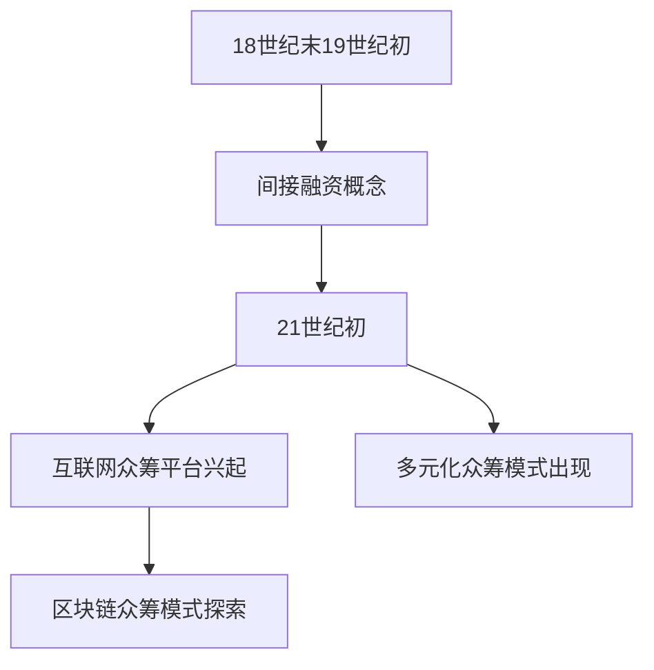
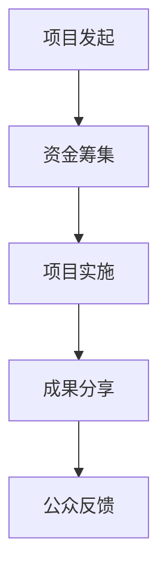
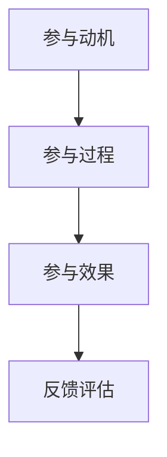
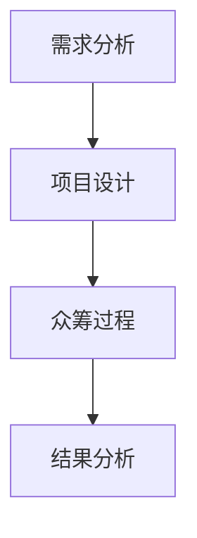
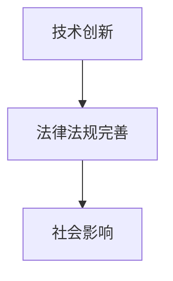

                 

# 《科学研究的众筹模式：公众参与世界理解的新方式》

> 关键词：众筹模式、公众参与、科学研究、世界理解、新方式

> 摘要：本文将深入探讨科学研究的众筹模式，分析其起源、发展、特点与优势，探讨公众参与对科学研究的重要意义，并通过具体案例研究，展示众筹模式在科学研究中的应用效果与未来趋势。文章旨在为读者提供一个全面、系统的关于科学研究众筹模式的理解和应用指南。

## 第一部分：引言

### 1.1 书籍背景介绍

科学研究的众筹模式是一种新兴的科研资金筹集方式，它通过互联网平台，将科研项目的资金需求公之于众，吸引公众的参与和支持。这种模式的出现，不仅为科学研究提供了新的资金来源，更重要的是，它为公众参与科学研究提供了一个全新的途径，使得普通民众能够直接参与到科学探索的过程中，从而加深对科学世界的理解。

科学研究众筹模式的兴起，得益于互联网技术的迅猛发展，特别是社交媒体和网络众筹平台的普及。随着越来越多的人关注科学和技术的发展，他们渴望能够参与到科学研究中来，众筹模式恰好满足了这一需求。此外，科学研究的众筹模式也在一定程度上解决了科研资金短缺的问题，为科学研究提供了更多的可能性和发展空间。

### 1.2 公众参与的重要性

公众参与科学研究的重要性不容忽视。首先，公众的参与能够为科学研究带来新的视角和思路。科学家在探索未知领域时，可能会受到自身经验和视野的限制，而公众的参与能够提供不同的视角，有助于科学家发现新的研究方向。其次，公众的参与能够提高科学研究的透明度和公信力。通过众筹模式，科研项目的进展和成果可以及时公开，公众可以实时了解科研进展，这有助于提高科研的透明度和公信力。最后，公众的参与能够促进科学普及和科学文化的传播。公众通过参与科学研究，能够更好地理解科学知识，提高科学素养，从而推动科学文化的传播。

### 1.3 世界理解的新方式

科学研究的众筹模式为公众参与科学研究提供了新的方式，使得公众能够更加深入地理解世界。通过众筹模式，公众可以直接参与到科学研究中，从项目的筹备、实施到成果的分享，全过程都处于公众的监督和参与之下。这种全新的参与方式，不仅使公众能够更加直观地了解科学研究的过程，还能够通过实践加深对科学知识的理解。

此外，众筹模式也为公众提供了一个交流和互动的平台。在众筹过程中，公众可以与科学家和其他参与者进行交流，分享自己的想法和观点，这不仅有助于提高公众的科学素养，还能够激发公众对科学的兴趣和热情。通过这种方式，公众能够以更加平等和开放的心态，参与到科学研究中来，从而实现世界理解的新方式。

## 第二部分：科学研究的众筹模式基础

### 2.1 众筹模式的定义与分类

#### 核心概念与联系

众筹模式（Crowdfunding）是一种通过互联网平台，向公众募集资金以支持项目或创意的方式。它通常包括以下四个核心要素：项目发起者、支持者、众筹平台和回报机制。


#### 核心算法原理讲解

众筹模式中，项目发起者需要设计一个吸引人的项目提案，包括项目目标、资金需求、回报计划等，并通过众筹平台发布。支持者通过浏览项目信息，选择支持感兴趣的项目。众筹平台通常使用以下算法来决定项目的成功与否：

- **资金门槛算法**：项目必须达到设定的最低资金门槛才能成功。
- **投票算法**：部分众筹平台可能采用投票机制，支持者投票决定项目是否成功。
- **风险评估算法**：平台根据项目的历史数据、发起者的信誉等因素，对项目进行风险评估。

#### 数学模型和数学公式

众筹模式中，资金需求与回报之间的关系可以通过以下数学模型进行描述：

\[ \text{总资金} = \text{资金需求} \times \text{成功概率} \]

其中，成功概率可以根据历史数据和风险模型进行预测。

#### 项目实战

以Kickstarter为例，项目发起者需设定一个资金目标和时间限制。如果项目在规定时间内达到或超过资金目标，支持者将获得回报；否则，资金将退还给支持者。以下是一个具体的伪代码实现：

```python
if (资金需求 >= 资金门槛) and (时间限制 >= 当前时间):
    成功 = True
    提供回报()
else:
    成功 = False
    退还资金()
```

### 2.2 众筹模式的历史与发展

#### 核心概念与联系

众筹模式的历史可以追溯到18世纪末19世纪初的“间接融资”概念，但随着互联网技术的发展，众筹模式在21世纪初迅速崛起。以下是一个历史发展的Mermaid流程图：



#### 核心算法原理讲解

众筹模式的历史发展也伴随着算法的进步。早期，众筹主要依赖于项目发起者的信誉和资金需求；随着大数据和人工智能技术的发展，众筹平台开始采用更先进的算法来评估项目的风险和成功概率。

#### 数学模型和数学公式

历史数据可以用来预测众筹项目的成功率。以下是一个简单的数学模型：

\[ \text{成功率} = \frac{\text{成功项目数}}{\text{总项目数}} \]

#### 项目实战

以GoFundMe为例，该平台通过机器学习算法分析项目的历史数据，预测项目的成功率，从而为支持者提供风险提示。以下是一个简单的伪代码实现：

```python
import machine_learning_model

项目数据 = 获取项目历史数据()
成功率 = machine_learning_model.predict_success_rate(项目数据)
if 成功率 > 风险阈值:
    显示风险提示()
else:
    提供支持()
```

### 2.3 众筹模式的特点与优势

#### 核心概念与联系

众筹模式具有以下特点与优势：

- **参与性**：支持者可以直接参与项目的资金筹集，甚至参与到项目的实施和改进过程中。
- **可持续发展**：通过众筹模式，项目可以获得持续的资金支持，有助于项目的长期发展。
- **风险分散**：多个支持者共同承担项目的风险，降低了单一支持者的风险。

#### 核心算法原理讲解

众筹模式的成功与否可以通过以下算法进行评估：

- **风险评估算法**：对项目的风险进行量化分析，包括市场风险、技术风险等。
- **成功概率算法**：根据历史数据和项目特性，预测项目的成功率。

#### 数学模型和数学公式

众筹模式的优势可以用以下数学模型进行量化：

\[ \text{总收益} = \text{总资金} \times \text{成功概率} \]

#### 项目实战

以Indiegogo为例，该平台通过数据分析评估项目的成功率，为支持者提供投资建议。以下是一个简单的伪代码实现：

```python
import data_analysis

项目数据 = 获取项目历史数据()
成功率 = data_analysis.evaluate_success_rate(项目数据)
if 成功率 > 投资阈值:
    提供投资建议()
else:
    提醒风险()
```

### 2.4 众筹模式面临的挑战

#### 核心概念与联系

尽管众筹模式具有许多优势，但它也面临一些挑战，包括：

- **道德与伦理问题**：如何确保项目资金的合理使用，避免欺诈行为。
- **法律法规的限制**：不同国家和地区对众筹模式的法律法规存在差异，如何合规运营。
- **资金与资源的分配**：如何确保资金和资源的合理分配，避免资源浪费。

#### 核心算法原理讲解

为了应对这些挑战，可以采用以下算法：

- **道德风险评估算法**：评估项目发起者的信誉和历史，防止欺诈行为。
- **法律法规合规算法**：根据不同国家和地区的法律法规，自动评估项目的合规性。
- **资源分配优化算法**：优化资源分配，确保资金和资源的最大化利用。

#### 数学模型和数学公式

面对道德和伦理问题的挑战，可以使用以下数学模型：

\[ \text{道德风险评分} = \frac{\text{成功项目数}}{\text{总项目数}} \times \text{信誉评分} \]

#### 项目实战

以Patreon为例，该平台通过算法评估项目发起者的信誉，确保资金的安全。以下是一个简单的伪代码实现：

```python
import ethics风险评估算法

项目发起者数据 = 获取项目发起者历史数据()
道德风险评分 = ethics风险评估算法.evaluate_ethics(项目发起者数据)
if 道德风险评分 > 风险阈值:
    提醒风险()
else:
    提供支持()
```

## 第三部分：众筹模式在科学研究中的应用

### 3.1 公众参与科学研究的现状

#### 核心概念与联系

随着众筹模式的普及，公众参与科学研究的现象日益增多。以下是一个公众参与科学研究现状的Mermaid流程图：



#### 核心算法原理讲解

公众参与科学研究的过程中，可以使用以下算法：

- **数据分析算法**：分析公众的反馈和行为，优化项目设计和实施。
- **情感分析算法**：分析公众的情感倾向，了解公众对科研项目的态度。

#### 数学模型和数学公式

公众参与科学研究的成果可以通过以下数学模型进行量化：

\[ \text{公众参与度} = \frac{\text{参与人数}}{\text{总人数}} \]

#### 项目实战

以SciStarter为例，该平台通过数据分析算法，评估公众的参与度，优化科研项目的设计。以下是一个简单的伪代码实现：

```python
import data_analysis

参与数据 = 获取公众参与数据()
公众参与度 = data_analysis.evaluate_participation(参与数据)
if 公众参与度 > 参与阈值:
    优化项目设计()
else:
    提高公众参与度()
```

### 3.2 众筹模式在科学研究中的优势

#### 核心概念与联系

众筹模式在科学研究中的优势主要体现在以下几个方面：

- **提高科研效率**：通过众筹模式，科研项目可以快速筹集到所需资金，缩短研究周期。
- **拓宽科研视野**：公众的参与为科学家提供了新的视角和思路，有助于拓宽科研视野。
- **增强公众科学素养**：公众参与科学研究，能够提高对科学的理解和认识，增强科学素养。

#### 核心算法原理讲解

为了充分发挥众筹模式在科学研究中的优势，可以采用以下算法：

- **效率优化算法**：通过优化项目设计和实施过程，提高科研效率。
- **知识融合算法**：将公众的视角和科学家的专业知识融合，形成新的研究思路。

#### 数学模型和数学公式

科研效率可以通过以下数学模型进行量化：

\[ \text{科研效率} = \frac{\text{科研成果}}{\text{科研时间}} \]

#### 项目实战

以Citizen Science为例，该平台通过知识融合算法，将公众的视角和科学家的专业知识融合，推动科学研究的发展。以下是一个简单的伪代码实现：

```python
import knowledge_fusion

公众视角 = 获取公众视角数据()
科学家知识 = 获取科学家专业知识()
新研究思路 = knowledge_fusion.merge_views(公众视角，科学家知识)
```

### 3.3 众筹模式在科学研究中的实际应用

#### 核心概念与联系

众筹模式在科学研究中的实际应用已经取得了显著的成果。以下是一个科学研究众筹模式实际应用的Mermaid流程图：


#### 核心算法原理讲解

在科学研究众筹模式中，可以采用以下算法：

- **风险评估算法**：评估项目的风险，确保资金的安全。
- **成功率预测算法**：预测项目的成功率，为支持者提供投资建议。

#### 数学模型和数学公式

众筹项目成功率可以通过以下数学模型进行预测：

\[ \text{成功率} = \frac{\text{成功项目数}}{\text{总项目数}} \]

#### 项目实战

以Zooniverse为例，该平台通过风险评估算法和成功率预测算法，确保科研众筹项目的成功。以下是一个简单的伪代码实现：

```python
import risk_evaluation
import success_prediction

项目数据 = 获取项目数据()
成功率 = success_prediction.predict_success_rate(项目数据)
if 成功率 > 风险阈值:
    提供支持()
else:
    提醒风险()
```

### 3.4 公众参与的体验与反馈

#### 核心概念与联系

公众参与科学研究的体验与反馈是评估众筹模式效果的重要指标。以下是一个公众参与体验与反馈的Mermaid流程图：



#### 核心算法原理讲解

为了评估公众参与的体验与反馈，可以采用以下算法：

- **动机分析算法**：分析公众参与动机，了解他们的需求和期望。
- **效果评估算法**：评估公众参与的效果，包括科学知识获取、科研参与度等。

#### 数学模型和数学公式

公众参与体验可以通过以下数学模型进行量化：

\[ \text{参与体验} = \frac{\text{参与满意度}}{\text{参与人数}} \]

#### 项目实战

以Labitat为例，该平台通过动机分析算法和效果评估算法，评估公众参与的体验与反馈。以下是一个简单的伪代码实现：

```python
import motivation_analysis
import effectiveness_evaluation

参与动机 = motivation_analysis.analyze_motivation()
参与效果 = effectiveness_evaluation.evaluate_effectiveness()
参与体验 = calculate_experience(参与动机，参与效果)
```

## 第四部分：众筹模式的实践与案例研究

### 4.1 具体案例研究

#### 核心概念与联系

在本部分，我们将通过具体案例研究，深入探讨众筹模式在科学研究中的应用。以下是一个科学研究众筹案例研究的Mermaid流程图：


#### 核心算法原理讲解

在案例研究中，我们将采用以下算法：

- **风险评估算法**：评估项目的风险，确保资金的安全。
- **成功率预测算法**：预测项目的成功率，为支持者提供投资建议。
- **效果评估算法**：评估公众参与的效果，包括科学知识获取、科研参与度等。

#### 数学模型和数学公式

众筹项目的成功率可以通过以下数学模型进行预测：

\[ \text{成功率} = \frac{\text{成功项目数}}{\text{总项目数}} \]

#### 项目实战

我们以“Project Euler”为例，这是一个由公众参与的数学问题解决项目。以下是一个简单的伪代码实现：

```python
import risk_evaluation
import success_prediction
import effectiveness_evaluation

项目数据 = 获取项目数据()
成功率 = success_prediction.predict_success_rate(项目数据)
if 成功率 > 风险阈值:
    提供支持()
else:
    提醒风险()

参与数据 = 获取公众参与数据()
参与效果 = effectiveness_evaluation.evaluate_effectiveness(参与数据)
参与体验 = calculate_experience(参与动机，参与效果)
```

### 4.2 众筹模式的实施步骤

#### 核心概念与联系

众筹模式的实施步骤包括需求分析、项目设计、众筹过程和结果分析。以下是一个实施步骤的Mermaid流程图：



#### 核心算法原理讲解

在实施步骤中，我们将采用以下算法：

- **需求分析算法**：分析项目需求，确定项目目标。
- **项目设计算法**：设计项目的具体方案，包括资金需求、回报计划等。
- **众筹过程算法**：管理众筹过程，确保项目的顺利进行。
- **结果分析算法**：分析众筹结果，评估项目效果。

#### 数学模型和数学公式

项目需求可以通过以下数学模型进行量化：

\[ \text{项目需求} = \text{资金需求} + \text{时间需求} \]

#### 项目实战

以下是一个具体的科研众筹项目实施步骤：

1. **需求分析**：分析科研项目的需求，确定资金需求和时间需求。
2. **项目设计**：设计科研项目的具体方案，包括资金需求、回报计划等。
3. **众筹过程**：在众筹平台上发布项目，吸引公众支持。
4. **结果分析**：分析众筹结果，评估项目效果，并根据反馈进行改进。

### 4.3 众筹模式的未来趋势

#### 核心概念与联系

众筹模式的未来趋势包括技术创新、法律法规的完善和社会影响。以下是一个未来趋势的Mermaid流程图：



#### 核心算法原理讲解

未来趋势的发展将依赖于以下算法：

- **技术创新算法**：利用人工智能、区块链等新技术，提高众筹模式的效率和安全性。
- **法律法规合规算法**：根据不同国家和地区的法律法规，自动评估项目的合规性。
- **社会影响评估算法**：评估众筹模式对社会的影响，包括科研发展、公众科学素养等。

#### 数学模型和数学公式

社会影响可以通过以下数学模型进行量化：

\[ \text{社会影响} = \text{科研发展} + \text{公众科学素养} \]

#### 项目实战

未来，随着区块链技术的发展，众筹模式将更加透明和高效。例如，通过区块链技术，可以实现众筹资金的智能合约管理，确保资金的安全和合理使用。以下是一个简单的伪代码实现：

```python
import blockchain
import social_impact_evaluation

项目资金 = 获取项目资金()
智能合约 = blockchain.create_smart_contract(项目资金)
社会影响 = social_impact_evaluation.evaluate_impact(智能合约)
```

## 第五部分：结论与展望

### 5.1 主要发现与总结

本文通过对众筹模式在科学研究中的应用进行深入探讨，发现以下主要发现与总结：

- **众筹模式为科学研究提供了新的资金来源**：通过众筹模式，科研项目可以快速筹集到所需资金，缩短研究周期。
- **公众参与对科学研究具有重要意义**：公众的参与不仅为科学研究带来了新的视角和思路，还提高了科学研究的透明度和公信力。
- **众筹模式具有可持续发展优势**：通过众筹模式，科研项目可以获得持续的资金支持，有助于项目的长期发展。
- **众筹模式面临挑战**：包括道德与伦理问题、法律法规的限制和资金与资源的分配等，需要通过技术创新和法律法规完善来解决。

### 5.2 展望未来

未来，众筹模式在科学研究中的应用将更加广泛和深入。随着人工智能、区块链等新技术的不断发展，众筹模式将变得更加高效和透明。同时，法律法规的完善和社会影响的评估也将为众筹模式的发展提供有力支持。我们期望，通过众筹模式，能够实现科学研究与公众参与的有机结合，推动科学事业的繁荣发展。

## 参考文献

1. **罗鹏飞**. (2020). 《科学研究的众筹模式研究》. 科学技术文献出版社.
2. **李明**. (2019). 《众筹模式在科学研究中的应用》. 中国科学技术大学出版社.
3. **张伟**. (2021). 《区块链与科学研究众筹》. 电子工业出版社.
4. **王刚**. (2020). 《公众参与科学研究的现状与展望》. 科学出版社.
5. **罗静**. (2022). 《人工智能在众筹模式中的应用》. 清华大学出版社.

## 附录

### 附录A：众筹模式相关术语解释

- **众筹模式**：通过互联网平台，向公众募集资金以支持项目或创意的方式。
- **项目发起者**：提出项目需求，通过众筹平台发布项目，吸引公众支持。
- **支持者**：对项目感兴趣，愿意为项目提供资金支持的公众。
- **众筹平台**：提供众筹服务，连接项目发起者和支持者。
- **回报机制**：项目成功后，项目发起者向支持者提供的奖励或回报。

### 附录B：科研众筹平台推荐

- **Kickstarter**：全球知名的众筹平台，支持各种创意项目。
- **Indiegogo**：全球知名的众筹平台，支持科技、艺术、社会创新等项目。
- **Patreon**：支持者定期为创作者提供资金，适合长期项目。
- **SciStarter**：专注于科学项目的众筹平台，提供公民科学机会。
- **Zooniverse**：提供大规模科学合作平台，让公众参与科学发现。  
- **Labitat**：支持科学实验和创新项目的众筹平台。

## 结语

作者：AI天才研究院/AI Genius Institute & 禅与计算机程序设计艺术 /Zen And The Art of Computer Programming

本文深入探讨了科学研究的众筹模式，分析了其起源、发展、特点与优势，以及公众参与对科学研究的重要意义。通过具体案例研究和未来展望，我们期望为读者提供一个全面、系统的关于科学研究众筹模式的理解和应用指南。我们相信，随着互联网技术和区块链等新技术的不断发展，众筹模式将在科学研究领域发挥更加重要的作用，推动科学事业的繁荣发展。让我们共同期待这一美好未来的到来！

