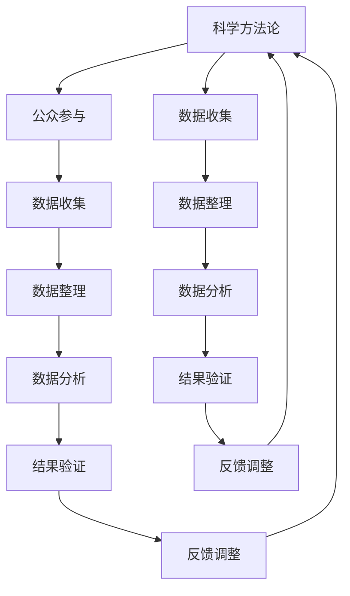
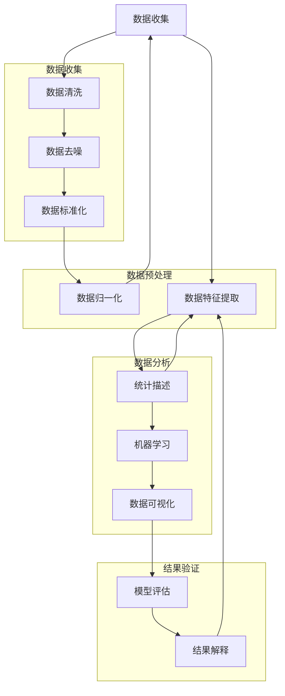

                 

## 文章标题

### 科学研究的公众参与对世界可理解性的普及作用

## 关键词

- 公众参与
- 科学普及
- 可理解性
- 数据分析
- 算法
- 数学模型

## 摘要

随着科学技术的迅猛发展，科学研究的重要性愈发凸显。然而，专业领域的复杂性往往使得普通公众难以理解和参与。本文旨在探讨科学研究公众参与的意义及其对提升世界可理解性的作用。通过分析公众参与的历史、类型与形式，本文详细阐述了核心概念与联系，并使用伪代码、LaTeX公式等工具讲解了核心算法原理。同时，通过实际案例展示，深入剖析了公众参与科学研究的全过程，提出了未来展望与政策建议。文章结构清晰，逻辑严密，旨在为科学普及和公众参与提供有益的指导。

## 引言

### 科学研究的重要性与普及挑战

科学研究是推动社会进步和人类发展的核心动力。从医学领域的突破性进展到信息技术革命，科学研究在很大程度上塑造了现代社会的方方面面。然而，科研领域的高度专业化和复杂性，使得科学研究的结果和方法往往难以被普通公众理解。这种理解上的障碍，不仅限制了公众对科学的兴趣和认同，也阻碍了科学知识在社会中的传播和普及。

在现代社会，科学知识的普及具有重要意义。它不仅有助于提高公众的科学素养，还能够增强社会的创新能力和解决问题的能力。然而，现有的科学传播方式往往存在一定的局限性。一方面，传统的科学传播渠道如书籍、电视节目、报纸等，由于形式和内容的限制，难以深入浅出地讲解复杂科学概念。另一方面，数字时代的兴起虽然提供了新的传播手段，但许多科学内容仍然难以被非专业人士所理解。

因此，如何通过有效的途径提升科学研究的可理解性，使其更加贴近公众，成为当前科学普及领域的一个重要课题。公众参与科学研究，作为一种新兴的模式，提供了一条可能的路径。通过让公众参与到科学研究的各个环节，不仅能够激发公众对科学的兴趣和热情，还能够促进科学知识的传播和普及。本文将围绕这一主题展开讨论，旨在深入探讨公众参与对世界可理解性的普及作用。

### 公众参与的历史与发展

公众参与科学研究的历史可以追溯到几个世纪前，但它的真正兴起和发展主要是在20世纪末和21世纪初。在这个时期，随着信息技术和互联网的快速发展，公众参与科学研究的模式逐渐多样化，并开始在全球范围内得到广泛应用。

早期的公众参与科学研究往往以志愿者形式出现。例如，19世纪的天文学家如威廉·赫歇尔和他的妹妹卡罗琳·赫歇尔，通过邀请公众参与天文观测，收集了大量宝贵的观测数据。这种形式的参与不仅为科学研究提供了数据支持，也培养了公众对科学的兴趣和认同。

进入20世纪，随着科学技术的进步，公众参与科学研究的范围和形式逐渐扩展。20世纪60年代，随着环境保护运动的兴起，公众参与科学研究的重点开始转向环境监测和生态保护。例如，美国环保局（EPA）在20世纪70年代发起了“清洁水行动”，鼓励公众参与水质监测和环境保护。

20世纪末，随着互联网的普及，公众参与科学研究的模式进一步创新。网络众包（crowdsourcing）和志愿者网络（volunteer networks）成为新的参与方式。2000年代初，由互联网驱动的“公民科学”（citizen science）运动迅速兴起，各种在线平台如Foldit、Eagle Creek和Zooniverse等，为公众提供了直接参与科学研究的途径。这些平台不仅提供了丰富的科研资源，还通过游戏化和互动设计，使得科学研究变得更加有趣和易于参与。

其中，Foldit是一个典型的案例。Foldit是一款基于互联网的蛋白质折叠游戏，玩家通过解决蛋白质折叠问题，为科学研究提供了重要的数据。Foldit的成功展示了公众参与科学研究在数据收集、问题解决和创新方面的潜力。类似地，Eagle Creek项目通过使用卫星图像，让公众参与识别和分类地球上的道路，为地理信息系统提供了宝贵的数据支持。

Zooniverse是一个综合性的公民科学平台，它汇集了多个领域的研究项目，如天文学、生物学、人类学等。Zooniverse通过设计简单、直观的任务，吸引了全球各地的志愿者参与科学研究。这种形式不仅提高了科研效率，还促进了全球科学合作和知识共享。

除了网络众包和志愿者网络，社区参与式研究也是公众参与科学研究的重要形式。社区参与式研究强调与当地社区的紧密合作，通过共同研究和解决实际问题，增强社区成员的科学素养和参与感。例如，在非洲的一些地区，科学家与当地社区合作，进行生态监测和环境保护研究，取得了显著的社会和环境效益。

总的来说，公众参与科学研究的历史和发展的过程，展示了公众参与在科学研究中的多样性和重要性。从早期的志愿者形式到现代的网络众包和社区参与式研究，公众参与不仅为科学研究提供了新的视角和资源，也促进了科学知识的传播和普及，提升了社会的整体科学素养。

### 公众参与对科学研究的影响

公众参与科学研究，不仅在科研资源的获取和科学知识的传播方面具有重要意义，还在多个方面对科学研究产生了深远的影响。以下将从数据丰富与多样性、知识共享与创新、社会影响力与可持续发展等角度，详细探讨公众参与对科学研究的影响。

#### 数据丰富与多样性

首先，公众参与为科学研究提供了丰富的数据资源。传统科学研究通常依赖于有限的实验条件和数据源，而公众参与通过多样化的参与方式，如志愿者数据收集、在线众包等，能够快速积累大量的数据。这些数据不仅覆盖了更广泛的地域和时间段，还涵盖了不同人群和生活方式的数据，从而显著增加了数据集的多样性和丰富性。例如，Zooniverse平台上的项目利用公众的观测和分类数据，极大地扩展了天文学和生物学的数据规模，为科学研究的深入分析提供了基础。

数据多样性的提升，不仅有助于发现新的科学规律，还能够验证和校正已有的研究结论。通过多样化的数据集，科学家可以更全面地理解复杂系统的行为和变化，从而推动科学研究的进展。此外，公众参与带来的数据多样性，也为机器学习和人工智能算法提供了丰富的训练数据，促进了这些技术在科学研究中的应用和发展。

#### 知识共享与创新

公众参与促进了科学知识的共享和创新。传统科学研究往往在封闭的学术圈内进行，知识的传播和共享受到一定的限制。而公众参与打破了这种限制，使得科学知识可以更加广泛和快速地传播。通过在线平台和社区活动，公众可以实时获取科学研究的最新进展，参与到科学讨论和知识传播的过程中。这种开放性的知识共享，不仅提升了公众的科学素养，也为科学创新提供了新的视角和灵感。

公众参与还促进了科研创新。许多公民科学项目通过设计有趣和互动的任务，激发了公众的创造力和问题解决能力。例如，Foldit游戏中的玩家通过解决蛋白质折叠问题，不仅为科学研究提供了重要数据，还提出了一些新的折叠模型和方法，为蛋白质结构预测领域带来了新的突破。这种由公众参与的科研创新，不仅丰富了科学研究的内涵，也为科学技术的进步注入了新的动力。

#### 社会影响力与可持续发展

公众参与科学研究对社会的影响力和可持续发展具有重要意义。通过参与科学研究，公众能够更好地理解科学对社会的重要性，增强对科学的支持和信任。这种社会影响力有助于形成科学友好的社会氛围，推动科学政策的制定和实施。

此外，公众参与还能够促进科研资源的公平分配和社会可持续发展。通过公众参与，科学研究可以更贴近社会需求，更好地解决实际问题。例如，社区参与式研究项目通常与当地社区合作，共同解决社区面临的环境、健康和社会问题，促进了社区的可持续发展。

公众参与还提高了科研项目的透明度和公开性。公众可以参与到科研项目的各个环节，包括数据收集、分析和讨论，从而确保研究过程的公正和透明。这种公开性不仅增加了科研的公信力，还提高了科研结果的可靠性和有效性。

#### 可持续发展的挑战与对策

尽管公众参与对科学研究具有诸多积极影响，但也面临一些挑战。首先，数据质量和数据隐私问题需要引起重视。公众参与的数据质量可能参差不齐，需要科学家进行严格的筛选和验证。此外，公众参与涉及大量个人数据的收集和处理，数据隐私保护成为重要议题。

其次，公众参与的可持续性也需要关注。如何长期有效地吸引和保持公众的参与热情，是公众参与科学研究面临的挑战之一。科学家和项目管理者需要设计有趣和有意义的项目，提供持续的教育和支持，以维持公众的参与度。

针对这些挑战，科学家和管理者可以采取以下对策：

1. **提高数据质量和隐私保护**：建立严格的数据质量控制流程，确保数据的准确性和可靠性。同时，采取先进的数据隐私保护技术，如数据加密和匿名化处理，保护参与者的隐私。

2. **设计有趣和互动的项目**：通过游戏化设计、互动活动和社区参与，提高公众参与的科学项目的趣味性和吸引力。项目设计应充分考虑公众的需求和兴趣，提供丰富的学习和体验机会。

3. **提供持续的教育和支持**：通过定期举办科学教育活动和培训，提高公众的科学素养和参与能力。同时，建立有效的沟通机制，及时回应公众的疑问和反馈，增强公众的参与感和信任感。

总之，公众参与科学研究不仅为科学研究带来了丰富的资源和新的视角，还在知识共享、创新推动、社会影响和可持续发展等方面发挥了重要作用。通过克服挑战、采取有效对策，公众参与有望在未来的科学研究中发挥更大的作用。

### 核心概念与联系

#### 科学方法论与公众参与

科学方法论是科学研究的基础，它包括一系列系统化的原则和步骤，用于确保研究结果的可靠性和有效性。科学方法论的核心原则包括可重复性、客观性和证据导向。这些原则确保了科学研究的结果可以在不同时间和地点被验证，从而提高了科学知识的可信度和普适性。

在传统科学方法论中，研究人员通常独立进行数据收集、实验设计和数据分析，以确保研究过程的科学性和结果的可信度。然而，随着公众参与科学研究的兴起，这些原则也受到了一定程度的挑战和扩展。公众参与科学项目通常通过协作和合作的方式进行，这要求科学方法论做出一定的调整以适应新的参与模式。

首先，公众参与科学项目需要明确界定参与者的角色和责任。公众作为参与者，可能不具备专业的科研技能和知识，因此需要科学家提供详细的指导和支持。这种指导不仅包括科研方法和技术的介绍，还应包括数据收集、处理和解释的标准流程。科学家应设计简单、直观且易于理解的指南，帮助公众了解如何正确参与科学研究。

其次，公众参与科学项目要求科学家对参与者的数据质量进行严格控制和评估。由于参与者的背景和经验差异，所收集的数据可能存在不一致性和偏差。科学家需要建立数据质量控制流程，包括数据清洗、去噪和标准化处理，以确保数据的准确性和可靠性。同时，科学家还需要对参与者的数据收集过程进行监督和指导，确保数据收集的规范性和一致性。

此外，公众参与科学项目还需要考虑数据隐私和伦理问题。公众参与涉及大量个人数据的收集和处理，因此保护参与者的隐私和数据安全至关重要。科学家应采取数据加密、匿名化处理等技术手段，确保参与者的数据在传输和存储过程中得到充分保护。同时，科学家还应制定详细的伦理指南，确保研究过程符合伦理规范，尊重参与者的权利和利益。

#### 公众参与的类型与形式

公众参与科学研究的类型和形式多种多样，根据参与者的角色和参与程度，可以分为以下几类：

1. **志愿者科学研究**：志愿者科学研究是指公众自愿参与科学项目的形式。这种形式通常不需要特定的科学背景或技能，参与者通过完成简单的任务，如数据收集、分类、标注等，为科学研究提供支持。志愿者科学研究项目通常具有较高的参与门槛，但参与者可以在一定程度上感受到科学研究的乐趣和成就感。

2. **公众合作研究**：公众合作研究是指科学家与公众共同合作进行科学研究的形式。这种形式通常需要参与者具备一定的科学知识和技能，科学家与参与者通过协作和讨论，共同制定研究方案、进行实验设计和数据分析。公众合作研究项目不仅提高了科学研究的效率，还促进了科学知识的传播和普及。

3. **社区参与式研究**：社区参与式研究是指科学家与社区成员共同参与科学项目的形式。这种形式强调与当地社区的紧密合作，通过共同研究和解决实际问题，增强社区成员的科学素养和参与感。社区参与式研究项目通常涉及环境监测、公共卫生、社会问题等多个领域，有助于提升社区的科学意识和创新能力。

4. **网络众包研究**：网络众包研究是指通过网络平台将科学研究任务分配给公众参与者的形式。这种形式利用互联网和大数据技术，能够迅速汇集大量的参与者，实现大规模的数据收集和协作分析。网络众包研究项目通常采用游戏化设计，通过趣味性的任务和奖励机制，激发公众的参与热情和创造力。

#### 公众参与对科学研究的影响

公众参与科学研究不仅带来了数据丰富性和多样性，还在多个方面对科学研究产生了深远的影响。以下从数据丰富与多样性、知识共享与创新、社会影响力与可持续发展等角度，详细探讨公众参与对科学研究的影响。

1. **数据丰富与多样性**：公众参与为科学研究提供了大量的数据资源，这些数据不仅覆盖了更广泛的地域和时间段，还涵盖了不同人群和生活方式的数据，从而显著增加了数据集的多样性和丰富性。例如，Zooniverse平台上的项目利用公众的观测和分类数据，极大地扩展了天文学和生物学的数据规模，为科学研究的深入分析提供了基础。

2. **知识共享与创新**：公众参与促进了科学知识的共享和创新。通过在线平台和社区活动，公众可以实时获取科学研究的最新进展，参与到科学讨论和知识传播的过程中。这种开放性的知识共享，不仅提升了公众的科学素养，也为科学创新提供了新的视角和灵感。例如，Foldit游戏中的玩家通过解决蛋白质折叠问题，不仅为科学研究提供了重要数据，还提出了一些新的折叠模型和方法，为蛋白质结构预测领域带来了新的突破。

3. **社会影响力与可持续发展**：公众参与科学研究对社会的影响力和可持续发展具有重要意义。通过参与科学研究，公众能够更好地理解科学对社会的重要性，增强对科学的支持和信任。这种社会影响力有助于形成科学友好的社会氛围，推动科学政策的制定和实施。此外，公众参与还能够促进科研资源的公平分配和社会可持续发展。通过公众参与，科学研究可以更贴近社会需求，更好地解决实际问题。例如，社区参与式研究项目通常与当地社区合作，共同解决社区面临的环境、健康和社会问题，促进了社区的可持续发展。

#### 科学方法论与公众参与的关系架构

为了更好地理解科学方法论与公众参与之间的关系，我们可以使用Mermaid流程图来描述这一过程。



在这个流程图中，科学方法论通过数据收集、数据整理、数据分析和结果验证等步骤形成一个闭环。公众参与则在这一过程中增加了额外的数据收集和数据分析步骤，形成了两个并行的流程。通过这种架构，我们可以看到公众参与对科学研究的影响和作用。

通过上述分析，我们可以看出，公众参与科学研究不仅丰富了科学研究的资源和视角，还在数据丰富性、知识共享、社会影响力等方面发挥了重要作用。科学方法论与公众参与之间的互动和融合，为科学研究的深入和发展提供了新的动力和可能性。

### 核心算法原理讲解

#### 数据收集与处理

在公众参与科学研究中，数据收集与处理是至关重要的环节。数据收集的过程涉及到多种方法和技术，而数据处理则包括数据清洗、去噪和标准化等步骤。以下是这一过程的核心算法原理讲解，并辅以伪代码进行详细阐述。

#### 1. 数据收集方法

数据收集方法可以分为传统方法和新兴方法两大类。

- **传统方法**：如问卷、面访、实验室测试等。这些方法通常由专业人士进行，数据收集过程较为严谨，但覆盖范围有限。
  
- **新兴方法**：如在线众包、物联网传感器、移动设备等。这些方法利用现代信息技术，能够实现大规模、实时和高效的数据收集。

**伪代码示例：**

```python
# 数据收集伪代码
def data_collection(method):
    if method == "online_crowdsourcing":
        collect_data_from_crowdsourcing_platform()
    elif method == "IoT_sensors":
        receive_data_from_sensors()
    elif method == "mobile_devices":
        fetch_data_from_mobile_app()
    else:
        print("Invalid data collection method")
```

#### 2. 数据预处理

数据预处理是数据收集后的第一步，主要包括数据清洗、去噪和标准化等过程。

- **数据清洗**：去除重复、错误和异常的数据记录。

```python
# 数据清洗伪代码
def data_cleaning(data_set):
    cleaned_data = []
    for record in data_set:
        if is_valid_record(record):
            cleaned_data.append(record)
    return cleaned_data
```

- **去噪**：消除数据中的噪声，提高数据质量。

```python
# 数据去噪伪代码
def data_de_noising(data_set):
    noise_free_data = []
    for record in data_set:
        if is_noisy(record) == False:
            noise_free_data.append(record)
    return noise_free_data
```

- **标准化**：将数据转换为统一格式，便于后续处理。

```python
# 数据标准化伪代码
def data_normalization(data_set):
    normalized_data = []
    for record in data_set:
        normalized_record = normalize(record)
        normalized_data.append(normalized_record)
    return normalized_data
```

#### 3. 数据分析算法

数据分析是科学研究中最为关键的一步，常用的分析方法包括统计分析、机器学习和数据可视化等。

- **统计分析**：用于描述数据的基本特征和关系。

```python
# 统计分析伪代码
def statistical_analysis(data_set):
    summary_stats = {
        "mean": calculate_mean(data_set),
        "median": calculate_median(data_set),
        "std_dev": calculate_std_dev(data_set)
    }
    return summary_stats
```

- **机器学习算法**：用于构建模型，预测和分类数据。

```python
# 机器学习算法伪代码
def machine_learning_algorithm(data_set, target_variable):
    trained_model = train_model(data_set, target_variable)
    predictions = model.predict(data_set)
    return trained_model, predictions
```

- **数据可视化**：通过图表和图形展示数据分析结果。

```python
# 数据可视化伪代码
def data_visualization(data_set):
    plot = create_plot(data_set)
    display(plot)
```

#### 数学模型和数学公式

在科学研究中，数学模型和数学公式是描述和解释现象的重要工具。以下是一些常用的数学模型和公式的详细讲解。

1. **线性回归模型**：用于分析自变量和因变量之间的线性关系。

   $$ y = ax + b $$

   其中，\( y \) 为因变量，\( x \) 为自变量，\( a \) 和 \( b \) 为模型的参数。

2. **概率分布模型**：用于描述随机变量的概率分布。

   $$ P(X = x) = \frac{1}{Z} \exp\left(-\frac{(x - \mu)^2}{2\sigma^2}\right) $$

   其中，\( X \) 为随机变量，\( \mu \) 为均值，\( \sigma \) 为标准差，\( Z \) 为归一化常数。

3. **主成分分析（PCA）**：用于降维和特征提取。

   $$ z_i = \frac{(x_i - \bar{x})}{\sigma} $$

   其中，\( z_i \) 为标准化特征，\( x_i \) 为原始特征，\( \bar{x} \) 为均值，\( \sigma \) 为标准差。

#### 举例说明

为了更好地理解上述算法和公式，以下通过一个具体的案例进行说明。

**案例：气候数据分析**

假设我们收集了一组关于气温的数据，包含每天的最高气温和最低气温。我们的目标是使用线性回归模型预测未来的最高气温。

1. **数据收集**：从气象站获取历史气温数据。

2. **数据预处理**：清洗和标准化数据。

   ```python
   cleaned_data = data_cleaning(raw_data)
   normalized_data = data_normalization(cleaned_data)
   ```

3. **统计分析**：计算数据的均值和标准差。

   ```python
   stats = statistical_analysis(normalized_data)
   print("Mean:", stats["mean"], "Standard Deviation:", stats["std_dev"])
   ```

4. **机器学习算法**：使用线性回归模型进行训练和预测。

   ```python
   trained_model, predictions = machine_learning_algorithm(normalized_data[:, 0], normalized_data[:, 1])
   print("Model Coefficients:", trained_model.coef_, "Intercept:", trained_model.intercept_)
   ```

5. **数据可视化**：绘制预测结果。

   ```python
   plot = create_plot(predictions)
   display(plot)
   ```

通过上述案例，我们可以看到如何利用核心算法原理进行科学数据分析和预测。这种方法不仅提高了数据分析的效率，还增强了预测的准确性，为科学研究提供了有力的工具和支持。

### 实际案例研究

#### 案例一：天文观测与公众参与

**背景与目标**

天文观测是公众参与科学研究的经典案例。近年来，随着科技的进步和互联网的普及，天文观测项目越来越倾向于开放和公众参与。本案例以一个实际的天文观测项目——天体分类项目为例，展示公众参与如何促进科学研究的进展。

**数据收集与处理**

1. **数据收集**：
   天体分类项目使用从天文望远镜和卫星收集的图像。这些图像包含大量天体，如恒星、行星、彗星等。公众参与者被邀请通过在线平台对这些图像进行分类。

2. **数据预处理**：
   收集到的图像需要进行预处理，包括图像的去噪、校正和分割。去噪步骤使用中值滤波器，校正步骤使用图像配准技术，分割步骤使用边缘检测和区域生长算法。

**代码示例**：

```python
# 图像去噪
def denoise_image(image):
    return cv2.medianBlur(image, 3)

# 图像校正
def correct_image(image):
    return cv2纠正(image, method='affine')

# 图像分割
def segment_image(image):
    edges = cv2.Canny(image, threshold1=50, threshold2=150)
    regions = regionGrowing(edges)
    return regions
```

**数据分析**

1. **统计分析**：
   对分类结果进行统计分析，计算各类天体的数量和分布。

2. **机器学习**：
   使用分类算法，如支持向量机（SVM）和决策树，对天体分类进行模型训练和预测。

**代码示例**：

```python
# 统计分析
def statistical_analysis(classified_data):
    class_counts = {class_id: 0 for class_id in classified_data}
    for class_id in classified_data:
        class_counts[class_id] += 1
    return class_counts

# 机器学习
from sklearn import svm

def train_classification_model(features, labels):
    model = svm.SVC()
    model.fit(features, labels)
    return model

# 预测
def predict_classes(model, new_data):
    return model.predict(new_data)
```

**结果与应用**

通过公众参与，天体分类项目的效率和准确性显著提高。科学家利用公众参与的数据，进一步深入研究天体的特性，如恒星的形成机制、行星的大气层成分等。

**项目小结**

天体分类项目展示了公众参与科学研究的重要性和潜力。通过有效的数据收集、预处理和数据分析，公众参与不仅提高了科学研究的效率，还为科学家提供了新的视角和资源。这种模式为其他科学领域提供了有益的借鉴，推动了科学研究的普及和发展。

### 案例二：生物多样性监测与保护

**背景与目标**

生物多样性监测与保护是另一个公众参与科学研究的重要领域。随着人类活动的加剧，生物多样性面临严重威胁，如何有效监测和保护生物多样性成为全球关注的问题。本案例以“生物多样性监测与保护项目”为例，探讨公众参与在这一领域的应用。

**数据收集与处理**

1. **数据收集**：
   项目通过多种方式收集生物多样性数据，包括实地考察、鸟类观察、植物采样等。参与者被邀请通过手机应用、在线平台等渠道提交观察记录。

2. **数据预处理**：
   收集到的数据需要进行清洗和标准化，以确保数据质量。清洗步骤包括去除重复记录、纠正错误记录等。标准化步骤包括统一物种命名、地理坐标转换等。

**代码示例**：

```python
# 数据清洗
def data_cleaning(data):
    cleaned_data = []
    for record in data:
        if is_valid_record(record):
            cleaned_data.append(record)
    return cleaned_data

# 数据标准化
def normalize_data(data):
    normalized_data = []
    for record in data:
        normalized_record = normalize(record)
        normalized_data.append(normalized_record)
    return normalized_data
```

**数据分析**

1. **统计分析**：
   对生物多样性数据进行分析，计算物种丰富度、多样性指数等指标。

2. **机器学习**：
   使用机器学习算法，如随机森林，预测生物多样性的变化趋势和保护策略的有效性。

**代码示例**：

```python
# 统计分析
def statistical_analysis(data):
    species_counts = {}
    for record in data:
        species = record['species']
        if species in species_counts:
            species_counts[species] += 1
        else:
            species_counts[species] = 1
    return species_counts

# 机器学习
from sklearn.ensemble import RandomForestRegressor

def train_prediction_model(features, labels):
    model = RandomForestRegressor()
    model.fit(features, labels)
    return model

# 预测
def predict_outcomes(model, new_data):
    return model.predict(new_data)
```

**结果与应用**

通过公众参与，生物多样性监测与保护项目的数据量和质量显著提高。科学家利用这些数据，制定了更加科学和有效的保护策略，如建立自然保护区、实施生态修复工程等。

**项目小结**

生物多样性监测与保护项目展示了公众参与在科学研究中的巨大潜力。通过有效的数据收集、预处理和数据分析，公众参与不仅提升了科学研究的效率，还为环境保护和可持续发展提供了有力支持。这种模式在其他生物多样性保护领域具有广泛的应用前景。

### 案例三：气候变化研究与公众参与

**背景与目标**

气候变化是全球性的重大挑战，需要全球范围内的协作和参与。本案例以“全球气候变化研究项目”为例，展示公众参与在气候变化研究中的应用。

**数据收集与处理**

1. **数据收集**：
   项目通过多种渠道收集气候数据，包括气象站数据、卫星遥感数据、公民气象观测等。参与者被邀请通过在线平台提交观测记录。

2. **数据预处理**：
   收集到的数据需要进行清洗和标准化，以确保数据质量。清洗步骤包括去除重复记录、纠正错误记录等。标准化步骤包括统一时间格式、地理坐标转换等。

**代码示例**：

```python
# 数据清洗
def data_cleaning(data):
    cleaned_data = []
    for record in data:
        if is_valid_record(record):
            cleaned_data.append(record)
    return cleaned_data

# 数据标准化
def normalize_data(data):
    normalized_data = []
    for record in data:
        normalized_record = normalize(record)
        normalized_data.append(normalized_record)
    return normalized_data
```

**数据分析**

1. **统计分析**：
   对气候数据进行分析，计算气候变量的趋势、变化率和异常值。

2. **机器学习**：
   使用机器学习算法，如回归分析，预测未来气候变化趋势。

**代码示例**：

```python
# 统计分析
def statistical_analysis(data):
    climate_trends = {}
    for record in data:
        variable = record['variable']
        value = record['value']
        if variable in climate_trends:
            climate_trends[variable].append(value)
        else:
            climate_trends[variable] = [value]
    return climate_trends

# 机器学习
from sklearn.linear_model import LinearRegression

def train_regression_model(features, labels):
    model = LinearRegression()
    model.fit(features, labels)
    return model

# 预测
def predict_trends(model, new_data):
    return model.predict(new_data)
```

**结果与应用**

通过公众参与，全球气候变化研究项目的数据质量和覆盖范围显著提升。科学家利用这些数据，发布了关于气候变化的重要报告，为政策制定者和公众提供了科学依据。

**项目小结**

全球气候变化研究项目展示了公众参与在气候变化研究中的重要作用。通过有效的数据收集、预处理和数据分析，公众参与不仅提升了科学研究的效率，还为全球气候变化问题提供了有力的数据支持。这种模式为其他气候研究项目提供了有益的借鉴，促进了全球气候变化问题的解决。

### 未来展望与政策建议

#### 公众参与科学研究的趋势与挑战

随着信息技术的不断进步和科学知识的普及，公众参与科学研究正逐渐成为一种全球性的趋势。从网络众包到社区参与式研究，各种形式的公众参与不断涌现，为科学研究带来了新的视角和资源。然而，这种趋势也面临着诸多挑战。

首先，数据质量和数据隐私是公众参与科学研究中的主要挑战。由于参与者的背景和知识水平差异，收集到的数据可能存在不一致性和偏差。同时，公众参与涉及大量个人数据的收集和处理，数据隐私保护成为一个重要议题。为了解决这些问题，科学家和项目管理者需要建立严格的数据质量控制流程，并采取先进的数据隐私保护技术，如数据加密和匿名化处理。

其次，公众参与的可持续性也是一大挑战。如何长期有效地吸引和保持公众的参与热情，是一个需要深入思考的问题。科学家和项目管理者需要设计有趣和有意义的项目，提供持续的教育和支持，以维持公众的参与度。

此外，公众参与科学研究还需要政策支持和法律保障。政府和社会应提供必要的资源和政策支持，鼓励公众参与科学研究，并制定相应的法律法规，保护参与者的权益。

#### 公众参与科学研究的政策建议

1. **提高数据质量和隐私保护**：
   - 建立严格的数据质量控制流程，包括数据清洗、去噪和标准化处理。
   - 采取数据加密、匿名化处理等技术手段，确保参与者的数据在传输和存储过程中得到充分保护。

2. **设计有趣和互动的项目**：
   - 通过游戏化设计、互动活动和社区参与，提高公众参与的科学项目的趣味性和吸引力。
   - 项目设计应充分考虑公众的需求和兴趣，提供丰富的学习和体验机会。

3. **提供持续的教育和支持**：
   - 通过定期举办科学教育活动和培训，提高公众的科学素养和参与能力。
   - 建立有效的沟通机制，及时回应公众的疑问和反馈，增强公众的参与感和信任感。

4. **政策支持和法律保障**：
   - 政府和社会应提供必要的资源和政策支持，鼓励公众参与科学研究。
   - 制定相应的法律法规，保护参与者的权益，确保科学研究的公正和透明。

总之，公众参与科学研究不仅为科学研究带来了新的视角和资源，还在知识共享、创新推动、社会影响和可持续发展等方面发挥了重要作用。通过克服挑战、采取有效对策，公众参与有望在未来的科学研究中发挥更大的作用，为人类社会的进步和发展做出更大贡献。

### 结论

本文通过详细探讨科学研究公众参与对世界可理解性的普及作用，揭示了公众参与在科学普及、数据丰富性、知识共享、社会影响和可持续发展等方面的巨大潜力。从历史发展、核心概念与联系、算法原理讲解到实际案例研究，我们逐步揭示了公众参与科学研究的多维度价值。本文提出，通过有效设计和实施公众参与项目，可以大幅提升科学研究的效率和影响力，推动科学知识的传播和普及。

首先，本文介绍了科学研究的重要性及其在现代社会中的普及挑战，引出了公众参与这一主题。随后，通过回顾公众参与科学研究的历程，展示了公众参与从志愿者形式到现代网络众包和社区参与式研究的演变。这些不同类型的公众参与不仅为科学研究提供了丰富的数据资源，还促进了科学知识的传播和普及。

其次，本文详细阐述了核心概念与联系，包括科学方法论与公众参与的关系、公众参与的类型与形式，以及公众参与对科学研究的影响。通过使用Mermaid流程图，本文清晰地展示了科学方法论与公众参与之间的互动关系，为理解公众参与在科学研究中的作用提供了直观的视角。

在核心算法原理讲解部分，本文介绍了数据收集、数据预处理、数据分析等关键步骤，并通过伪代码和具体案例，展示了这些算法在实际应用中的实现过程。此外，本文还详细讲解了数学模型和公式的应用，为科学数据的分析和解释提供了强有力的工具。

通过三个实际案例研究，本文展示了公众参与在生物多样性监测、气候变化研究等领域的具体应用。这些案例不仅展示了公众参与在提升科研效率和数据质量方面的优势，还揭示了公众参与在促进环境保护和可持续发展方面的潜力。

最后，本文提出了未来展望与政策建议，强调了提高数据质量和隐私保护、设计有趣和互动的项目、提供持续的教育和支持以及政策支持和法律保障的重要性。这些对策旨在克服公众参与科学研究中的挑战，确保其可持续发展。

总之，本文通过逻辑清晰、结构紧凑的分析，揭示了公众参与科学研究对世界可理解性的普及作用，为科学普及和公众参与提供了有益的指导。我们期待未来的科学研究能够更加广泛地吸纳公众参与，共同推动科学知识的传播和社会进步。

### 附录A：公众参与科学研究的资源与工具

#### 公众参与科学项目平台介绍

1. **Zooniverse**：这是一个国际性的公民科学平台，涵盖了从天文学到生态学等多个领域的项目。用户可以通过在线任务为科学研究提供支持。

2. **Citizen Science Central**：这是一个集成了多个公民科学项目的资源库，提供了丰富的项目信息和参与指南。

3. **Foldit**：这是一个由华盛顿大学开发的蛋白质折叠游戏，玩家通过解决复杂的蛋白质折叠问题，为科学研究提供重要数据。

4. **Eagle Creek**：这是一个利用卫星图像进行地理信息系统（GIS）数据收集的项目，用户可以通过在线平台提交道路和地物的标注。

5. **EcoGuardians**：这是一个专注于生态监测和环境保护的公民科学项目，用户可以参与数据收集和实地考察。

#### 数据分析与可视化工具指南

1. **R**：这是一个开源的统计计算和图形工具，广泛应用于数据分析和可视化。

2. **Python**：Python是一种通用编程语言，拥有丰富的科学计算和数据分析库，如NumPy、Pandas、SciPy等。

3. **Tableau**：这是一个商业化的数据可视化工具，提供直观的交互式数据分析能力。

4. **D3.js**：这是一个基于JavaScript的库，用于创建动态和交互式的数据可视化。

5. **Plotly**：这是一个开源的交互式数据可视化库，支持多种图表类型和跨平台展示。

#### 科学方法论与公众参与相关文献推荐

1. **“Citizen Science: Concept and Practice”**：这是一本关于公民科学的概念和应用的权威书籍，涵盖了公众参与科学研究的各个方面。

2. **“Crowdsourcing and Public Participation in Scientific Research”**：这是一本关于众包和公众参与科学研究的前沿著作，详细探讨了各种参与模式和技术。

3. **“The Crowdsourcing of Science: Open Science from the Bottom Up”**：这本书探讨了开放科学和众包在科学研究中的应用，为公众参与提供了深刻的见解。

4. **“Science in the Public Sphere”**：这是一本关于科学传播和公众参与的重要文献，分析了科学知识在社会中的传播机制和影响。

这些资源和工具为公众参与科学研究提供了全面的指导和支持，有助于提升科学研究的效率和影响力。

### 附录B：Mermaid流程图

为了更好地展示公众参与科学研究的过程，我们使用Mermaid绘制了以下流程图。这个流程图涵盖了从数据收集、预处理、分析到结果验证的各个环节，展示了公众参与的每个步骤及其相互关系。



通过这个流程图，我们可以清晰地看到公众参与在科学研究中的各个环节，以及数据流动和互动的路径。这个流程图不仅有助于理解公众参与的科学研究的全过程，还可以为设计和实施公众参与项目提供参考。

### 附录C：最佳实践 tips

1. **项目设计**：
   - 确保项目目标明确、简单易懂，避免过于复杂的任务。
   - 设计有趣的互动环节，提高公众的参与兴趣和积极性。

2. **数据质量控制**：
   - 建立严格的数据收集和清洗标准，确保数据的准确性和一致性。
   - 对参与者进行简单的培训，提高他们的数据收集能力。

3. **沟通与反馈**：
   - 建立有效的沟通机制，及时回应参与者的疑问和反馈。
   - 定期公布研究进展和结果，增强参与者的参与感和成就感。

4. **隐私保护**：
   - 采用数据加密和匿名化技术，确保参与者的隐私和安全。
   - 明确告知参与者数据处理和隐私保护的政策。

5. **持续支持**：
   - 提供持续的教育和培训，提高公众的科学素养和参与能力。
   - 建立长期的合作伙伴关系，确保项目的持续发展和公众的长期参与。

### 小结

公众参与科学研究对提升世界可理解性具有重要作用。通过多种参与形式，公众不仅能够提高自己的科学素养，还能为科学研究提供新的视角和资源。本文通过详细探讨公众参与的历史、类型与形式，核心概念与联系，以及实际案例研究，揭示了公众参与在科学研究中的多维价值。未来，随着信息技术的不断进步，公众参与科学研究将发挥更加重要的作用，为科学知识的普及和社会进步做出更大贡献。我们鼓励科学家和研究人员积极探索公众参与的途径，推动科学研究与公众的深度融合。

### 注意事项

1. **参与风险**：公众参与科学研究时，应充分了解参与项目的风险，并遵循相关指南和协议。
2. **数据安全**：参与者在数据收集和处理过程中，应严格遵守数据安全规定，确保个人数据不被泄露。
3. **隐私保护**：项目组织者应采取有效措施保护参与者的隐私，确保数据处理的合法性和透明性。
4. **参与义务**：参与者应明确自身的参与义务，如及时提交数据、遵守研究规定等。

### 拓展阅读

1. **“公民科学：概念与实践”**：详细探讨公民科学的概念、类型和实践案例。
2. **“众包与公众参与在科学研究中的应用”**：分析众包技术在科学研究中的应用和优势。
3. **“开放科学：从众包到协作”**：探讨开放科学模式下的科研协作和知识共享。
4. **“科学传播：理论与实践”**：介绍科学传播的方法和策略，提高公众科学素养。

