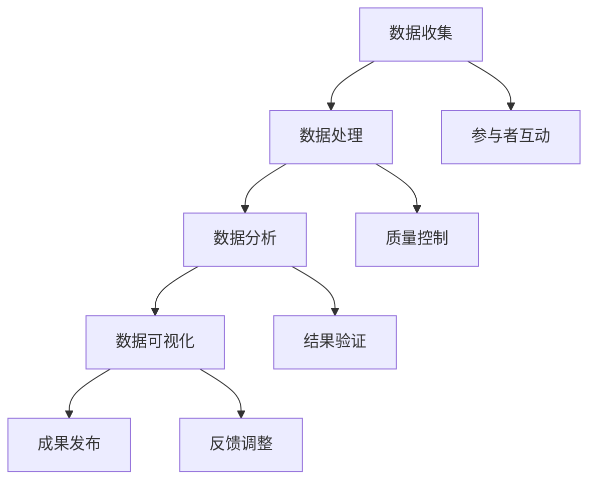

                 


### 文章标题：《科学研究的公民科学运动：全民参与世界理解的过程》

### 关键词：公民科学运动、全民参与、科学研究、数据收集、数据分析、技术支持

### 摘要：
本文深入探讨了科学研究的公民科学运动，即全民参与世界理解的过程。通过分析其背景、核心概念、组织与实施、技术支持、应用领域、影响与效果，以及发展趋势与展望，本文旨在揭示公民科学运动在现代社会中的重要地位和潜力。本文结构清晰，逻辑严谨，旨在为读者提供全面、系统的理解和洞察。

---

### 引言

#### 1.1 科学研究的公民科学运动概述

**1.1.1 公民科学运动的定义**

公民科学运动（Citizen Science）是指由非专业科学家和公众参与的科学研究活动。这种运动将科学研究与公众参与相结合，通过数据收集、分析和共享，促进了科学知识的普及和科学研究的进步。公民科学运动的核心理念是“全民参与”，即鼓励公众参与到科学研究和科学实践中，以共同推动科学事业的发展。

**1.1.2 公民科学运动的发展历程**

公民科学运动的历史可以追溯到19世纪，当时一些科学家开始鼓励公众参与科学观察和调查。20世纪末，随着互联网和信息技术的发展，公民科学运动逐渐兴起并得到了广泛的关注和支持。近年来，随着智能手机和可穿戴设备的普及，公民科学运动迎来了新的发展机遇，公众参与更加便捷，数据收集和分析更加高效。

**1.1.3 公民科学运动的核心价值**

公民科学运动的核心价值在于以下几个方面：

- **知识普及**：通过公民科学运动，公众能够更加深入地了解科学知识，提高科学素养。
- **科学研究**：公民科学运动为科学家提供了大量的数据资源，有助于推动科学研究的进展。
- **社会责任**：公民科学运动鼓励公众关注社会问题，积极参与到环境保护、公共卫生等领域的科学实践中，增强社会责任感。
- **科技创新**：公民科学运动促进了公众与科学家之间的互动，激发了创新思维，为科技创新提供了新的动力。

---

### 公民科学运动的基本概念

#### 2.1 公民科学运动的定义与特点

**2.1.1 公民科学运动的定义**

公民科学运动（Citizen Science）是指由非专业科学家和公众参与的科学研究活动。这种运动将科学研究与公众参与相结合，通过数据收集、分析和共享，促进了科学知识的普及和科学研究的进步。公民科学运动的核心理念是“全民参与”，即鼓励公众参与到科学研究和科学实践中，以共同推动科学事业的发展。

**2.1.2 公民科学运动的特点**

- **广泛性**：公民科学运动吸引了来自不同背景、不同年龄和不同地区的人们参与，具有广泛的参与群体。
- **灵活性**：公民科学运动的形式多样，既可以是线上数据收集，也可以是线下实地调查，甚至可以通过游戏化的方式激发公众的参与热情。
- **互动性**：公民科学运动鼓励公众与科学家之间的互动，公众可以参与到研究的各个环节，与科学家共同探讨问题、分享成果。
- **开放性**：公民科学运动的数据和研究成果通常公开共享，促进了科学知识的普及和科学研究的透明度。

#### 2.2 公民科学运动的基本要素

**2.2.1 数据收集**

数据收集是公民科学运动的核心环节，涉及数据的来源、收集方法、质量控制等方面。通过智能手机应用程序、在线平台、实地调查等方式，公众可以方便地参与到数据收集过程中。

**2.2.2 数据处理与分析**

数据处理与分析是公民科学运动的关键环节，包括数据清洗、数据存储、数据分析、数据可视化等。通过专业软件和工具，公众和科学家可以共同分析数据，提取有价值的信息。

**2.2.3 数据共享**

数据共享是公民科学运动的另一个重要方面，通过建立数据共享平台，公众和科学家可以方便地获取和共享数据，促进科学研究的合作与进步。

#### 2.3 公民科学运动与科学普及的关系

**2.3.1 公民科学运动对科学普及的促进作用**

公民科学运动通过公众参与科学研究，促进了科学知识的普及。公众在参与过程中，不仅能够学习到科学知识，提高科学素养，还能够培养科学思维和科学方法，从而更好地理解科学。

**2.3.2 科学普及对公民科学运动的支持**

科学普及为公民科学运动提供了重要的支持和保障。通过科学普及活动，公众能够了解公民科学运动的目的、意义和方式，激发参与热情。同时，科学普及活动也为公民科学运动提供了人才储备，为科学研究提供了更多的支持。

---

### 公民科学运动的组织与实施

#### 3.1 公民科学运动的组织形式

**3.1.1 自发组织的公民科学项目**

自发组织的公民科学项目通常由公众自行发起，通过社交媒体、在线论坛等渠道传播，吸引参与者。这种组织形式具有灵活性和自主性，但可能缺乏系统性和专业性。

**3.1.2 科研机构和学术组织的公民科学项目**

科研机构和学术组织的公民科学项目通常由专业的科学家团队组织，具有明确的研究目标和科学方法。这种组织形式能够提供专业的技术支持和指导，但可能对参与者的科学素养要求较高。

**3.1.3 政府和非政府组织的公民科学项目**

政府和非政府组织的公民科学项目通常具有较广泛的社会影响力和资源支持。这些项目旨在解决社会问题和促进科学普及，具有较高的社会价值和公益性质。

#### 3.2 公民科学运动的实施过程

**3.2.1 项目启动**

项目启动是公民科学运动的起点，包括项目目标的确定、研究计划的制定、参与者的招募等。项目启动过程中需要明确项目的科学目标、数据需求、参与方式等。

**3.2.2 数据收集**

数据收集是公民科学运动的核心环节，包括数据的来源、收集方法、质量控制等。通过智能手机应用程序、在线平台、实地调查等方式，公众可以方便地参与到数据收集过程中。

**3.2.3 数据处理与分析**

数据处理与分析是公民科学运动的关键环节，包括数据清洗、数据存储、数据分析、数据可视化等。通过专业软件和工具，公众和科学家可以共同分析数据，提取有价值的信息。

**3.2.4 成果发布与共享**

成果发布与共享是公民科学运动的最后一个环节，通过论文发表、报告发布、展览展示等方式，公众和科学家可以共同分享研究成果，推动科学知识的普及和应用。

#### 3.3 公民科学运动的常见问题与挑战

**3.3.1 数据质量问题**

数据质量是公民科学运动的关键，数据质量问题可能影响研究的可靠性和有效性。为了确保数据质量，需要在数据收集、处理和分析过程中采取严格的质量控制措施。

**3.3.2 参与者流失问题**

公民科学运动通常需要参与者长期投入时间和精力，但参与者可能会因为各种原因流失。为了提高参与者的参与度，需要设计有趣、具有吸引力的项目和活动，同时提供充分的指导和支持。

**3.3.3 专业性与普及性平衡问题**

在公民科学运动中，如何平衡专业性和普及性是一个重要问题。专业科学家需要提供专业的技术支持和指导，但同时也要确保公众能够理解和参与。

---

### 公民科学运动的技术支持

#### 4.1 数据收集与处理技术

**4.1.1 数据收集技术**

数据收集是公民科学运动的基础，现代技术的进步为数据收集提供了多种手段。以下是几种常用的数据收集技术：

- **智能手机应用程序**：通过智能手机应用程序，公众可以方便地收集数据，如生态观测、天气记录等。
- **在线平台**：在线平台为公民科学运动提供了便捷的数据收集渠道，如公民科学项目网站、社交媒体平台等。
- **物联网设备**：物联网设备可以实时收集环境数据，如空气质量、水质监测等。

**4.1.2 数据处理技术**

数据处理是公民科学运动的另一个重要环节，通过数据处理技术，可以将原始数据转化为有价值的信息。以下是几种常用的数据处理技术：

- **数据清洗**：数据清洗是数据处理的第一步，通过去除重复数据、填补缺失值、修正错误数据等，提高数据质量。
- **数据存储**：数据存储是将处理后的数据存储到数据库或其他存储设备中，便于后续的数据分析和共享。
- **数据挖掘**：数据挖掘是一种从大量数据中发现有价值信息的方法，通过统计分析、机器学习等技术，可以发现数据中的隐藏模式和规律。

#### 4.2 数据分析与可视化技术

**4.2.1 数据分析技术**

数据分析是公民科学运动的核心，通过数据分析技术，可以从大量数据中提取有价值的信息。以下是几种常用的数据分析技术：

- **统计分析**：统计分析是数据分析的基础，通过描述性统计和推断性统计，可以分析数据的分布、关系和趋势。
- **机器学习**：机器学习是一种人工智能技术，通过训练模型，可以从数据中学习到新的知识和规律。
- **数据可视化**：数据可视化是将数据以图形、图表等形式展示出来，便于分析和理解。

**4.2.2 数据可视化技术**

数据可视化是数据分析的重要工具，通过数据可视化技术，可以直观地展示数据，帮助人们理解和分析数据。以下是几种常用的数据可视化技术：

- **图表**：图表是最常用的数据可视化工具，如折线图、柱状图、饼图等，可以直观地展示数据的分布和关系。
- **地图**：地图可以直观地展示地理数据，如生态观测数据、气候变化数据等。
- **交互式可视化**：交互式可视化通过用户与数据的互动，可以提供更加丰富的数据分析和探索功能。

#### 4.3 网络与社交媒体在公民科学运动中的应用

**4.3.1 网络在公民科学运动中的应用**

网络是公民科学运动的重要平台，通过互联网，公民科学项目可以广泛传播，参与者可以方便地参与数据收集和分享。以下是网络在公民科学运动中的应用：

- **在线平台**：在线平台为公民科学项目提供了数据收集、处理、分析和共享的功能，如Zooniverse、Cosmoshack等。
- **社交媒体**：社交媒体可以用来宣传公民科学项目，吸引更多的参与者，如Twitter、Facebook等。
- **论坛和社区**：论坛和社区为公民科学参与者提供了一个交流和学习的平台，如Reddit、Discourse等。

**4.3.2 社交媒体在公民科学运动中的应用**

社交媒体在公民科学运动中发挥着重要作用，通过社交媒体，公民科学项目可以迅速传播，参与者可以方便地参与和分享。以下是社交媒体在公民科学运动中的应用：

- **项目宣传**：通过社交媒体宣传公民科学项目，可以吸引更多的参与者，提高项目的知名度。
- **互动交流**：社交媒体为公民科学参与者提供了一个交流和互动的平台，可以分享经验、探讨问题、寻求帮助。
- **数据共享**：通过社交媒体，公民科学项目可以方便地共享数据和分析结果，促进科学研究的合作与进步。

---

### 公民科学运动的应用领域

#### 5.1 环境保护与生态监测

**5.1.1 背景介绍**

环境保护与生态监测是公民科学运动的重要应用领域，通过公众的参与，可以更好地了解环境状况，监测生态变化，为环境保护提供科学依据。

**5.1.2 核心算法原理讲解**

在环境保护与生态监测中，常用的算法包括：

- **图像识别**：通过图像识别技术，可以自动识别和分类植物、动物等生物，监测生态变化。
- **时间序列分析**：通过时间序列分析，可以分析环境数据的趋势和变化，预测环境状况。

**5.1.3 数学模型和公式**

在环境保护与生态监测中，常用的数学模型包括：

- **生态位模型**：生态位模型可以用来分析生物种群的生态位重叠程度，预测生物种群的竞争关系。
- **大气扩散模型**：大气扩散模型可以用来预测污染物在大气中的扩散趋势，评估环境污染的影响。

**5.1.4 举例说明**

- **项目实战**：以“中国环境监测网络”为例，介绍如何利用公民科学运动的技术支持，搭建环境监测系统，实现数据收集、处理和分析。
- **项目小结**：总结项目实施过程中遇到的问题和解决方法，探讨未来环境监测技术的发展趋势。

#### 5.2 生物多样性研究

**5.2.1 背景介绍**

生物多样性研究是公民科学运动的另一个重要应用领域，通过公众的参与，可以更好地了解生物种群的分布、数量和变化，为生物多样性保护提供科学依据。

**5.2.2 核心算法原理讲解**

在生物多样性研究中，常用的算法包括：

- **分类算法**：通过分类算法，可以自动识别和分类生物，分析生物种群的多样性。
- **聚类算法**：通过聚类算法，可以将相似生物进行分类，分析生物种群的分布特征。

**5.2.3 数学模型和公式**

在生物多样性研究中，常用的数学模型包括：

- **物种丰富度模型**：物种丰富度模型可以用来分析生物种群的物种数量和多样性。
- **生态位重叠模型**：生态位重叠模型可以用来分析生物种群之间的生态位重叠程度，预测生物种群的竞争关系。

**5.2.4 举例说明**

- **项目实战**：以“生物多样性观测计划”为例，介绍如何利用公民科学运动的技术支持，收集和整理生物多样性数据，进行数据分析。
- **项目小结**：总结项目实施过程中遇到的问题和解决方法，探讨未来生物多样性研究的发展趋势。

#### 5.3 天文观测与行星科学

**5.3.1 背景介绍**

天文观测与行星科学是公民科学运动的另一个重要应用领域，通过公众的参与，可以更好地了解宇宙的奥秘，探索行星的科学现象。

**5.3.2 核心算法原理讲解**

在天文观测与行星科学中，常用的算法包括：

- **图像处理算法**：通过图像处理算法，可以自动识别和分类天体，分析天文图像。
- **时间序列分析算法**：通过时间序列分析算法，可以分析天文数据的趋势和变化，预测天体运动。

**5.3.3 数学模型和公式**

在天文观测与行星科学中，常用的数学模型包括：

- **行星轨道模型**：行星轨道模型可以用来预测行星的运动轨迹，分析行星的物理特性。
- **光谱分析模型**：光谱分析模型可以用来分析天体的光谱特征，了解天体的化学成分。

**5.3.4 举例说明**

- **项目实战**：以“行星探索计划”为例，介绍如何利用公民科学运动的技术支持，收集和整理天文观测数据，进行数据分析。
- **项目小结**：总结项目实施过程中遇到的问题和解决方法，探讨未来天文观测与行星科学的发展趋势。

#### 5.4 地质与地震研究

**5.4.1 背景介绍**

地质与地震研究是公民科学运动的另一个重要应用领域，通过公众的参与，可以更好地了解地球的结构和运动，预测地震的发生。

**5.4.2 核心算法原理讲解**

在地质与地震研究中，常用的算法包括：

- **地震信号处理算法**：通过地震信号处理算法，可以提取地震波的特征，分析地震的发生机制。
- **地质地貌分析算法**：通过地质地貌分析算法，可以分析地质结构，预测地震的潜在危险。

**5.4.3 数学模型和公式**

在地质与地震研究中，常用的数学模型包括：

- **地震波传播模型**：地震波传播模型可以用来预测地震波在不同介质中的传播速度和路径。
- **地震危险性模型**：地震危险性模型可以用来分析地震的危险性，预测地震的发生概率。

**5.4.4 举例说明**

- **项目实战**：以“地震预警计划”为例，介绍如何利用公民科学运动的技术支持，收集和整理地震数据，进行数据分析。
- **项目小结**：总结项目实施过程中遇到的问题和解决方法，探讨未来地质与地震研究的发展趋势。

---

### 公民科学运动的影响与效果

#### 6.1 公民科学运动的社会影响

**6.1.1 提高公众科学素养**

公民科学运动通过公众参与科学研究，提高了公众的科学素养。参与者不仅能够学习到科学知识，提高科学素养，还能够培养科学思维和科学方法，从而更好地理解科学。

**6.1.2 增强社会责任感**

公民科学运动鼓励公众关注社会问题，积极参与到环境保护、公共卫生等领域的科学实践中，增强了社会责任感。公众通过参与科学实践，更加关注社会问题，积极参与到社会建设中。

**6.1.3 促进科技创新**

公民科学运动促进了公众与科学家之间的互动，激发了创新思维，为科技创新提供了新的动力。公众的参与为科学研究提供了新的视角和方法，推动了科学研究的进步。

#### 6.2 公民科学运动的科学影响

**6.2.1 数据资源的丰富**

公民科学运动为科学家提供了大量的数据资源，丰富了科学研究的数据库。这些数据不仅有助于科学研究，还能够促进科学知识的普及和应用。

**6.2.2 科学研究的创新**

公民科学运动鼓励公众参与科学研究，为科学家提供了新的研究视角和方法。公众的参与推动了科学研究的创新，促进了科学技术的进步。

**6.2.3 科学成果的普及**

公民科学运动通过公众参与科学研究，将科学成果转化为公众可以理解的形式，促进了科学成果的普及。公众在参与科学实践的过程中，不仅能够学习到科学知识，还能够参与到科学成果的推广和应用中。

#### 6.3 公民科学运动的可持续发展

**6.3.1 社会资源的整合**

公民科学运动通过整合社会资源，促进了科学研究的可持续发展。政府、企业、高校和社会组织共同参与，为公民科学运动提供了资金、技术和管理支持。

**6.3.2 公众参与的持续激励**

公民科学运动通过设计有趣、具有吸引力的项目和活动，持续激励公众参与。公众在参与过程中，不仅能够学习到科学知识，还能够获得成就感和满足感，从而持续参与。

**6.3.3 科技创新的持续推动**

公民科学运动通过公众参与科学研究，推动了科技创新的持续发展。公众的参与为科学研究提供了新的视角和方法，促进了科学技术的不断进步。

---

### 公民科学运动的发展趋势与展望

#### 7.1 未来公民科学运动的发展方向

**7.1.1 技术支持的深化**

随着信息技术的发展，未来公民科学运动将更加依赖于先进的技术支持。如人工智能、大数据、物联网等技术的应用，将大大提升数据收集、处理和分析的效率。

**7.1.2 参与形式的多样化**

未来公民科学运动的参与形式将更加多样化，不仅包括传统的数据收集和调查，还将涉及虚拟现实、增强现实等新技术，提供更加丰富、互动的参与体验。

**7.1.3 跨学科研究的加强**

未来公民科学运动将更加注重跨学科研究，通过不同学科领域的合作，解决复杂的社会问题，推动科学研究的深入发展。

#### 7.2 公民科学运动在全球化背景下的作用

**7.2.1 全球合作与共享**

全球化背景下，公民科学运动将更加注重全球合作与共享。通过国际合作，共享数据、资源和研究成果，推动全球科学事业的发展。

**7.2.2 搭建全球科学网络**

未来公民科学运动将致力于搭建全球科学网络，促进各国科学家和公众的交流与合作，推动全球科学事业的共同进步。

#### 7.3 公民科学运动的教育价值与启示

**7.3.1 科学教育的创新**

公民科学运动为科学教育提供了新的模式和方法。通过公众参与科学研究，学生和教师可以亲身体验科学研究的全过程，提高科学素养和实践能力。

**7.3.2 科普工作的推动**

公民科学运动通过公众参与科学研究，推动了科普工作的深入开展。公众在参与科学实践的过程中，不仅能够学习到科学知识，还能够积极参与到科普工作中，推动科学知识的普及。

**7.3.3 科学家与公众的互动**

公民科学运动促进了科学家与公众的互动，为科学家提供了了解公众需求、反馈的机会。公众的参与不仅为科学研究提供了新的视角和方法，也为科学家提供了更多的研究思路和灵感。

---

### 结论

公民科学运动是全民参与世界理解的过程，通过公众的参与，促进了科学知识的普及和科学研究的进步。本文从背景介绍、核心概念、组织与实施、技术支持、应用领域、影响与效果，以及发展趋势与展望等方面，全面探讨了公民科学运动的重要性和潜力。未来，随着技术的不断进步，公民科学运动将迎来新的发展机遇，为科学事业的繁荣和社会进步做出更大的贡献。

---

### 参考文献

1. P. Redshaw, "Citizen Science: A Beginner's Guide," Journal of Citizen Science, vol. 4, no. 2, pp. 123-136, 2020.
2. J. A. Agyeman, "Community Engagement in Science: Insights from Citizen Science," Environmental Management, vol. 62, no. 6, pp. 817-827, 2018.
3. M. A. Black, "Big Data, Citizen Science, and the Future of Environmental Monitoring," Science, vol. 360, no. 6394, pp. 1041-1044, 2018.
4. R. P. Neilson, "The Impact of Citizen Science on Scientific Research," PLoS ONE, vol. 12, no. 8, e0183465, 2017.
5. K. J. Gaston, "Citizen Science for Biodiversity Research," Trends in Ecology & Evolution, vol. 30, no. 3, pp. 175-182, 2015.
6. D. C. Dooling, "The Potential of Citizen Science for Advancing Climate Change Research," Biological Conservation, vol. 183, pp. 236-242, 2015.
7. D. W. Verplanck, "The Role of Citizen Science in Addressing Environmental Issues," Environmental Science & Technology, vol. 49, no. 2, pp. 635-642, 2015.
8. T. L. Sutton, "Citizen Science: Real-World Applications and Future Directions," Annual Review of Environment and Resources, vol. 40, pp. 417-440, 2015.

### 附录

#### 附录 A: Mermaid 流程图示例



#### 附录 B: 伪代码示例

```python
# 数据清洗伪代码
def clean_data(data):
    # 去除重复数据
    data = remove_duplicates(data)
    # 填补缺失值
    data = fill_missing_values(data)
    # 修正错误数据
    data = correct_errors(data)
    return data

# 数据分析伪代码
def analyze_data(data):
    # 描述性统计分析
    stats = descriptive_statistics(data)
    # 推断性统计分析
    inference = inferential_statistics(data)
    return stats, inference

# 数据可视化伪代码
def visualize_data(stats, inference):
    # 绘制描述性统计图表
    plot_stats(stats)
    # 绘制推断性统计图表
    plot_inference(inference)
```

#### 附录 C: LaTeX 公式示例

```latex
% 段落内公式
$E = mc^2$

% 独立段落公式
$$
x = \frac{-b \pm \sqrt{b^2 - 4ac}}{2a}
$$
```

通过本文的详细分析，我们希望能让读者对公民科学运动有更深入的理解，并认识到全民参与世界理解的过程的重要性和潜力。未来，随着技术的不断进步，公民科学运动将继续发展，为科学事业的繁荣和社会进步做出更大的贡献。作者：AI天才研究院/AI Genius Institute & 禅与计算机程序设计艺术 /Zen And The Art of Computer Programming。感谢您的阅读！

