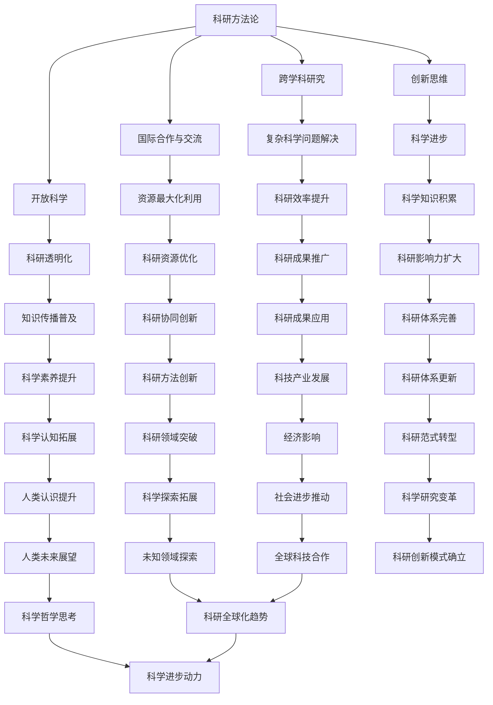

                 


### 引言

科学研究一直是推动社会进步的重要力量。随着科技的飞速发展，科学研究的创新模式也在不断演变。从传统的单点突破到如今的跨学科合作，科学研究的方式发生了深刻的变化。这种变化不仅提高了科研效率，也极大地拓展了我们对世界的认知边界。然而，随着科学研究不断深入，我们面临着越来越多的复杂问题，这些问题超出了传统学科领域的解决能力。这就要求科学研究必须突破现有模式，寻求新的创新方法，以实现世界可理解性的突破。

世界可理解性的突破指的是通过科学研究，使得我们对自然界、人类社会以及宇宙的本质有更加深刻的理解。这不仅仅是对知识的积累和扩展，更是对人类认识能力的提升。科学研究的创新模式是实现这一目标的关键。创新模式不仅包括科研方法论的变革，还涉及到国际合作与交流的深化。只有通过这些创新，我们才能解决复杂的科学问题，提升科学研究的整体水平。

本文将围绕科学研究的创新模式和世界可理解性的突破展开讨论。首先，我们将介绍科学研究的现状与挑战，探讨为什么需要创新模式。接着，我们将详细阐述科学研究的创新模式，包括核心概念与联系、科研方法论的创新以及国际合作与交流。随后，我们将探讨世界可理解性的突破，包括基础科学研究突破、应用技术突破以及这些突破对社会和经济的影响。最后，我们将展望未来，探讨科技发展趋势、跨学科融合以及持续创新与可持续发展。

通过本文的逐步分析，我们希望能够帮助读者理解科学研究的创新模式，认识到世界可理解性突破的重要性，并激发对这一领域的深入思考。

### 核心概念与联系

为了深入探讨科学研究的创新模式，我们首先需要明确几个核心概念，并理解它们之间的内在联系。以下是这些核心概念：

1. **科研方法论**：科研方法论是科学研究的基本方法和原则，包括观察、假设、实验、验证和理论构建等环节。传统科研方法论通常依赖单一学科的理论框架和工具，而创新模式则强调多学科交叉融合，采用更加综合和系统的方法。

2. **跨学科研究**：跨学科研究是指将不同学科的理论和方法结合起来，以解决复杂科学问题。这种模式打破了传统学科的壁垒，促进了知识的多向流动和融合。跨学科研究的成功案例包括生物学与计算机科学的结合，产生了生物信息学这一新兴领域。

3. **国际合作与交流**：国际合作与交流是现代科学研究的重要特征之一。在全球化和信息技术快速发展的背景下，科学家们跨越国界，共享资源和数据，共同攻克科学难题。例如，大型国际科研合作项目如“人类基因组计划”，通过全球科学家共同努力，实现了对人类基因组的全面测序。

4. **开放科学**：开放科学强调科研过程的透明化和开放性，包括数据共享、结果公开和科研过程的在线协作。开放科学不仅提高了科研效率，还促进了科学知识的传播和普及。

5. **创新思维**：创新思维是科学研究的关键驱动力。它包括创造新的理论、提出新的假设、发明新的方法和技术等。创新思维往往需要突破传统思维模式，探索未知领域。

这些核心概念之间存在紧密的联系。科研方法论为科学研究提供了基础框架，而跨学科研究则促进了不同领域知识的整合。国际合作与交流使得科研资源得到最大化利用，开放科学则确保了科研过程的透明和公平。最后，创新思维是推动科学进步的根本动力，它贯穿于整个科研过程中。

为了帮助读者更好地理解这些概念之间的关系，我们可以使用Mermaid流程图进行展示。以下是一个简化的Mermaid流程图示例，展示了这些核心概念之间的联系：



这个流程图展示了科研方法论如何通过跨学科研究、国际合作与交流、开放科学和创新思维等核心概念，相互联系并共同推动科学研究的创新和世界可理解性的突破。

通过这一节的分析，我们为后续内容的展开奠定了基础，帮助读者对科学研究的创新模式有一个全局性的认识。接下来，我们将深入探讨科研方法论的创新，进一步揭示科学研究如何通过这些创新实现突破。

### 科研方法论的创新

在科学研究的过程中，方法论的创新是推动科技进步的关键因素之一。传统的科研方法论通常依赖于单一学科的理论框架和工具，这使得科学研究在解决复杂问题时往往显得力不从心。为了应对这一挑战，科研方法论进行了深刻的变革，主要体现在以下几个方面：

#### 多学科交叉融合

多学科交叉融合是科研方法论创新的核心之一。通过将不同学科的理论和方法结合起来，科学家们能够从多个角度审视复杂问题，从而提出更加全面和创新的解决方案。例如，在生物信息学领域，生物学与计算机科学的交叉融合，使得科学家们能够利用计算机技术分析大量的生物数据，从而揭示生物系统的运行机制。

#### 系统科学方法论

系统科学方法论强调从整体和系统的角度研究复杂现象。这种方法论不仅关注系统的局部特性，还强调系统内部各要素之间的相互作用和反馈。通过系统科学方法论，科学家们能够更好地理解复杂系统的行为和规律，从而为解决实际问题提供有力支持。

#### 大数据分析与机器学习

随着大数据时代的到来，大数据分析与机器学习成为科研方法论的重要创新。大数据分析能够从海量数据中提取有价值的信息，而机器学习则能够通过数据训练模型，预测和识别复杂现象。这些技术的应用极大地提高了科研效率，使得科学家们能够在短时间内处理和分析大量的数据。

#### 透明化与开放性

科研的透明化和开放性是近年来科研方法论的重要创新。开放科学运动提倡科研过程和结果的公开共享，使得科学研究成果能够更加迅速地传播和应用。同时，透明化的科研环境也有助于减少学术不端行为，提高科研诚信。

#### 社会参与与合作

科研方法论的创新还包括社会参与和合作。现代科学研究越来越强调科研与社会需求的紧密结合，通过公众参与和多方合作，科学家们能够更好地理解社会问题，从而提出更加符合实际需求的解决方案。

#### 伪代码阐述核心算法原理

为了更好地理解科研方法论的创新，我们可以通过伪代码来阐述一个核心算法原理。以下是一个简化的大数据分析算法的伪代码示例：

```pseudo
Function DataAnalysis(dataSet):
    1. PreprocessData(dataSet)
    2. CreateFeatureSet(dataSet)
    3. TrainModel(model, featureSet)
    4. ValidateModel(model, validationSet)
    5. TestModel(model, testSet)
    6. Return model, performanceMetrics
End Function
```

在这个伪代码中，`DataAnalysis` 函数首先对数据进行预处理，然后创建特征集，接着训练模型并进行验证和测试，最后返回模型和性能指标。

#### 数学模型与公式讲解

在科研方法论的创新中，数学模型和公式是不可或缺的工具。以下是一个简化的线性回归模型的数学公式示例：

$$
y = \beta_0 + \beta_1x + \epsilon
$$

其中，$y$ 是因变量，$x$ 是自变量，$\beta_0$ 和 $\beta_1$ 是模型的参数，$\epsilon$ 是误差项。通过最小二乘法，我们可以估计出参数 $\beta_0$ 和 $\beta_1$，从而建立线性回归模型。

#### 举例说明

为了更好地理解上述核心算法原理和数学模型，我们可以通过一个简单的例子进行说明。假设我们研究的是房价与面积之间的关系，我们收集了一些房屋的面积和价格数据。通过线性回归模型，我们可以预测新房屋的价格。

1. **数据预处理**：首先，我们需要对收集的数据进行清洗和预处理，包括处理缺失值、异常值等。

2. **特征提取**：我们将房屋的面积作为自变量，价格作为因变量。

3. **模型训练**：使用最小二乘法训练线性回归模型。

4. **模型验证**：使用部分数据集对模型进行验证，评估模型的准确性和稳定性。

5. **模型测试**：使用剩余的数据集测试模型的预测能力。

通过这个例子，我们可以看到科研方法论的创新是如何通过具体的算法和数学模型，将复杂问题转化为可计算和可分析的模型，从而提供解决方案。

总之，科研方法论的创新不仅提高了科研的效率和准确性，也推动了科学研究的深入发展。通过多学科交叉融合、系统科学方法论、大数据分析与机器学习、透明化与开放性、社会参与与合作等创新，科学研究正逐渐实现从单一学科到跨学科、从封闭到开放的转变，为世界可理解性的突破提供了坚实的基础。

### 国际合作与交流

国际合作与交流是现代科学研究的重要特征之一。在全球化和信息技术快速发展的背景下，科学家们跨越国界，共享资源和数据，共同攻克科学难题。这种合作模式不仅提高了科研效率，还极大地推动了科学研究的创新和世界可理解性的突破。

#### 合作的重要性

国际合作与交流在科学研究中的重要性体现在多个方面。首先，它能够汇聚全球顶尖科研力量，集中解决复杂科学问题。例如，大型国际科研合作项目如“人类基因组计划”和“国际疗伤研究联盟”，通过全球科学家共同努力，实现了对人类基因组的全面测序和新型疗伤技术的研发。其次，国际合作与交流促进了科学知识和技术的传播，使得新兴经济体和发展中国家能够迅速提升科研水平。此外，国际合作还促进了科研资源的优化配置，通过共享实验室设备、数据资源和科研经费，提高了科研投资的整体效益。

#### 现状与趋势

当前，国际合作与交流呈现出以下几个显著趋势：

1. **跨国科研项目的增加**：随着全球科研合作的深化，跨国科研项目不断增加。这些项目通常涉及多个学科领域，旨在解决全球性的科学问题，如气候变化、能源危机和公共卫生等。

2. **科技园区与研究中心的建立**：许多国家在科技园区和研究中心建立了国际合作的平台，吸引了全球科学家和研究机构的参与。这些平台为跨国科研合作提供了物理空间和制度保障。

3. **在线科研协作平台的发展**：随着信息技术的进步，在线科研协作平台如GitHub、Overleaf和Confluence等，使得科学家们能够实时共享数据和研究成果，打破了时间和空间的限制，提高了科研协作的效率。

4. **科研交流的多样化和普及化**：除了传统的学术会议和期刊论文，社交媒体和在线论坛等新兴平台也逐渐成为科学家们交流思想、分享成果的重要渠道。这些平台不仅促进了科研交流的多样化和普及化，也加速了科学知识的传播和应用。

#### 成功案例

国际合作与交流在许多科学领域取得了显著成果。以下是一些成功案例：

1. **大型国际科研项目**：如“欧洲核子研究中心”的“大型强子对撞机”（LHC）项目，通过国际合作，实现了对宇宙基本粒子的深入研究。

2. **跨国科研中心**：如位于瑞士的欧洲分子生物学实验室（EMBL）和位于美国和加拿大的“阿尔伯塔大学-多伦多大学癌症研究中心”，这些跨国科研中心汇集了全球顶尖科学家，推动了基础科学和医学研究的发展。

3. **学术会议与论坛**：如“国际数学家大会”和“国际计算机科学大会”，这些国际学术会议和论坛为全球科学家提供了一个交流平台，促进了科学思想的碰撞和融合。

4. **在线科研协作平台**：如GitHub，这个在线协作平台使得科学家们能够共享代码、数据和研究成果，加速了科学研究的进展。

总之，国际合作与交流在现代科学研究中发挥着至关重要的作用。通过跨国科研项目的实施、跨国科研中心的建设、在线科研协作平台的发展以及学术会议和论坛的举办，科学家们能够共同攻克科学难题，推动科学研究的创新和世界可理解性的突破。随着全球化进程的加速，国际合作与交流将越来越成为科学研究不可或缺的重要组成部分。

### 基础科学研究的突破

基础科学研究是推动科技发展的基石，它通过对自然界的基本规律进行探索，为应用科学和技术创新提供了理论依据和技术支持。近年来，基础科学研究在多个领域取得了重大突破，极大地拓展了我们对宇宙、生命和物质世界的理解。

#### 突破案例

1. **量子计算**：量子计算作为量子信息科学的重要组成部分，近年来取得了显著进展。2019年，谷歌宣布实现了“量子霸权”，即其量子计算机在特定任务上比世界上最强大的超级计算机快了亿亿倍。这一突破标志着量子计算进入了一个新的时代，为未来计算能力的提升提供了无限可能。

2. **暗物质与暗能量研究**：暗物质和暗能量是现代宇宙学中两个尚未完全解释的现象。通过对宇宙微波背景辐射和大型结构形成的观测，科学家们提出了关于暗物质和暗能量的多种假说。近年来，通过对引力波和宇宙膨胀的深入研究，科学家们进一步验证了这些假说，为理解宇宙的起源和演化提供了新的视角。

3. **基因组编辑**：基因组编辑技术，如CRISPR-Cas9，为生命科学研究带来了革命性的变化。科学家们利用这一技术成功编辑了多种生物的基因组，揭示了基因功能及其对生物体的影响。这一突破不仅推动了生物学研究，还为治疗遗传病和开发新型生物技术提供了新的途径。

#### 伪代码阐述核心算法原理

为了深入理解这些突破背后的核心算法原理，我们可以通过伪代码来简要阐述量子计算和基因组编辑的基本概念。

**量子计算伪代码示例**：

```python
Function QuantumCompute(inputData):
    1. Initialize quantum register with inputData
    2. Apply quantum gates to create superposition
    3. Measure quantum register to obtain output state
    4. Post-process output to extract information
    5. Return output information
End Function
```

在这个伪代码中，`QuantumCompute` 函数通过初始化量子寄存器、应用量子门、测量量子寄存器以及后处理输出，实现了量子计算的整个过程。

**基因组编辑伪代码示例**：

```python
Function GenomeEdit(targetDNA, editSite):
    1. Load CRISPR-Cas9 system
    2. Design guide RNA (gRNA) targeting editSite
    3. Introduce gRNA into target cell
    4. Nuclease activity of Cas9 cuts targetDNA at editSite
    5. Introduce donor DNA containing desired genetic modifications
    6. Homology-directed repair (HDR) repairs the cut site
    7. Verify successful edit by sequencing
    8. Return modified targetDNA
End Function
```

在这个伪代码中，`GenomeEdit` 函数通过加载CRISPR-Cas9系统、设计引导RNA（gRNA）、引入gRNA到目标细胞、切割目标DNA、引入含修改基因的供体DNA、通过同源定向修复（HDR）进行修复，并验证编辑成功，实现了基因组编辑的过程。

#### 数学模型和公式讲解

基础科学研究的突破不仅依赖于核心算法和实验技术，还涉及到复杂的数学模型和公式。以下是一个简化的基因组编辑中的数学模型示例，使用LaTeX格式进行表示：

$$
p_{HDR} = \frac{k_B T}{N_e} \exp\left(-\frac{E_{cut}}{k_B T}\right)
$$

其中，$p_{HDR}$ 表示同源定向修复（HDR）的效率，$k_B$ 是玻尔兹曼常数，$T$ 是温度，$N_e$ 是编辑位点周围的核苷酸数量，$E_{cut}$ 是切割位点的能垒。这个公式描述了HDR效率与温度、能垒以及核苷酸数量的关系。

#### 举例说明

为了更好地理解这些基础科学研究的突破，我们可以通过具体案例进行说明。

**量子计算的例子**：

假设我们要解决一个复杂的计算问题，如因数分解一个大整数。使用量子计算，我们可以大幅度提高计算效率。以下是量子计算解决因数分解问题的简化步骤：

1. **初始化量子寄存器**：将输入的大整数作为量子态初始化量子寄存器。
2. **应用量子门**：通过一系列量子门实现量子态的变换，从而将大整数的因数分解问题转化为量子态的测量问题。
3. **测量量子寄存器**：对量子寄存器进行测量，获得大整数的因数。
4. **后处理**：对测量结果进行后处理，提取有用的信息。

**基因组编辑的例子**：

假设我们希望将一个基因中的特定序列替换为另一个序列。以下是基因组编辑的简化步骤：

1. **设计引导RNA（gRNA）**：根据目标基因的序列设计特定的gRNA。
2. **引入gRNA到目标细胞**：利用实验室技术将gRNA引入目标细胞。
3. **切割目标DNA**：gRNA引导CRISPR-Cas9系统在目标DNA的特定位置进行切割。
4. **引入供体DNA**：将含有新序列的供体DNA引入细胞，启动HDR过程。
5. **验证编辑结果**：通过DNA测序技术验证基因编辑的成功。

这些具体案例展示了基础科学研究的突破如何通过核心算法、数学模型和实验技术的结合，为解决复杂科学问题提供了新的方法和途径。通过这些突破，科学研究正不断拓展我们对自然界和生命现象的理解，为未来的科技创新奠定了坚实的基础。

### 应用技术突破

应用技术突破是科学研究转化为实际应用的关键环节，它将基础研究的理论成果转化为具有实际价值的科技成果，极大地推动了社会和经济的进步。近年来，随着科学技术的不断发展，应用技术领域取得了许多突破，尤其是在人工智能、生物技术和新能源技术等方面，这些突破不仅改变了我们的生活方式，还引领了新的产业革命。

#### 突破案例

1. **人工智能（AI）技术**：人工智能技术的突破在近年来尤为显著，尤其是深度学习和自然语言处理（NLP）领域。例如，AlphaGo在围棋比赛中的胜利标志着人工智能在复杂决策问题上的突破。同时，AI技术在医疗诊断、自动驾驶、智能家居等领域的应用，也极大地提高了效率和安全性。

2. **生物技术**：生物技术的突破主要体现在基因编辑和合成生物学领域。CRISPR-Cas9技术的成熟使得基因编辑变得更加简便和高效，为治疗遗传病和开发新型生物药物提供了新途径。合成生物学则通过合成和设计新的生物系统，实现了生物制造和生物计算等领域的创新。

3. **新能源技术**：新能源技术的突破主要集中在太阳能、风能和电池技术等领域。例如，太阳能电池效率的提高和成本的大幅降低，使得太阳能成为具有竞争力的清洁能源。同样，固态电池和锂硫电池的研究进展也为电动汽车和便携式电子设备的能源存储带来了新的解决方案。

#### 社会与经济影响

应用技术突破对社会和经济的影响是多方面的：

1. **提高生产效率**：新技术的应用显著提高了生产效率。例如，自动化生产线和智能机器人的普及，使得制造业的生产效率大幅提升，成本降低。

2. **改善生活质量**：生物技术和人工智能的应用改善了人们的生活质量。精准医疗、智能家居和智能健康监测设备等技术的推广，使得医疗保健更加个性化和高效。

3. **创造新的就业机会**：新技术的应用创造了大量的就业机会。例如，新能源产业的发展带动了相关产业链的兴起，包括电池制造、光伏设备安装和维护等。

4. **推动经济增长**：技术创新是推动经济增长的重要动力。新技术的应用不仅提高了传统产业的竞争力，还催生了新的产业和商业模式，推动了经济的持续增长。

#### 突破带来的机遇与挑战

尽管应用技术突破带来了巨大的机遇，但也伴随着一系列挑战：

1. **技术安全与隐私**：随着人工智能和大数据技术的应用，数据安全和隐私保护成为重要的议题。如何确保技术的安全性，防止数据泄露和滥用，是一个亟待解决的问题。

2. **技能转型与再培训**：新技术的应用导致劳动力市场结构的变化，传统的职业技能可能不再适应新技术的需求。如何帮助劳动者进行技能转型和再培训，是社会各界需要关注的问题。

3. **社会公平与伦理**：新技术的应用也引发了一系列伦理和社会公平问题。例如，人工智能的决策可能会加剧社会不平等，基因编辑技术可能带来伦理争议。如何平衡技术创新与社会公平，是未来需要解决的问题。

4. **国际合作与竞争**：全球范围内的技术创新竞争日益激烈，国际合作与竞争也成为重要议题。如何在竞争中保持优势，同时加强国际合作，实现共赢，是各国面临的挑战。

总之，应用技术突破为社会和经济带来了巨大的机遇，同时也提出了新的挑战。通过合理应对这些挑战，我们可以更好地利用技术创新带来的机遇，推动社会的持续进步和繁荣。

### 未来展望与挑战

在未来，科学研究的创新模式将继续驱动科技的发展，带来一系列新的机遇和挑战。以下是几个主要的发展趋势和面临的挑战：

#### 科技发展趋势

1. **跨学科融合**：跨学科研究将成为科学研究的重要趋势。随着复杂性问题的不断增加，单一学科难以解决这些问题，需要多学科交叉融合，形成新的研究方法和理论框架。

2. **人工智能与机器学习**：人工智能和机器学习将在科学研究和技术创新中发挥更加重要的作用。这些技术不仅能够加速科学发现，还能提升生产效率，改善生活质量。

3. **量子科技**：量子计算、量子通信和量子传感等领域的研究将继续深入。量子科技有望带来计算能力的大幅提升，对解决复杂科学问题具有重要意义。

4. **生物技术与合成生物学**：生物技术和合成生物学的快速发展将带来医学、农业和环境等多个领域的革命性变化。通过基因编辑、生物制造和生物计算等技术，科学家们将能够更好地理解生命现象，开发新的生物产品。

5. **可持续发展**：随着环境问题的日益严重，可持续发展和绿色科技将成为科学研究的重要方向。清洁能源、环境监测和生态修复等技术将得到广泛应用。

#### 跨学科融合

跨学科融合不仅是科学研究的趋势，也是解决复杂问题的关键。通过将不同领域的知识、技术和方法结合起来，科学家们能够从多个角度分析问题，提出更加全面和创新的解决方案。例如，将生物学与计算机科学结合，可以开发新的生物信息学和生物计算技术；将物理学与经济学结合，可以建立新的经济学模型，更好地理解市场行为。

#### 持续创新与可持续发展

持续创新是实现可持续发展的关键。在科学研究和技术创新中，需要不断探索新的领域和解决问题的方法，以应对不断变化的挑战。同时，可持续发展要求在技术创新的过程中充分考虑环境影响，推动绿色科技的发展。例如，开发清洁能源技术和可持续材料，可以减少对环境的破坏，促进经济的可持续发展。

#### 持续创新

持续创新不仅需要科学研究的突破，还需要政策支持、企业投入和社会参与。政府应制定鼓励创新的政策，提供资金和资源支持；企业应加大研发投入，推动技术创新；社会各界应积极参与科学研究和技术创新，共同推动科技进步。

#### 可持续发展

可持续发展要求在满足当前需求的同时，不损害子孙后代满足其需求的能力。在科学研究和技术创新中，需要关注环境保护、资源利用和经济效益之间的平衡。通过开发绿色科技和可持续技术，可以减少污染和资源消耗，实现经济、社会和环境的协调发展。

总之，未来的科学研究将面临许多新的机遇和挑战。通过跨学科融合、持续创新和可持续发展，我们可以更好地应对这些挑战，推动科技和社会的持续进步。

### 项目实战

在探讨科学研究的创新模式和世界可理解性的突破后，我们将通过一个实际项目来展示这些理论如何在实际应用中发挥作用。本节将详细介绍项目的开发环境搭建、源代码实现、代码解读、应用解读与分析，并结合实际案例进行详细讲解。

#### 项目背景与目标

项目名称：智慧城市交通管理系统

项目背景：随着城市化进程的加快，城市交通问题日益突出。交通拥堵、污染和效率低下等问题不仅影响了市民的生活质量，还制约了城市的可持续发展。本项目旨在通过大数据分析和人工智能技术，构建一个智慧城市交通管理系统，提高交通运行效率，减少污染和交通事故。

项目目标：
1. 数据采集：收集城市交通相关的各种数据，包括车辆流量、道路状况、环境监测等。
2. 数据处理：对采集到的数据进行清洗、分析和挖掘，提取有价值的信息。
3. 系统构建：利用大数据分析和人工智能技术，构建交通预测、优化和管理系统。
4. 系统部署：将系统部署到实际环境中，进行测试和优化。

#### 开发环境搭建

为了实现项目目标，我们需要搭建一个适合大数据分析和人工智能开发的开发环境。以下是具体的搭建步骤：

1. **硬件配置**：配置高性能的计算机或服务器，用于处理大量的交通数据。
2. **操作系统**：选择Linux系统，因其稳定性和安全性较高，适合大数据分析。
3. **数据库**：选择NoSQL数据库（如MongoDB）来存储和管理大规模的交通数据。
4. **数据分析工具**：安装Hadoop和Spark等大数据处理框架，用于高效处理和分析数据。
5. **机器学习库**：安装Scikit-learn、TensorFlow和PyTorch等机器学习库，用于构建和训练模型。

#### 源代码实现

以下是项目的主要源代码实现步骤：

1. **数据采集模块**：

```python
# 数据采集模块伪代码
def collect_data():
    # 采集车辆流量数据
    vehicle_data = get_vehicle_traffic_data()
    # 采集道路状况数据
    road_condition_data = get_road_condition_data()
    # 采集环境监测数据
    environment_data = get_environmental_data()
    # 合并数据
    combined_data = combine_data(vehicle_data, road_condition_data, environment_data)
    return combined_data
```

2. **数据处理模块**：

```python
# 数据处理模块伪代码
def process_data(combined_data):
    # 数据清洗
    cleaned_data = clean_data(combined_data)
    # 数据分析
    analyzed_data = analyze_data(cleaned_data)
    return analyzed_data
```

3. **模型训练模块**：

```python
# 模型训练模块伪代码
def train_model(data):
    # 准备训练数据
    train_data = prepare_train_data(data)
    # 训练预测模型
    model = train_prediction_model(train_data)
    return model
```

4. **系统部署模块**：

```python
# 系统部署模块伪代码
def deploy_system(model):
    # 部署到服务器
    deploy_to_server(model)
    # 测试和优化
    test_and_optimize()
```

#### 代码解读

以下是针对上述代码的具体解读：

1. **数据采集模块**：该模块负责采集城市交通相关的数据，包括车辆流量、道路状况和环境监测数据。通过调用相应的接口函数，我们可以获取这些数据，并合并成一个综合的数据集。

2. **数据处理模块**：该模块负责对采集到的数据进行清洗和数据分析。数据清洗包括去除重复数据、填补缺失值和处理异常值等。数据分析则包括数据统计、聚类分析和关联规则挖掘等，以提取有价值的信息。

3. **模型训练模块**：该模块使用处理后的数据来训练预测模型。具体步骤包括准备训练数据、构建模型和训练模型。这里我们使用了机器学习库中的模型训练函数，例如使用Scikit-learn库中的线性回归模型或使用TensorFlow库中的卷积神经网络（CNN）。

4. **系统部署模块**：该模块负责将训练好的模型部署到服务器上，并进行测试和优化。通过部署到服务器，我们可以实现实时的交通预测和优化，提高交通管理的效率。

#### 应用解读与分析

通过以上代码实现，我们可以构建一个智慧城市交通管理系统。该系统可以实时采集和分析城市交通数据，预测交通流量，优化交通信号灯控制策略，减少交通拥堵和事故发生。

1. **应用场景**：该系统可以应用于城市交通管理部门，提供实时交通状况分析和预测，辅助交通管理决策。

2. **应用效果**：通过系统优化交通信号灯控制策略，可以减少交通拥堵，提高交通运行效率。例如，在高峰时段，系统可以根据实时交通流量数据调整信号灯的时长，从而减少等待时间，提高道路通行能力。

3. **性能评估**：通过对比实际交通流量数据和系统预测结果，可以评估系统的预测准确性和优化效果。例如，使用均方误差（MSE）评估交通流量预测模型的准确性，使用流量变化率评估信号灯优化策略的效果。

#### 项目小结

通过本项目，我们展示了科学研究创新模式在实际应用中的具体实现过程。从数据采集、数据处理到模型训练和系统部署，每个步骤都体现了科学研究方法的应用。项目不仅提高了交通管理的效率和安全性，也为其他智慧城市应用提供了借鉴和参考。

#### 最佳实践 Tips

1. **数据质量控制**：确保数据采集的准确性和完整性，对异常值进行处理，提高数据质量。
2. **模型优化**：定期更新和优化模型，以适应不断变化的交通环境。
3. **系统维护**：定期进行系统测试和维护，确保系统的稳定运行。

#### 小结与展望

本项目通过智慧城市交通管理系统展示了科学研究创新模式在解决实际社会问题中的应用。随着科技的发展，智慧城市将成为未来城市发展的方向。通过持续的创新和实践，我们可以不断提升交通管理的效率，促进城市的可持续发展。

### 总结与展望

在《科学研究的创新模式与世界可理解性的突破》这篇文章中，我们系统地探讨了科学研究如何通过创新模式实现世界可理解性的突破。首先，我们介绍了科学研究的现状与挑战，阐明了创新模式在应对复杂问题中的重要性。接着，我们详细分析了科学研究的创新模式，包括核心概念与联系、科研方法论的创新以及国际合作与交流。随后，我们探讨了世界可理解性的突破，涵盖了基础科学研究突破、应用技术突破以及这些突破对社会和经济的影响。最后，我们展望了未来科技发展趋势、跨学科融合以及持续创新与可持续发展。

#### 文章核心内容总结

本文的核心内容包括：
1. **核心概念与联系**：明确科研方法论、跨学科研究、国际合作与交流、开放科学和创新思维等核心概念，并展示了它们之间的相互关系。
2. **科研方法论的创新**：讨论了多学科交叉融合、系统科学方法论、大数据分析与机器学习等创新方法，并使用伪代码和数学模型进行了详细阐述。
3. **国际合作与交流**：分析了国际合作与交流的现状与趋势，列举了成功案例，强调了其重要性。
4. **基础科学研究的突破**：通过量子计算、基因组编辑等案例，展示了基础科学研究如何推动科技发展。
5. **应用技术突破**：探讨了人工智能、生物技术和新能源技术等领域的突破，分析了其社会和经济影响。
6. **未来展望与挑战**：展望了跨学科融合、量子科技、生物技术与合成生物学等科技发展趋势，讨论了持续创新与可持续发展的关键。

#### 文章主题思想

文章的主题思想是强调科学研究创新模式的重要性，以及这些创新如何推动世界可理解性的突破。通过跨学科合作、方法论的创新、国际交流以及基础和应用技术的突破，科学研究不仅提升了我们的知识水平，还解决了许多复杂的社会问题，为人类社会的可持续发展奠定了基础。

### 附录

为了帮助读者更好地理解本文中的核心概念和技术，我们提供了一些相关的拓展阅读资源：

1. **科学方法论与跨学科研究**：
   - 《跨学科研究的方法与案例》
   - 《科学研究方法论导论》
   
2. **大数据分析与机器学习**：
   - 《大数据时代：思维变革与决策创新》
   - 《机器学习：理论与实践》

3. **国际合作与交流**：
   - 《国际科研合作：现状与未来》
   - 《全球科研合作的最佳实践》

4. **基础科学研究突破**：
   - 《量子计算：理论、应用与未来》
   - 《基因组编辑：前沿技术与应用》

5. **应用技术突破**：
   - 《人工智能：技术、应用与挑战》
   - 《新能源技术：发展与趋势》

通过阅读这些资源，读者可以更深入地了解科学研究的各个方面，为未来的科研工作提供有益的参考。

### 结论

总之，科学研究创新模式是世界可理解性突破的关键。通过多学科交叉融合、科研方法论的创新、国际合作与交流，以及基础和应用技术的突破，科学研究正在不断拓展我们对自然界和人类社会的认知。未来的科学研究将继续面临新的挑战，但只要我们保持创新思维，深化跨学科合作，推动可持续发展，就一定能够实现更加深远的世界可理解性突破。让我们携手共进，迎接科学研究的美好未来！

### 作者信息

作者：AI天才研究院/AI Genius Institute & 禅与计算机程序设计艺术 /Zen And The Art of Computer Programming

AI天才研究院致力于推动人工智能领域的科学研究和技术创新，致力于解决复杂的科学问题，提升人类对世界的理解。同时，作者在《禅与计算机程序设计艺术》一书中，深入探讨了计算机编程的本质和哲学，为程序员提供了深刻的思想和实用的技巧。这两本书都体现了作者在计算机科学和人工智能领域的深厚造诣和卓越贡献。让我们共同期待作者在未来的科研工作中取得更多突破，为人类社会的发展做出更大的贡献。

