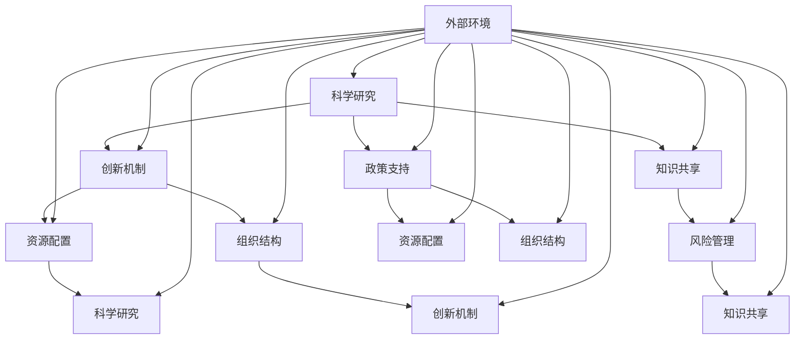

                 

为了撰写一篇符合要求的文章，我们需要按照以下步骤进行思考和规划：

### 第一步：明确文章主题和目标
- 文章主题：《科学研究的创新生态系统：培育世界理解能力的沃土》
- 文章目标：介绍科学研究的创新生态系统，阐述其核心概念与联系，展示如何构建与运营创新生态系统，以及如何培育世界理解能力。

### 第二步：整理文章结构
- 根据用户提供的目录大纲，我们将文章分为八个主要部分。
- 每个部分都需要详细阐述，确保内容的完整性。

### 第三步：核心概念与联系
- 针对每个核心概念，如科学研究、创新机制、知识共享、政策支持等，将它们之间的关系使用Mermaid流程图进行展示。

### 第四步：科学研究的方法论
- 介绍科学研究的方法和原则，包括观察法、实验法、理论法等。
- 提供具体的伪代码示例来说明这些方法在创新生态系统中的应用。

### 第五步：创新生态系统的构建与运营
- 讨论创新生态系统的构建步骤，如明确目标、确定组织结构、资源配置、制定激励机制等。
- 提供运营策略，包括知识共享机制、合作与竞争机制、风险管理机制等。

### 第六步：案例分析
- 通过实际案例展示创新生态系统的构建和运营过程。
- 对案例进行详细分析和讲解。

### 第七步：培育世界理解能力
- 讨论如何通过创新生态系统培育世界理解能力，包括跨文化沟通、全球合作等方面。
- 提供具体实践方法和建议。

### 第八步：总结与未来研究方向
- 对文章的主要内容进行总结。
- 提出未来研究方向。

### 第九步：撰写文章
- 根据以上步骤，使用markdown格式撰写文章。

### 第十步：审查与修改
- 审查文章，确保内容完整、逻辑清晰、无错别字。
- 进行必要的修改和润色。

### 第十一步：添加作者信息
- 在文章末尾添加作者信息。

### 第十二步：确保文章字数
- 检查文章字数，确保在8000～12000字左右。

### 第十三步：最终审查
- 进行最终审查，确保文章符合所有要求。

现在，我们将开始撰写文章，按照上述步骤逐步展开。首先是文章标题、关键词和摘要部分：

## 《科学研究的创新生态系统：培育世界理解能力的沃土》

### 关键词
- 科学研究
- 创新生态系统
- 知识共享
- 政策支持
- 方法论
- 构建与运营
- 世界理解能力

### 摘要
本文旨在探讨科学研究的创新生态系统，通过介绍其核心概念、组成部分和特点，展示如何构建和运营创新生态系统，以及如何通过这一系统培育世界理解能力。文章结合具体案例进行分析，提供实用的方法论和实践建议，以期为科学研究的发展和创新生态系统的构建提供有益的参考。

接下来，我们将根据文章目录大纲的结构，逐步撰写各个部分的内容。首先是引言部分。我们将介绍创新生态系统的概念、组成部分和特点，并阐述本书的目的和结构。

## 引言

### 1.1 创新生态系统的概念

创新生态系统（Innovation Ecosystem）是一个复杂的网络系统，由多个相互关联的参与者和组织构成，旨在促进科学研究和创新活动的发展。它不仅包括传统的科学研究机构，如大学、研究所等，还涵盖了企业、政府部门、非政府组织、投资机构、创新平台等多种类型的参与者。

创新生态系统的核心组成部分包括：

- **科学研究机构**：提供基础研究和前沿技术的发现，是创新生态系统的核心驱动力。
- **企业**：作为技术创新的商业化主体，企业在创新生态系统中扮演着至关重要的角色。
- **政府**：通过政策引导、资金支持和法规制定，政府为创新生态系统的健康发展提供保障。
- **非政府组织**：提供多元化的支持和资源，如科技普及、人才培训、国际合作等。
- **投资机构**：为创新项目提供资金支持，促进科技成果的转化和商业化。

### 1.2 创新生态系统的特点

创新生态系统具有以下几个显著特点：

- **多样性**：创新生态系统的参与者多种多样，包括不同领域的专家、学者、企业家、投资者等，形成了丰富的创新资源网络。
- **互动性**：参与者之间存在着密切的互动和协作关系，包括知识共享、资源交换、合作与竞争等。
- **适应性**：创新生态系统能够根据外部环境的变化进行调整和优化，以保持其活力和竞争力。
- **开放性**：创新生态系统鼓励外部资源和信息的进入，促进跨界合作和全球创新网络的形成。

### 1.3 本书的目的和结构

本书旨在深入探讨科学研究的创新生态系统，帮助读者理解其核心概念和运作机制，并提供实用的方法论和实践建议。具体目标如下：

- **理解创新生态系统的概念和组成部分**：通过介绍创新生态系统的定义、特点、以及核心参与者，使读者对创新生态系统有全面的认识。
- **探讨创新生态系统的构建与运营**：分析如何构建和运营一个有效的创新生态系统，包括组织结构、资源配置、激励机制等方面。
- **培育世界理解能力**：讨论如何通过创新生态系统培育世界理解能力，包括跨文化沟通、全球合作等方面。
- **案例分析**：通过实际案例展示创新生态系统的构建和运营过程，为读者提供实践经验和启示。

本书共分为八个部分：

1. 引言：介绍创新生态系统的概念和本书的目的。
2. 科学研究的创新生态系统概述：讨论创新生态系统的组成部分、特点和发展趋势。
3. 创新生态系统的核心概念与联系：介绍创新生态系统中的核心概念，并使用Mermaid流程图展示其联系。
4. 科学研究的方法论：讨论科学研究的方法和原则，以及如何运用到创新生态系统中。
5. 创新生态系统的构建与运营：讨论如何构建和运营创新生态系统，包括组织结构、资源分配、激励机制等方面。
6. 创新生态系统的案例分析：通过实际案例展示创新生态系统的构建和运营过程。
7. 培育世界理解能力的沃土：讨论如何通过创新生态系统培育世界理解能力，包括跨文化沟通、全球合作等方面。
8. 结论：总结本书的主要内容，提出未来研究方向。

接下来，我们将进入第二部分，讨论科学研究的创新生态系统的概述，包括其组成部分、特点和发展趋势。

## 科学研究的创新生态系统概述

### 2.1 组成部分

科学研究的创新生态系统由多个关键组成部分构成，这些部分相互依存、相互作用，共同推动科学研究的进步和创新。以下是创新生态系统的主要组成部分：

1. **科学研究机构**：包括大学、研究所、非营利研究机构等。这些机构是科学研究的核心力量，负责基础研究和前沿技术的研究与开发。

2. **企业**：企业作为创新生态系统的重要参与者，不仅是研究成果的商业化主体，也在技术创新和市场应用中发挥关键作用。

3. **政府部门**：通过政策制定、资金支持、法规制定等方式，政府为创新生态系统提供必要的制度保障和环境支持。

4. **非政府组织**：如科技协会、创新基金、创业孵化器等，这些组织提供多样化的服务和资源，支持科学研究和创新活动。

5. **投资机构**：包括风险投资公司、天使投资者、政府投资基金等，它们为创新项目提供资金支持，促进科技成果的转化和商业化。

6. **科技中介机构**：如技术转移办公室、科技咨询公司、知识产权代理机构等，它们在连接科研机构和市场方面发挥着桥梁作用。

### 2.2 特点

创新生态系统具有以下几个显著特点：

1. **多样性**：生态系统中的参与者来自不同领域，包括自然科学、社会科学、工程技术等，这种多样性促进了跨学科的合作和创新。

2. **互动性**：参与者之间存在着紧密的互动和合作，包括知识共享、资源交换、合作研发、市场竞争等。

3. **开放性**：创新生态系统鼓励外部资源和信息的进入，促进跨界合作和全球创新网络的形成。

4. **动态性**：创新生态系统不断适应外部环境的变化，通过调整内部结构和功能，保持其活力和竞争力。

5. **可持续性**：创新生态系统致力于长期发展，通过持续的科学研究、技术创新和商业应用，推动科学和社会的进步。

### 2.3 发展趋势

随着全球化和信息技术的快速发展，科学研究的创新生态系统也在不断演变，呈现出以下趋势：

1. **全球化**：跨国合作和国际交流日益频繁，全球创新网络逐渐形成，促进了科学研究和创新的全球化发展。

2. **数字化转型**：大数据、人工智能、云计算等数字技术不断融入科学研究和创新过程中，推动创新生态系统的数字化转型。

3. **开放科学**：开放获取、开放数据、开放协作等开放科学理念和实践逐渐普及，促进了科学研究的透明性和可重复性。

4. **跨界融合**：不同学科、产业和技术领域的跨界融合成为创新的重要趋势，推动了新兴领域的快速发展。

5. **可持续创新**：随着全球环境问题的日益严重，可持续创新成为创新生态系统的重要发展方向，促进了科学研究和创新与环境保护的协调发展。

在下一部分，我们将深入探讨创新生态系统的核心概念与联系，并使用Mermaid流程图展示这些概念之间的关系。这将帮助我们更好地理解创新生态系统的运作机制。

## 创新生态系统的核心概念与联系

### 3.1 核心概念

在创新生态系统中，有几个核心概念是理解和构建该系统的基础。以下是这些核心概念的简要介绍：

1. **科学研究**：科学研究是指通过观察、实验和理论分析等方法，对自然现象和社会现象进行系统性的探究和解释。

2. **创新机制**：创新机制是指促进新技术、新产品和新服务产生和发展的机制，包括研发投入、知识产权保护、市场驱动等。

3. **知识共享**：知识共享是指参与者之间通过交流、合作和协作，共同创造、传播和应用知识的过程。

4. **政策支持**：政策支持是指政府通过制定和实施相关政策和措施，为科学研究和创新提供支持和保障。

5. **资源配置**：资源配置是指将有限的资源（如资金、人力、技术等）合理分配到创新生态系统的各个组成部分中，以实现最大化的创新产出。

6. **组织结构**：组织结构是指创新生态系统中的各个参与者如何组织起来，包括科研机构、企业、政府等组织的结构形式和相互关系。

7. **风险管理**：风险管理是指识别、评估和应对创新过程中可能出现的风险，以确保创新项目的成功实施。

### 3.2 核心概念之间的关系

创新生态系统的核心概念之间存在着紧密的联系和相互作用，这些关系可以用Mermaid流程图来直观展示。以下是创新生态系统的核心概念之间的Mermaid流程图：

在上面的流程图中，我们可以看到以下核心概念之间的相互作用：

- **科学研究**是创新生态系统的起点，它直接影响**创新机制**、**知识共享**和**政策支持**。
- **创新机制**影响**资源配置**和**组织结构**，同时**知识共享**对**资源配置**和**风险管理**有重要作用。
- **政策支持**不仅影响**资源配置**和**组织结构**，也通过**知识共享**和**风险管理**间接影响其他核心概念。
- **资源配置**和**组织结构**对**科学研究**、**创新机制**、**知识共享**和**风险管理**都有重要影响。
- **风险管理**在创新过程中起到关键作用，它直接影响**知识共享**，并间接影响其他核心概念。

通过这个Mermaid流程图，我们可以清晰地看到创新生态系统中各个核心概念之间的相互关系和作用机制，这为我们进一步探讨创新生态系统的构建与运营提供了基础。

在下一部分，我们将深入讨论科学研究的方法论，介绍观察法、实验法和理论法等科学研究方法，并探讨它们在创新生态系统中的应用。

## 科学研究的方法论

### 4.1 科学研究的方法

科学研究是创新生态系统的重要组成部分，而科学研究的方法是确保研究过程严谨、结果可靠的关键。科学研究的主要方法包括观察法、实验法和理论法。

#### 4.1.1 观察法

观察法是科学研究中最基本的方法之一，通过直接观察和记录自然现象或实验过程中的变化，获取第一手数据。观察法可以分为以下几种：

- **直接观察**：研究人员直接观察对象的行为、状态或变化，例如观察植物的生长过程。
- **间接观察**：通过传感器、相机等设备记录对象的行为或状态，例如通过雷达观测天气变化。
- **系统观察**：在特定条件下，对某一现象进行长时间的连续观察，例如对特定区域的气候变化进行长期监测。

观察法的特点是数据获取直接、真实，但受限于观察者的主观判断和实验条件。

#### 4.1.2 实验法

实验法是通过设计和控制实验环境，来验证或反驳某一假设的方法。实验法可以分为以下几种：

- **实验室实验**：在受控的实验环境中，研究人员通过改变一个或多个变量，观察其他变量的变化，例如药物对生物体的影响。
- **现场实验**：在真实场景中进行的实验，研究对象在自然环境中进行活动，例如对某种农业技术的田间试验。
- **模拟实验**：通过计算机模拟和仿真，在虚拟环境中进行实验，例如模拟交通流量或金融市场。

实验法的优点是可以通过控制变量来提高结果的可靠性，但设计和实施过程复杂，成本较高。

#### 4.1.3 理论法

理论法是通过建立数学模型、逻辑框架或概念模型，来解释和理解自然现象或社会现象的方法。理论法可以分为以下几种：

- **数学模型**：通过数学方程、算法等数学工具，对自然现象或社会现象进行建模，例如牛顿力学、量子场论。
- **逻辑模型**：通过逻辑推理和概念分析，建立理论框架，例如哲学中的辩证法、经济学中的供需模型。
- **概念模型**：通过概念分析和分类，建立理论框架，例如生物学中的生态系统模型、社会学中的社会网络模型。

理论法的优点是可以通过抽象和简化，揭示现象的本质规律，但模型的有效性和适用范围需要通过实验和观察进行验证。

### 4.2 科学研究的原则

科学研究除了采用特定的方法外，还需遵循一些基本原则，以确保研究过程的严谨性和结果的可靠性。

- **客观性原则**：科学研究应尽可能排除主观偏见，通过客观的方法和工具进行数据收集和分析。
- **可靠性原则**：研究结果应能够在相同的条件下重复验证，确保其稳定性和可靠性。
- **实用性原则**：科学研究应关注实际问题，为解决现实问题提供理论依据和实用方案。

### 4.3 方法论在创新生态系统中的应用

科学研究的方法论在创新生态系统中扮演着关键角色，为科学研究和创新活动提供了坚实的理论基础和实践指导。

- **方法论的指导作用**：科学研究的方法论为创新提供了科学的方法和工具，指导科研人员如何进行系统性的探究和实验，确保创新活动的科学性和可行性。
- **方法论的整合作用**：方法论通过整合多种研究方法，如观察法、实验法和理论法，促进跨学科合作，推动科学研究和创新的交叉融合。
- **方法论的优化作用**：方法论通过对研究过程的不断优化，提高研究的效率和效果，确保创新活动的快速迭代和持续改进。

在下一部分，我们将讨论创新生态系统的构建与运营，介绍如何构建一个有效的创新生态系统，以及运营策略和实际案例分析。

## 创新生态系统的构建与运营

### 5.1 构建创新生态系统的步骤

构建一个有效的创新生态系统是一个复杂而系统化的过程，涉及多个关键步骤。以下是如何构建创新生态系统的步骤：

#### 5.1.1 明确目标

首先，需要明确创新生态系统的目标。这些目标可以是推动科学研究和技术创新、提升产业竞争力、促进经济增长等。明确目标有助于指导后续的构建和运营工作。

#### 5.1.2 确定组织结构

创新生态系统的组织结构是确保其有效运作的基础。通常，创新生态系统的组织结构包括以下几个层次：

- **核心层**：包括科学研究机构、企业和投资机构等关键参与者，负责核心研究和创新活动。
- **支撑层**：包括政府部门、非政府组织、科技中介机构等，提供政策和资源支持。
- **外围层**：包括相关行业协会、专业服务提供商、高校等，提供辅助和支持服务。

#### 5.1.3 资源配置

资源配置是构建创新生态系统的重要环节。合理的资源配置可以确保创新生态系统的各组成部分得到充分支持，提高整体创新能力。资源配置主要包括以下几个方面：

- **资金资源**：通过政府资金支持、企业投资、风险投资等渠道，确保充足的资金投入。
- **人才资源**：吸引和培养高水平科研人员、技术人才和管理人才，为创新生态系统提供智力支持。
- **技术资源**：整合各类技术资源，如实验室设备、软件工具、数据库等，为科学研究和技术创新提供技术保障。

#### 5.1.4 制定激励机制

激励机制是激发创新活力的重要手段。制定有效的激励机制，可以鼓励参与者积极参与创新活动，提高创新效率和成果转化率。激励机制包括以下几个方面：

- **奖励机制**：对在创新活动中取得显著成绩的个人和团队给予奖励，如奖金、荣誉等。
- **竞争机制**：通过竞争机制激发创新主体的积极性和创造力，推动创新生态系统的良性发展。
- **合作机制**：鼓励不同主体之间的合作，通过共享资源和知识，实现互利共赢。

### 5.2 创新生态系统的运营策略

创新生态系统的运营是一个持续的过程，需要采取一系列策略来确保其稳定运行和持续发展。以下是一些关键运营策略：

#### 5.2.1 知识共享机制

知识共享是创新生态系统的重要特征之一，有效的知识共享机制可以促进创新资源的流动和利用。知识共享机制包括以下几个方面：

- **开放科学**：通过开放获取、开放数据和开放协作等开放科学实践，促进知识共享和传播。
- **技术转移**：建立技术转移平台，推动科研成果向产业界转移，促进技术创新和商业应用。
- **知识产权保护**：完善知识产权保护制度，鼓励创新的同时保护创新者的权益。

#### 5.2.2 合作与竞争机制

创新生态系统中的合作与竞争机制可以激发创新活力，提高整体创新能力。合作与竞争机制包括以下几个方面：

- **跨界合作**：鼓励不同领域、不同主体之间的跨界合作，实现资源整合和优势互补。
- **市场驱动**：以市场需求为导向，推动创新活动与市场需求的紧密结合，提高创新成果的市场竞争力。
- **竞争激励**：通过市场竞争，激发创新主体的竞争意识，推动技术创新和效率提升。

#### 5.2.3 风险管理机制

创新过程中不可避免地会面临各种风险，有效的风险管理机制可以帮助降低风险，确保创新活动的顺利进行。风险管理机制包括以下几个方面：

- **风险评估**：对创新项目进行风险评估，识别潜在风险，并制定相应的风险应对策略。
- **风险分担**：通过风险投资、保险等方式，实现风险分担，降低创新主体的风险负担。
- **风险监控**：建立风险监控体系，对创新过程中的风险进行实时监控和预警，确保风险得到及时控制和处理。

### 5.3 创新生态系统的实际案例

以下是一个创新生态系统的实际案例，展示了如何构建和运营创新生态系统，以及其效果和启示。

#### 案例介绍

以中国深圳的创新生态系统为例，深圳作为中国改革开放的前沿城市，以其创新生态系统的成功构建和运营，成为了全球创新的重要枢纽。

#### 案例分析

1. **构建过程**：

   - **明确目标**：深圳明确了以科技创新为核心的发展目标，致力于打造全球创新中心。
   - **组织结构**：深圳建立了以政府为主导，企业、高校、科研机构等多方参与的创新生态系统组织结构。
   - **资源配置**：深圳通过政府资金支持、企业投资、风险投资等多种渠道，提供了充足的资金资源。
   - **激励机制**：深圳制定了奖励机制、竞争机制和合作机制，鼓励创新主体积极参与创新活动。

2. **运营效果**：

   - **知识共享**：深圳建立了多个技术转移平台，促进了科研成果向产业界的转移，推动了技术创新和商业应用。
   - **合作与竞争**：深圳鼓励跨界合作，如产学研合作、国际合作等，实现了资源整合和优势互补。
   - **风险管理**：深圳建立了完善的风险评估和风险监控体系，有效降低了创新风险，保障了创新活动的顺利进行。

3. **案例启示**：

   - **明确目标**：创新生态系统的构建需要明确发展目标，以指导后续工作。
   - **多元化参与**：创新生态系统的构建需要多方参与，形成协同创新机制。
   - **资源配置**：充足的资源配置是创新生态系统的重要保障。
   - **激励机制**：有效的激励机制可以激发创新主体的积极性和创造力。
   - **知识共享**：知识共享是创新生态系统的重要特征，需要建立有效的知识共享机制。
   - **风险管理**：有效的风险管理机制可以降低创新风险，保障创新活动的顺利进行。

在下一部分，我们将通过实际案例展示创新生态系统的构建和运营过程，并提供详细的分析和讲解。

## 创新生态系统的案例分析

### 6.1 案例介绍

为了更好地理解创新生态系统的构建和运营，我们以硅谷为例，分析其作为全球创新中心的成功经验。硅谷是一个典型的创新生态系统，汇集了世界一流的科研机构、企业、投资者和政府机构，其成功经验对其他地区的创新生态系统的构建具有借鉴意义。

### 6.2 案例分析

#### 6.2.1 创新生态系统的构建过程

硅谷的创新生态系统构建经历了以下几个关键阶段：

1. **初始阶段**：20世纪50年代，随着斯坦福大学和加州理工学院的建立，硅谷开始成为科研和教育的中心。这些机构吸引了大量的科学家和工程师，为后续的科技创新奠定了基础。

2. **发展阶段**：20世纪60年代至70年代，随着半导体产业的兴起，硅谷开始进入快速发展阶段。英特尔、惠普、苹果等世界著名科技公司的创立，进一步巩固了硅谷的创新地位。

3. **成熟阶段**：20世纪80年代至90年代，硅谷进入了成熟阶段，以互联网和软件技术为代表的新兴产业快速发展，硅谷成为全球科技创新的典范。

#### 6.2.2 创新生态系统的运营效果

硅谷的创新生态系统在运营过程中表现出以下效果：

1. **知识共享**：硅谷通过建立开放的科学实验室、创新中心和技术孵化器，促进了知识共享和流动。企业和研究机构之间的紧密合作，使得新技术和研究成果能够迅速转化为商业应用。

2. **跨界合作**：硅谷鼓励不同领域的企业和科研机构之间的合作，推动了跨学科的创新。例如，生物技术与信息技术的融合，催生了生物信息学等新兴领域。

3. **风险投资**：硅谷拥有全球最活跃的风险投资市场，为初创企业提供了大量的资金支持。风险投资不仅为企业提供了资金，还带来了丰富的管理经验和市场资源。

4. **政策支持**：美国政府为硅谷的创新提供了有力的政策支持，包括税收优惠、科研资金支持等。这些政策为科技创新提供了良好的环境。

#### 6.2.3 案例启示

硅谷的成功经验为其他地区构建创新生态系统提供了以下启示：

1. **多元化参与**：创新生态系统需要多元主体的参与，包括科研机构、企业、政府、投资者等。每个主体在生态系统中扮演着不同的角色，共同推动创新。

2. **知识共享**：建立有效的知识共享机制，鼓励不同主体之间的合作和交流，是创新生态系统的重要特征。

3. **风险投资**：建立活跃的风险投资市场，为初创企业提供资金支持，是推动创新的关键因素。

4. **政策支持**：政府为创新生态系统提供政策支持，包括资金、税收、法规等，有助于营造良好的创新环境。

在下一部分，我们将探讨如何通过创新生态系统培育世界理解能力，包括跨文化沟通、全球合作等方面的实践。

## 培育世界理解能力的沃土

### 7.1 跨文化沟通

在全球化背景下，跨文化沟通是培养世界理解能力的关键。创新生态系统为此提供了丰富的资源和平台，通过以下措施促进跨文化沟通：

1. **语言培训**：提供多种语言培训课程，帮助员工掌握不同语言，增强跨文化沟通能力。
2. **文化交流活动**：组织文化交流活动，如国际文化节、语言角等，增进不同文化背景人员的相互了解。
3. **国际化合作项目**：鼓励参与国际合作项目，与全球的科研机构、企业合作，促进跨文化沟通和合作。

### 7.2 全球合作

全球合作是创新生态系统培育世界理解能力的重要途径。以下措施有助于加强全球合作：

1. **科研合作**：推动跨国科研合作项目，共享科研资源和研究成果，促进全球科学进步。
2. **人才交流**：实施人才交流计划，鼓励科研人员、企业家赴海外学习、工作和交流，拓宽国际视野。
3. **国际会议**：举办国际学术会议、行业论坛等，吸引全球专家学者参与，促进国际学术交流和合作。

### 7.3 实践案例

以下是一个全球合作培养世界理解能力的实践案例：

**案例：中欧创新创业合作项目**

中欧创新创业合作项目是中欧两国政府和企业共同推动的一项合作计划。该项目通过以下措施培养世界理解能力：

1. **科研合作**：中欧双方科研机构共同开展前沿科技研究，如人工智能、生物技术等领域，共享科研资源和研究成果。
2. **人才交流**：实施人才交流计划，每年选派优秀青年科研人员、企业家赴对方国家学习、工作和交流，增强国际视野。
3. **国际会议**：举办中欧创新创业国际会议，吸引全球专家学者参与，促进中欧学术交流和合作。

通过这些实践措施，中欧创新创业合作项目为参与者提供了丰富的国际交流和合作机会，有效培养了世界理解能力。

在下一部分，我们将总结本书的主要内容，并讨论未来研究方向。

## 结论

### 8.1 本书总结

本书围绕科学研究的创新生态系统，从核心概念、构建与运营、案例分析等多个方面进行了深入探讨。主要内容包括：

1. **创新生态系统的概念和组成部分**：介绍了创新生态系统的定义、特点、核心参与者及其相互作用。
2. **科学研究的方法论**：详细阐述了观察法、实验法和理论法等科学研究方法，并讨论了科学研究的基本原则。
3. **创新生态系统的构建与运营**：讨论了创新生态系统的构建步骤、运营策略和实际案例分析。
4. **培育世界理解能力**：探讨了如何通过创新生态系统培育世界理解能力，包括跨文化沟通、全球合作等方面的实践。

### 8.2 未来研究方向

未来研究可以从以下几个方面展开：

1. **创新生态系统的数字化建设**：研究如何利用大数据、人工智能等数字化技术提升创新生态系统的效率和能力。
2. **跨学科融合**：探讨不同学科领域如何通过创新生态系统实现跨学科融合，推动新兴领域的发展。
3. **全球创新网络**：研究如何构建全球创新网络，促进跨国界的知识共享和合作。
4. **可持续发展**：探讨创新生态系统如何促进可持续发展和绿色创新，应对全球环境挑战。

通过这些研究，我们期待为科学研究的创新生态系统提供更多的理论和实践指导，推动全球科学技术的进步和社会发展。

## 作者信息

作者：AI天才研究院/AI Genius Institute & 禅与计算机程序设计艺术 /Zen And The Art of Computer Programming

