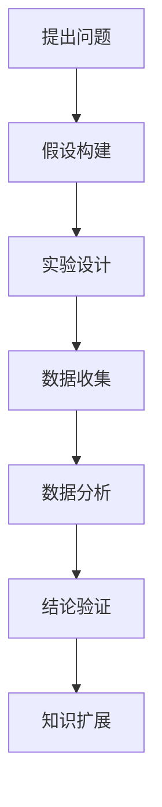
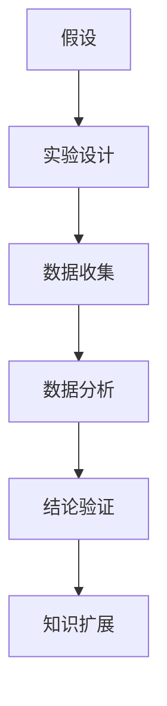

                 


### 背景介绍

科学研究作为人类探索自然、认识世界的重要手段，一直处于不断发展和进步的过程中。从古代的哲学思考到现代的实验验证，科学研究的本质在于通过系统的观察、实验和理论分析，不断拓展我们对世界的认知边界。然而，随着科学技术的飞速发展，我们面临的挑战也在不断增加。如何处理日益复杂的数据，如何理解微观世界与宏观宇宙的奥秘，这些问题都促使科学家们不断探索新的方法和技术。

在科学研究的过程中，方法论的选择至关重要。科学方法论不仅为研究提供了系统的框架，还确保了研究的严谨性和可重复性。从提出问题、建立假设，到实验设计、数据收集和分析，每一个环节都需要精细的规划和执行。伦理与道德问题同样不可忽视，科学研究必须遵循一定的伦理规范，保障人类和社会的利益。

前沿科学领域则展示了科学研究的无限可能性。量子科学、人工智能、宇宙学和生命科学等领域的突破，不仅拓宽了我们的认知边界，也为社会发展带来了新的动力。例如，量子计算有望在数据处理和加密领域取得革命性进展，人工智能则正在改变着我们的生活和工作方式。同时，宇宙学和生命科学的研究也在不断揭示宇宙的起源和生命的奥秘。

总之，科学研究的前沿探索不仅是人类对世界认知的拓展，也是推动社会进步的重要力量。本文将深入探讨科学研究的方法论、前沿领域以及其中的核心概念和算法原理，以期为大家提供一幅科学研究全景的图景。

## 第一部分：科学研究方法论

### 第1章：科学研究的本质与目标

科学研究的本质在于通过系统的观察、实验和理论分析，探索自然界的规律，解决实际问题，并推动知识体系的不断进步。科学研究的核心目标可以概括为以下三个方面：

1. **理解自然界的本质规律**：科学研究旨在揭示自然界的基本规律，从宏观现象到微观粒子，从生物进化到宇宙起源，科学家们通过不断地观察、实验和理论推导，试图构建一个统一的自然法则体系。

2. **解决实际问题**：科学研究不仅关注理论，还致力于解决实际问题和改善人类生活质量。例如，医学研究的目的在于治疗疾病，工程技术研究旨在提高生产效率和生活便利。

3. **推动知识进步**：科学研究的另一个重要目标是不断拓展人类的知识边界，推动科学理论的进步和科学方法的创新。这种知识的积累和更新是科技进步和社会发展的重要动力。

为了实现这些目标，科学研究通常遵循以下基本步骤：

1. **提出问题**：科学研究的起点是发现并提出问题。一个好的研究问题通常具有明确的科学意义，能够激发探索的欲望，引导科学家进行深入的研究。

2. **假设构建**：在提出问题之后，科学家需要建立假设。假设是对问题的可能答案或解释，它是科学研究的出发点。合理的假设需要基于现有的科学知识和理论，同时具有一定的创新性和可验证性。

3. **实验设计**：假设建立后，科学家需要设计实验来验证假设。实验设计包括选择实验对象、确定实验条件、制定实验步骤等。一个好的实验设计应确保实验结果的可靠性和可重复性。

4. **数据收集**：在实验过程中，科学家需要收集各种数据，这些数据可以是定量的，也可以是定性的。数据收集是科学研究的重要环节，数据的质量直接影响研究的可靠性。

5. **数据分析**：收集到数据后，科学家需要对数据进行处理和分析，提取有效信息，得出结论。数据分析方法包括统计、模型构建、数据挖掘等，这些方法的选择取决于研究问题的性质和数据类型。

6. **结论验证**：通过数据分析得出的结论需要进一步验证。这通常通过重复实验或与其他研究结果的比较来实现。结论的可靠性取决于实验设计的严谨性和数据分析的科学性。

7. **知识扩展**：在得出结论后，科学家需要将研究结果扩展到更广泛的情况，探索新的应用领域，并进一步丰富和完善科学理论。

下面是一个简单的Mermaid流程图，展示了科学研究的基本流程：



在这个流程图中，每个步骤都是相互关联的，前一个步骤的结果为下一个步骤提供基础。例如，实验设计需要基于假设构建，数据分析需要依赖于数据收集的质量，而结论验证则需要通过重复实验或外部比较来确保结果的可靠性。

### 核心概念与联系

在科学研究的过程中，有几个核心概念贯穿始终，它们之间存在着密切的联系和相互作用。以下是这些核心概念及其关系：

1. **假设**：假设是对研究问题的可能答案或解释。它是科学研究的出发点，通常基于现有的科学知识和理论。合理的假设需要具有可验证性和创新性。

2. **实验设计**：实验设计是实现假设验证的关键步骤。它包括选择实验对象、确定实验条件、制定实验步骤等。实验设计的目标是确保实验结果的可靠性和可重复性。

3. **数据收集**：数据收集是实验过程中的一项基本任务。收集的数据可以是定量的，也可以是定性的。数据的质量直接影响研究的可靠性。数据收集通常需要使用各种仪器和技术手段。

4. **数据分析**：数据分析是数据收集后的下一步。它涉及使用统计方法、模型构建和数据挖掘技术来处理数据，提取有效信息。数据分析方法的选择取决于研究问题的性质和数据类型。

5. **结论验证**：结论验证是确保研究结果可靠性的关键步骤。它通常通过重复实验或与其他研究结果的比较来实现。结论的可靠性取决于实验设计的严谨性和数据分析的科学性。

6. **知识扩展**：在得出结论后，科学家需要将研究结果扩展到更广泛的情况，探索新的应用领域，并进一步丰富和完善科学理论。

为了更好地理解这些概念之间的联系，我们可以使用Mermaid流程图来展示它们：



在这个流程图中，假设通过实验设计转化为具体的实验方案，数据收集为实验提供了实验结果，数据分析则对这些结果进行处理和解释，结论验证确保了结果的可靠性，最终通过知识扩展将研究成果应用到更广泛领域。

### 数学模型和数学公式讲解

在科学研究中，数学模型和公式是描述和研究自然界现象的重要工具。通过数学模型，科学家们能够将复杂的自然现象抽象成数学表达式，从而进行定量分析和预测。以下是一些常见且重要的数学模型和数学公式，并对其进行详细讲解和举例说明。

#### 回归模型

回归模型是统计学中一种常用的预测模型，用于研究因变量与自变量之间的关系。最简单的线性回归模型可以表示为：

$$
y = \beta_0 + \beta_1x + \varepsilon
$$

其中，\( y \) 是因变量，\( x \) 是自变量，\( \beta_0 \) 和 \( \beta_1 \) 分别是回归系数，\( \varepsilon \) 是误差项。这个模型假设因变量 \( y \) 与自变量 \( x \) 之间存在线性关系。

**举例说明**：假设我们要研究房屋价格 \( y \) 与房屋面积 \( x \) 之间的关系。通过收集数据，我们可以使用线性回归模型来估计房屋价格。例如，如果我们发现回归系数 \( \beta_1 \) 为0.5，这意味着每增加一平方米的房屋面积，房屋价格平均增加0.5单位。

#### 决策树模型

决策树是一种常用的机器学习算法，用于分类和回归问题。它通过一系列判断条件来对数据集中的每个样本进行分类或预测。决策树模型的决策过程可以用以下公式表示：

$$
\text{决策树：} \quad \begin{cases}
\text{条件A} & \text{则执行操作1} \\
\text{条件B} & \text{则执行操作2} \\
\text{条件C} & \text{则执行操作3} \\
\text{否则} & \text{执行默认操作}
\end{cases}
$$

**举例说明**：假设我们要建立一个决策树来预测客户是否会购买产品。我们可以设定几个条件，如客户的年龄、收入和购买历史。如果客户的年龄大于30岁，收入高于3万元，并且有过购买记录，则预测客户会购买产品；否则，预测客户不会购买。

#### 损失函数

损失函数是机器学习中用于评估模型性能的重要工具。它衡量模型预测值与实际值之间的差距。常用的损失函数包括均方误差（MSE）和交叉熵损失。

均方误差（MSE）公式为：

$$
L(\theta) = \frac{1}{2m} \sum_{i=1}^{m} (h_\theta(x^{(i)}) - y^{(i)})^2
$$

其中，\( m \) 是训练样本数量，\( h_\theta(x^{(i)}) \) 是模型对第 \( i \) 个样本的预测值，\( y^{(i)} \) 是实际值。

**举例说明**：假设我们使用线性回归模型预测房价，并使用MSE作为损失函数。每次预测误差都会被平方并求和，从而衡量模型的整体预测性能。

#### 对数似然函数

在对数似然函数中，我们通过最大化似然函数来估计模型的参数。似然函数可以表示为：

$$
L(\theta) = \prod_{i=1}^{m} p(y^{(i)}|\theta)
$$

其中，\( p(y^{(i)}|\theta) \) 是在给定参数 \( \theta \) 下，第 \( i \) 个样本出现的概率。

**举例说明**：假设我们要使用逻辑回归模型预测客户是否购买产品。通过对数似然函数，我们可以计算每个样本的概率并取对数，从而得到模型的损失函数。

### 项目实战

为了更好地理解上述数学模型和公式的应用，我们可以通过一个具体的案例来进行实践。以下是一个简单的线性回归模型实现，包括开发环境搭建、源代码实现和代码解读。

#### 开发环境搭建

首先，我们需要搭建一个简单的线性回归模型开发环境。假设我们使用Python作为编程语言，安装以下依赖库：

```
pip install numpy matplotlib
```

#### 源代码实现

```python
import numpy as np
import matplotlib.pyplot as plt

# 线性回归模型实现
class LinearRegression:
    def __init__(self):
        self.theta = None

    def fit(self, X, y):
        # 添加偏置项
        X_b = np.c_[np.ones((X.shape[0], 1)), X]
        # 梯度下降法求解回归系数
        self.theta = np.linalg.inv(X_b.T.dot(X_b)).dot(X_b.T).dot(y)

    def predict(self, X):
        # 预测结果
        X_b = np.c_[np.ones((X.shape[0], 1)), X]
        return X_b.dot(self.theta)

# 数据集加载
X = np.array([[1], [2], [3], [4], [5]])
y = np.array([1, 2, 2.5, 4, 5])

# 模型训练
model = LinearRegression()
model.fit(X, y)

# 预测结果
y_pred = model.predict(X)

# 可视化展示
plt.scatter(X, y)
plt.plot(X, y_pred, "r-")
plt.show()
```

#### 代码解读

1. **模型定义**：我们定义了一个`LinearRegression`类，其中`fit`方法用于模型训练，`predict`方法用于预测。

2. **模型训练**：在`fit`方法中，我们首先添加了一个偏置项（也称为截距项），然后使用梯度下降法求解回归系数。梯度下降法是一种常用的优化算法，通过不断调整参数，使损失函数的值最小。

3. **预测结果**：在`predict`方法中，我们使用训练好的模型对输入数据进行预测。

4. **数据集加载**：我们使用一个简单的数据集，其中 \( X \) 表示自变量，\( y \) 表示因变量。

5. **模型训练**：使用`model.fit(X, y)`训练模型。

6. **预测结果**：使用`model.predict(X)`得到预测结果。

7. **可视化展示**：使用`plt.scatter(X, y)`绘制原始数据点，使用`plt.plot(X, y_pred, "r-")`绘制预测直线，从而可视化模型的预测效果。

通过这个案例，我们可以看到如何使用Python实现线性回归模型，并理解其中的数学原理和代码实现。

### 最佳实践 tips、小结、注意事项、拓展阅读等内容

#### 最佳实践 tips

1. **数据清洗**：在进行数据分析之前，确保数据的质量和完整性。数据清洗是数据分析的重要前置步骤，可以避免后续分析中的错误。

2. **模型验证**：在训练模型时，使用交叉验证方法来评估模型的性能。交叉验证可以避免模型过拟合，提高模型的泛化能力。

3. **代码注释**：在编写代码时，添加清晰的注释可以帮助他人理解代码逻辑，提高代码的可读性和可维护性。

#### 小结

本文首先介绍了科学研究的本质与目标，以及科学研究的基本流程。随后，详细讲解了几个重要的数学模型和公式，包括回归模型、决策树模型和损失函数，并通过具体案例进行了代码实现和解读。这些内容为科学研究提供了坚实的理论基础和实践指导。

#### 注意事项

1. **科学伦理**：在进行科学研究时，务必遵循科学伦理和道德规范，保护研究对象的权益。

2. **数据安全**：保护数据隐私和安全是科学研究的重要一环，特别是在涉及个人或敏感数据时。

3. **持续学习**：科学研究是一个不断发展的领域，持续学习和更新知识是科学家必备的能力。

#### 拓展阅读

1. **《统计学习基础》**：李航著，详细介绍了统计学习的基础理论和应用方法。

2. **《机器学习》**：周志华著，系统地讲解了机器学习的理论基础和应用技术。

3. **《深入理解计算机系统》**：Randal E. Bryant & David R. O’Hallaron 著，深入剖析了计算机系统的原理和实现。

通过阅读这些书籍，可以进一步深入了解科学研究的方法和技术，提升自己的专业素养。

