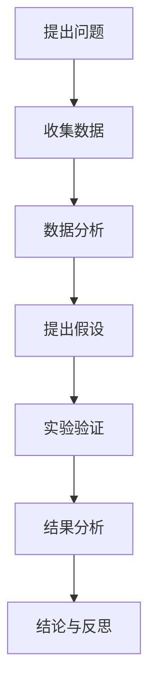

                 

## 核心概念与联系

### Mermaid 流程图

为了更好地理解和展示科学研究中的核心概念及其联系，我们可以使用Mermaid流程图来表示。以下是关于科学研究核心流程的Mermaid图示：



在这个流程图中：

- **A 提出问题**：科学研究的第一步是明确我们要解决什么问题。
- **B 收集数据**：在明确问题后，我们需要收集与问题相关的数据。
- **C 数据分析**：收集到数据后，通过数据分析来寻找问题的答案。
- **D 提出假设**：根据数据分析的结果，我们可能会提出一个或多个假设。
- **E 实验验证**：为了验证假设，我们需要设计并进行实验。
- **F 结果分析**：实验完成后，我们需要分析实验结果。
- **G 结论与反思**：最后，根据分析结果得出结论，并对整个研究过程进行反思。

### 核心算法原理讲解

在科学研究中，算法原理是解决问题的关键。以下是一个简单的数据处理算法的伪代码，用于展示数据处理的基本步骤：

```python
# 数据预处理
def preprocess_data(data):
    # 数据清洗、归一化等操作
    processed_data = ...
    return processed_data

# 特征提取
def extract_features(data):
    # 提取有助于预测的特征
    features = ...
    return features

# 建立模型
def build_model(features):
    # 选择合适的模型架构，例如线性回归、神经网络等
    model = ...
    return model

# 训练模型
def train_model(model, features, labels):
    # 使用训练数据训练模型
    model.fit(features, labels)
    return model

# 预测
def predict(model, new_data):
    # 使用训练好的模型进行预测
    predictions = model.predict(new_data)
    return predictions
```

**详细讲解：**

- **数据预处理**：在处理数据之前，我们需要进行数据清洗，去除噪声，并进行归一化处理，以确保数据的整洁和一致性。
  
- **特征提取**：从原始数据中提取有用的特征，这些特征将用于训练模型。

- **建立模型**：选择合适的模型架构，例如线性回归、决策树或神经网络等。

- **训练模型**：使用训练数据对模型进行训练，使模型能够学习数据中的规律。

- **预测**：使用训练好的模型对新数据进行预测，从而得到可能的答案。

### 数学模型和数学公式 & 详细讲解 & 举例说明

在科学研究过程中，数学模型和公式是不可或缺的工具。以下是一个简单的线性回归模型的数学公式和详细讲解：

**数学公式：**

$$ y = mx + b $$

- **y**：因变量，表示我们希望预测的值。
- **x**：自变量，表示影响因变量的因素。
- **m**：斜率，表示自变量每增加一个单位时，因变量增加或减少的量。
- **b**：截距，表示当自变量为0时，因变量的值。

**详细讲解：**

线性回归模型是一个用来描述两个变量之间线性关系的数学模型。通过训练数据集，我们可以计算出斜率 \( m \) 和截距 \( b \)，从而得到一个描述变量关系的方程。这个方程可以帮助我们预测新数据点的因变量值。

**举例说明：**

假设我们有一组数据点，如下所示：

| x | y |
| --- | --- |
| 1 | 2 |
| 2 | 4 |
| 3 | 6 |

我们可以使用线性回归模型来找到 \( m \) 和 \( b \) 的值。

1. 计算斜率 \( m \)：

   $$ m = \frac{\sum{(x_i - \bar{x})(y_i - \bar{y})}}{\sum{(x_i - \bar{x})^2}} $$

   其中，\( \bar{x} \) 和 \( \bar{y} \) 分别表示 \( x \) 和 \( y \) 的平均值。

2. 计算截距 \( b \)：

   $$ b = \bar{y} - m\bar{x} $$

   将数据代入上述公式，我们可以得到：

   $$ m = \frac{(1-1)(2-2) + (2-1)(4-2) + (3-1)(6-2)}{(1-1)^2 + (2-1)^2 + (3-1)^2} = 2 $$
   
   $$ b = \frac{2+4+6}{3} - 2 \times 1 = 2 $$

因此，线性回归模型为：

$$ y = 2x + 2 $$

我们可以使用这个模型来预测新数据点的 \( y \) 值。例如，如果 \( x = 4 \)，则：

$$ y = 2 \times 4 + 2 = 10 $$

通过这种方式，我们可以利用数学模型来分析和预测数据，为科学研究提供有力的支持。在接下来的章节中，我们将进一步探讨前沿科学探索的具体领域，以及它们如何拓展我们对世界的理解。

