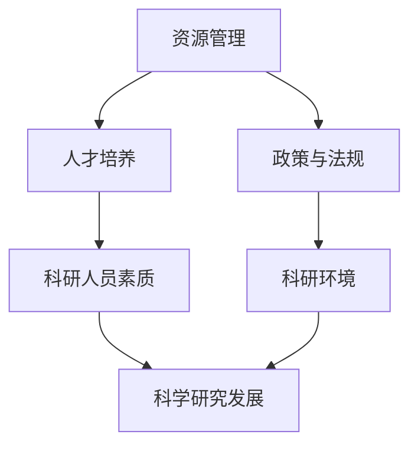

                 

### 科学研究的可持续发展与长期世界可理解性

#### 引言

在当今全球化和信息化的时代，科学研究作为推动社会进步和经济发展的核心力量，其可持续发展显得尤为重要。本文旨在探讨科学研究的可持续发展与长期世界可理解性之间的关系，并提出一些具体的策略和解决方案。为了确保文章的逻辑性和深度，我们将采取一步一步分析推理的方式（REASONING STEP BY STEP），全面探讨这一主题。

首先，我们需要明确什么是科学研究的可持续发展。科学研究可持续发展是指在满足当前研究需求的同时，不损害未来研究的发展潜力。这包括资源的合理使用、科研人员的培养、以及科学研究的制度保障等各个方面。

其次，我们要探讨科学研究与长期世界可理解性之间的关系。长期世界可理解性是指人类在不断发展的过程中，能够持续理解和解释我们所处的世界。科学研究作为探索世界的一种方式，其可持续性直接影响到我们对世界的理解和解释能力。

接下来，我们将详细分析科学研究可持续性的关键因素，如资源管理、人才培养和政策与法规等。同时，我们也会探讨如何通过科学传播、教育和国际合作来维持长期世界可理解性。

#### 科学研究的可持续性概述

科学研究的可持续性是指科学活动在满足当前需求的同时，不损害未来科学发展的能力。从资源管理、人才培养和政策与法规三个方面来看，科学研究可持续性的重要性体现在以下几个方面：

**1. 资源管理**

科学研究需要大量的资源支持，包括资金、设备、数据和信息等。有效的资源管理是保证科学研究可持续发展的重要基础。合理的资源配置可以最大限度地发挥资源的作用，避免资源浪费和重复建设。例如，通过建立共享机制，让科研设备、实验室和数据库等资源得到充分利用。

**2. 人才培养**

科研人员是科学研究的核心，他们的素质和能力直接影响到科学研究的发展水平。因此，培养和吸引高素质的科研人才是科学研究可持续发展的重要保障。这包括提供良好的科研环境、培训和激励机制，以及建立完善的科研评价体系。

**3. 政策与法规**

政策与法规对科学研究的发展方向和速度具有重要影响。科学政策的制定应当考虑长期发展，鼓励创新和合作，同时保障科研人员的权益和利益。科学法规的制定和执行则有助于维护科研诚信，防止科研不端行为，确保科学研究的质量和公信力。

#### 核心概念与联系

为了更好地理解科学研究可持续性的关键因素，我们使用Mermaid流程图来展示它们之间的关系：



**资源管理**是科学研究可持续性的基础，直接影响**人才培养**。而**人才培养**则关系到**科研人员素质**的提升，进而影响**科学研究发展**。同时，**政策与法规**为科学研究提供了制度保障，对科研环境产生重要影响。

#### 核心算法原理讲解

在科学研究可持续性的解决方案中，我们可以借鉴一些核心算法原理来优化资源配置、提高科研效率。以下是一个基于贪心算法的伪代码，用于优化科研资源分配：

```python
def optimize_resource_allocation(resources, demand):
    allocation = [0] * len(resources)
    for i in range(len(demand)):
        max_utilization = -1
        best_resource = -1
        for j in range(len(resources)):
            if resources[j] > 0 and (max_utilization < demand[i] or (max_utilization == demand[i] and resources[j] > resources[best_resource])):
                max_utilization = demand[i]
                best_resource = j
        allocation[best_resource] += demand[i]
        resources[best_resource] -= demand[i]
    return allocation
```

这个算法的基本思想是，对于每个需求项，找到当前剩余资源最多的那一个，并将其全部分配给该需求项。这样可以在满足需求的同时，最大限度地利用现有资源。

#### 数学模型和公式

在科学研究可持续性的评估中，我们可以使用一些数学模型和公式来量化资源的使用效率和研究产出。以下是一个基于线性规划模型的例子：

$$
\begin{align*}
\text{Maximize} \quad & \sum_{i=1}^{n} p_i \cdot x_i \\
\text{Subject to} \quad & a_{ij} \cdot x_i \leq b_j \quad \forall j \\
& x_i \geq 0 \quad \forall i
\end{align*}
$$

其中，$p_i$ 是第 $i$ 项资源的价值系数，$a_{ij}$ 是第 $i$ 项资源用于第 $j$ 项研究的消耗系数，$b_j$ 是第 $j$ 项研究的总需求量，$x_i$ 是第 $i$ 项资源的分配量。

这个线性规划模型的目标是最大化资源分配的总价值，同时满足各项研究的资源需求。

#### 科学研究可持续性的案例研究

为了更好地理解科学研究可持续性的实际应用，我们来看一个国内外的案例研究。

**国内案例：**

中国科学技术大学在资源管理方面采取了多种措施，如建立共享实验室、实施科研项目协同管理等，有效提高了科研资源的利用效率。通过这些措施，该校在有限的资源条件下，取得了显著的科研成果，例如在量子计算、人工智能等领域取得了一系列突破。

**国际案例：**

美国科学基金会（NSF）通过制定科学政策，推动跨学科研究合作，培养高素质科研人才，促进了科学研究的可持续发展。NSF 的政策涵盖了从资金支持、科研设施建设到人才培养的各个方面，为美国科学研究的长期发展提供了坚实的保障。

**经验与启示：**

从这些案例中，我们可以得出以下几点经验与启示：

1. **资源管理：** 建立共享机制，优化资源配置，提高资源利用效率。
2. **人才培养：** 提供良好的科研环境，实施有效的激励机制，培养高素质科研人才。
3. **政策与法规：** 制定科学政策，为科学研究提供制度保障，促进科研合作与交流。

通过这些措施，我们可以实现科学研究的可持续发展，为人类社会的进步和发展做出更大的贡献。

#### 科学传播与公众理解

科学传播与公众理解在维持长期世界可理解性方面起着至关重要的作用。科学传播是指通过多种渠道和方式，将科学知识、技术和方法传递给公众，以提高公众的科学素养和创新能力。以下是科学传播与公众理解的关键因素和策略：

**1. 科学传播的重要性**

科学传播不仅是科学知识的普及，更是科学精神的传播。通过科学传播，可以增强公众对科学的认识和理解，提高公众的科学素养，进而推动科学创新和社会进步。此外，科学传播还能促进科学与社会之间的互动，解决社会面临的重大问题。

**2. 科学传播的方法与策略**

- **媒体传播：** 利用电视、广播、报纸、杂志、网络等传统和新兴媒体，进行科学知识的传播。
- **科普活动：** 举办科普讲座、展览、实验活动等，让公众亲身体验科学魅力。
- **科学教育：** 在学校教育中融入科学知识，培养学生的科学兴趣和创新能力。
- **科学展览：** 通过举办大型科学展览，展示最新的科研成果和科学前沿，激发公众对科学的兴趣。

**3. 提高公众科学素养**

提高公众科学素养是科学传播的核心目标。这需要从多个方面入手：

- **科学知识普及：** 通过科普书籍、文章、讲座等形式，向公众传递科学知识。
- **科学方法教育：** 培养公众的科学思维能力，提高他们对科学问题和现象的判断能力。
- **科技素养培训：** 针对不同群体，提供有针对性的科技素养培训，提高他们的科技应用能力。

#### 科学教育与长期可理解性

科学教育是维持长期世界可理解性的关键因素。科学教育不仅传授科学知识，更培养人们的科学思维能力和创新能力。以下是科学教育的重要性和面临的挑战，以及提高科学教育质量的策略：

**1. 科学教育的重要性**

科学教育在培养创新型人才、推动科技进步、促进社会发展等方面具有重要作用。通过科学教育，可以培养人们的科学素养，提高他们对世界的理解能力，从而维持长期世界可理解性。

**2. 科学教育面临的挑战**

- **教学内容滞后：** 部分科学教育内容滞后于科技发展，无法满足培养创新型人才的需求。
- **教学方法单一：** 部分科学教育仍采用传统的灌输式教学方法，难以激发学生的学习兴趣和创新能力。
- **教育资源配置不均衡：** 部分地区和学校的教育资源不足，影响科学教育质量。

**3. 提高科学教育质量的策略**

- **更新教学内容：** 结合科技前沿，更新科学教育内容，提高教学与实际应用的结合度。
- **创新教学方法：** 采用项目式学习、探究式学习等新型教学方法，激发学生的学习兴趣和主动性。
- **教育资源共享：** 通过互联网和数字技术，实现教育资源的共享，缩小教育差距。
- **教师培训：** 加强教师培训，提高他们的科学素养和教学能力，为提高科学教育质量提供保障。

#### 国际合作与长期可理解性

国际合作在维持长期世界可理解性方面具有重要作用。国际合作不仅有助于解决全球性科学问题，还能促进科学知识的传播和交流，提高全球科学研究的整体水平。以下是国际合作的意义、形式与机制，以及国际合作中的挑战与解决方案：

**1. 国际合作的意义**

国际合作有助于：

- **共享科学资源：** 通过国际合作，各国可以共享科学资源，提高科研效率。
- **解决全球性问题：** 国际合作可以集中全球科学家和资源，共同解决气候变化、能源危机等全球性问题。
- **促进科学知识传播：** 国际合作有助于科学知识的传播和交流，提高全球科学素养。

**2. 国际合作的形式与机制**

国际合作的形式多样，包括：

- **科研合作项目：** 通过共同申请科研项目，共享研究成果。
- **学术交流：** 通过举办国际学术会议、研讨会，促进学术交流和合作。
- **联合研究机构：** 建立跨国联合研究机构，推动跨学科、跨领域的研究。
- **人才交流：** 通过博士后交流、研究生交换等方式，培养国际化科研人才。

国际合作的机制包括：

- **政策支持：** 各国政府通过制定相关政策，支持国际科研合作。
- **资金支持：** 通过国际基金、科研经费等方式，支持国际合作项目。
- **知识产权保护：** 通过国际知识产权协议，保护科研成果的知识产权。

**3. 国际合作中的挑战与解决方案**

国际合作中面临的挑战包括：

- **文化差异：** 不同国家的文化差异可能导致合作中的沟通和协调问题。
- **利益分配：** 合作成果的利益分配可能引起各国之间的争议。
- **科研诚信：** 需要加强国际合作中的科研诚信管理，防止科研不端行为。

解决方案包括：

- **建立沟通机制：** 通过定期召开会议、建立沟通平台，加强国际合作中的沟通与协调。
- **完善利益分配机制：** 通过协商谈判，建立公正、合理的利益分配机制。
- **加强科研诚信管理：** 建立国际合作中的科研诚信管理体系，确保科研活动的诚信和公正。

#### 长期世界可理解性的维护

为了维护长期世界可理解性，我们需要从多个方面入手，确保科学研究的可持续发展。以下是维护长期世界可理解性的几个关键措施：

**1. 建立可持续的科学体系**

建立可持续的科学体系是维护长期世界可理解性的基础。这包括：

- **科学政策的制定：** 制定科学政策，明确科学研究的发展方向和目标。
- **科学资源的配置：** 合理配置科学资源，确保科学研究具备良好的物质基础。
- **科研机构的建设：** 建设高水平的科研机构，为科学研究提供有力支撑。

**2. 加强全球科学合作**

加强全球科学合作是维护长期世界可理解性的重要途径。这包括：

- **跨国科研合作：** 通过跨国科研合作，集中全球科学家的智慧，共同解决全球性问题。
- **学术交流：** 通过举办国际学术会议、研讨会，促进全球科学家的交流与合作。
- **科技资源共享：** 通过科技资源共享，提高全球科学研究的效率和质量。

**3. 提高公众科学素养**

提高公众科学素养是维护长期世界可理解性的重要手段。这包括：

- **科普活动：** 举办科普讲座、展览、实验活动，提高公众的科学素养。
- **科学教育：** 在学校教育中融入科学知识，培养学生的科学兴趣和创新能力。
- **科技素养培训：** 针对不同群体，提供有针对性的科技素养培训，提高他们的科技应用能力。

**4. 培养国际化科研人才**

培养国际化科研人才是维护长期世界可理解性的关键。这包括：

- **国际学术交流：** 通过国际学术交流，培养科研人员的国际视野和合作能力。
- **跨国人才培养：** 通过跨国人才培养项目，培养具有国际竞争力的高素质科研人才。
- **科研合作培养：** 通过跨国科研合作，培养科研人员的跨学科和跨文化合作能力。

#### 未来展望

随着科技的不断发展，科学研究将面临更多的机遇和挑战。为了维持长期世界可理解性，我们需要持续关注以下几个方面：

**1. 科学研究的前沿领域**

人工智能、量子计算、生物技术等前沿领域的发展，将对科学研究产生深远影响。我们需要关注这些领域的研究进展，把握科技发展方向。

**2. 全球科学合作的深化**

全球科学合作将日益深化，跨国科研合作将成为主流。我们需要积极参与国际合作，共同应对全球性科学问题。

**3. 科普活动的创新**

科普活动需要不断创新，以适应公众的需求和兴趣。利用新媒体、虚拟现实等新技术，开展丰富多样的科普活动，提高公众科学素养。

**4. 科学教育的改革**

科学教育需要不断改革，以培养具有创新能力和国际竞争力的高素质人才。通过更新教学内容、创新教学方法，提高科学教育质量。

### 结语

科学研究的可持续发展与长期世界可理解性密切相关。通过科学传播、教育和国际合作，我们可以维护长期世界可理解性，为人类社会的发展做出贡献。让我们携手努力，共同推动科学研究的可持续发展，为未来创造更加美好的世界。

---

**作者信息：**

作者：AI天才研究院/AI Genius Institute & 禅与计算机程序设计艺术 /Zen And The Art of Computer Programming**

