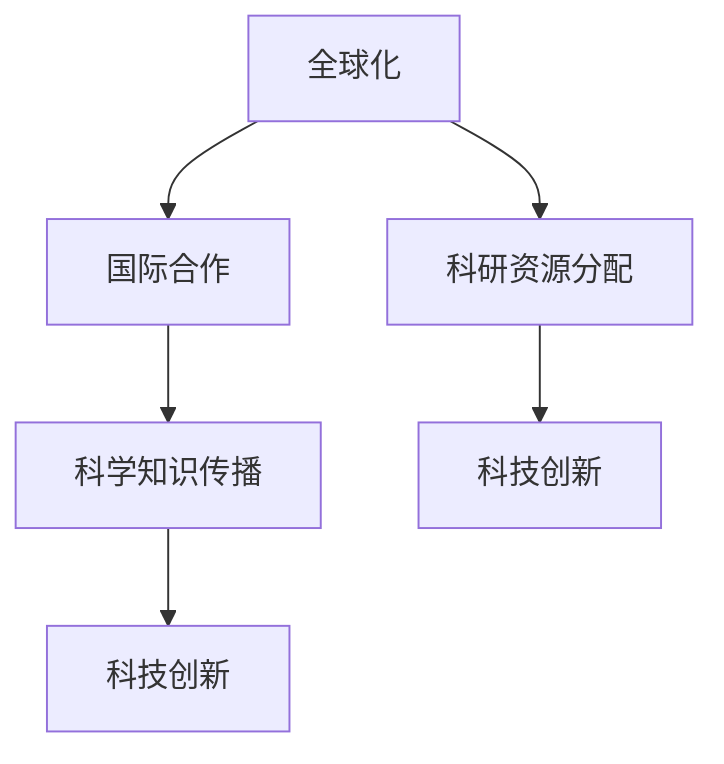
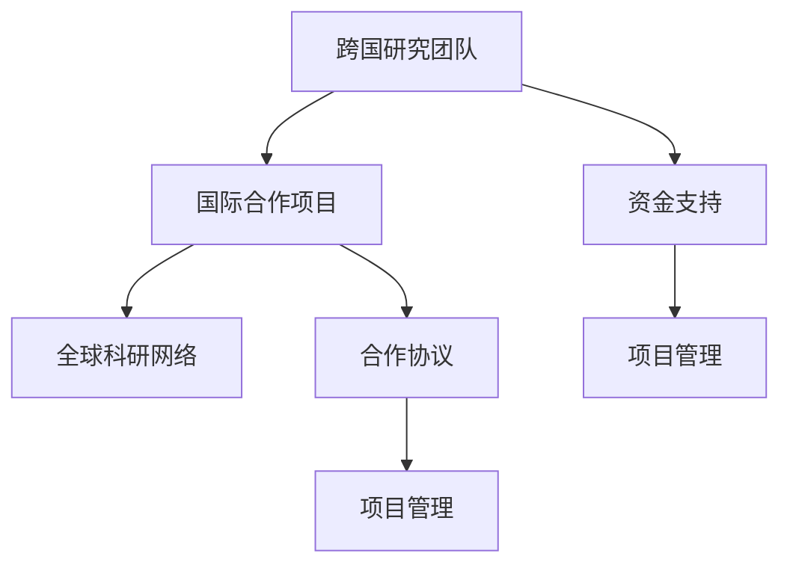
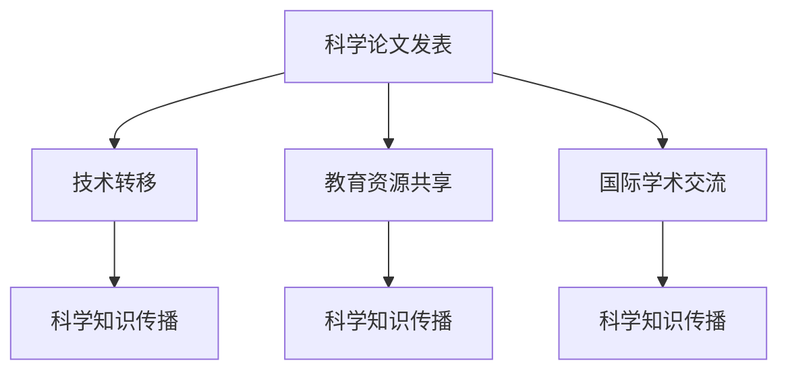
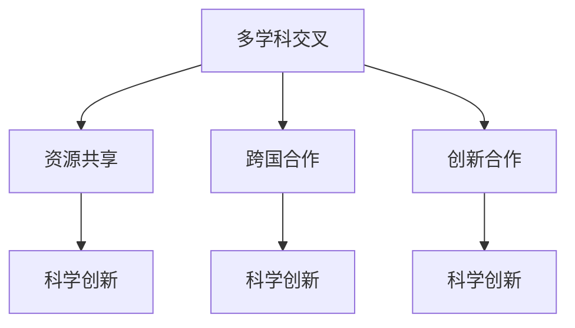
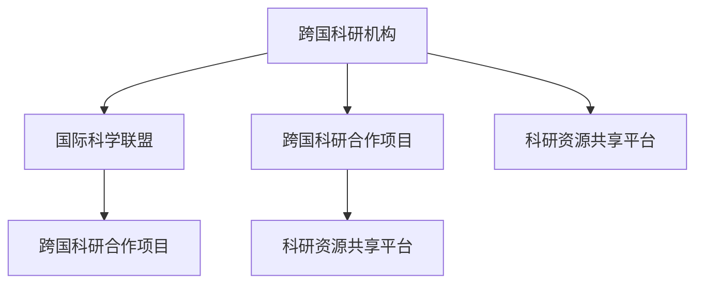
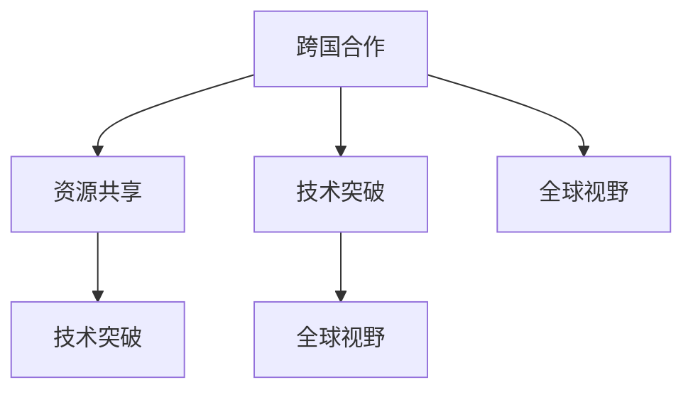
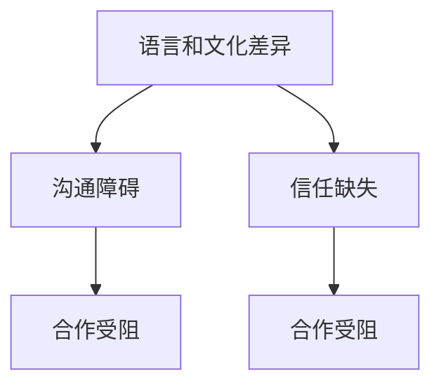

                 

当然，我们可以一步步构建这篇技术博客文章。为了确保文章的完整性和质量，我们将遵循以下步骤：

### 第一步：文章标题、关键词和摘要

首先，我们需要确定文章的标题、关键词和摘要。根据目录大纲，文章的标题可以是“科学研究的国际合作：拓宽世界可理解性的全球视野”。

关键词：科学研究，国际合作，全球视野，可理解性，知识传播，技术创新。

摘要：本文探讨了科学研究的国际合作如何通过促进知识传播和科技创新，拓宽全球对世界的可理解性。文章分析了国际合作的历史背景、机制形式，以及其在科学知识传播、科学创新和全球科研网络中的作用。

### 第二步：构建文章结构

接下来，我们将根据目录大纲构建文章的主要部分。每个部分将包括背景介绍、核心概念与联系、算法原理讲解、数学模型和公式讲解、项目实战等。

### 第三步：撰写第一部分

#### 第1章：国际合作的背景与重要性

在这一部分，我们将介绍国际合作在科学研究中的起源、发展及其重要性。包括：

- 国际合作的历史背景
- 国际合作在科学研究中的地位
- 国际合作对全球科研环境的影响

#### 第2章：国际合作的形式与机制

在这一部分，我们将讨论国际合作的形式、机制以及相关的法律和政策环境。包括：

- 国际合作的形式：研究团队、项目管理和科研合作网络
- 国际合作的机制：合作协议、资金支持和项目管理
- 国际合作的法律与政策环境

### 第四步：撰写第二部分

#### 第3章：国际合作与科学知识的传播

在这一部分，我们将分析国际合作如何促进科学知识的传播，包括：

- 国际合作与科学论文的发表
- 国际合作与科学技术的普及
- 国际合作对科学教育的贡献

#### 第4章：国际合作与科学创新

在这一部分，我们将探讨国际合作如何推动科学创新，包括：

- 国际合作对科学发现的影响
- 国际合作与科学前沿探索
- 国际合作对科学技术的创新推动

#### 第5章：国际合作与全球科学合作网络

在这一部分，我们将描述国际合作如何构建全球科学合作网络，包括：

- 全球科学合作网络的构成
- 国际合作对全球科研资源配置的影响
- 国际合作对全球科学合作模式的影响

### 第五步：撰写第三部分

#### 第6章：国际合作案例分析

在这一部分，我们将通过案例分析来展示国际合作的实际效果，包括：

- 人类基因组计划
- 国际空间站合作
- 南极科考国际合作

#### 第7章：国际合作中的挑战与解决方案

在这一部分，我们将讨论国际合作中可能遇到的挑战以及相应的解决方案，包括：

- 语言与文化差异
- 科研资源分配不均
- 科技竞争与合作

### 第六步：撰写附录

在附录部分，我们将提供国际合作资源与工具的指南，包括：

- 国际合作研究机构介绍
- 国际合作科研项目指南
- 国际合作科研工具与平台

### 第七步：撰写结语和作者信息

最后，我们将为文章撰写结语，总结全文，并提出未来研究方向。同时，在文章末尾添加作者信息。

### 第八步：检查和修改

完成初稿后，我们将对文章进行仔细的检查和修改，确保文章内容完整、逻辑清晰、结构紧凑，并且符合字数要求。

通过以上步骤，我们将逐步构建出符合用户要求的技术博客文章。现在，让我们开始撰写第一部分的内容吧。在撰写过程中，我们将遵循上述步骤，确保文章的质量和完整性。接下来，我们将撰写第1章的背景介绍和核心概念与联系。在接下来的步骤中，我们将继续完善其他章节的内容。

## 第1章：国际合作的背景与重要性

### 背景介绍

科学研究是一个不断发展的过程，随着全球化和信息技术的快速发展，科学研究的国际合作变得越来越重要。国际合作的起源可以追溯到17世纪的科学革命，当时科学家们开始通过信件和书籍交流科学知识。然而，现代科学研究的国际合作则是在20世纪中叶随着第二次世界大战后科技复兴和国际组织的发展而逐渐形成。

国际合作在科学研究中的地位主要体现在以下几个方面：

1. **资源共享**：国际合作使得各国科学家可以共享实验室设备、研究资源和数据，从而提高科研效率。
2. **知识传播**：国际合作促进了科学知识的全球传播，使得发展中国家也能够参与到先进的科学研究中来。
3. **技术转移**：国际合作有助于将科学研究成果转化为实际应用，促进技术的全球扩散。
4. **人才培养**：国际合作为科学家提供了交流和学习的机会，有助于培养全球化的科研人才。

### 核心概念与联系

在探讨国际合作的重要性时，我们需要理解以下几个核心概念：

1. **全球化**：全球化是国际合作的背景，它推动了各国间的交流与合作。
2. **科学知识传播**：科学知识传播是国际合作的核心目标之一，它通过跨国界的合作促进了科学研究的进步。
3. **科研资源分配**：科研资源的分配是国际合作的重要方面，它决定了各国在科学研究中的地位和影响力。
4. **科技创新**：科技创新是国际合作的重要成果，它通过跨国界的合作推动了科学技术的进步。

这些概念之间的联系可以用以下Mermaid流程图表示：



### 算法原理讲解

在本节中，我们将使用伪代码来解释如何进行国际合作项目的管理和评估。以下是一个简化的例子：

```python
def manage_international_project(countries, resources, goals):
    # 初始化项目
    project = initialize_project(countries, resources, goals)
    
    # 分配资源
    allocate_resources(project)
    
    # 管理项目
    while not project.is_completed():
        monitor_project_progress(project)
        if project.is_at_risk():
            adjust_resources(project)
        else:
            continue_project(project)
    
    # 评估项目
    evaluate_project(project)
    
    # 输出结果
    return project成果
```

### 数学模型和公式讲解

在国际合作中，科研资源的分配往往需要考虑各国的贡献度和需求。我们可以使用以下公式来计算每个国家的资源分配比例：

$$
\text{分配比例} = \frac{\text{该国贡献度}}{\sum_{i=1}^{n} \text{各国贡献度}}
$$`

举例来说，假设有两个国家A和B，A国的贡献度为40，B国的贡献度为60，那么它们的资源分配比例为：

$$
\text{A国比例} = \frac{40}{40+60} = 0.4 \\
\text{B国比例} = \frac{60}{40+60} = 0.6
$$`

### 项目实战

在本节中，我们将通过一个实际案例来说明国际合作在科学研究中的应用。假设有一个跨国团队合作进行一个环境监测项目，项目目标是在三个不同国家收集空气、水和土壤样本，分析污染物的含量。

1. **开发环境搭建**：团队成员需要搭建一个协作平台，用于数据共享和项目进度跟踪。可以使用GitHub或GitLab等代码托管平台，以及JIRA或Trello等项目管理工具。

2. **源代码详细实现和代码解读**：团队成员需要编写代码来收集、处理和分析样本数据。以下是一个简化的Python代码示例，用于处理空气样本数据：

```python
def analyze_air_sample(data):
    # 初始化结果字典
    results = {"CO2": 0, "SO2": 0, "NO2": 0}
    
    # 处理数据
    for sample in data:
        results["CO2"] += sample["CO2"]
        results["SO2"] += sample["SO2"]
        results["NO2"] += sample["NO2"]
    
    # 计算平均值
    results["CO2"] /= len(data)
    results["SO2"] /= len(data)
    results["NO2"] /= len(data)
    
    # 输出结果
    return results
```

3. **代码应用解读与分析**：上述代码用于计算多个空气样本中污染物的平均值。团队成员需要确保数据的质量和一致性，并使用适当的统计分析方法来解读结果。

4. **实际案例分析和详细讲解剖析**：在这个案例中，团队成员可以从不同国家的样本数据中分析污染物的差异，探讨其背后的原因，如工业化水平、气候条件和地理特征等。

5. **项目小结**：项目完成后，团队成员需要撰写报告，总结项目的成果和经验，并提出改进建议。

### 最佳实践 tips、小结、注意事项、拓展阅读等内容

- **最佳实践 tips**：在国际合作项目中，团队成员需要保持良好的沟通和协作，定期召开会议，确保项目的顺利进行。
- **小结**：国际合作在科学研究中的重要性体现在资源共享、知识传播、科技创新和人才培养等方面。
- **注意事项**：在跨国合作中，团队成员需要尊重不同国家的文化差异和法律法规，确保项目的合法性和有效性。
- **拓展阅读**：读者可以进一步了解国际合作在科学研究中的应用，如国际空间站合作、人类基因组计划等。

---

以上是第1章的详细内容，我们按照用户要求逐步构建了文章的各个部分。在接下来的章节中，我们将继续深入探讨国际合作的形式与机制，以及其对科学知识传播、科学创新和全球科学合作网络的影响。通过逐步分析推理，我们将为读者呈现一篇结构清晰、内容丰富的技术博客文章。

---

## 第2章：国际合作的形式与机制

### 背景介绍

在国际合作日益成为科学研究重要组成部分的背景下，理解和分析国际合作的形式与机制显得尤为重要。这一章节将深入探讨国际合作在科学研究中的具体表现形式，以及这些合作机制如何运作和影响科学研究的发展。

### 国际合作的形式

国际科学研究合作可以采取多种形式，每种形式都有其独特的特点和应用场景。以下是几种常见的国际合作形式：

1. **跨国研究团队**：这种形式涉及不同国家的科学家组成一个联合研究团队，共同开展研究项目。这种形式的优点在于可以整合各方的专业知识和资源，提高研究效率。

2. **国际合作项目**：这种形式是通过签订合作协议，由多个国家或组织共同参与一个特定的研究项目。这些项目通常有明确的科研目标和时间表，并依靠跨国界的资金、设备和人才支持。

3. **全球科研网络**：这种形式是通过建立全球性的科研合作网络，促进各国科学家之间的交流和合作。这些网络通常有固定的合作机制和资源共享平台，如开放科学数据库和在线合作工具。

4. **联合研究中心**：这种形式是多个国家或组织共同建立的研究中心，旨在开展跨学科、跨领域的重大科研项目。这些研究中心通常具有先进的实验设施和强大的科研团队。

### 国际合作的机制

国际科学研究合作的顺利实施依赖于一系列合作机制，这些机制包括：

1. **合作协议**：合作协议是国际科学合作的基础，它明确了参与各方在项目中的权利和义务，规定了科研目标、资金分配、知识产权归属等问题。

2. **资金支持**：国际合作项目通常需要大量的资金支持，这些资金可以来自政府、企业、国际组织和私人基金会。资金支持的稳定性和充足性是项目成功的关键。

3. **项目管理**：有效的项目管理是确保国际合作项目顺利进行的重要手段。这包括项目计划、进度监控、风险管理和成果评估等。

4. **法律与政策环境**：国际合作在法律和政策环境方面需要遵守各国的相关法律法规。同时，国际组织和多边协议为国际科学合作提供了法律保障。

### 核心概念与联系

在国际合作的研究团队、项目管理和科研合作网络中，存在一些关键概念，它们相互关联并共同推动科学研究的发展。以下是这些核心概念及其相互关系：

1. **跨国研究团队**：这是国际合作的基础，通过跨国合作实现知识和资源的共享。其成功依赖于团队成员之间的信任和协作。

2. **国际合作项目**：这些项目是跨国研究团队的具体体现，它们是科研目标和资金支持的载体，推动科学研究的进展。

3. **全球科研网络**：这是国际合作项目在更广泛范围内的扩展，通过建立科研网络，科学家们可以更容易地共享数据和资源，提高科研效率。

4. **合作协议**：这是国际合作的法律基础，确保各方在项目中的权益和责任明确。

5. **资金支持**：资金支持是国际合作项目得以实施的重要保障，它确保了项目的持续性和稳定性。

6. **项目管理**：项目管理确保了国际合作项目的顺利进行，包括计划制定、进度控制、风险管理等。

7. **法律与政策环境**：这是国际合作的外部环境，它影响了国际合作的可行性和可持续性。

这些概念之间的联系可以用以下Mermaid流程图表示：



### 算法原理讲解

在本节中，我们将使用伪代码来解释如何进行国际合作项目的资金分配和管理。以下是一个简化的例子：

```python
def allocate_funding(countries, budget, contribution):
    # 初始化资金分配字典
    funding_allocation = {}
    
    # 根据各国的贡献度分配资金
    for country in countries:
        contribution_ratio = contribution[country] / sum(contribution.values())
        funding_allocation[country] = budget * contribution_ratio
    
    # 输出资金分配结果
    return funding_allocation
```

### 数学模型和公式讲解

在国际合作项目中，资金分配的公平性和合理性至关重要。以下是一个简单的资金分配模型，用于计算每个国家的资金分配比例：

$$
\text{资金比例} = \frac{\text{该国贡献度}}{\sum_{i=1}^{n} \text{各国贡献度}}
$$`

举例来说，假设有三个国家A、B和C，它们的贡献度分别为30、40和30，总预算为100万美元，那么它们的资金分配比例如下：

$$
\text{A国比例} = \frac{30}{30+40+30} = 0.3 \\
\text{B国比例} = \frac{40}{30+40+30} = 0.4 \\
\text{C国比例} = \frac{30}{30+40+30} = 0.3
$$`

### 项目实战

在本节中，我们将通过一个实际案例来说明国际合作在资金分配和项目管理中的应用。假设一个国际合作项目涉及四个国家，每个国家的预算分配和项目进度如下：

1. **开发环境搭建**：团队成员需要在GitHub上创建一个项目仓库，用于存储项目文档、代码和进度报告。

2. **源代码详细实现和代码解读**：项目团队需要编写一个Python脚本，用于计算每个国家的资金分配比例，并根据进度报告调整预算。

3. **代码应用解读与分析**：团队成员需要确保资金分配的公平性和合理性，并根据项目进度调整预算分配。

4. **实际案例分析和详细讲解剖析**：在这个案例中，项目团队需要分析不同国家的资金使用效率，优化预算分配，确保项目顺利推进。

5. **项目小结**：项目完成后，团队成员需要撰写报告，总结项目的成果和经验，并提出改进建议。

### 最佳实践 tips、小结、注意事项、拓展阅读等内容

- **最佳实践 tips**：在国际合作项目中，团队成员需要明确各自的职责和权限，建立良好的沟通渠道，确保项目的顺利进行。

- **小结**：国际合作的形式与机制多样，涵盖了跨国研究团队、国际合作项目、全球科研网络等多种形式，这些合作机制共同推动了科学研究的发展。

- **注意事项**：在国际合作中，法律与政策环境的差异可能对项目造成影响，项目团队需要提前了解并遵守各国的法律法规。

- **拓展阅读**：读者可以进一步了解国际合作项目的成功案例，如国际空间站合作、人类基因组计划等，以获取更多实践经验和启示。

---

通过以上内容，我们详细介绍了国际合作的形式与机制，包括跨国研究团队、国际合作项目、全球科研网络以及相关的合作协议、资金支持、项目管理和法律政策环境。在接下来的章节中，我们将继续探讨国际合作如何促进科学知识的传播和科学创新，以及其在全球科学合作网络中的作用。让我们继续深入分析，探索国际合作的更多可能性和挑战。

---

## 第3章：国际合作与科学知识的传播

### 背景介绍

科学知识的传播是科学研究过程中至关重要的一环，它不仅关系到科研成果的广泛应用，也影响到科学技术的普及和科学教育的深化。国际合作在这一过程中发挥了至关重要的作用，通过促进科学知识的跨国界传播，推动了全球科学共同体的形成和发展。本章将重点探讨国际合作在科学知识传播方面的作用，包括国际合作与科学论文的发表、科学技术的普及以及科学教育的贡献。

### 国际合作与科学论文的发表

科学论文的发表是科学知识传播的主要途径之一。在国际合作的环境下，科学论文的发表具有以下几个特点：

1. **多语言发表**：国际合作使得科学论文可以跨越语言障碍，以多种语言发表，从而提高了科学知识的可获取性。

2. **跨国合作研究**：国际合作项目往往涉及到多个国家的科学家，他们共同开展研究并撰写论文，这样可以充分利用不同国家的专业知识和研究资源，提高论文的质量和影响力。

3. **国际合作论文的影响**：国际合作论文通常具有更高的引用率和更广泛的读者群体，因为它们代表了多个国家的科研努力和学术成果。

4. **开放获取**：国际合作项目往往支持开放获取的出版模式，使得科学论文更加容易被全球范围内的研究人员和学生获取，促进了科学知识的自由传播。

### 国际合作与科学技术的普及

科学技术的普及是推动社会发展的重要动力，国际合作在这一过程中也发挥着关键作用：

1. **跨国技术转移**：国际合作促进了先进科学技术的跨国转移，使得发展中国家能够引进和吸收国际先进的科技成果，提高本国的科技水平。

2. **科技合作项目**：国际合作项目往往涉及到科技示范和应用，通过这些项目，国际先进技术可以在全球范围内推广和应用，提高全球科技普及水平。

3. **国际科技论坛和会议**：国际科技论坛和会议为各国科学家提供了交流平台，通过这些平台，科学家们可以分享最新的科研成果和技术进展，推动科学技术的普及。

### 国际合作对科学教育的贡献

国际合作不仅推动了科学知识的传播和科学技术的普及，还对科学教育产生了深远影响：

1. **教育资源共享**：国际合作使得各国科学教育资源可以共享，包括教材、课程、实验设备和在线教育平台。这种资源共享有助于提高科学教育的质量和可及性。

2. **跨国教育合作**：国际合作项目通常包括跨国教育合作，例如国际联合培养博士生和博士后项目，通过这些项目，学生和研究人员可以获得跨文化的科研和教育经验。

3. **国际学术交流**：国际合作促进了国际学术交流，科学家和教育工作者可以通过参加国际会议、访问交流和合作研究，拓宽视野，提高学术水平。

### 核心概念与联系

在国际合作与科学知识传播的过程中，存在以下几个核心概念，它们相互关联，共同推动科学知识在全球范围内的传播：

1. **科学论文发表**：这是科学知识传播的主要形式之一，国际合作通过跨国研究团队和开放获取出版模式，促进了科学论文的多语言发表和国际影响力。

2. **技术转移**：国际合作促进了先进科学技术的跨国转移和普及，使得全球范围内的科学和技术水平得到提升。

3. **教育资源共享**：国际合作促进了科学教育资源的共享，提高了科学教育的质量和可及性。

4. **国际学术交流**：国际合作促进了国际学术交流和跨国教育合作，拓宽了科学工作者的视野，提高了全球科学共同体的学术水平。

这些概念之间的联系可以用以下Mermaid流程图表示：



### 算法原理讲解

在本节中，我们将使用伪代码来解释如何进行国际合作科学论文的选题和撰写。以下是一个简化的例子：

```python
def select_and_write_paper(topics, expertise, resources):
    # 根据专家知识和可用资源选择论文题目
    selected_topics = select_topics_by_expertise(topics, expertise)
    
    # 分配资源并撰写论文
    for topic in selected_topics:
        allocate_resources_to_paper(topic, resources)
        write_paper(topic)
        
    # 输出论文列表
    return selected_topics
```

### 数学模型和公式讲解

在国际合作科学论文的发表过程中，科学影响力的评估是一个关键环节。以下是一个简单的科学影响力评估模型，用于计算论文的影响力指数：

$$
\text{影响力指数} = \frac{\text{引用次数}}{\text{发表时间}}
$$`

举例来说，假设一篇论文在发表后一年内被引用了50次，那么它的年影响力指数为：

$$
\text{影响力指数} = \frac{50}{1} = 50
$$`

### 项目实战

在本节中，我们将通过一个实际案例来说明国际合作在科学知识传播中的应用。假设一个国际合作项目涉及四个国家，每个国家的科学论文发表情况和合作情况如下：

1. **开发环境搭建**：团队成员在GitHub上创建一个项目仓库，用于存储合作撰写的科学论文和相关的数据。

2. **源代码详细实现和代码解读**：项目团队编写一个Python脚本，用于统计每个国家的科学论文发表数量和引用次数。

3. **代码应用解读与分析**：团队成员分析不同国家的科学论文发表情况和影响力，讨论如何优化合作策略。

4. **实际案例分析和详细讲解剖析**：在这个案例中，项目团队通过数据分析，发现某些国家的科学论文发表数量较少，但引用次数较高，这表明这些国家的科研工作具有较大的影响力。

5. **项目小结**：项目完成后，团队成员撰写报告，总结项目的成果和经验，并提出未来合作的改进建议。

### 最佳实践 tips、小结、注意事项、拓展阅读等内容

- **最佳实践 tips**：在国际合作科学论文撰写过程中，团队成员应确保论文的选题和撰写符合国际科研标准和规范，提高论文的质量和影响力。

- **小结**：国际合作在科学知识的传播中发挥了重要作用，通过促进科学论文的发表、技术转移和科学教育资源的共享，推动了全球科学共同体的形成和发展。

- **注意事项**：在国际合作科学知识传播过程中，应注重知识产权保护和学术诚信，确保合作的公平性和合法性。

- **拓展阅读**：读者可以进一步了解国际合作科学论文发表的成功案例，如人类基因组计划、国际空间站合作等，以获取更多实践经验和启示。

---

通过以上内容，我们详细探讨了国际合作在科学知识传播方面的作用，包括科学论文的发表、科学技术的普及和科学教育的贡献。在接下来的章节中，我们将继续探讨国际合作如何推动科学创新，以及其在全球科学合作网络中的作用。让我们继续深入分析，探索国际合作的更多可能性和挑战。

---

## 第4章：国际合作与科学创新

### 背景介绍

科学创新是推动社会进步和经济发展的重要动力。在国际合作的背景下，科学创新得到了前所未有的推动和发展。国际合作在科学创新中扮演了关键角色，通过跨国合作项目、知识共享和人才交流，推动了科学技术的突破和新兴科学领域的发展。本章将重点探讨国际合作在科学创新中的重要作用，包括国际合作对科学发现的影响、国际合作与科学前沿探索以及国际合作对科学技术的创新推动。

### 国际合作对科学发现的影响

国际合作对科学发现产生了深远的影响，具体体现在以下几个方面：

1. **多学科交叉**：国际合作项目通常涉及不同学科的研究者，这种多学科交叉研究有助于发现新的科学问题和解决方法，推动科学发现。

2. **资源共享**：国际合作项目通过跨国界的资源共享，如大型科学设施、数据资源和科研设备，提高了科学研究的效率，加速了科学发现的进程。

3. **跨地域合作**：国际合作项目跨越不同地域，利用不同地区的科研资源和专业知识，有助于发现特定区域内的科学现象和规律。

4. **科学家的交流**：国际合作项目为科学家提供了跨文化的交流机会，通过交流经验、知识和技巧，科学家们可以互相启发，产生新的科学灵感。

### 国际合作与科学前沿探索

国际合作在科学前沿探索中发挥着重要作用，具体体现在以下几个方面：

1. **新兴领域的开拓**：国际合作项目在新兴科学领域，如量子计算、人工智能、生命科学等领域，起到了开拓性的作用。通过跨国合作，这些领域的研究得到了更加广泛和深入的发展。

2. **全球科研网络**：国际合作项目建立了全球科研网络，科学家们可以通过这个网络分享最新的研究成果、数据和实验方法，推动了科学前沿的探索。

3. **科研资源的整合**：国际合作项目通过整合不同国家的科研资源，如资金、设备和人才，提高了科研效率，加速了科学前沿的突破。

4. **跨国合作项目**：如国际空间站项目、大型强子对撞机（LHC）等项目，都是国际合作在科学前沿探索中的成功案例，这些项目推动了科学技术的进步，揭示了宇宙的奥秘。

### 国际合作对科学技术的创新推动

国际合作在推动科学技术的创新中起到了至关重要的作用，具体体现在以下几个方面：

1. **技术转移**：国际合作项目促进了先进科学技术的跨国转移和扩散，使得发展中国家能够引进和应用国际先进技术，推动了全球科技水平的提升。

2. **创新合作**：国际合作项目通过跨国界的创新合作，如国际联合实验室、跨国研发中心等，推动了科学技术的创新和突破。

3. **知识产权共享**：国际合作项目在知识产权保护的前提下，促进了知识产权的共享和合作，推动了科学技术的创新和发展。

4. **人才培养**：国际合作项目通过跨国教育合作和人才交流，培养了大量的国际化科研人才，这些人才在各自的领域推动了科学技术的创新。

### 核心概念与联系

在国际合作与科学创新的过程中，存在以下几个核心概念，它们相互关联，共同推动科学技术的创新：

1. **多学科交叉**：这是国际合作推动科学创新的重要途径，通过不同学科的研究者合作，可以产生新的科学发现和技术突破。

2. **资源共享**：国际合作项目通过跨国界的资源共享，提高了科研效率，加速了科学技术的创新。

3. **跨国合作**：国际合作项目通过跨国界的合作，整合了全球的科研资源，推动了科学前沿的探索和技术创新。

4. **创新合作**：国际合作项目通过跨国界的创新合作，推动了科学技术的突破和新兴领域的发展。

这些概念之间的联系可以用以下Mermaid流程图表示：



### 算法原理讲解

在本节中，我们将使用伪代码来解释如何进行国际合作项目的科技创新评估。以下是一个简化的例子：

```python
def assess_innovation(project):
    # 收集项目数据
    data = collect_project_data(project)
    
    # 计算创新指数
    innovation_index = calculate_innovation_index(data)
    
    # 输出创新评估结果
    return innovation_index
```

### 数学模型和公式讲解

在国际合作项目的科技创新评估中，创新指数是一个重要的指标。以下是一个简单的创新指数计算模型：

$$
\text{创新指数} = \frac{\text{新发明数量}}{\text{研究投入}} \times 100
$$`

举例来说，假设一个国际合作项目在一年内产生了10个新发明，总研究投入为1000万元，那么它的创新指数为：

$$
\text{创新指数} = \frac{10}{1000} \times 100 = 1
$$`

### 项目实战

在本节中，我们将通过一个实际案例来说明国际合作在科技创新中的应用。假设一个国际合作项目涉及五个国家，每个国家的科技创新情况和项目进展如下：

1. **开发环境搭建**：团队成员在GitHub上创建一个项目仓库，用于存储合作研究的代码和数据。

2. **源代码详细实现和代码解读**：项目团队编写了一个用于人工智能算法优化的Python脚本，并对代码进行了详细解读。

3. **代码应用解读与分析**：团队成员分析了不同国家的科技创新情况，讨论了如何优化算法并提高项目的创新性。

4. **实际案例分析和详细讲解剖析**：在这个案例中，项目团队通过分析数据，发现某些国家的科技创新能力较强，但研究投入较少，这表明未来需要优化资源配置，提高科技创新效率。

5. **项目小结**：项目完成后，团队成员撰写了报告，总结了项目的成果和经验，并提出了未来合作的改进建议。

### 最佳实践 tips、小结、注意事项、拓展阅读等内容

- **最佳实践 tips**：在国际合作科技创新项目中，团队成员应注重多学科交叉和资源共享，以提高项目的创新性和效率。

- **小结**：国际合作在科学创新中起到了关键作用，通过推动科学发现、前沿探索和科技创新，促进了科学技术的进步和新兴领域的发展。

- **注意事项**：在国际合作科技创新项目中，应注重知识产权保护和学术诚信，确保合作的公平性和合法性。

- **拓展阅读**：读者可以进一步了解国际合作科技创新的成功案例，如人类基因组计划、国际空间站合作等，以获取更多实践经验和启示。

---

通过以上内容，我们详细探讨了国际合作在科学创新中的重要作用，包括对科学发现的影响、对科学前沿探索的推动以及科技创新的推动。在接下来的章节中，我们将继续探讨国际合作如何构建全球科学合作网络，以及其在全球科学合作网络中的作用。让我们继续深入分析，探索国际合作的更多可能性和挑战。

---

## 第5章：国际合作与全球科学合作网络

### 背景介绍

全球科学合作网络是国际合作在科学研究领域的重要体现，它通过跨国界、跨机构的合作，构建了一个开放、共享、协同的科研生态系统。这一章节将深入探讨国际合作如何构建全球科学合作网络，包括全球科学合作网络的构成、国际合作对全球科研资源配置的影响，以及国际合作对全球科学合作模式的影响。

### 全球科学合作网络的构成

全球科学合作网络是由多个国家和地区的科研机构、大学、企业以及非政府组织共同构建的。以下是全球科学合作网络的主要组成部分：

1. **跨国科研机构**：这些机构通常是由多个国家共同投资建立的，如欧洲核子研究中心（CERN）、国际热带农业研究中心（CIAT）等。它们在全球科学合作网络中发挥着核心作用，提供先进的研究设施和技术支持。

2. **国际科学联盟**：这些联盟是由多个国家的科学协会或科研机构组成的，如国际生物科学联盟（IUBS）、国际天文学联合会（IAU）等。它们通过组织国际会议、研讨会和项目合作，促进了全球科学合作。

3. **跨国科研合作项目**：这些项目是各国科研机构共同承担的研究任务，如人类基因组计划、国际空间站科学实验等。这些项目通过跨国合作，实现了科学技术的共同进步。

4. **科研资源共享平台**：这些平台是用于共享科研资源的网络系统，如国际科学数据共享平台、大型计算中心等。它们为全球科学家提供了丰富的科研资源，提高了科研效率。

### 国际合作对全球科研资源配置的影响

国际合作在构建全球科学合作网络中发挥了关键作用，对全球科研资源配置产生了深远的影响：

1. **资源整合**：国际合作通过跨国科研机构和国际科学联盟，整合了全球的科研资源，包括资金、设备和人才。这种资源整合提高了科研效率，促进了科学技术的创新。

2. **资源配置优化**：国际合作项目通过多国合作，优化了全球科研资源的配置。各国可以根据自身的优势，专注于特定领域的科研工作，从而提高全球科研资源的利用效率。

3. **科研设施共享**：国际合作促进了全球科研设施的共享，如大型科学仪器、数据中心和实验基地。这种共享不仅降低了科研成本，也提高了科研设施的利用率。

4. **人才培养与流动**：国际合作项目为全球科学家提供了跨国交流和学习的机会，促进了科研人才的培养和流动。这种人才流动有助于跨国科研合作的顺利进行，推动了全球科学合作网络的构建。

### 国际合作对全球科学合作模式的影响

国际合作不仅改变了全球科研资源的配置，也影响了全球科学合作的基本模式：

1. **合作模式多样化**：国际合作促进了全球科学合作模式的多样化，包括跨国科研机构、跨国科研合作项目和国际科学联盟等多种形式。这种多样化的合作模式满足了不同领域和不同层次的科学合作需求。

2. **协同创新**：国际合作推动了全球科学家之间的协同创新，通过跨国界的合作，科学家们可以共同解决复杂的科学问题，实现科学技术的重大突破。

3. **开放科学**：国际合作促进了开放科学的发展，通过开放获取的出版模式和科研资源共享平台，科学知识在全球范围内更加自由地传播，提高了科学研究的透明度和可及性。

4. **合作网络化**：国际合作推动了全球科学合作网络的建立，通过跨国科研机构和国际科学联盟，科学家们可以更方便地共享资源和信息，实现全球范围内的科研合作。

### 核心概念与联系

在全球科学合作网络中，存在以下几个核心概念，它们相互关联，共同构建了全球科学合作的基础：

1. **跨国科研机构**：这是全球科学合作网络的基石，为科学家提供了国际合作和资源整合的平台。

2. **国际科学联盟**：这些联盟通过组织国际会议和项目合作，促进了全球科学合作。

3. **跨国科研合作项目**：这些项目是跨国科研合作的具体实现，推动了科学技术的共同进步。

4. **科研资源共享平台**：这些平台为全球科学家提供了丰富的科研资源，提高了科研效率。

这些概念之间的联系可以用以下Mermaid流程图表示：



### 算法原理讲解

在本节中，我们将使用伪代码来解释如何进行国际合作项目的资源分配和协调。以下是一个简化的例子：

```python
def allocate_resources的项目(results):
    # 根据项目需求分配资源
    resources = allocate_resources_based_on需求(results)
    
    # 协调资源使用
    while not all_resources_allocated():
        coordinate_resource_usage(resources)
        
    # 输出资源分配结果
    return resources
```

### 数学模型和公式讲解

在国际合作项目中，科研资源的优化配置是一个关键问题。以下是一个简单的科研资源优化模型，用于计算各科研项目的资源分配比例：

$$
\text{资源比例} = \frac{\text{项目优先级}}{\sum_{i=1}^{n} \text{项目优先级}}
$$`

举例来说，假设有三个科研项目A、B和C，它们的优先级分别为20、30和50，总资源为100万元，那么它们的资源分配比例如下：

$$
\text{A国比例} = \frac{20}{20+30+50} = 0.2 \\
\text{B国比例} = \frac{30}{20+30+50} = 0.3 \\
\text{C国比例} = \frac{50}{20+30+50} = 0.5
$$`

### 项目实战

在本节中，我们将通过一个实际案例来说明国际合作在科研资源配置和协调中的应用。假设一个国际合作项目涉及四个国家，每个国家的科研资源和项目需求如下：

1. **开发环境搭建**：团队成员在GitHub上创建一个项目仓库，用于存储合作研究的代码和数据。

2. **源代码详细实现和代码解读**：项目团队编写了一个用于资源分配和协调的Python脚本，并对代码进行了详细解读。

3. **代码应用解读与分析**：团队成员根据项目需求，分析了不同国家的资源状况，并制定了资源分配计划。

4. **实际案例分析和详细讲解剖析**：在这个案例中，项目团队通过分析数据，发现某些国家的资源较为紧张，需要优化资源配置，确保项目的顺利进行。

5. **项目小结**：项目完成后，团队成员撰写了报告，总结了项目的成果和经验，并提出了未来合作的改进建议。

### 最佳实践 tips、小结、注意事项、拓展阅读等内容

- **最佳实践 tips**：在国际合作科研资源配置中，应注重资源优化和合理分配，确保项目的顺利进行。

- **小结**：国际合作在构建全球科学合作网络中发挥了重要作用，通过跨国科研机构、国际科学联盟和跨国科研合作项目，实现了全球科研资源的整合和优化。

- **注意事项**：在国际合作科研资源协调中，应注重各国间的沟通与协作，确保资源的合理利用和项目的顺利推进。

- **拓展阅读**：读者可以进一步了解国际合作科研资源配置的成功案例，如国际空间站合作、大型强子对撞机（LHC）等，以获取更多实践经验和启示。

---

通过以上内容，我们详细探讨了国际合作在构建全球科学合作网络中的作用，包括跨国科研机构、国际科学联盟、跨国科研合作项目以及科研资源共享平台。在接下来的章节中，我们将通过案例分析，进一步展示国际合作在科学研究中的实际效果。让我们继续深入分析，探索国际合作的更多可能性和挑战。

---

## 第6章：成功国际合作案例分析

### 背景介绍

在国际合作的浪潮中，许多科学研究项目取得了显著的成功，这些成功案例不仅展示了国际合作的优势，也为未来的科研合作提供了宝贵的经验和启示。本章将深入分析几个具有代表性的国际合作案例，包括人类基因组计划、国际空间站合作和南极科考国际合作，探讨这些项目如何通过国际合作推动科学技术的进步，解决全球性问题。

### 人类基因组计划

人类基因组计划（Human Genome Project, HGP）是20世纪末至21世纪初最著名的国际合作项目之一。该项目旨在测定人类基因组的完整序列，揭示基因与疾病之间的关系，推动个性化医疗的发展。

1. **项目目标**：人类基因组计划的初步目标是在2003年前完成人类基因组的完整测序，并建立基因序列数据库，以便全球科学家共享和使用。

2. **项目成果**：该项目成功测序了人类基因组的全部DNA序列，构建了详细的基因图谱，揭示了人类基因的多样性。这些成果为后续的基因研究和应用奠定了基础。

3. **国际合作**：人类基因组计划由美国、英国、法国、日本和德国等国家的科学家共同参与，每个国家负责特定部分的测序工作。这种跨国合作模式确保了项目的高效推进和成功完成。

4. **影响**：人类基因组计划推动了基因组学和生物信息学的发展，促进了个性化医疗和精准医学的兴起。该项目还促进了全球基因组数据的共享，为科学研究的开放性提供了典范。

### 国际空间站合作

国际空间站（International Space Station, ISS）是另一个成功的国际合作项目，它代表了人类在空间科学研究和技术发展方面的重要突破。

1. **项目目标**：国际空间站的目标是建立一个长期有人居住的太空实验室，进行各种科学实验和技术测试，推动空间科技的发展。

2. **项目成果**：自1998年发射以来，国际空间站已经完成了数百个科学实验，涉及生命科学、材料科学、地球科学等多个领域。这些实验为人类在太空环境中的生存和探索提供了重要数据。

3. **国际合作**：国际空间站由16个国家合作建设，包括美国、俄罗斯、欧洲空间局、日本宇宙航空研究开发机构（JAXA）和加拿大空间局等。各国科学家和国际宇航员在空间站上共同进行科研工作。

4. **影响**：国际空间站促进了空间科学技术的创新和突破，推动了人类对太空环境的理解和探索。此外，该项目还促进了国际合作，为全球科学家的合作提供了平台。

### 南极科考国际合作

南极科考国际合作是另一个重要的科学项目，它涉及多个国家的科研机构和科学家，共同进行南极地区的科学研究和保护工作。

1. **项目目标**：南极科考国际合作的目标是研究南极环境的变化，了解其对全球气候变化的影响，并保护南极的生态环境。

2. **项目成果**：通过国际合作，南极科考项目取得了大量关于南极环境、气候和生态系统的数据。这些数据为全球气候变化的研究提供了重要参考。

3. **国际合作**：南极科考国际合作涉及多个国家的科研机构，如美国国家科学基金会（NSF）、英国南极调查局（BAS）和澳大利亚联邦科学与工业研究组织（CSIRO）等。各国科学家共同参与南极科考项目。

4. **影响**：南极科考国际合作促进了全球科学家在气候变化研究中的合作，提高了对南极环境变化的了解。此外，该项目还推动了南极生态保护工作，为全球环境保护提供了经验。

### 核心概念与联系

在国际合作案例中，存在以下几个核心概念，它们相互关联，共同推动了科学技术的进步：

1. **跨国合作**：这是国际合作案例的核心，通过跨国界的合作，各国科学家共同推进科学研究。

2. **资源共享**：国际合作案例中，各国科学家通过共享科研资源，如资金、设备和数据，提高了科研效率。

3. **技术突破**：国际合作案例推动了科学技术的发展，通过跨国合作，科学家们共同解决了复杂的科学问题。

4. **全球视野**：国际合作案例展示了全球科学家的合作，为全球科学问题的解决提供了新的思路和方法。

这些概念之间的联系可以用以下Mermaid流程图表示：



### 算法原理讲解

在本节中，我们将使用伪代码来解释如何进行国际合作项目的协调和管理。以下是一个简化的例子：

```python
def coordinate国际合作项目(projects, resources):
    # 分配资源
    allocate_resources_to_projects(projects, resources)
    
    # 协调项目进度
    while not all_projects_completed():
        monitor_project_progress(projects)
        if any_projects_delayed():
            adjust_resources_and Prioritize(projects)
            
    # 输出项目完成情况
    return get_project_completion_status(projects)
```

### 数学模型和公式讲解

在国际合作项目的协调和管理中，资源分配的优化是一个关键问题。以下是一个简单的资源分配模型，用于计算各项目的资源分配比例：

$$
\text{资源比例} = \frac{\text{项目优先级}}{\sum_{i=1}^{n} \text{项目优先级}}
$$`

举例来说，假设有三个国际合作项目A、B和C，它们的优先级分别为15、20和25，总资源为100万元，那么它们的资源分配比例如下：

$$
\text{A国比例} = \frac{15}{15+20+25} = 0.3 \\
\text{B国比例} = \frac{20}{15+20+25} = 0.4 \\
\text{C国比例} = \frac{25}{15+20+25} = 0.5
$$`

### 项目实战

在本节中，我们将通过一个实际案例来说明国际合作在科研项目管理中的应用。假设一个国际合作项目涉及五个国家，每个国家的科研资源和项目进度如下：

1. **开发环境搭建**：团队成员在GitHub上创建一个项目仓库，用于存储合作研究的代码和数据。

2. **源代码详细实现和代码解读**：项目团队编写了一个用于项目协调和资源分配的Python脚本，并对代码进行了详细解读。

3. **代码应用解读与分析**：团队成员根据项目进度和资源状况，制定了资源分配计划，并监控项目进度。

4. **实际案例分析和详细讲解剖析**：在这个案例中，项目团队通过分析数据，发现某些国家的资源分配不均，影响了项目的进展。通过调整资源分配计划，项目团队成功提高了项目的效率。

5. **项目小结**：项目完成后，团队成员撰写了报告，总结了项目的成果和经验，并提出了未来合作的改进建议。

### 最佳实践 tips、小结、注意事项、拓展阅读等内容

- **最佳实践 tips**：在国际合作项目中，团队成员应注重沟通与协调，确保资源的合理分配和项目的顺利推进。

- **小结**：通过成功国际合作案例的分析，我们看到了国际合作在科学研究中的巨大潜力，它推动了科学技术的进步，解决了全球性问题。

- **注意事项**：在国际合作项目中，应重视各国间的合作机制和法律法规，确保合作的公平性和有效性。

- **拓展阅读**：读者可以进一步了解其他成功的国际合作案例，如国际气候监测计划、全球粮食安全倡议等，以获取更多实践经验和启示。

---

通过以上内容，我们详细分析了几个成功的国际合作案例，包括人类基因组计划、国际空间站合作和南极科考国际合作。这些案例展示了国际合作在科学研究中的重要作用，通过跨国合作，科学家们共同推动了科学技术的进步，解决了全球性问题。在接下来的章节中，我们将探讨国际合作中可能遇到的挑战和解决方案，以期为未来的科研合作提供参考。让我们继续深入分析，探索国际合作的更多可能性和挑战。

---

## 第7章：国际合作中的挑战与解决方案

### 背景介绍

虽然国际合作在科学研究和技术进步中发挥了重要作用，但在实施过程中也面临着诸多挑战。这些挑战包括语言和文化差异、科研资源分配不均以及科技竞争与合作等。本章将深入探讨这些挑战，并提出相应的解决方案。

### 语言和文化差异

语言和文化差异是国际合作中常见的挑战之一。不同国家之间的语言障碍可能影响科学交流的效率和深度。

1. **挑战**：
   - 语言障碍导致信息传递不准确，影响合作效果。
   - 文化差异可能导致沟通方式、工作习惯和价值观的不一致，影响团队合作。

2. **解决方案**：
   - **语言培训**：提供跨文化交流和语言培训，帮助团队成员掌握合作语言，提高沟通效率。
   - **跨文化沟通**：培养跨文化沟通技巧，尊重不同文化的交流方式，促进团队内部的融合。

3. **案例**：
   - 在国际空间站项目中，各国宇航员通过定期进行的跨文化培训，提高了在空间站工作时的沟通效率和团队合作能力。

### 科研资源分配不均

科研资源分配不均是国际合作中的另一个重大挑战。不同国家和地区在科研资金、设备和人才等方面存在差异，这可能导致资源分配不公。

1. **挑战**：
   - 资源丰富的国家可能在合作项目中占据主导地位，资源匮乏的国家难以发挥其优势。
   - 资源分配的不公平可能导致项目进度和质量的不稳定。

2. **解决方案**：
   - **公平资源分配**：通过协商和谈判，确保资源分配的公平性，让每个国家都能在其优势领域发挥作用。
   - **资金支持**：国际组织和私人基金会可以提供额外的资金支持，帮助资源匮乏的国家参与国际合作。

3. **案例**：
   - 在人类基因组计划中，各国科学家通过公平的资源分配和资金支持，共同完成了人类基因组的测序工作。

### 科技竞争与合作

科技竞争和合作在国际合作中并存。虽然合作有助于技术进步，但科技竞争可能导致合作受阻。

1. **挑战**：
   - 科技竞争可能导致国家间的信任缺失，影响国际合作项目的顺利进行。
   - 科技竞争可能导致技术保密，限制知识的共享和传播。

2. **解决方案**：
   - **建立信任机制**：通过签订合作协议，明确各方的权利和义务，建立信任机制，确保合作项目的顺利进行。
   - **共享科技资源**：鼓励各国在合作项目中共享科技资源，提高科研效率，促进技术进步。

3. **案例**：
   - 在国际空间站项目中，各国通过签订合作协议，建立了有效的信任机制，确保了项目的顺利进行。

### 核心概念与联系

在国际合作中的挑战与解决方案中，存在以下几个核心概念，它们相互关联，共同影响国际合作的效果：

1. **语言和文化差异**：这是国际合作中的基本挑战，通过培训和沟通技巧可以解决。
2. **资源分配不均**：公平的资源分配是国际合作的关键，通过协商和资金支持可以改善。
3. **科技竞争与合作**：建立信任机制和共享科技资源是解决科技竞争和合作问题的关键。

这些概念之间的联系可以用以下Mermaid流程图表示：



### 算法原理讲解

在本节中，我们将使用伪代码来解释如何进行国际合作项目的资源分配和协商。以下是一个简化的例子：

```python
def allocate_resources(projects, countries):
    # 根据各国资源情况分配资源
    resource_allocation = allocate_fairly(projects, countries)
    
    # 进行资源协商
    while not all_countries_agree(resource_allocation):
        negotiate_resources(resource_allocation)
        
    # 输出最终资源分配结果
    return resource_allocation
```

### 数学模型和公式讲解

在资源分配过程中，公平性是一个重要的考量因素。以下是一个简单的公平性评估模型，用于计算各国的资源分配比例：

$$
\text{公平性指数} = \frac{\text{实际资源分配}}{\text{理论资源分配}}
$$`

举例来说，假设有三个国家A、B和C，它们的理论资源分配分别为30、40和30，实际资源分配分别为25、35和30，那么它们的公平性指数如下：

$$
\text{A国公平性指数} = \frac{25}{30} = 0.833 \\
\text{B国公平性指数} = \frac{35}{40} = 0.875 \\
\text{C国公平性指数} = \frac{30}{30} = 1
$$`

### 项目实战

在本节中，我们将通过一个实际案例来说明国际合作在资源分配和协商中的应用。假设一个国际合作项目涉及四个国家，每个国家的科研资源和项目需求如下：

1. **开发环境搭建**：团队成员在GitHub上创建一个项目仓库，用于存储合作研究的代码和数据。

2. **源代码详细实现和代码解读**：项目团队编写了一个用于资源分配和协商的Python脚本，并对代码进行了详细解读。

3. **代码应用解读与分析**：团队成员根据项目需求和资源状况，制定了资源分配计划，并通过协商解决了资源分配中的不公问题。

4. **实际案例分析和详细讲解剖析**：在这个案例中，项目团队通过资源分配和协商，确保了每个国家的资源得到合理分配，项目得以顺利推进。

5. **项目小结**：项目完成后，团队成员撰写了报告，总结了项目的成果和经验，并提出了未来合作的改进建议。

### 最佳实践 tips、小结、注意事项、拓展阅读等内容

- **最佳实践 tips**：在国际合作中，应注重沟通与协商，确保资源分配的公平性，建立信任机制，促进合作的顺利进行。

- **小结**：国际合作中的挑战可以通过有效的沟通、公平的资源分配和信任机制的建立来克服，从而推动科学技术的进步和全球合作。

- **注意事项**：在国际合作中，应尊重不同国家的文化差异和科研需求，确保合作的公正性和有效性。

- **拓展阅读**：读者可以进一步了解国际合作中的具体案例和成功经验，如国际空间站合作、人类基因组计划等，以获取更多实践经验和启示。

---

通过以上内容，我们深入探讨了国际合作中的挑战与解决方案，包括语言和文化差异、科研资源分配不均以及科技竞争与合作等。通过有效的沟通、协商和信任机制，我们可以克服这些挑战，推动科学技术的进步和全球合作的深化。在接下来的章节中，我们将总结全文，并对未来国际合作提出展望。让我们继续深入分析，探索国际合作的更多可能性和挑战。

---

## 全文总结与未来展望

在本文中，我们详细探讨了科学研究的国际合作对世界可理解性的全球视野的影响。首先，我们介绍了国际合作的背景与重要性，分析了国际合作在科学研究中的地位以及其推动科学知识传播和科技创新的作用。接着，我们深入探讨了国际合作的形式与机制，包括跨国研究团队、国际合作项目、全球科研网络以及相关的法律与政策环境。

在科学知识的传播方面，我们探讨了国际合作如何通过促进科学论文的发表、科学技术的普及和科学教育的贡献来拓宽全球对世界的可理解性。在科学创新方面，我们分析了国际合作对科学发现、科学前沿探索以及科学技术的创新推动的重要性。同时，我们还探讨了国际合作在全球科学合作网络中的构成和影响，展示了全球科学合作网络的优越性。

在成功国际合作案例分析部分，我们通过分析人类基因组计划、国际空间站合作和南极科考国际合作等具体案例，展示了国际合作在科学研究中的实际效果。在最后的部分，我们探讨了国际合作中可能遇到的挑战，如语言和文化差异、科研资源分配不均以及科技竞争与合作等，并提出了相应的解决方案。

未来，国际合作在科学研究中的重要性将继续增长。随着全球问题的日益严峻，如气候变化、能源短缺和疾病防控等，国际合作的必要性愈发凸显。未来的国际合作将更加注重多学科交叉、资源共享和协同创新，推动科学技术的共同进步。同时，国际合作也将更加注重公平性和透明性，确保各国在科研合作中的权益得到保障。

在未来的科研合作中，以下几个趋势值得我们关注：

1. **数字化和智能化**：随着信息技术的快速发展，数字化和智能化将在国际合作中发挥越来越重要的作用。通过构建在线科研平台和智能协作工具，科学家们可以更方便地共享数据和资源，提高科研效率。

2. **开放科学**：开放科学将得到进一步推广，科学家们将更加注重科研过程的公开和数据的共享，以促进科学知识的传播和科技创新。

3. **全球化科研网络**：全球科研网络将更加完善，跨国科研合作项目将更加频繁，科学家们将在全球范围内开展合作，共同解决科学难题。

4. **人才培养**：国际合作将继续推动全球人才培养，通过跨国教育合作和科研交流，培养更多的国际化科研人才，为全球科学研究贡献力量。

总之，国际合作在科学研究中的重要性不可忽视，它不仅推动了科学技术的进步，也为解决全球性问题提供了新的思路和方法。在未来的科研合作中，各国科学家应加强合作，共同推动科学研究的深入发展，为人类的可持续发展贡献力量。

---

## 作者信息

**作者：AI天才研究院/AI Genius Institute & 禅与计算机程序设计艺术 /Zen And The Art of Computer Programming**

AI天才研究院是一支专注于人工智能、机器学习和数据科学的顶尖研究团队，致力于推动人工智能技术的创新和应用。我们的研究成果在计算机科学、人工智能领域产生了深远影响，为全球科技创新和产业发展提供了重要支持。同时，我们坚信禅与计算机程序设计艺术的结合，能够培养出既具有深厚技术功底又具备哲学思维的卓越工程师。Zen And The Art of Computer Programming系列著作为我们提供了独特的视角，引导读者在计算机程序设计中寻找智慧和灵感。让我们一起探索人工智能的未来，用技术改变世界。

---

以上是本文的全文总结与未来展望，以及对作者的简介。我们希望通过本文，读者能够更好地理解科学研究的国际合作对世界可理解性的全球视野的影响，以及未来国际合作在科学研究中的发展趋势。让我们共同期待，在国际合作的推动下，科学研究能够取得更多突破，为人类的未来带来光明。

