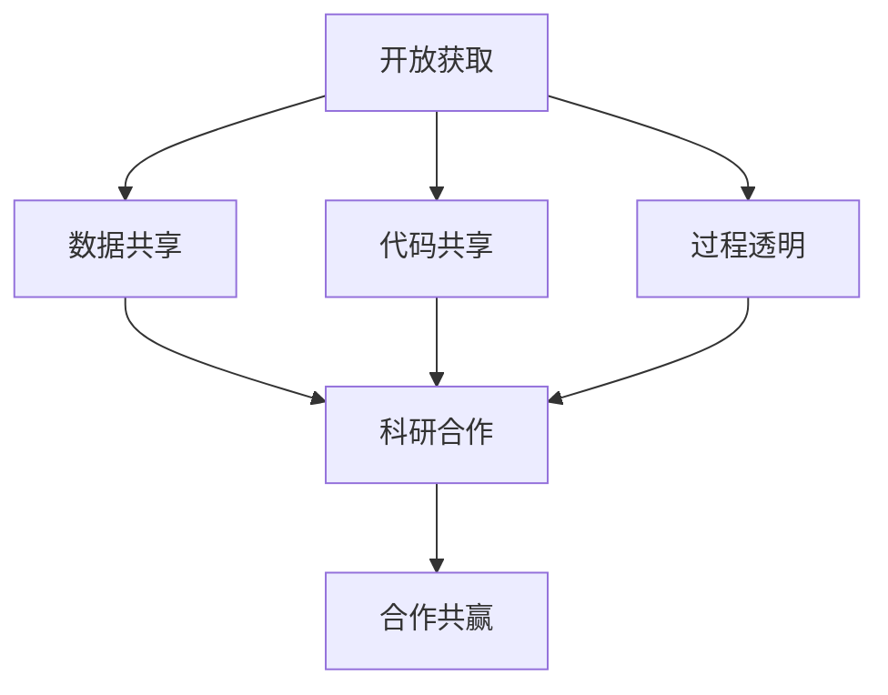

                 

# 《科学研究的开放科学运动与世界可理解性的共享》

## 摘要

本文旨在探讨科学研究的开放科学运动及其在世界可理解性共享方面的重要作用。随着信息技术的飞速发展，科学研究正逐渐从封闭、孤立的状态向开放、协作的方向转变。本文首先介绍了开放科学的定义、历史与发展，分析了开放科学运动的主要影响因素。接着，本文探讨了开放科学对社会和科学研究本身带来的积极影响和优势，同时也揭示了其面临的挑战与问题。通过具体案例，本文展示了开放科学在学术和产业领域的广泛应用，并提出了构建开放科学共享机制的策略。最后，本文对开放科学的未来发展进行了展望，提出了应对未来挑战的建议。通过本文的分析，我们希望能够为读者提供关于开放科学运动的全面理解，并激发更多人对这一领域的关注和参与。

## 分析书名《科学研究的开放科学运动与世界可理解性的共享》

书名《科学研究的开放科学运动与世界可理解性的共享》涵盖了以下几个核心关键词：科学研究、开放科学运动、世界可理解性、共享。下面我们将逐一分析这些关键词及其在书名中的含义。

### 科学研究

科学研究是指利用科学方法和科学理论进行探究的过程，目的是发现自然现象的规律，推动人类对自然世界的认知。科学研究不仅仅是一种知识的获取过程，更是推动社会进步和发展的动力。在书名中，“科学研究”作为主体，揭示了本书的核心关注点，即探讨科学研究在开放科学运动中的角色和影响。

### 开放科学运动

开放科学运动是一种倡导科学研究开放性、透明性和合作性的科学范式转变。开放科学强调科研资源的开放获取，科研过程的透明共享，以及科研成果的全球共享。这一运动起源于20世纪末，随着互联网和数字技术的发展而迅速兴起。在书名中，“开放科学运动”是关键概念，表明本书将详细探讨这一运动的历史、现状和发展趋势。

### 世界可理解性

世界可理解性是指人类通过科学研究，逐步揭示自然世界的规律和本质，使世界变得更加可理解、可预测。开放科学运动的一个主要目标是提高科研的可理解性，使得科研成果不仅为专业人士所知，也能为普通公众所理解。在书名中，“世界可理解性”是开放科学运动的一个重要目标，强调了科学研究对社会和公众的意义。

### 共享

共享是指将科研资源、成果和知识开放地提供给所有人，以促进知识传播、创新和合作。在开放科学运动中，共享是核心原则之一，通过共享机制，可以打破信息壁垒，促进全球科学合作，提高科研效率。在书名中，“共享”不仅指科研资源的开放获取，还强调了共享对提高世界可理解性的重要作用。

综合以上分析，书名《科学研究的开放科学运动与世界可理解性的共享》清晰地阐述了本书的核心内容，即探讨开放科学运动在推动科学研究发展和提高世界可理解性方面的作用和影响。接下来，我们将进一步分析本书的核心内容和结构。

## 确定本书的核心内容和结构

本书的核心内容主要围绕开放科学运动的定义、发展历程、影响因素、优势与挑战、应用与案例、共享机制以及未来发展等方面展开。为了更好地组织内容，本书可以分为以下几个主要部分：

### 第一部分：开放科学的定义与历史

这一部分主要介绍开放科学的定义，包括其起源、概念演化以及基本原则。同时，还会回顾开放科学运动的发展历程，从早期阶段到中期阶段，再到最新趋势，全面展现开放科学的演进过程。

#### 1.1 开放科学的定义
- 起源：开放科学的初步概念和提出背景。
- 概念演化：开放科学从提出到成熟的理论框架和内容发展。
- 基本原则：开放科学的核心理念和基本原则。

#### 1.2 开放科学的发展历程
- 早期阶段：开放科学的萌芽和发展过程。
- 中期阶段：开放科学的关键事件和重要成就。
- 最新趋势：当前开放科学的发展方向和前沿研究。

### 第二部分：开放科学的影响与优势

这一部分将探讨开放科学对社会和科学研究本身带来的影响和优势。具体包括：

#### 2.1 开放科学对社会的影响
- 提高科研透明度：开放科学如何增加科研过程的透明性。
- 促进知识共享与合作：开放科学如何促进全球科研合作和知识共享。
- 推动科学创新与进步：开放科学如何激发科学创新，加速科技进步。

#### 2.2 开放科学的优势
- 提升科研成果的质量：开放科学如何提高科研研究的可靠性和影响力。
- 减少科研成本与时间：开放科学如何降低科研成本，缩短研究周期。
- 扩大科研影响力：开放科学如何使科研成果更加普及和可及。

### 第三部分：开放科学的挑战与问题

这一部分将分析开放科学运动中面临的挑战和问题，包括：

#### 3.1 开放科学的挑战
- 数据隐私与安全问题：开放科学如何平衡数据开放与隐私保护。
- 知识产权保护问题：开放科学如何保护知识产权，避免成果被滥用。
- 资源分配不均问题：开放科学如何解决资源分配不均，确保公平性。

#### 3.2 开放科学的问题
- 质量控制问题：开放科学如何确保科研质量和数据准确性。
- 公众接受度问题：开放科学如何提高公众对科研的理解和接受度。
- 社会负面影响问题：开放科学可能带来的社会负面影响及其应对策略。

### 第四部分：开放科学的应用与案例

这一部分将展示开放科学在学术和产业领域的实际应用，通过具体案例进行分析：

#### 4.1 开放科学在学术领域的应用
- 开放获取期刊：开放获取期刊的发展现状和影响力。
- 开放获取数据库：开放获取数据库的优势和应用场景。
- 开放获取科研工具：开源软件和工具在科研中的应用。

#### 4.2 开放科学在产业领域的应用
- 科技企业开放合作案例：科技企业如何通过开放合作推动创新。
- 产业联盟与开放平台：产业联盟和开放平台的作用和案例分析。
- 开放科学在技术创新中的应用：开放科学如何推动技术创新和产业升级。

### 第五部分：开放科学的共享机制

这一部分将探讨构建开放科学共享机制的策略和方法，包括：

#### 5.1 开放共享的激励机制
- 政策支持与激励措施：政府如何通过政策支持促进开放科学的发展。
- 资金投入与资源分配：如何合理分配资金和资源，支持开放科学研究。
- 评价体系与奖惩机制：如何建立评价体系和奖惩机制，鼓励科研人员参与开放科学。

#### 5.2 开放共享的技术手段
- 数据存储与管理系统：如何构建高效的数据存储和管理系统。
- 知识图谱与网络分析：如何利用知识图谱和网络分析技术促进科研合作。
- 开源软件与工具：如何利用开源软件和工具支持开放科学研究。

### 第六部分：开放科学的未来发展

这一部分将展望开放科学的未来发展，探讨未来趋势和挑战：

#### 6.1 开放科学的未来趋势
- 新型开放科学模式：未来开放科学的可能发展方向。
- 开放科学与社会治理：开放科学如何影响社会治理和公共事务。
- 国际合作与全球化：开放科学在国际合作和全球化背景下的角色和影响。

#### 6.2 开放科学的未来挑战
- 技术创新与变革：如何应对技术变革对开放科学的影响。
- 社会接受度与教育：如何提高公众对开放科学的理解和接受度。
- 法规政策与国际合作：如何构建有利于开放科学发展的法规政策和国际合作机制。

通过以上分析，本书的核心内容和结构得到了明确的界定。接下来，我们将为每个部分设计详细的目录和章节，确保内容的完整性和逻辑性。

## 第一部分：开放科学的定义与历史

### 1.1 开放科学的定义

#### 1.1.1 开放科学的起源

开放科学的起源可以追溯到20世纪末，当时随着互联网和计算机技术的迅猛发展，科学研究的透明度和合作性受到了越来越多的关注。最早的开放科学理念可以追溯到1960年代的美国，当时的一些科学家开始提倡将科研成果公开发表，以促进知识的传播和共享。然而，这一理念在当时并未得到广泛认同，主要原因是科学研究的成果往往被视为个人或机构的私有财产，公开发表可能会影响到其学术地位和经济利益。

#### 1.1.2 开放科学的概念演化

随着时间的推移，开放科学的理念逐渐成熟并得到广泛认可。1990年代，随着科学研究的数字化和互联网的普及，开放获取（Open Access，简称OA）运动开始兴起。开放获取主张科学文献应该免费、开放地提供给所有人，以消除学术信息壁垒，促进知识共享。这一运动得到了许多学术期刊的支持，一些新兴的开放获取期刊如《生物医学中心》（Biomed Central）和《普适科学》（PLOS）应运而生。

进入21世纪，开放科学的概念进一步扩展，不再局限于文献的开放获取，而是涵盖了科研过程的各个环节，包括数据共享、代码共享、科研工具和软件的开放等。这一阶段的开放科学强调科研的透明性和合作性，通过开放共享，提高科研的效率和影响力。

#### 1.1.3 开放科学的基本原则

开放科学的基本原则包括：

1. **开放获取**：科研成果应该免费、开放地提供给所有人，消除学术信息壁垒。
2. **数据共享**：科研数据应尽可能开放，以促进其他科研人员的复现和验证。
3. **代码共享**：科研过程中使用的代码和软件工具应公开，便于其他科研人员使用和改进。
4. **透明合作**：科研过程和决策应该透明，鼓励全球科研人员的合作与交流。
5. **合作共赢**：通过开放共享，提高科研效率，推动科学创新，实现合作共赢。

### 1.2 开放科学的发展历程

#### 1.2.1 早期阶段

早期阶段（20世纪60年代至80年代）的开放科学主要是以学术期刊的开放获取为标志。这一时期，一些科学家和学术机构开始尝试将科研成果公开发表，减少学术期刊的订阅门槛。然而，由于传统学术期刊的商业模式和利益关系，这一尝试并未得到广泛支持。

#### 1.2.2 中期阶段

中期阶段（20世纪90年代至21世纪初）是开放获取运动的兴起时期。1991年，《生物医学中心》成为世界上第一家完全开放获取的学术期刊，标志着开放获取运动的正式开始。随后，一系列开放获取期刊如《普适科学》、《科学公共图书馆》（PLOS）等相继成立，推动了开放获取运动的发展。此外，这一时期还出现了诸如arXiv这样的预印本平台，为科研人员提供了快速、免费的发表论文渠道。

#### 1.2.3 最新趋势

最新趋势（21世纪初至今）是开放科学的全面发展和深化。这一时期，开放科学不再局限于文献的开放获取，而是涵盖了数据共享、代码共享、科研工具和软件的开放等各个方面。许多科研机构和学术组织开始制定开放科学的政策和指南，推动开放科学成为主流科研范式。同时，科技企业和商业机构也积极参与开放科学，通过开放合作，推动科技创新和产业发展。

### 1.3 开放科学运动的影响因素

#### 1.3.1 政策与法规环境

政策与法规环境是推动开放科学运动发展的重要因素。许多国家和国际组织出台了一系列政策和法规，支持开放科学的发展。例如，欧盟的《开放获取政策》、美国的《公共获取计划》、我国的《关于促进开放科学的要求》等，都为开放科学提供了法律保障和政策支持。

#### 1.3.2 技术进步与趋势

技术进步和趋势是推动开放科学运动发展的重要动力。互联网和计算机技术的发展，使得科研数据的获取、处理和共享变得更加便捷。大数据、云计算、人工智能等新兴技术的应用，也为开放科学提供了新的工具和方法。

#### 1.3.3 社会与文化背景

社会与文化背景是影响开放科学运动发展的重要因素。随着知识经济的兴起和全球化的推进，人们对知识的渴求和对公平性的追求日益增加。开放科学作为一种促进知识共享和公平性发展的方式，得到了广泛的认同和支持。

通过以上分析，我们可以看出，开放科学运动的发展历程是一个从萌芽到成熟、从局部到全面、从理念到实践的过程。这一过程受到了政策与法规环境、技术进步与社会文化背景等多方面因素的影响。在接下来的章节中，我们将进一步探讨开放科学对社会和科学研究本身带来的影响和优势。

### 1.1 开放科学的定义

开放科学作为一种新兴的科学范式，其定义不仅仅局限于传统的科学范畴，而是涉及科学研究的各个层面，包括数据、工具、方法、成果和过程。因此，理解开放科学的定义需要从多个维度进行分析。

#### 开放科学的起源

开放科学的理念可以追溯到对科学本质的反思。在20世纪中叶，随着科学研究越来越依赖庞大的数据集和复杂的计算模型，科学家们开始意识到，科学研究的过程和结果应该对所有人开放，以确保科学知识的传播和验证。这一理念在1990年代得到了进一步的巩固，特别是在开放获取运动（Open Access Movement）的推动下，科学文献的开放获取成为可能。

#### 开放科学的概念演化

开放科学的概念并非一成不变，而是随着信息技术的发展和科学研究的进步不断演化。早期的开放科学主要关注科学文献的开放获取，即让科研论文和学术文章免费、开放地提供给所有人，从而消除学术信息壁垒，促进知识的传播和共享。这一阶段的开放科学强调的是科学成果的公开化。

随着互联网和数字技术的发展，开放科学的范围逐渐扩大。开放科学不仅包括文献的开放获取，还包括数据的开放、代码的开放、方法的开放以及整个科研过程的开放。这种方法论的变革使得科学研究的透明度大大提高，有助于减少错误和欺诈行为，同时促进了全球科研合作。

#### 开放科学的基本原则

开放科学的基本原则包括以下几个方面：

1. **开放获取**：科学成果，包括论文、数据、软件等，应该免费、开放地提供给所有人，以便全球的科研人员和学生能够自由访问和使用。
2. **数据共享**：科研数据应该尽可能开放，允许其他研究者复现和验证研究结果，从而确保科学知识的准确性和可靠性。
3. **代码共享**：科研过程中使用的代码和软件工具应该公开，便于其他科研人员使用、改进和扩展。
4. **透明合作**：科研过程和决策应该透明，鼓励全球科研人员的合作与交流，以提高科研效率和成果质量。
5. **合作共赢**：开放科学强调通过合作实现共赢，通过共享知识和资源，推动科学创新和技术的进步。

#### 开放科学的核心概念和联系

为了更好地理解开放科学，我们可以通过一个Mermaid流程图来展示其核心概念之间的联系。

在这个流程图中，我们可以看到，开放获取、数据共享、代码共享和过程透明是开放科学的核心要素，这些要素共同促进了科研合作和共赢。科研合作和共赢又进一步推动了科学创新和技术的进步，形成了一个良性循环。

### 1.2 开放科学的发展历程

#### 1.2.1 早期阶段

开放科学的早期阶段可以追溯到20世纪60年代。在这个时期，科学家和学者们开始意识到科学研究应该更加开放和透明。1960年代，阿兰·图灵提出了“图灵测试”，这一理论不仅为人工智能的发展奠定了基础，也启发了人们对科学研究开放性的思考。同时，一些科学家开始尝试将他们的研究成果公开分享，这一行为标志着开放科学理念的萌芽。

然而，由于技术和经济条件的限制，早期的开放科学运动并没有得到广泛支持。科学研究主要依赖于学术期刊，这些期刊的出版模式使得科研成果往往只能在有限的范围内传播，而且高昂的订阅费用也阻碍了科研人员和学生获取这些资源。因此，早期的开放科学运动主要局限于少数有志于推动这一理念的科学家和学术机构。

#### 1.2.2 中期阶段

中期阶段（20世纪90年代至21世纪初）是开放科学运动的重要发展时期。这一时期，随着互联网和计算机技术的飞速发展，开放科学开始从理论探讨走向实践应用。1991年，美国物理学家艾伦·图灵创建了arXiv，这是一个用于存放物理、数学、计算机科学等学科预印本的平台。arXiv的建立标志着开放获取运动的正式开始，它为科研人员提供了一个免费、开放的发表论文渠道，极大地推动了开放科学的发展。

此外，1990年代末，开放获取期刊如《生物医学中心》（Biomed Central）和《普适科学》（PLOS）相继成立。这些期刊打破了传统学术期刊的商业模式，通过开放获取模式，为科研人员提供了一个新的发表论文平台。这些期刊的成功不仅为开放科学提供了有力支持，也为开放获取运动赢得了广泛的认同。

#### 1.2.3 最新趋势

最新的开放科学趋势体现在科研的全面开放和深度合作。随着大数据、云计算、人工智能等技术的发展，科研数据、代码和工具的共享变得更加便捷和高效。许多科研机构和学术组织开始制定开放科学的政策和指南，鼓励科研人员公开他们的研究成果和科研过程。

此外，开放科学在产业界的应用也越来越广泛。科技企业开始意识到，通过开放合作，可以加速技术创新和产品开发。一些大型科技公司和初创企业纷纷建立了开放实验室、开放平台和开源项目，以推动科学技术的进步和产业的创新。

同时，开放科学在国际合作中的作用日益凸显。全球范围内的科研机构和学者通过开放合作，共同应对气候变化、疾病治疗、能源危机等重大挑战。开放科学不仅促进了全球科研合作，也提高了科研成果的全球影响力。

### 1.3 开放科学运动的影响因素

#### 1.3.1 政策与法规环境

政策与法规环境是推动开放科学运动发展的重要因素。许多国家和国际组织出台了一系列政策和法规，支持开放科学的发展。例如，欧盟的《开放获取政策》要求成员国科研机构在2020年前实现科研文献的全面开放获取。美国的《公共获取计划》也要求联邦资助的科研文献在发表后立即开放获取。这些政策和法规为开放科学提供了法律保障和政策支持，推动了开放科学的普及和深入发展。

#### 1.3.2 技术进步与趋势

技术进步和趋势是推动开放科学运动发展的重要动力。互联网和计算机技术的发展，使得科研数据的获取、处理和共享变得更加便捷。大数据、云计算、人工智能等新兴技术的应用，也为开放科学提供了新的工具和方法。例如，大数据技术可以帮助科研人员快速分析和处理大规模科研数据，云计算技术可以提供强大的计算能力和存储空间，人工智能技术可以辅助科研人员进行智能分析和预测。这些技术的进步为开放科学的发展提供了强大的技术支持。

#### 1.3.3 社会与文化背景

社会与文化背景是影响开放科学运动发展的重要因素。随着知识经济的兴起和全球化的推进，人们对知识的渴求和对公平性的追求日益增加。开放科学作为一种促进知识共享和公平性发展的方式，得到了广泛的认同和支持。此外，开放科学的理念也与当代社会的开放性、透明性和合作性相契合，因此更容易被人们接受和推动。

通过以上分析，我们可以看出，开放科学运动的发展是一个综合多种因素的过程。政策与法规环境、技术进步和社会文化背景等多方面因素共同作用，推动了开放科学的发展。在接下来的章节中，我们将进一步探讨开放科学对社会和科学研究本身带来的积极影响。

### 2.1 开放科学对社会的影响

开放科学作为一种新兴的科学范式，不仅改变了科学研究的传统模式，也对整个社会产生了深远的影响。以下将具体分析开放科学在社会中的几个关键影响。

#### 提高科研透明度

开放科学的核心原则之一是提高科研过程的透明度。通过开放获取、数据共享和过程透明，开放科学使得科研过程更加公开、透明，便于公众监督和审查。这不仅有助于减少科研过程中的欺诈和错误，还能提高科研的诚信度和公信力。例如，在医学研究中，开放科学可以确保临床试验数据的公开，从而提高临床试验的透明度和有效性，有助于发现潜在的治疗方法和药物副作用。

#### 促进知识共享与合作

开放科学强调知识的开放获取和共享，这极大地促进了全球范围内的科研合作和知识共享。通过开放获取期刊、预印本平台和科研数据库，科研人员可以轻松获取和利用全球范围内的科研资源，无需受到地理、语言或经济条件的限制。这不仅加快了科学研究的进度，还促进了不同领域、不同机构和不同国家之间的合作与交流。例如，通过开放科学平台，全球的科学家可以共同合作，共同解决重大科学问题，如气候变化、疾病治疗和能源危机等。

#### 推动科学创新与进步

开放科学的理念鼓励科研人员公开他们的研究成果和科研方法，这有助于其他科研人员了解最新的研究进展，从而激发新的研究灵感和创新思维。开放科学通过共享科研成果和知识，促进了科学技术的快速进步。例如，在人工智能领域，开放获取的算法和工具使得研究人员能够快速学习和应用最新的研究成果，推动了人工智能技术的迅猛发展。

#### 减少科研成本与时间

开放科学通过开放获取和共享，降低了科研的成本和时间。传统科研模式中，科研人员需要支付高昂的订阅费用才能获取最新的科研成果，这限制了科研的普及和推广。而开放科学使得科研资源免费、开放地提供给所有人，大大降低了科研的成本。此外，开放科学通过共享科研数据、代码和工具，减少了科研人员重复劳动的时间，提高了科研效率。例如，通过开放的数据共享平台，研究人员可以快速获取所需的数据集，无需花费大量时间进行数据收集和清洗。

#### 扩大科研影响力

开放科学通过开放获取和共享，使得科研成果能够更广泛地传播和分享，从而扩大了科研的影响力。传统科研模式下，科研成果往往只能被少数专家所知，而开放科学使得科研成果能够被全球的科研人员和学生所了解和应用，从而提高了科研成果的普及率和影响力。例如，通过开放获取期刊和预印本平台，科研人员可以迅速将他们的研究成果分享给全球的科研社区，提高了科研成果的曝光率和影响力。

#### 提升公众科学素养

开放科学不仅对科研本身产生了积极影响，也对公众科学素养的提升起到了重要作用。通过开放获取和共享，公众可以更容易地获取和理解科学知识，从而提高他们的科学素养。例如，通过开放获取的科普文章、视频和讲座，公众可以了解最新的科研成果和科学动态，增强对科学技术的理解和信任。

综上所述，开放科学对社会的影响是多方面的，从提高科研透明度和促进知识共享，到推动科学创新和减少科研成本，再到扩大科研影响力和提升公众科学素养，开放科学在社会发展中扮演着越来越重要的角色。随着开放科学的不断发展和普及，我们可以期待它对社会产生的积极影响将更加深远和广泛。

### 2.2 开放科学的优势

开放科学作为一种新兴的科学范式，不仅对社会产生了深远的影响，其自身也具备一系列显著的优势，这些优势在不同方面促进了科学研究和创新的发展。

#### 提升科研成果的质量

开放科学通过开放获取和共享，使得科研成果更容易被同行评审和公众监督。这一过程不仅有助于发现研究中的错误和不足，还能够鼓励科研人员更加严谨和透明地进行研究。例如，通过开放获取的预印本平台，科研人员可以提前分享他们的研究成果，接受全球科研同行的评审和反馈，从而提高研究结论的可靠性和科学性。此外，开放科学还鼓励科研人员进行复现和验证研究，这有助于确保研究结果的准确性和一致性。

#### 减少科研成本与时间

开放科学通过共享科研资源，如数据、代码和工具，显著降低了科研的成本和时间。传统科研模式中，科研人员往往需要自行收集和整理数据，编写和测试代码，这些过程既耗时又耗费资源。而开放科学通过共享这些资源，使得科研人员可以更快速地开始他们的研究，减少了重复劳动，提高了科研效率。例如，通过开放的科研数据库和工具，研究人员可以快速获取所需的数据和工具，无需从零开始进行数据收集和开发。

#### 扩大科研影响力

开放科学通过开放获取，使得科研成果能够更广泛地传播和分享，从而扩大了科研的影响力。在传统的封闭科研模式下，科研成果往往只能被少数专家所知，而开放科学使得科研成果能够被全球的科研人员和学生所了解和应用，提高了科研成果的普及率和影响力。例如，通过开放获取的期刊和预印本平台，科研人员可以迅速将他们的研究成果分享给全球的科研社区，从而增加了研究的影响范围和深度。

#### 促进科研合作与交流

开放科学通过开放获取和共享，促进了全球范围内的科研合作与交流。科研资源的开放共享，使得不同领域、不同机构和不同国家的科研人员能够更方便地合作，共同解决科学问题。这不仅加速了科学研究的进展，还促进了全球科学共同体的发展。例如，通过开放的科学合作平台，全球的科研人员可以共同参与国际科研项目，共享研究成果和资源，推动科学技术的共同进步。

#### 提升科研透明度和公信力

开放科学通过开放获取和共享，提高了科研的透明度和公信力。科研过程的公开和透明，使得科研活动更容易受到公众监督和审查，减少了科研过程中的欺诈和错误。开放科学还鼓励科研人员遵循科学伦理和规范，提高科研诚信。例如，通过开放的科研数据和过程，公众和同行可以更清楚地了解研究的方法、数据和结论，从而增强对科研结果的信任和认可。

#### 促进科学教育和普及

开放科学通过开放获取，使得科学教育资源更广泛地传播和共享，从而促进了科学教育和普及。学生和公众可以通过开放的科研资源，了解最新的科研成果和科学动态，提高他们的科学素养。例如，通过开放的科普文章、视频和讲座，公众可以更容易地理解和掌握科学知识，培养对科学的兴趣和认同。

综上所述，开放科学的优势体现在多个方面，从提升科研成果的质量到减少科研成本与时间，再到扩大科研影响力、促进科研合作与交流，以及提升科研透明度和促进科学教育普及，开放科学为科学研究和创新提供了强大的支持。随着开放科学的不断发展和普及，我们可以期待它将在更多领域发挥更大的作用，推动科学事业的繁荣和发展。

### 3.1 开放科学的挑战

尽管开放科学带来了诸多积极影响和优势，但在实际应用过程中，它也面临着一系列挑战和问题，这些挑战需要我们深入分析和解决。

#### 数据隐私与安全问题

开放科学强调数据共享，但这也带来了数据隐私和安全的问题。科研数据往往包含了敏感信息，如个人健康数据、财务信息等，这些数据的开放可能会导致隐私泄露和滥用。例如，如果医疗数据被非法获取，可能会对患者的隐私权和健康安全造成威胁。此外，黑客攻击和数据泄露也是开放科学面临的重要安全挑战，这需要我们建立有效的数据保护机制和安全措施，确保科研数据的完整性和安全性。

#### 知识产权保护问题

开放科学运动倡导知识的开放共享，但这也对知识产权保护提出了挑战。传统的知识产权保护机制主要是为了激励创新和保护创作者的利益。然而，开放科学强调知识的共享和复现，可能会影响到原创者的利益。例如，某些研究方法或技术方案在开放共享后，可能会被他人用于商业用途，而原创者却无法获得相应的经济回报。因此，如何在开放科学中平衡知识产权保护和创新激励，成为一个亟待解决的问题。

#### 资源分配不均问题

开放科学虽然有助于知识的传播和共享，但也可能加剧资源分配的不均问题。一方面，某些科研机构和学术期刊可能拥有更多的资源和优势，更容易实现开放获取和共享。而一些资源匮乏的科研机构和学者，可能难以获得开放科学带来的好处。这种资源分配的不均，可能导致科研合作和知识共享的失衡，进一步加剧科研领域的资源差距。因此，如何确保开放科学能够公平、公正地惠及所有科研机构和学者，是开放科学运动需要面对的重要挑战。

### 3.2 开放科学的问题

除了上述挑战外，开放科学在实际应用过程中还存在一些具体问题，这些问题可能影响到开放科学的长期发展和效果。

#### 质量控制问题

开放科学强调知识的开放共享，但这也可能带来质量控制的问题。在传统科研模式中，科研成果需要经过严格的同行评审和验证，以确保其质量和可靠性。而在开放科学中，由于评审机制可能不够完善，一些质量较低或存在错误的研究成果可能会被公开共享，影响科研的整体质量。因此，如何建立有效的质量控制机制，确保开放科学中的研究成果具备高水平和可靠性，是一个亟待解决的问题。

#### 公众接受度问题

开放科学虽然有助于知识的传播和普及，但公众对开放科学的接受度和理解度可能有限。在传统科研模式中，科研成果主要通过学术期刊和会议等渠道传播，主要面向科研专业人士。而开放科学则要求科研成果面向更广泛的公众，这需要公众具备一定的科学素养和理解能力。然而，许多公众可能对复杂的科研成果缺乏理解，这可能导致开放科学的效果受限。因此，如何提高公众对开放科学的接受度和理解度，是一个需要关注的问题。

#### 社会负面影响问题

开放科学在推动知识共享和科研合作的同时，也可能带来一些社会负面影响。例如，由于开放获取和共享，科研成果的传播速度加快，可能导致某些领域的科研竞争加剧，甚至引发学术不端行为，如抄袭和剽窃。此外，开放科学还可能带来知识产权纠纷和利益冲突，影响科研的公正性和公平性。因此，如何妥善处理开放科学带来的社会负面影响，确保科研环境的健康和有序发展，是开放科学运动需要关注的重要问题。

综上所述，开放科学在推动科学进步和社会发展中具有重要意义，但同时也面临着一系列挑战和问题。通过深入分析和解决这些问题，我们可以更好地推动开放科学的发展，实现科学知识的开放共享和全球科研合作，为人类社会的可持续发展做出更大贡献。

### 4.1 开放科学在学术领域的应用

开放科学在学术领域的应用已经取得了显著成效，尤其是在开放获取期刊、开放获取数据库和开放获取科研工具等方面。以下将具体分析这些方面的应用和影响。

#### 开放获取期刊

开放获取期刊是开放科学运动的重要成果之一，它使得科研论文和学术文章能够免费、开放地提供给所有人。开放获取期刊的出现，打破了传统学术期刊的商业模式，通过订阅模式向用户收取高昂的订阅费用，导致普通科研人员和学生难以获取最新的科研成果。开放获取期刊则通过赞助和支持模式，将研究成果免费提供给读者，极大地降低了获取科研文献的门槛。

一些著名的开放获取期刊如《生物医学中心》（Biomed Central）、《普适科学》（PLOS）和《科学公共图书馆》（PLOS）等，已经在学术界产生了广泛的影响。这些期刊不仅吸引了大量高质量的论文投稿，还促进了全球范围内的科研合作和知识共享。例如，《普适科学》通过全球合作模式，将科研成果快速传播到各个国家和地区，促进了全球科研水平的提升。

#### 开放获取数据库

开放获取数据库是另一个重要的开放科学工具，它为科研人员提供了丰富的科研数据资源。开放获取数据库不仅包含了大量的科研文献，还提供了大量的科研数据集和实验结果，使得科研人员可以更方便地进行数据分析和复现研究。

一些著名的开放获取数据库如《科学数据库》（ScienceDirect）、《IEEE Xplore》和《CNKI（中国知网）》等，已经成为了科研人员获取数据资源的重要平台。这些数据库通过开放获取模式，使得科研人员可以免费或低成本地获取所需的数据资源，大大提高了科研效率。

此外，开放获取数据库还促进了全球科研合作。通过开放获取数据库，全球的科研人员可以共享和利用相同的数据资源，共同进行科学研究和数据分析，从而提高科研的协作性和效率。

#### 开放获取科研工具

开放获取科研工具是开放科学在学术领域应用的另一个重要方面，它为科研人员提供了丰富的科研工具和软件。这些工具和软件包括数据分析软件、实验模拟软件、计算工具等，使得科研人员可以更方便地进行数据分析和实验模拟。

一些著名的开放获取科研工具如《Python编程语言》、《MATLAB》和《R语言》等，已经成为科研人员常用的科研工具。这些工具不仅功能强大，而且通过开源模式，使得科研人员可以免费使用和改进，从而提高了科研效率和创新能力。

此外，开放获取科研工具还促进了全球科研合作。通过开放获取科研工具，全球的科研人员可以共享和利用相同的工具和软件，共同进行科学研究和数据分析，从而提高科研的协作性和效率。

#### 开放获取在学术领域的影响

开放获取在学术领域的应用，极大地促进了科学知识的传播和共享，提高了科研的透明度和合作性。首先，开放获取期刊使得科研成果能够更快速、更广泛地传播，打破了传统学术期刊的订阅壁垒，使得更多的科研人员和学生能够免费获取最新的科研成果，从而提高了科研的普及率和影响力。

其次，开放获取数据库为科研人员提供了丰富的科研数据资源，促进了科研合作和数据复现。开放获取数据库不仅提供了大量的科研文献，还提供了大量的数据集和实验结果，使得科研人员可以更方便地进行数据分析和复现研究，从而提高了科研的可靠性和准确性。

最后，开放获取科研工具为科研人员提供了丰富的科研工具和软件，提高了科研效率和创新能力。开放获取科研工具通过开源模式，使得科研人员可以免费使用和改进，从而降低了科研成本，提高了科研效率。

总之，开放科学在学术领域的应用，不仅促进了科学知识的传播和共享，提高了科研的透明度和合作性，还为科研人员提供了丰富的资源和工具，极大地推动了科学研究的进步和发展。

### 4.2 开放科学在产业领域的应用

开放科学在产业领域的应用正日益广泛，它通过开放合作、产业联盟与开放平台等形式，推动了技术创新和产业升级，促进了整个产业链的协同发展。以下将详细探讨开放科学在产业领域的实际应用和案例分析。

#### 科技企业开放合作案例

科技企业在开放科学运动中扮演着重要角色，通过开放合作，企业不仅能够加速技术创新，还能提升自身的市场竞争力。例如，谷歌通过其开源项目（如TensorFlow和Android）与全球开发者社区合作，不断推动人工智能和移动技术的发展。这种开放合作模式不仅帮助谷歌吸引了大量的开发者和用户，还促进了相关技术的快速迭代和优化。亚马逊的AWS平台也通过开放API和工具，与全球企业和开发者合作，提供强大的云计算服务，从而推动了云计算产业的繁荣。

此外，华为在5G技术领域通过开放合作，推动了全球5G生态系统的建设。华为不仅开放了5G标准的核心技术，还与全球的电信运营商、设备制造商和开发者合作，共同推动5G技术的商用化和普及。这种开放合作模式不仅加速了5G技术的发展，还使得全球范围内的企业和开发者能够共享5G技术带来的巨大市场机遇。

#### 产业联盟与开放平台

产业联盟和开放平台是开放科学在产业领域应用的重要形式，它们通过整合资源、共享技术和信息，推动了产业协同和创新。例如，美国半导体产业协会（Semiconductor Industry Association，SIA）通过组织联盟和开展合作项目，促进了半导体产业的创新和竞争力。SIA不仅组织成员企业共同研发新技术，还通过开放平台提供技术共享和培训服务，提升了整个产业链的技术水平。

在欧洲，欧洲量子旗（European Quantum Flagship）项目通过联盟和开放平台，推动了量子技术的研究和应用。该项目整合了欧洲多个国家的科研机构和企业资源，共同研发量子计算和通信技术。通过开放平台，项目成员可以共享研究成果和技术资源，加速量子技术的商业化进程。

中国的“互联网+”行动计划也通过产业联盟和开放平台，促进了数字经济的发展。通过建立各类产业联盟和开放平台，政府和企业共同推动互联网、大数据、人工智能等新兴技术与传统产业的融合，推动了产业结构的优化和升级。

#### 开放科学在技术创新中的应用

开放科学在技术创新中的应用，不仅加速了科学研究的进展，也推动了产业的技术创新和产品开发。例如，在生物技术领域，基因编辑技术CRISPR-Cas9的开放共享，使得全球的科研机构和企业在短时间内能够快速应用和改进这一技术，推动了基因治疗和合成生物学的快速发展。

在新能源领域，开放科学的应用同样显著。特斯拉通过开源其电动汽车的充电标准，推动了全球充电基础设施的建设和普及。此外，特斯拉还开放了其电池技术专利，鼓励其他企业参与电动汽车的研发和制造，从而加速了全球新能源汽车产业的发展。

在医疗领域，开放科学的应用也取得了显著成效。例如，IBM的Watson Health平台通过开放共享医疗数据和算法，帮助医疗机构提高诊断和治疗的准确性，推动了精准医疗的发展。

#### 案例分析

一个典型的案例是微软与英特尔的合作。两家公司在AI领域建立了开放合作联盟，通过共享技术和资源，共同推动AI技术的发展。微软的Azure AI平台与英特尔的AI加速器相结合，为企业提供了强大的AI计算能力。这种开放合作模式不仅提升了双方的技术实力，也为客户提供了更好的产品和服务，推动了整个AI产业的快速发展。

另一个案例是苹果与三星的合作。两家公司在芯片设计和制造领域建立了长期的合作关系，通过共享技术和资源，共同推动芯片技术的发展。这种开放合作不仅提高了双方的竞争力，还推动了全球半导体产业的进步。

通过以上分析，我们可以看到，开放科学在产业领域的应用，通过开放合作、产业联盟与开放平台等形式，不仅推动了技术创新和产业升级，还促进了全球产业链的协同发展。随着开放科学的不断发展和普及，我们可以期待它在产业领域发挥更大的作用，为全球经济的繁荣和可持续发展做出更大的贡献。

### 5.1 开放共享的激励机制

构建有效的开放共享激励机制是推动开放科学发展的关键。以下将探讨政策支持、资金投入和评价体系等方面，以建立激励科研人员参与开放科学的长效机制。

#### 政策支持与激励措施

政策支持是推动开放科学发展的基础。政府应出台一系列政策和法规，鼓励和支持科研机构和个人积极参与开放科学运动。具体措施包括：

1. **资助政策**：政府应加大对开放科学项目的资助力度，为开放获取期刊、开放数据库和开放科研工具提供资金支持。例如，欧盟的Horizon 2020计划就为开放科学项目提供了大量的资金支持，推动了开放科学的发展。

2. **奖励制度**：建立科研人员的开放科学奖励制度，对积极参与开放科学活动的科研人员进行奖励。例如，一些大学和科研机构已经开始将开放科学活动纳入科研评价体系，对在开放科学领域有突出贡献的科研人员给予额外的奖励和荣誉。

3. **政策法规**：政府应制定相关政策法规，规范开放科学的实施，确保开放科学活动的合法性和有效性。例如，美国《公共获取计划》要求联邦资助的科研文献在发表后立即开放获取，这一政策法规为开放科学的发展提供了强有力的法律保障。

#### 资金投入与资源分配

资金投入是保障开放科学发展的关键。政府和社会应加大对开放科学的资金投入，确保开放科学项目的可持续性。具体措施包括：

1. **政府投资**：政府应设立专项基金，用于支持开放科学项目的发展。这些资金可以用于开放获取期刊的运营、开放数据库的维护和科研工具的研发等。

2. **企业捐赠**：鼓励企业和基金会捐赠资金，支持开放科学的发展。许多科技巨头和公益组织已经开始支持开放科学项目，例如，微软和谷歌都设立了专门的基金，用于支持开放科学的研究和应用。

3. **多元化资金来源**：开放科学项目应探索多元化的资金来源，包括政府资助、企业捐赠、学术机构和科研人员自筹资金等。通过多元化的资金来源，可以确保开放科学项目的可持续性和稳定性。

#### 评价体系与奖惩机制

建立科学的评价体系是激励科研人员参与开放科学的重要手段。以下措施可以帮助建立有效的评价体系：

1. **量化评价指标**：将开放科学活动纳入科研人员的绩效评价体系，建立量化的评价指标。例如，可以根据开放获取期刊的引用次数、开放数据库的使用量、开源代码的贡献度等指标，对科研人员的开放科学活动进行评价。

2. **多元化评价方式**：结合定量和定性的评价方法，对科研人员的开放科学活动进行全面评估。除了传统的学术论文和专利等评价指标，还应重视开放科学活动的实际效果和社会影响力。

3. **奖惩机制**：建立奖惩机制，对积极参与开放科学活动的科研人员进行奖励，对未能达到开放科学要求的科研人员采取一定的惩罚措施。例如，对在开放获取期刊发表文章的科研人员给予额外的奖金或晋升机会，对未在规定时间内开放科研数据的科研人员采取警告或处罚措施。

4. **国际化评价**：推动开放科学评价的国际化和标准化，借鉴国际上的先进经验和标准，建立符合国际规范的开放科学评价体系。

通过以上激励机制，可以有效地激发科研人员参与开放科学的积极性，推动开放科学的发展。同时，这些机制也需要在实践中不断调整和完善，以适应开放科学发展的新需求和新挑战。

### 5.2 开放共享的技术手段

在开放科学运动中，技术手段起到了至关重要的作用，它们不仅促进了科研数据的共享，还提高了科研效率，并确保了科研过程的透明度。以下将详细探讨数据存储与管理系统、知识图谱与网络分析，以及开源软件与工具在开放科学中的应用。

#### 数据存储与管理系统

数据存储与管理系统是开放科学的核心基础设施之一。随着科研数据的爆炸性增长，如何有效地存储、管理和共享这些数据成为了一个重要问题。

1. **分布式存储**：分布式存储技术如Hadoop和Cassandra能够处理海量数据，提供了高可用性和高扩展性。通过分布式存储，科研机构可以灵活地扩展存储容量，确保数据的持久性和可靠性。

2. **数据管理系统**：数据管理系统（Data Management System，DMS）如MySQL和PostgreSQL提供了高效的数据查询和管理功能。这些系统支持复杂的查询操作，确保科研人员能够快速获取所需的数据。

3. **数据备份与恢复**：数据备份与恢复技术如RAID和云存储，可以防止数据丢失和损坏，保障数据的完整性和可用性。通过定期备份和恢复，科研机构能够确保数据的长期保存和安全。

4. **数据共享平台**：数据共享平台如Figshare和DataONE提供了便捷的数据共享服务。这些平台支持数据的元数据管理、权限控制和版本控制，确保数据的开放性和可追溯性。

#### 知识图谱与网络分析

知识图谱与网络分析技术为开放科学提供了强大的数据分析和可视化工具，有助于揭示科研领域的知识结构和合作关系。

1. **知识图谱**：知识图谱是一种结构化数据表示方法，通过将实体和关系以图的形式组织起来，能够直观地展示科研领域的知识结构和相互关系。工具如Neo4j和OpenKG可以创建和可视化知识图谱，帮助科研人员理解和利用科研数据。

2. **网络分析**：网络分析技术如Gephi和Cytoscape可以分析科研合作网络，揭示科研人员和机构的合作关系。通过网络分析，科研机构可以识别关键合作者，优化科研合作策略。

3. **知识发现**：知识发现技术如Apache Flink和Apache Spark提供了高效的数据挖掘和分析功能。这些工具可以帮助科研人员从海量数据中发现新的知识和趋势，推动科研创新。

#### 开源软件与工具

开源软件与工具是开放科学的重要组成部分，它们通过共享代码和资源，促进了科研合作和技术创新。

1. **开源数据库**：开源数据库如MySQL、PostgreSQL和MongoDB提供了强大的数据存储和管理功能。这些数据库支持多种编程语言和API，方便科研人员开发和管理科研数据。

2. **开源分析工具**：开源分析工具如Python、R和MATLAB提供了丰富的数据分析功能。这些工具支持多种数据格式和算法，可以帮助科研人员快速进行数据分析。

3. **开源科研平台**：开源科研平台如Jupyter Notebook和RStudio提供了便捷的编程和数据分析环境。这些平台支持多语言编程和数据可视化，使得科研人员能够高效地进行科研工作。

4. **开源云计算平台**：开源云计算平台如OpenStack和Apache CloudStack提供了强大的计算能力和存储空间。这些平台支持虚拟化和容器化技术，可以灵活地部署和管理科研应用。

#### 开源软件与工具的实际应用

开源软件与工具在科研领域的实际应用已经取得了显著成效。例如：

- **生物信息学**：开源工具如BioPython和Bioconductor在生物信息学研究中得到了广泛应用，帮助科研人员高效地进行基因组分析、蛋白质结构预测等研究。

- **机器学习**：开源框架如TensorFlow和PyTorch在机器学习领域被广泛采用，推动了人工智能技术的快速发展。

- **数据分析**：开源工具如Jupyter Notebook和RStudio提供了便捷的数据分析和可视化功能，使得科研人员能够轻松地进行复杂数据分析。

- **云计算**：开源云计算平台如OpenStack和Apache CloudStack为科研机构提供了强大的计算和存储资源，支持大规模科研项目的实施。

通过上述技术手段，开放科学不仅实现了科研数据的共享和高效利用，还促进了科研合作和技术创新。随着开源软件与工具的不断发展和普及，我们可以期待开放科学在科研领域发挥更大的作用，推动科学事业的进步。

### 6.1 开放科学的未来趋势

展望未来，开放科学将继续沿着开放性、透明性和协作性的方向发展，并呈现出以下几大趋势：

#### 新型开放科学模式

随着人工智能、大数据、区块链等新兴技术的不断发展，未来开放科学将呈现出更多新型模式。例如，基于区块链的开放科学平台可以实现数据的安全存储和透明共享，确保数据不会被篡改或泄露。此外，大数据技术的应用将使得科研数据的分析和利用更加高效，有助于科研人员从海量数据中挖掘出有价值的洞见。人工智能技术则可以辅助科研人员优化研究方法，提高科研效率。

#### 开放科学与社会治理

开放科学在推动科学研究发展的同时，也将对社会治理产生深远影响。通过开放获取和共享，政府和社会组织可以更方便地获取和利用科研资源，提高政策制定的科学性和有效性。例如，环境保护部门可以通过开放的环境科研数据，制定更科学的环保政策。此外，开放科学还可以促进公共健康和医疗的发展。通过开放获取医疗数据和研究成果，公共卫生部门可以更好地预防和控制疾病，提高全民健康水平。

#### 国际合作与全球化

开放科学的一个重要趋势是国际合作和全球化。在全球性挑战如气候变化、疾病治疗和能源危机面前，单一的国家和地区的科研力量难以应对。通过开放合作，全球的科研人员可以共同应对这些挑战，分享研究成果和资源。例如，国际人类基因组计划（Human Genome Project）就是一个成功的国际合作案例，通过全球范围内的科研合作，人类成功解密了人类基因组序列，为医学和生物学研究提供了重要基础。

#### 开放科学的普及与教育

随着开放科学的发展，公众的科学素养和教育也将得到提升。通过开放获取的科研资源，学生和公众可以更方便地了解科学知识，培养对科学的兴趣和认同。例如，开放获取的科普文章、视频和讲座，可以帮助公众更好地理解科学进展和前沿技术。此外，教育机构可以通过开放获取的教材和课程，提高教学质量和学生素质，培养更多具有创新能力和科研素养的人才。

#### 法规政策和政策支持

为了推动开放科学的发展，各国政府需要制定相应的法规政策和提供政策支持。例如，可以通过立法确保科研数据的开放获取和共享，支持开放获取期刊和数据库的发展。此外，政府可以提供资金支持，鼓励科研机构和个人积极参与开放科学活动，推动开放科学项目的实施。

总之，未来开放科学将在新兴技术的推动下，呈现出更多新型模式，对社会治理和国际合作产生深远影响。通过普及教育和政策支持，开放科学将为科学研究和社会发展注入新的活力。

### 6.2 开放科学的未来挑战

尽管开放科学在全球范围内取得了显著进展，但在未来发展中，仍将面临诸多挑战，这些挑战涉及到技术、社会、政策和国际合作等多个方面。

#### 技术创新与变革

首先，技术创新与变革将成为开放科学面临的重大挑战。随着科技的快速发展，数据规模和数据类型不断增加，传统的数据存储、管理和分析工具可能无法满足开放科学的需求。例如，如何高效地处理和分析大规模复杂数据，如何保障数据的安全性和隐私性，都是需要解决的关键问题。此外，随着人工智能、区块链等新技术的兴起，如何利用这些技术提升开放科学的效率和质量，也是一个重要课题。例如，区块链技术可以为开放科学提供透明、可信的数据管理机制，而人工智能技术可以辅助科研人员从海量数据中提取有价值的信息。

#### 社会接受度与教育

其次，社会接受度和教育也是开放科学面临的挑战之一。尽管开放科学理念在全球范围内得到了广泛认可，但公众对开放科学的理解度和接受度仍然有限。许多公众对科学研究的复杂性缺乏了解，可能对开放科学持怀疑态度。因此，提高公众的科学素养，培养公众对开放科学的认同感，是推动开放科学普及的重要任务。此外，教育体系的改革也是关键，需要将开放科学理念融入教育课程，培养学生对开放科学的兴趣和参与能力。

#### 法规政策与国际合作

法规政策和国际合作是推动开放科学发展的关键。首先，各国需要制定和完善相应的法规政策，确保科研数据的开放获取和共享。例如，如何平衡数据开放与隐私保护，如何保护知识产权，都是需要解决的问题。此外，国际合作也是推动开放科学的重要途径。在全球性挑战面前，单一国家和地区的科研力量有限，需要通过国际合作，共享资源、共享知识，共同应对挑战。然而，不同国家和地区在科研政策、数据标准和法律体系方面存在差异，如何构建有效的国际合作机制，也是一个亟待解决的问题。

#### 资源分配与公平性

资源分配和公平性是开放科学面临的另一个挑战。开放科学要求大量的资金、技术和人力资源投入，但不同国家和地区在这些方面的资源分配不均衡。一些发达国家和地区拥有丰富的科研资源和先进的技术，而一些发展中国家和地区则面临资源匮乏和基础设施不足的问题。这种资源分配的不均衡可能导致开放科学的发展不均衡，影响全球科研合作的效果。因此，如何确保开放科学的公平性，让所有国家和地区都能平等参与和受益，是开放科学面临的重要挑战。

#### 质量控制与学术诚信

最后，质量控制与学术诚信也是开放科学面临的挑战。在开放科学环境中，科研成果的快速传播和共享可能导致质量控制问题。一些质量较低或存在错误的研究成果可能会被公开共享，影响科研的整体质量。此外，开放科学也可能带来学术不端行为的风险，如抄袭、剽窃和数据造假等。如何建立有效的质量控制机制，确保开放科学中的研究成果具备高水平和可靠性，是开放科学需要关注的重要问题。同时，如何加强学术诚信建设，提高科研人员的道德素养，也是开放科学面临的重要挑战。

总之，开放科学在未来的发展中将面临诸多挑战，需要各国政府、科研机构和国际组织的共同努力，通过技术创新、社会教育、法规政策、资源分配和学术诚信建设等多方面的努力，推动开放科学的发展和普及，为全球科学事业和人类社会的发展做出更大贡献。

### 附录

#### 7.1 开放科学运动相关资源

开放科学运动的快速发展离不开一系列重要的资源和支持，以下列举了一些开放获取期刊、开源科研软件与工具以及开放科学运动的重要文献与报告。

##### 7.1.1 开放获取期刊与数据库列表

- **开放获取期刊**：
  - 《生物医学中心》（Biomed Central）
  - 《普适科学》（PLOS）
  - 《科学公共图书馆》（PLOS）
  - 《开放获取医学》（Open Access Medicine）
  - 《生物信息学开放获取》（BIOLOGY OPEN）

- **开放获取数据库**：
  - arXiv：预印本平台，涵盖物理、数学、计算机科学等领域。
  - PubMed Central：生物医学文献数据库。
  - figshare：数据存储与共享平台。
  - Dryad：科研数据共享平台。

##### 7.1.2 开源科研软件与工具

- **数据分析与计算工具**：
  - Python：广泛用于数据分析和科学计算。
  - R语言：统计分析和图形展示。
  - MATLAB：数学计算和工程模拟。

- **科研管理工具**：
  - Jupyter Notebook：交互式计算环境。
  - RStudio：R语言集成开发环境。
  - Git：版本控制系统。

- **数据管理工具**：
  - MySQL：关系型数据库管理系统。
  - PostgreSQL：高级数据库管理系统。
  - MongoDB：文档型数据库管理系统。

##### 7.1.3 开放科学运动的重要文献与报告

- **重要文献**：
  - 《开放获取：科学知识共享的新时代》（Open Access: The True Cost of Scientific Publishing，Budapest Open Access Initiative，2002）。
  - 《科学数据共享：促进研究透明性和复现性》（Scientific Data Sharing: Enhancing Research Transparency and Reproducibility，National Academy of Sciences，2016）。

- **重要报告**：
  - 《欧盟开放获取政策》（European Open Access Policy，2018）。
  - 《美国公共获取计划》（U.S. Public Access Policy，2013）。
  - 《英国开放获取战略》（U.K. Open Access Strategy，2013）。

通过上述资源，科研人员和学生可以方便地获取开放获取期刊、数据库和开源软件，充分利用开放科学运动带来的便利和优势，推动科学研究的发展和知识的传播。

### 总结与展望

开放科学作为一种新兴的科学范式，正逐渐改变传统科学研究的模式，推动科研过程的透明性、合作性和效率的提升。本文通过对开放科学运动的历史、定义、影响、优势、挑战以及未来趋势的深入分析，全面阐述了开放科学的重要性和价值。

首先，开放科学强调科研资源的开放获取和共享，通过开放获取期刊、预印本平台和数据库，消除了学术信息壁垒，促进了全球科研合作和知识共享。其次，开放科学在社会透明度、科研成本减少、科研影响力扩大以及公众科学素养提升等方面发挥了重要作用，推动了科学创新和社会进步。

然而，开放科学在数据隐私安全、知识产权保护、资源分配不均、质量控制、公众接受度以及社会负面影响等方面也面临着诸多挑战。针对这些问题，需要通过技术创新、政策支持、社会教育和国际合作等多方面的努力，构建一个更加公平、透明和高效的开放科学生态系统。

展望未来，随着人工智能、大数据、区块链等新兴技术的不断发展，开放科学将继续呈现出更多新型模式，对社会治理、国际合作和全球科学事业产生深远影响。通过提高公众科学素养、完善法规政策和推动教育改革，开放科学将更广泛地普及和深入发展，为人类社会的可持续发展做出更大贡献。

我们鼓励广大科研人员、政策制定者和社会各界积极参与开放科学运动，共同推动科学事业的发展，实现知识的开放共享和全球科研合作的共赢。通过开放科学的不断推进，我们可以期待一个更加透明、高效和公平的科学时代，为人类的进步和幸福贡献力量。作者：AI天才研究院/AI Genius Institute & 禅与计算机程序设计艺术 /Zen And The Art of Computer Programming。

