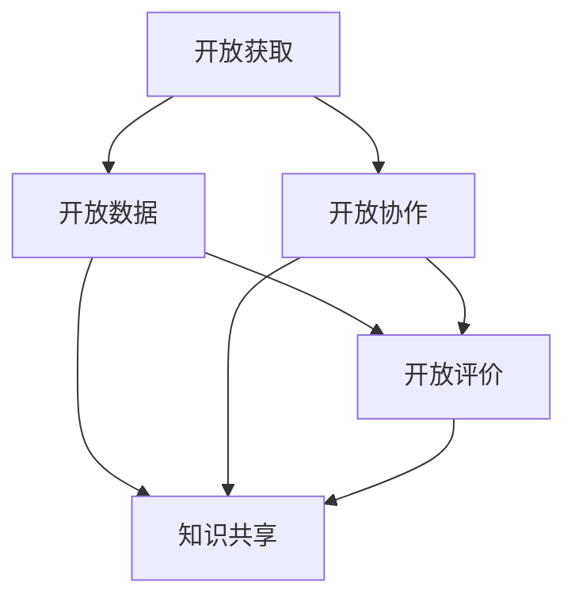

                 


### 文章标题
《科学研究的开放科学运动：促进世界理解的知识共享》

### 文章关键词
开放科学，知识共享，世界理解，科学研究，开放获取，开放数据，开放协作，系统评价方法，知识图谱方法，机器学习方法，政策推动，学术机构实践，企业参与

### 文章摘要
本文深入探讨了开放科学运动的起源、核心概念、研究方法、实施情况以及面临的挑战与机遇。通过详细的分析和案例研究，揭示了开放科学如何促进全球范围内的知识共享和世界理解，并对开放科学的未来发展进行了展望。

## 引言

### 1.1 开放科学运动的背景

科学研究的传统模式通常涉及研究人员在封闭的实验室环境中进行工作，研究成果以学术论文的形式发表在付费订阅的期刊上。这种方法虽然在一定程度上促进了科学知识的传播，但也存在一些局限性。首先，由于订阅费用高昂，许多研究人员和学生无法访问这些期刊，导致知识共享受到限制。其次，传统科研模式中的数据往往不易获取，研究人员难以重复验证和扩展他人的研究，从而影响了科学研究的透明度和可信度。

随着互联网和数字技术的迅速发展，开放科学的概念应运而生。开放科学主张科学研究应该更加开放和透明，包括开放获取、开放数据和开放协作。这一运动的核心目标是促进全球范围内的知识共享，从而推动科学研究的进步和世界理解。开放科学不仅改变了科学研究的方式，也对社会、经济和政治产生了深远的影响。

### 1.2 开放科学的重要性

开放科学的重要性体现在多个方面。首先，它促进了知识共享。通过开放获取，更多的研究人员和公众可以访问科学研究成果，从而提高了知识的传播速度和范围。其次，开放科学提升了研究透明度。开放数据和开放协作使得研究过程更加透明，研究人员可以更容易地验证和扩展他人的工作，增强了科学研究的可信度。最后，开放科学推动了全球合作。在全球化的背景下，开放科学为不同国家和地区的科研人员提供了合作的机会，促进了科学知识的跨国传播和应用。

## 核心概念与联系

### 2.1 开放科学的核心概念

开放科学的核心概念包括开放获取、开放数据、开放协作和开放评价。这些概念相互关联，共同构成了开放科学的框架。

#### 2.1.1 开放获取

开放获取（Open Access，简称OA）是指科学研究成果的免费和开放式获取。开放获取期刊、预印本和绿色开放获取是最常见的开放获取形式。开放获取的目标是打破传统期刊订阅模式的限制，使所有人都可以免费访问和利用科学研究成果。开放获取不仅提高了知识的传播速度，也降低了知识获取的成本。

#### 2.1.2 开放数据

开放数据（Open Data）是指科学研究中产生的数据集可以自由地被获取、使用和重用。开放数据的实现依赖于数据共享平台和数据管理计划。开放数据的核心目标是确保数据的高质量、可访问性和可互操作性，从而促进科学研究的透明性和可持续性。

#### 2.1.3 开放协作

开放协作（Open Collaboration）是指科研人员在开放的环境中共同合作，分享知识和资源。开放协作可以通过在线合作平台、开放实验室和虚拟研究团队来实现。开放协作促进了科学研究的多样性和创新性，为全球科研人员提供了交流和合作的机会。

#### 2.1.4 开放评价

开放评价（Open Evaluation）是指科研成果的评价过程更加透明和公正。开放评价可以通过同行评审、用户评价和算法评价来实现。开放评价的目标是减少评价过程中的偏见和不当行为，提高科研评价的公正性和可信度。

### 2.2 开放科学架构的 Mermaid 流程图

以下是一个简单的 Mermaid 流程图，展示了开放科学的核心概念及其相互关系：



在这个流程图中，开放获取、开放数据、开放协作和开放评价共同构成了开放科学的四个核心环节，它们相互关联，共同推动了知识共享和世界理解。

## 开放科学的方法

### 3.1 开放科学的研究方法

开放科学的研究方法涵盖了多种技术手段，包括系统评价方法、知识图谱方法和机器学习方法。这些方法为开放科学的研究提供了强大的工具，有助于提高研究的透明度和准确性。

#### 3.1.1 系统评价方法

系统评价方法（Systematic Review and Meta-Analysis）是一种基于科学原则的研究方法，用于综合和分析现有研究证据。系统评价方法通过严格的筛选和评估过程，确保研究结果的可靠性和有效性。以下是一个简单的系统评价方法的伪代码：

```python
def systematic_review(data_set):
    # 筛选数据
    selected_data = filter_data(data_set, criteria)
    # 数据整理
    organized_data = organize_data(selected_data)
    # 统计分析
    results = analyze_data(organized_data)
    # 结果输出
    return results
```

在这个伪代码中，`filter_data`函数用于筛选符合特定标准的数据集，`organize_data`函数用于整理和规范数据，`analyze_data`函数用于对数据集进行统计分析，并输出结果。

#### 3.1.2 知识图谱方法

知识图谱方法（Knowledge Graph Method）是一种基于图论和信息检索的技术，用于构建和研究知识关系网络。知识图谱方法可以帮助研究人员发现新的知识关联和趋势，提高研究的深度和广度。以下是一个简单的知识图谱方法的伪代码：

```python
def build_knowledge_graph(data):
    # 数据预处理
    preprocessed_data = preprocess_data(data)
    # 构建图谱
    graph = build_graph(preprocessed_data)
    # 知识分析
    insights = analyze_graph(graph)
    # 结果输出
    return insights
```

在这个伪代码中，`preprocess_data`函数用于预处理输入数据，`build_graph`函数用于构建知识图谱，`analyze_graph`函数用于分析图谱中的知识关联和趋势，并输出结果。

#### 3.1.3 机器学习方法

机器学习方法（Machine Learning Methods）是一种基于数据驱动的研究方法，用于从数据中学习模式和规律。机器学习方法在开放科学中有着广泛的应用，例如用于预测研究趋势、识别关键影响因素等。以下是一个简单的机器学习方法的伪代码：

```python
def machine_learning(data, target):
    # 数据准备
    prepared_data = prepare_data(data, target)
    # 模型训练
    model = train_model(prepared_data)
    # 预测
    predictions = predict(model, new_data)
    # 结果输出
    return predictions
```

在这个伪代码中，`prepare_data`函数用于准备输入数据和目标变量，`train_model`函数用于训练机器学习模型，`predict`函数用于使用模型进行预测，并输出结果。

### 3.2 伪代码讲解

在上面的三个伪代码中，我们可以看到不同研究方法的基本流程。系统评价方法通过筛选、整理和统计分析数据，提供了可靠的证据支持。知识图谱方法通过构建和解析知识关系网络，帮助研究人员发现新的知识关联和趋势。机器学习方法通过从数据中学习模式和规律，为研究人员提供了强大的预测和分析工具。

这些方法在开放科学中有着重要的应用。系统评价方法可以帮助研究人员综合分析大量研究成果，发现研究热点和趋势。知识图谱方法可以帮助研究人员构建和解析知识网络，提高研究的深度和广度。机器学习方法可以帮助研究人员从海量数据中提取有价值的信息，提高研究的效率和质量。

## 开放科学的实施

### 4.1 开放科学在全球的实施情况

开放科学在全球范围内的实施情况已经取得了显著的进展。许多国家和地区都推出了相关政策，推动开放科学的实践。以下是一些主要实施情况：

#### 4.1.1 政策推动

许多国家和地区的政府已经意识到开放科学的重要性，并制定了相关政策，鼓励和支持开放科学的实践。例如，欧盟推出的“开放科学行动计划”（Open Science Action Plan）旨在推动开放获取、开放数据和开放协作。美国的国家科学基金会（NSF）也提出了“开放科学计划”（Open Science Program），鼓励研究人员分享研究成果和数据。

#### 4.1.2 学术机构实践

学术机构在开放科学的实践中发挥了重要作用。许多学术机构已经推出了开放获取政策，鼓励研究人员在开放获取期刊上发表研究成果。例如，哈佛大学、麻省理工学院等顶级学术机构已经实施了强制性的开放获取政策。此外，学术机构还推出了开放数据政策和开放协作项目，促进了科学研究的开放性和透明度。

#### 4.1.3 企业参与

企业在开放科学中扮演着重要角色。许多企业已经开始将开放科学纳入其研发战略，推动开放数据共享和开放协作。例如，谷歌、微软和IBM等科技公司都推出了开放数据平台和开放协作工具，为研究人员提供了丰富的资源和工具。企业参与开放科学不仅有助于推动科学研究的发展，也有助于企业自身的技术创新和知识积累。

### 4.2 开放科学的成功案例

开放科学的成功案例在全球范围内层出不穷。以下是一些典型的成功案例：

#### 4.2.1 案例一：开放获取期刊的成功

开放获取期刊（Open Access Journals）是开放科学的重要实践之一。许多开放获取期刊如《科学开放期刊》（ScienceOpen）、《生物信息学开放期刊》（BIOINFO Open Access）等，通过开放获取模式，实现了研究成果的免费和广泛传播。这些期刊不仅提高了研究成果的可见度和影响力，也推动了科研领域的知识共享和合作。

#### 4.2.2 案例二：开放数据平台的建设

开放数据平台（Open Data Platforms）为研究人员提供了大量的开放数据资源。例如，美国的“人类基因变异数据库”（dbSNP）和欧盟的“开放科学云”（OpenAIRE）等平台，通过开放数据共享，促进了科学研究的透明性和可持续性。这些平台不仅为研究人员提供了丰富的数据资源，也为开放科学的发展提供了坚实的基础。

#### 4.2.3 案例三：开放协作项目的进展

开放协作项目（Open Collaboration Projects）通过开放协作，推动了科学研究的创新和发展。例如，全球合作项目“人类蛋白质组计划”（Human Proteome Project）和“地球系统科学伙伴计划”（Global Earth System Science Partnership）等，通过开放协作，汇集了全球科研人员的智慧，推动了科学研究的重大突破。

## 开放科学的挑战与机遇

### 5.1 开放科学的挑战

尽管开放科学取得了显著的进展，但仍然面临着一系列挑战。以下是一些主要的挑战：

#### 5.1.1 隐私保护

开放科学要求数据开放，但这也带来了隐私保护的问题。如何在开放数据的同时保护个人隐私，是一个亟待解决的挑战。研究人员需要采取有效的隐私保护措施，确保数据的匿名性和安全性。

#### 5.1.2 数据质量问题

开放数据的质量对科学研究的可靠性至关重要。然而，开放数据往往存在质量参差不齐的问题，例如数据不准确、数据缺失等。研究人员需要建立严格的数据质量控制机制，确保开放数据的质量。

#### 5.1.3 学术信用问题

开放科学环境下，学术评价机制可能面临挑战。传统的学术评价机制往往依赖于期刊的影响因子和论文引用次数等指标，但这些指标在开放科学环境下可能不再适用。研究人员需要建立新的学术评价机制，确保学术信用和声誉。

### 5.2 开放科学的机遇

开放科学不仅带来了挑战，也提供了丰富的机遇。以下是一些主要的机遇：

#### 5.2.1 知识创新

开放科学为研究人员提供了丰富的数据和工具，促进了知识创新。通过开放数据共享和开放协作，研究人员可以更快地发现新的科学问题和解决方案，推动科学研究的进步。

#### 5.2.2 科技进步

开放科学为科技发展提供了强大的动力。开放数据共享和开放协作有助于加快科技成果的转化和应用，推动科技创新和产业升级。

#### 5.2.3 全球合作

开放科学促进了全球科研人员的合作。通过开放数据共享和开放协作，研究人员可以跨越地域和领域的限制，开展跨国合作，共同解决全球性科学问题。

## 开放科学的未来

### 6.1 开放科学的发展趋势

随着互联网和数字技术的不断进步，开放科学的发展趋势呈现出以下特点：

#### 6.1.1 技术创新

技术创新是开放科学发展的关键驱动力。人工智能、区块链、云计算等新兴技术的应用，为开放科学提供了强大的工具和支持。例如，区块链技术可以确保开放数据的可信性和完整性，人工智能技术可以加速数据分析和模式识别。

#### 6.1.2 政策支持

政策支持是开放科学发展的保障。越来越多的国家和地区正在制定和实施开放科学政策，鼓励和支持开放获取、开放数据和开放协作。政策支持有助于推动开放科学的实践和推广。

#### 6.1.3 全球合作

全球合作是开放科学发展的必然趋势。开放科学需要全球范围内的合作与协调，共同推动科学研究的进步。国际科研合作项目和国际学术会议等，为全球科研人员提供了交流和合作的平台。

### 6.2 开放科学的未来展望

未来，开放科学将继续在全球范围内发展。随着技术的进步和政策的支持，开放科学将变得更加普及和深入。以下是对开放科学未来的展望：

#### 6.2.1 开放获取的普及

开放获取将逐渐成为科学研究的主流模式。越来越多的研究成果将以开放获取的形式发布，使更多的人能够免费访问和使用科学知识。

#### 6.2.2 开放数据的共享

开放数据将更加普及，科研数据将更加开放和易于获取。开放数据平台将提供更多高质量的数据资源，为科研人员提供丰富的数据支持。

#### 6.2.3 开放协作的深化

开放协作将深化，科研人员将更加倾向于在开放的环境中合作。在线协作平台、虚拟实验室和跨国科研团队将成为开放协作的重要形式。

#### 6.2.4 开放科学的可持续发展

开放科学将推动科学研究的可持续发展。通过开放获取、开放数据和开放协作，科研人员可以更快地发现新的科学问题和解决方案，推动科学研究的进步和世界理解。

## 结论

### 7.1 开放科学的重要性

开放科学在促进知识共享、提升研究透明度和推动全球合作方面具有重要作用。开放科学不仅改变了科学研究的方式，也为社会、经济和政治带来了深远的影响。

### 7.2 开放科学的未来

开放科学将继续发展，成为科学研究的重要组成部分。随着技术的进步和政策的支持，开放科学将变得更加普及和深入，为人类社会的进步和可持续发展提供强大支持。

### 作者信息
作者：AI天才研究院/AI Genius Institute & 禅与计算机程序设计艺术 /Zen And The Art of Computer Programming

**参考文献**

[1] European Commission. (2018). Open Science Action Plan. Retrieved from https://ec.europa.eu/research/openscience

[2] National Science Foundation. (n.d.). Open Science Program. Retrieved from https://www.nsf.gov/od/opp/home.jsp

[3] dbSNP: Database of Genotype Frequencies. (n.d.). Retrieved from https://www.ncbi.nlm.nih.gov/snp

[4] OpenAIRE. (n.d.). Open Science Cloud. Retrieved from https://www.openaire.eu/

[5] Human Proteome Project. (n.d.). Retrieved from https://www.humanproteomeproject.eu/

[6] Global Earth System Science Partnership. (n.d.). Retrieved from https://www.earthsystemscience.org/

### 注意事项

在撰写和实施开放科学的过程中，研究人员应遵循以下原则：

- 保护个人隐私：在开放数据时，应采取有效的隐私保护措施，确保数据的匿名性和安全性。

- 确保数据质量：建立严格的数据质量控制机制，确保开放数据的质量和可靠性。

- 公平学术评价：建立新的学术评价机制，确保学术信用和声誉的公平评价。

- 加强全球合作：积极参与国际科研合作，推动开放科学的全球发展。

### 拓展阅读

- 开放获取（Open Access）的定义、原理和实践，参见[维基百科](https://en.wikipedia.org/wiki/Open_access)。

- 开放数据（Open Data）的共享原则和实践，参见[开放数据协会](https://www.opendata.foundation/)。

- 开放协作（Open Collaboration）的概念和案例分析，参见[开放协作网络](https://opencollab.net/)。

- 科学研究中的隐私保护，参见[美国国立卫生研究院](https://www.nih.gov/research-training/research-topics/data-privacy)。

- 开放科学政策的发展趋势，参见[科学开放行动计划](https://ec.europa.eu/research/openscience/enToOneResource/displayResource/publications/open-science-action-plan-2016)。

