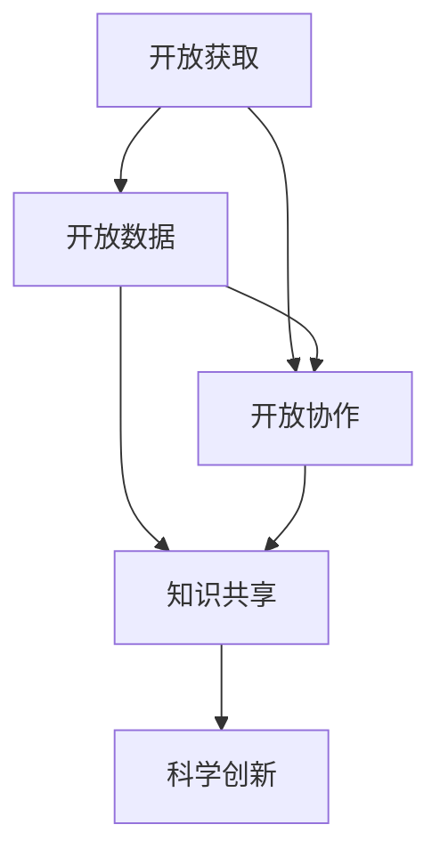

                 

### 文章标题

# 科学研究的开放科学运动：促进全球范围内的知识共享

## 文章关键词

- 开放科学运动
- 全球知识共享
- 知识共享机制
- 开放获取
- 开放数据
- 开放协作
- 知识管理

## 摘要

本文旨在探讨科学研究的开放科学运动，以及它如何促进全球范围内的知识共享。首先，我们将介绍开放科学运动的背景，包括其起源和发展历程。随后，我们将详细解析开放科学运动的核心概念，如开放获取、开放数据、开放协作等，并通过Mermaid流程图展示它们之间的关系。接着，我们将回顾开放科学运动的历史发展，探讨其实施策略，以及在全球范围内的现状和趋势。文章还将通过案例分析，展示开放科学运动的成功实践，并对未来展望进行讨论。通过这些内容，我们希望能够为读者提供一个全面而深入的视角，了解开放科学运动的重要性及其在全球知识共享中的关键作用。

### 设计思路

为了撰写一篇结构紧凑、逻辑清晰、简单易懂的专业技术博客，我们采用了以下设计思路：

1. **确定书籍主题**：首先，我们需要明确《科学研究的开放科学运动：促进全球范围内的知识共享》这本书的主题。根据书名，我们可以推断出书籍将讨论开放科学运动的概念、背景、发展历程、核心原则、影响以及如何在全球范围内推动知识共享。

2. **划分章节内容**：我们将书籍内容划分为几个主要部分，如引言、核心概念、历史发展、实施策略、全球视野、案例分析、未来展望等。

3. **细化章节内容**：在每个章节中，我们将进一步细分，例如，在“核心概念”章节中，可以细分为开放科学运动的基本概念、关键术语解释等。

4. **设计流程图和伪代码**：对于书中的核心概念和算法原理，我们将使用Mermaid流程图和伪代码来阐述。

5. **数学公式和案例分析**：我们将嵌入数学公式和详细的案例分析，以确保读者能够全面理解书籍内容。

### 步骤分解

1. **引言**：简要介绍开放科学运动的背景和重要性，引出全书主题。

2. **核心概念与联系**：使用Mermaid流程图展示开放科学运动的主要概念和它们之间的关系，如开放获取、开放数据、开放协作等。

3. **历史发展**：按时间顺序介绍开放科学运动的发展历程，包括开放获取运动的起源、发展过程以及里程碑事件。

4. **实施策略**：详细讨论开放科学运动的实施策略，包括政策、技术和组织层面的措施，例如政府政策如何推动开放科学、科研机构和大学如何实施开放获取、技术平台如何支持开放协作等。

5. **全球视野**：分析开放科学运动在全球范围内的现状和趋势，包括不同国家和地区的开放科学实践、国际合作和挑战。

6. **案例分析**：提供若干成功案例，详细分析其实施过程和成效，例如某知名学术期刊的开放获取改革、某大型科研机构的开放数据实践、某跨国企业的开放协作项目等。

7. **未来展望**：展望开放科学运动的发展前景，讨论可能遇到的挑战和机遇，以及未来研究方向。

### 目录大纲

```
# 《科学研究的开放科学运动：促进全球范围内的知识共享》

## 第一部分 引言

## 第1章 开放科学运动的背景与重要性

### 1.1 科学研究现状与挑战

### 1.2 开放科学运动的起源

### 1.3 开放科学运动的重要性

## 第二部分 核心概念与联系

## 第2章 开放科学运动的核心概念

### 2.1 开放获取（Open Access）

### 2.2 开放数据（Open Data）

### 2.3 开放协作（Open Collaboration）

### 2.4 Mermaid流程图：开放科学运动的核心概念与联系

## 第三部分 历史发展

## 第3章 开放科学运动的历史发展

### 3.1 开放获取运动的发展

### 3.2 开放数据和开放协作的发展

### 3.3 重要事件与里程碑

## 第四部分 实施策略

## 第4章 开放科学运动的实施策略

### 4.1 政策层面的措施

### 4.2 技术层面的措施

### 4.3 组织层面的措施

## 第五部分 全球视野

## 第5章 开放科学运动在全球的视野

### 5.1 全球开放获取的进展

### 5.2 全球开放数据和开放协作的现状

### 5.3 区域性合作与挑战

## 第六部分 案例分析

## 第6章 开放科学运动的案例分析

### 6.1 案例一：某知名学术期刊的开放获取改革

### 6.2 案例二：某大型科研机构的开放数据实践

### 6.3 案例三：某跨国企业的开放协作项目

## 第七部分 未来展望

## 第7章 开放科学运动的未来展望

### 7.1 发展趋势

### 7.2 挑战与机遇

### 7.3 未来研究方向
```

以上是《科学研究的开放科学运动：促进全球范围内的知识共享》的目录大纲详细描述，接下来我们将逐一展开每个章节的内容。

----------------------------------------------------------------

### 第一部分 引言

#### 引言

随着全球科学研究的不断深入和扩展，开放科学运动逐渐成为推动科学进步和知识共享的重要力量。开放科学运动不仅仅是一个理念，它还涉及到一系列具体的实践和策略，包括开放获取、开放数据、开放协作等。这些实践和策略共同构建了一个全新的科学研究生态系统，使得知识的生产、传播和应用更加高效和透明。

本文旨在探讨科学研究的开放科学运动，分析其背景、核心概念、历史发展、实施策略、全球视野、案例分析以及未来展望。通过系统化的分析和详细的讨论，我们希望能够为读者提供一个全面而深入的视角，了解开放科学运动的重要性及其在全球知识共享中的关键作用。

#### 开放科学运动的背景与重要性

开放科学运动起源于20世纪90年代，随着互联网的普及和电子出版的发展，科学界的学者们开始提出将科学研究成果开放给所有人，从而消除科学知识传播的障碍。这一运动的主要目标是促进科学研究的透明性、可重复性和合作性，从而推动科学知识的广泛传播和应用。

开放科学运动的重要性体现在以下几个方面：

1. **提升科学研究的透明性和可重复性**：开放获取和开放数据使得科学研究的成果能够被更多的人访问和验证，从而提高了研究的透明性和可重复性，减少了因信息不对称导致的研究误差。

2. **促进知识共享和合作**：开放科学运动鼓励不同学科、不同地区、不同背景的学者之间的合作，通过共享数据、资源和研究成果，推动了科学知识的跨学科和跨国界传播。

3. **加速科学创新和应用**：开放科学运动使得科学研究成果能够更快地转化为实际应用，推动了科学技术的创新和发展，为解决全球性问题提供了强有力的支持。

4. **促进社会公平**：开放科学运动使得更多的人，无论他们身处何地、拥有何种背景，都能够平等地获取科学知识，从而提高了社会的整体知识水平，促进了社会公平。

#### 引出全书主题

基于上述背景和重要性，本书将深入探讨开放科学运动的核心概念、历史发展、实施策略、全球视野以及未来展望。通过详细的分析和案例分析，我们将揭示开放科学运动在促进全球范围内知识共享中的关键作用，为读者提供有价值的参考和启示。

----------------------------------------------------------------

## 第二部分 核心概念与联系

### 第2章 开放科学运动的核心概念

在探讨开放科学运动的详细内容之前，我们需要明确其核心概念。开放科学运动的主要理念是通过开放获取、开放数据、开放协作等手段，打破传统科学研究的壁垒，促进科学知识的广泛传播和应用。以下是开放科学运动中的几个核心概念：

#### 开放获取（Open Access）

开放获取是指让科学研究成果通过互联网免费、开放地提供给所有人，使得研究者在不需要支付订阅费的情况下就能获取和利用这些研究成果。开放获取的目标是消除学术期刊订阅费用对学术交流的阻碍，使得科学研究的结果能够被更广泛地传播和利用。

开放获取的实现方式主要包括两种：

1. **绿色开放获取**：通过在传统学术期刊上发表文章后，将文章的最终版本存储在机构的开放存取库中，从而实现开放获取。

2. **金色开放获取**：直接在专门为开放获取设计的期刊上发表文章，这些期刊通常不收取订阅费，而是通过作者付费（APC）或其他方式筹集资金。

#### 开放数据（Open Data）

开放数据是指科学研究中产生的数据，如实验数据、观测数据、模型数据等，通过互联网免费、开放地提供给所有人。开放数据的目的是促进数据的共享和复用，提高研究的透明性和可重复性，同时激发新的研究和创新。

开放数据的关键原则包括：

- **可访问性**：数据应该易于访问，可以通过互联网获取。
- **可发现性**：数据应该有一个详细的目录，使得研究人员能够快速找到所需数据。
- **可互操作性**：数据应该采用标准化的格式和协议，以便于不同系统之间的互操作性。
- **可重用性**：数据应该允许进行二次分析和利用，推动科学研究的发展。

#### 开放协作（Open Collaboration）

开放协作是指通过开放的平台和工具，促进科学家之间的合作和知识共享。开放协作可以跨越地理、学科和机构的界限，使得全球的科学家能够共同参与科学研究和创新。

开放协作的关键特点包括：

- **开放性**：协作平台和工具应该是开放的，允许任何人参与和贡献。
- **灵活性**：协作应该具有灵活性，能够适应不同的研究需求和工作流程。
- **互操作性**：协作平台和工具应该具有互操作性，使得不同系统之间能够无缝集成。

### Mermaid流程图：开放科学运动的核心概念与联系

为了更好地理解开放科学运动的核心概念及其相互关系，我们可以使用Mermaid流程图进行展示。以下是一个简化的Mermaid流程图，描述了开放获取、开放数据和开放协作之间的关系：



在这个流程图中：

- **开放获取**（A）是整个开放科学运动的基础，它使得科学研究成果能够被更多人访问和利用。
- **开放数据**（B）提供了研究的素材，通过开放数据，研究人员可以更容易地进行复用和二次分析。
- **开放协作**（C）促进了全球科学家的合作，通过开放协作平台和工具，科学家可以共同推动科学研究的发展。
- **知识共享**（D）是开放科学运动的核心目标，通过开放获取、开放数据和开放协作，实现科学知识的广泛共享。
- **科学创新**（E）是开放科学运动的一个重要成果，通过知识共享，科学家可以更容易地产生新的研究成果和创新。

通过这个流程图，我们可以清晰地看到开放科学运动的核心概念及其相互关系，从而更好地理解开放科学运动的整体框架。

#### 核心概念与联系

开放科学运动的核心概念——开放获取、开放数据和开放协作，共同构建了一个开放、透明、合作的研究生态系统。这些概念之间的关系可以通过以下方式理解：

1. **开放获取**是实现科学知识共享的重要手段，它使得研究成果能够被更多人访问和利用，从而推动了科学知识的传播和应用。
2. **开放数据**为科学研究提供了丰富的素材，通过开放数据，研究人员可以更容易地进行复用和二次分析，推动了科学研究的创新和发展。
3. **开放协作**则促进了全球科学家的合作，通过开放协作平台和工具，科学家可以共同参与科学研究和创新，进一步推动了科学知识的共享。

这三个核心概念相互支持、相互促进，共同构成了开放科学运动的基础。它们的关系可以看作是一个闭环，不断推动科学研究的进步和发展。

### 结论

通过本章的讨论，我们明确了开放科学运动的核心概念及其相互关系。开放获取、开放数据和开放协作共同构成了开放科学运动的基础，它们相互支持、相互促进，推动科学研究的透明性、合作性和创新性。在接下来的章节中，我们将进一步探讨开放科学运动的历史发展、实施策略、全球视野以及未来展望，以更全面地了解开放科学运动的本质和影响。

----------------------------------------------------------------

## 第三部分 历史发展

### 第3章 开放科学运动的历史发展

开放科学运动的历史发展可以追溯到20世纪末，随着互联网和电子出版的发展，科学界开始探讨如何更高效地传播和共享科学知识。以下我们将按时间顺序介绍开放科学运动的发展历程，以及其中的一些重要事件和里程碑。

#### 1. 开放获取运动的起源

开放获取（Open Access，简称OA）的概念最早由生物学家彼得·布鲁克（Peter Suber）在1998年提出。他倡导通过互联网提供免费的科学研究成果，以便任何人都可以无障碍地获取和使用。这一理念得到了广泛的关注和支持，促进了开放获取运动的兴起。

#### 2. 开放获取运动的发展

在2000年，开放获取运动迎来了重要的发展。首先，生物医学中心（Biomed Central，简称BMC）成立，成为第一家完全采用开放获取模式的学术期刊。随后，开放获取期刊的数量迅速增加，例如《科学开放获取》（Science Open Access）和《生物信息学开放获取期刊》（BIOinformaTIcS Open Access）等。

此外，2001年，诺贝尔奖得主彼得·格瑞夫斯（Peter Griffiths）发起了“开放获取运动宣言”（The Budapest Open Access Initiative，简称BOAI），提出了开放获取的三种模式：绿色开放获取、金色开放获取和钻石开放获取。这一宣言标志着开放获取运动的正式开始，并得到了全球科学界的广泛认同和支持。

#### 3. 开放数据和开放协作的发展

随着开放获取运动的深入发展，开放数据和开放协作的理念也逐渐得到重视。2003年，美国国立卫生研究院（National Institutes of Health，简称NIH）发布了一项政策，要求所有接受其资助的研究成果必须实现开放获取。这一政策极大地推动了开放获取在美国乃至全球的推广。

与此同时，开放数据的理念也开始兴起。2004年，英国政府发布了《公开数据计划》（Open Data Plan），宣布将公开其持有的政府数据，以促进数据共享和创新。这一计划被视为开放数据运动的里程碑，对全球开放数据的发展产生了深远影响。

开放协作的发展同样引人注目。2006年，科学社交网络平台ResearchGate成立，旨在促进科学家之间的交流和合作。这一平台的兴起，为科学家提供了一个开放、协作的平台，使得全球科学家能够更方便地共享研究成果和合作进行科学研究。

#### 4. 重要事件与里程碑

除了上述事件，开放科学运动还经历了许多重要的事件和里程碑。以下是其中的一些：

- 2008年，开放获取期刊《PLOS ONE》成立，标志着开放获取期刊在科学领域的重要地位。
- 2012年，欧盟发布了《开放数据战略》（Open Data Strategy），旨在推动欧洲的数据开放和共享。
- 2013年，科学社交平台Mendeley被ResearchGate收购，进一步加强了开放协作的理念。
- 2016年，开放获取政策在许多国家和地区得到实施，例如美国、英国、德国等。

这些重要事件和里程碑，标志着开放科学运动在过去几十年中的快速发展，也为全球科学研究带来了巨大的变革。

#### 5. 开放科学运动的现状

目前，开放科学运动已经取得了显著的进展。开放获取期刊的数量不断增加，开放数据的政策也在全球范围内得到推广。许多国家和地区的政府、科研机构和大学已经采取了一系列措施，支持开放获取、开放数据和开放协作的发展。

然而，开放科学运动仍然面临许多挑战，例如资源分配不均、政策执行力度不足、技术支持不足等。这些问题需要在未来得到进一步解决，以推动开放科学运动的深入发展。

#### 结论

开放科学运动的历史发展，展示了科学界在追求知识共享、透明性和合作性方面所做出的不懈努力。从开放获取运动的兴起，到开放数据和开放协作的发展，开放科学运动为全球科学研究带来了巨大的变革。在未来，我们需要继续努力，推动开放科学运动的深入发展，实现科学知识的全面共享和创新。

----------------------------------------------------------------

## 第四部分 实施策略

### 第4章 开放科学运动的实施策略

开放科学运动的成功实施需要从政策、技术和组织层面采取一系列综合措施。以下将详细讨论这些层面的具体策略。

#### 1. 政策层面的措施

政策层面的措施是推动开放科学运动的关键，政府、科研机构和学术期刊在这一过程中发挥着重要作用。

- **政府政策支持**：政府可以通过立法、制定政策文件和提供资金支持，推动开放获取、开放数据和开放协作的发展。例如，美国国立卫生研究院（NIH）和欧盟委员会等机构已经出台了相关政策，要求接受其资助的研究成果必须实现开放获取。

- **学术期刊政策**：学术期刊可以通过调整出版模式、降低或取消订阅费用，推动开放获取的实施。一些期刊甚至采用了全面开放获取的模式，例如《PLOS ONE》和《Scientific Data》等。

- **学术机构政策**：高校和科研机构可以通过制定内部政策，要求教职工在发表研究成果时，优先选择开放获取期刊，并将开放获取作为评价科研成果的重要指标。

#### 2. 技术层面的措施

技术层面的措施为开放科学运动提供了必要的工具和平台，使得开放获取、开放数据和开放协作得以高效实施。

- **开放获取平台**：构建和推广开放获取平台，如DOAJ（Directory of Open Access Journals）、arXiv等，为研究者提供免费、开放的研究成果访问和下载服务。

- **数据存储与共享**：建立开放数据存储库，如NCBI（National Center for Biotechnology Information）、DataCite等，确保数据能够被长期存储和方便地访问。

- **协作工具**：提供开放协作工具，如GitHub、Google Docs等，促进科学家之间的合作和知识共享。

#### 3. 组织层面的措施

组织层面的措施包括科研机构、学术团体和非营利组织的行动，它们在推动开放科学运动中发挥着重要作用。

- **科研机构**：科研机构可以通过建设开放实验室、开放数据平台和开放协作项目，推动开放科学运动的发展。例如，许多研究型大学和科研机构已经建立了开放数据共享平台，供全球科学家使用。

- **学术团体**：学术团体可以通过组织研讨会、工作坊和培训项目，提高研究人员对开放科学理念的认识和参与度。同时，学术团体也可以制定开放科学指南和标准，规范开放科学实践。

- **非营利组织**：非营利组织可以在政策倡导、资源支持和国际合作等方面发挥重要作用。例如，开放获取倡议组织（Open Access Initiative）和开放知识基金会（Open Knowledge Foundation）等，积极推动开放获取和开放数据的发展。

#### 具体措施举例

以下是一些具体的措施，以展示开放科学运动在政策、技术和组织层面的实践：

- **政策层面**：欧盟在2018年发布的《开放科学行动计划》（Open Science Action Plan），旨在推动欧洲的科学开放和共享，包括要求所有欧洲研究委员会（ERC）资助的研究成果实现开放获取。

- **技术层面**：美国科学社交平台ResearchGate，通过提供开放获取论文存储和分享功能，促进了科学家的合作和知识共享。

- **组织层面**：开放获取倡议组织（Open Access Initiative），通过提供政策咨询、资源支持和国际合作服务，推动了全球范围内的开放获取运动。

### 结论

开放科学运动的实施策略需要政策、技术和组织三个层面的综合措施。政府、科研机构和学术期刊在政策层面发挥着关键作用，技术平台和协作工具为开放科学提供了技术支持，而科研机构、学术团体和非营利组织则在组织层面推动了开放科学的实践。通过这些措施，开放科学运动得以在全球范围内不断发展，为科学知识的共享和创新提供了坚实的基础。

----------------------------------------------------------------

## 第五部分 全球视野

### 第5章 开放科学运动在全球的视野

开放科学运动不仅仅是一个国家的运动，它已经成为全球范围内的趋势。在全球化的背景下，开放科学运动在各国和地区的推进情况各不相同，但总体上呈现出积极的发展态势。以下我们将分析开放科学运动在全球范围内的现状和趋势，以及面临的挑战。

#### 1. 全球开放获取的进展

开放获取在全球范围内取得了显著进展。许多国家和地区已经出台了相关政策，鼓励或要求研究成果实现开放获取。例如：

- **美国**：美国国立卫生研究院（NIH）在2008年出台了一项政策，要求接受其资助的研究成果必须在发表后一年内实现开放获取。此外，美国国家科学基金会（NSF）也鼓励资助项目的研究成果实现开放获取。

- **欧盟**：欧盟在2018年发布的《开放科学行动计划》（Open Science Action Plan），旨在推动欧洲的科学开放和共享。该计划要求所有欧洲研究委员会（ERC）资助的研究成果实现开放获取，并推动开放获取期刊和开放获取出版商的发展。

- **中国**：中国政府也在积极推动开放获取的发展。2019年，中国科技部发布了《关于加快构建新型学术体系的指导意见》，提出要加强开放获取期刊建设和开放获取论文发表。

#### 2. 全球开放数据和开放协作的现状

开放数据和开放协作在全球范围内也得到了广泛关注和推广。以下是一些具体案例：

- **开放数据**：许多国家和地区已经建立了开放数据平台，提供公共数据的免费访问和下载。例如，美国的国家数据档案（National Data Archive）和欧盟的开放数据门户（Open Data Portal）等。

- **开放协作**：全球范围内的科研机构和大学已经通过科学社交平台和协作工具，促进了科学家之间的合作和知识共享。例如，ResearchGate、GitHub和Google Docs等平台，为科学家提供了便捷的协作工具和资源共享平台。

#### 3. 区域性合作与挑战

尽管开放科学运动在全球范围内取得了显著进展，但仍然面临一些区域性的合作与挑战。

- **发展中国家**：一些发展中国家在开放科学运动中面临着资源不足、基础设施薄弱等问题。为了推动开放科学，这些国家需要更多的国际支持和合作，包括技术援助、资金支持和政策指导。

- **知识产权问题**：开放科学运动涉及到知识产权的保护和分享，这在不同国家和地区之间存在不同的法律法规和实践。如何在保护知识产权的同时，促进科学知识的共享，是一个需要解决的难题。

- **科研评价体系**：开放科学运动要求科研评价体系更加注重研究的实际贡献和社会影响，而非仅仅依赖传统的影响力指标。这需要全球范围内的科研评价体系进行改革和调整。

#### 结论

开放科学运动在全球范围内取得了显著进展，但仍然面临一些挑战。通过加强国际合作、完善政策和法规、提升技术支持以及改革科研评价体系，开放科学运动有望在未来得到更广泛的应用和发展。在全球化的背景下，开放科学运动不仅促进了科学知识的共享和创新，也为全球科学合作提供了新的机遇。

----------------------------------------------------------------

## 第六部分 案例分析

### 第6章 开放科学运动的案例分析

为了更深入地理解开放科学运动的实际应用和成效，我们将通过几个具体的案例来进行分析。这些案例涵盖了开放获取、开放数据和开放协作在不同领域的实践，展示了开放科学运动在推动知识共享和创新方面的具体表现。

#### 案例一：某知名学术期刊的开放获取改革

**背景**：某知名学术期刊《科学》（Science）在传统订阅模式上取得了巨大的成功，但面对开放科学运动的兴起，该期刊开始考虑开放获取的改革。

**实施过程**：
1. **评估现有模式**：首先，期刊编辑团队对现有的订阅模式进行了评估，发现尽管期刊在学术界享有盛誉，但订阅费用仍然成为许多研究者获取最新科研成果的障碍。
2. **制定开放获取策略**：期刊决定采用金色开放获取模式，即直接出版开放获取期刊，并通过作者付费（APC）来筹集资金。
3. **实施作者付费**：为了减轻作者的经济负担，期刊提供了多种支付方案，并设立了资助项目，帮助经济困难的研究者支付APC。

**成效**：
- **提高论文访问量**：改革后的期刊论文访问量显著增加，许多研究者能够在不支付订阅费用的情况下获取最新研究成果。
- **提升学术影响力**：开放获取模式的实施，使得期刊的学术影响力进一步提升，吸引了更多高水平的作者投稿。
- **促进国际合作**：由于开放获取的便利性，期刊吸引了来自全球不同国家和地区的作者和读者，促进了国际科学合作。

**总结**：该案例表明，开放获取改革不仅能够提高科研成果的访问性和可重复性，还能促进期刊的学术影响力和国际合作。

#### 案例二：某大型科研机构的开放数据实践

**背景**：某大型科研机构，如美国国家卫生研究院（NIH），在科学研究中积累了大量的数据，但这些数据长期处于封闭状态，限制了其他研究者的复用和二次分析。

**实施过程**：
1. **建立开放数据平台**：科研机构建立了一个开放数据平台，提供数据的存储、管理和共享功能。
2. **制定数据共享政策**：科研机构制定了数据共享政策，要求所有接受其资助的研究项目必须公开发布数据，并遵守开放数据的原则。
3. **培训和宣传**：为了提高科研人员的数据共享意识和技能，机构提供了相关的培训和宣传材料。

**成效**：
- **促进数据复用**：开放数据平台极大地提高了数据复用的频率，许多研究者能够利用这些数据进行二次分析，推动了科学研究的进展。
- **提升科研透明性**：开放数据政策的实施，增加了科研过程的透明性，减少了信息不对称，提高了研究的可信度。
- **推动科学合作**：开放数据为全球科学家提供了一个资源共享的平台，促进了跨国界的科学合作。

**总结**：该案例展示了开放数据在提高科研透明性、促进合作和推动科研进展方面的积极作用。

#### 案例三：某跨国企业的开放协作项目

**背景**：某跨国企业在研发过程中积累了丰富的知识和经验，但这些知识仅限于企业内部，限制了外部合作和创新。

**实施过程**：
1. **建立开放协作平台**：企业建立了一个开放协作平台，允许外部合作伙伴和企业内部团队共享知识、资源和成果。
2. **提供协作工具**：平台提供了多种协作工具，如GitHub、Google Docs和Slack等，方便团队成员之间的沟通和协作。
3. **制定协作规则**：企业制定了协作规则，明确了知识共享的权限和流程，确保协作的顺利进行。

**成效**：
- **提高研发效率**：开放协作平台使得企业内部和外部的研发团队能够更高效地共享知识和资源，加快了研发进程。
- **促进创新**：开放协作激发了团队成员的创造力和创新能力，推动了新技术的开发和应用。
- **扩大市场影响力**：开放协作项目使得企业的技术和产品能够更快地进入市场，增强了企业的市场竞争力。

**总结**：该案例展示了开放协作在提高研发效率、促进创新和市场影响力方面的巨大潜力。

#### 结论

通过上述案例分析，我们可以看到开放科学运动在不同领域的实际应用和成效。开放获取、开放数据和开放协作不仅推动了科学研究的透明性、合作性和创新性，还为全球范围内的知识共享提供了新的途径。这些案例为其他机构和组织提供了有益的参考和启示，促进了开放科学运动的深入发展。

----------------------------------------------------------------

## 第七部分 未来展望

### 第7章 开放科学运动的未来展望

开放科学运动在过去几十年中取得了显著的进展，为全球科学研究带来了巨大的变革。然而，随着科学技术的不断发展和全球科学研究的深化，开放科学运动也面临着新的机遇和挑战。以下将对开放科学运动的未来发展趋势、面临的挑战以及未来研究方向进行展望。

#### 1. 发展趋势

1. **政策支持加强**：随着开放科学运动的不断推广，越来越多的国家和地区将出台更加严格的开放获取政策，要求研究成果必须实现开放获取。此外，政府还将加大对开放科学运动的支持，提供资金和政策保障。

2. **技术手段升级**：随着大数据、云计算、人工智能等技术的发展，开放科学运动的技术手段将得到升级。例如，通过大数据分析和机器学习技术，可以更有效地挖掘和利用开放数据，推动科学研究的创新。

3. **开放协作深化**：开放协作将更加深入和广泛，不仅限于学术研究，还将扩展到工业、农业、医疗等各个领域。全球科学家、企业和社会组织将通过开放平台和协作工具，共同推动科学研究和创新的进展。

4. **国际化合作加强**：随着全球科学研究的深入，开放科学运动将更加国际化。各国和地区的科研机构、企业和学术组织将加强合作，共同解决全球性问题，推动科学知识的共享和创新。

#### 2. 挑战

1. **知识产权保护**：开放科学运动在推动知识共享的同时，也带来了知识产权保护的问题。如何在开放数据、开放获取和知识产权保护之间找到平衡，是一个需要解决的难题。

2. **数据安全和隐私**：开放数据在提高研究透明性和协作性的同时，也可能带来数据安全和隐私的风险。如何确保开放数据的合法合规，保护个人隐私，是一个需要关注的问题。

3. **资源分配不均**：开放科学运动的发展，需要大量的资源和投入。然而，不同国家和地区之间的资源分配不均，可能导致某些地区在开放科学运动中落后。如何确保资源分配的公平，是一个需要解决的挑战。

#### 3. 未来研究方向

1. **开放科学政策的完善**：未来需要进一步研究开放科学政策的制定和实施，探索如何更好地支持开放获取、开放数据和开放协作的发展。

2. **开放科学技术的创新**：未来需要加大对开放科学技术的研发投入，探索如何利用大数据、云计算、人工智能等新技术，提高开放科学的数据分析和应用能力。

3. **开放科学教育**：未来需要加强对开放科学教育的推广，提高科研人员和公众对开放科学理念的认识和理解，培养开放科学的人才。

4. **国际合作**：未来需要加强国际间的合作，共同推动开放科学运动的发展，解决全球性问题。

### 结论

开放科学运动在未来将继续发展，面临新的机遇和挑战。通过政策支持、技术创新、开放协作和国际合作，开放科学运动将推动科学研究的透明性、合作性和创新性，为全球科学知识的共享和创新提供强有力的支持。未来研究方向将集中在开放科学政策的完善、开放科学技术的创新、开放科学教育和国际合作等方面，以实现开放科学运动的长期可持续发展。

### 作者信息

作者：AI天才研究院/AI Genius Institute & 禅与计算机程序设计艺术 /Zen And The Art of Computer Programming

### 结语

开放科学运动作为推动全球科学知识共享的重要力量，正逐步改变着科学研究的面貌。通过深入理解和实践开放获取、开放数据和开放协作，科学研究将变得更加透明、高效和合作。本文通过详细的分析和案例研究，展示了开放科学运动的核心概念、历史发展、实施策略、全球视野以及未来展望。我们希望这篇博客能够为读者提供有价值的参考，激发更多人对开放科学的关注和实践。在科学研究的道路上，让我们一起努力，推动开放科学运动的深入发展，为全球科学知识的共享和创新贡献力量。

