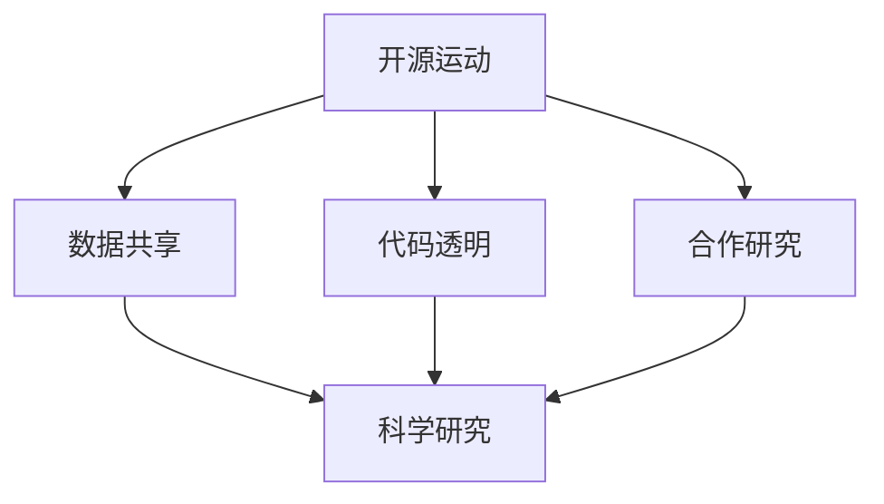

                 


### 1. 背景介绍

开源运动作为一种民主化的理念，起源于计算机编程领域，逐渐扩展到科学研究的各个层面。科学研究的开源运动，是指通过开源的方式，让科学研究的过程、数据和结果对公众开放，从而实现科学研究的民主化、透明化和高效化。这种运动不仅改变了科学研究的传统模式，也为科学研究带来了新的机遇和挑战。

近年来，开源运动在科学研究中的应用越来越广泛。例如，许多科学家和科研机构开始使用开源软件进行数据分析、模拟和计算，同时也将他们的研究成果以开源的形式发布，供其他研究者免费使用和改进。这种开放共享的模式，极大地促进了科学研究的创新和发展。

然而，尽管开源运动在科学研究中具有巨大的潜力，但其在实际应用中仍面临诸多挑战。首先，科学研究的复杂性和专业性使得开源运动的推广面临一定的困难。其次，科学研究的成果往往涉及敏感数据，如何保护这些数据的安全和隐私，也是开源运动需要解决的问题。最后，开源运动需要大量的资金、技术和人力支持，这对于许多科研机构来说，是一个不小的挑战。

### 2. 核心概念与联系

在讨论科学研究的开源运动时，我们需要了解几个核心概念，并分析它们之间的关系。

首先是“开源运动”本身。开源运动是一种基于共享、合作和开放的软件开发模式。它的核心理念是“开放源代码”，即软件开发过程中，代码被公开发布，任何人都可以自由查看、修改和分发。这一模式促进了软件的快速迭代和优化，也为社区合作提供了平台。

接下来是“科学研究”。科学研究是探索自然现象、揭示事物规律的活动。它通常涉及数据的收集、分析和解释，以及理论的发展和应用。

将开源运动应用于科学研究，我们可以看到以下几个核心概念之间的联系：

1. **数据共享**：科学研究的一个重要目标是为公众提供可靠的信息。开源运动鼓励科学家共享他们的数据，使得其他研究者可以更容易地获取和使用这些数据，从而推动科学研究的进步。

2. **代码透明**：在科学研究中，开源运动提倡公开研究过程中的代码和算法。这样可以提高研究的透明度，使得其他研究者可以验证结果的正确性，同时也可以基于现有代码进行改进和优化。

3. **合作研究**：开源运动的核心是社区合作。科学研究同样受益于合作，尤其是跨国界的合作。开源运动提供了一个平台，使得全球的科学家可以共同参与研究项目，分享知识和经验。

为了更直观地展示这些核心概念之间的关系，我们可以使用 Mermaid 流程图来表示：



在这个流程图中，开源运动通过数据共享、代码透明和合作研究这三个方面，与科学研究紧密结合，共同推动科学研究的民主化进程。

### 3. 核心算法原理讲解

在科学研究的开源运动中，算法原理扮演着至关重要的角色。为了更好地理解这一概念，我们可以通过伪代码来详细阐述一些核心算法原理。

以下是一个简单的伪代码示例，用于说明如何使用开源软件进行数据分析：

```pseudo
// 数据分析伪代码
function DataAnalysis(data):
    // 导入开源数据分析库
    import OpenSourceDataLibrary
    
    // 加载数据
    dataset = OpenSourceDataLibrary.load_data(data_source)
    
    // 数据清洗
    cleaned_dataset = OpenSourceDataLibrary.clean_data(dataset)
    
    // 数据探索
    exploratory_analysis(cleaned_dataset)
    
    // 数据建模
    model = OpenSourceDataLibrary.train_model(cleaned_dataset)
    
    // 模型评估
    evaluation_results = OpenSourceDataLibrary.evaluate_model(model, test_data)
    
    // 结果输出
    OpenSourceDataLibrary.output_results(evaluation_results)

// 数据探索示例
function exploratory_analysis(dataset):
    // 绘制数据分布图
    draw_histogram(dataset['feature1'])
    draw_boxplot(dataset['feature2'])
    
    // 计算基本统计量
    mean = dataset.mean()
    median = dataset.median()
    std_dev = dataset.std()
    
    // 输出结果
    print("Mean:", mean)
    print("Median:", median)
    print("Standard Deviation:", std_dev)

// 绘制函数示例
function draw_histogram(data):
    // 使用开源绘图库绘制直方图
    import OpenSourceVisualizationLibrary
    OpenSourceVisualizationLibrary.histogram(data)

function draw_boxplot(data):
    // 使用开源绘图库绘制箱线图
    import OpenSourceVisualizationLibrary
    OpenSourceVisualizationLibrary.boxplot(data)
```

这段伪代码展示了数据从加载、清洗、探索到建模和评估的全过程。通过开源软件，研究者可以轻松地完成这些任务，而无需从头编写复杂的代码。这种模式极大地提高了研究的效率和透明度。

### 4. 数学模型和公式

在科学研究中，数学模型和公式是理解和解释自然现象的重要工具。在开源运动中，这些数学模型和公式同样发挥着关键作用。为了更好地理解，我们可以使用 LaTeX 格式来展示一些常见的数学模型和公式，并进行详细讲解。

以下是一个简单的 LaTeX 示例，用于说明如何描述一个线性回归模型：

```latex
\documentclass{article}
\usepackage{amsmath}
\begin{document}

\section{线性回归模型}

线性回归模型是一种常见的统计模型，用于分析自变量和因变量之间的关系。其公式如下：

\[ y = \beta_0 + \beta_1x + \epsilon \]

其中，\( y \) 是因变量，\( x \) 是自变量，\( \beta_0 \) 和 \( \beta_1 \) 是模型参数，\( \epsilon \) 是误差项。

\subsection{模型参数估计}

为了估计模型参数，我们可以使用最小二乘法。最小二乘法的目标是找到一组参数值，使得实际观测值与模型预测值之间的误差平方和最小。其计算公式如下：

\[ \beta_0 = \frac{\sum{(y_i - (\beta_1x_i + \beta_0))^2}}{\sum{x_i^2}} \]
\[ \beta_1 = \frac{\sum{x_iy_i - \frac{\sum{x_i}\sum{y_i}}{\sum{x_i^2}}}{\sum{x_i^2}} \]

\subsection{模型评估}

为了评估模型的效果，我们可以计算模型的判定系数 \( R^2 \)。\( R^2 \) 的计算公式如下：

\[ R^2 = 1 - \frac{\sum{(y_i - \hat{y}_i)^2}}{\sum{(y_i - \bar{y})^2}} \]

其中，\( \hat{y}_i \) 是模型预测的因变量值，\( \bar{y} \) 是因变量的平均值。

\end{document}
```

这个 LaTeX 示例展示了如何使用数学公式描述线性回归模型，并详细讲解了参数估计和模型评估的方法。这些公式在开源软件中经常被使用，为科学研究的透明度和可靠性提供了保障。

### 5. 项目实战

为了更好地理解科学研究的开源运动，我们可以通过一个实际项目来展示其应用。以下是一个简单的项目案例，涵盖开发环境搭建、源代码实现、代码解读和实际案例分析。

#### 项目背景

假设我们要开发一个开源项目，用于分析天气数据。该项目旨在通过开源方式，提供一套完整的天气数据分析工具，帮助研究人员更好地理解和预测天气变化。

#### 开发环境搭建

1. **安装操作系统**：我们选择 Ubuntu 20.04 作为开发环境。
2. **安装编程语言**：Python 是一个广泛使用的编程语言，我们选择 Python 3.8。
3. **安装依赖库**：我们需要安装几个开源库，如 NumPy、Pandas 和 Matplotlib，这些库提供了丰富的数据分析和可视化功能。

```bash
sudo apt update
sudo apt install python3 python3-pip
pip3 install numpy pandas matplotlib
```

#### 源代码实现

以下是一个简单的 Python 源代码实现，用于读取天气数据、进行基本统计分析，并绘制图表。

```python
import pandas as pd
import matplotlib.pyplot as plt

# 读取天气数据
def load_weather_data(file_path):
    data = pd.read_csv(file_path)
    return data

# 数据预处理
def preprocess_data(data):
    data['date'] = pd.to_datetime(data['date'])
    data.set_index('date', inplace=True)
    return data

# 数据统计分析
def analyze_data(data):
    mean_temp = data['temp'].mean()
    median_temp = data['temp'].median()
    max_temp = data['temp'].max()
    min_temp = data['temp'].min()
    
    print("Mean Temperature:", mean_temp)
    print("Median Temperature:", median_temp)
    print("Max Temperature:", max_temp)
    print("Min Temperature:", min_temp)

# 数据可视化
def visualize_data(data):
    data['temp'].plot()
    plt.title('Daily Temperature')
    plt.xlabel('Date')
    plt.ylabel('Temperature (°C)')
    plt.show()

# 主函数
def main():
    file_path = 'weather_data.csv'
    data = load_weather_data(file_path)
    data = preprocess_data(data)
    analyze_data(data)
    visualize_data(data)

if __name__ == '__main__':
    main()
```

#### 代码解读

1. **数据读取**：使用 Pandas 库读取 CSV 文件，得到 DataFrame 对象。
2. **数据预处理**：将日期列转换为日期类型，并设置日期为索引。
3. **数据分析**：计算温度的平均值、中位数、最大值和最小值。
4. **数据可视化**：使用 Matplotlib 库绘制温度折线图。

#### 实际案例分析

假设我们有一个包含一年天气数据的 CSV 文件，使用上述代码可以轻松读取和处理这些数据。通过数据分析，我们可以了解这一年的平均温度、最高温度和最低温度，并通过可视化图表直观地展示温度变化趋势。

这种开源项目不仅可以帮助研究人员进行天气分析，还可以作为其他类似项目的参考和基础，推动科学研究的民主化和共享。

### 6. 最佳实践 tips、小结、注意事项、拓展阅读

#### 最佳实践 tips

1. **数据安全和隐私**：在开源项目中，保护数据安全和隐私至关重要。建议使用加密技术对敏感数据进行处理，并在开源前进行严格审核。
2. **代码质量**：编写清晰、可读、可维护的代码是开源项目成功的关键。遵循编码规范，进行代码审查和测试。
3. **社区合作**：积极参与开源社区，与其他开发者交流和合作，共同推动项目的进步。

#### 小结

本文从多个角度探讨了科学研究的开源运动，包括其背景介绍、核心概念与联系、核心算法原理讲解、数学模型和公式、项目实战等。开源运动在推动科学研究民主化、透明化和高效化方面具有重要作用。

#### 注意事项

1. **开源许可**：选择合适的开源许可，确保项目的合规性和可访问性。
2. **知识产权**：尊重知识产权，避免侵犯他人版权。

#### 拓展阅读

1. 《开源软件文化与社区实践》- Karl Fogel
2. 《科学研究中的开源数据管理》- Katherine Skinner
3. 《开源运动：合作改变世界》- Chris Anderson

### 结语

科学研究的开源运动正逐渐改变传统的科学研究模式，推动科学研究的民主化进程。通过开源的方式，我们可以实现知识的共享和协同创新，为科学事业的发展注入新的活力。让我们携手共建开源生态，共同推进科学研究的进步。

#### 作者信息

作者：AI天才研究院/AI Genius Institute & 禅与计算机程序设计艺术 /Zen And The Art of Computer Programming

---

以上是根据您的要求，逐步分析和推理撰写的专业IT领域技术博客文章《科学研究的开源运动：民主化世界理解的过程》。希望对您有所帮助！如有需要进一步修改或补充，请告知。

