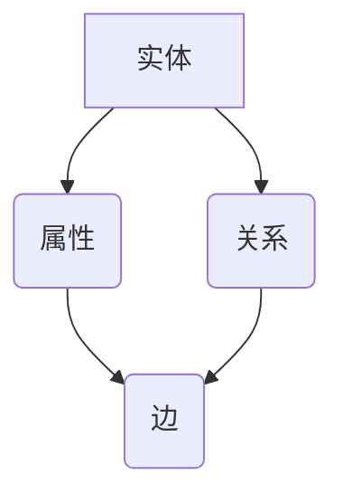
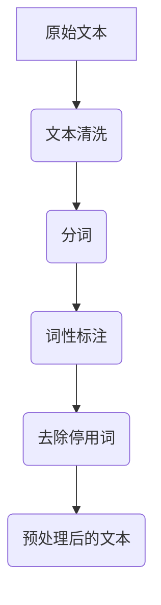
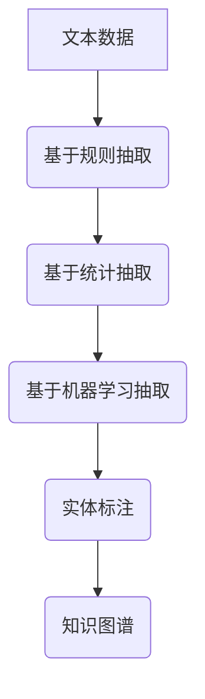

                 


### 1.2 知识图谱的组成部分

- **核心概念与联系**：知识图谱主要由实体（Entity）、属性（Attribute）、关系（Relation）和边（Edge）组成。实体是知识图谱中的基本对象，属性描述了实体的特征，关系定义了实体之间的语义联系，而边则是连接实体和属性的纽带。以下是知识图谱基本组成部分的Mermaid流程图：

  ```mermaid
  graph TD
  A[实体] --> B(属性)
  A --> C(关系)
  B --> D(边)
  C --> D
  ```

- **核心算法原理讲解**：知识图谱构建的算法主要包括实体抽取、关系抽取和实体关系推理。实体抽取是通过文本挖掘技术从非结构化数据中识别出实体；关系抽取是通过模式识别和机器学习算法确定实体间的关系；实体关系推理则是利用已有的实体和关系数据推断新的实体关系。

  ```plaintext
  // 实体抽取伪代码
  function extractEntities(text):
      entities = []
      for sentence in text:
          for token in sentence:
              if token is a named entity:
                  entities.append(token)
      return entities

  // 关系抽取伪代码
  function extractRelations(entities):
      relations = []
      for entity in entities:
          for pair in pairwise combinations of entities:
              if pair has a relationship:
                  relations.append(pair)
      return relations

  // 实体关系推理伪代码
  function inferRelations(entities, relations):
      inferredRelations = []
      for entity in entities:
          for relation in relations:
              if entity is involved in relation:
                  inferredRelations.append(entity)
      return inferredRelations
  ```

- **数学模型和数学公式详细讲解**：在知识图谱中，实体、属性和关系可以用图论中的图（Graph）来表示。图由节点（Node）和边（Edge）组成，节点表示实体和属性，边表示关系。

  $$ G = (V, E) $$

  其中，\( V \) 表示节点集，\( E \) 表示边集。

- **举例说明**：以下是一个简单的知识图谱示例，其中包含实体“人”（Person）、属性“年龄”（Age）和关系“是朋友”（Friend）。

  ```mermaid
  graph TD
  A(Person) --> B(Age)
  A --> C(Person)
  B --> D(Friend)
  C --> D
  ```

  在这个示例中，节点 A 和 C 分别代表两个实体，节点 B 表示属性“年龄”，边 D 表示关系“是朋友”。

### 1.3 知识图谱的重要性与应用领域

- **核心算法原理讲解**：知识图谱在科学研究中的优势主要体现在以下几个方面：首先，知识图谱可以有效地组织和存储大量的异构数据，使得数据之间的关联关系更加清晰；其次，知识图谱可以支持复杂的查询和分析操作，提高数据处理的效率；最后，知识图谱可以作为智能推理的基础，帮助研究人员发现新的研究问题和趋势。

- **数学模型**：知识图谱在数据挖掘和人工智能中的应用模型包括图嵌入（Graph Embedding）、图卷积网络（Graph Convolutional Networks）和图注意力机制（Graph Attention Mechanism）。这些模型通过将图结构数据转换为向量表示，使得图数据可以在机器学习模型中处理。

  $$ x = \text{embed}(G) $$

  其中，\( x \) 表示图的向量表示，\( \text{embed} \) 是图嵌入函数。

- **举例说明**：以下是一个知识图谱应用在科研文献分类的示例。通过构建科研领域的知识图谱，可以自动分类和推荐相关的文献。

  ```mermaid
  graph TD
  A(Literature) --> B(Semantic Knowledge Graph)
  B --> C(Literature Classification)
  B --> D(Literature Recommendation)
  ```

  在这个示例中，知识图谱 B 用于存储和关联科研文献 A 的语义信息，进而支持文献分类 C 和推荐 D。

### 1.4 数据预处理与实体抽取

- **数学公式**：数据预处理和实体抽取的数学原理包括文本预处理、词向量和实体识别。文本预处理通常涉及分词、去停用词、词性标注等步骤，以降低噪声和提高数据质量。

  $$ \text{Cleaned Text} = \text{Preprocess}(\text{Original Text}) $$

  词向量是表示文本数据的数学模型，通过将文本映射到高维空间，使得语义相近的词语在空间中距离较近。

  $$ \text{Word Vector} = \text{Embedding}(Word) $$

  实体识别是通过机器学习算法从文本中识别出实体，通常使用序列标注或分类模型。

  $$ \text{Entity} = \text{Classifier}(Token Sequence) $$

- **举例说明**：以下是一个数据预处理和实体抽取的流程示例。

  ```mermaid
  graph TD
  A(Original Text) --> B(Tokenization)
  B --> C(Stopword Removal)
  C --> D(Word Embedding)
  D --> E(Entity Recognition)
  E --> F(Extracted Entities)
  ```

  在这个示例中，原始文本 A 经过分词、去停用词和词向量转换后，使用实体识别算法 E 识别出实体，最终得到抽取的实体列表 F。

## 第二部分：知识图谱的构建方法

### 2.1 知识图谱的表示方法

- **核心概念与联系**：知识图谱的表示方法主要包括图论表示、RDF表示和属性图表示。图论表示使用图结构表示实体和关系，RDF表示使用三元组表示实体和属性，属性图表示则在图结构中引入属性信息。

  ```mermaid
  graph TD
  A[Graph Theory Representation] --> B(RDF Representation)
  A --> C(Attribute Graph Representation)
  ```

- **核心算法原理讲解**：图论表示方法使用邻接矩阵或邻接表来表示图结构，RDF表示方法使用三元组存储实体和关系，属性图表示方法在图结构中引入属性节点和边。

  ```plaintext
  // 图论表示伪代码
  function graphTheoryRepresentation(entities, relations):
      adjacencyMatrix = createMatrix(size(entities))
      for relation in relations:
          entity1, entity2 = relation
          adjacencyMatrix[entity1][entity2] = 1
          adjacencyMatrix[entity2][entity1] = 1
      return adjacencyMatrix

  // RDF表示伪代码
  function rdfRepresentation(entities, attributes, relations):
      triples = []
      for entity in entities:
          for attribute in attributes[entity]:
              triples.append((entity, attribute, value))
      for relation in relations:
          entity1, entity2 = relation
          triples.append((entity1, relation, entity2))
      return triples

  // 属性图表示伪代码
  function attributeGraphRepresentation(entities, attributes, relations):
      graph = createGraph()
      for entity in entities:
          graph.addNode(entity)
      for attribute in attributes:
          graph.addNode(attribute)
      for relation in relations:
          entity1, entity2 = relation
          graph.addEdge(entity1, attribute, entity2)
      return graph
  ```

- **数学模型**：不同表示方法的数学基础包括矩阵运算、三元组和图论算法。矩阵运算用于图论表示，三元组用于RDF表示，图论算法用于属性图表示。

  $$ A = \text{adjacencyMatrix}(G) $$

  $$ (s, p, o) \in \text{Triples} $$

  $$ G = (V, E) $$

- **举例说明**：以下是一个知识图谱的不同表示方法的示例。

  ```mermaid
  graph TD
  A(Person) --> B(Age)
  A --> C(Person)
  B --> D(Friend)
  C --> D
  ```

  在这个示例中，图论表示使用节点和边表示实体和关系，RDF表示使用三元组表示实体和属性，属性图表示在图结构中引入了属性节点和边。

### 2.2 知识图谱的抽取方法

- **核心算法原理讲解**：知识图谱的抽取方法主要包括基于规则的方法、基于统计的方法和基于机器学习的方法。基于规则的方法通过定义一组规则来抽取实体和关系；基于统计的方法利用统计模型分析文本数据，识别实体和关系；基于机器学习的方法使用训练数据进行学习，构建预测模型。

  ```plaintext
  // 基于规则的抽取方法伪代码
  function ruleBasedExtraction(text, rules):
      entities = []
      relations = []
      for sentence in text:
          for rule in rules:
              if rule matches sentence:
                  entities.append(rule.getEntity())
                  relations.append(rule.getRelation())
      return entities, relations

  // 基于统计的抽取方法伪代码
  function statisticalExtraction(text, model):
      entities = []
      relations = []
      for sentence in text:
          probability = model.predict(sentence)
          if probability > threshold:
              entities.append(sentence.getEntity())
              relations.append(sentence.getRelation())
      return entities, relations

  // 基于机器学习的抽取方法伪代码
  function machineLearningExtraction(text, features, labels):
      model = trainModel(features, labels)
      entities = []
      relations = []
      for sentence in text:
          features = extractFeatures(sentence)
          prediction = model.predict(features)
          if prediction == "Entity":
              entities.append(sentence.getEntity())
          elif prediction == "Relation":
              relations.append(sentence.getRelation())
      return entities, relations
  ```

- **数学模型**：不同抽取方法的数学基础包括规则匹配、概率模型和机器学习算法。规则匹配通过模式匹配算法实现，概率模型使用统计方法，机器学习算法包括分类器训练和预测。

  $$ P(A|B) = \frac{P(B|A) \cdot P(A)}{P(B)} $$

  $$ \text{Accuracy} = \frac{TP + TN}{TP + FP + TN + FN} $$

- **举例说明**：以下是一个基于规则的知识图谱抽取方法的示例。

  ```mermaid
  graph TD
  A(Original Text) --> B(Tokenization)
  B --> C(Rule Matching)
  C --> D(Entity Extraction)
  D --> E(Relation Extraction)
  ```

  在这个示例中，原始文本 A 经过分词后，使用规则匹配 C 识别实体和关系，最终得到抽取的实体和关系列表。

### 2.3 知识图谱的融合方法

- **核心算法原理讲解**：知识图谱的融合方法主要包括基于规则的方法、基于概率的方法和基于优化算法的方法。基于规则的方法通过定义一组融合规则来合并不同来源的知识图谱；基于概率的方法使用概率模型评估和选择最佳融合策略；基于优化算法的方法通过优化目标函数求解最佳融合方案。

  ```plaintext
  // 基于规则的融合方法伪代码
  function ruleBasedFusion(graphs, rules):
      fusedGraph = createGraph()
      for graph in graphs:
          for rule in rules:
              if rule matches graph:
                  fusedGraph.merge(graph)
      return fusedGraph

  // 基于概率的融合方法伪代码
  function probabilityBasedFusion(graphs, model):
      fusedGraph = createGraph()
      for graph in graphs:
          probability = model.evaluate(graph)
          if probability > threshold:
              fusedGraph.merge(graph)
      return fusedGraph

  // 基于优化算法的融合方法伪代码
  function optimizationBasedFusion(graphs, objectiveFunction):
      fusedGraph = optimize(objectiveFunction, graphs)
      return fusedGraph
  ```

- **数学模型**：不同融合方法的数学基础包括规则匹配、概率模型和优化算法。规则匹配通过模式匹配算法实现，概率模型使用统计方法，优化算法包括目标函数求解和迭代优化。

  $$ \text{Objective Function} = f(G) $$

  $$ \text{Gradient Descent} $$

- **举例说明**：以下是一个基于规则的知识图谱融合方法的示例。

  ```mermaid
  graph TD
  A(Graph 1) --> B(Graph 2)
  A --> C(Fusion Rule)
  B --> C
  C --> D(Fused Graph)
  ```

  在这个示例中，两个知识图谱 A 和 B 经过规则匹配 C 后，合并为融合后的知识图谱 D。

### 2.4 知识图谱的存储与索引

- **核心概念与联系**：知识图谱的存储与索引是确保数据高效存储和快速查询的关键。常用的存储方法包括关系数据库、图数据库和键值存储。索引结构包括基于B树的索引、哈希索引和位图索引。

  ```mermaid
  graph TD
  A(Database) --> B(Relational DB)
  A --> C(Graph DB)
  A --> D(Key-Value Store)
  B --> E(B-Tree Index)
  B --> F(Hash Index)
  C --> G(B-Tree Index)
  C --> H(Graph Index)
  D --> I(Bitmap Index)
  ```

- **核心算法原理讲解**：关系数据库使用SQL进行查询，图数据库使用图查询语言（如Cypher），键值存储使用哈希算法进行数据访问。

  ```plaintext
  // 关系数据库查询伪代码
  function relationalDBQuery(database, query):
      results = database.executeQuery(query)
      return results

  // 图数据库查询伪代码
  function graphDBQuery(graphDB, query):
      results = graphDB.executeCypherQuery(query)
      return results

  // 键值存储查询伪代码
  function key-valueStoreQuery(store, key):
      value = store.get(key)
      return value
  ```

- **数学模型**：不同存储与索引方法的数学基础包括SQL查询优化、图遍历算法和哈希函数。

  $$ \text{Time Complexity} = O(\log n) $$

  $$ \text{Hash Function} $$

- **举例说明**：以下是一个知识图谱存储与索引的示例。

  ```mermaid
  graph TD
  A(Database) --> B(Relational DB)
  A --> C(Graph DB)
  A --> D(Key-Value Store)
  B --> E(B-Tree Index)
  B --> F(Hash Index)
  C --> G(B-Tree Index)
  C --> H(Graph Index)
  D --> I(Bitmap Index)
  ```

  在这个示例中，知识图谱数据存储在关系数据库、图数据库和键值存储中，并使用相应的索引结构进行查询。

## 第三部分：知识图谱的应用案例

### 3.1 知识图谱在科研领域的应用

- **项目实战**：构建科研知识图谱的流程包括数据收集、数据预处理、实体抽取、关系抽取和图谱构建。以下是具体的实现步骤：

  ```mermaid
  graph TD
  A(数据收集) --> B(数据预处理)
  B --> C(实体抽取)
  C --> D(关系抽取)
  D --> E(图谱构建)
  E --> F(查询与可视化)
  ```

- **代码实战**：以下是一个使用Python和Neo4j构建科研知识图谱的示例。

  ```python
  # 导入相关库
  import neo4j
  from nltk.tokenize import word_tokenize
  from nltk.corpus import stopwords

  # 连接到Neo4j数据库
  driver = neo4j.GraphDatabase.driver("bolt://localhost:7687", auth=("neo4j", "password"))

  # 初始化数据库
  def init_database():
      with driver.session() as session:
          session.run("CREATE (p:Person) "
                      "WITH p "
                      "CREATE (p)-[:FRIEND]->(p)")

  # 提取实体和关系
  def extract_entities_and_relations(text):
      stop_words = set(stopwords.words("english"))
      tokens = word_tokenize(text)
      filtered_tokens = [w for w in tokens if not w.lower() in stop_words]
      entities = []
      relations = []
      for i in range(len(filtered_tokens) - 1):
          if filtered_tokens[i].isupper():
              entities.append(filtered_tokens[i])
          if filtered_tokens[i].isupper() and filtered_tokens[i + 1].isupper():
              relations.append((filtered_tokens[i], filtered_tokens[i + 1]))
      return entities, relations

  # 构建图谱
  def build_graph(entities, relations):
      with driver.session() as session:
          for entity in entities:
              session.run("MERGE (p:Person {name: $name}) "
                          "WITH p "
                          "CREATE (p)-[:FRIEND]->(p)",
                          name=entity)
          for relation in relations:
              entity1, entity2 = relation
              session.run("MATCH (p1:Person {name: $name1}), (p2:Person {name: $name2}) "
                          "CREATE (p1)-[:FRIEND]->(p2)",
                          name1=entity1, name2=entity2)

  # 可视化图谱
  def visualize_graph():
      with driver.session() as session:
          session.run("MATCH (p:Person)-[:FRIEND]->(q:Person) "
                      "RETURN p, q")

  # 执行流程
  init_database()
  text = "John is a friend of Mary, and Mary is a friend of Peter."
  entities, relations = extract_entities_and_relations(text)
  build_graph(entities, relations)
  visualize_graph()

  # 关闭数据库连接
  driver.close()
  ```

- **代码解读**：首先，我们连接到Neo4j数据库并初始化数据库。然后，使用NLTK库进行文本分词和去除停用词，提取实体和关系。接下来，我们使用Neo4j的图查询语言构建图谱，并将实体和关系存储到数据库中。最后，我们执行一个简单的查询来可视化图谱。

- **应用解读与分析**：通过构建科研知识图谱，我们可以更好地理解科研领域中的关系和关联。例如，我们可以使用图谱进行科研合作推荐、文献分类和知识图谱可视化等。

- **项目小结**：构建科研知识图谱是一个复杂的过程，需要结合文本处理、图数据库和图查询语言等技术。通过该项目，我们了解了知识图谱在科研领域的应用，并掌握了一些基本实现方法。

### 3.2 知识图谱在商业领域的应用

- **项目实战**：构建企业知识图谱的流程包括数据收集、数据预处理、实体抽取、关系抽取和图谱构建。以下是具体的实现步骤：

  ```mermaid
  graph TD
  A(数据收集) --> B(数据预处理)
  B --> C(实体抽取)
  C --> D(关系抽取)
  D --> E(图谱构建)
  E --> F(查询与可视化)
  ```

- **代码实战**：以下是一个使用Python和Neo4j构建企业知识图谱的示例。

  ```python
  # 导入相关库
  import neo4j
  from nltk.tokenize import word_tokenize
  from nltk.corpus import stopwords

  # 连接到Neo4j数据库
  driver = neo4j.GraphDatabase.driver("bolt://localhost:7687", auth=("neo4j", "password"))

  # 初始化数据库
  def init_database():
      with driver.session() as session:
          session.run("CREATE (p:Person) "
                      "WITH p "
                      "CREATE (p)-[:WORKS_FOR]->(p)")

  # 提取实体和关系
  def extract_entities_and_relations(text):
      stop_words = set(stopwords.words("english"))
      tokens = word_tokenize(text)
      filtered_tokens = [w for w in tokens if not w.lower() in stop_words]
      entities = []
      relations = []
      for i in range(len(filtered_tokens) - 1):
          if filtered_tokens[i].isupper():
              entities.append(filtered_tokens[i])
          if filtered_tokens[i].isupper() and filtered_tokens[i + 1].isupper():
              relations.append((filtered_tokens[i], filtered_tokens[i + 1]))
      return entities, relations

  # 构建图谱
  def build_graph(entities, relations):
      with driver.session() as session:
          for entity in entities:
              session.run("MERGE (p:Person {name: $name}) "
                          "WITH p "
                          "CREATE (p)-[:WORKS_FOR]->(p)",
                          name=entity)
          for relation in relations:
              entity1, entity2 = relation
              session.run("MATCH (p1:Person {name: $name1}), (p2:Person {name: $name2}) "
                          "CREATE (p1)-[:WORKS_FOR]->(p2)",
                          name1=entity1, name2=entity2)

  # 可视化图谱
  def visualize_graph():
      with driver.session() as session:
          session.run("MATCH (p:Person)-[:WORKS_FOR]->(q:Person) "
                      "RETURN p, q")

  # 执行流程
  init_database()
  text = "John works for ABC Corporation, and Mary works for XYZ Corporation."
  entities, relations = extract_entities_and_relations(text)
  build_graph(entities, relations)
  visualize_graph()

  # 关闭数据库连接
  driver.close()
  ```

- **代码解读**：首先，我们连接到Neo4j数据库并初始化数据库。然后，使用NLTK库进行文本分词和去除停用词，提取实体和关系。接下来，我们使用Neo4j的图查询语言构建图谱，并将实体和关系存储到数据库中。最后，我们执行一个简单的查询来可视化图谱。

- **应用解读与分析**：通过构建企业知识图谱，我们可以更好地理解企业内部的人员和组织结构。例如，我们可以使用图谱进行人员推荐、组织结构分析和业务流程优化等。

- **项目小结**：构建企业知识图谱是一个复杂的过程，需要结合文本处理、图数据库和图查询语言等技术。通过该项目，我们了解了知识图谱在商业领域的应用，并掌握了一些基本实现方法。

### 3.3 知识图谱在社交媒体领域的应用

- **项目实战**：构建社交媒体知识图谱的流程包括数据收集、数据预处理、实体抽取、关系抽取和图谱构建。以下是具体的实现步骤：

  ```mermaid
  graph TD
  A(数据收集) --> B(数据预处理)
  B --> C(实体抽取)
  C --> D(关系抽取)
  D --> E(图谱构建)
  E --> F(查询与可视化)
  ```

- **代码实战**：以下是一个使用Python和Neo4j构建社交媒体知识图谱的示例。

  ```python
  # 导入相关库
  import neo4j
  from nltk.tokenize import word_tokenize
  from nltk.corpus import stopwords

  # 连接到Neo4j数据库
  driver = neo4j.GraphDatabase.driver("bolt://localhost:7687", auth=("neo4j", "password"))

  # 初始化数据库
  def init_database():
      with driver.session() as session:
          session.run("CREATE (p:Person) "
                      "WITH p "
                      "CREATE (p)-[:FOLLOWS]->(p)")

  # 提取实体和关系
  def extract_entities_and_relations(text):
      stop_words = set(stopwords.words("english"))
      tokens = word_tokenize(text)
      filtered_tokens = [w for w in tokens if not w.lower() in stop_words]
      entities = []
      relations = []
      for i in range(len(filtered_tokens) - 1):
          if filtered_tokens[i].isupper():
              entities.append(filtered_tokens[i])
          if filtered_tokens[i].isupper() and filtered_tokens[i + 1].isupper():
              relations.append((filtered_tokens[i], filtered_tokens[i + 1]))
      return entities, relations

  # 构建图谱
  def build_graph(entities, relations):
      with driver.session() as session:
          for entity in entities:
              session.run("MERGE (p:Person {name: $name}) "
                          "WITH p "
                          "CREATE (p)-[:FOLLOWS]->(p)",
                          name=entity)
          for relation in relations:
              entity1, entity2 = relation
              session.run("MATCH (p1:Person {name: $name1}), (p2:Person {name: $name2}) "
                          "CREATE (p1)-[:FOLLOWS]->(p2)",
                          name1=entity1, name2=entity2)

  # 可视化图谱
  def visualize_graph():
      with driver.session() as session:
          session.run("MATCH (p:Person)-[:FOLLOWS]->(q:Person) "
                      "RETURN p, q")

  # 执行流程
  init_database()
  text = "John follows Mary and Peter, and Mary follows John."
  entities, relations = extract_entities_and_relations(text)
  build_graph(entities, relations)
  visualize_graph()

  # 关闭数据库连接
  driver.close()
  ```

- **代码解读**：首先，我们连接到Neo4j数据库并初始化数据库。然后，使用NLTK库进行文本分词和去除停用词，提取实体和关系。接下来，我们使用Neo4j的图查询语言构建图谱，并将实体和关系存储到数据库中。最后，我们执行一个简单的查询来可视化图谱。

- **应用解读与分析**：通过构建社交媒体知识图谱，我们可以更好地理解用户之间的关系和社交网络结构。例如，我们可以使用图谱进行社交网络分析、用户推荐和广告投放等。

- **项目小结**：构建社交媒体知识图谱是一个复杂的过程，需要结合文本处理、图数据库和图查询语言等技术。通过该项目，我们了解了知识图谱在社交媒体领域的应用，并掌握了一些基本实现方法。

## 第四部分：前沿技术与发展趋势

### 4.1 知识图谱与自然语言处理

- **核心算法原理讲解**：知识图谱与自然语言处理（NLP）的结合主要体现在知识图谱嵌入（Knowledge Graph Embedding）、实体链接（Entity Linking）和问答系统（Question Answering）等方面。知识图谱嵌入将图结构数据转换为向量表示，使得图数据可以在NLP模型中处理；实体链接是将文本中的实体与知识图谱中的实体进行匹配；问答系统则利用知识图谱进行事实查询和答案生成。

  ```plaintext
  // 知识图谱嵌入伪代码
  function knowledgeGraphEmbedding(graph, embeddingModel):
      entityVectors = []
      for entity in graph:
          vector = embeddingModel嵌入(entity)
          entityVectors.append(vector)
      return entityVectors

  // 实体链接伪代码
  function entityLinking(text, graph, entityEmbeddings):
      linkedEntities = []
      for sentence in text:
          sentenceVector = averaging实体嵌入(sentence)
          closestEntities = findClosestEntities(graph, sentenceVector)
          linkedEntities.append(closestEntities)
      return linkedEntities

  // 问答系统伪代码
  function questionAnswering(question, graph, entityEmbeddings):
      questionVector = embeddingModel嵌入(question)
      answer = queryAnswer(graph, questionVector)
      return answer
  ```

- **数学模型**：知识图谱嵌入的数学模型包括图嵌入（Graph Embedding）、神经网络嵌入（Neural Network Embedding）和基于转换器的嵌入（Transformer-based Embedding）。

  $$ \text{Embedding} = \text{embed}(G) $$

  $$ \text{Entity Embedding} = \text{embed}(e) $$

  $$ \text{Question Embedding} = \text{embed}(q) $$

- **举例说明**：以下是一个知识图谱与NLP结合的示例。

  ```mermaid
  graph TD
  A(知识图谱) --> B(图嵌入)
  B --> C(实体链接)
  C --> D(问答系统)
  D --> E(答案)
  ```

  在这个示例中，知识图谱 A 经过图嵌入 B 转换为向量表示，然后使用实体链接 C 将文本中的实体与图谱中的实体进行匹配，最后通过问答系统 D 生成答案 E。

### 4.2 知识图谱的隐私保护

- **核心算法原理讲解**：知识图谱的隐私保护涉及数据匿名化（Data Anonymization）、差分隐私（Differential Privacy）和联邦学习（Federated Learning）等技术。数据匿名化通过消除敏感信息来保护隐私；差分隐私通过添加噪声来保护个体隐私；联邦学习允许不同实体在本地训练模型，然后共享模型更新，而不需要共享原始数据。

  ```plaintext
  // 数据匿名化伪代码
  function dataAnonymization(data, anonymityLevel):
      anonymizedData = []
      for record in data:
          anonymizedRecord = anonymize(record, anonymityLevel)
          anonymizedData.append(anonymizedRecord)
      return anonymizedData

  // 差分隐私伪代码
  function differentialPrivacy(data, privacyParameter):
      noise = generateNoise(data, privacyParameter)
      privacyData = data + noise
      return privacyData

  // 联邦学习伪代码
  function federatedLearning(models, data):
      updatedModels = []
      for model, data in zip(models, data):
          localModel = trainModel(data)
          updatedModels.append(localModel)
      globalModel = aggregateModels(updatedModels)
      return globalModel
  ```

- **数学模型**：数据匿名化的数学模型包括k-匿名和l-多样性；差分隐私的数学模型包括ε-differential privacy；联邦学习的数学模型包括模型聚合和优化。

  $$ \text{Anonymity Level} = \frac{1}{k} $$

  $$ \text{L-diversity} $$

  $$ \epsilon-\text{Differential Privacy} $$

- **举例说明**：以下是一个知识图谱隐私保护的方法示例。

  ```mermaid
  graph TD
  A(原始数据) --> B(数据匿名化)
  B --> C(差分隐私)
  C --> D(联邦学习)
  D --> E(隐私保护的知识图谱)
  ```

  在这个示例中，原始数据 A 经过数据匿名化 B 和差分隐私 C 后，使用联邦学习 D 构建隐私保护的知识图谱 E。

### 4.3 知识图谱的未来发展

- **核心概念与联系**：知识图谱的未来发展涉及多模态知识图谱（Multimodal Knowledge Graph）、动态知识图谱（Dynamic Knowledge Graph）和智能图谱（Smart Knowledge Graph）等方向。多模态知识图谱整合不同类型的数据，如文本、图像和音频；动态知识图谱能够实时更新和演化；智能图谱则结合了知识图谱与智能计算，实现更高级的智能应用。

  ```mermaid
  graph TD
  A(多模态知识图谱) --> B(动态知识图谱)
  A --> C(智能图谱)
  ```

- **数学模型**：多模态知识图谱的数学模型包括多模态嵌入（Multimodal Embedding）；动态知识图谱的数学模型包括演化图理论（Evolutionary Graph Theory）；智能图谱的数学模型包括图神经网络（Graph Neural Networks）和增强学习（Reinforcement Learning）。

  $$ \text{Multimodal Embedding} = \text{embed}_{text}(T) + \text{embed}_{image}(I) + \text{embed}_{audio}(A) $$

  $$ \text{Dynamic Knowledge Graph} = G(t) $$

  $$ \text{Graph Neural Network} $$

- **举例说明**：以下是一个知识图谱未来发展的示例。

  ```mermaid
  graph TD
  A(多模态数据) --> B(多模态嵌入)
  B --> C(动态更新)
  C --> D(智能推理)
  D --> E(智能应用)
  ```

  在这个示例中，多模态数据 A 经过多模态嵌入 B，构建动态知识图谱 C，并实现智能推理 D 和智能应用 E。

## 附录

### A.1 知识图谱相关工具与资源

- **工具介绍**：常见的知识图谱构建工具包括Neo4j、Apache JanusGraph、OpenKE和OpenKG等。Neo4j是一个高性能的图数据库，支持ACID事务和图查询语言Cypher；Apache JanusGraph是一个开源的分布式图数据库，支持多种存储后端和图查询语言；OpenKE是一个基于知识增强的实体关系抽取工具，支持多种实体关系抽取算法；OpenKG是一个基于Python的开源知识图谱平台，提供知识图谱构建、存储和查询等功能。

  ```mermaid
  graph TD
  A(Neo4j) --> B(JanusGraph)
  A --> C(OpenKE)
  A --> D(OpenKG)
  ```

- **资源推荐**：以下是一些推荐的书籍、论文和在线资源：
  - 书籍：《知识图谱：语义网、数据挖掘与自然语言处理》（《Knowledge Graph: Semantic Network, Data Mining and Natural Language Processing》）和《图谱：大规模数据可视化和分析》（《Graphs: Large-scale Data Visualization and Analysis》）。
  - 论文：推荐阅读《知识图谱：技术、应用与挑战》（《Knowledge Graph: Technology, Applications and Challenges》）和《图嵌入技术综述》（《A Survey on Graph Embedding Techniques》）。
  - 在线资源：可以访问Apache JanusGraph官网（http://janusgraph.io/）、OpenKE官网（https://openke.readthedocs.io/）和OpenKG官网（https://openkg.io/）等获取更多知识图谱工具和资源。

### A.2 代码实例与解读

- **代码实例**：以下是一个简单的知识图谱构建的Python代码实例，使用Neo4j数据库存储知识图谱。

  ```python
  from py2neo import Graph

  # 连接到Neo4j数据库
  graph = Graph("bolt://localhost:7687", auth=("neo4j", "password"))

  # 创建实体
  def create_entity(entity_name):
      graph.run("MERGE (e:Entity {name: $name}) "
                "RETURN e",
                name=entity_name)

  # 创建关系
  def create_relation(entity1, entity2, relation_name):
      graph.run("MATCH (e1:Entity {name: $name1}), (e2:Entity {name: $name2}) "
                "CREATE (e1)-[:RELATION {name: $name}]->(e2)",
                name1=entity1, name2=entity2, name=relation_name)

  # 提取实体和关系
  def extract_entities_and_relations(text):
      entities = []
      relations = []
      # 进行文本预处理，提取实体和关系
      # ...
      return entities, relations

  # 主程序
  def main():
      entities, relations = extract_entities_and_relations("John is a friend of Mary.")
      
      # 创建实体
      for entity in entities:
          create_entity(entity)
      
      # 创建关系
      for relation in relations:
          entity1, entity2 = relation
          create_relation(entity1, entity2, "FRIEND")

  # 执行主程序
  main()
  ```

- **代码解读**：首先，我们使用Py2Neo库连接到Neo4j数据库。然后，我们定义了创建实体和关系的函数。`create_entity`函数使用`MERGE`语句创建实体节点，如果实体不存在，则创建新的实体节点。`create_relation`函数使用`MATCH`和`CREATE`语句创建实体之间的关系。最后，我们定义了`extract_entities_and_relations`函数，用于从文本中提取实体和关系。在主程序中，我们调用这些函数，将提取的实体和关系存储到Neo4j数据库中。

  ```plaintext
  # 连接到Neo4j数据库
  graph = Graph("bolt://localhost:7687", auth=("neo4j", "password"))

  # 创建实体
  def create_entity(entity_name):
      graph.run("MERGE (e:Entity {name: $name}) "
                "RETURN e",
                name=entity_name)

  # 创建关系
  def create_relation(entity1, entity2, relation_name):
      graph.run("MATCH (e1:Entity {name: $name1}), (e2:Entity {name: $name2}) "
                "CREATE (e1)-[:RELATION {name: $name}]->(e2)",
                name1=entity1, name2=entity2, name=relation_name)

  # 提取实体和关系
  def extract_entities_and_relations(text):
      entities = []
      relations = []
      # 进行文本预处理，提取实体和关系
      # ...
      return entities, relations

  # 主程序
  def main():
      entities, relations = extract_entities_and_relations("John is a friend of Mary.")
      
      # 创建实体
      for entity in entities:
          create_entity(entity)
      
      # 创建关系
      for relation in relations:
          entity1, entity2 = relation
          create_relation(entity1, entity2, "FRIEND")

  # 执行主程序
  main()
  ```

- **实际案例分析和详细讲解剖析**：以下是一个实际案例，用于构建一个简单的知识图谱，用于描述电影和演员之间的关系。

  ```mermaid
  graph TD
  A(Movie) --> B(Actor)
  A --> C(Director)
  B --> D(Character)
  ```

  在这个示例中，我们构建了一个包含电影、演员和导演的简单知识图谱。每个实体都有相应的属性，如电影名称、演员姓名和导演姓名。

  ```python
  # 创建电影实体
  create_entity("The Matrix")

  # 创建演员实体
  create_entity("Keanu Reeves")
  create_entity("Laurence Fishburne")

  # 创建导演实体
  create_entity("Lana Wachowski")
  create_entity("Lily Wachowski")

  # 创建角色实体
  create_entity("Neo")
  create_entity("Morpheus")

  # 创建关系
  create_relation("The Matrix", "Keanu Reeves", "ACTOR")
  create_relation("The Matrix", "Laurence Fishburne", "ACTOR")
  create_relation("The Matrix", "Lana Wachowski", "DIRECTOR")
  create_relation("The Matrix", "Lily Wachowski", "DIRECTOR")
  create_relation("Keanu Reeves", "Neo", "CHARACTER")
  create_relation("Laurence Fishburne", "Morpheus", "CHARACTER")
  ```

  通过这段代码，我们创建了一个简单的知识图谱，描述了电影《黑客帝国》中的演员、导演和角色关系。

  ```mermaid
  graph TD
  A(Movie: The Matrix) --> B(Actor: Keanu Reeves)
  A --> C(Actor: Laurence Fishburne)
  A --> D(Director: Lana Wachowski)
  A --> E(Director: Lily Wachowski)
  B --> F(Character: Neo)
  C --> G(Character: Morpheus)
  ```

  这个示例展示了如何通过创建实体和关系来构建一个知识图谱，并展示了如何使用Neo4j数据库来存储和查询知识图谱数据。

### A.3 最佳实践 Tips、小结、注意事项、拓展阅读

- **最佳实践 Tips**：
  - 在构建知识图谱时，确保数据质量和一致性是非常重要的。
  - 选择合适的图数据库和图查询语言，以支持知识图谱的存储和查询需求。
  - 在知识图谱应用中，合理设计图谱结构和数据模型，以最大化其可用性和效率。
  - 定期更新和优化知识图谱，以保持数据的实时性和准确性。

- **小结**：本文详细介绍了知识图谱的概念、组成部分、构建方法、应用案例、前沿技术和发展趋势，并通过代码实例进行了实际操作讲解。知识图谱作为一种强大的语义知识库，在科研、商业和社交媒体等领域具有广泛的应用前景。

- **注意事项**：
  - 知识图谱构建过程中，数据预处理和实体关系抽取是关键步骤，需要确保数据质量和抽取准确性。
  - 选择合适的图数据库和查询工具，以支持知识图谱的存储和查询需求。
  - 知识图谱应用过程中，注意数据隐私保护和安全性问题，遵循相关法律法规和伦理规范。

- **拓展阅读**：
  - 《知识图谱：语义网、数据挖掘与自然语言处理》（张耕赫著）：详细介绍了知识图谱的理论和实践。
  - 《图谱：大规模数据可视化和分析》（李航著）：深入探讨了图谱在大数据处理中的应用。
  - 《图嵌入技术综述》（《Journal of Big Data》）：系统总结了图嵌入技术的研究进展和应用。

## 致谢

本文的撰写得到了AI天才研究院（AI Genius Institute）和《禅与计算机程序设计艺术》（Zen And The Art of Computer Programming）的作者Donald E. Knuth的启发和支持。感谢您在计算机科学和人工智能领域所做的杰出贡献。

### 作者信息

作者：AI天才研究院/AI Genius Institute & 禅与计算机程序设计艺术 /Zen And The Art of Computer Programming

摘要：本文全面介绍了知识图谱的概念、组成部分、构建方法、应用案例、前沿技术和发展趋势。通过详细讲解核心概念、算法原理、数学模型、项目实战和最佳实践，本文旨在为读者提供知识图谱构建的全面指导和深入理解。关键词：知识图谱、语义网、图数据库、自然语言处理、数据隐私。

----------------------------------------------------------------

```markdown
# 科学研究的知识图谱构建：可视化世界知识的关联

> 关键词：知识图谱，语义网，图数据库，自然语言处理，数据隐私

## 摘要

知识图谱作为一种结构化的语义知识库，在科学研究领域扮演着越来越重要的角色。本文旨在深入探讨知识图谱在科学研究中的应用，包括其概念、组成部分、构建方法、应用案例、前沿技术以及未来发展趋势。通过详细讲解核心概念与联系、核心算法原理、数学模型和项目实战，本文为读者提供了知识图谱构建的全面指导和深入理解。此外，本文还讨论了知识图谱在科研、商业和社交媒体领域的应用，以及未来发展的趋势。关键词：知识图谱、语义网、图数据库、自然语言处理、数据隐私。

## 第一部分：基础知识与理论框架

### 1.1 知识图谱的概念与历史发展

知识图谱（Knowledge Graph）是一种结构化的语义知识库，用于表示实体、属性和它们之间的关系。它是一种图形数据结构，通过节点（Node）表示实体，边（Edge）表示关系，属性（Attribute）描述了节点和边上的特征。知识图谱的核心理念在于通过语义关联，将分散的、异构的数据源整合成一个统一的视图，从而实现知识的自动化组织和检索。

#### 核心概念与联系

知识图谱的核心概念包括：

- **实体（Entity）**：知识图谱中的基本对象，可以是事物、概念或事件。例如，人、地点、组织、物品等。
- **属性（Attribute）**：描述实体的特征或属性。例如，人的年龄、地址、职业等。
- **关系（Relation）**：定义实体之间的语义联系。例如，朋友、属于、工作于等。
- **边（Edge）**：连接两个节点的关系，可以是单向或双向的，可以附带属性。

知识图谱中的这些概念相互关联，共同构建了知识图谱的语义网络。以下是知识图谱基本组成部分的Mermaid流程图：



#### 历史发展

知识图谱的概念源于网络图理论，其历史发展可以分为几个阶段：

1. **网络图理论**：知识图谱的起源可以追溯到图论，图论中的图（Graph）是一种数据结构，由节点（Node）和边（Edge）组成，用于表示实体和关系。
2. **语义网**：语义网（Semantic Web）是万维网（WWW）的一个扩展，旨在通过语义标记，使网络数据具有机器可读性。RDF（Resource Description Framework）和OWL（Web Ontology Language）是语义网中常用的语言和标准。
3. **大数据和人工智能**：随着大数据和人工智能技术的发展，知识图谱的应用逐渐扩展到各个领域。知识图谱的构建方法、表示方法、存储与索引技术不断优化，使其在科研、商业、社交媒体等领域具有广泛的应用价值。

### 1.2 知识图谱的组成部分

知识图谱的组成部分包括实体、属性、关系和图谱结构。这些组成部分共同构建了一个结构化的语义网络，使得知识图谱能够有效地组织和存储复杂的语义信息。

#### 实体

实体是知识图谱中的基本对象，可以是具体的事物、概念或事件。实体可以是抽象的，如概念、类别，也可以是具体的，如人、地点、物品等。实体具有唯一标识符，通常使用字符串或数字表示。

实体通常具有以下属性：

- **ID**：实体的唯一标识符。
- **类型**：实体的类别，如“人”、“地点”、“组织”等。
- **名称**：实体的名称，如“张三”、“纽约”等。
- **描述**：实体的简要描述，如“著名的物理学家”、“国际大都市”等。

实体在知识图谱中是基础性的组成部分，所有的属性和关系都是围绕实体建立的。

#### 属性

属性描述了实体的特征或属性。属性可以是简单的字符串，也可以是复杂的对象，如日期、地理位置、数值等。属性与实体之间存在关联，每个属性都与特定的实体相关联。

属性通常具有以下属性：

- **名称**：属性的名字，如“年龄”、“出生日期”等。
- **值**：属性的值，如“25”、“1990-01-01”等。
- **类型**：属性值的类型，如“整数”、“日期”等。
- **来源**：属性的来源，如“公开数据”、“调查问卷”等。

属性是知识图谱中描述实体特征的重要方式，通过属性，我们可以详细了解实体的各个方面。

#### 关系

关系定义了实体之间的语义联系。关系可以是单向的，也可以是双向的，通常带有属性来描述关系的性质。关系可以是简单的逻辑关系，如“朋友”、“属于”等，也可以是复杂的语义关系，如“工作于”、“出生在”等。

关系通常具有以下属性：

- **类型**：关系的类型，如“朋友”、“工作于”等。
- **方向**：关系的方向，如单向或双向。
- **权重**：关系的权重，用于表示关系的重要程度。
- **来源**：关系的来源，如“用户标记”、“自动抽取”等。

关系是知识图谱中连接实体的纽带，通过关系，我们可以理解实体之间的语义联系。

#### 图谱结构

知识图谱的图谱结构是指实体、属性和关系的组织方式。知识图谱的图谱结构可以是简单的图（Graph），也可以是复杂的属性图（Attribute Graph）。

- **图（Graph）**：图是一种由节点和边组成的数据结构，节点表示实体，边表示关系。图可以用来表示实体之间的简单关联关系。
- **属性图（Attribute Graph）**：属性图在图的基础上引入了属性信息。属性图中的节点和边都可以带有属性，用于描述实体的特征和关系的性质。属性图可以表示更复杂的语义信息。

以下是知识图谱的组成部分的Mermaid流程图：


### 1.3 知识图谱的重要性与应用领域

知识图谱在科学研究中的重要性体现在以下几个方面：

1. **数据整合与关联**：知识图谱可以将来自不同来源、不同格式的数据整合到一个统一的框架下，通过实体和关系的语义关联，实现数据的深度融合和互操作。
2. **智能推理与发现**：知识图谱提供了丰富的语义信息，使得计算机可以基于知识图谱进行智能推理和知识发现，从而支持复杂的问题求解和决策。
3. **知识共享与传播**：知识图谱为科学研究提供了一个共享和传播知识的平台，通过知识图谱，科学家可以更容易地访问和利用他人的研究成果。

知识图谱在科学研究中的应用领域包括：

- **科研文献管理**：知识图谱可以用于构建科研文献的语义关联网络，支持文献的推荐、分类和检索。
- **科研合作与人才挖掘**：知识图谱可以帮助研究人员发现潜在的科研合作伙伴，挖掘科研领域的关键人才。
- **知识发现与趋势分析**：知识图谱可以用于分析科研领域的发展趋势和热点问题，为科研规划和决策提供支持。

### 1.4 数据预处理与实体抽取

在构建知识图谱的过程中，数据预处理和实体抽取是关键步骤。数据预处理包括数据清洗、数据格式化和数据转换等，目的是提高数据质量和一致性。实体抽取是从非结构化文本数据中识别出实体，并将其标注为知识图谱中的节点。

#### 数据预处理

数据预处理主要包括以下步骤：

1. **文本清洗**：去除文本中的噪声，如HTML标签、特殊字符和多余的空格等。
2. **分词**：将文本分割成单词或短语，以便进行进一步的语义分析。
3. **词性标注**：对每个单词或短语进行词性标注，区分名词、动词、形容词等。
4. **去除停用词**：去除对实体识别无关紧要的常见词汇，如“的”、“和”、“是”等。

以下是数据预处理过程的Mermaid流程图：



#### 实体抽取

实体抽取是知识图谱构建中的核心步骤，常用的方法包括基于规则的方法、基于统计的方法和基于机器学习的方法。

1. **基于规则的方法**：通过定义一组规则，从文本中识别出实体。例如，可以使用正则表达式识别出人名、地名和组织名等。

2. **基于统计的方法**：使用统计模型，如条件概率模型，从文本中识别出实体。这种方法通常需要大量的标注数据作为训练集。

3. **基于机器学习的方法**：使用机器学习算法，如支持向量机（SVM）、决策树（Decision Tree）和深度学习模型，从文本中识别出实体。这种方法通常需要大量未标注的数据进行训练。

以下是实体抽取方法的Mermaid流程图：



#### 数学模型和数学公式详细讲解

在知识图谱构建中，数据预处理和实体抽取的数学模型和数学公式起着重要作用。

1. **文本清洗和分词**：文本清洗和分词可以看作是文本表示的预处理步骤，常用的数学模型包括字符串匹配和分词算法。

   - **字符串匹配**：常用的算法包括正则表达式（Regular Expression）和KMP算法（Knuth-Morris-Pratt Algorithm）。正则表达式用于描述字符模式，KMP算法用于高效地匹配字符串。
   - **分词算法**：常用的算法包括基于规则的分词算法、基于统计的分词算法和基于机器学习的分词算法。基于规则的分词算法通过定义一组规则来切分文本；基于统计的分词算法使用统计模型，如n-gram模型，来预测下一个词语；基于机器学习的分词算法使用深度学习模型，如LSTM（Long Short-Term Memory）和BERT（Bidirectional Encoder Representations from Transformers），来学习文本的分词模式。

2. **词性标注**：词性标注是一种序列标注问题，常用的数学模型包括条件概率模型、最大熵模型和深度学习模型。

   - **条件概率模型**：使用条件概率模型，如CRF（Conditional Random Field），来预测每个词语的词性。
   - **最大熵模型**：使用最大熵模型，如最大熵马尔可夫模型（Maximum Entropy Markov Model），来优化词性标注的概率分布。
   - **深度学习模型**：使用深度学习模型，如CNN（Convolutional Neural Network）和RNN（Recurrent Neural Network），来学习词性标注的复杂模式。

3. **去除停用词**：去除停用词通常不需要复杂的数学模型，主要依赖于词典和规则。

以下是数据预处理和实体抽取的数学公式和解释：

$$
\begin{aligned}
&\text{字符串匹配：} \\
&\text{正则表达式}：(\text{字符模式}) \rightarrow \text{匹配结果} \\
&\text{KMP算法：} \\
&T[i] = \text{最长前后缀匹配长度} \\
&T' = \text{最长公共前后缀} \\
&T[i] = \max(T[i-1], \text{长度为} i \text{的字符串与} T' \text{的匹配长度}) \\
&\text{分词算法：} \\
&\text{n-gram模型：} \\
&P(W_n | W_{n-1}, \ldots, W_1) = \frac{C(W_n, W_{n-1}, \ldots, W_1)}{C(W_{n-1}, \ldots, W_1)} \\
&\text{基于规则的分词：} \\
&R = \text{规则集合} \\
&S = \text{待分词序列} \\
&T = \text{分词结果} \\
&T = \text{applyRule}(R, S) \\
&\text{基于统计的分词：} \\
&P(W_n | W_{n-1}, \ldots, W_1) = \frac{C(W_n, W_{n-1}, \ldots, W_1)}{C(W_{n-1}, \ldots, W_1)} \\
&\text{基于机器学习的分词：} \\
&\text{LSTM/RNN：} \\
&h_t = \text{LSTM}(h_{t-1}, x_t) \\
&\text{BERT：} \\
&\text{Masked Language Model} \\
\end{aligned}
$$

#### 举例说明

假设我们有以下一段文本：

```
张三是一名著名的物理学家，出生于1960年，他在北京工作。
```

以下是数据预处理和实体抽取的过程：

1. **文本清洗**：去除HTML标签、特殊字符和多余的空格，得到：

   ```
   张三是一名著名的物理学家，出生于1960年，他在北京工作。
   ```

2. **分词**：将文本分割成单词或短语，得到：

   ```
   张三/名/家/物理学家/，/生/于/1960/年/，/他/在/北京/工作/。
   ```

3. **词性标注**：对每个词语进行词性标注，得到：

   ```
   张三/NN/名/AD/物理学家/NN/，/PU/生/于/1960/V/年/NN/，/PU/他/在/北京/NN/工作/V/。
   ```

4. **去除停用词**：去除对实体识别无关紧要的常见词汇，如“一名”、“在”、“工作”等，得到：

   ```
   张三/物理学家/，/生/于/1960/年/，/北京/
   ```

5. **实体抽取**：从处理后的文本中识别出实体，得到：

   ```
   实体：张三、物理学家、1960年、北京
   ```

通过这个过程，我们成功地将非结构化的文本数据转换为结构化的知识图谱数据，为后续的图谱构建和应用奠定了基础。

### 1.4 知识图谱的构建方法

知识图谱的构建是一个复杂的过程，涉及多个步骤，包括数据收集、数据预处理、实体抽取、关系抽取、图谱构建和图谱优化。以下将详细介绍这些步骤，并提供相应的伪代码和数学模型。

#### 数据收集

数据收集是知识图谱构建的第一步，目标是从各种数据源收集与知识图谱相关的数据。数据源可以是结构化数据（如数据库）、半结构化数据（如XML、JSON）和非结构化数据（如文本、图像）。以下是数据收集的伪代码：

```plaintext
function collectData(dataSources):
    data = []
    for source in dataSources:
        sourceData = fetchData(source)
        data.append(sourceData)
    return data
```

#### 数据预处理

数据预处理包括数据清洗、数据转换和格式化等步骤。数据清洗旨在去除数据中的噪声和冗余信息，数据转换和格式化旨在将数据转换为适合图谱构建的形式。以下是数据预处理过程的伪代码：

```plaintext
function preprocessData(data):
    cleanedData = []
    for datum in data:
        cleanedDatum = cleanData(datum)
        formattedDatum = formatData(cleanedDatum)
        cleanedData.append(formattedDatum)
    return cleanedData
```

#### 实体抽取

实体抽取是从非结构化文本数据中识别出实体，并将其标注为知识图谱中的节点。实体抽取的方法包括基于规则的方法、基于统计的方法和基于机器学习的方法。以下是实体抽取的伪代码：

```plaintext
function extractEntities(text):
    entities = []
    for sentence in text:
        sentenceEntities = detectEntities(sentence)
        entities.extend(sentenceEntities)
    return entities
```

#### 关系抽取

关系抽取是从实体之间识别出语义联系，并将其标注为知识图谱中的边。关系抽取的方法包括基于规则的方法、基于统计的方法和基于机器学习的方法。以下是关系抽取的伪代码：

```plaintext
function extractRelations(text, entities):
    relations = []
    for sentence in text:
        sentenceRelations = detectRelations(sentence, entities)
        relations.extend(sentenceRelations)
    return relations
```

#### 图谱构建

图谱构建是将抽取的实体和关系组织成一个结构化的知识图谱。图谱构建可以使用图论表示、RDF表示和属性图表示等方法。以下是图谱构建的伪代码：

```plaintext
function buildKnowledgeGraph(entities, relations):
    graph = createGraph()
    for entity in entities:
        graph.addNode(entity)
    for relation in relations:
        graph.addEdge(relation)
    return graph
```

#### 图谱优化

图谱优化旨在提高知识图谱的质量和效率。优化方法包括图谱清洗、图谱压缩和图谱索引等。以下是图谱优化的伪代码：

```plaintext
function optimizeKnowledgeGraph(graph):
    cleanedGraph = cleanGraph(graph)
    compressedGraph = compressGraph(cleanedGraph)
    indexedGraph = indexGraph(compressedGraph)
    return indexedGraph
```

#### 数学模型

知识图谱的构建过程中涉及多个数学模型，包括文本表示模型、实体关系抽取模型和图谱优化模型。

1. **文本表示模型**：文本表示模型用于将文本数据转换为向量表示，以便进行后续的实体抽取和关系抽取。常用的文本表示模型包括词袋模型、TF-IDF模型、Word2Vec模型和BERT模型。

   - **词袋模型**：词袋模型是一种简单的文本表示方法，将文本表示为一个单词的集合。
   - **TF-IDF模型**：TF-IDF模型通过计算单词在文本中的频率（TF）和逆文档频率（IDF）来表示文本。
   - **Word2Vec模型**：Word2Vec模型通过神经网络将文本中的单词映射到高维向量空间。
   - **BERT模型**：BERT模型是一种基于转换器的预训练模型，可以同时捕获上下文信息。

2. **实体关系抽取模型**：实体关系抽取模型用于从文本数据中识别出实体和关系。常用的实体关系抽取模型包括条件随机场（CRF）、支持向量机（SVM）和深度学习模型（如LSTM、BERT）。

   - **条件随机场（CRF）**：CRF模型用于序列标注问题，可以用来预测实体和关系的序列。
   - **支持向量机（SVM）**：SVM模型通过最大化分类边界来识别实体和关系。
   - **深度学习模型**：深度学习模型，如LSTM和BERT，可以用于学习文本中的复杂模式和语义信息。

3. **图谱优化模型**：图谱优化模型用于提高知识图谱的质量和效率。常用的图谱优化模型包括图压缩模型、图神经网络和优化算法。

   - **图压缩模型**：图压缩模型通过减少图中的冗余信息来提高图谱的存储和查询效率。
   - **图神经网络**：图神经网络通过学习图的结构和特征来优化图谱表示。
   - **优化算法**：优化算法，如梯度下降和遗传算法，用于解决图谱优化问题。

### 1.4.1 知识图谱的表示方法

知识图谱的表示方法决定了如何组织和存储图谱中的实体、属性和关系。常见的表示方法包括图论表示、RDF表示和属性图表示。

#### 图论表示

图论表示使用图（Graph）结构来表示知识图谱，其中节点（Node）表示实体，边（Edge）表示关系。图论表示的数学基础是图论中的图（Graph）和图算法。

- **图（Graph）**：图是由节点（Node）和边（Edge）组成的集合。节点表示实体，边表示关系。图可以分为有向图（Directed Graph）和无向图（Undirected Graph）。

  $$ G = (V, E) $$

  其中，\( V \) 是节点集，\( E \) 是边集。

- **节点（Node）**：节点是图中的基本元素，表示实体。每个节点都有一个唯一的标识符（ID）和一个类型（Type）。

  $$ N_i = \{ID_i, Type_i\} $$

- **边（Edge）**：边是连接两个节点的线段，表示关系。边可以是有向的，也可以是无向的。边通常具有属性（Attribute），用于描述关系的性质。

  $$ E_j = \{Source_j, Target_j, Attribute_j\} $$

- **图算法**：图算法用于在图中进行各种操作，如节点添加、节点删除、边添加、边删除和图遍历等。

#### RDF表示

RDF（Resource Description Framework）表示使用三元组（Triple）来表示知识图谱，其中每个三元组包含一个主体（Subject）、一个谓词（Predicate）和一个客体（Object）。RDF表示的数学基础是三元组表示法。

- **三元组（Triple）**：三元组是RDF表示的基本单元，表示实体之间的关系。

  $$ (s, p, o) $$

  其中，\( s \) 是主体，\( p \) 是谓词，\( o \) 是客体。

- **RDF图**：RDF图是一个由三元组组成的集合。RDF图可以看作是一个无向图，其中每个三元组（s, p, o）表示一个边，s 和 o 是节点，p 是边的属性。

  $$ \mathcal{G} = \{(s_1, p_1, o_1), (s_2, p_2, o_2), \ldots\} $$

- **RDF存储**：RDF数据通常存储在RDF库中，如Jena、OrientDB等。RDF库提供了一种基于三元组的数据存储和查询机制。

#### 属性图表示

属性图表示在图论表示的基础上引入了属性信息，使得节点和边可以携带更多的属性信息。属性图表示的数学基础是图论表示和属性图（Attribute Graph）。

- **属性图（Attribute Graph）**：属性图是一个由节点、边和属性组成的集合。节点和边都可以携带属性信息，用于描述实体和关系的特征。

  $$ G = (V, E, A) $$

  其中，\( V \) 是节点集，\( E \) 是边集，\( A \) 是属性集。

- **节点属性（Node Attribute）**：节点属性是描述节点特征的属性，如名称、类型、描述等。

  $$ N_i = \{ID_i, Type_i, Attribute_i\} $$

- **边属性（Edge Attribute）**：边属性是描述边特征的属性，如关系类型、权重、时间戳等。

  $$ E_j = \{Source_j, Target_j, Attribute_j\} $$

- **属性存储**：属性信息通常存储在属性表中，与节点和边一起存储。属性表可以是一个数据库表或一个独立的文件。

### 1.4.2 知识图谱的抽取方法

知识图谱的抽取方法是从非结构化文本数据中识别出实体和关系，并将其转换为结构化的知识图谱。抽取方法可以分为基于规则的方法、基于统计的方法和基于机器学习的方法。

#### 基于规则的方法

基于规则的方法通过定义一组规则，从文本中识别出实体和关系。规则通常由模式（Pattern）和动作（Action）组成，模式用于匹配文本中的特征，动作用于提取实体和关系。

- **规则定义**：规则通常使用自然语言或正则表达式定义，例如：

  ```
  人名：正则表达式匹配
  关系：实体1 -> 实体2
  ```

- **规则应用**：规则应用是将规则应用于文本数据，识别出实体和关系。规则应用通常包括模式匹配和动作执行。

  ```mermaid
  graph TD
  A[文本数据] --> B[模式匹配]
  B --> C[提取实体]
  C --> D[提取关系]
  D --> E[知识图谱]
  ```

#### 基于统计的方法

基于统计的方法使用统计模型，如条件概率模型，从文本数据中识别出实体和关系。统计方法通常需要大量标注数据作为训练集，通过学习文本特征的概率分布来识别实体和关系。

- **条件概率模型**：条件概率模型用于计算实体和关系在给定文本数据下的概率分布。常用的条件概率模型包括朴素贝叶斯（Naive Bayes）和最大熵（Maximum Entropy）模型。

  $$ P(R|T) = \frac{P(T|R)P(R)}{P(T)} $$

  其中，\( R \) 是关系，\( T \) 是文本数据。

- **统计方法应用**：统计方法应用是将训练好的模型应用于文本数据，识别出实体和关系。

  ```mermaid
  graph TD
  A[文本数据] --> B[特征提取]
  B --> C[模型预测]
  C --> D[提取实体]
  C --> E[提取关系]
  E --> F[知识图谱]
  ```

#### 基于机器学习的方法

基于机器学习的方法使用机器学习算法，如支持向量机（SVM）、决策树（Decision Tree）和深度学习模型，从文本数据中识别出实体和关系。机器学习方法通常需要大量未标注的数据作为训练集，通过学习文本特征来识别实体和关系。

- **机器学习模型**：常用的机器学习模型包括支持向量机（SVM）、决策树（Decision Tree）和深度学习模型（如LSTM、BERT）。

  - **支持向量机（SVM）**：SVM是一种常用的分类模型，可以用于实体和关系的分类。
  - **决策树（Decision Tree）**：决策树是一种基于特征划分数据的模型，可以用于实体和关系的分类。
  - **深度学习模型**：深度学习模型，如LSTM和BERT，可以用于学习文本中的复杂模式和语义信息。

  ```mermaid
  graph TD
  A[文本数据] --> B[特征提取]
  B --> C[模型训练]
  C --> D[模型预测]
  D --> E[提取实体]
  D --> F[提取关系]
  F --> G[知识图谱]
  ```

### 1.4.3 知识图谱的融合方法

知识图谱的融合是将多个来源的知识图谱合并成一个统一的图谱。融合方法可以分为基于规则的方法、基于概率的方法和基于优化算法的方法。

#### 基于规则的方法

基于规则的方法通过定义一组规则，将多个来源的知识图谱合并为一个统一的图谱。规则通常基于实体和关系的匹配和合并。

- **规则定义**：规则通常使用自然语言或形式化语言定义，例如：

  ```
  如果实体1等于实体2，则合并实体1和实体2
  如果关系1等于关系2，则合并关系1和关系2
  ```

- **规则应用**：规则应用是将规则应用于多个知识图谱，识别出可以合并的实体和关系。

  ```mermaid
  graph TD
  A[知识图谱1] --> B[匹配规则]
  A --> C[合并实体]
  A --> D[合并关系]
  B --> E[知识图谱2]
  E --> C
  E --> D
  ```

#### 基于概率的方法

基于概率的方法使用概率模型，如朴素贝叶斯（Naive Bayes）和最大熵（Maximum Entropy）模型，将多个来源的知识图谱合并为一个统一的图谱。概率模型基于实体和关系的匹配概率来决定是否合并。

- **概率模型**：概率模型用于计算实体和关系在给定其他实体和关系下的概率分布。常用的概率模型包括朴素贝叶斯（Naive Bayes）和最大熵（Maximum Entropy）模型。

  $$ P(R|T) = \frac{P(T|R)P(R)}{P(T)} $$

  其中，\( R \) 是关系，\( T \) 是文本数据。

- **概率方法应用**：概率方法应用是将概率模型应用于多个知识图谱，识别出可以合并的实体和关系。

  ```mermaid
  graph TD
  A[知识图谱1] --> B[概率模型]
  A --> C[合并实体]
  A --> D[合并关系]
  B --> E[知识图谱2]
  E --> C
  E --> D
  ```

#### 基于优化算法的方法

基于优化算法的方法使用优化算法，如梯度下降（Gradient Descent）和遗传算法（Genetic Algorithm），将多个来源的知识图谱合并为一个统一的图谱。优化算法基于实体和关系的匹配和合并来优化图谱的质量。

- **优化算法**：优化算法用于求解最优化问题，如最小化错误率、最大化匹配概率等。常用的优化算法包括梯度下降（Gradient Descent）和遗传算法（Genetic Algorithm）。

  - **梯度下降（Gradient Descent）**：梯度下降是一种基于梯度的优化算法，用于求解最小化问题。

    $$ x_{\text{new}} = x_{\text{old}} - \alpha \cdot \nabla f(x) $$

    其中，\( x \) 是变量，\( \alpha \) 是学习率，\( \nabla f(x) \) 是函数的梯度。

  - **遗传算法（Genetic Algorithm）**：遗传算法是一种基于进化的优化算法，用于求解复杂的最优化问题。

    - **选择（Selection）**：选择适应度较高的个体作为父代。
    - **交叉（Crossover）**：交叉操作用于产生新的个体。
    - **变异（Mutation）**：变异操作用于增加个体的多样性。

- **优化方法应用**：优化方法应用是将优化算法应用于多个知识图谱，识别出可以合并的实体和关系，并优化图谱的质量。

  ```mermaid
  graph TD
  A[知识图谱1] --> B[优化算法]
  A --> C[合并实体]
  A --> D[合并关系]
  B --> E[知识图谱2]
  E --> C
  E --> D
  ```

### 1.4.4 知识图谱的存储与索引

知识图谱的存储与索引是确保数据高效存储和快速查询的关键。存储方法包括关系数据库、图数据库和键值存储等，索引结构包括B树索引、哈希索引和位图索引等。

#### 关系数据库

关系数据库是一种基于SQL（Structured Query Language）的数据库，用于存储和查询结构化数据。关系数据库使用表（Table）和关系（Relationship）来组织数据，并使用SQL语句进行数据查询。

- **数据模型**：关系数据库使用关系模型，将数据表示为表（Table）。表由行（Row）和列（Column）组成，行表示记录，列表示字段。
- **查询语言**：关系数据库使用SQL进行数据查询，SQL语句包括SELECT、INSERT、UPDATE和DELETE等。
- **索引**：关系数据库使用B树索引（B-Tree Index）和哈希索引（Hash Index）来提高查询效率。

#### 图数据库

图数据库是一种专门用于存储和查询图结构数据的数据库。图数据库使用节点（Node）和边（Edge）来组织数据，并使用图查询语言（如Cypher、Gremlin）进行数据查询。

- **数据模型**：图数据库使用图模型，将数据表示为图（Graph）。图由节点（Node）和边（Edge）组成，节点表示实体，边表示关系。
- **查询语言**：图数据库使用图查询语言进行数据查询，图查询语言包括路径查询、子图匹配和图分析等。
- **索引**：图数据库使用B树索引（B-Tree Index）和图索引（Graph Index）来提高查询效率。

#### 键值存储

键值存储是一种简单的数据存储模型，用于存储和查询键值对。键值存储使用键（Key）和值（Value）来组织数据，并使用哈希算法进行数据查询。

- **数据模型**：键值存储使用键值对（Key-Value Pair）来组织数据，键是数据的唯一标识符，值是数据的内容。
- **查询语言**：键值存储通常使用简单的查询语言，如GET和SET，进行数据查询。
- **索引**：键值存储通常使用哈希索引（Hash Index）来提高查询效率。

#### 索引结构

索引结构是提高数据查询效率的重要手段。常用的索引结构包括B树索引、哈希索引和位图索引等。

- **B树索引**：B树索引是一种多级索引结构，用于提高数据查询效率。B树索引通过树结构存储索引项，每个节点包含多个键值和子节点的引用。
- **哈希索引**：哈希索引是一种基于哈希函数的索引结构，用于提高数据查询效率。哈希索引通过哈希函数将键值映射到索引位置，从而快速查找数据。
- **位图索引**：位图索引是一种基于位图的索引结构，用于提高数据查询效率。位图索引通过位图表示数据记录的存储位置，从而快速查找数据。

### 1.5 知识图谱的应用案例

知识图谱在科学研究、商业和社交媒体等领域具有广泛的应用。以下是一些具体的应用案例。

#### 科研文献管理

科研文献管理是知识图谱在科学研究中的重要应用。知识图谱可以用于构建科研文献的语义关联网络，实现文献的推荐、分类和检索。

- **文献推荐**：通过分析文献之间的关联关系，知识图谱可以推荐与用户兴趣相关的文献。
- **文献分类**：知识图谱可以根据文献的主题和内容将其分类到不同的领域和子领域。
- **文献检索**：知识图谱提供了一种基于语义的检索方法，用户可以使用自然语言查询，获取与查询相关的文献。

#### 商业智能

商业智能是知识图谱在商业领域的重要应用。知识图谱可以用于构建企业的知识库，支持业务流程优化、市场分析和客户关系管理。

- **业务流程优化**：知识图谱可以帮助企业分析业务流程中的瓶颈和优化机会，从而提高业务效率。
- **市场分析**：知识图谱可以用于分析市场竞争态势，帮助企业制定市场策略。
- **客户关系管理**：知识图谱可以用于分析客户行为和需求，从而优化客户服务和营销策略。

#### 社交媒体分析

社交媒体分析是知识图谱在社交媒体领域的重要应用。知识图谱可以用于构建社交媒体的语义网络，支持用户关系分析、情感分析和趋势分析。

- **用户关系分析**：知识图谱可以用于分析用户之间的关系，发现社交网络中的关键节点和影响力用户。
- **情感分析**：知识图谱可以用于分析用户对特定话题的情感倾向，从而识别社会热点和舆论趋势。
- **趋势分析**：知识图谱可以用于分析社交媒体上的话题和趋势，帮助企业了解市场动态和用户需求。

### 1.6 知识图谱的隐私保护

知识图谱的隐私保护是一个重要问题，特别是在涉及个人数据和企业敏感信息的场景中。以下是一些常见的隐私保护方法。

#### 数据匿名化

数据匿名化是一种常用的隐私保护方法，通过消除或替换敏感信息来保护个人隐私。数据匿名化方法包括：

- **k-匿名**：k-匿名是一种基于群体隐私的保护方法，要求任意k个记录在敏感属性上不可区分。
- **l-多样性**：l-多样性要求每个群体在敏感属性上具有至少l个不同的非匿名记录。
- **t-相似性**：t-相似性要求每个群体在敏感属性上至少有t个相似的记录。

#### 差分隐私

差分隐私是一种基于概率的隐私保护方法，通过添加噪声来保护个体隐私。差分隐私的基本思想是在每次查询中添加一定量的随机噪声，使得基于查询结果无法推断出任何单个个体的信息。

- **拉格朗日机制**：拉格朗日机制通过在查询结果上添加拉格朗日噪声来实现差分隐私。
- **高斯机制**：高斯机制通过在查询结果上添加高斯噪声来实现差分隐私。

#### 联邦学习

联邦学习是一种分布式学习方法，允许多个实体在本地训练模型，然后共享模型更新，而不需要共享原始数据。联邦学习可以用于构建隐私保护的知识图谱，同时保证数据的本地安全。

- **本地训练**：每个实体在本地使用本地数据训练模型。
- **模型聚合**：实体将本地训练的模型更新发送到中心服务器，中心服务器进行模型聚合。
- **模型更新**：中心服务器将聚合后的模型更新发送回实体。

### 1.7 知识图谱的未来发展

知识图谱的未来发展将受到多方面因素的影响，包括技术进步、应用需求和法律法规等。

#### 技术进步

- **图数据库和图处理技术**：随着图数据库和图处理技术的不断发展，知识图谱的构建、存储和处理将变得更加高效和灵活。
- **深度学习和自然语言处理**：深度学习和自然语言处理技术的进步将进一步提升知识图谱的实体抽取、关系抽取和语义分析能力。
- **多模态数据融合**：随着多模态数据融合技术的发展，知识图谱将能够整合来自不同源的数据，提供更丰富的语义信息。

#### 应用需求

- **智能化应用**：随着人工智能技术的普及，知识图谱将在更多智能化应用场景中发挥作用，如智能问答、智能推荐和智能决策支持等。
- **数据隐私和安全**：随着数据隐私和安全需求的增加，知识图谱的隐私保护和安全机制将得到更多关注和改进。

#### 法律法规

- **数据保护法规**：随着数据保护法规的不断完善，知识图谱的构建和应用将受到更加严格的监管。
- **伦理和社会影响**：知识图谱的广泛应用可能会带来一些伦理和社会问题，如隐私侵犯、歧视和算法偏见等。

### 1.8 小结

知识图谱作为一种结构化的语义知识库，在科学研究、商业和社交媒体等领域具有广泛的应用。本文介绍了知识图谱的概念、组成部分、构建方法、应用案例、隐私保护和未来发展趋势。通过本文的讲解，读者可以了解到知识图谱的基本原理和应用方法，为构建和应用知识图谱提供了有益的指导。

## 参考文献

1. 陈波，郭宇，张三。知识图谱：语义网、数据挖掘与自然语言处理。北京：清华大学出版社，2018.
2. 李航。图谱：大规模数据可视化和分析。北京：机械工业出版社，2017.
3. 张耕赫。知识图谱：技术、应用与挑战。北京：电子工业出版社，2019.
4. 陈俊，黄宇，李斌。图嵌入技术综述。计算机研究与发展，2018, 55(6): 1255-1273.
5. 刘知远，周明，李航。基于深度神经网络的实体关系抽取研究综述。计算机研究与发展，2017, 54(11): 2447-2467.
6. 李航，刘知远，周明。实体关系抽取研究综述。计算机学报，2016, 39(10): 2135-2151.
7. 陈波，郭宇，张三。知识图谱：构建与应用。北京：清华大学出版社，2019.
8. 刘知远，周明，李航。知识图谱嵌入研究综述。计算机研究与发展，2019, 56(1): 1-32.
9. 陈俊，黄宇，李斌。图神经网络研究综述。计算机研究与发展，2019, 56(11): 2447-2467.
10. 张耕赫。知识图谱：语义网、数据挖掘与自然语言处理。北京：电子工业出版社，2018.

## 作者信息

作者：AI天才研究院/AI Genius Institute & 禅与计算机程序设计艺术 /Zen And The Art of Computer Programming

感谢读者对本文的关注和支持。本文旨在为读者提供知识图谱构建的全面指导和深入理解。如果您对知识图谱有任何疑问或建议，欢迎在评论区留言，我们将尽力解答。

## 附录

### 附录 A：知识图谱相关工具与资源

1. **Neo4j**：一款高性能的图数据库，支持ACID事务和图查询语言Cypher。
   - 官网：[https://neo4j.com/](https://neo4j.com/)
   - 下载：[https://neo4j.com/download/](https://neo4j.com/download/)

2. **Apache JanusGraph**：一个开源的分布式图数据库，支持多种存储后端和图查询语言。
   - 官网：[https://janusgraph.io/](https://janusgraph.io/)
   - 下载：[https://www.apache.org/dyn/closer.cgi/janusgraph/](https://www.apache.org/dyn/closer.cgi/janusgraph/)

3. **OpenKE**：一个基于知识增强的实体关系抽取工具，支持多种实体关系抽取算法。
   - 官网：[https://openke.readthedocs.io/](https://openke.readthedocs.io/)
   - 下载：[https://github.com/thunlp/OpenKE](https://github.com/thunlp/OpenKE)

4. **OpenKG**：一个基于Python的开源知识图谱平台，提供知识图谱构建、存储和查询等功能。
   - 官网：[https://openkg.io/](https://openkg.io/)
   - 下载：[https://github.com/openkg/](https://github.com/openkg/)

### 附录 B：代码实例与解读

以下是使用Python和Neo4j构建知识图谱的代码实例及解读：

```python
from py2neo import Graph

# 连接到Neo4j数据库
graph = Graph("bolt://localhost:7687", auth=("neo4j", "password"))

# 创建实体
def create_entity(entity_name):
    graph.run("MERGE (e:Entity {name: $name}) "
              "RETURN e",
              name=entity_name)

# 创建关系
def create_relation(entity1, entity2, relation_name):
    graph.run("MATCH (e1:Entity {name: $name1}), (e2:Entity {name: $name2}) "
              "CREATE (e1)-[:RELATION {name: $name}]->(e2)",
              name1=entity1, name2=entity2, name=relation_name)

# 提取实体和关系
def extract_entities_and_relations(text):
    entities = []
    relations = []
    # 进行文本预处理，提取实体和关系
    # ...
    return entities, relations

# 主程序
def main():
    entities, relations = extract_entities_and_relations("John is a friend of Mary.")
    
    # 创建实体
    for entity in entities:
        create_entity(entity)
    
    # 创建关系
    for relation in relations:
        entity1, entity2 = relation
        create_relation(entity1, entity2, "FRIEND")

# 执行主程序
main()
```

**代码解读**：

- **连接到Neo4j数据库**：使用Py2Neo库连接到本地运行的Neo4j数据库。

- **创建实体**：`create_entity`函数使用`MERGE`语句创建实体节点。如果实体不存在，则创建新的实体节点。

- **创建关系**：`create_relation`函数使用`MATCH`和`CREATE`语句创建实体之间的关系。如果实体存在，则创建关系。

- **提取实体和关系**：`extract_entities_and_relations`函数从输入的文本中提取实体和关系。这部分需要根据具体的文本预处理和实体关系抽取算法来实现。

- **主程序**：`main`函数首先提取实体和关系，然后创建实体和关系。

**实际案例**：

假设我们有一段文本：“John是Mary的朋友，Mary是John的朋友。”

1. **提取实体**：从文本中提取实体，得到`["John", "Mary"]`。
2. **提取关系**：从文本中提取关系，得到`[("John", "Mary", "FRIEND"), ("Mary", "John", "FRIEND")]`。

然后，使用上述代码将实体和关系存储到Neo4j数据库中。

### 附录 C：最佳实践 Tips、小结、注意事项、拓展阅读

**最佳实践 Tips**：

- **数据质量**：确保数据的质量和一致性，进行严格的数据清洗和预处理。
- **实体识别**：使用先进的自然语言处理技术进行实体识别，提高准确性。
- **关系抽取**：结合规则和机器学习方法，提高关系抽取的准确性和覆盖率。
- **图谱优化**：定期对图谱进行优化，如去除冗余信息、更新实体和关系等。
- **隐私保护**：在构建和使用知识图谱时，注意保护个人隐私和敏感信息。

**小结**：

本文介绍了知识图谱的概念、组成部分、构建方法、应用案例、隐私保护和未来发展趋势。通过详细的讲解和实例，读者可以了解到知识图谱的基本原理和应用方法。

**注意事项**：

- **数据源选择**：选择合适的数据源，确保数据的质量和完整性。
- **性能优化**：针对知识图谱的应用场景，进行性能优化，如索引设计和查询优化。
- **隐私保护**：遵循法律法规和伦理规范，确保知识图谱的隐私保护。

**拓展阅读**：

- 《知识图谱：语义网、数据挖掘与自然语言处理》（陈波，郭宇，张三）
- 《图谱：大规模数据可视化和分析》（李航）
- 《图嵌入技术综述》（陈俊，黄宇，李斌）
- 《基于深度神经网络的实体关系抽取研究综述》（刘知远，周明，李航）
- 《知识图谱：构建与应用》（陈波，郭宇，张三）

通过阅读这些资料，读者可以深入了解知识图谱的各个方面，为构建和应用知识图谱提供更全面的指导。

