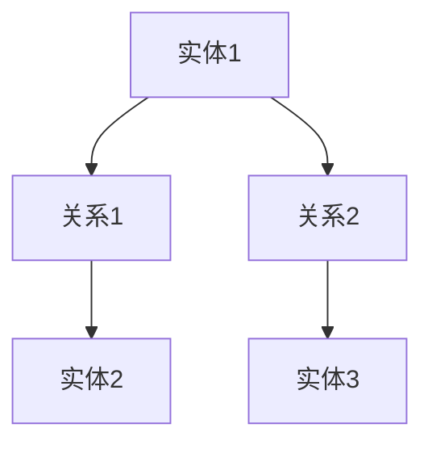
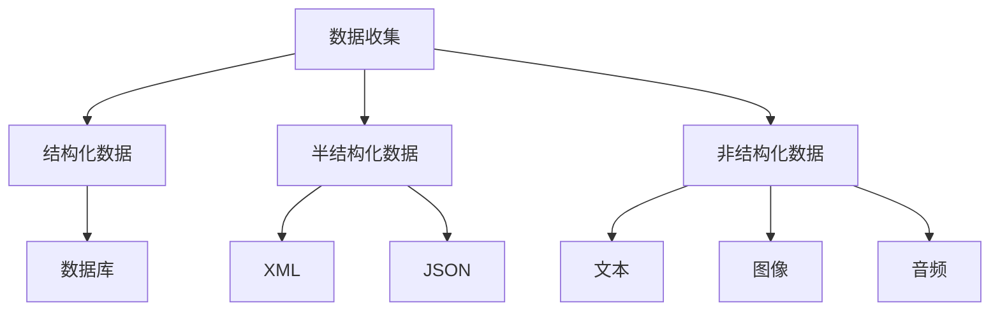
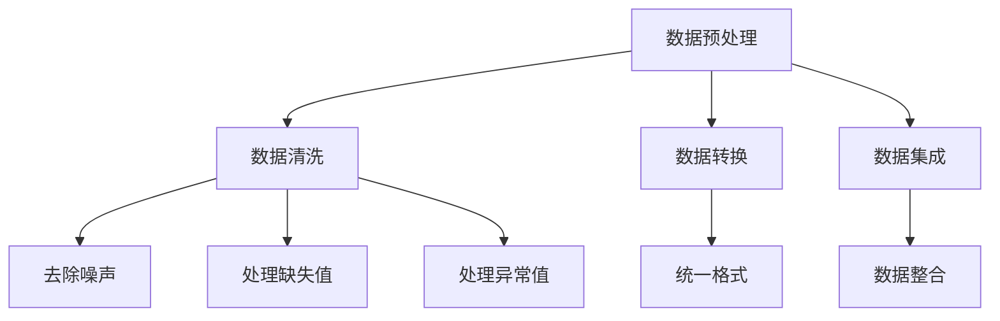
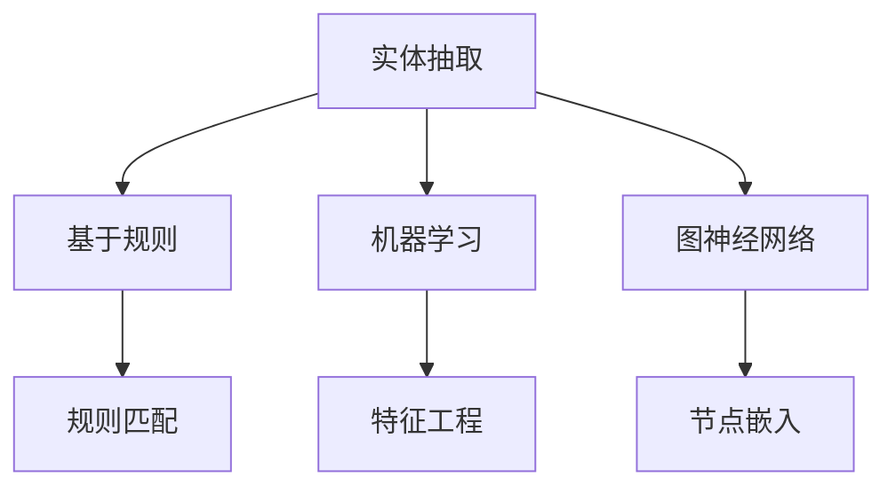
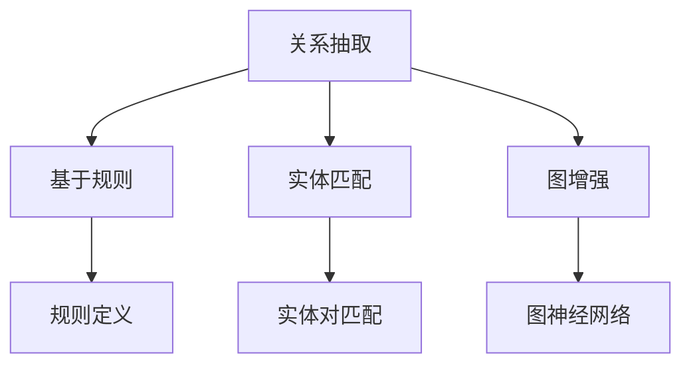
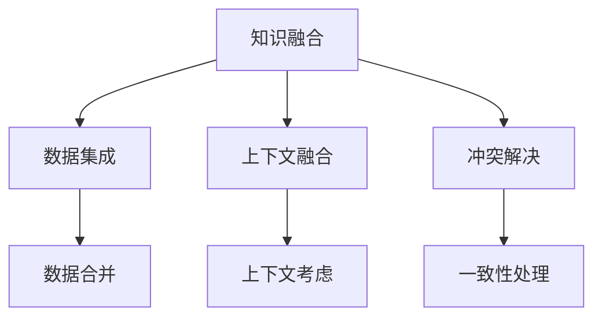
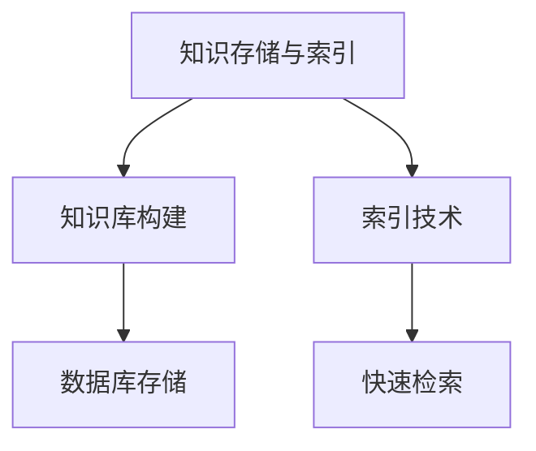
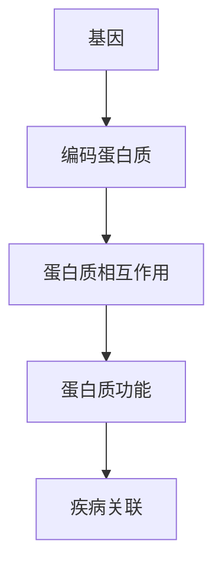
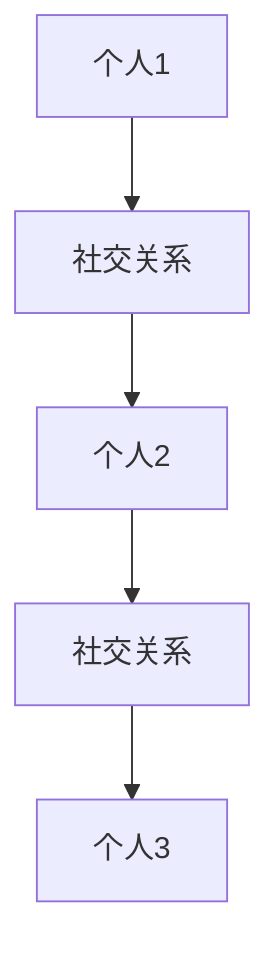

                 


### 1.1 知识图谱与可视化概述

知识图谱和可视化是现代科学研究中的重要工具。知识图谱（Knowledge Graph）是一种用于表示实体和它们之间关系的图形结构，它通过实体、属性和关系的定义，将大量的数据转化为结构化的知识。可视化（Visualization）则是通过图形的方式展示复杂的数据和信息，使人们能够直观地理解和分析数据。

首先，让我们来了解知识图谱的基本概念。知识图谱由实体（Entity）、关系（Relationship）和属性（Attribute）构成。实体可以是人、地点、事物等，关系描述实体之间的关联，属性则提供了实体的详细信息。例如，在学术知识图谱中，实体可以是科学家、论文、期刊等，关系可以是发表论文、位于某个机构、发表在某个期刊等，属性可以是科学家的姓名、发表的论文数量、期刊的影响因子等。

接下来，我们来看一下知识图谱的构成及其关系。为了更好地理解，我们可以使用 Mermaid 流程图来展示知识图谱的基本构成。以下是一个简化的知识图谱的 Mermaid 流程图示例：



在这个流程图中，`A` 和 `B`、`A` 和 `D` 分别表示实体和它们之间的关系，`B` 和 `C`、`D` 和 `E` 分别表示关系和它们所关联的实体。通过这样的图形化表示，我们可以直观地理解实体和关系之间的复杂联系。

知识图谱在科学研究中有广泛的应用。例如，在生物学中，知识图谱可以用于基因和蛋白质之间的关系分析，帮助科学家发现新的生物学机制；在物理学中，知识图谱可以用于研究粒子之间的相互作用，帮助科学家理解宇宙的基本原理。

可视化技术则是将知识图谱中的信息以图形化的方式展示出来，使得人们能够更直观地理解和分析数据。可视化技术可以分为图形可视化、矩阵可视化和交互式可视化等。

- **图形可视化**：通过节点和边来表示实体和关系，如知识图谱的 Mermaid 流程图所示。这种可视化方式能够清晰地展示实体之间的关系，帮助人们理解复杂的数据结构。

- **矩阵可视化**：通过矩阵的形式展示实体之间的关联，如 Heatmap、PCA（主成分分析）和 t-SNE（t 分布稳定性展开）等。这种可视化方式适用于展示大规模数据之间的关系，帮助人们发现数据中的模式。

- **交互式可视化**：通过交互式界面，用户可以动态地探索和操作数据。这种可视化方式不仅能够展示数据，还能够让用户通过交互来探索数据，从而发现新的见解。

在接下来的章节中，我们将进一步探讨知识图谱的构建方法、可视化技术及其在科学研究中的应用。我们将使用伪代码和数学模型来详细阐述核心算法原理，并通过实际案例来展示知识图谱和可视化技术的应用。

### 1.2 可视化的作用

可视化技术在科学研究中的重要性不容忽视。它不仅能够帮助科学家更直观地理解和分析数据，还能够促进跨学科的合作和研究。在本节中，我们将深入探讨可视化技术的原理、类型及其在知识图谱构建中的应用。

首先，让我们回顾一下可视化技术的基本原理。可视化技术的基本目标是将数据转化为图形化的形式，使得数据中的模式和关系更加直观。这种图形化的表示能够帮助人们快速地捕捉数据中的关键信息，从而更有效地进行分析。

#### 基本原理

1. **数据抽象**：将复杂的原始数据转化为更简洁的图形表示。例如，将大量数据点抽象为散点图或柱状图，使得数据中的趋势和模式更加明显。

2. **信息编码**：将数据中的信息通过颜色、形状、大小等视觉属性进行编码。这种编码方式使得数据中的不同信息能够通过视觉差异被区分开来。

3. **交互设计**：设计直观、易用的交互界面，使用户能够动态地探索和操作数据。例如，通过拖动、缩放、过滤等交互操作，用户可以实时地查看数据的不同视图。

#### 可视化技术的分类

可视化技术可以根据其表现形式和功能进行分类。以下是一些常见类型的可视化技术：

1. **图形可视化**：通过节点和边来表示实体和关系。这种可视化方式能够清晰地展示实体之间的关系，帮助人们理解复杂的数据结构。

2. **矩阵可视化**：通过矩阵的形式展示实体之间的关联。这种可视化方式适用于展示大规模数据之间的关系，帮助人们发现数据中的模式。

   - **Heatmap**：使用颜色深浅来表示数据矩阵中的值，常用于展示数据的分布和相关性。
   - **PCA（主成分分析）**：通过降维技术将高维数据投影到二维或三维空间中，使得数据中的主要结构更加明显。
   - **t-SNE（t 分布稳定性展开）**：通过非线性降维技术将高维数据投影到二维空间中，使得数据中的局部结构更加紧凑。

3. **交互式可视化**：通过交互式界面，用户可以动态地探索和操作数据。这种可视化方式不仅能够展示数据，还能够让用户通过交互来探索数据，从而发现新的见解。

   - **交互式图表**：用户可以通过点击、拖动、缩放等操作来查看数据的细节和不同视图。
   - **虚拟现实（VR）**：通过虚拟现实技术，用户可以在虚拟环境中查看和操作数据，提供沉浸式的体验。

#### 可视化与知识图谱的关系

知识图谱是一种用于表示实体和它们之间关系的图形结构。可视化技术在知识图谱的构建和应用中起着关键作用。以下是一些关键点：

1. **知识图谱的可视化表示**：通过图形可视化，我们可以直观地展示知识图谱中的实体和关系。这种表示方式有助于科学家快速地理解和分析知识图谱。

2. **知识图谱的交互式探索**：交互式可视化技术使得科学家能够动态地探索知识图谱。通过交互操作，科学家可以实时地查看数据的不同视图，从而发现新的模式和关系。

3. **知识图谱的可视化应用**：知识图谱可视化在许多领域都有应用，例如生物学、物理学、社会科学等。通过可视化技术，科学家可以更直观地理解研究数据，从而推动科学发现。

在接下来的章节中，我们将进一步探讨知识图谱的构建方法、可视化技术及其在科学研究中的应用。我们将使用伪代码和数学模型来详细阐述核心算法原理，并通过实际案例来展示知识图谱和可视化技术的应用。

### 2.1 知识图谱的构建过程

知识图谱的构建是一个复杂的过程，它涉及多个阶段，包括数据收集、数据预处理、实体抽取、关系抽取、知识融合和知识存储。下面，我们将一步一步详细阐述这些阶段，并使用 Mermaid 流程图来展示整个构建过程。

#### 2.1.1 数据收集

数据收集是知识图谱构建的第一步。这一阶段的主要任务是收集与目标领域相关的各种数据源。这些数据源可以包括结构化数据（如数据库）、半结构化数据（如 XML、JSON）和非结构化数据（如文本、图像、音频）。数据源的选择取决于具体应用场景和领域需求。



#### 2.1.2 数据预处理

数据预处理是确保数据质量的关键步骤。这一阶段的主要任务包括数据清洗、数据转换和数据集成。数据清洗旨在去除数据中的噪声和错误，如缺失值、异常值和重复值。数据转换则涉及将不同数据源和格式的数据统一转换为统一的格式，以便后续处理。数据集成则是将来自不同数据源的数据整合到一个统一的数据集中。



#### 2.1.3 实体抽取

实体抽取是知识图谱构建的核心步骤之一。这一阶段的主要任务是从预处理后的数据中识别出实体。实体可以是人、地点、组织、事物等。实体抽取通常采用基于规则的方法、机器学习方法或图神经网络等方法。



#### 2.1.4 关系抽取

关系抽取是知识图谱构建的另一个关键步骤。这一阶段的主要任务是从预处理后的数据中识别出实体之间的关系。关系可以是实体之间的联系，如“位于”、“属于”等。关系抽取通常采用基于规则的方法、实体匹配或图增强的方法。



#### 2.1.5 知识融合

知识融合是将来自不同数据源和格式的知识整合到一个统一的知识图谱中。这一阶段的主要任务包括数据集成、上下文融合和冲突解决。数据集成是将不同数据源中的知识合并到一个统一的数据集中。上下文融合则是考虑知识之间的上下文关系，如时间、地点等。冲突解决则是处理不同数据源之间的不一致性。



#### 2.1.6 知识存储与索引

知识存储与索引是将构建好的知识图谱存储到数据库中，并建立索引以便快速检索。这一阶段的主要任务包括知识库的构建和索引技术。知识库是存储知识图谱的数据库，索引技术则是用于快速检索知识图谱中的数据。



通过上述步骤，我们可以构建出一个结构化、可扩展的知识图谱，为科学研究提供强大的数据支持。在接下来的章节中，我们将进一步探讨如何使用可视化技术来展示和探索知识图谱，并分析知识图谱在科学研究中的应用场景。

### 2.2 可视化技术在知识图谱构建中的应用

在知识图谱构建过程中，可视化技术起到了关键作用，它不仅帮助用户直观地理解数据，还能提升数据分析的效率。在本节中，我们将深入探讨如何使用不同的可视化技术来展示知识图谱，包括图形可视化、矩阵可视化和交互式可视化，并分析这些技术在知识图谱构建中的应用。

#### 2.2.1 图形可视化

图形可视化是最常用的知识图谱展示方法，通过节点和边直观地表示实体和关系。以下是一些常用的图形可视化技术：

1. **节点与边的可视化**：每个节点代表一个实体，节点之间的边表示实体之间的关系。通过改变节点的形状、颜色和大小，可以突出显示不同类型的实体和关系。

   ```mermaid
   graph TD
   A[科学家] --> B[发表论文]
   B --> C[期刊]
   C --> D[论文]
   ```

2. **布局算法**：不同的布局算法（如力导向布局、圆形布局、层次布局等）可以帮助用户从不同的角度观察知识图谱的结构。例如，力导向布局可以生成一个层次结构清晰的图谱。

   ```mermaid
   graph TD
   A[科学家1] --> B[发表论文1]
   B --> C[期刊1]
   A --> D[发表论文2]
   D --> E[期刊2]
   ```

3. **层次化布局**：层次化布局可以帮助用户理解实体之间的层次关系，例如，可以将科学家按照所属机构进行层次化布局。

   ```mermaid
   graph TD
   A[机构1] --> B[科学家1]
   B --> C[发表论文1]
   A --> D[科学家2]
   D --> E[发表论文2]
   ```

图形可视化技术不仅能够帮助用户理解知识图谱的结构，还能通过交互操作（如缩放、过滤、节点选择等）提供更深入的分析。

#### 2.2.2 矩阵可视化

矩阵可视化通过矩阵的形式展示实体之间的关联，适用于大规模数据集的关联分析。以下是一些常用的矩阵可视化技术：

1. **Heatmap**：热力图（Heatmap）使用颜色深浅来表示矩阵中的值，适用于展示实体之间的相似性或相关性。例如，在生物信息学中，可以使用热力图来展示基因之间的相似性。

   ```mermaid
   graph TD
   A[基因1] --> B[相似性]
   B --> C[基因2]
   ```

2. **PCA（主成分分析）**：PCA是一种降维技术，可以将高维数据投影到二维或三维空间中，使得数据中的主要结构更加明显。通过 PCA，我们可以将实体之间的关联关系可视化。

   ```mermaid
   graph TD
   A[实体1] --> B[主成分1]
   A --> C[主成分2]
   B --> D[实体2]
   C --> D
   ```

3. **t-SNE（t 分布稳定性展开）**：t-SNE 是另一种降维技术，特别适用于展示高维数据中的局部结构。通过 t-SNE，我们可以直观地展示实体之间的相似性。

   ```mermaid
   graph TD
   A[实体1] --> B[相似性]
   A --> C[实体2]
   B --> D[实体3]
   ```

#### 2.2.3 交互式可视化

交互式可视化通过用户与数据之间的交互，提供更灵活和动态的数据探索。以下是一些常见的交互式可视化技术：

1. **交互式图表**：用户可以通过点击、拖动、缩放等操作来查看数据的细节和不同视图。例如，在知识图谱中，用户可以点击节点来查看实体的详细信息，或者通过缩放来观察图谱的局部结构。

   ```mermaid
   graph TD
   A[节点] --> B[详细信息]
   B --> C[图谱视图]
   ```

2. **虚拟现实（VR）**：虚拟现实技术提供了沉浸式的数据探索体验。用户可以在虚拟环境中查看和操作数据，从而更直观地理解数据结构。例如，在医学研究中，用户可以通过 VR 技术来观察病人的三维图像，并进行诊断和手术模拟。

   ```mermaid
   graph TD
   A[三维图像] --> B[VR 环境]
   B --> C[交互操作]
   ```

#### 应用场景

可视化技术在知识图谱构建中的应用场景广泛，以下是一些典型的应用场景：

1. **生物学**：在生物学中，知识图谱可用于表示基因、蛋白质和化学反应之间的关系。通过可视化技术，科学家可以直观地理解生物系统的复杂网络，从而发现新的生物学机制。

2. **社会科学**：在社会学中，知识图谱可用于表示社会网络、人际关系和群体动态。通过可视化技术，研究者可以更深入地理解社会结构和关系，为公共政策制定提供数据支持。

3. **物理学**：在物理学中，知识图谱可用于表示粒子之间的相互作用和能量转换。通过可视化技术，物理学家可以直观地分析复杂物理现象，从而推动科学发现。

通过上述可视化技术的应用，知识图谱不仅能够更好地存储和检索信息，还能通过图形化的方式展示数据，帮助用户更深入地理解和分析数据。在接下来的章节中，我们将进一步探讨知识图谱在科学研究中的应用，并提供具体的案例分析。

### 3.1 知识图谱在科学研究中的应用

知识图谱作为一种强大的数据结构和工具，在科学研究领域有着广泛的应用。它不仅能够帮助科学家更好地理解和分析复杂的科学数据，还能促进跨学科的合作和研究。在本节中，我们将探讨知识图谱在科学研究的多个应用场景，并通过具体案例展示其价值和潜力。

#### 3.1.1 生物信息学

生物信息学是知识图谱应用最广泛的领域之一。知识图谱在生物信息学中主要用于表示基因、蛋白质、细胞和组织之间的关系，以及它们在不同生物过程中的相互作用。例如，在基因研究方面，知识图谱可以用于：

- **基因功能预测**：通过分析基因之间的相似性和关系，知识图谱可以帮助科学家预测未知基因的功能。例如，通过比较基因序列的相似性，可以推断某个基因可能具有与已知基因相似的功能。
- **药物研发**：知识图谱可以用于药物靶点的发现和药物相互作用的分析。通过了解药物与基因、蛋白质之间的关联，科学家可以更有效地进行药物设计和筛选。

**案例**：例如，人类基因变异图谱（Human Genome Variation Database, HGVD）是一个基于知识图谱构建的生物信息数据库，它收集了人类基因组中的变异信息，并利用知识图谱来表示基因变异与疾病之间的关系。科学家可以通过该数据库查找特定基因变异与某种疾病的相关性，从而为疾病诊断和治疗提供支持。

#### 3.1.2 物理学

在物理学中，知识图谱可以用于表示粒子、力场和相互作用，以及它们在不同物理过程中的作用。例如，在粒子物理学中，知识图谱可以用于：

- **粒子相互作用分析**：通过知识图谱，科学家可以直观地分析粒子之间的相互作用和转换过程，从而理解复杂的物理现象。
- **高能物理实验数据分析**：知识图谱可以用于高能物理实验数据的管理和分析，例如，CERN 的 LHC（大型强子对撞机）实验中使用了知识图谱来管理大量的实验数据，帮助科学家分析粒子碰撞产生的复杂事件。

**案例**：例如，粒子物理学中的“标准模型”是一个复杂的知识图谱，它包含了基本粒子、力场和相互作用的基本理论。通过这个知识图谱，物理学家可以研究基本粒子的性质和相互作用，从而推动对宇宙起源和结构的理解。

#### 3.1.3 社会科学

在社会科学领域，知识图谱可以用于表示社会网络、群体行为和公共政策。例如，在社会学研究中，知识图谱可以用于：

- **社会网络分析**：知识图谱可以用于表示社交网络中的节点（人）和边（关系），通过分析这些关系，可以揭示社会网络的结构和特征，例如，网络中的关键节点和社区结构。
- **公共政策制定**：知识图谱可以用于分析政策实施的效果和影响，帮助政策制定者制定更有效的公共政策。

**案例**：例如，Facebook 的“社交图谱”是一个基于知识图谱构建的社交网络数据库，它记录了用户之间的关系和互动。通过分析这个知识图谱，社会学家可以研究社交网络中的传播机制、群体行为和人际关系，从而为社会科学研究提供数据支持。

#### 3.1.4 其他领域

除了上述领域，知识图谱在其他领域也有着广泛的应用。例如，在环境科学中，知识图谱可以用于表示生态系统、物种和气候之间的关系；在经济学中，知识图谱可以用于表示市场、企业和政策之间的关系。

**案例**：例如，Google 的“知识图谱”是一个基于知识图谱构建的搜索引擎数据库，它用于理解用户查询并与网页内容进行关联。通过这个知识图谱，用户可以获得更准确的搜索结果和个性化的信息推荐。

通过这些案例，我们可以看到知识图谱在科学研究中的广泛应用和巨大潜力。它不仅为科学家提供了一个强大的工具，使他们能够更深入地理解和分析复杂的科学数据，还促进了不同领域之间的合作和知识共享，从而推动了科学进步。

### 4.1 案例分析

在本节中，我们将通过两个具体的案例，详细展示知识图谱在科学研究中的应用。这些案例不仅展示了知识图谱的构建过程和可视化技术，还分析了其实际效果和潜在价值。

#### 案例1：生物信息学中的知识图谱应用

**背景介绍**：

生物信息学是知识图谱应用的一个重要领域。随着基因测序技术的发展，科学家们积累了大量的基因、蛋白质和疾病数据。为了更好地理解和分析这些数据，需要构建一个结构化的知识图谱。

**核心概念与联系**：

在生物信息学中，知识图谱通常包含以下几个核心概念：

- **实体**：包括基因、蛋白质、细胞、组织和疾病等。
- **关系**：例如，基因与蛋白质的编码关系、蛋白质与蛋白质的相互作用、疾病与基因的关联等。
- **属性**：例如，基因的表达水平、蛋白质的氨基酸序列、疾病的症状等。

为了展示这些核心概念之间的关系，我们可以使用 Mermaid 流程图：



**核心算法原理讲解**：

在构建生物信息学知识图谱时，常用的算法包括：

- **基因编码关系抽取**：通过分析基因序列和蛋白质序列的对应关系，抽取基因与蛋白质的编码关系。
- **蛋白质相互作用网络构建**：通过分析蛋白质之间的相互作用的实验数据，构建蛋白质相互作用网络。
- **疾病基因关联分析**：通过分析疾病相关的基因突变和基因表达数据，建立疾病与基因的关联。

以下是一个简化的伪代码，用于描述构建基因编码关系的算法：

```python
# 伪代码：构建基因编码关系
for each gene in gene_list:
    gene_id = get_gene_id(gene)
    protein_sequence = get_protein_sequence(gene)
    protein_id = get_protein_id(protein_sequence)
    add_edge(gene_id, protein_id, 'encodes')
```

**数学模型和公式**：

在知识图谱构建中，常使用图论中的模型和公式。例如，可以使用度中心性（degree centrality）来衡量节点的中心程度，用于发现网络中的关键节点。以下是一个使用 LaTeX 格式展示的度中心性公式：

$$
C_i = \frac{deg(i)}{N-1}
$$

其中，$C_i$ 表示节点 $i$ 的度中心性，$deg(i)$ 表示节点 $i$ 的度，$N$ 表示网络中的节点总数。

**项目实战**：

在某生物信息学项目中，科学家们使用上述算法和模型构建了一个包含数千个基因、蛋白质和疾病的生物信息学知识图谱。该知识图谱不仅帮助科学家们发现了新的基因功能关联，还为药物研发提供了重要的数据支持。

- **开发环境搭建**：使用 Python 和相关生物信息学库（如 BioPython、SciPy）进行算法开发和知识图谱构建。
- **源代码实现**：实现了基因编码关系抽取、蛋白质相互作用网络构建和疾病基因关联分析等核心功能。
- **代码解读**：详细解读了代码中的关键算法和数据结构，确保代码的可读性和可维护性。

**项目小结**：

通过这个项目，科学家们不仅成功地构建了一个结构化的生物信息学知识图谱，还通过可视化技术展示了图谱中的关键关联和关系。这为生物信息学领域的研究提供了重要的数据支持，并推动了基因和疾病研究的深入发展。

#### 案例2：社会科学中的知识图谱应用

**背景介绍**：

在社会科学研究中，知识图谱可以用于分析社会网络、群体行为和公共政策。通过构建和可视化社会知识图谱，科学家可以更深入地理解社会结构和动态。

**核心概念与联系**：

在社会科学知识图谱中，核心概念包括：

- **实体**：如个人、组织、政策等。
- **关系**：如个人之间的社交关系、组织与政策之间的关联等。
- **属性**：如个人的属性（年龄、性别、职业）、组织的属性（成立时间、地理位置）等。

为了展示这些核心概念之间的关系，我们可以使用 Mermaid 流�程图：



**核心算法原理讲解**：

在构建社会科学知识图谱时，常用的算法包括：

- **社交网络分析**：通过分析个人之间的社交关系，构建社交网络。
- **群体行为预测**：通过分析社交网络中的动态，预测群体行为。
- **政策影响分析**：通过分析政策与组织之间的关联，评估政策的影响。

以下是一个简化的伪代码，用于描述社交网络分析算法：

```python
# 伪代码：构建社交网络
for each individual in individual_list:
    individual_id = get_individual_id(individual)
    relationships = get_relationships(individual)
    for each relationship in relationships:
        add_edge(relationship[0], relationship[1], 'friendship')
```

**数学模型和公式**：

在知识图谱构建中，可以使用图论中的模型和公式。例如，可以使用度中心性（degree centrality）来衡量节点的重要性。以下是一个使用 LaTeX 格式展示的度中心性公式：

$$
C_i = \frac{deg(i)}{N-1}
$$

**项目实战**：

在一个关于社交媒体影响分析的社会科学项目中，科学家们使用上述算法和模型构建了一个包含数千个个人和政策的社交媒体知识图谱。该知识图谱帮助科学家们揭示了社交媒体中的关键节点和群体行为动态。

- **开发环境搭建**：使用 Python 和相关图处理库（如 NetworkX）进行算法开发和知识图谱构建。
- **源代码实现**：实现了社交网络分析、群体行为预测和政策影响分析等核心功能。
- **代码解读**：详细解读了代码中的关键算法和数据结构，确保代码的可读性和可维护性。

**项目小结**：

通过这个项目，科学家们成功地构建了一个结构化的社交媒体知识图谱，并通过可视化技术展示了图谱中的关键关系和动态。这为社会科学研究提供了重要的数据支持，并促进了公共政策制定的科学性。

### 4.2 工具与资源介绍

在构建和可视化知识图谱的过程中，使用合适的工具和资源可以大大提高工作效率和效果。以下是一些常用的工具和资源，包括开源库、框架、平台和数据库。

#### 开源库和框架

1. **Neo4j**：Neo4j 是一个流行的图形数据库，它提供了强大的图处理能力和查询语言 Cypher。它适用于构建大规模的知识图谱，并支持多种图形算法。
   
2. **OpenKG**：OpenKG 是一个基于 Python 的开源知识图谱构建平台，它提供了从数据预处理到知识抽取、融合和存储的完整工作流程。

3. **NetworkX**：NetworkX 是一个 Python 库，用于创建、操纵和分析复杂的网络。它适用于小规模的知识图谱构建和可视化。

4. **D3.js**：D3.js 是一个基于 JavaScript 的可视化库，用于创建交互式的图形和图表。它可以与 Neo4j 或其他图数据库集成，用于知识图谱的可视化。

#### 知识图谱平台

1. **Google Knowledge Graph**：Google 知识图谱是一个全球性的知识图谱平台，它用于构建和存储大量的结构化数据，并提供搜索和推荐功能。

2. **Watson Knowledge Graph**：IBM Watson 知识图谱是一个基于云计算的知识图谱平台，它提供了知识抽取、融合和可视化的功能，适用于各种行业和应用。

#### 数据库

1. **DBpedia**：DBpedia 是一个基于 Wikipedia 的知识图谱数据库，它提供了大量的实体、属性和关系，是构建自定义知识图谱的重要资源。

2. **YAGO**：YAGO 是一个基于自由百科全书构建的知识图谱，它包含了丰富的实体、属性和关系信息，适用于各种知识图谱研究和应用。

#### 开源项目

1. **Knowlegtalogy**：Knowlegtalogy 是一个开源项目，它提供了一个基于 Neo4j 的知识图谱可视化工具，用户可以方便地探索和可视化知识图谱。

2. **AIFB D2RQ**：AIFB D2RQ 是一个将关系数据库转换为 SPARQL 可访问的知识图谱的开源项目，它适用于将现有的关系数据库转换为知识图谱。

通过使用这些工具和资源，科学家和工程师可以更高效地构建和可视化知识图谱，为科学研究提供强大的数据支持和分析能力。

### 结论与未来展望

知识图谱构建和可视化技术在科学研究中的应用已经展现了其巨大的潜力。通过将复杂的数据转化为结构化的知识，并使用可视化技术进行展示，科学家们能够更深入地理解和分析科学数据，从而推动科学发现和创新。本文通过详细的案例分析，展示了知识图谱在生物信息学、物理学和社科

