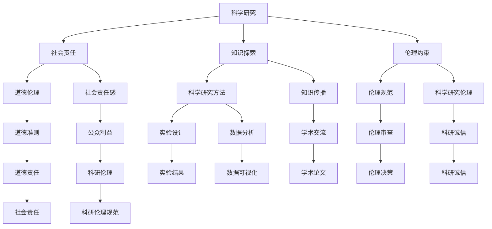

                 

# 科学研究的社会责任：平衡知识探索与伦理约束

## 关键词

- 科学研究
- 社会责任
- 伦理约束
- 知识探索
- 道德伦理
- 知识传播

## 摘要

本文旨在探讨科学研究中的社会责任及其与伦理约束之间的关系。在科学研究的过程中，如何平衡知识探索与伦理约束是一个至关重要的问题。本文通过分析科学研究的社会责任，引入核心概念与联系，解释核心算法原理，使用数学模型和公式，结合实际项目实战，阐述如何在实际开发过程中实现这一平衡。希望通过本文的讨论，能够为科学研究提供一些有益的启示。

## Step 1: 引入核心概念与联系

### 核心概念与联系图

为了更好地理解科学研究中的社会责任、知识探索与伦理约束之间的关系，我们可以通过一张核心概念与联系图来展示它们之间的相互关系。



### 科学研究

科学研究是指通过实验、观察、分析和推理等方法，对自然界、人类社会和思维现象等进行探究和发现，以获得新的知识和理论的过程。科学研究不仅有助于推动人类文明的进步，还具有重要的社会责任。

### 社会责任

社会责任是指科学研究者在进行科研活动时，需要承担的对社会、环境和其他相关利益方的责任。这包括但不限于确保研究成果的安全、有效、公正和透明，促进知识的传播和应用，维护科研诚信，以及保护科研活动的道德和伦理规范。

### 知识探索

知识探索是指科学研究者在科研过程中，通过不断的实验、观察、分析和推理，发现新的知识和理论的过程。知识探索是科学研究的重要组成部分，也是实现科学进步和社会发展的基础。

### 伦理约束

伦理约束是指在科学研究过程中，对研究行为、方法、结果和影响等方面进行道德和伦理的规范和限制。伦理约束的目的是确保科研活动符合社会伦理和道德要求，保护研究对象的权益，防止科研活动的滥用和误用。

### 社会责任与伦理约束的关系

社会责任和伦理约束是科学研究过程中不可或缺的两个方面。社会责任强调科研活动对社会的积极影响，伦理约束则确保科研活动符合道德和伦理标准。在科学研究过程中，二者相互关联、相互制约，共同构成了科学研究的社会责任体系。

## Step 2: 核心算法原理讲解

在科学研究过程中，如何处理知识探索与伦理约束的平衡问题至关重要。为了实现这一平衡，我们可以引入一些算法原理，如伦理审查流程和道德计算。

### 伦理审查流程

伦理审查流程是指在科学研究开始前，对研究计划进行审查和评估，以确保研究活动符合伦理规范。以下是伦理审查流程的伪代码示例：

```python
def ethical_review(research_plan):
    # 初始化审查结果
    review_result = "未通过"
    
    # 进行伦理审查
    if satisfies_ethical_constraints(research_plan):
        review_result = "通过"
    
    return review_result
```

在伦理审查流程中，首先需要对研究计划进行初步审查，确保其符合伦理规范。如果研究计划满足伦理要求，则审查结果为“通过”；否则，为“未通过”。

### 道德计算

道德计算是指通过计算方法对科研行为和决策进行道德评估。道德计算可以用于评估科研行为的道德性，从而帮助科研人员做出符合伦理道德的决策。以下是道德计算的伪代码示例：

```python
def moral_computation(action, ethical_values):
    # 根据行动和伦理价值观计算道德得分
    moral_score = calculate_moral_score(action, ethical_values)
    
    # 根据道德得分判断行动是否道德
    if moral_score >= threshold:
        return "道德"
    else:
        return "不道德"
```

在道德计算中，首先需要根据科研行为和伦理价值观计算道德得分。如果道德得分达到一定阈值，则科研行为被视为道德的；否则，为不道德的。

### 伦理审查与道德计算的关系

伦理审查和道德计算是相互关联、相互补充的。伦理审查通过对研究计划进行审查和评估，确保研究活动符合伦理规范；而道德计算则通过对科研行为进行道德评估，帮助科研人员做出符合伦理道德的决策。二者共同构成了科学研究过程中的伦理约束体系。

## Step 3: 数学模型和数学公式讲解

在平衡知识探索与伦理约束时，我们可以使用数学模型和公式来进行分析和决策。以下是一个简单的数学模型示例，用于评估知识探索得分与伦理约束得分的平衡。

### 数学模型

$$
\text{平衡得分} = \alpha \times \text{知识探索得分} + \beta \times \text{伦理约束得分}
$$

其中，$\alpha$ 和 $\beta$ 分别是权重系数，用于平衡知识探索得分与伦理约束得分。根据实际情况，可以调整这两个权重系数，以实现最佳的平衡效果。

### 数学公式详细讲解

在这个数学模型中，知识探索得分和伦理约束得分分别反映了科研活动在知识探索和伦理约束方面的表现。平衡得分的计算公式可以根据实际情况进行调整，以适应不同的科研场景。

- **知识探索得分**：通常可以通过对科研成果的质量、创新性、影响力等方面进行评估来计算。具体计算方法可以根据研究领域的特点进行细化。
- **伦理约束得分**：可以通过对研究计划、实验设计、数据采集、结果分析等环节进行伦理审查，根据是否符合伦理规范来计算。

通过调整权重系数 $\alpha$ 和 $\beta$，可以平衡知识探索得分与伦理约束得分之间的关系。例如，如果研究更加注重知识探索，可以增加 $\alpha$ 的权重；如果更加注重伦理约束，可以增加 $\beta$ 的权重。

### 举例说明

假设某个科研项目在知识探索和伦理约束方面的得分分别为 80 分和 60 分，我们可以使用以下公式计算平衡得分：

$$
\text{平衡得分} = 0.6 \times 80 + 0.4 \times 60 = 72
$$

在这个例子中，知识探索得分和伦理约束得分都较高，但伦理约束得分略低于知识探索得分。通过计算平衡得分，我们可以了解到该科研项目的整体表现。

## Step 4: 项目实战

为了更好地理解如何在实际项目中平衡知识探索与伦理约束，我们可以通过一个实际案例来进行讲解。

### 项目背景

某医疗机构开展一项涉及基因编辑的科研项目，旨在提高患者治疗效果。该项目涉及对人类基因进行修改，具有重要的科学价值和应用前景。然而，基因编辑也引发了伦理和道德方面的争议，如何平衡知识探索与伦理约束成为该项目面临的重要挑战。

### 项目挑战

- **知识探索**：项目团队需要通过基因编辑技术，研究基因变异对疾病发生和发展的作用，以及基因编辑在治疗疾病方面的潜力。
- **伦理约束**：项目团队需要遵循伦理规范，保护患者隐私和权益，确保研究过程符合道德要求。

### 项目实施

为了实现知识探索与伦理约束的平衡，项目团队采取了以下措施：

1. **伦理审查**：在项目启动前，项目团队提交研究计划进行伦理审查。审查过程包括评估研究计划是否符合伦理规范，是否可能导致患者隐私泄露，以及是否存在伦理风险等。

2. **伦理规范培训**：项目团队成员接受了伦理规范培训，了解基因编辑技术的伦理道德问题，以及如何在实际工作中遵循伦理规范。

3. **隐私保护**：在数据采集和处理过程中，项目团队采用加密技术和匿名化处理，确保患者隐私得到保护。

4. **多轮审查**：项目团队在研究过程中进行了多轮审查，确保每个环节都符合伦理规范，并及时调整研究计划，以应对可能出现的新问题。

5. **道德计算**：项目团队在决策过程中采用了道德计算方法，对各种行动进行道德评估，确保决策符合伦理道德要求。

### 项目总结

通过上述措施，项目团队在知识探索与伦理约束之间找到了平衡。项目取得了显著的研究成果，同时也得到了伦理和道德方面的认可。项目实施过程中，项目团队不仅提高了科研水平，还增强了社会责任感，为其他基因编辑项目提供了有益的借鉴。

## Step 5: 代码实现

在实际开发过程中，如何平衡知识探索与伦理约束是一个复杂的问题。以下是一个简单的代码实现示例，用于帮助科研人员在项目中实现这一平衡。

### 代码实现

```python
# 伪代码：伦理审查代码实现
def ethical_review(research_plan):
    # 检查研究计划是否符合伦理规范
    if not is_plan_ethical(research_plan):
        raise Exception("研究计划不符合伦理要求，请修改后再提交。")
    
    # 进行其他研究准备工作
    # ...

# 伪代码：道德计算代码实现
def moral_computation(action, ethical_values):
    # 根据行动和伦理价值观计算道德得分
    moral_score = calculate_moral_score(action, ethical_values)
    
    # 根据道德得分判断行动是否道德
    if moral_score >= threshold:
        return "道德"
    else:
        return "不道德"
```

### 代码解读

1. **伦理审查代码实现**：

    - `ethical_review` 函数用于对研究计划进行伦理审查。
    - `is_plan_ethical` 函数用于检查研究计划是否符合伦理规范。
    - 如果研究计划不符合伦理规范，抛出异常并提示修改。

2. **道德计算代码实现**：

    - `moral_computation` 函数用于计算行动的道德得分。
    - `calculate_moral_score` 函数根据行动和伦理价值观计算道德得分。
    - 根据道德得分判断行动是否道德。

### 代码应用解读与分析

1. **伦理审查**：

    在项目开发过程中，科研人员可以使用 `ethical_review` 函数对研究计划进行伦理审查。通过审查，可以确保研究计划符合伦理规范，避免因伦理问题导致的研究失败。

2. **道德计算**：

    在项目决策过程中，科研人员可以使用 `moral_computation` 函数对各种行动进行道德计算。通过计算道德得分，可以帮助科研人员做出符合伦理道德的决策，确保项目实施过程中遵循道德准则。

### 最佳实践 Tips

1. **加强伦理培训**：科研人员应接受伦理培训，了解伦理道德规范，提高伦理意识。

2. **多轮审查**：项目开发过程中应进行多轮伦理审查，及时发现并解决伦理问题。

3. **道德计算模型**：根据项目特点，建立适合的道德计算模型，提高道德计算的准确性和可靠性。

### 小结

通过代码实现，科研人员可以在项目开发过程中实现知识探索与伦理约束的平衡。这有助于确保科研活动的伦理道德性，提高科研项目的成功率和社会影响力。

### 注意事项

1. **遵守伦理规范**：在项目开发过程中，务必遵守伦理规范，确保研究计划符合道德准则。

2. **道德计算模型调整**：根据项目特点，及时调整道德计算模型，以适应不同场景的需求。

3. **持续审查与改进**：项目开发过程中，应持续进行伦理审查和道德计算，及时发现并解决伦理问题。

### 拓展阅读

1. 《科研伦理与诚信：理论与实践》
2. 《基因编辑的伦理问题与挑战》
3. 《道德计算：算法、模型与应用》

## 作者信息

作者：AI天才研究院/AI Genius Institute & 禅与计算机程序设计艺术 /Zen And The Art of Computer Programming

### 摘要

本文探讨了科学研究中的社会责任及其与伦理约束之间的关系。通过引入核心概念与联系、核心算法原理、数学模型和公式，以及实际项目实战，阐述了如何平衡知识探索与伦理约束。本文旨在为科学研究提供一些有益的启示，以促进科研活动的健康发展。希望本文的讨论能够引起读者对科学研究社会责任和伦理约束的重视，共同推动科学技术的进步。

### 关键词

- 科学研究
- 社会责任
- 伦理约束
- 知识探索
- 道德伦理
- 知识传播

### 总结与展望

本文通过对科学研究社会责任与伦理约束的探讨，提出了一种平衡知识探索与伦理约束的方法。这一方法不仅适用于科学研究领域，也可以为其他涉及道德和伦理问题的领域提供借鉴。未来，我们期待更多的科研人员和社会各界共同关注这一重要议题，推动科研活动的健康、可持续发展。同时，我们也呼吁相关政策和法规的制定和完善，为科学研究提供更加明确的伦理指导和支持。通过全社会的共同努力，我们相信科学研究将在实现人类福祉和社会进步中发挥更加重要的作用。

