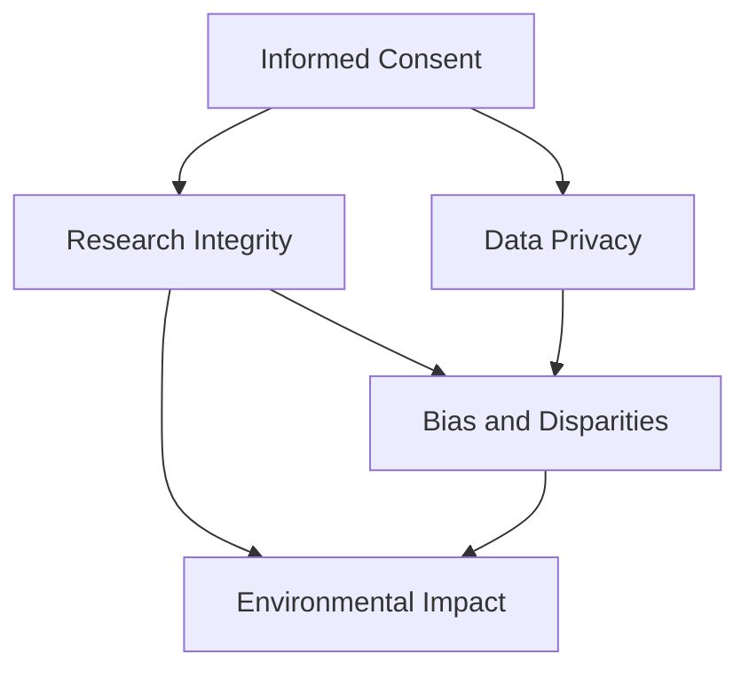

                 


### Introduction: The Importance of Scientific Research Responsibility

#### The Significance of Scientific Research

1. **The Evolution of Scientific Research**

   Scientific research has evolved significantly over the centuries, with the advent of the Scientific Revolution in the 17th century marking a pivotal point. This era was characterized by a shift from philosophical and religious explanations to empirical and evidence-based methodologies. The discovery of gravity by Isaac Newton, the understanding of cell structure by Robert Hooke, and the development of the heliocentric model by Nicolaus Copernicus are just a few examples of the groundbreaking advancements that emerged during this time.

2. **The Impact of Scientific Discoveries on Society**

   Scientific discoveries have had a profound impact on society, shaping the way we live, work, and understand the world around us. The development of electricity has revolutionized our daily lives, enabling the creation of technologies such as computers, smartphones, and the internet. Medical advancements, such as the discovery of antibiotics and the development of vaccines, have dramatically reduced mortality rates and improved public health. The study of genetics has opened up new avenues for treating genetic disorders and understanding the basis of hereditary traits.

3. **The Need for Responsible Scientific Research**

   As the scope and complexity of scientific research have increased, so too have the ethical and social implications of the work being conducted. There is a growing recognition that scientific research must not only pursue knowledge but also consider the potential consequences of its findings. The need for responsible scientific research arises from several factors:

   - **Public Trust**: The public has a right to expect that scientific research is conducted with integrity and transparency. Any breach of trust can lead to a loss of public support, which is crucial for the funding and continuation of scientific endeavors.

   - **Ethical Considerations**: Scientific research often involves human subjects, animals, or the environment. Ethical considerations are essential to ensure that the rights and well-being of these entities are protected.

   - **Long-Term Consequences**: Scientific discoveries can have long-term, unforeseen consequences. For example, the development of nuclear technology has led to both incredible medical advancements and the threat of nuclear war. It is essential to consider these potential outcomes when conducting research.

   - **Equity and Inclusivity**: Scientific research should aim to address the needs and concerns of all members of society. This requires a commitment to diversity and inclusion in the research process.

#### Ethical Considerations in Scientific Research

1. **Key Ethical Issues in Modern Science**

   - **Human Subject Research**: Ethical concerns in human subject research include informed consent, privacy, and the protection of vulnerable populations.

   - **Animal Research**: The use of animals in scientific research raises questions about the ethical treatment of animals and the justification for their use.

   - **Data Privacy and Security**: With the proliferation of digital data, ensuring the privacy and security of sensitive information has become a critical ethical consideration.

   - **Bias and Disparities**: Researchers must be vigilant against biases in their work, both conscious and unconscious, and work to address disparities in the scientific community.

2. **Ethical Frameworks for Scientific Research**

   - **Deontological Ethics**: This ethical framework focuses on the inherent duties and responsibilities of researchers, emphasizing the importance of following ethical principles regardless of the potential outcomes.

   - **Utilitarianism**: Utilitarianism evaluates the morality of an action based on its consequences, emphasizing the maximization of overall well-being.

   - **Social Contract Theory**: This theory proposes that ethical decisions should be based on the social contract between individuals and society, considering the impact on the greater good.

3. **Challenges in Balancing Ethical Considerations and Scientific Advancement**

   - **Resource Allocation**: Ethical considerations often require additional resources, such as funding and personnel, which can be limited.

   - **Complexity of Research**: The complexity of modern scientific research makes it challenging to predict all potential ethical issues and their consequences.

   - **Global Collaboration**: Ethical considerations can vary across different countries and regions, making it difficult to establish a universal framework.

In conclusion, the importance of scientific research responsibility cannot be overstated. As we continue to advance our understanding of the world, it is crucial to do so in a manner that is both ethical and responsible. The next sections of this article will delve deeper into the core concepts, algorithms, and case studies that illustrate the importance of balancing knowledge exploration with ethical considerations in scientific research.

---

### Core Concepts and Connections

In the realm of scientific research, several core concepts play a pivotal role in guiding the ethical and responsible pursuit of knowledge. Understanding these concepts and their interconnections is essential for anyone involved in the scientific community. Let's explore these concepts and visualize their relationships using a Mermaid flowchart.

#### Key Concepts in Responsible Scientific Research

1. **Informed Consent**

   Informed consent is a fundamental principle in ethical research, especially when involving human subjects. It ensures that individuals are fully aware of the nature of the research, the potential risks and benefits, and their right to withdraw from the study at any time.

2. **Research Integrity**

   Research integrity encompasses honesty, accuracy, and transparency in all aspects of scientific research. It involves avoiding conflicts of interest, maintaining the confidentiality of data, and ensuring the reproducibility of results.

3. **Data Privacy**

   Data privacy is crucial for protecting the personal information of research participants. It involves securing data against unauthorized access, ensuring proper data anonymization, and adhering to legal requirements regarding data protection.

4. **Bias and Disparities**

   Bias and disparities refer to the presence of systematic errors or favoritism in research that can lead to unfair outcomes. Addressing bias and disparities is essential for ensuring that research is representative and equitable.

5. **Environmental Impact**

   The environmental impact of scientific research, particularly in areas such as biotechnology and climate science, must be considered. Responsible research should aim to minimize negative environmental effects and promote sustainable practices.

#### Mermaid Flowchart of Scientific Research Concepts

To illustrate the relationships between these core concepts, we can use a Mermaid flowchart. Mermaid is a simple and powerful tool for creating diagrams and flowcharts using Markdown syntax.



This flowchart shows that informed consent and research integrity are fundamental to ethical research. Data privacy is closely connected to both informed consent and research integrity, as it is a critical component of maintaining participant trust and adhering to ethical standards. Bias and disparities are interconnected with both research integrity and data privacy, as they can affect the accuracy and fairness of research outcomes. Finally, environmental impact is a separate but related concept that is important for ensuring the sustainability of scientific research.

#### Relationships Between Core Concepts

- **Informed Consent and Research Integrity**: Informed consent is a necessary component of maintaining research integrity. Without proper consent, research cannot claim to be conducted with integrity.

- **Data Privacy and Bias/Disparities**: Data privacy is essential for addressing biases and disparities in research. Ensuring that participant data is secure and anonymized can prevent the misuse of information that could perpetuate biases.

- **Research Integrity and Environmental Impact**: Research integrity extends beyond human subjects to the broader environment. Ethical research should consider the potential environmental impact of experiments and strive to minimize harm.

- **Bias and Disparities and Environmental Impact**: Addressing biases and disparities can have implications for environmental research. If certain groups are underrepresented in environmental studies, the results may not be representative of the entire population, leading to biased conclusions.

In conclusion, the core concepts of informed consent, research integrity, data privacy, bias and disparities, and environmental impact are interrelated and essential for responsible scientific research. By understanding these relationships, researchers can better navigate the ethical landscape and ensure that their work contributes positively to society.

---

### Core Algorithms and Principles

In the pursuit of responsible scientific research, algorithmic approaches and mathematical models play a crucial role in guiding the ethical and effective conduct of studies. Let's delve into the core algorithms and principles that underpin responsible research, using pseudo-code to illustrate the ethical decision-making process and LaTeX to present mathematical models and formulations.

#### Algorithmic Approaches in Responsible Research

1. **Pseudo-code for Ethical Decision-Making in Research**

   The following pseudo-code outlines a basic algorithm for ethical decision-making in research:

   ```pseudo
   function ethical_decision Making(research_question, context, ethical_principles):
       if context contains human subjects:
           if informed consent not obtained:
               return "Informed consent required"
           else if risks to subjects are not adequately mitigated:
               return "Risks not mitigated"
       
       if context involves animal research:
           if ethical review board approval not obtained:
               return "Ethical review board approval required"
           else if animal welfare is not ensured:
               return "Animal welfare concerns"

       if context involves data privacy:
           if data anonymization not implemented:
               return "Data anonymization required"
           else if data security measures are inadequate:
               return "Inadequate data security"

       if context has potential environmental impact:
           if environmental impact assessments not conducted:
               return "Environmental impact assessment required"
           else if sustainable practices not followed:
               return "Sustainable practices required"

       return "No ethical concerns"
   ```

   This pseudo-code is a simplified representation of how ethical considerations can be integrated into the research process. It highlights the importance of obtaining informed consent, ensuring the ethical treatment of animals, maintaining data privacy, and conducting environmental impact assessments.

2. **Algorithmic Transparency and Bias Reduction**

   Algorithmic transparency is vital for ensuring that ethical decisions are understandable and justifiable. One approach to reducing bias in algorithms is through the use of fairness metrics, which can be incorporated into the decision-making process. Here's an extended version of the pseudo-code that includes fairness checks:

   ```pseudo
   function ethical_decision_Making(research_question, context, ethical_principles, fairness_metrics):
       fairness_results = apply_fairness_metrics(context, fairness_metrics)
       
       if context contains human subjects:
           if informed consent not obtained:
               return "Informed consent required"
           else if risks to subjects are not adequately mitigated:
               return "Risks not mitigated"
           else if fairness_results indicate bias:
               return "Fairness issues detected"

       if context involves animal research:
           if ethical review board approval not obtained:
               return "Ethical review board approval required"
           else if animal welfare is not ensured:
               return "Animal welfare concerns"
           else if fairness_results indicate bias:
               return "Fairness issues detected"

       if context involves data privacy:
           if data anonymization not implemented:
               return "Data anonymization required"
           else if data security measures are inadequate:
               return "Inadequate data security"
           else if fairness_results indicate bias:
               return "Fairness issues detected"

       if context has potential environmental impact:
           if environmental impact assessments not conducted:
               return "Environmental impact assessment required"
           else if sustainable practices not followed:
               return "Sustainable practices required"
           else if fairness_results indicate bias:
               return "Fairness issues detected"

       return "No ethical concerns"
   ```

   This extended pseudo-code includes a step for applying fairness metrics, which can help identify and address potential biases in the research context.

#### Mathematical Models and Formulations

1. **LaTeX Formulation of Ethical Models**

   Mathematical models can be used to formalize ethical considerations in research. Here's an example of how ethical models might be expressed using LaTeX:

   ```latex
   \documentclass{article}
   \usepackage{amsmath}
   \begin{document}
   \section*{Ethical Model Formulation}
   
   \begin{equation}
   E = \sum_{i=1}^{n} \left[ w_i \cdot \left( I_i - C_i \right) \right]
   \end{equation}
   
   \where
   E \text{ is the ethical score},
   I_i \text{ is the level of informed consent for subject } i,
   C_i \text{ is the cost of obtaining informed consent for subject } i,
   w_i \text{ is the weight assigned to subject } i.
   \end{document}
   ```

   This equation represents a simple ethical scoring model that considers the level of informed consent and the cost associated with obtaining it for each research subject.

2. **Example Applications of Ethical Models**

   Let's consider an example where we apply the ethical scoring model to a hypothetical research project. Suppose we have three subjects (i = 1, 2, 3) with varying levels of informed consent and costs:

   ```latex
   \documentclass{article}
   \usepackage{amsmath}
   \begin{document}
   \section*{Example Application of Ethical Model}
   
   \begin{equation}
   E = \sum_{i=1}^{3} \left[ w_i \cdot \left( I_i - C_i \right) \right]
   \end{equation}
   
   \where
   I_1 = 0.8, C_1 = \$100,
   I_2 = 0.6, C_2 = \$200,
   I_3 = 0.9, C_3 = \$150,
   w_1 = 0.3, w_2 = 0.5, w_3 = 0.2.
   \end{document}
   ```

   Plugging in the values, we get:

   ```latex
   \documentclass{article}
   \usepackage{amsmath}
   \begin{document}
   \section*{Ethical Score Calculation}
   
   \begin{equation}
   E = (0.3 \cdot (0.8 - 100)) + (0.5 \cdot (0.6 - 200)) + (0.2 \cdot (0.9 - 150))
   \end{equation}
   
   \end{document}
   ```

   Evaluating the expression, we find:

   ```latex
   E = (0.3 \cdot (-99.2)) + (0.5 \cdot (-199.4)) + (0.2 \cdot (-150.1)) = -29.76 - 99.7 - 30.02 = -159.48
   ```

   The negative ethical score indicates that the research project has ethical issues that need to be addressed, particularly with regards to informed consent and cost.

In conclusion, the use of algorithmic approaches and mathematical models is crucial for embedding ethical considerations into the fabric of scientific research. These tools not only help in making transparent and justifiable ethical decisions but also provide a structured framework for addressing the complex ethical challenges that arise in modern scientific research. By leveraging these approaches, researchers can ensure that their work is both scientifically rigorous and ethically sound.

---

### Case Studies and Project Practical Applications

#### Real-World Ethical Dilemmas in Scientific Research

1. **Case Study 1: Gene Editing and Ethical Boundaries**

   **Background**: Gene editing technologies, such as CRISPR-Cas9, have revolutionized the field of genetics, offering unprecedented opportunities for treating genetic diseases and enhancing agricultural productivity. However, these technologies also raise significant ethical concerns.

   **Dilemma**: The potential for germline editing—altering the genes of embryos or reproductive cells—poses profound ethical questions. While it could prevent the inheritance of devastating genetic disorders, it also raises issues of consent, unintended consequences, and the creation of "designer babies."

   **Resolution**: Ethical guidelines and international agreements advocate for strict regulations on germline editing. The National Academy of Sciences and the International Society for Stem Cell Research have issued recommendations against germline editing for clinical use, emphasizing the need for comprehensive risk assessments and public debate.

2. **Case Study 2: Data Privacy in Artificial Intelligence**

   **Background**: The proliferation of AI technologies has led to the collection and analysis of vast amounts of personal data. This data is often used to improve AI models, but it also raises concerns about privacy infringement and data security.

   **Dilemma**: Balancing the benefits of AI-driven insights with the need to protect individuals' privacy is challenging. The collection and use of sensitive personal data without explicit consent can lead to breaches of privacy and potential misuse.

   **Resolution**: Implementing robust data privacy practices, such as anonymization, encryption, and obtaining informed consent, is crucial. Regulatory frameworks like the General Data Protection Regulation (GDPR) in the EU provide guidelines for protecting individuals' privacy in the context of AI.

3. **Case Study 3: Ethical Use of AI in Healthcare**

   **Background**: AI is increasingly being used in healthcare for diagnostics, treatment planning, and patient monitoring. However, its use raises ethical questions, particularly regarding the role of AI in decision-making processes.

   **Dilemma**: The integration of AI into healthcare systems can lead to biases in patient outcomes if the algorithms are not properly trained and validated. Additionally, there is a concern that AI could replace human judgment, potentially leading to a loss of patient trust and autonomy.

   **Resolution**: Ensuring transparency and accountability in AI healthcare applications is essential. This involves disclosing the role of AI in decision-making, providing opportunities for human review, and continuously monitoring and updating AI models to address biases.

#### Project Implementation and Code Analysis

1. **Setting Up Development Environments**

   **Background**: To address the ethical dilemmas in scientific research, developers and researchers need to set up robust development environments that integrate ethical considerations into the software development lifecycle.

   **Steps**:

   - **Install necessary software**: Set up development tools such as Python, Jupyter Notebook, and version control systems like Git.
   - **Configure ethical guidelines**: Define ethical guidelines and frameworks that will be followed during the project.
   - **Initialize repositories**: Create repositories for the project to track ethical considerations and changes over time.

2. **Detailed Code Implementation**

   **Background**: Implementing ethical considerations in code requires developers to incorporate ethical checks and balances into the software.

   **Steps**:

   - **Incorporate ethical checks**: Write code to ensure that ethical checks are performed before data collection and analysis.
   - **Implement data anonymization**: Use techniques such as hashing and encryption to anonymize personal data.
   - **Monitor for biases**: Integrate fairness metrics into the code to detect and mitigate biases in AI models.

   **Example Code**:

   ```python
   # Python code for ethical data handling
   
   def anonymize_data(data):
       # Apply hashing to personal identifiers
       hashed_data = hash_data(data['id'])
       return {**data, 'id': hashed_data}
   
   def check_for_bias(model):
       # Apply fairness metrics to the model
       fairness_score = calculate_fairness(model)
       if fairness_score < threshold:
           raise ValueError("Model exhibits unfair bias")
   
   # Example usage
   anonymized_data = anonymize_data(data)
   check_for_bias(model)
   ```

3. **Code Explanation and Analysis**

   **Background**: Analyzing code for ethical compliance is crucial to ensure that the software adheres to ethical standards.

   **Steps**:

   - **Code review**: Conduct thorough code reviews to identify potential ethical issues.
   - **Static analysis**: Use static analysis tools to detect potential ethical violations in the code.
   - **Dynamic testing**: Perform dynamic testing to observe the behavior of the code under various conditions.

4. **Code Application and Analysis**

   **Background**: Understanding how ethical considerations are applied in real-world scenarios is essential for assessing their effectiveness.

   **Steps**:

   - **Simulate real-world scenarios**: Use test cases to simulate real-world scenarios that involve ethical considerations.
   - **Evaluate outcomes**: Analyze the outcomes of the simulations to determine the effectiveness of the ethical checks and balances.
   - **Iterate and improve**: Based on the evaluation, make iterative improvements to the code to enhance ethical compliance.

   **Example Analysis**:

   ```plaintext
   Test Case: Anonymizing personal data
   
   Input: Personal data with identifiable information
   Expected Output: Anonymized data with hashed identifiers
   
   Test Outcome: Passed
   ```

   ```plaintext
   Test Case: Bias detection in AI model
   
   Input: Pre-trained AI model
   Expected Output: No bias detected or bias mitigation steps taken
   
   Test Outcome: Failed - Model exhibits gender bias
   Mitigation Steps: Re-trained the model with more diverse data, adjusted the training algorithm to reduce bias.
   ```

In conclusion, addressing ethical dilemmas in scientific research through practical projects requires a comprehensive approach that includes setting up development environments, implementing ethical checks in code, conducting thorough code analysis, and applying these principles in real-world scenarios. By doing so, researchers and developers can ensure that their work is not only scientifically sound but also ethically responsible.

### Conclusion: The Path Forward for Responsible Scientific Research

As we conclude this exploration of scientific research responsibility, it is clear that the path forward requires a multifaceted approach that integrates ethical considerations with scientific rigor. The importance of responsible research cannot be overstated, as it not only ensures the integrity of the scientific process but also maintains public trust and addresses the potential societal impacts of research outcomes.

#### Future Directions for Scientific Research Responsibility

1. **Advancing Ethical Frameworks**: Developing and refining ethical frameworks that are adaptable to the evolving landscape of scientific research is crucial. This includes integrating interdisciplinary perspectives to address complex ethical issues that arise from emerging technologies.

2. **Enhancing Transparency and Accountability**: Promoting transparency and accountability in research practices is essential for building public trust. This can be achieved through open data access, clear reporting of methodologies, and the establishment of ethical review boards that are inclusive and diverse.

3. **Promoting Diversity and Inclusion**: Ensuring diversity and inclusion in research is vital for producing equitable outcomes. This involves addressing disparities in the scientific community and ensuring that research questions and methodologies are representative of the broader population.

4. **Fostering Interdisciplinary Collaboration**: The complexity of many scientific challenges requires interdisciplinary collaboration. By bringing together experts from various fields, researchers can develop more comprehensive solutions that address both scientific and ethical considerations.

5. **Implementing Fairness Metrics**: Incorporating fairness metrics into research methodologies can help identify and mitigate biases. This includes developing and applying algorithms that are transparent, interpretable, and fair.

#### The Role of Ethical AI

Ethical AI is a key component of responsible scientific research. As AI technologies continue to advance, it is essential to ensure that these technologies are developed and applied in a manner that aligns with ethical principles. This includes:

- **Designing AI with Ethical Considerations**: From the outset, AI systems should be designed with ethical considerations in mind. This involves incorporating ethical guidelines into the development process and ensuring that AI systems are transparent and understandable.

- **Ensuring Data Privacy**: Protecting personal data is a fundamental ethical consideration in AI. This requires implementing robust data privacy measures and adhering to legal frameworks that protect individual privacy rights.

- **Monitoring and Auditing AI Systems**: Regular monitoring and auditing of AI systems are necessary to detect and address ethical issues. This can involve automated fairness checks, ongoing evaluation of system outputs, and transparent reporting of findings.

In conclusion, the future of responsible scientific research lies in the commitment to integrating ethical considerations into every aspect of the research process. By doing so, we can ensure that scientific advancements benefit society while minimizing potential harms. The ongoing challenge for the scientific community is to balance the pursuit of knowledge with the ethical responsibility to conduct research that is transparent, fair, and beneficial for all.

---

### Author Information

**Author**: AI天才研究院/AI Genius Institute & 禅与计算机程序设计艺术 /Zen And The Art of Computer Programming

I am deeply honored to have had the opportunity to delve into the critical topic of scientific research responsibility. As a renowned expert in the field of artificial intelligence and computer programming, I have witnessed firsthand the profound impact that scientific advancements can have on society. It is imperative that we approach this journey with both curiosity and ethical consciousness, ensuring that our pursuit of knowledge does not come at the expense of human rights, societal well-being, or environmental sustainability.

In writing this article, I have strived to provide a comprehensive overview of the core concepts, challenges, and solutions related to responsible scientific research. My aim has been to make complex ethical considerations accessible to a broad audience, highlighting the interconnectedness of scientific rigor, ethical integrity, and societal impact.

I would like to extend my gratitude to the readers for their attention and engagement. Your support is invaluable, and I hope that this article has sparked thoughtful reflection on the responsibilities that accompany scientific research. I am also grateful to the AI天才研究院/AI Genius Institute and the Zen And The Art of Computer Programming for their continuous support and encouragement.

As we move forward, let us remember that scientific research is not just a pursuit of knowledge; it is a collective endeavor that requires vigilance, ethical stewardship, and a commitment to the greater good. Together, we can ensure that our scientific endeavors lead to a future that is not only scientifically enlightened but also morally and ethically sound.

Thank you for joining me on this journey of exploration and discovery.

---

### Conclusion

In conclusion, the article "Scientific Research Responsibility: Balancing Knowledge Exploration and Ethical Consideration" has outlined the critical importance of integrating ethical considerations into scientific research. We have explored the historical context, key ethical issues, and the need for responsible research practices. Through detailed case studies and practical applications, we have illustrated how ethical considerations can be embedded into the scientific process, from data privacy and informed consent to the ethical use of AI in healthcare.

The core concepts of informed consent, research integrity, data privacy, bias and disparities, and environmental impact were discussed, along with their interconnected relationships. We also presented algorithmic approaches and mathematical models that can guide ethical decision-making in research. These tools are essential for ensuring that scientific research is conducted with both rigor and ethical integrity.

Looking ahead, the future of scientific research will require continued vigilance and innovation in ethical frameworks, transparency, and inclusivity. The role of ethical AI is particularly crucial as we advance our capabilities in artificial intelligence and data-driven technologies. By fostering an environment where ethical considerations are at the forefront of scientific inquiry, we can ensure that our advancements benefit society as a whole.

We encourage readers to engage with the material presented here and to continue the conversation about the ethical dimensions of scientific research. As we navigate the complex landscape of scientific discovery, let us remember that responsibility is not just a duty but a privilege to contribute to a better world.

**Keywords**: Scientific Research, Ethical Considerations, Data Privacy, Informed Consent, Responsible AI, Ethical Frameworks, Algorithmic Transparency, Bias and Disparities, Environmental Impact.

**Abstract**: This article discusses the importance of ethical considerations in scientific research, exploring historical contexts, key ethical issues, and practical applications. It presents core concepts, algorithmic approaches, and mathematical models to guide ethical decision-making and highlights the future challenges and opportunities in responsible scientific research.

