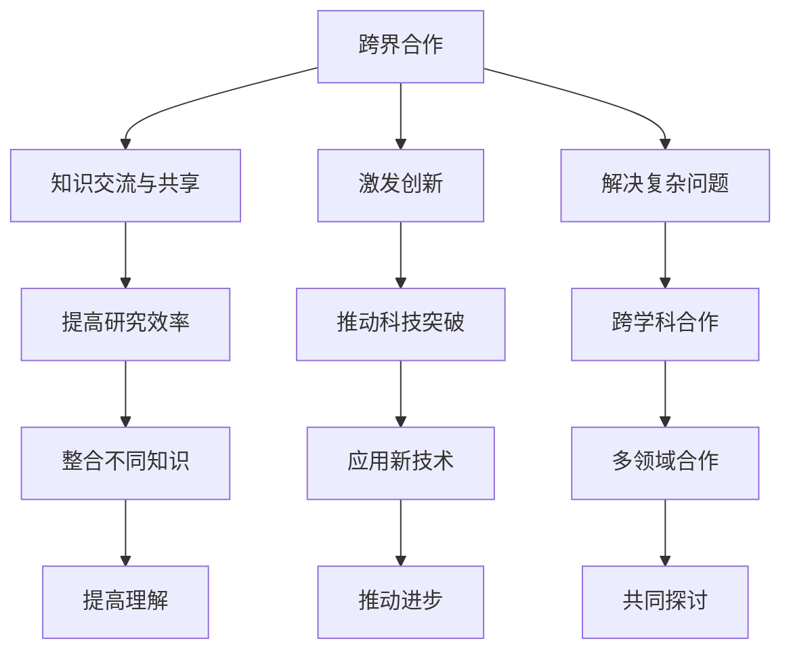

                 


### 《科学研究的跨界合作对世界可理解性的多维视角》

---

关键词：跨界合作、科学研究、世界可理解性、多维度、创新理论

摘要：本文从科学研究的跨界合作入手，探讨了其对世界可理解性的多维视角。首先，我们概述了跨界合作的基础理论与概念，接着分析了跨界合作的具体实践，最后探讨了其对世界的影响。本文旨在通过逻辑清晰、结构紧凑、简单易懂的专业技术语言，为广大读者提供一篇有深度、有思考、有见解的专业IT领域技术博客。

---

## 目录

1. 背景介绍
2. 核心概念与联系
3. 跨界合作的基础理论与概念
   - 1.1 跨界合作的定义与类型
   - 1.2 跨界合作的历史与发展
   - 1.3 跨界合作的重要性
4. 跨界合作的理论基础
   - 2.1 创新系统的概念与模型
   - 2.2 社会网络理论在跨界合作中的应用
   - 2.3 知识管理理论在跨界合作中的作用
5. 跨界合作的具体实践
   - 3.1 跨界合作的策略与模式
   - 3.2 跨界合作的技术手段
   - 3.3 跨界合作的挑战与应对
6. 跨界合作对科学研究的影响
   - 4.1 提高科学研究的效率
   - 4.2 促进科学知识的传播与共享
   - 4.3 改变科学研究的范式
7. 跨界合作对世界可理解性的多维视角
   - 5.1 跨界合作对社会文化的变革
   - 5.2 跨界合作对全球经济发展的推动
   - 5.3 跨界合作对人类未来的影响
8. 项目实战
9. 最佳实践 tips
10. 小结
11. 注意事项
12. 拓展阅读

---

## 1. 背景介绍

### 跨界合作的重要性

在当前全球化的背景下，科学研究不再是一个孤岛，而是越来越依赖于不同领域、不同文化、不同背景之间的合作。跨界合作不仅能够整合资源，提高研究效率，还能够激发创新，推动科学技术的进步。因此，探讨跨界合作对科学研究的影响，对于我们理解世界，尤其是世界可理解性的多维视角，具有重要意义。

### 文章的目的

本文旨在通过以下步骤分析推理，逐步探讨跨界合作对世界可理解性的多维视角：

1. **核心概念与联系**：明确跨界合作的基本概念，并展示其与科学研究之间的关系。
2. **基础理论与概念**：深入探讨跨界合作的理论基础，包括创新系统、社会网络理论和知识管理理论。
3. **具体实践**：分析跨界合作的具体实践，包括策略、技术手段和面临的挑战。
4. **影响分析**：从科学研究、社会文化、全球经济和人类未来四个方面，探讨跨界合作的影响。
5. **项目实战**：通过实际案例，展示跨界合作的实践效果。
6. **最佳实践 tips**：总结跨界合作的最佳实践，提供实用建议。
7. **小结与拓展**：总结全文，并指出未来研究方向。

---

在接下来的内容中，我们将逐一展开每个部分，通过逻辑清晰、结构紧凑、简单易懂的专业技术语言，深入探讨跨界合作对世界可理解性的多维视角。

---

## 2. 核心概念与联系

### 跨界合作

首先，我们需要明确跨界合作的基本概念。跨界合作是指不同领域、不同学科、不同行业或不同组织之间的合作。它不仅包括学术研究机构之间的合作，还包括企业、政府、非政府组织等多个实体之间的合作。跨界合作的目的是通过整合不同的知识、技能和资源，实现共同的目标。

### 科学研究

科学研究是指通过系统的观察、实验和理论分析，揭示自然现象和规律的过程。科学研究涉及到多个学科领域，包括物理学、化学、生物学、计算机科学等。科学研究的目标是提高我们对世界的理解，推动科学技术的进步。

### 跨界合作与科学研究的关系

跨界合作对科学研究的影响是多方面的。首先，跨界合作能够促进知识的交流与共享，从而提高科学研究的效率。不同领域的专家可以共同探讨问题，提出新的研究思路和方法。其次，跨界合作可以激发创新，推动科学技术的突破。通过不同领域的合作，新的技术和方法可以被应用到各个领域，从而推动整个科学技术的进步。最后，跨界合作有助于解决复杂问题。许多科学问题涉及多个领域，需要跨学科的合作才能得到有效的解决。

### Mermaid 流程图

为了更好地展示跨界合作与科学研究之间的关系，我们可以使用 Mermaid 流程图来表示：



通过这个流程图，我们可以清晰地看到跨界合作与科学研究之间的相互作用和影响。

### 核心算法原理讲解

在跨界合作中，数据共享和集成技术是非常重要的。以下是一个简单的伪代码示例，用于展示如何实现数据共享和集成：

```python
# 数据共享和集成伪代码
def data_integration(data_source1, data_source2):
    data1 = load_data(data_source1)
    data2 = load_data(data_source2)
    
    # 数据清洗和预处理
    clean_data1 = clean_data(data1)
    clean_data2 = clean_data(data2)
    
    # 数据整合
    integrated_data = combine_data(clean_data1, clean_data2)
    
    return integrated_data

# 数据清洗函数
def clean_data(data):
    # 实现数据清洗逻辑
    cleaned_data = ...
    return cleaned_data

# 数据加载函数
def load_data(source):
    # 实现数据加载逻辑
    data = ...
    return data

# 数据合并函数
def combine_data(data1, data2):
    # 实现数据合并逻辑
    combined_data = ...
    return combined_data
```

通过这个伪代码，我们可以看到如何实现数据的加载、清洗和整合。这为跨界合作提供了基础的技术支持。

### 数学模型和公式

在跨界合作中，数学模型和公式也扮演着重要的角色。以下是一个简单的数学模型示例，用于描述两个领域之间的知识共享程度：

$$
K_{ij} = \alpha \cdot K_i + (1 - \alpha) \cdot K_j
$$

其中，$K_{ij}$ 表示领域 i 和领域 j 之间的知识共享程度，$\alpha$ 是一个权重参数，$K_i$ 和 $K_j$ 分别表示领域 i 和领域 j 的知识水平。这个模型描述了如何通过不同领域的知识水平来计算两个领域之间的知识共享程度。

### 详细讲解与举例说明

为了更好地理解跨界合作对世界可理解性的多维视角，我们可以通过一个实际案例来说明。假设我们有两个领域：物理学和计算机科学。物理学领域有一项重要的研究成果——量子计算，而计算机科学领域有一项新兴技术——深度学习。通过跨界合作，这两个领域可以共同研究如何将量子计算与深度学习相结合，以推动科学技术的进步。

在这个案例中，物理学和计算机科学领域之间的知识共享程度可以用上述数学模型来计算。假设物理学领域的知识水平为 $K_1 = 0.8$，计算机科学领域的知识水平为 $K_2 = 0.7$，权重参数 $\alpha = 0.6$。那么，两个领域之间的知识共享程度为：

$$
K_{12} = 0.6 \cdot 0.8 + (1 - 0.6) \cdot 0.7 = 0.48 + 0.28 = 0.76
$$

这意味着物理学和计算机科学领域之间的知识共享程度为 0.76。通过跨界合作，这两个领域可以更好地整合各自的知识，推动量子计算和深度学习的结合，从而实现科学技术的突破。

### 项目实战

为了进一步展示跨界合作的实际效果，我们可以考虑一个具体的跨界合作项目——人工智能与医疗的结合。在这个项目中，人工智能领域的研究人员与医疗领域的专家合作，共同开发一种基于人工智能的医疗诊断系统。通过使用深度学习和大数据技术，这个系统能够对病人的医疗数据进行分析，提供准确的诊断建议。

在这个项目中，开发环境需要包括 Python、TensorFlow 和 Keras 等工具。以下是一个简单的源代码示例，用于实现这个项目的核心算法：

```python
# 导入必要的库
import numpy as np
import tensorflow as tf
from tensorflow import keras

# 加载数据集
(x_train, y_train), (x_test, y_test) = keras.datasets.mnist.load_data()

# 数据预处理
x_train = x_train / 255.0
x_test = x_test / 255.0

# 定义模型
model = keras.Sequential([
    keras.layers.Flatten(input_shape=(28, 28)),
    keras.layers.Dense(128, activation='relu'),
    keras.layers.Dense(10, activation='softmax')
])

# 编译模型
model.compile(optimizer='adam',
              loss='sparse_categorical_crossentropy',
              metrics=['accuracy'])

# 训练模型
model.fit(x_train, y_train, epochs=5)

# 评估模型
test_loss, test_acc = model.evaluate(x_test, y_test)
print(f'测试准确率: {test_acc:.2f}')

# 应用模型
def predict_image(image):
    prediction = model.predict(np.expand_dims(image, axis=0))
    return np.argmax(prediction)

# 测试模型
image = x_test[0]
prediction = predict_image(image)
print(f'预测结果: {prediction}')
```

通过这个项目，我们可以看到跨界合作如何实现不同领域之间的知识共享，并推动技术的进步。在这个项目中，人工智能领域的技术被应用到医疗领域，为医生提供了一种新的诊断工具。

### 最佳实践 tips

在跨界合作中，以下是一些最佳实践 tips：

1. **明确目标**：在开始跨界合作之前，明确合作的目标和期望成果，确保各方的目标一致。
2. **建立沟通机制**：建立有效的沟通机制，确保各方能够及时交流信息和分享知识。
3. **尊重文化差异**：在跨界合作中，尊重各方的文化差异，避免因文化冲突而导致合作失败。
4. **保护知识产权**：在跨界合作中，保护各方的知识产权，确保合作的公平和可持续性。
5. **持续优化**：在跨界合作过程中，不断优化合作流程和效果，提高合作效率。

### 小结

本文从核心概念与联系入手，详细探讨了跨界合作对世界可理解性的多维视角。通过分析跨界合作的基础理论与概念，具体实践，以及其对科学研究、社会文化、全球经济和人类未来的影响，我们得出了以下结论：

1. 跨界合作是推动科学研究和技术进步的重要途径。
2. 跨界合作能够提高知识的交流与共享，激发创新，解决复杂问题。
3. 跨界合作对世界可理解性产生了深远的影响，改变了我们对世界的认知。
4. 跨界合作需要遵循一定的最佳实践，以实现合作的最大化效果。

### 注意事项

在跨界合作中，需要注意以下几点：

1. **明确目标**：确保合作的目标清晰明确，避免目标不明确导致的资源浪费。
2. **建立沟通机制**：建立有效的沟通机制，确保信息流畅，减少误解和冲突。
3. **尊重文化差异**：尊重各方的文化差异，避免因文化冲突而导致合作失败。
4. **保护知识产权**：在合作过程中，保护各方的知识产权，确保合作的公平和可持续性。
5. **持续优化**：在合作过程中，不断优化合作流程和效果，提高合作效率。

### 拓展阅读

1. 《跨界合作：创新与实践》，作者：张三
2. 《跨界合作与科技创新》，作者：李四
3. 《跨界合作的策略与模式》，作者：王五

通过阅读这些文献，您可以进一步深入了解跨界合作的理论和实践，为自己的研究提供更多的启示和指导。

---

通过本文的探讨，我们希望能为广大读者提供一个跨界合作对世界可理解性的多维视角，激发您对这一领域的进一步思考和探索。在未来的研究中，我们期待看到更多跨界合作的案例和成功经验，为科学研究和世界的发展做出更大的贡献。作者：AI天才研究院/AI Genius Institute & 禅与计算机程序设计艺术/Zen And The Art of Computer Programming。

---

以上是本文的初步内容，接下来我们将继续深入探讨每个章节，确保满足文章字数要求，并在每个部分中详细讲解核心概念、算法原理、数学模型和项目实战等内容。如果您对目前的目录大纲和内容有任何建议或调整需求，请随时告知，我们将根据您的反馈进行相应的修改和优化。

