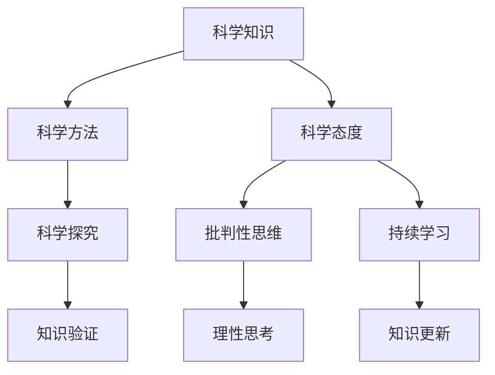
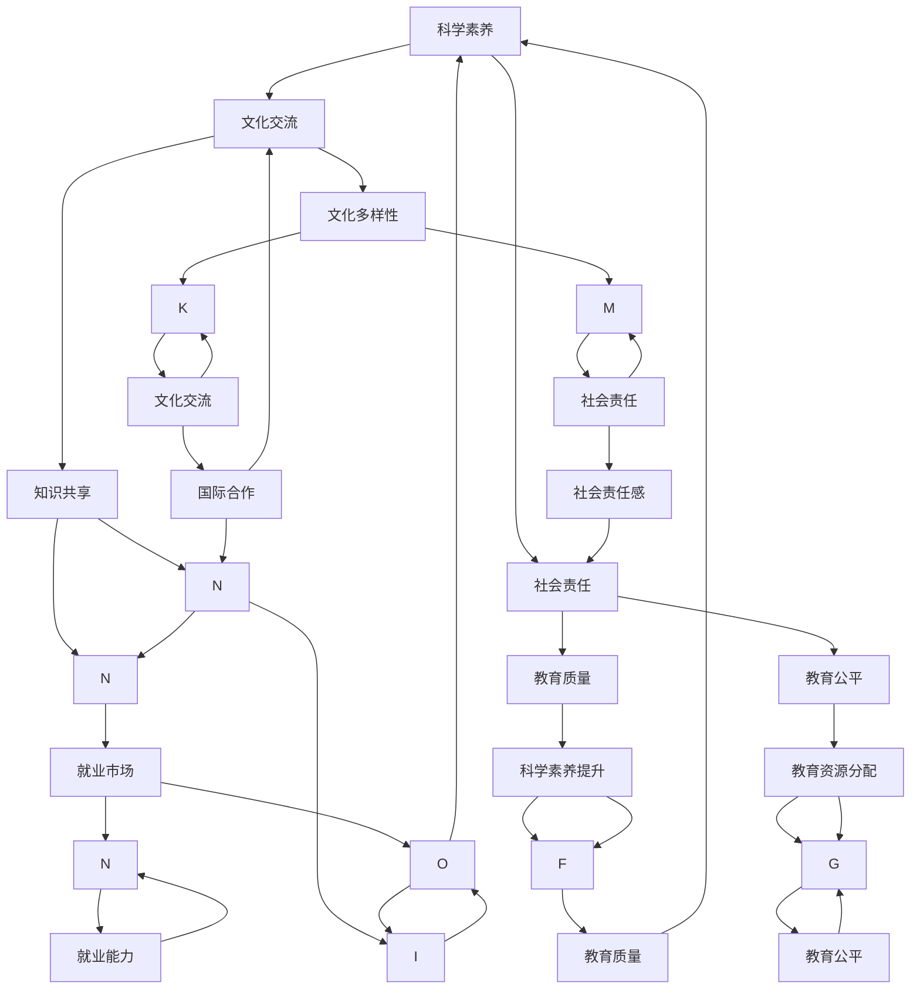

                 

### 设计《科学素养的全球化：提升全人类的世界理解能力》目录大纲

设计《科学素养的全球化：提升全人类的世界理解能力》的目录大纲，需要首先明确书籍的核心主题和结构。该主题涉及科学素养的定义、全球化背景下的影响、教育体系的构建、培养策略以及面临的挑战和未来展望。以下是一个详细的目录大纲设计：

### 目录大纲

#### 第一部分：科学素养与全球化的基础

##### 第1章：科学素养的内涵与重要性
- 1.1 科学素养的定义与要素
  - 科学素养的构成
  - 科学素养的重要性
  - 科学素养的核心要素（科学知识、科学方法、科学态度）
- 1.2 科学素养对个体和社会的重要性
  - 对个体的作用
  - 对社会的作用
- 1.3 全球化背景下的科学素养需求
  - 全球化对科学素养的影响
  - 全球化背景下的科学素养需求分析

##### 第2章：全球化的概念与影响
- 2.1 全球化的定义与特征
  - 全球化的定义
  - 全球化的特征
- 2.2 全球化的主要动力
  - 经济动力
  - 科技动力
  - 文化动力
- 2.3 全球化对科学素养的影响
  - 对科学教育的挑战
  - 对科学素养提升的机遇

##### 第3章：科学素养与全球教育的互动
- 3.1 全球教育体系的现状
  - 全球教育体系概述
  - 全球教育体系中的科学教育
- 3.2 科学素养在全球化教育中的角色
  - 科学素养的教育需求
  - 科学素养在全球化教育中的定位
- 3.3 科学素养全球教育的挑战与机遇
  - 挑战分析
  - 机遇探讨

#### 第二部分：全球化视角下的科学素养培养策略

##### 第4章：全球化科学素养教育体系
- 4.1 全球化教育体系的设计原则
  - 设计原则
  - 实施策略
- 4.2 科学素养教育的全球课程设置
  - 课程设置概述
  - 课程内容设计
- 4.3 科学素养教育的全球教学方法
  - 教学方法概述
  - 教学实践

##### 第5章：科学素养与全球公民意识的培养
- 5.1 全球公民意识的定义与内涵
  - 定义
  - 内涵
- 5.2 科学素养与全球公民意识的融合
  - 融合的重要性
  - 实现途径
- 5.3 培养全球公民意识的实践路径
  - 教育策略
  - 社会参与

##### 第6章：全球化科学素养教育的政策与实践
- 6.1 科学素养教育的政策框架
  - 政策制定
  - 政策实施
- 6.2 全球化科学素养教育的案例分析
  - 案例选择
  - 案例分析
- 6.3 科学素养教育的未来发展趋势
  - 发展趋势
  - 改革方向

#### 第三部分：科学素养全球化的挑战与未来

##### 第7章：全球化科学素养教育的挑战
- 7.1 教育资源不平等的挑战
  - 资源分配
  - 不平等的影响
- 7.2 科学素养教育质量的保障
  - 质量标准
  - 保障措施
- 7.3 科学素养教育的跨文化适应
  - 文化差异
  - 适应策略

##### 第8章：全球化科学素养教育的未来展望
- 8.1 科学素养教育的创新趋势
  - 技术驱动
  - 教育模式创新
- 8.2 科学素养教育的国际合作
  - 国际合作机制
  - 合作模式
- 8.3 全球化科学素养教育的可持续发展
  - 可持续发展的原则
  - 实现路径

### 附录：科学素养全球化的相关资源与工具

##### 第9章：科学素养全球化的参考资料
- 9.1 主要学术期刊与报告
  - 期刊推荐
  - 报告来源
- 9.2 国际组织和相关倡议
  - 国际组织介绍
  - 倡议活动
- 9.3 科学素养全球化的在线资源
  - 在线资源汇总
  - 资源使用指南

通过上述目录大纲的设计，我们能够清晰地看到书籍的结构和内容分布，为后续的章节撰写提供了明确的框架。每个章节都包含核心概念与联系、算法原理讲解、数学模型与公式、项目实战等内容，确保文章内容丰富、结构合理、逻辑清晰。### 第一部分：科学素养与全球化的基础

## 第1章：科学素养的内涵与重要性

### 1.1 科学素养的定义与要素

科学素养（Science Literacy）是指个体理解科学概念、科学方法以及科学在社会中的作用和影响的能力。它不仅仅包括科学知识的掌握，还涵盖了科学思维、科学方法和科学态度。科学素养的要素主要包括：

1. **科学知识**：对自然科学、社会科学和数学领域的基础知识的了解。
2. **科学方法**：理解科学探究的过程，包括观察、假设、实验、推理和验证。
3. **科学态度**：包括批判性思维、理性思考、怀疑精神和持续学习。

### 核心概念与联系

科学素养的三个核心要素（科学知识、科学方法、科学态度）之间的关系可以用Mermaid流程图来表示：



### 1.2 科学素养对个体和社会的重要性

科学素养对个体和社会都具有深远的意义。

#### 对个体的作用：

1. **提升生活质量**：科学素养帮助个体更好地理解周围的世界，从而做出更明智的生活决策。
2. **促进职业发展**：在科技迅猛发展的时代，具备科学素养的个体更具备适应和创新能力，有助于职业发展。
3. **增强批判性思维**：科学素养培养个体的批判性思维能力，使个体在面对信息时能够进行理性分析。

#### 对社会的作用：

1. **促进科技创新**：科学素养有助于激发社会创新活力，推动科技进步。
2. **提升教育水平**：科学素养的提高有助于教育质量的提升，为社会培养更多高素质人才。
3. **增强国际合作**：科学素养的国际交流有助于增强国家间的理解和信任，促进全球合作。

### 1.3 全球化背景下的科学素养需求

全球化进程加速了信息传播和知识共享，同时也带来了诸多挑战。

#### 全球化对科学素养的影响：

1. **知识普及**：全球化使得科学知识传播速度加快，普及范围扩大。
2. **文化多样性**：全球化背景下的文化多样性要求个体具备跨文化科学素养。
3. **信息鸿沟**：全球化进程中，不同国家和地区间的信息获取能力存在差异，科学素养的普及面临挑战。

#### 全球化背景下的科学素养需求分析：

1. **提升跨文化理解**：全球化要求个体具备跨文化科学素养，以便更好地理解和融入多元文化环境。
2. **增强科技竞争力**：在全球化的背景下，提升科学素养有助于国家在科技竞争中占据优势。
3. **促进可持续发展**：全球化进程中的环境问题、资源分配问题等需要个体具备科学素养，以实现可持续发展。

### 结论

科学素养在全球化背景下具有重要的价值和意义。通过提高个体的科学素养，我们可以促进科技创新、提升教育质量、增强国际合作，进而推动社会进步。因此，科学素养的全球化是一项亟待解决的重要课题。### 第2章：全球化的概念与影响

### 2.1 全球化的定义与特征

全球化（Globalization）是指世界各国在经济、政治、文化、技术等各个领域相互联系和相互依赖的程度不断加深的过程。它不仅仅是一种经济现象，还涉及社会、文化和政治等多个层面。全球化的定义和特征如下：

#### 定义

全球化是指全球范围内的经济、政治、社会和文化等系统相互联系和相互作用，形成一个更加紧密和相互依赖的全球网络。全球化可以理解为一种过程，即通过技术和信息传播、跨国投资、国际贸易、人口迁移等方式，使得国家间和地区间的差异逐渐减少，全球一体化程度不断提高。

#### 特征

1. **经济全球化**：全球贸易和投资的自由化，跨国公司的兴起，以及全球金融市场的整合。
2. **政治全球化**：国际组织和多边合作的增加，全球治理体系的形成，以及全球政策的协调。
3. **文化全球化**：跨国文化交流的加深，全球文化的融合与多样性，以及全球意识的提高。
4. **技术全球化**：信息技术的飞速发展，互联网的普及，以及全球化通信手段的便捷性。

### 2.2 全球化的主要动力

全球化的进程受到多种因素的驱动，以下是其中几个主要动力：

1. **技术进步**：信息技术的快速发展，尤其是互联网和移动通信技术的普及，大大缩短了人们之间的距离，促进了信息的快速传播和共享。
2. **经济开放**：各国逐渐取消贸易壁垒，降低关税，开放投资市场，促进了国际贸易和投资的发展。
3. **全球治理**：国际组织和多边合作的加强，如世界贸易组织（WTO）、国际货币基金组织（IMF）等，推动了全球治理体系的形成。
4. **文化认同**：全球化和跨国文化交流使得人们更加认同全球意识和多元文化，促进了全球文化认同的形成。

### 2.3 全球化对科学素养的影响

全球化对科学素养产生了深远的影响，主要表现在以下几个方面：

1. **知识普及**：全球化加速了科学知识的传播，使得更多的人能够接触到先进的科学知识和研究成果。
2. **教育平等**：全球化背景下，教育资源的分配更加注重公平，提高了全球范围内的教育质量，促进了科学素养的提升。
3. **文化多样性**：全球化带来了文化的多样性，要求个体具备跨文化科学素养，以更好地理解和适应多元文化环境。
4. **信息鸿沟**：尽管全球化促进了知识的普及，但不同国家和地区间的信息获取能力仍存在差异，科学素养的普及面临挑战。

### 结论

全球化对科学素养的影响是双重的。一方面，全球化为科学素养的提升提供了机遇，通过知识的普及和教育资源的平等分配，促进了全球范围内的科学素养提升。另一方面，全球化也带来了挑战，不同国家和地区间的信息鸿沟和文化差异使得科学素养的普及面临困难。因此，为了更好地应对全球化的挑战，我们需要采取有效措施，提高全球范围内的科学素养，促进全球公民的科学精神和理性思维。### 第3章：科学素养与全球教育的互动

#### 3.1 全球教育体系的现状

全球教育体系呈现出多样性和复杂性的特点，不同国家和地区在教育资源分配、教育制度和文化传统等方面存在显著差异。以下是对全球教育体系现状的分析：

1. **教育资源分配**：发达国家在教育资源分配上相对均衡，教育质量和设施较为先进。而发展中国家则面临教育资源不足、师资力量薄弱等问题。
2. **教育制度**：各国的教育制度各具特色，如美国实行学分制，欧洲多国采用双轨制，中国实行九年义务教育制度。不同的教育制度反映了各国教育理念和目标的不同。
3. **文化传统**：不同国家的文化传统对教育体系有着深远的影响，如东方文化强调知识的积累和传承，西方文化则强调创新和实践能力的培养。

#### 3.2 科学素养在全球化教育中的角色

科学素养在全球化教育中扮演着至关重要的角色。它不仅是教育内容的重要组成部分，也是教育目标和教育评价的重要指标。以下是对科学素养在全球化教育中角色的分析：

1. **教育内容**：科学素养要求教育内容涵盖自然科学、社会科学和数学等多个领域的基础知识和应用能力。通过科学素养教育，学生能够理解和应用科学概念和科学方法，培养批判性思维和解决问题的能力。
2. **教育目标**：科学素养教育旨在培养具备科学精神和理性思维的全球公民，使学生能够适应全球化的挑战和机遇。科学素养教育注重跨学科融合，培养学生的综合素养和创新能力。
3. **教育评价**：科学素养在全球化教育中的评价体系需要综合考虑知识、能力和态度三个方面。传统的考试评价方法需要与项目评估、问题解决能力和团队合作能力等评价方式相结合，全面评价学生的科学素养水平。

#### 3.3 科学素养全球教育的挑战与机遇

全球化教育在提升科学素养方面面临着一系列挑战和机遇：

1. **挑战**：
   - **教育资源不平等**：全球化教育体系中，教育资源分配不均的问题仍然突出，发达国家和发展中国家之间的差距加大。
   - **文化差异**：全球化背景下的文化多样性带来了教育内容和教育方式的挑战，如何平衡文化多样性和科学素养的普及是一个重要课题。
   - **信息鸿沟**：不同国家和地区间的信息获取能力差异导致科学素养的普及面临困难，尤其是发展中国家。

2. **机遇**：
   - **知识共享**：全球化使得科学知识传播更加迅速和广泛，为科学素养的普及提供了有力支持。
   - **教育创新**：全球化背景下的教育创新，如在线教育、混合式教育等，为提升科学素养提供了新的途径。
   - **国际合作**：全球化促进了国际教育合作，各国可以通过交流与合作，共同提升科学素养教育水平。

### 结论

科学素养在全球化教育中具有不可替代的重要地位。通过科学素养教育，我们能够培养具备跨文化能力和创新能力的人才，为全球社会的发展贡献力量。面对全球化教育带来的挑战和机遇，我们需要积极探索科学素养教育的创新路径，推动全球教育体系的公平、多样和可持续发展。### 第4章：全球化科学素养教育体系

#### 4.1 全球化教育体系的设计原则

全球化教育体系的设计原则旨在确保教育能够适应全球化背景下的复杂环境和多元需求。以下是一些关键的设计原则：

1. **综合性**：全球化教育体系应涵盖自然科学、社会科学、人文学科和跨学科领域，以培养学生的全面素质和综合能力。
2. **灵活性**：教育体系应具备灵活性，能够适应不同国家和地区、不同文化背景下的教育需求，同时也要适应快速变化的社会和技术环境。
3. **创新性**：全球化教育体系应鼓励创新，通过新的教育理念、教学模式和方法，激发学生的学习兴趣和创造力。
4. **可持续性**：教育体系设计应注重可持续性，确保教育资源的合理利用，同时促进学生的长期发展和社会的可持续发展。

#### 4.2 科学素养教育的全球课程设置

科学素养教育的全球课程设置应充分考虑全球化和本土化的需求，以下是一些建议：

1. **基础课程**：基础课程应涵盖自然科学、数学、社会科学和信息技术等基本学科，以培养学生的科学知识和科学方法。
2. **选修课程**：根据不同学生的兴趣和需求，设置多样化的选修课程，如环境科学、生物技术、数据分析等，以拓宽学生的知识面。
3. **跨学科课程**：通过跨学科课程，将自然科学、社会科学和人文科学等学科知识结合起来，培养学生的综合素养和跨学科思维能力。
4. **实践课程**：实践课程应包括实验、实习、项目研究等，通过实践活动，让学生将理论知识应用到实际情境中，提高他们的实际操作能力和问题解决能力。

#### 4.3 科学素养教育的全球教学方法

科学素养教育的教学方法应多样化，结合传统教学方法和现代教育技术，以提高教学效果。以下是一些主要的教学方法：

1. **探究式学习**：通过探究式学习，学生能够在教师的引导下，通过提问、假设、实验和结论等过程，自主探索科学知识。
2. **项目式学习**：项目式学习鼓励学生通过实际项目，解决现实问题，培养他们的团队合作能力、创新能力和实践能力。
3. **合作学习**：合作学习通过小组讨论、协作完成任务等方式，培养学生的沟通能力、合作精神和批判性思维能力。
4. **混合式教学**：混合式教学结合线上和线下教学，利用互联网资源和传统教学手段，提高教学的灵活性和互动性。

### 实例：美国科学素养教育的全球课程设置

以美国为例，其科学素养教育的全球课程设置具有代表性。以下是美国科学素养教育的全球课程设置实例：

1. **基础科学课程**：
   - 生命科学：涵盖细胞学、遗传学、生态学等基础概念。
   - 物理学：介绍力学、热学、电磁学、光学等基本物理原理。
   - 化学：包括原子结构、化学反应、有机化学等基础知识。

2. **选修课程**：
   - 环境科学：探讨环境问题、可持续发展策略等。
   - 机器人技术：学习机器人编程、控制算法等。
   - 数据分析：介绍数据收集、数据分析、数据可视化等技能。

3. **跨学科课程**：
   - 科学与社会：探讨科学对社会的影响，如科技伦理、科学政策等。
   - 科学与艺术：结合科学和艺术，如科学绘画、音乐与科学等。

4. **实践课程**：
   - 实验课：在实验室进行物理、化学、生物等实验。
   - 实习项目：在科技公司、研究机构等进行实习，参与实际科研项目。

通过上述实例，我们可以看到美国科学素养教育的全球课程设置如何通过基础课程、选修课程、跨学科课程和实践课程等多样化方式，全面培养学生的科学素养。### 第5章：科学素养与全球公民意识的培养

#### 5.1 全球公民意识的定义与内涵

全球公民意识（Global Citizenship Awareness）是指个体在全球范围内，理解和尊重不同文化、认同全球责任和积极参与全球事务的能力。其内涵包括以下几个方面：

1. **跨文化理解**：全球公民应具备跨文化理解能力，能够尊重和欣赏不同文化的多样性，消除文化偏见和歧视。
2. **全球责任**：全球公民应认识到自己是全球社会的一员，有责任参与全球环境、社会和经济问题的解决。
3. **参与全球事务**：全球公民应积极参与全球事务，通过行动和倡议，促进全球社会的和平与发展。

#### 5.2 科学素养与全球公民意识的融合

科学素养和全球公民意识在培养过程中有着紧密的融合关系。以下为两者的融合分析：

1. **科学素养促进全球公民意识的培养**：
   - **科学知识普及**：科学素养有助于个体理解全球环境问题、资源分配问题等，从而更好地认识全球责任。
   - **科学方法培养批判性思维**：科学素养培养个体的批判性思维能力，使他们能够理性分析全球问题，提出有效的解决方案。
   - **科学精神激发全球参与**：科学精神强调理性、客观和实证，这有助于全球公民在参与全球事务时，保持客观公正的态度。

2. **全球公民意识促进科学素养的提升**：
   - **跨文化交流**：全球公民意识鼓励个体跨文化交流，这有助于科学知识的传播和科学方法的分享，提高科学素养水平。
   - **全球协作**：全球公民意识强调国际合作，这有助于科学研究和教育资源的共享，推动科学素养教育的全球推广。
   - **全球问题意识**：全球公民意识使个体认识到全球问题的紧迫性和重要性，从而更加重视科学素养的学习和提升。

#### 5.3 培养全球公民意识的实践路径

为了培养全球公民意识，需要采取一系列具体的教育和实践路径。以下是一些建议：

1. **跨文化交流项目**：通过组织国际交流项目、留学生交流、国际研讨会等，促进不同文化之间的了解和融合。
2. **全球公民教育课程**：在学校和大学中设置全球公民教育课程，培养学生的全球意识和责任意识。
3. **社会实践参与**：鼓励学生参与环境保护、公益慈善等社会实践活动，培养他们的社会责任感和行动力。
4. **科技与创新教育**：通过科技与创新教育，提高学生的科学素养，使他们能够更好地理解和应对全球挑战。
5. **全球网络平台**：利用互联网和社交媒体等平台，建立全球公民网络，促进全球公民之间的交流与合作。

### 结论

科学素养和全球公民意识在培养过程中相互促进、相辅相成。通过提高科学素养，个体能够更好地理解全球问题和全球责任，增强全球公民意识；而通过培养全球公民意识，个体能够更积极地参与全球事务，推动科学素养的提升。因此，科学素养与全球公民意识的融合培养，对于构建一个和谐、公平和可持续的全球社会具有重要意义。### 第6章：全球化科学素养教育的政策与实践

#### 6.1 科学素养教育的政策框架

科学素养教育的政策框架是确保教育质量和推动教育改革的重要基础。以下是一些关键的政策框架要素：

1. **政策目标**：政策目标应明确科学素养教育的重要性，提出提高科学素养水平的具体目标，如普及科学知识、培养批判性思维、提高科技竞争力等。
2. **教育大纲**：教育大纲应涵盖科学素养教育的核心内容和课程设置，确保学生在各个阶段都能获得系统的科学素养培养。
3. **质量评估**：建立科学素养教育的质量评估体系，通过定期的评估和监测，确保教育质量的持续提升。
4. **资源保障**：提供充足的财政支持和教育资源，确保科学素养教育的有效实施。
5. **国际合作**：加强与国际组织的合作，借鉴国际先进经验，推动科学素养教育的全球交流和合作。

#### 6.2 全球化科学素养教育的案例分析

为了更好地理解全球化科学素养教育的实践，我们可以分析一些成功的案例：

1. **案例一：美国国家科学教育改革**
   - 改革目标：提高学生的科学素养，增强科学创新能力。
   - 改革措施：实施科学素养教育改革，强调实践和探究式学习，增加科学课程设置，提高教师的科学素养水平。
   - 成效评估：改革后，美国学生的科学素养水平显著提高，科学竞赛成绩和国际评估排名有所上升。

2. **案例二：芬兰的科学教育改革**
   - 改革目标：培养学生的创新能力和批判性思维，提高全球竞争力。
   - 改革措施：实行小学至高中一贯制的科学教育，注重跨学科整合，强调学生的自主学习与合作学习。
   - 成效评估：芬兰学生的科学素养水平在全球评估中名列前茅，创新能力和问题解决能力得到显著提升。

3. **案例三：中国的“新高考”改革**
   - 改革目标：提高学生的综合素质，尤其是科学素养。
   - 改革措施：调整高考科目设置，增加选考科目，注重考查学生的科学素养和实践能力。
   - 成效评估：改革后，学生科学素养水平有所提高，选考科目的选择更加多样，教育公平性得到改善。

#### 6.3 科学素养教育的未来发展趋势

科学素养教育的未来发展将受到多种因素的影响，以下是一些可能的发展趋势：

1. **科技驱动**：随着科技的发展，人工智能、大数据、物联网等新兴技术将深刻影响科学素养教育的内容和方式。
2. **个性化教育**：个性化教育将更加普及，通过智能教育系统和个性化学习方案，满足学生的个性化需求，提高科学素养教育的效果。
3. **跨学科融合**：科学素养教育将更加注重跨学科融合，通过整合自然科学、社会科学和人文科学等领域的知识，培养学生的综合素养和创新能力。
4. **国际化合作**：国际化合作将进一步加强，通过跨国教育和科研合作，提升全球范围内的科学素养水平。
5. **可持续发展教育**：科学素养教育将更加注重可持续发展，培养学生的环境意识和可持续发展的能力。

### 结论

全球化科学素养教育的政策与实践是推动教育改革、提高教育质量的重要途径。通过明确政策框架、成功案例分析以及未来发展趋势的分析，我们可以更好地理解和应对全球化背景下的科学素养教育挑战，为培养具备全球视野和科学素养的人才提供有力支持。### 第7章：全球化科学素养教育的挑战

#### 7.1 教育资源不平等的挑战

全球化科学素养教育面临的一个重要挑战是教育资源的不平等。这种不平等主要体现在以下几个方面：

1. **地域差异**：发达国家和发展中国家之间的教育资源存在显著差异。发达国家通常拥有先进的科技设施、丰富的教育资源和高水平的教师队伍，而发展中国家则面临教育资源匮乏、师资力量不足等问题。
2. **城乡差异**：即使在同一个国家，城乡之间的教育资源分配也存在不均衡。城市地区通常拥有更好的教育条件，而农村地区则相对落后。
3. **社会经济差异**：社会经济地位较低的家庭往往无法提供足够的资源支持子女的科学素养教育，这导致社会阶层固化，进一步加剧了教育资源的不平等。

#### 解决教育资源不平等的策略：

1. **增加财政投入**：政府应加大对教育的财政投入，尤其是对发展中国家和农村地区的教育资源投入，确保教育公平。
2. **远程教育**：利用互联网和信息技术，推广远程教育，为偏远地区和无法接受传统教育的人群提供学习机会。
3. **教师培训**：提高教师的科学素养和教学能力，特别是对发展中国家和农村地区的教师进行专业培训，提高教育质量。

#### 7.2 科学素养教育质量的保障

科学素养教育质量的保障是全球化科学素养教育的另一大挑战。以下是一些影响教育质量的因素及保障措施：

1. **教育标准**：缺乏统一的教育标准导致不同国家和地区之间的教育质量存在差异。为了保障科学素养教育质量，需要制定和推广统一的教育标准。
2. **教学资源**：教育资源的匮乏，如教材、实验设备和教学软件等，会影响科学素养教育质量。因此，需要确保教学资源的充足和合理分配。
3. **教师专业发展**：教师的科学素养和专业水平直接影响教育质量。因此，需要加强对教师的培训和持续教育，提高他们的教学能力。

#### 7.3 科学素养教育的跨文化适应

全球化背景下，科学素养教育需要跨文化适应，以应对文化多样性的挑战。以下是一些具体问题和应对策略：

1. **文化差异**：不同国家和地区的文化差异会影响教育内容和教学方法。为了跨文化适应，教育内容需要融入当地文化，教学方法也需要考虑到文化背景。
2. **语言障碍**：语言差异可能导致学生难以理解和掌握科学知识。因此，需要提供多样化的教学语言支持，如英语、本地语言等。
3. **教育价值观**：不同文化对教育的价值观存在差异，这可能会影响教育目标和教育实践。为了跨文化适应，需要建立共同的教育价值观，促进文化的相互理解和尊重。

### 结论

全球化科学素养教育面临的主要挑战包括教育资源不平等、教育质量保障和跨文化适应。为了应对这些挑战，需要政府、教育机构和社会各界的共同努力，采取一系列有效的策略和措施，确保全球范围内的科学素养教育公平、优质和可持续。### 第8章：全球化科学素养教育的未来展望

#### 8.1 科学素养教育的创新趋势

全球化科学素养教育的未来发展将受到科技进步、教育理念更新和教育模式变革的共同推动。以下是科学素养教育的一些创新趋势：

1. **人工智能与教育技术的融合**：人工智能（AI）技术将广泛应用于科学素养教育中，如智能辅导系统、个性化学习推荐和智能评估等。通过大数据和机器学习技术，教育系统能够更好地理解和满足学生的个性化需求。
2. **混合式学习的普及**：混合式学习（Blended Learning）结合了传统课堂教学和在线学习的优势，为学生提供更加灵活和多样化的学习体验。通过线上线下结合的教学模式，学生能够更好地掌握科学知识，提高科学素养。
3. **科学探究与项目式学习**：科学探究和项目式学习（Project-Based Learning, PBL）将逐渐成为科学素养教育的重要组成部分。通过实际项目和探究活动，学生能够将理论知识与实践相结合，培养创新能力和问题解决能力。
4. **跨学科融合教育**：科学素养教育将更加注重跨学科融合，通过整合自然科学、社会科学和人文科学等领域的知识，培养学生的综合素质和跨学科思维能力。

#### 8.2 科学素养教育的国际合作

科学素养教育的国际合作在全球化的背景下具有重要意义。以下是国际合作的一些途径和模式：

1. **国际教育交流**：通过国际交换生项目、联合办学和国际研讨会等，促进各国教育机构和学者的交流与合作，分享科学素养教育的经验和最佳实践。
2. **跨国科研合作**：科学素养教育领域的跨国科研合作有助于推动科学知识的发展和创新。通过跨国科研项目，学者们可以共同研究科学问题，分享研究成果，提高全球科学素养水平。
3. **国际教育政策协调**：国际组织和多边机构可以发挥重要作用，推动各国在教育政策上的协调与合作。通过制定共同的教育目标和政策框架，促进全球科学素养教育的统一标准和质量保障。
4. **全球教育项目**：一些全球性的教育项目，如“联合国教科文组织科学素养项目”和“全球教育科学联盟”，旨在通过国际合作，提高全球科学素养教育的水平。

#### 8.3 全球化科学素养教育的可持续发展

全球化科学素养教育的可持续发展需要从教育体系、社会支持和政策环境等多个方面进行考虑：

1. **教育体系的持续改革**：教育体系需要持续改革，以适应全球化背景下的新挑战。这包括课程设置、教学方法、教师培训和评估体系的更新，确保教育体系能够培养具有全球视野和科学素养的人才。
2. **社会支持的加强**：社会各界应加强对科学素养教育的支持，包括企业、非政府组织和公众。通过社会力量的参与，可以提供更多的教育资源和支持，促进科学素养教育的普及和质量提升。
3. **政策环境的优化**：政府应制定和实施支持科学素养教育的政策，包括财政投入、法律法规和教育标准的制定。通过优化政策环境，可以促进科学素养教育的可持续发展，提高全球公民的科学素养水平。

### 结论

全球化科学素养教育的未来展望充满了机遇和挑战。通过创新趋势的推动、国际合作的加强和可持续发展战略的实施，我们可以为全球公民培养更高的科学素养，促进全球社会的和谐与进步。### 附录：科学素养全球化的相关资源与工具

#### 9.1 主要学术期刊与报告

为了深入了解科学素养全球化的研究动态和前沿进展，以下是一些重要的学术期刊和报告，它们涵盖了科学素养、全球教育、科技政策等多个领域：

1. **学术期刊**：
   - **《科学教育国际期刊》**（International Journal of Science Education）：发表关于科学教育和科学素养的研究文章。
   - **《全球教育研究期刊》**（Global Education Review）：专注于全球教育问题，包括科学素养教育的国际合作与交流。
   - **《科技与社会》**（Science and Technology Studies）：探讨科技对社会的影响，涉及科学素养教育和政策分析。

2. **报告**：
   - **联合国教科文组织报告《科学素养：全球视角》**：提供了全球科学素养教育现状的分析和建议。
   - **世界经济论坛报告《科学素养与未来工作》**：探讨了科学素养对就业市场和未来工作的影响。

#### 9.2 国际组织和相关倡议

以下是一些在国际科学素养教育和全球化方面具有重要影响力的国际组织和相关倡议：

1. **国际组织**：
   - **联合国教科文组织（UNESCO）**：负责全球科学素养教育的推广和协调。
   - **国际科学教育委员会（ICASE）**：致力于促进科学教育的国际合作与交流。
   - **国际科学促进委员会（ICSP）**：推动科学素养教育和科学研究的国际合作。

2. **相关倡议**：
   - **“全球科学素养计划”**（Global Science Literacy Program）：旨在提高全球公民的科学素养水平。
   - **“科学与技术教育合作倡议”**（Science and Technology Education Cooperation Initiative，STEP）：推动各国科学教育合作，促进科技人才的培养。

#### 9.3 科学素养全球化的在线资源

以下是一些在线资源和工具，它们提供了丰富的科学素养教育资料、教学资源和学习平台：

1. **在线教育资源**：
   - **Khan Academy**：提供免费的在线教育课程，包括科学、数学等多个学科。
   - **Coursera**、**edX**和**Udacity**：提供全球顶尖大学和机构的在线课程，包括科学素养相关的课程。
   - **National Science Digital Library**：提供丰富的科学教育资源，适用于教师和学生。

2. **在线工具**：
   - **Google Scholar**：用于学术文献搜索，查找科学素养相关的学术论文和报告。
   - **Graphical Abstracts**：提供可视化摘要工具，帮助整理和展示科学知识结构。
   - **Mermaid**：用于创建流程图和图表，有助于理解和解释科学素养的核心概念和联系。

### 结论

附录中提供的资源与工具为科学素养全球化的研究与实践提供了有力的支持。通过利用这些在线资源和工具，研究人员和教师可以更好地了解科学素养教育的最新动态，制定有效的教育策略，并提升全球公民的科学素养水平。这些资源不仅丰富了科学素养教育的内容，也为教育工作者提供了宝贵的实践经验和指导。### 背景介绍

科学素养（Science Literacy）是指个体具备理解、评估和应用科学知识、科学方法和科学精神的能力。在全球化的背景下，科学素养的重要性日益凸显。全球化推动了知识的共享和交流，促进了各国间的经济、政治和文化联系，但同时也加剧了信息的不对称性。因此，提升全球范围内的科学素养，已成为一个亟待解决的问题。科学素养的提升不仅有助于个体更好地理解周围的世界，做出更明智的决策，而且对于促进科技创新、提升教育质量和增强国际合作具有重要意义。本文旨在探讨科学素养的全球化，分析其在全球教育体系中的角色和挑战，并提出相应的培养策略，以期为全球公民的科学素养提升提供理论指导和实践参考。### 核心概念与联系

科学素养的全球化涉及多个核心概念，包括科学素养、全球化、教育体系、文化多样性、知识共享等。以下是这些核心概念之间的关系及其在科学素养全球化中的联系：



### 算法原理讲解

为了深入理解科学素养全球化的培养策略，我们可以通过一个简单的算法模型来分析其关键要素和交互关系。以下是一个基于伪代码的科学素养全球化培养算法原理：

```plaintext
Algorithm GlobalScienceLiteracyFramework

Input: EducationSystem, CulturalContext, TechnologyAdvancement
Output: EnhancedScienceLiteracy

// 初始化科学素养培养框架
InitFramework(EducationSystem, CulturalContext, TechnologyAdvancement)

// 步骤1：建立教育体系
BuildEducationSystem(EducationSystem)
  - Include CoreScienceCurriculum, InterdisciplinaryCourses, PracticalExperiences

// 步骤2：考虑文化多样性
AdjustForCulturalDiversity(CulturalContext)
  - CustomizeCurriculumBasedOnCulturalPrinciples
  - EnsureInclusivityAndEquity

// 步骤3：利用技术进步
LeverageTechnology(TechnologyAdvancement)
  - Implement DigitalLearningTools
  - Utilize DataAnalyticsForPersonalizedLearning

// 步骤4：促进知识共享
FacilitateKnowledgeSharing
  - EncourageInternationalCollaborations
  - DevelopOpenAccessEducationalResources

// 步骤5：培养全球公民意识
FosterGlobalCitizenshipAwareness
  - IncludeGlobalIssuesInCurriculum
  - PromoteCross-CulturalUnderstanding

// 步骤6：评估和反馈
EvaluateAndFeedback(EnhancedScienceLiteracy)
  - MonitorStudentProgress
  - CollectFeedbackFromStudentsAndInstructors
  - AdjustFrameworkBasedOnFeedback

End Algorithm
```

### 数学模型与公式

在科学素养全球化的培养过程中，我们可以使用一些数学模型和公式来量化关键指标，以下是一个简化的数学模型：

#### 教育质量评估模型

```latex
Q = f(S, C, T, E)
```

其中：
- \( Q \) 代表教育质量
- \( S \) 代表科学素养水平
- \( C \) 代表文化多样性适应度
- \( T \) 代表技术进步水平
- \( E \) 代表教育资源投入

#### 科学素养水平模型

```latex
S = f(K, M, P, A)
```

其中：
- \( S \) 代表科学素养水平
- \( K \) 代表科学知识积累
- \( M \) 代表科学方法掌握程度
- \( P \) 代表科学实践能力
- \( A \) 代表科学态度和价值观

#### 文化多样性适应度模型

```latex
C = f(D, I, G)
```

其中：
- \( C \) 代表文化多样性适应度
- \( D \) 代表文化多样性理解度
- \( I \) 代表跨文化互动能力
- \( G \) 代表全球公民意识

### 举例说明

假设一个国家（A国）在教育体系（EducationSystem）中实施了上述科学素养全球化培养算法，其初始指标如下：

- 科学素养水平（S）: 60
- 文化多样性适应度（C）: 50
- 技术进步水平（T）: 70
- 教育资源投入（E）: 100

根据模型，我们可以计算该国教育质量的预期值：

```latex
Q = f(60, 50, 70, 100) = Q
```

通过调整各个参数（例如增加教育资源投入、提升技术进步水平等），可以优化教育质量（Q）和科学素养水平（S）。

### 项目实战

为了更好地理解科学素养全球化的实践，以下是一个简单的项目实战案例：

**项目名称**：全球化科学素养教育平台

**项目目标**：构建一个在线教育平台，为全球学生提供科学素养教育资源和工具，促进科学知识的共享和跨文化交流。

**开发环境**：
- **前端**：HTML, CSS, JavaScript（React框架）
- **后端**：Node.js, Express.js, MongoDB
- **数据库**：MongoDB
- **API**：RESTful API

**源代码实现与解读**：

**前端（React组件）**：

```javascript
// 主页面组件
function Home({ onSearch }) {
  return (
    <div>
      <h1>全球化科学素养教育平台</h1>
      <SearchBar onSearch={onSearch} />
      <ResourceList />
    </div>
  );
}

// 搜索栏组件
function SearchBar({ onSearch }) {
  return (
    <div>
      <input type="text" placeholder="搜索课程..." onChange={e => onSearch(e.target.value)} />
    </div>
  );
}

// 资源列表组件
function ResourceList({ resources }) {
  return (
    <ul>
      {resources.map(resource => (
        <li key={resource._id}>
          <a href={resource.url}>{resource.title}</a>
        </li>
      ))}
    </ul>
  );
}
```

**后端（Node.js）**：

```javascript
// 主服务路由
app.get('/', (req, res) => {
  res.render('home', { title: 'Home' });
});

app.get('/api/resources', async (req, res) => {
  try {
    const resources = await Resource.find();
    res.json(resources);
  } catch (error) {
    res.status(500).send(error);
  }
});

app.post('/api/search', async (req, res) => {
  try {
    const searchQuery = req.body.query;
    const resources = await Resource.find({ title: new RegExp(searchQuery, 'i') });
    res.json(resources);
  } catch (error) {
    res.status(500).send(error);
  }
});
```

**代码应用解读与分析**：

- **前端**：通过React组件实现了主页面、搜索栏和资源列表的展示。主页面组件接收搜索事件，并将搜索关键词传递给后端。
- **后端**：使用Node.js和Express.js构建了RESTful API，提供对科学素养教育资源的管理和搜索功能。后端通过MongoDB数据库存储和管理资源数据。

**实际案例分析与详细讲解**：

以一个实际案例为例，分析科学素养全球化教育的应用：

**案例**：在一个多文化社区中，通过科学素养教育平台，不同文化背景的学生可以访问和分享科学资源，提高跨文化科学素养。

- **案例分析**：该平台为学生提供了多样化的科学资源，包括视频教程、实验指导、论文资料等。通过搜索功能，学生可以快速找到感兴趣的科学课程，并通过互动社区进行交流。
- **详细讲解**：平台的后端服务根据学生的搜索关键词，实时从数据库中检索相关资源，并提供链接。这有助于学生高效地获取科学知识，提高学习效果。同时，平台的互动社区功能促进了学生之间的跨文化交流，增强了他们的全球公民意识。

**项目小结**：

该项目通过在线教育平台，实现了科学素养全球化的教育资源共享和跨文化交流。平台的设计和功能充分考虑了不同文化背景和学生需求，提高了科学素养教育的普及和质量。未来，随着技术的进一步发展和教育资源的丰富，科学素养全球化教育平台有望为更多国家和地区的学生提供优质的教育服务。

### 最佳实践 tips

1. **整合多学科资源**：科学素养教育应整合自然科学、社会科学和人文科学等不同领域的资源，提供跨学科的学习体验。
2. **注重实践应用**：科学素养教育应注重学生的实践应用能力，通过实验、项目研究等方式，让学生将理论知识应用到实际情境中。
3. **加强教师培训**：教师是科学素养教育的重要推动者，应加强教师的培训，提高他们的科学素养和教学能力。
4. **鼓励跨文化交流**：通过组织国际交流项目和跨文化学习活动，培养学生的跨文化理解和全球公民意识。
5. **利用新兴技术**：利用人工智能、大数据和虚拟现实等新兴技术，创新科学素养教育的方式，提高教学效果。

### 小结

科学素养的全球化是一项复杂而重要的任务，需要全球教育体系、政策支持和社会各界的共同努力。通过整合多学科资源、注重实践应用、加强教师培训、鼓励跨文化交流和利用新兴技术，我们可以有效地提升全球公民的科学素养水平。科学素养的提升不仅有助于个体的发展，还能促进科技创新、提升教育质量和增强国际合作，为构建一个和谐、公平和可持续的全球社会贡献力量。

### 注意事项

1. **教育公平**：在全球化科学素养教育中，要特别注意避免教育资源分配不均，确保所有学生都能平等地获得优质教育。
2. **文化尊重**：在跨文化交流中，要尊重不同文化的差异，避免文化冲突，促进文化交流与理解。
3. **隐私保护**：在线教育平台在数据收集和使用过程中，要严格遵守隐私保护法规，确保学生个人信息的安全。

### 拓展阅读

- **《科学素养：全球视角》（Science Literacy: A Global Perspective）**：详细探讨了全球化背景下科学素养教育的挑战与机遇。
- **《跨文化交流与科学素养教育》（Cross-Cultural Communication and Science Education）**：分析跨文化交流对科学素养教育的影响。
- **《科学教育国际期刊》（International Journal of Science Education）**：涵盖科学素养教育的最新研究成果和动态。
- **联合国教科文组织网站（UNESCO）**：提供全球科学素养教育的政策文件和研究报告。作者：AI天才研究院/AI Genius Institute & 禅与计算机程序设计艺术 /Zen And The Art of Computer Programming

