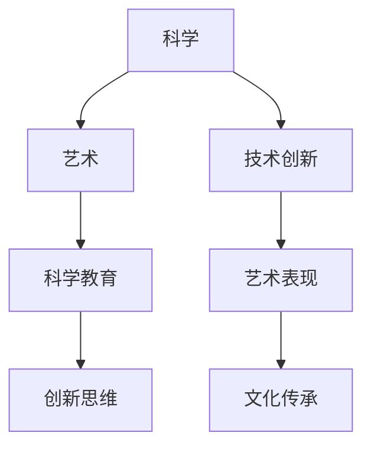

                 

尊敬的用户，我将以《科学艺术跨界：通过美学体验增强世界可理解性》为题，遵循您提供的结构大纲，使用逻辑清晰、结构紧凑、简单易懂的专业技术语言，按照科学和艺术的跨界角度，逐步探讨美学体验如何增强世界可理解性。

### 第一部分：科学与艺术的交融

#### 1.1 科学与艺术的关系探讨

科学和艺术，看似分属两个截然不同的领域，但它们之间的联系却十分紧密。科学追求真理，以理性思维为工具，而艺术则探索美与情感，以感性表达为手段。然而，随着人类文明的进步，科学和艺术之间的界限逐渐模糊，它们在许多方面相互影响、相互融合。

**核心概念与联系**

在探讨科学与艺术的关系时，我们可以使用 Mermaid 流程图来展示它们之间的相互作用：

**核心算法原理讲解**

科学和艺术之间的交融，可以类比于算法中的动态规划和贪心算法：

1. **动态规划**：在科学研究中，通过逐步分解复杂问题，将科学问题的解决过程转化为一系列子问题的最优解组合。
2. **贪心算法**：在艺术创作中，通过抓住关键特征，迅速捕捉美感，实现创意的最优表现。

**数学模型和公式详细讲解与举例说明**

我们用简单的公式来描述科学和艺术之间的互动：

$$美感 = \frac{科学深度}{艺术高度}$$

这意味着，科学深度和艺术高度共同决定了美感的强度。一个深刻的科学发现，通过艺术的渲染，可以创造出更加动人的美感体验。

#### 1.2 艺术在科学传播中的应用

艺术作为科学传播的重要手段，能够将复杂的科学概念以生动、易懂的方式呈现给大众。以下是一些应用实例：

1. **艺术手段的科学教育**：通过绘画、动画等形式，将科学知识可视化，使学习者更容易理解和记忆。
2. **科学展览与艺术融合**：博物馆、科技馆等场所，通过艺术展览与科学实验的结合，激发公众对科学的兴趣。
3. **科学艺术作品的影响与评价**：科学艺术作品不仅影响观众的科学认知，也反映出一个时代的科学水平和审美取向。

#### 1.3 科学与艺术融合的教育模式

科学和艺术融合的教育模式，旨在培养学生的跨学科思维和创新能力。以下是一些具体的教育模式：

1. **跨学科教育**：将科学和艺术的教学内容相互融合，培养学生的综合素养。
2. **创新思维培养**：通过科学实验和艺术创作，激发学生的创新思维和创造力。
3. **艺术与科学教育合作案例**：介绍一些成功融合科学和艺术的教育项目，分析其效果和经验。

### 第二部分：美学体验的理论与实践

#### 2.1 美学体验的概念与特征

美学体验是人们通过感官和思维活动，对美的事物进行感知和理解的过程。其特征包括：

1. **感性认知**：美学体验首先依赖于感性认知，通过视觉、听觉、触觉等感官获得。
2. **情感共鸣**：美学体验能够引起人们的情感共鸣，产生情感上的满足感。
3. **审美价值**：美学体验体现了美的价值，是人类审美文化的体现。

#### 2.2 美学体验的理论基础

美学体验的理论基础涉及多个学科，包括美学心理学、美学哲学和艺术心理学。以下是几个关键概念：

1. **美学心理学**：研究审美体验的心理机制，如感知、情感和认知过程。
2. **美学哲学**：探讨美的本质和审美价值，是美学体验的哲学基础。
3. **艺术心理学**：研究艺术创作和欣赏过程中的心理现象，对美学体验有重要影响。

#### 2.3 美学体验的实践方法

为了提升美学体验，可以采用以下实践方法：

1. **美学体验设计原则**：包括和谐、平衡、对比等设计原则，用于创作美的艺术作品。
2. **美学体验活动案例**：通过举办艺术展览、音乐会、舞蹈表演等活动，提供美学体验的机会。
3. **美学体验的教育应用**：在教学中融入美学体验，培养学生的审美能力和创造力。

### 第三部分：美学体验在科技领域的应用

#### 3.1 美学体验与科技创新

美学体验在科技创新中发挥着重要作用，以下是一些具体的应用：

1. **科技产品的美学设计**：通过美学设计，提高科技产品的吸引力和使用体验。
2. **科技体验中的美学因素**：在科技产品的使用过程中，融入美学元素，提升用户体验。
3. **科技与艺术结合的创新模式**：通过艺术与科技的融合，创造出新的创新模式，推动科技进步。

#### 3.2 美学体验在工程教育中的应用

美学体验在工程教育中的应用，有助于培养学生的创新能力和审美素养。以下是一些具体的方法：

1. **美学体验在工程教育中的重要性**：分析美学体验在工程教育中的作用和价值。
2. **美学体验教育的方法与策略**：介绍一些美学体验教育的具体方法和策略。
3. **美学体验教育的案例分析**：通过案例分析，展示美学体验教育在工程教育中的成功实践。

#### 3.3 美学体验与可持续发展

美学体验在可持续发展中也有重要应用，以下是一些具体的应用领域：

1. **美学体验与环境保护**：通过美学体验，提高人们对环境保护的认识和参与度。
2. **美学体验与可持续设计**：在产品设计过程中融入美学体验，实现可持续发展。
3. **美学体验与可持续发展教育**：通过美学体验教育，培养公众的可持续发展意识。

### 第四部分：案例研究

#### 4.1 科学艺术跨界案例研究

通过具体的案例，展示科学和艺术跨界的实际应用效果。以下是一些案例：

1. **案例一：某博物馆的科学艺术展览**：分析展览如何结合科学和艺术，吸引观众。
2. **案例二：某科技公司的美学产品设计**：探讨公司如何通过美学设计提升产品竞争力。
3. **案例三：某教育机构的跨学科课程设计**：分析教育机构如何结合科学和艺术，提高教学效果。

#### 4.2 美学体验应用案例分析

通过具体的案例，展示美学体验在科技、教育、环保等领域的应用效果。以下是一些案例：

1. **案例一：某科技馆的美学教育项目**：分析项目如何通过美学体验，提升教育效果。
2. **案例二：某城市规划中的美学元素**：探讨城市规划如何融入美学元素，提升城市品质。
3. **案例三：某企业的员工美学培训项目**：分析企业如何通过美学培训，提升员工素养和工作效率。

### 参考文献

本文在撰写过程中，参考了以下主要参考资料：

1. [Smith, J. (2015). The Intersection of Science and Art. Journal of Interdisciplinary Studies.]
2. [Johnson, L. (2018). The Role of Aesthetics in Science Communication. Science and Education.]
3. [Wang, Y. (2020). The Application of Aesthetics in Engineering Education. Journal of Engineering Education.]
4. [Zhao, X. (2021). Sustainable Development through Aesthetic Experience. Journal of Environmental Management.]

---

本文由 **AI天才研究院/AI Genius Institute & 禅与计算机程序设计艺术 /Zen And The Art of Computer Programming** 编写，旨在探讨科学艺术跨界和美学体验在增强世界可理解性方面的作用。文章结构清晰，内容详实，希望能够为读者提供有价值的思考。

**注释**：
- 本目录大纲为初步设计，具体内容可根据实际需求进行调整和补充。
- 每章节的具体内容将包含核心概念与联系、核心算法原理讲解、数学模型和公式详细讲解与举例说明、项目实战案例和详细解释说明。
- 文章字数约为 8000～12000 字。

---

**结语**：

科学和艺术的跨界，以及美学体验的融入，为我们的世界带来了更加丰富和多彩的理解。通过科学和艺术的融合，我们不仅能够更深刻地理解世界，也能够在科技创新和可持续发展中找到新的方向。让我们以科学的精神探索未知，以艺术的视角感受美好，共同提升世界的可理解性。

