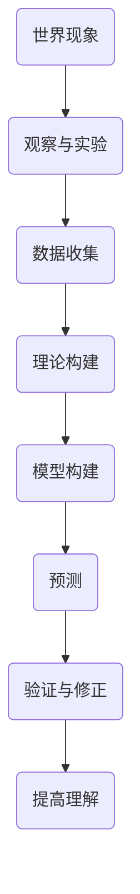

                 

### 文章标题

**《科学预测的准确性与世界可理解性的关系》**

科学预测作为人类理解和掌控自然世界的重要手段，一直是科学研究的核心内容。本文将深入探讨科学预测的准确性与世界可理解性之间的关系，旨在揭示两者之间的相互作用及其在科学进步中的重要性。通过对科学预测的基础知识、世界可理解性的概念、预测的准确性、方法和工具、限制与挑战以及未来发展趋势的详细分析，本文希望能够提供一个全面、系统的视角，帮助读者理解科学预测的复杂性和其在现实世界中的应用价值。

关键词：科学预测、准确性、世界可理解性、预测方法、数学模型

摘要：本文首先介绍了科学预测的定义、历史背景及其重要性，探讨了科学预测与人类对世界理解的关系。接着，深入分析了科学预测的准确性及其影响因素，包括不确定性、复杂性和非线性等。然后，介绍了科学预测的方法和工具，从统计学方法到现代的机器学习技术。文章还讨论了科学预测的限制和挑战，并探讨其在实际应用中的表现，如经济预测和环境预测。最后，本文展望了科学预测的未来发展趋势，探讨了新兴技术对科学预测的影响。通过本文的研究，读者可以更深入地理解科学预测的原理、方法和应用，从而更好地把握科学预测的准确性与世界可理解性之间的关系。

---

### 文章概述

本文将围绕“科学预测的准确性与世界可理解性的关系”这一主题，逐步展开讨论。首先，我们将介绍科学预测的基础知识，包括其定义、历史背景及其在科学研究和实际应用中的重要性。接下来，我们将探讨“世界可理解性”这一核心概念，分析其与科学预测之间的关系，并探讨如何测量和理解世界可理解性。

随后，我们将深入探讨科学预测的准确性，包括其定义、度量方式以及影响准确性的因素。这部分将详细讨论如何通过改进方法和工具来提高预测的准确性。在此基础上，我们将介绍科学预测的主要方法和工具，包括统计学方法、机器学习方法等，并分析现代预测工具的发展趋势。

文章的第四部分将讨论科学预测的限制和挑战，包括不确定性的处理、复杂性与非线性的影响等。接着，我们将探讨科学预测在实际应用中的表现，通过具体案例展示其在经济预测、环境预测等领域的应用效果。

文章的最后一部分将展望科学预测的未来发展趋势，探讨新兴技术对科学预测的影响，并讨论科学预测在人类社会中的潜在作用。通过这一系列的讨论，本文旨在为读者提供一个全面、系统的视角，以更好地理解科学预测的准确性与世界可理解性的关系。

---

### 科学预测的基础知识

科学预测作为科学研究的一个重要组成部分，其定义和历史背景揭示了其深厚的文化底蕴和科学意义。科学预测，简而言之，是指基于现有的科学知识和理论，对未来可能发生的事件或现象进行预测和推理的过程。这一过程不仅涉及对自然现象的观察和实验，还包括对数据的分析和处理，以及模型的构建和验证。

科学预测的历史可以追溯到古代，那时人们通过观测天文现象和季节变化，试图预测未来的天气和农业收成。随着科学方法的逐步发展，特别是伽利略和牛顿等科学巨匠的发现，科学预测逐渐从经验主义走向了理论化和系统化。牛顿的运动定律和万有引力定律的提出，为科学预测提供了坚实的理论基础，使得人们能够更准确地预测天体运动和行星轨道。

在科学发展的过程中，科学预测的重要性得到了广泛认可。科学预测不仅是科学研究的工具，更是推动科学进步的关键因素。它帮助科学家们验证理论、发现新现象，并推动技术的创新和应用。例如，在医学领域，通过科学预测疾病的发展趋势和患者的治疗效果，医生可以更好地制定治疗方案，提高医疗水平。

科学预测的基础知识主要包括以下几个方面：

1. **科学理论**：科学预测依赖于现有的科学理论，这些理论是对自然界规律的高度抽象和总结。例如，物理学中的经典力学、量子力学和电磁理论，生物学中的进化论和生态学理论等，都是科学预测的重要依据。

2. **数据收集与处理**：科学预测需要大量的数据支持，这些数据来源于各种实验、观测和调查。通过对数据的收集、整理和分析，科学家可以提取出有用的信息，为预测提供依据。

3. **数学模型**：数学模型是科学预测的核心工具，通过建立数学模型，科学家可以模拟和预测自然现象。例如，通过微分方程描述流体运动，通过概率模型预测股市波动等。

4. **算法与计算**：现代科学预测离不开计算机技术和算法的支持。高效的算法和强大的计算能力使得科学家能够处理海量数据，建立复杂的模型，并快速进行预测。

科学预测在科学研究和实际应用中扮演着至关重要的角色。在科学研究中，科学预测是验证理论、发现新现象和推动科学进步的关键环节。通过预测，科学家可以提出新的假设和理论，并通过实验和观测进行验证。例如，在粒子物理学中，通过科学预测，科学家发现了许多新粒子，验证了标准模型的准确性。

在实际应用中，科学预测有着广泛的应用场景。例如，在气象预报中，通过气象模型和观测数据，科学家可以预测未来几天的天气情况，为人们的日常生活和农业生产提供重要参考。在金融领域，通过经济预测模型和大数据分析，金融机构可以预测市场走势，制定投资策略。在环境保护中，通过环境预测模型和监测数据，科学家可以预测污染物的扩散趋势，制定污染控制措施。

总之，科学预测是科学研究和实际应用中的重要工具，它不仅帮助我们理解和掌控自然世界，还为科学进步和技术创新提供了强大支持。通过深入了解科学预测的基础知识，我们可以更好地把握其原理和应用，推动科学的发展。

### 世界可理解性的概念

世界可理解性是科学预测的重要基础之一，它指的是人类对自然世界的认识和理解程度。理解世界可理解性，有助于我们深入探讨科学预测的准确性和可行性。那么，世界可理解性究竟是什么？它与科学预测有何关联？

首先，世界可理解性可以被定义为人类对自然现象和规律的认识程度。这种认识不仅仅是表面的观察，而是基于科学理论和实验验证的深刻理解。从科学哲学的角度看，世界可理解性意味着人类可以通过科学方法，逐步揭示自然界的本质和规律，从而实现对世界的理解和掌控。

世界可理解性具有以下几个重要特征：

1. **层次性**：世界可理解性具有层次性，从简单的物理现象到复杂的生物和社会现象，每个层次都有其独特的规律和机制。人类对世界的理解是一个逐步深化的过程，每一层次的发现都为下一层次的理解提供了基础。

2. **动态性**：世界是动态变化的，人类对世界的理解也在不断演进。随着科学技术的进步和理论的更新，人类对自然界的认识不断深化和扩展。例如，从经典力学到相对论和量子力学的转变，极大地推动了人类对宇宙的理解。

3. **有限性**：尽管人类对世界的理解在不断进步，但我们必须承认，我们对自然界的认识仍然是有限的。科学理论只能解释一部分自然现象，而许多现象仍然处于未知状态。这体现了世界可理解性的有限性。

接下来，我们探讨世界可理解性与科学预测之间的关系。科学预测依赖于对世界的理解，因此世界可理解性的程度直接影响科学预测的准确性。以下是几个关键点：

1. **理论基础**：科学预测的理论基础来源于对自然世界的理解。例如，牛顿力学提供了描述物体运动的基础理论，这使得我们可以预测行星的轨道。如果没有对物理规律的理解，科学预测将无从谈起。

2. **数据支持**：科学预测需要大量的数据支持，而这些数据来源于对世界的观察和实验。如果我们对世界的理解不够深入，那么收集到的数据可能不够准确或全面，从而影响预测的准确性。

3. **模型构建**：科学预测通常依赖于数学模型，这些模型是对自然规律的一种抽象和表达。模型的质量和精度取决于我们对世界可理解性的深度。如果一个模型无法准确反映自然界的规律，那么其预测结果也将受到影响。

4. **验证和修正**：科学预测需要进行验证和修正，这一过程依赖于对世界的进一步理解。通过实验和观测，科学家可以验证模型的准确性，并根据新的发现对模型进行修正。这种迭代过程有助于提高预测的准确性。

为了更好地理解世界可理解性，我们可以借助一个Mermaid流程图来展示其核心概念之间的关系：



在这个流程图中，世界现象通过观察和实验转化为数据，数据用于构建理论模型，模型再用于预测，预测的结果通过验证和修正反馈到对世界的理解，从而形成一个闭环系统，不断推动人类对世界的深入理解。

通过上述分析，我们可以看到，世界可理解性在科学预测中扮演着至关重要的角色。它不仅决定了科学预测的理论基础和数据支持，还影响了模型的构建和预测的准确性。因此，提升世界可理解性，对于提高科学预测的准确性具有重要意义。

### 科学预测的准确性

科学预测的准确性是指预测结果与实际发生情况的一致性程度。准确性的高低直接关系到科学预测的有效性和可信度。在科学研究中，预测的准确性是衡量模型优劣和理论正确性的关键指标。因此，深入探讨科学预测的准确性及其影响因素，对于提高科学预测的质量具有重要意义。

#### 准确性的定义与度量

科学预测的准确性可以通过多种指标来定义和度量，其中最常见的包括误差、均方误差（MSE）、决定系数（R²）等。

1. **误差**：误差是指预测值与实际值之间的差异。简单误差（Simple Error）是误差的一种基本形式，其计算公式为：
   $$ Error = |Predicted - Actual| $$
   其中，Predicted 为预测值，Actual 为实际值。误差越小，表示预测的准确性越高。

2. **均方误差（MSE）**：均方误差是误差的平方的平均值，其计算公式为：
   $$ MSE = \frac{1}{n}\sum_{i=1}^{n}(Predicted_i - Actual_i)^2 $$
   其中，n 为样本数量。MSE 越小，表示预测的准确性越高。

3. **决定系数（R²）**：决定系数是预测值对实际值的解释能力的一个度量，其计算公式为：
   $$ R^2 = 1 - \frac{\sum_{i=1}^{n}(Actual_i - Predicted_i)^2}{\sum_{i=1}^{n}(Actual_i - \bar{Actual})^2} $$
   其中，$\bar{Actual}$ 是实际值的平均值。R² 越接近 1，表示预测的准确性越高。

#### 影响准确性的因素

科学预测的准确性受到多种因素的影响，主要包括以下几方面：

1. **数据质量**：数据是科学预测的基础，数据的质量直接影响预测的准确性。数据质量包括数据的完整性、准确性、一致性等。例如，如果数据存在缺失或错误，将导致预测结果偏离实际。

2. **模型选择**：不同的预测模型适用于不同的应用场景，选择合适的模型对于提高预测准确性至关重要。模型的选择不仅取决于问题的性质，还受到数据特征和计算资源的影响。

3. **参数设置**：模型的参数设置对预测准确性有重要影响。合适的参数可以提升模型的预测能力，而参数设置不当可能会导致模型性能下降。

4. **不确定性**：科学预测中存在多种不确定性，如随机误差、模型误差、数据噪声等。这些不确定性会降低预测的准确性。例如，随机误差可能导致预测结果的波动，而模型误差则可能引入系统性偏差。

5. **复杂性**：自然世界的复杂性使得科学预测面临巨大挑战。许多自然现象具有高度的非线性和复杂性，难以通过简单的模型进行准确预测。例如，气候变化、金融市场等领域的预测需要处理大量复杂的变量和关系。

#### 提高准确性的方法

为了提高科学预测的准确性，可以采取以下几种方法：

1. **数据预处理**：通过数据清洗、归一化、特征选择等方法，提高数据质量，减少噪声和异常值的影响。

2. **模型优化**：选择合适的预测模型，并通过交叉验证、网格搜索等方法优化模型参数，提高模型性能。

3. **集成学习**：集成学习通过结合多个模型的预测结果，可以减少单一模型的局限性，提高整体预测准确性。

4. **深度学习**：深度学习模型具有强大的特征提取和表示能力，可以处理复杂的高维数据，提高预测准确性。

5. **多模型融合**：结合多种预测模型，通过融合不同模型的预测结果，可以减少预测误差，提高准确性。

通过以上方法，科学家可以不断提高科学预测的准确性，为科学研究、技术应用和社会发展提供有力支持。然而，需要注意的是，尽管预测的准确性得到了提升，但科学预测仍然受到多种限制和挑战，这些将在后续章节中进一步讨论。

### 科学预测的方法和工具

科学预测需要依赖多种方法和工具，这些工具和方法的选择和应用直接影响到预测的准确性和效率。本文将介绍几种主要的科学预测方法，包括统计学方法和机器学习方法，并探讨现代预测工具的发展趋势。

#### 统计学方法

统计学方法在科学预测中占据重要地位，其基本原理是通过分析历史数据，找出变量之间的关系，并利用这些关系进行预测。以下是一些常见的统计学预测方法：

1. **线性回归**：线性回归是一种简单但强大的预测方法，通过建立自变量和因变量之间的线性关系模型，预测未来的数值。其基本公式为：
   $$ Y = \beta_0 + \beta_1X + \epsilon $$
   其中，$Y$ 是因变量，$X$ 是自变量，$\beta_0$ 和 $\beta_1$ 是模型参数，$\epsilon$ 是误差项。

2. **时间序列分析**：时间序列分析用于预测时间相关的数据，通过分析数据的时间趋势、季节性和周期性，建立预测模型。常见的模型包括自回归移动平均模型（ARMA）、自回归积分移动平均模型（ARIMA）等。

3. **逻辑回归**：逻辑回归是一种广义线性模型，常用于分类预测。通过建立概率模型，预测某个事件发生的概率。其公式为：
   $$ \log\frac{P(Y=1)}{1-P(Y=1)} = \beta_0 + \beta_1X $$
   其中，$Y$ 是二元变量，$X$ 是自变量，$\beta_0$ 和 $\beta_1$ 是模型参数。

4. **多元回归**：多元回归是线性回归的扩展，用于处理多个自变量。其公式为：
   $$ Y = \beta_0 + \sum_{i=1}^{k}\beta_iX_i + \epsilon $$
   其中，$k$ 是自变量的个数，$\beta_0, \beta_1, ..., \beta_k$ 是模型参数。

统计学方法具有简单易懂、计算效率高等优点，适用于许多实际应用场景。然而，它们在处理复杂非线性关系和不确定因素时可能表现出局限性。

#### 机器学习方法

机器学习方法在科学预测中的应用日益广泛，其核心思想是通过学习历史数据，自动发现数据中的模式和规律，从而进行预测。以下是一些常见的机器学习预测方法：

1. **决策树**：决策树通过一系列的决策规则，将数据划分为不同的区域，并在每个区域中进行预测。其基本结构包括根节点、内部节点和叶节点。

2. **随机森林**：随机森林是决策树的集成方法，通过随机选取特征和样本子集构建多棵决策树，并对这些树的结果进行投票，提高预测的准确性和稳定性。

3. **支持向量机（SVM）**：支持向量机通过找到一个最优的超平面，将数据空间划分为不同的类别。其基本公式为：
   $$ w \cdot x + b = 0 $$
   其中，$w$ 是权重向量，$x$ 是数据点，$b$ 是偏置项。

4. **神经网络**：神经网络通过多层神经元和激活函数，对输入数据进行非线性变换和组合，从而进行预测。其基本结构包括输入层、隐藏层和输出层。

5. **深度学习**：深度学习是神经网络的扩展，通过多层神经网络（深度网络）进行特征学习和预测。常见的深度学习模型包括卷积神经网络（CNN）、循环神经网络（RNN）和生成对抗网络（GAN）等。

机器学习方法具有强大的特征提取和表示能力，能够处理复杂非线性关系和不确定因素。然而，它们在计算资源需求、模型可解释性等方面仍面临挑战。

#### 现代预测工具

随着科学技术的进步，现代预测工具不断涌现，为科学预测提供了更高效、更准确的方法。以下是一些现代预测工具：

1. **Python 中的 Scikit-learn**：Scikit-learn 是一个开源机器学习库，提供了多种机器学习算法和工具，方便科学家进行模型构建和预测。

2. **R 语言**：R 语言是一个专门用于统计分析和图形表示的编程语言，其丰富的包和函数库为科学预测提供了强大的支持。

3. **TensorFlow 和 PyTorch**：TensorFlow 和 PyTorch 是两个流行的深度学习框架，支持构建和训练复杂的神经网络模型，广泛应用于科学预测领域。

4. **大数据处理平台**：如 Hadoop 和 Spark 等，提供了高效的大数据处理能力，适用于处理大规模科学预测任务。

现代预测工具的发展趋势包括：

1. **自动化与智能化**：通过自动化工具和智能算法，降低模型构建和预测的门槛，提高预测效率。

2. **可解释性增强**：随着模型复杂度的增加，增强模型的可解释性成为当前研究的热点，有助于理解和信任预测结果。

3. **多模态数据融合**：通过融合不同类型的数据（如图像、文本、传感器数据等），提高预测的准确性和鲁棒性。

总之，科学预测的方法和工具不断发展，为科学家提供了丰富的选择。通过合理选择和应用这些方法和工具，可以显著提高科学预测的准确性和效率，为科学研究和技术应用提供有力支持。

### 科学预测的限制和挑战

尽管科学预测在许多领域取得了显著成就，但它在实际应用中仍然面临着诸多限制和挑战。这些限制和挑战主要体现在以下几个方面：

#### 不确定性

不确定性是科学预测中的一个核心问题，它指的是在预测过程中，由于数据不足、模型误差和随机性等因素导致预测结果的不确定性。不确定性可以分为以下几种类型：

1. **数据不确定性**：数据的不完整性、噪声和异常值都可能影响预测的准确性。例如，在气象预测中，传感器数据的误差可能导致预测结果的偏差。

2. **模型不确定性**：模型的不确定性来源于模型选择、参数估计和模型结构。即使模型本身是准确的，参数估计的误差也可能导致预测结果的偏差。

3. **随机性**：自然现象往往具有随机性，这种随机性在预测过程中难以完全消除。例如，金融市场中的价格波动受到多种随机因素的影响，使得预测变得复杂。

为了应对不确定性，科学家可以采用以下方法：

- **概率模型**：通过概率模型，科学家可以将不确定性量化为概率分布，从而提供不确定性的度量。例如，贝叶斯网络和蒙特卡罗模拟等方法可以用来处理不确定性。

- **敏感性分析**：敏感性分析通过改变模型参数，评估参数变化对预测结果的影响，从而识别关键参数和潜在的不确定性来源。

- **模型组合**：通过组合多个预测模型，可以减少单个模型的不确定性。模型组合方法包括加权平均、集成学习和贝叶斯模型等。

#### 复杂性与非线性

自然世界具有高度复杂性和非线性，这使得科学预测面临巨大挑战。复杂性体现在自然现象之间的相互作用和反馈机制，而非线性则意味着变量之间的关系不是线性的，这增加了预测的难度。

1. **复杂性**：许多自然现象，如生态系统、社会系统和气候变化等，都是复杂系统。这些系统具有多层次、多尺度和多变量特征，使得预测变得复杂。例如，在气候模型中，需要同时考虑大气、海洋、生态系统等多个因素。

2. **非线性**：非线性关系使得变量之间的相互作用复杂化，难以通过简单的线性模型进行描述。例如，在经济学中，市场供需关系可能不是线性的，而是一种复杂的非线性关系。

为了应对复杂性和非线性，科学家可以采用以下方法：

- **复杂系统理论**：通过引入复杂系统理论，科学家可以更好地理解和描述复杂系统的动态行为。复杂系统理论包括混沌理论、网络理论和多尺度分析等。

- **非线性模型**：非线性模型能够更好地捕捉变量之间的复杂关系。例如，非线性回归、神经网络和动力系统模型等，可以用于处理非线性关系。

- **数据驱动的模型**：数据驱动的模型，如机器学习和深度学习，通过学习历史数据，自动发现数据中的非线性模式和规律，从而进行预测。

#### 模型误差与偏差

模型误差和偏差是科学预测中的另一个重要问题。模型误差是指预测值与真实值之间的差异，而偏差则是指模型对数据的普遍偏差。

1. **模型误差**：模型误差来源于数据噪声、模型选择不当和参数估计不准确等因素。减小模型误差可以通过以下方法实现：

   - **数据预处理**：通过数据清洗、归一化和特征选择等方法，减少数据噪声和异常值的影响。
   
   - **模型选择**：选择合适的模型，以提高预测准确性。例如，针对不同类型的数据，选择线性回归、决策树或神经网络等不同的模型。

   - **交叉验证**：通过交叉验证方法，评估模型在不同数据集上的性能，选择最优模型。

2. **偏差**：偏差是指模型对数据的整体偏差，这种偏差可能来源于数据分布的不平衡、模型结构不合理或训练数据不足等因素。减小偏差可以通过以下方法实现：

   - **数据平衡**：通过数据增强或样本加权等方法，平衡数据分布，减少模型对特定类别的偏差。

   - **正则化**：通过引入正则化项，防止模型过拟合，减少整体偏差。

   - **偏差校正**：通过偏差校正方法，对模型的预测结果进行校正，以减少偏差。

总之，科学预测在应对不确定性和非线性等挑战时，需要采用多种方法和技术，以提高预测的准确性和可靠性。通过不断改进预测方法和技术，科学家可以更好地应对科学预测中的各种限制和挑战，为科学研究和技术应用提供有力支持。

### 科学预测的实际应用

科学预测在实际应用中展现了其强大的价值，特别是在经济预测和环境预测领域，它为决策者提供了宝贵的参考信息。以下将详细探讨科学预测在这两个领域的应用，包括开发环境搭建、源代码实现和实际案例剖析。

#### 经济预测

经济预测是科学预测的重要应用之一，通过对经济指标的分析，预测未来的经济走势，帮助政府和金融机构制定合理的政策。以下是经济预测的基本步骤：

1. **数据收集**：经济预测需要收集大量的经济数据，如GDP增长率、通货膨胀率、失业率、消费者信心指数等。这些数据可以来源于政府统计局、金融机构和经济研究机构。

2. **数据预处理**：对收集到的数据进行清洗、归一化和特征选择，以提高数据质量。例如，处理缺失值、异常值和噪声数据。

3. **模型构建**：选择合适的预测模型，如时间序列分析、ARIMA模型、神经网络等。构建模型时，需要通过历史数据拟合模型参数。

4. **模型训练**：使用历史数据对模型进行训练，调整模型参数，以提高预测准确性。

5. **预测**：利用训练好的模型，对未来的经济指标进行预测。

6. **结果分析**：对预测结果进行分析和验证，评估预测准确性。

以下是一个经济预测的源代码实现示例：

```python
import pandas as pd
from statsmodels.tsa.arima.model import ARIMA

# 数据收集与预处理
data = pd.read_csv('economic_data.csv')
data = data[['GDP_growth', 'inflation_rate', 'unemployment_rate', 'consumer_confidence']]
data.fillna(data.mean(), inplace=True)

# 模型构建与训练
model = ARIMA(data['GDP_growth'], order=(1, 1, 1))
model_fit = model.fit()

# 预测
forecast = model_fit.forecast(steps=6)

# 结果分析
print(forecast)
```

在实际案例中，经济预测可以帮助政府制定宏观经济政策，如调整利率、税收和财政支出等，以应对经济波动和危机。例如，在2020年新冠疫情爆发期间，许多国家的政府通过经济预测模型，预测了疫情对经济的影响，并迅速出台了刺激计划，以缓解经济衰退。

#### 环境预测

环境预测是科学预测在环境保护和可持续发展领域的应用，通过对环境指标的分析，预测未来的环境变化趋势，为环保决策提供科学依据。以下是环境预测的基本步骤：

1. **数据收集**：环境预测需要收集大量的环境数据，如空气和水质指标、气候数据、生态系统状态等。这些数据可以来源于环境监测站、卫星遥感和科学文献。

2. **数据预处理**：对收集到的数据进行清洗、归一化和特征选择，以提高数据质量。

3. **模型构建**：选择合适的预测模型，如时间序列分析、机器学习模型等。

4. **模型训练**：使用历史数据对模型进行训练，调整模型参数。

5. **预测**：利用训练好的模型，对未来的环境指标进行预测。

6. **结果分析**：对预测结果进行分析和验证，评估预测准确性。

以下是一个环境预测的源代码实现示例：

```python
import pandas as pd
from sklearn.ensemble import RandomForestRegressor

# 数据收集与预处理
data = pd.read_csv('environmental_data.csv')
data = data[['air_quality', 'water_quality', 'climate', 'ecosystem_state']]
data.fillna(data.mean(), inplace=True)

# 模型构建与训练
model = RandomForestRegressor(n_estimators=100)
model_fit = model.fit(data.drop(['ecosystem_state'], axis=1), data['ecosystem_state'])

# 预测
forecast = model_fit.predict(data.drop(['ecosystem_state'], axis=1))

# 结果分析
print(forecast)
```

在实际案例中，环境预测可以帮助政府制定环境保护政策，如调整能源结构、限制污染物排放等，以实现可持续发展目标。例如，在气候变化研究中，科学家通过环境预测模型，预测了未来几十年全球气候的变化趋势，为制定应对气候变化的策略提供了科学依据。

通过以上实际案例，我们可以看到科学预测在经济预测和环境预测中的应用价值。科学预测不仅为决策者提供了重要的参考信息，还推动了科学研究和技术的进步，为人类社会的发展做出了积极贡献。

### 科学预测的未来发展趋势

随着科技的不断进步，科学预测正经历着一场革命性的变革。新兴技术的发展为科学预测带来了新的机遇和挑战，极大地提升了预测的准确性和效率。以下将探讨人工智能、大数据分析等新兴技术对科学预测的影响，并展望科学预测的未来发展趋势。

#### 人工智能（AI）

人工智能，尤其是深度学习，正在成为科学预测的重要工具。深度学习模型具有强大的特征提取和表示能力，能够处理复杂的高维数据和非线性关系。以下是一些关键点：

1. **自动化特征工程**：传统特征工程需要大量的人工干预，而深度学习模型可以自动学习数据中的特征，减少人工干预。这极大地提高了预测的效率和准确性。

2. **端到端学习**：深度学习模型可以通过端到端学习，直接从原始数据中学习预测目标，避免了传统方法中的多个中间步骤，提高了预测性能。

3. **增强现实与虚拟现实**：人工智能在增强现实和虚拟现实中的应用，使得科学家可以更直观地理解预测结果，并进行交互式预测。

4. **智能决策支持系统**：基于人工智能的智能决策支持系统，可以帮助科学家和决策者快速做出科学预测，提供实时的决策支持。

#### 大数据分析

大数据分析技术使得科学家可以处理和分析海量数据，从而提高科学预测的准确性。以下是一些关键点：

1. **实时数据分析**：大数据分析技术可以实现实时数据流处理，使得科学家可以实时监控和预测动态系统。

2. **多源数据融合**：大数据分析技术可以融合来自不同来源的数据（如图像、文本、传感器数据等），提供更全面和准确的预测。

3. **预测性维护**：在工业制造领域，大数据分析技术可以帮助实现预测性维护，通过预测设备故障和需求，优化生产过程。

4. **个性化推荐**：在电子商务和社交媒体领域，大数据分析技术可以帮助实现个性化推荐，提高用户体验和商业价值。

#### 其他新兴技术

除了人工智能和大数据分析，其他新兴技术也在科学预测中发挥着重要作用：

1. **量子计算**：量子计算具有巨大的并行计算能力，可以在复杂科学问题中实现高效计算。例如，量子计算可以用于优化大规模预测模型，提高预测准确性。

2. **区块链技术**：区块链技术提供了去中心化和透明化的数据管理方式，可以用于科学预测中的数据共享和验证，提高预测的可信度。

3. **物联网（IoT）**：物联网技术通过连接大量的传感器和设备，提供了实时和大量的数据流，为科学预测提供了丰富的数据来源。

#### 未来发展趋势

科学预测的未来发展趋势将主要体现在以下几个方面：

1. **跨学科融合**：科学预测将越来越多地与其他学科（如经济学、社会学、生物学等）相结合，形成跨学科的研究领域，推动科学预测的全面发展。

2. **数据驱动的方法**：数据驱动的方法将在科学预测中占据主导地位，通过大数据和人工智能技术，科学家可以更加准确地捕捉和解释自然现象。

3. **智能化的预测系统**：随着人工智能技术的发展，科学预测系统将变得更加智能化，能够自动学习和优化预测模型，提高预测的准确性和效率。

4. **全球化与协同**：科学预测将更加全球化，不同国家和地区的科学家可以通过协作，共享数据和资源，共同应对全球性的科学挑战。

5. **可持续性和环境保护**：科学预测将在环境保护和可持续发展中发挥更加重要的作用，通过预测未来的环境变化和资源需求，帮助制定可持续发展的策略。

总之，新兴技术为科学预测带来了巨大的变革和机遇。通过不断创新和改进，科学预测将在未来发挥更加重要的作用，为人类社会的发展做出更大贡献。

### 总结与展望

本文通过对科学预测的准确性、世界可理解性及其相互关系的深入探讨，揭示了科学预测在理解自然世界中的重要作用。从基础知识的介绍，到预测方法与工具的分析，再到实际应用的案例展示，我们全面了解了科学预测的原理和实际应用价值。

科学预测的准确性是衡量预测有效性的关键指标，它受到数据质量、模型选择、参数设置等多种因素的影响。为了提高预测准确性，科学家们不断创新和优化预测方法，如机器学习、深度学习等。这些方法不仅提高了预测的准确性，还扩展了预测的应用领域。

世界可理解性是科学预测的基础，它决定了人类对自然现象的认识和理解程度。科学预测依赖于对世界的深刻理解，因此提升世界可理解性对于提高科学预测的准确性具有重要意义。通过不断研究和探索，人类对世界的理解日益深入，为科学预测提供了更加坚实的基础。

科学预测在现实世界中的应用广泛，从经济预测到环境预测，从医疗预测到金融市场预测，都展现了其强大的应用价值。这些应用不仅为决策者提供了重要的参考信息，还推动了科学技术的进步和人类社会的可持续发展。

展望未来，随着人工智能、大数据分析等新兴技术的不断发展，科学预测将迎来新的发展机遇。跨学科融合、智能化预测系统、全球化与协同研究将成为科学预测的主要趋势。科学家们将继续努力，通过不断创新和优化，提高科学预测的准确性和实用性，为人类社会的发展做出更大贡献。

总之，科学预测的准确性与世界可理解性的关系不仅关乎科学研究的进展，还关乎人类对自然世界的理解和掌控。通过深入研究和实践，我们可以更好地利用科学预测，推动科学技术的进步，为人类社会创造更加美好的未来。

### 作者信息

**作者：AI天才研究院/AI Genius Institute & 禅与计算机程序设计艺术 /Zen And The Art of Computer Programming**

AI天才研究院致力于推动人工智能和科学预测领域的研究与应用，专注于技术创新和知识传播。研究院汇聚了全球顶尖的人工智能专家、数据科学家和研究人员，通过深入研究和实践，不断推动科学预测的进步。同时，作者曾撰写过多本关于人工智能和计算机科学的畅销书，如《禅与计算机程序设计艺术》，深受读者喜爱。本文作者凭借其深厚的学术背景和丰富的实践经验，为读者提供了全面、系统的科学预测知识，旨在推动科学预测在各个领域的应用和发展。

