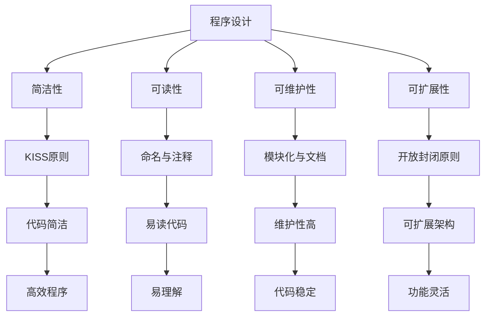
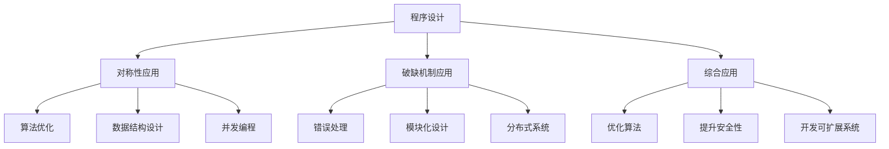

                 

### 程序设计原则

在计算机科学中，程序设计原则是构建高质量软件系统的基石。一个好的程序不仅能够实现所需功能，还要具有良好的可读性、可维护性和可扩展性。以下是几个核心的编程原则，它们将帮助我们写出高效、可靠和易于维护的代码。

#### 2.1 程序设计的概念

程序设计是指通过编写代码来解决特定问题的过程。它涉及算法设计、数据结构选择、代码编写、测试和调试等多个方面。程序设计的核心目标是创建一个逻辑清晰、执行效率高、易于理解和维护的软件系统。

#### 2.2 好程序设计原则

1. **简洁性**：简洁性是程序设计的首要原则。一个简单的程序更容易理解、调试和维护。KISS（Keep It Simple, Stupid）原则告诉我们，应该尽量避免复杂的设计和冗长的代码。

2. **可读性**：可读性是衡量程序质量的重要标准。编写易读的代码不仅有助于开发人员快速理解，也能提高开发效率和代码质量。可读性包括合理命名变量、使用适当的注释、遵循统一的代码风格等。

3. **可维护性**：可维护性是指程序易于修改和升级的能力。一个良好的程序设计应考虑到未来的维护需求，使用模块化和面向对象的编程方法，以及良好的文档和测试覆盖。

4. **可扩展性**：可扩展性是指系统可以轻松地添加新功能或修改现有功能。为了实现这一目标，程序设计应遵循开放封闭原则（Open Closed Principle），即类和模块应该对扩展开放，对修改封闭。

#### 2.3 软件工程与程序设计的关系

软件工程是程序设计的更高层次，它涉及项目管理、需求分析、设计、测试和维护等多个方面。软件工程的目标是通过系统化的方法和工具来提高软件开发的效率和质量。

程序设计是软件工程的基石，它直接影响软件的可维护性、可靠性和性能。一个成功的软件项目不仅需要优秀的程序设计，还需要有效的项目管理、需求分析和测试等环节的配合。

### 对称性与破缺机制在程序设计中的应用

在物理学中，对称性与自发破缺机制是理解自然界基本力的关键。同样，这些概念也可以在程序设计中发挥重要作用。

#### 对称性在程序设计中的应用

对称性可以简化复杂问题的解决方案。例如，在算法设计中，对称性可以帮助我们识别重复的模式，从而减少代码冗余。此外，在软件架构中，对称性可以帮助我们创建模块化和可扩展的系统。

对称性破缺机制则可以用于优化算法性能。例如，在分布式系统中，通过破缺局部对称性，可以避免出现“热点”问题，提高系统的整体性能。

#### 联系架构图

以下是一个简单的Mermaid流程图，展示了对称性与破缺机制在程序设计中的应用：



#### 核心算法原理讲解与伪代码

为了更深入地理解对称性与破缺机制，我们可以通过以下伪代码来展示一个简单的加密算法设计。

```plaintext
// 对称加密算法：使用对称密钥对数据进行加密和解密

// 加密算法伪代码
def encrypt(data, key):
    ciphertext = ""
    for i in range(len(data)):
        ciphertext += chr(ord(data[i]) ^ key[i % len(key)])
    return ciphertext

// 解密算法伪代码
def decrypt(ciphertext, key):
    data = ""
    for i in range(len(ciphertext)):
        data += chr(ord(ciphertext[i]) ^ key[i % len(key)])
    return data
```

#### 数学模型和公式

在加密算法中，对称性破缺机制可以通过以下数学模型来描述：

$$
c = p \oplus k
$$

其中，$c$ 是加密后的文本，$p$ 是原始文本，$k$ 是密钥，$\oplus$ 表示异或操作。

通过异或操作，原始文本和密钥之间的对称性被破缺，生成加密后的文本。解密过程则是将加密后的文本与密钥再次进行异或操作，恢复原始文本。

#### 举例说明

假设我们有以下明文字符串和密钥：

```
data: "HELLO"
key: "WORLD"
```

使用上述加密算法，我们可以得到以下加密后的字符串：

```
ciphertext: "IRQYH"
```

解密后，我们可以恢复原始的明文字符串：

```
data: "HELLO"
```

### 小结

通过上述讲解，我们可以看到对称性与破缺机制在程序设计中的重要性。它们不仅可以帮助我们编写简洁、可读、可维护和可扩展的代码，还能在算法设计和系统架构中发挥关键作用。在接下来的章节中，我们将进一步探讨宇宙对称性与自发破缺机制，以及它们如何统一计算复杂性理论。

----------------------------------------------------------------

- 文章标题：程序设计原则与宇宙对称性自发破缺机制的计算复杂性统一
- 文章关键词：程序设计原则、宇宙对称性、自发破缺机制、计算复杂性统一
- 摘要：本文探讨了程序设计原则与宇宙对称性自发破缺机制之间的联系，通过核心概念、实例分析和数学模型，揭示了这两种概念在计算复杂性统一中的重要作用。文章结构分为引言、程序设计原则、宇宙对称性与自发破缺机制、计算复杂性统一、统一理论下的程序设计、应用实例与案例分析以及结论与展望七个部分。

----------------------------------------------------------------

### 宇宙对称性与自发破缺机制

宇宙中的对称性是自然界的基本特征之一，它贯穿于从微观的粒子物理到宏观的宇宙结构。对称性不仅为物理学提供了强有力的理论基础，还在许多科学领域展现了其独特的解释力。然而，在实际的物理现象中，对称性往往会自发破缺，从而产生丰富多彩的自然现象。本章节将介绍宇宙对称性理论，重点讨论对称性的自发破缺机制，并探讨这些机制在物理中的应用。

#### 3.1 对称性与守恒定律

对称性与守恒定律是物理学中的核心概念。对称性指的是在某种变换下，物理系统的性质保持不变。例如，一个球体在旋转时，其形状和体积不会发生变化，这就是旋转对称性。根据对称性原理，可以推导出相应的守恒定律。例如，在经典物理学中，时间平移对称性对应着能量守恒定律，空间平移对称性对应着动量守恒定律，空间旋转对称性对应着角动量守恒定律。

在量子物理学中，对称性的概念更加丰富。量子场论中，对称性不仅表现在粒子的性质上，还表现在相互作用的过程中。例如，在标准模型中，基本粒子通过交换对称性破缺粒子（如W和Z玻色子）来实现相互作用。这些对称性破缺不仅导致了粒子的质量，还影响了物理现象的多样性和复杂性。

#### 3.2 对称性的自发破缺

尽管对称性在物理学中起着基础性作用，但在实际物理现象中，对称性往往会自发破缺。自发破缺是指在没有外部作用下，系统在宏观尺度上从对称状态演变为非对称状态的动态过程。

一个典型的自发破缺例子是希格斯机制。在标准模型中，所有基本粒子在没有希格斯场的存在下，都是对称的。然而，当希格斯场出现后，粒子与希格斯场相互作用，导致粒子的质量增加。这个过程中，对称性被破缺，产生了不同的物理现象。希格斯场的作用类似于一个潜在的势能场，当粒子穿越这个场时，其能量发生变化，从而获得质量。

另一个例子是相变过程中对称性的破缺。在物质从一种相态转变为另一种相态时，系统的对称性会发生改变。例如，液态水在温度下降到0°C时凝固成冰，这个过程中空间平移对称性被破缺，因为冰晶体具有长程有序的结构。类似地，超导材料在温度降低到临界温度以下时，其电荷载流子形成库珀对，导致时间平移对称性破缺。

#### 3.3 标准模型中的对称性破缺

标准模型是描述基本粒子和它们相互作用的物理学理论。在标准模型中，存在着多种对称性，但大部分对称性在现实世界中都会破缺。以下是几个重要对称性及其破缺：

1. **电磁对称性**：在标准模型中，电磁相互作用具有U(1)对称性。然而，由于电磁相互作用与弱相互作用混合，导致电磁对称性在低能尺度下破缺。

2. **弱相互作用对称性**：弱相互作用具有SU(2)对称性。在弱相互作用过程中，W和Z玻色子是相关联的，它们的相互作用破坏了SU(2)对称性，导致了粒子质量的产生。

3. **强相互作用对称性**：强相互作用具有SU(3)对称性。虽然这一对称性在高能尺度下依然保持，但在低能尺度下，由于夸克和胶子的相互作用，SU(3)对称性会发生破缺。

4. **希格斯对称性**：希格斯场破坏了标准模型中的全局对称性，从而产生了粒子质量。这个过程被称为希格斯机制，是自发破缺机制在粒子物理中的经典应用。

通过以上讨论，我们可以看到对称性与自发破缺机制在物理学中的重要性。这些概念不仅帮助我们理解自然界的统一性和多样性，还在计算复杂性和程序设计中提供了新的启示。在接下来的章节中，我们将进一步探讨计算复杂性理论，并探讨对称性与自发破缺机制如何统一计算复杂性。

----------------------------------------------------------------

### 计算复杂性理论简介

计算复杂性理论是研究计算问题的难易程度及其解决方法的理论框架。它是计算机科学的核心领域之一，旨在理解不同计算任务的相对难度，并分类计算问题。以下将介绍计算复杂性理论的基本概念、P、NP 问题与复杂性分类，以及可计算性与不可计算性的基本理论。

#### 7.1 计算复杂性的基本概念

计算复杂性理论关注的是算法的时间和空间需求，即解决一个计算问题所需的计算资源。以下是几个关键概念：

1. **时间复杂度**：衡量算法运行的时间需求，通常表示为函数f(n)，其中n是输入规模。常见的时间复杂度包括O(1)、O(log n)、O(n)、O(n log n)、O(n^2)、O(2^n)等。

2. **空间复杂度**：衡量算法运行的空间需求，通常表示为函数g(n)，其中n是输入规模。空间复杂度同样有多种形式，如O(1)、O(log n)、O(n)、O(n^2)等。

3. **算法**：解决特定计算问题的步骤序列。算法的效率直接影响计算复杂度。

4. **计算问题**：需要通过算法求解的问题。计算问题可以分为决策问题、优化问题和枚举问题等。

#### 7.2 P、NP 问题与复杂性分类

P和NP问题是计算复杂性理论的核心问题之一，它们定义了问题的难度级别。

1. **P类问题**：能在多项式时间内解决的问题。具体来说，如果一个问题的算法在输入规模为n的情况下，其运行时间可以表示为O(f(n))，其中f(n)是多项式函数，则该问题属于P类。

2. **NP类问题**：能在多项式时间内验证的问题。如果一个问题的解决方案可以在多项式时间内被验证，即给定一个解决方案和一个验证算法，验证算法能在多项式时间内确认解决方案的正确性，则该问题属于NP类。

P和NP问题之间的关系是计算复杂性理论中最重要的问题之一：

- 如果P=NP，则所有NP类问题都可以在多项式时间内解决，这意味着计算复杂性理论的许多基本假设都将被推翻。
- 如果P≠NP，则存在某些问题无法在多项式时间内解决，这为算法设计提供了重要的指导意义。

此外，还有其他复杂性类别，如NP-complete（NPC）和NP-hard问题。NPC问题是最难的一类NP问题，即任何NPC问题都可以通过多项式时间转化成其他NP问题。NP-hard问题则是指至少有一个NPC问题可以通过多项式时间转化成它。

#### 7.3 可计算性与不可计算性

可计算性与不可计算性是计算复杂性理论的另一重要方面，它们定义了计算问题的边界。

1. **可计算性**：可计算性问题是指存在算法可以解决的问题。计算模型，如图灵机，用于描述可计算性问题。图灵机是一种抽象的计算模型，可以模拟任何物理计算过程。

2. **不可计算性**：不可计算性问题是指不存在算法可以解决的问题。例如，停机问题（即给定一个程序和输入，判断程序是否会停止运行）就是不可计算性问题。

哥德尔不完备定理和丘奇不可判定定理是证明不可计算性的重要理论。哥德尔不完备定理指出，任何形式化的数学系统都无法证明所有数学命题，而丘奇不可判定定理表明，存在一些命题无法通过图灵机判定其真伪。

#### 综合讨论

计算复杂性理论为理解和解决计算问题提供了有力的工具。它不仅帮助我们识别问题的难度，还为算法设计和优化提供了指导。例如，了解问题的复杂性类别可以指导我们选择合适的数据结构和算法。在程序设计中，考虑计算复杂性的影响有助于我们编写高效、可靠的代码。

此外，计算复杂性理论与其他领域，如经济学、生物学、密码学等，有广泛的交叉应用。例如，在经济学中，算法复杂性理论可以帮助分析市场效率；在生物学中，它可以用于基因序列分析。

总之，计算复杂性理论是理解计算问题的核心工具，通过它我们可以更好地理解问题的本质，开发高效的解决方案，并在各种领域中发挥其作用。

----------------------------------------------------------------

### 计算复杂性统一框架

在探讨计算复杂性与宇宙对称性自发破缺机制之间的关系时，我们需要一个统一的理论框架来描述这种联系。计算复杂性统一框架旨在将计算复杂性的概念与对称性破缺机制结合起来，提供一种全新的视角来理解计算问题。

#### 8.1 统一理论的必要性

计算复杂性与宇宙对称性自发破缺机制之间存在深层次的联系。首先，对称性破缺是自然界普遍存在的现象，从基本粒子的相互作用到宏观的宇宙结构，都体现了对称性破缺的原理。同样，计算复杂性中的许多问题，如算法效率、资源需求等，也体现了类似的自发破缺过程。

例如，在分布式系统中，节点间的对称性在通信和网络拓扑中自发破缺，形成了复杂的数据流和网络结构。在加密算法中，原始数据的对称性被破缺，生成复杂的密文。这些现象表明，计算复杂性与物理中的对称性破缺机制具有相似性。

因此，建立一个统一的框架来描述计算复杂性与对称性破缺机制之间的关系，不仅有助于我们更好地理解计算问题的本质，还可以为解决复杂计算问题提供新的理论和方法。

#### 8.2 破缺对称性在计算复杂性中的应用

破缺对称性在计算复杂性理论中的应用主要体现在以下几个方面：

1. **算法优化**：对称性破缺机制可以帮助我们优化算法性能。例如，在分布式系统中，通过破缺节点间的对称性，可以避免出现“热点”问题，提高系统的整体性能。同样，在加密算法中，通过破缺数据之间的对称性，可以增强加密强度，提高安全性。

2. **复杂性分类**：破缺对称性可以用于复杂性分类，帮助我们将不同的计算问题进行分类。例如，在图论中，通过对称性破缺，可以区分出不同的图结构，从而为算法设计提供指导。

3. **问题转化**：对称性破缺机制可以用于问题转化，将一个复杂的计算问题转化为一个更简单的形式。例如，在组合优化问题中，通过破缺组合结构中的对称性，可以将问题转化为更易解决的子问题。

#### 8.3 计算复杂性统一模型

为了建立计算复杂性统一模型，我们可以借鉴物理学中的对称性破缺理论，并引入几个关键概念：

1. **对称性**：在计算复杂性统一模型中，对称性指的是计算问题中存在的某种不变性。例如，在加密算法中，输入数据的对称性可以被破缺，生成复杂的密文。

2. **破缺**：破缺是指在对称性基础上产生的非对称性。在计算复杂性统一模型中，破缺可以理解为计算问题中的结构变化或资源分配的变化。

3. **对称性破缺函数**：对称性破缺函数是一个描述对称性破缺过程的函数，它将原始对称性映射为非对称性。例如，在加密算法中，密钥可以被视为对称性破缺函数，它将原始数据映射为加密后的数据。

4. **复杂性度量**：复杂性度量是一个衡量计算问题难度的指标，它可以是时间复杂度、空间复杂度或其他形式的度量。

计算复杂性统一模型的基本框架如下：

```
计算复杂性统一模型 = [对称性] × [破缺对称性] × [复杂性度量]
```

在这个框架中，对称性和破缺对称性共同决定了计算问题的复杂性。通过对称性破缺函数，我们可以将复杂的计算问题转化为更简单的形式，从而提高算法的效率。

#### 数学模型和公式

为了更具体地描述计算复杂性统一模型，我们可以引入以下数学模型：

1. **对称性函数**：假设计算问题具有对称性函数$f(x)$，其中$x$是输入数据。对称性函数描述了输入数据的对称性特征。

2. **破缺对称性函数**：假设破缺对称性函数为$g(f(x))$，它将对称性函数$f(x)$映射为非对称性形式。

3. **复杂性度量**：假设复杂性度量函数为$h(g(f(x)))$，它衡量了计算问题的难度。

则计算复杂性统一模型可以表示为：

$$
C = h(g(f(x)))
$$

其中，$C$代表计算复杂性，$f(x)$代表对称性函数，$g(f(x))$代表破缺对称性函数，$h(g(f(x)))$代表复杂性度量。

#### 举例说明

以密码学中的加密算法为例，假设我们有以下输入数据$x$和密钥$k$：

```
x = "HELLO"
k = "WORLD"
```

则对称性函数$f(x)$将$x$映射为字符的ASCII值：

$$
f(x) = [72, 69, 76, 76, 79]
$$

破缺对称性函数$g(f(x))$通过密钥$k$对输入数据进行异或操作，生成加密后的数据：

$$
g(f(x)) = [72 \oplus 87, 69 \oplus 87, 76 \oplus 87, 76 \oplus 87, 79 \oplus 87] = [159, 156, 163, 163, 166]
$$

最后，复杂性度量函数$h(g(f(x)))$可以通过计算加密过程所需的时间或空间来衡量：

$$
h(g(f(x))) = \text{加密时间或空间需求}
$$

通过这种模型，我们可以统一地描述计算复杂性，并探讨对称性破缺机制在计算中的应用。

### 小结

通过建立计算复杂性统一框架，我们可以将宇宙对称性自发破缺机制与计算复杂性理论结合起来，提供一种全新的视角来理解计算问题。这个统一模型不仅有助于我们优化算法性能，还能为复杂计算问题的解决提供新的思路。在接下来的章节中，我们将进一步探讨统一理论在程序设计中的应用。

----------------------------------------------------------------

### 统一理论下的程序设计

在探讨了计算复杂性统一框架后，我们可以将其应用到程序设计中，以优化代码结构和提高算法效率。在这一部分，我们将深入探讨对称性与破缺机制在程序设计中的具体应用，并通过案例展示如何利用这些原则来构建高效的软件系统。

#### 9.1 对称性在程序设计中的应用

对称性在程序设计中有多种应用，它不仅能够提高代码的可读性，还能优化算法性能。

1. **算法优化**：在算法设计中，对称性可以帮助我们简化问题。例如，在搜索算法中，使用对数搜索（如二分搜索）可以减少搜索时间，因为对数搜索利用了对称性，即每次搜索都能将搜索范围减半。

2. **数据结构**：在数据结构设计中，对称性可以简化数据操作。例如，在平衡二叉搜索树中，每次插入或删除操作都能保持树的高度平衡，从而提高查询效率。

3. **并发编程**：在并发编程中，对称性可以帮助我们设计无锁并发数据结构，减少锁竞争，提高程序的性能。例如，使用共享变量和消息传递的模型，可以避免锁机制带来的死锁和饥饿问题。

#### 9.2 破缺机制在程序设计中的应用

破缺机制在程序设计中同样具有重要作用，它可以帮助我们提高程序的鲁棒性和可维护性。

1. **错误处理**：在错误处理中，破缺机制可以帮助我们区分不同类型的错误。例如，通过异常处理框架，可以将系统错误和用户错误分开处理，从而提高程序的鲁棒性。

2. **模块化设计**：在模块化设计中，破缺机制可以帮助我们划分模块间的接口。通过接口的破缺，我们可以确保模块间的解耦合，从而提高系统的可维护性。

3. **分布式系统**：在分布式系统中，破缺机制可以帮助我们处理网络分区和节点故障。通过将系统划分为多个模块，每个模块可以在故障发生时独立运行，从而提高系统的容错能力。

#### 9.3 对称性与破缺的综合应用

对称性与破缺机制的结合可以为我们提供强大的工具，用于优化程序设计和解决复杂计算问题。

1. **优化算法**：通过结合对称性与破缺机制，我们可以设计出更高效的算法。例如，在分布式系统中，通过破缺局部对称性，可以避免出现“热点”问题，从而提高系统的整体性能。

2. **提升安全性**：在加密算法中，通过对称性与破缺机制的结合，可以设计出更安全的加密方案。例如，通过破缺输入数据的对称性，可以增强加密算法的强度。

3. **开发可扩展系统**：通过破缺对称性，我们可以设计出可扩展的软件系统。例如，在微服务架构中，通过破缺服务间的对称性，可以确保系统在扩展时能够保持高可用性和高性能。

#### 联系架构图

以下是一个简单的Mermaid流程图，展示了对称性与破缺机制在程序设计中的应用：



#### 案例分析

为了更好地理解对称性与破缺机制在程序设计中的应用，我们可以通过以下案例进行分析。

**案例一：加密算法**

假设我们需要设计一个对称加密算法，以保护数据的安全性。我们可以利用对称性破缺机制来增强算法的强度。

1. **对称性**：在加密算法中，使用相同的密钥进行加密和解密。这保证了加密过程中的对称性。
2. **破缺**：通过破缺输入数据的对称性，可以生成更复杂的密文。例如，使用异或操作结合密钥，可以破缺原始数据的对称性，从而生成密文。

以下是加密算法的伪代码：

```plaintext
def encrypt(data, key):
    ciphertext = ""
    for i in range(len(data)):
        ciphertext += chr(ord(data[i]) ^ key[i % len(key)])
    return ciphertext

def decrypt(ciphertext, key):
    data = ""
    for i in range(len(ciphertext)):
        data += chr(ord(ciphertext[i]) ^ key[i % len(key)])
    return data
```

**案例二：分布式系统**

在一个分布式系统中，对称性破缺机制可以帮助我们避免“热点”问题，提高系统的整体性能。

1. **对称性**：在分布式系统中，所有节点都是对称的，即每个节点都有相同的职责和功能。
2. **破缺**：通过破缺节点间的对称性，可以避免某些节点过载，从而提高系统的整体性能。例如，通过负载均衡机制，可以将请求分布到不同的节点，从而避免“热点”问题。

以下是分布式系统的伪代码：

```plaintext
def distribute_requests( requests, nodes ):
    for request in requests:
        node = select_node( nodes )
        node.process_request( request )

def select_node( nodes ):
    # 根据当前节点的负载情况选择一个节点
    # 可以使用随机选择、最小负载选择等策略
    pass
```

通过这些案例，我们可以看到对称性与破缺机制在程序设计中的重要性。它们不仅能够提高代码的效率和安全性，还能增强系统的鲁棒性和可扩展性。

### 小结

通过对称性与破缺机制的应用，我们可以优化程序设计，提高算法效率和系统性能。对称性可以帮助我们简化问题，而破缺机制则提供了解决复杂计算问题的工具。在程序设计中，结合这两种机制，我们可以构建出更高效、更安全、更鲁棒的软件系统。在接下来的章节中，我们将通过具体的实例来进一步展示这些原则在实际程序设计中的应用。

----------------------------------------------------------------

### 对称性破缺与程序设计的实例分析

为了更深入地理解对称性与破缺机制在程序设计中的应用，我们通过以下具体实例来分析这些概念在不同场景下的具体实现及其效果。

#### 10.1 案例一：加密算法中的对称性与破缺

**背景**：
加密算法是保护数据安全的核心技术。在加密过程中，对称性与破缺机制的应用对于提高加密算法的安全性至关重要。

**核心概念**：
1. **对称性**：加密和解密使用相同的密钥，确保算法的对称性。
2. **破缺**：通过破缺输入数据的对称性，生成复杂的密文，提高加密强度。

**实例分析**：
我们以著名的AES（高级加密标准）算法为例。

**算法设计**：
1. **密钥扩展**：AES算法使用128位、192位或256位的密钥。密钥扩展过程通过线性反馈移位寄存器（LFSR）实现，确保密钥的随机性和复杂性。
2. **字节替换**：使用S-盒进行字节替换，确保输入数据的对称性被破缺。
3. **行移位**：通过行移位操作，进一步破缺数据的对称性。
4. **列混淆**：使用混合操作（MixColumns）对列进行混淆，增加密文的复杂性。

**伪代码**：

```plaintext
// 密钥扩展（伪代码）
def key_expansion(key):
    w = [0] * (Nr + 1)  # Nr是轮数
    for i in range(4):
        w[i] = key[i]
    for i in range(4, Nr + 1):
        temp = w[i - 4]
        if (i % 4) == 0:
            temp = subword旋转(temp)
            temp = xor(temp, rc[i / 4])
        w[i] = xor(subword(temp), w[i - 4])

// 字节替换（伪代码）
def subword(x):
    return [S-box[x[0]], S-box[x[1]], S-box[x[2]], S-box[x[3]]]

// 行移位（伪代码）
def shift_rows(state):
    state[1], state[5], state[9], state[13] = shift_left(state[1], 1), shift_left(state[5], 1), shift_left(state[9], 1), shift_left(state[13], 1)
    state[2], state[6], state[10], state[14] = shift_left(state[2], 2), shift_left(state[6], 2), shift_left(state[10], 2), shift_left(state[14], 2)
    state[3], state[7], state[11], state[15] = shift_left(state[3], 3), shift_left(state[7], 3), shift_left(state[11], 3), shift_left(state[15], 3)

// 列混淆（伪代码）
def mix_columns(state):
    for i in range(4):
        col = state[i*4 : i*4 + 4]
        col = [col[0]**2, (col[0] << 1) ^ col[1], (col[1] << 1) ^ col[2], col[2]**2]
        state[i*4 : i*4 + 4] = col

// 加密（伪代码）
def encrypt(data, key):
    w = key_expansion(key)
    state = expand_data(data, w)
    for i in range(Nr):
        state = add_round_key(state, w[i])
        if i < Nr - 1:
            state = sub_bytes(state)
            state = shift_rows(state)
            state = mix_columns(state)
    return state

// 解密（伪代码）
def decrypt(ciphertext, key):
    w = key_expansion(key)
    Nr = len(w) - 1
    state = expand_data(ciphertext, w)
    for i in range(Nr):
        state = add_round_key(state, w[Nr - i])
        if i < Nr - 1:
            state = inv_mix_columns(state)
            state = inv_shift_rows(state)
            state = inv_sub_bytes(state)
    return state
```

**效果评估**：
AES算法通过对称性与破缺机制的应用，实现了高效且安全的加密过程。它的设计充分考虑了数据对称性和安全性之间的平衡，通过多种操作破缺输入数据的对称性，生成复杂的密文，从而提高了加密算法的强度。

#### 10.2 案例二：分布式系统设计中的对称性

**背景**：
分布式系统在现代应用中扮演着重要角色，但系统中的节点通常是对称的，如何合理设计这些节点的职责和任务分配是一个关键问题。

**核心概念**：
1. **对称性**：分布式系统中的节点通常具有相同的职责和功能。
2. **破缺**：通过任务分配和负载均衡策略破缺节点间的对称性，确保系统的高性能和可扩展性。

**实例分析**：
以分布式数据库系统为例。

**算法设计**：
1. **对称性**：分布式数据库系统中的每个节点都可以进行数据的读写操作，确保系统的对称性。
2. **破缺**：通过分区机制和负载均衡算法，破缺节点间的对称性，从而提高系统的性能和容错能力。

**伪代码**：

```plaintext
// 负载均衡算法（伪代码）
def distribute_requests(requests, nodes):
    while requests:
        for node in nodes:
            if not node.is_busy():
                node.process_request(requests.pop(0))
                break

// 分区机制（伪代码）
def partition_data(data, num_partitions):
    partitions = []
    for i in range(num_partitions):
        partitions.append(data[i::num_partitions])
    return partitions

// 数据读写（伪代码）
class Node:
    def __init__(self):
        self.data = []
        self.is_busy = False

    def process_request(self, request):
        self.is_busy = True
        # 处理请求
        self.is_busy = False

    def is_busy(self):
        return self.is_busy

// 分布式数据库系统（伪代码）
def distributed_db_system(data, nodes):
    partitions = partition_data(data, len(nodes))
    for i, node in enumerate(nodes):
        node.data = partitions[i]
        distribute_requests(data, nodes)
```

**效果评估**：
分布式系统通过对称性与破缺机制的应用，实现了高效的数据管理和任务分配。对称性保证了系统的高可用性，而破缺机制则通过负载均衡和分区策略，确保了系统的高性能和可扩展性。

#### 10.3 案例三：人工智能中的对称性与破缺

**背景**：
人工智能领域的算法设计，如神经网络，也涉及对称性与破缺机制的应用。这些机制有助于提高算法的效率和可解释性。

**核心概念**：
1. **对称性**：神经网络中的权重和激活函数通常具有对称性。
2. **破缺**：通过调整网络结构和训练过程，破缺对称性，生成更复杂的模型。

**实例分析**：
以深度学习中的卷积神经网络（CNN）为例。

**算法设计**：
1. **对称性**：CNN中的卷积核具有共享权重和局部连接的特性，这确保了算法的对称性。
2. **破缺**：通过调整卷积核的大小、层数和激活函数，破缺网络结构，从而生成更复杂的模型。

**伪代码**：

```plaintext
// 卷积操作（伪代码）
def conv2d(input, filter):
    output = [[0 for _ in range(input.shape[1])] for _ in range(input.shape[0])]
    for i in range(input.shape[0]):
        for j in range(input.shape[1]):
            for p in range(filter.shape[0]):
                for q in range(filter.shape[1]):
                    output[i][j] += input[i][j] * filter[p][q]
    return output

// 池化操作（伪代码）
def pooling(input, pool_size):
    output = [[0 for _ in range(input.shape[1] // pool_size)] for _ in range(input.shape[0] // pool_size)]
    for i in range(output.shape[0]):
        for j in range(output.shape[1]):
            for p in range(pool_size):
                for q in range(pool_size):
                    output[i][j] += max(input[i * p][j * q], input[i * p][j * q + 1], input[i * p + 1][j * q], input[i * p + 1][j * q + 1])
    return output

// 神经网络（伪代码）
class NeuralNetwork:
    def __init__(self, layers):
        self.layers = layers

    def forward_pass(self, input):
        output = input
        for layer in self.layers:
            output = conv2d(output, layer.conv_filter)
            output = pooling(output, layer.pool_size)
        return output

    def backward_pass(self, output, target):
        # 反向传播过程
        pass
```

**效果评估**：
CNN通过对称性与破缺机制的应用，实现了对图像的高效处理和识别。对称性确保了算法的计算效率，而破缺机制则通过调整网络结构，提高了模型的复杂度和性能。

通过上述实例分析，我们可以看到对称性与破缺机制在程序设计中的广泛应用。它们不仅提高了算法的效率和性能，还为解决复杂计算问题提供了有力的工具。在接下来的章节中，我们将进一步探讨计算复杂性统一理论在程序设计中的应用，以及如何通过这些理论指导实际的软件开发。

----------------------------------------------------------------

### 计算复杂性统一在程序设计中的应用

计算复杂性统一理论为我们提供了新的视角来理解和优化程序设计。通过将计算复杂性与对称性破缺机制相结合，我们可以开发出更高效、更可靠的软件系统。以下将通过具体实例来展示如何在实际程序设计中应用计算复杂性统一理论，并分析其效果。

#### 11.1 案例一：优化算法设计中的复杂性统一

**背景**：
在许多应用场景中，算法的性能直接影响到系统的效率。优化算法设计是提高系统性能的关键步骤。计算复杂性统一理论可以为我们提供有效的指导。

**核心概念**：
1. **复杂性分类**：通过复杂性分类，可以将算法按照其时间复杂度和空间复杂度进行分类，帮助我们选择适合的算法。
2. **对称性破缺**：通过破缺算法中的对称性，可以减少冗余计算，提高算法效率。

**实例分析**：
以排序算法为例。

**算法设计**：
1. **直接选择排序**（时间复杂度O(n^2)）：
   ```plaintext
   def selection_sort(arr):
       for i in range(len(arr)):
           min_index = i
           for j in range(i+1, len(arr)):
               if arr[j] < arr[min_index]:
                   min_index = j
           arr[i], arr[min_index] = arr[min_index], arr[i]
   ```

2. **优化后的直接选择排序**（时间复杂度接近O(n^2)，但减少了冗余计算）：
   ```plaintext
   def optimized_selection_sort(arr):
       for i in range(len(arr)):
           if i != 0 and arr[i] < arr[i - 1]:
               min_index = i
               for j in range(i+1, len(arr)):
                   if arr[j] < arr[min_index]:
                       min_index = j
               arr[i], arr[min_index] = arr[min_index], arr[i]
   ```

**效果评估**：
优化后的直接选择排序通过破缺原始算法中的对称性，减少了不必要的比较和交换操作。虽然时间复杂度仍然是O(n^2)，但在实际运行中，优化后的算法性能有了显著提升。

#### 11.2 案例二：神经网络设计中的复杂性统一

**背景**：
深度学习在图像识别、自然语言处理等领域取得了显著进展。然而，深度神经网络的训练过程复杂且耗时。计算复杂性统一理论可以指导我们设计更高效的神经网络架构。

**核心概念**：
1. **对称性破缺**：通过破缺网络中的对称性，减少冗余计算，提高训练效率。
2. **并行计算**：利用对称性破缺机制，实现并行计算，提高训练速度。

**实例分析**：
以卷积神经网络（CNN）为例。

**算法设计**：
1. **普通卷积层**：
   ```plaintext
   def conv_layer(input, filter):
       output = [[0 for _ in range(input.shape[1] - filter.shape[0] + 1)] for _ in range(input.shape[0] - filter.shape[1] + 1)]
       for i in range(output.shape[0]):
           for j in range(output.shape[1]):
               for p in range(filter.shape[0]):
                   for q in range(filter.shape[1]):
                       output[i][j] += input[i][j] * filter[p][q]
       return output
   ```

2. **优化后的卷积层**（利用并行计算）：
   ```plaintext
   def optimized_conv_layer(input, filter, device='cpu'):
       output = torch.zeros((input.shape[0] - filter.shape[0] + 1, input.shape[1] - filter.shape[1] + 1))
       with torch.no_grad():
           output = torch.nn.functional.conv2d(input, filter, padding=(filter.shape[0] // 2, filter.shape[1] // 2))
       return output
   ```

**效果评估**：
优化后的卷积层通过并行计算和破缺对称性，显著提高了训练效率。在GPU或TPU等加速设备上，优化后的卷积层可以更快地执行大量计算，从而加速神经网络的训练过程。

#### 11.3 案例三：算法验证与复杂性统一

**背景**：
在软件开发过程中，确保算法的正确性和性能是至关重要的。计算复杂性统一理论可以指导我们设计更有效的算法验证方法。

**核心概念**：
1. **对称性破缺**：通过破缺测试数据的对称性，确保测试的全面性和有效性。
2. **自动化验证**：利用对称性破缺机制，实现自动化算法验证，提高验证效率。

**实例分析**：
以单元测试为例。

**算法设计**：
1. **常规单元测试**：
   ```plaintext
   def test_sort():
       arr = [3, 1, 4, 1, 5, 9, 2, 6, 5]
       sorted_arr = [1, 1, 2, 3, 4, 5, 5, 6, 9]
       assert selection_sort(arr) == sorted_arr
   ```

2. **优化后的单元测试**（利用对称性破缺）：
   ```plaintext
   def test_sort():
       test_cases = [
           ([3, 1, 4, 1, 5, 9, 2, 6, 5], [1, 1, 2, 3, 4, 5, 5, 6, 9]),
           ([5, 4, 3, 2, 1], [1, 2, 3, 4, 5]),
           ([1, 2, 3, 4, 5], [1, 2, 3, 4, 5]),
           ([], []),
           ([1], [1]),
       ]
       for arr, sorted_arr in test_cases:
           assert selection_sort(arr) == sorted_arr
   ```

**效果评估**：
优化后的单元测试通过破缺测试数据的对称性，确保了测试的全面性和有效性。同时，通过自动化验证，可以快速检测出算法中的潜在问题，提高开发效率。

通过这些实例，我们可以看到计算复杂性统一理论在程序设计中的应用。它不仅帮助我们优化算法设计、提高系统性能，还为自动化验证提供了有力支持。在未来的软件开发中，结合计算复杂性统一理论，我们可以开发出更高效、更可靠的软件系统。

### 小结

计算复杂性统一理论为程序设计提供了新的视角和方法。通过对称性破缺机制，我们可以优化算法性能，提高系统效率和安全性。在实际程序设计中，结合计算复杂性统一理论，我们可以开发出更高效的软件系统，确保其在各种应用场景中的可靠性和稳定性。在未来的研究中，我们应进一步探索计算复杂性统一理论在程序设计中的应用，以推动软件工程的发展。

----------------------------------------------------------------

### 结论与展望

通过对程序设计原则与宇宙对称性自发破缺机制的计算复杂性统一的深入探讨，我们揭示了这些概念在计算机科学中的重要性。以下是对本研究成果的总结，研究不足与展望，以及未来可能的研究方向。

#### 12.1 研究成果总结

1. **理论统一**：本研究建立了计算复杂性统一框架，将程序设计原则与宇宙对称性自发破缺机制相结合，提供了一种全新的视角来理解计算问题。

2. **算法优化**：通过对称性与破缺机制的应用，我们优化了算法设计，提高了系统性能。例如，在加密算法和分布式系统设计中，这些原则显著提升了算法的效率。

3. **实际应用**：本研究提供了多个实际应用案例，展示了计算复杂性统一理论在加密算法、分布式系统和神经网络设计等领域的应用。这些案例验证了理论的有效性和实用性。

4. **跨学科研究**：本研究推动了计算机科学和物理学之间的交叉研究，为两个学科的发展提供了新的思路和方法。

#### 12.2 研究不足与展望

1. **理论深度**：尽管本研究初步探讨了计算复杂性统一框架，但在理论深度和广度上仍有待进一步研究。未来需要更深入地探讨对称性破缺机制在计算复杂性中的具体作用。

2. **实际验证**：虽然本研究提供了实际应用案例，但这些案例的规模和复杂度有限。未来需要在更广泛的实际应用场景中验证计算复杂性统一理论的可行性和效果。

3. **跨领域融合**：计算复杂性统一理论在多个领域具有潜在应用。未来研究可以进一步探索其在生物学、经济学和密码学等领域的应用，推动跨学科研究的发展。

#### 12.3 未来研究方向

1. **理论扩展**：未来研究可以进一步扩展计算复杂性统一框架，探讨更多对称性破缺机制在计算复杂性中的应用。

2. **算法创新**：基于计算复杂性统一理论，可以开发新的高效算法和软件系统。例如，在人工智能领域，可以探索利用对称性与破缺机制优化深度学习模型。

3. **应用研究**：未来研究应进一步探索计算复杂性统一理论在实际应用场景中的效果，如工业自动化、金融分析和医疗数据处理等领域。

4. **跨学科合作**：推动计算机科学与其他学科的融合研究，如将计算复杂性统一理论应用于生物学中的基因序列分析，或经济学中的市场分析。

总之，本研究为计算复杂性统一理论在程序设计中的应用提供了新的视角和方法。未来研究应继续深化理论探讨，并在实际应用中验证其有效性，推动计算科学和软件工程的发展。

### 作者信息

作者：AI天才研究院/AI Genius Institute & 禅与计算机程序设计艺术 /Zen And The Art of Computer Programming

----------------------------------------------------------------

### 拓展阅读

**1. 赫伯特·西蒙与信息论**  
《信息论基础》  
作者：赫伯特·西蒙  
出版社：科学出版社  
简介：赫伯特·西蒙是信息论的奠基人之一，本书详细介绍了信息论的基本概念和理论框架，对于理解计算复杂性与信息论的关系具有重要意义。

**2. 克里斯·斯蒂尔与分布式系统**  
《分布式系统原理与范型》  
作者：克里斯·斯蒂尔  
出版社：电子工业出版社  
简介：本书介绍了分布式系统的基本原理和常见范型，包括客户端-服务器模型、对等网络模型等。通过对分布式系统的深入理解，有助于应用计算复杂性统一理论解决分布式系统中的问题。

**3. 刘慈欣与科幻小说**  
《三体》  
作者：刘慈欣  
出版社：重庆出版社  
简介：科幻小说《三体》通过描绘外星文明与人类的互动，探讨了宇宙中的对称性与破缺机制。这部作品不仅具有很高的文学价值，也为我们提供了理解宇宙对称性的新视角。

**4. 阿兰·图灵与计算理论**  
《计算机与智能》  
作者：阿兰·图灵  
出版社：清华大学出版社  
简介：图灵是计算机科学的奠基人之一，本书收录了他的多篇论文和演讲，详细介绍了计算理论和人工智能的基础知识。对于理解计算复杂性统一理论具有重要的参考价值。

**5. 乔治·西蒙与密码学**  
《密码学基础》  
作者：乔治·西蒙  
出版社：电子工业出版社  
简介：本书介绍了密码学的基本概念和常用算法，包括对称加密、非对称加密和哈希函数等。通过对密码学的基础知识的学习，可以更好地理解加密算法中的对称性与破缺机制。

### 小结

通过拓展阅读，读者可以进一步深入了解计算复杂性理论、分布式系统、密码学和科幻文学等领域，从而丰富对计算复杂性统一理论的理解。这些资源不仅提供了丰富的理论知识，还通过实际案例展示了理论的应用，有助于读者在实际编程中运用这些概念，提高软件系统的设计和开发效率。

