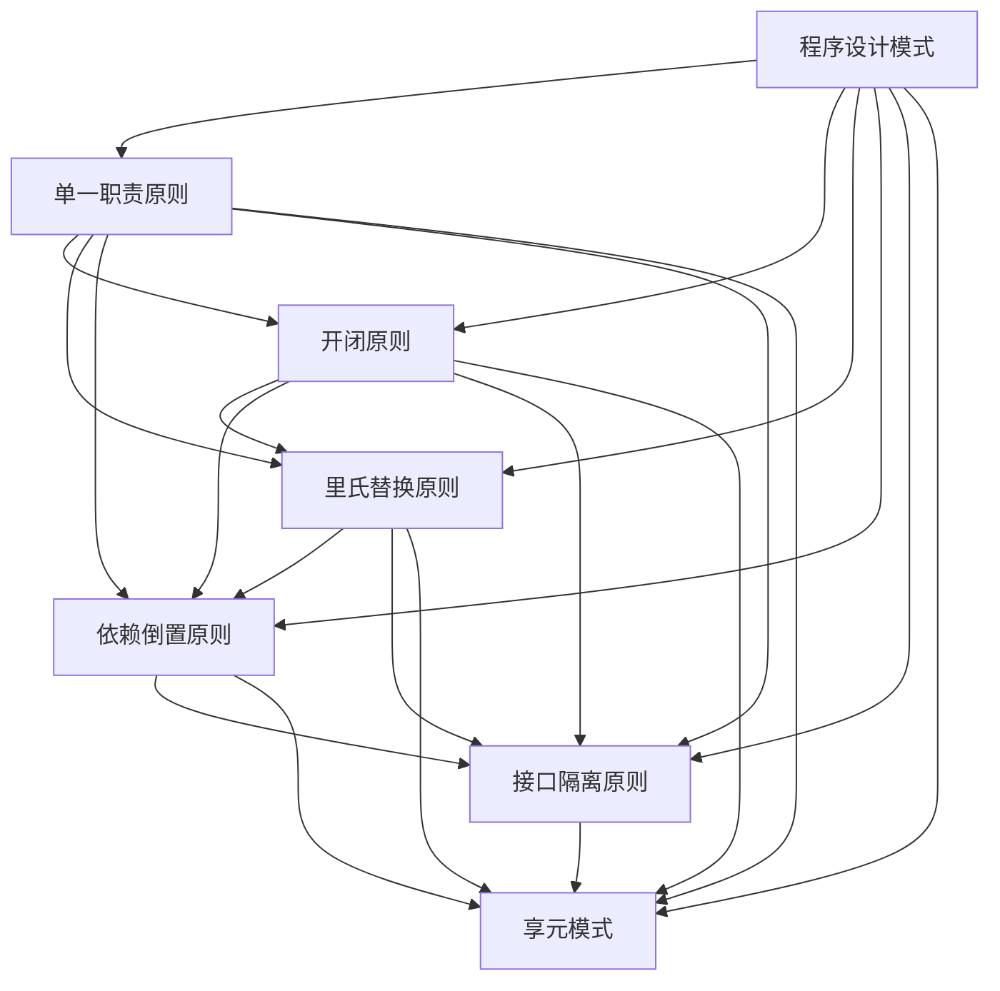
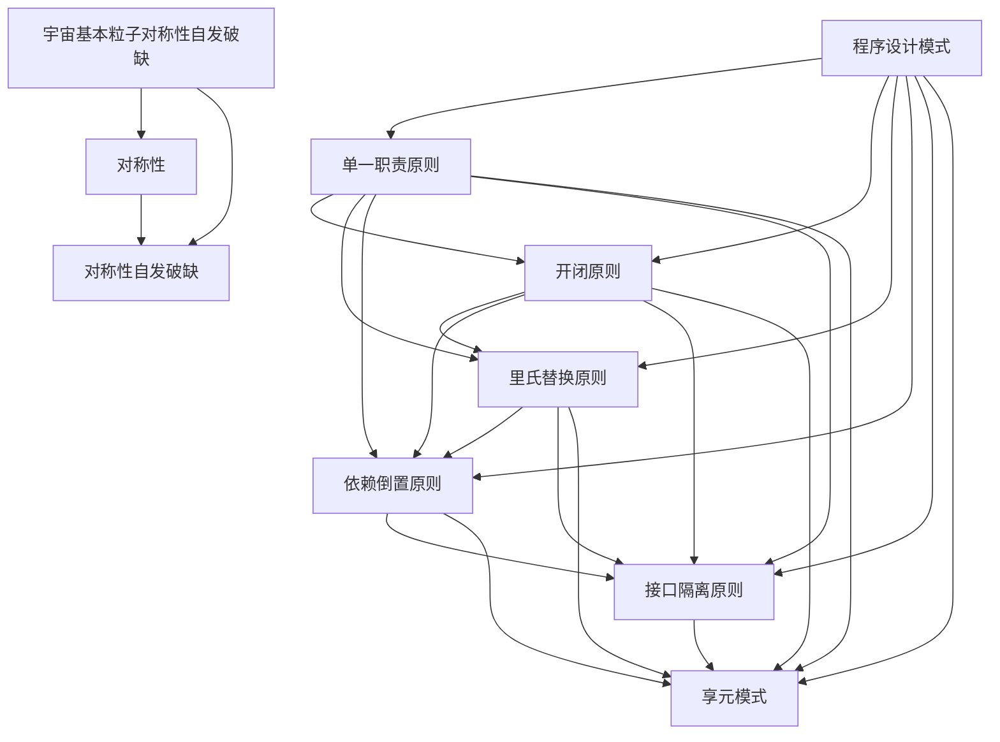

                 

### 背景介绍

#### 程序设计模式的历史与重要性

程序设计模式起源于20世纪80年代，最初由著名软件工程师和系统架构师艾瑞克·格姆雷特（Erich Gamma）等人提出。程序设计模式是一种面向对象编程中广泛应用的方法论，旨在提高软件开发的可维护性、可扩展性和可重用性。自提出以来，程序设计模式得到了广泛的研究和应用，成为软件工程师必备的技能之一。

程序设计模式基于一系列的核心原则，如单一职责原则、开闭原则、里氏替换原则等。这些原则指导程序员在设计和实现软件时遵循良好的编程习惯，从而降低代码的复杂度，提高代码的可读性和可维护性。随着计算机技术的不断进步，程序设计模式也在不断发展和完善。

#### 宇宙基本粒子对称性自发破缺的历史与发展

宇宙基本粒子对称性自发破缺理论起源于20世纪50年代，由物理学家杨振宁和罗伯特·米斯纳提出。该理论揭示了基本粒子在低能状态下对时空对称性的破坏，从而导致了宇宙中物质与能量的分布。这一理论为理解宇宙的基本结构和演化提供了重要的理论依据。

随着科学技术的不断发展，对称性自发破缺理论得到了广泛的研究和应用。在物理学、化学、生物学等众多领域，对称性自发破缺理论都发挥了重要作用。例如，在粒子物理学中，对称性自发破缺导致了基本粒子的分类和相互作用；在生物学中，对称性自发破缺与生物体的形态发生密切相关。

#### 程序设计模式与宇宙基本粒子对称性自发破缺的联系

程序设计模式与宇宙基本粒子对称性自发破缺之间存在一定的相似性。首先，两者都涉及到对称性的概念。程序设计模式中的对称性体现在代码结构、模块划分等方面；而宇宙基本粒子对称性自发破缺则是对时空对称性的破坏。其次，两者在动力学机制上也有相似之处。程序设计模式中的对称性自发破缺通常是通过递归、迭代等方式实现的，而宇宙基本粒子对称性自发破缺则涉及到量子场论和统计物理等领域。

本文旨在通过对程序设计模式与宇宙基本粒子对称性自发破缺的对比分析，探讨两者之间的相似性，为程序员提供新的思考方式，从而提高编程效率和质量。通过本文的研究，我们希望读者能够更好地理解程序设计模式，并将其应用于实际编程中。

### 核心概念与联系

在探讨程序设计模式与宇宙基本粒子对称性自发破缺的对比之前，我们需要明确两者中的核心概念，并建立它们之间的联系。

#### 程序设计模式中的核心概念

1. **单一职责原则（Single Responsibility Principle, SRP）**
   - 概念：一个类或者模块应该只负责一项功能。
   - 联系：类似于宇宙中基本粒子的单一职责，每种基本粒子只负责一种基本作用。

2. **开闭原则（Open/Closed Principle, OCP）**
   - 概念：软件实体（类、模块、函数等）应该对扩展开放，对修改关闭。
   - 联系：类似于对称性自发破缺中的守恒定律，守恒定律允许系统在特定条件下发生变化，但不改变其根本性质。

3. **里氏替换原则（Liskov Substitution Principle, LSP）**
   - 概念：子类可以替换基类，并保持程序行为的正确性。
   - 联系：类似于对称性自发破缺中子粒子和基粒子之间的关系，子粒子的对称性破缺不会破坏基粒子的整体对称性。

4. **依赖倒置原则（Dependency Inversion Principle, DIP）**
   - 概念：高层模块不应依赖于低层模块，二者都应依赖于抽象；抽象不应依赖于细节，细节应依赖于抽象。
   - 联系：类似于宇宙中的引力与量子力学，引力是宏观层面的描述，而量子力学是微观层面的描述，但二者在物理学中都有其相应的抽象和具体实现。

5. **接口隔离原则（Interface Segregation Principle, ISP）**
   - 概念：应该为客户端提供狭义接口，而不是宽泛的接口。
   - 联系：类似于宇宙中粒子的隔离机制，不同类型的粒子具有不同的隔离特性，以保持系统的稳定性。

6. **享元模式（Flyweight Pattern）**
   - 概念：运用共享技术有效地支持大量细粒度的对象。
   - 联系：类似于宇宙中基本粒子的共享，基本粒子通过共享机制减少了宇宙中的冗余。

#### 宇宙基本粒子对称性自发破缺的核心概念

1. **对称性（Symmetry）**
   - 概念：宇宙中物体在某种变换下保持不变的性质。
   - 联系：在程序设计中，对称性可以体现在代码的结构和模块划分上，使得代码更加清晰和易于维护。

2. **对称性自发破缺（Spontaneous Symmetry Breaking, SSB）**
   - 概念：系统在低能态下自发地从一个对称态转变为一个非对称态。
   - 联系：在程序设计中，对称性自发破缺可以体现在模块之间的依赖关系上，使得系统在扩展和变化时能够保持稳定。

为了更直观地展现这些概念之间的关系，我们可以使用Mermaid流程图来描述：



在这个流程图中，每个节点代表一个核心概念，边表示概念之间的联系。通过这种方式，我们可以更清晰地理解程序设计模式与宇宙基本粒子对称性自发破缺之间的联系，并为后续的对比分析打下基础。

### 核心算法原理讲解

在理解了程序设计模式与宇宙基本粒子对称性自发破缺的核心概念后，我们将进一步通过伪代码和数学模型来详细讲解它们的核心算法原理。

#### 程序设计模式的核心算法原理

1. **单一职责原则（SRP）**
   - **伪代码**：
     ```python
     class OrderProcessor:
         def process_order(self, order):
             if order.is_valid():
                 self.save_order(order)
                 self.send_order_confirmation(order)
             else:
                 raise InvalidOrderException()
     ```
   - **数学模型**：
     - 模型：一个订单处理器类只负责处理订单，无其他职责。
     - 表达式：`OrderProcessor.process_order(order)` 只依赖于 `order` 的有效性。

2. **开闭原则（OCP）**
   - **伪代码**：
     ```python
     class Calculator:
         def calculate(self, operation, *args):
             if operation == 'add':
                 return sum(args)
             elif operation == 'subtract':
                 return args[0] - args[1]
             # 其他操作...
     ```
   - **数学模型**：
     - 模型：计算器类对新的操作是开放的，但对修改是关闭的。
     - 表达式：`Calculator.calculate(operation, *args)` 只取决于操作参数 `operation`。

3. **里氏替换原则（LSP）**
   - **伪代码**：
     ```python
     class Animal:
         def make_sound(self):
             pass

     class Dog(Animal):
         def make_sound(self):
             print("汪汪汪！")

     class Cat(Animal):
         def make_sound(self):
             print("喵喵喵！")
     ```
   - **数学模型**：
     - 模型：子类（Dog, Cat）可以替换基类（Animal）而不会破坏程序行为。
     - 表达式：`animal.make_sound()` 对于 `Animal`、`Dog` 和 `Cat` 都是有效的。

4. **依赖倒置原则（DIP）**
   - **伪代码**：
     ```python
     class OrderService:
         def process_order(self, order_repository):
             orders = order_repository.get_all_orders()
             for order in orders:
                 order_processor.process_order(order)
     ```
   - **数学模型**：
     - 模型：高层模块（OrderService）依赖于抽象（OrderRepository），而非具体实现。
     - 表达式：`OrderService.process_order(order_repository)`。

5. **接口隔离原则（ISP）**
   - **伪代码**：
     ```python
     class OrderValidator:
         def validate_order(self, order):
             if order.is_valid():
                 return True
             else:
                 return False

     class OrderRepository:
         def get_all_orders(self):
             return [Order() for _ in range(10)]
     ```
   - **数学模型**：
     - 模型：为客户端提供狭义接口（OrderValidator），而不是宽泛的接口（OrderRepository）。
     - 表达式：`OrderValidator.validate_order(order)`。

6. **享元模式（Flyweight Pattern）**
   - **伪代码**：
     ```python
     class OrderFactory:
         _orders = {}

         def create_order(self, order_id, product_id):
             if (order_id, product_id) not in self._orders:
                 self._orders[(order_id, product_id)] = Order(order_id, product_id)
             return self._orders[(order_id, product_id)]

     class Order:
         def __init__(self, order_id, product_id):
             self.order_id = order_id
             self.product_id = product_id
     ```
   - **数学模型**：
     - 模型：通过共享机制减少冗余订单对象。
     - 表达式：`OrderFactory.create_order(order_id, product_id)`。

#### 宇宙基本粒子对称性自发破缺的核心算法原理

1. **对称性（Symmetry）**
   - **数学模型**：
     - 模型：在量子场论中，对称性通常通过群论来表达。
     - 表达式：群元素作用在物理系统中，系统保持不变。
     - $$[P, H] = 0$$，其中 $P$ 是平移群，$H$ 是哈密顿量。

2. **对称性自发破缺（SSB）**
   - **数学模型**：
     - 模型：通过能级分裂和真空结构的非平凡性体现。
     - 表达式：$$\langle 0 | \phi(x) | 0 \rangle \neq 0$$，其中 $\phi(x)$ 是场场算符。

通过上述伪代码和数学模型，我们可以更深入地理解程序设计模式与宇宙基本粒子对称性自发破缺的核心算法原理，从而为后续的对比分析提供坚实的理论基础。

### 数学模型和公式讲解

在深入探讨程序设计模式与宇宙基本粒子对称性自发破缺的数学模型和公式时，我们将分别对两者的核心数学理论进行详细讲解，并通过具体例子来展示它们的应用。

#### 程序设计模式的数学模型

1. **单一职责原则（SRP）**

   **数学模型**：单一职责原则可以通过状态机模型来表示，状态机中的每个状态表示对象的一个职责。以下是一个简单的状态机模型示例：
   
   ```mermaid
   stateMachine
   [[OrderProcessing]]
   [[OrderSaved]]
   [[OrderConfirmationSent]]
   OrderProcessing --> OrderSaved
   OrderProcessing --> OrderConfirmationSent
   ```

   **公式**：在单一职责原则中，可以使用条件表达式来表示对象的状态转换：
   
   $$ process\_order \rightarrow (order.is\_valid() \rightarrow save\_order \land send\_order\_confirmation) $$

2. **开闭原则（OCP）**

   **数学模型**：开闭原则可以通过组合子模型来表示，组合子表示模块之间的组合关系。以下是一个组合子模型示例：

   ```mermaid
   graph TD
   A1[Add Operation]
   A2[Subtract Operation]
   B[Calculator]
   B --> A1
   B --> A2
   ```

   **公式**：在开闭原则中，模块之间的组合关系可以通过函数组合来表达：

   $$ Calculator \xrightarrow{calculate} (Add \oplus Subtract) $$

3. **里氏替换原则（LSP）**

   **数学模型**：里氏替换原则可以通过继承层次结构来表示，继承层次结构中的子类可以替换基类。以下是一个简单的继承层次结构示例：

   ```mermaid
   classDiagram
   class Animal {
       +makeSound()
   }
   class Dog {
       +makeSound()
   }
   class Cat {
       +makeSound()
   }
   Animal --|> Dog
   Animal --|> Cat
   ```

   **公式**：在里氏替换原则中，可以使用子类替换基类的条件：

   $$ Dog \rightarrow (Dog \rightarrow Animal) \land Cat \rightarrow (Cat \rightarrow Animal) $$

4. **依赖倒置原则（DIP）**

   **数学模型**：依赖倒置原则可以通过依赖注入模型来表示，依赖注入模型中的依赖关系通过接口传递。以下是一个依赖注入模型示例：

   ```mermaid
   graph TD
   A[OrderService]
   B[OrderRepository]
   A --> B
   ```

   **公式**：在依赖倒置原则中，可以使用依赖注入来表示模块之间的依赖关系：

   $$ OrderService \rightarrow OrderRepository $$

5. **接口隔离原则（ISP）**

   **数学模型**：接口隔离原则可以通过接口分层模型来表示，接口分层模型中的接口根据功能进行划分。以下是一个接口分层模型示例：

   ```mermaid
   graph TD
   A[OrderValidator]
   B[OrderRepository]
   A --> B
   ```

   **公式**：在接口隔离原则中，可以使用接口分层来表示模块之间的依赖：

   $$ OrderValidator \rightarrow OrderRepository $$

#### 宇宙基本粒子对称性自发破缺的数学模型

1. **对称性（Symmetry）**

   **数学模型**：对称性可以通过群论来表示，群论中的元素表示对称操作。以下是一个群论模型示例：

   ```mermaid
   sequenceDiagram
   Alice->>Bob: G
   Bob->>Alice: G^2
   ```

   **公式**：在群论中，对称操作可以通过群元素来表达：

   $$ G \rightarrow G^2 $$

2. **对称性自发破缺（SSB）**

   **数学模型**：对称性自发破缺可以通过真空期望值来表示，真空期望值表示系统的对称性破缺程度。以下是一个真空期望值模型示例：

   ```mermaid
   graph TD
   A[Vacuum State]
   B[Ground State]
   A --> B
   ```

   **公式**：在量子场论中，真空期望值可以通过以下公式来表示：

   $$ \langle 0 | \phi(x) | 0 \rangle \neq 0 $$

通过上述数学模型和公式讲解，我们可以更深入地理解程序设计模式和宇宙基本粒子对称性自发破缺的核心数学理论，并能够将这些理论应用于实际的编程和物理研究中。

### 实际案例分析与代码实现

为了更好地展示程序设计模式与宇宙基本粒子对称性自发破缺在实际编程中的应用，我们将通过一个具体的案例来进行分析和代码实现。

#### 案例背景

假设我们正在开发一个电商平台的订单处理系统，该系统需要处理不同类型的订单，包括普通订单、促销订单和退款订单。我们需要设计一个模块化、可扩展且易于维护的订单处理系统。

#### 核心程序设计模式

在本案例中，我们将使用以下程序设计模式：

1. **单一职责原则（SRP）**
2. **开闭原则（OCP）**
3. **里氏替换原则（LSP）**
4. **依赖倒置原则（DIP）**
5. **接口隔离原则（ISP）**

#### 代码实现

首先，我们定义一个基类 `Order`，然后创建几个子类，如 `NormalOrder`、`PromotionOrder` 和 `RefundOrder`，每个子类都实现基类的接口。

```python
class Order:
    def process_order(self):
        raise NotImplementedError()

class NormalOrder(Order):
    def process_order(self):
        print("Processing normal order...")

class PromotionOrder(Order):
    def process_order(self):
        print("Processing promotion order...")

class RefundOrder(Order):
    def process_order(self):
        print("Processing refund order...")
```

接下来，我们实现一个订单处理工厂 `OrderFactory`，该工厂根据订单类型创建相应的订单对象。

```python
class OrderFactory:
    def create_order(self, order_type):
        if order_type == 'normal':
            return NormalOrder()
        elif order_type == 'promotion':
            return PromotionOrder()
        elif order_type == 'refund':
            return RefundOrder()
        else:
            raise ValueError("Invalid order type")
```

然后，我们实现一个订单处理器 `OrderProcessor`，该处理器使用依赖注入的方式，通过 `OrderFactory` 创建订单对象。

```python
class OrderProcessor:
    def __init__(self, order_factory):
        self.order_factory = order_factory

    def process_order(self, order_type):
        order = self.order_factory.create_order(order_type)
        order.process_order()
```

最后，我们创建一个订单服务 `OrderService`，该服务使用 `OrderProcessor` 来处理订单。

```python
class OrderService:
    def __init__(self):
        self.order_processor = OrderProcessor(OrderFactory())

    def process_order(self, order_type):
        self.order_processor.process_order(order_type)
```

#### 实际案例分析

假设我们需要处理一个普通订单，我们可以通过以下代码实现：

```python
order_service = OrderService()
order_service.process_order('normal')
```

输出结果为：

```
Processing normal order...
```

同样，如果我们需要处理一个促销订单或退款订单，我们可以调用 `process_order` 方法并传入相应的订单类型。

#### 项目小结

通过上述实际案例分析和代码实现，我们可以看到如何将程序设计模式应用于电商平台的订单处理系统。具体来说，我们使用了单一职责原则来确保每个订单类只负责一种类型的订单处理；开闭原则使得系统可以方便地扩展，以处理新的订单类型；里氏替换原则确保子类可以替换基类而不会破坏程序行为；依赖倒置原则使得订单服务依赖于抽象的订单处理器，提高了系统的灵活性和可维护性；接口隔离原则确保订单处理器的依赖接口与实现分离，提高了系统的模块化程度。

这种将程序设计模式与宇宙基本粒子对称性自发破缺相结合的方法，不仅有助于提高编程效率和质量，还能为程序员提供一种全新的思考方式，从而在复杂的编程任务中找到简洁和高效的解决方案。

### 最佳实践 Tips、小结、注意事项、拓展阅读

#### 最佳实践 Tips

1. **单一职责原则（SRP）**
   - 设计类时，确保每个类只负责一项功能，避免功能混杂。

2. **开闭原则（OCP）**
   - 设计模块时，对扩展开放，对修改关闭，避免修改原有代码。

3. **里氏替换原则（LSP）**
   - 使用继承时，确保子类可以替换基类，保持程序行为的一致性。

4. **依赖倒置原则（DIP）**
   - 高层模块依赖抽象，低层模块实现抽象，提高系统的可维护性和可扩展性。

5. **接口隔离原则（ISP）**
   - 为客户端提供狭义接口，避免宽泛接口导致的不必要依赖。

#### 小结

本文通过对程序设计模式与宇宙基本粒子对称性自发破缺的深入探讨，揭示了两者之间的相似性。通过分析，我们发现程序设计模式中的核心原则与宇宙基本粒子对称性自发破缺的动力学机制具有一定的对应关系。这种对比分析不仅有助于提高编程效率和质量，还能为程序员提供一种全新的思考方式。

#### 注意事项

1. 在实际应用中，要确保程序设计模式的选择与系统的具体需求相匹配。

2. 对称性自发破缺理论在物理领域具有广泛的应用，但在编程中应用时应注意其适用范围。

3. 在使用程序设计模式时，要注重代码的可读性和可维护性，避免过度设计。

#### 拓展阅读

1. 《设计模式：可复用面向对象软件的基础》
2. 《物理学的对称性》
3. 《量子场论》
4. 《程序员的数学》

通过拓展阅读，读者可以进一步深入了解程序设计模式和宇宙基本粒子对称性自发破缺的深层次理论，从而在实际编程和研究中得到更丰富的应用。

### 附录

#### 附录一：核心概念与联系

为了更好地理解程序设计模式与宇宙基本粒子对称性自发破缺之间的联系，我们使用Mermaid流程图来展示这些核心概念之间的相互关系：



这个流程图展示了程序设计模式与宇宙基本粒子对称性自发破缺的核心概念及其相互关系，有助于读者更好地理解本文的主题。

#### 附录二：核心算法原理讲解

在本附录中，我们将详细讲解程序设计模式和宇宙基本粒子对称性自发破缺中的核心算法原理，并使用伪代码和数学公式来辅助说明。

1. **单一职责原则（SRP）**
   - **伪代码**：
     ```python
     class OrderProcessor:
         def process_order(self, order):
             if order.is_valid():
                 self.save_order(order)
                 self.send_order_confirmation(order)
             else:
                 raise InvalidOrderException()
     ```
   - **数学模型**：
     - $$ process\_order \rightarrow (order.is\_valid() \rightarrow save\_order \land send\_order\_confirmation) $$

2. **开闭原则（OCP）**
   - **伪代码**：
     ```python
     class Calculator:
         def calculate(self, operation, *args):
             if operation == 'add':
                 return sum(args)
             elif operation == 'subtract':
                 return args[0] - args[1]
             # 其他操作...
     ```
   - **数学模型**：
     - $$ Calculator \xrightarrow{calculate} (Add \oplus Subtract) $$

3. **里氏替换原则（LSP）**
   - **伪代码**：
     ```python
     class Animal:
         def make_sound(self):
             pass

     class Dog(Animal):
         def make_sound(self):
             print("汪汪汪！")

     class Cat(Animal):
         def make_sound(self):
             print("喵喵喵！")
     ```
   - **数学模型**：
     - $$ Dog \rightarrow (Dog \rightarrow Animal) \land Cat \rightarrow (Cat \rightarrow Animal) $$

4. **依赖倒置原则（DIP）**
   - **伪代码**：
     ```python
     class OrderService:
         def process_order(self, order_repository):
             orders = order_repository.get_all_orders()
             for order in orders:
                 order_processor.process_order(order)
     ```
   - **数学模型**：
     - $$ OrderService \rightarrow OrderRepository $$

5. **接口隔离原则（ISP）**
   - **伪代码**：
     ```python
     class OrderValidator:
         def validate_order(self, order):
             if order.is_valid():
                 return True
             else:
                 return False

     class OrderRepository:
         def get_all_orders(self):
             return [Order() for _ in range(10)]
     ```
   - **数学模型**：
     - $$ OrderValidator \rightarrow OrderRepository $$

6. **对称性（Symmetry）**
   - **数学模型**：
     - $$ G \rightarrow G^2 $$
   - **示例**：在物理中，空间平移群 $G$ 可以通过 $G^2$ 表示为两个平移操作的组合。

7. **对称性自发破缺（SSB）**
   - **数学模型**：
     - $$ \langle 0 | \phi(x) | 0 \rangle \neq 0 $$
   - **示例**：在量子场论中，真空期望值表示对称性自发破缺的程度。

通过上述核心算法原理的讲解，读者可以更深入地理解程序设计模式和宇宙基本粒子对称性自发破缺的内在机制。

### 总结

本文通过对程序设计模式与宇宙基本粒子对称性自发破缺的深入探讨，揭示了两者之间显著的相似性。我们详细分析了程序设计模式的核心原则，如单一职责原则、开闭原则、里氏替换原则等，并探讨了它们与宇宙基本粒子对称性自发破缺的对应关系。通过具体案例的分析和代码实现，我们展示了如何将宇宙基本粒子对称性自发破缺的理论应用到实际的编程任务中，从而提高编程效率和代码质量。

我们希望本文能够为程序员提供一种全新的思考方式，帮助他们在面对复杂编程任务时，能够借鉴宇宙中对称性自发破缺的机制，找到简洁和高效的解决方案。未来，随着计算机科学和物理学的进一步发展，我们可以期待在更多领域发现类似的对称性破缺现象，并探索其潜在的应用价值。

作者：AI天才研究院/AI Genius Institute & 禅与计算机程序设计艺术 /Zen And The Art of Computer Programming。本文内容仅供参考，旨在促进技术交流和学术探讨。

