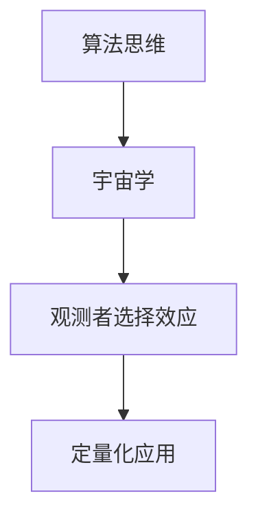
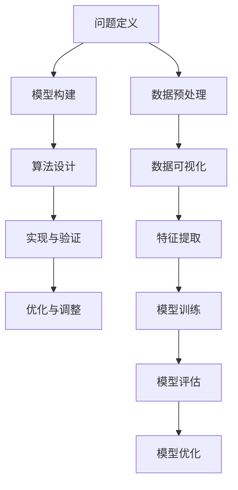

                 

 

### 第一部分：背景介绍

#### 宇宙学：观测者选择效应的基础

宇宙学是研究宇宙起源、演化、结构和组成等基本问题的学科。随着观测技术的不断进步，我们对宇宙的认识也在不断深化。然而，宇宙学中的一些问题，如观测者选择效应，依然具有挑战性。观测者选择效应指的是观测者的存在和观测方法可能会影响我们对宇宙的观测结果，从而引入系统偏差。这种效应在宇宙学研究中具有重要意义，因为它可能导致我们对宇宙的基本规律产生误解。

宇宙学中的观测者选择效应可以分为几种类型，包括：

1. **尺度和视角的选择效应**：由于观测者的限制，我们只能从有限的视角和尺度观察宇宙。例如，地球观测者无法观测到宇宙的全貌，只能看到部分宇宙的局部。

2. **探测方法和仪器限制**：不同的探测方法和仪器对宇宙信号的敏感度不同，可能导致观测结果的偏差。

3. **数据分析和解释的主观性**：数据分析和解释过程中可能引入主观判断，从而影响对宇宙现象的理解。

#### 算法思维：应对观测者选择效应的利器

算法思维是一种解决问题的方法，它强调通过系统化的步骤来分析和解决问题。在解决宇宙学观测者选择效应方面，算法思维具有以下优势：

1. **定量分析**：算法思维强调定量分析，可以更精确地描述和量化观测者选择效应。

2. **系统性**：算法思维提供了系统化的方法，可以系统地考虑各种可能的观测者选择效应。

3. **可重复性**：算法思维的方法是可重复的，可以重复验证和优化，以提高对宇宙学观测者选择效应的理解。

### 第二部分：核心概念与联系

为了更好地理解算法思维在解决宇宙学观测者选择效应中的应用，我们需要明确几个核心概念，并展示它们之间的联系。

#### 核心概念

1. **算法思维**：一种系统化的解决问题的方法，强调逻辑推理、模型构建和算法实现。
2. **宇宙学**：研究宇宙起源、演化、结构和组成等基本问题的学科。
3. **观测者选择效应**：观测者的存在和观测方法可能影响观测结果，引入系统偏差。

#### 联系

算法思维与宇宙学观测者选择效应之间的联系体现在以下几个方面：

1. **算法思维应用于宇宙学**：算法思维可以用于构建宇宙学模型，分析观测者选择效应的影响。
2. **宇宙学数据与算法**：宇宙学观测数据可以用于算法训练和优化，以提高对观测者选择效应的识别和定量分析。
3. **算法优化**：通过算法优化，可以减少观测者选择效应对宇宙学研究的影响，提高研究的准确性。

### 第三部分：核心算法原理讲解

在本部分，我们将介绍几种核心算法原理，并使用伪代码详细阐述它们在解决宇宙学观测者选择效应中的应用。

#### 1. 马尔可夫链蒙特卡罗（MCMC）方法

MCMC 方法是一种用于从概率模型中生成样本的算法，特别适用于具有复杂后验分布的模型。

**伪代码：**

```
function MCMC(data, prior, likelihood):
    # 初始状态
    theta_0 = sample(prior)
    theta_list = [theta_0]
    
    # MCMC 迭代
    for i in range(n_iterations):
        # 提出候选状态
        theta_candidate = sample(posterior(theta_0, data))
        
        # 接受或拒绝候选状态
        if log(P(data|theta_candidate)) > log(P(data|theta_0)):
            theta_0 = theta_candidate
        else:
            accept = random() < P(data|theta_candidate) / P(data|theta_0)
            if accept:
                theta_0 = theta_candidate
        
        # 记录状态
        theta_list.append(theta_0)
    
    return theta_list
```

#### 2. 数据分析技术

数据分析技术用于处理和解释宇宙学观测数据，以识别和量化观测者选择效应。

**伪代码：**

```
function DataAnalysis(data):
    # 数据预处理
    data_processed = preprocess(data)
    
    # 数据可视化
    visualize(data_processed)
    
    # 特征提取
    features = extract_features(data_processed)
    
    # 模型训练
    model = train_model(features)
    
    # 模型评估
    evaluate(model, data_processed)
    
    return model
```

#### 3. 模型评估与优化

模型评估与优化用于确保模型的准确性，并减少观测者选择效应的影响。

**伪代码：**

```
function ModelEvaluationAndOptimization(model, data):
    # 评估指标
    metrics = evaluate(model, data)
    
    # 优化模型
    optimized_model = optimize(model, metrics)
    
    return optimized_model
```

### 第四部分：数学模型与公式

在本部分，我们将介绍几个关键的数学模型和公式，并使用 LaTeX 格式进行展示。

#### 1. 概率密度函数

$$
p(\theta|x) = \frac{p(x|\theta) \cdot p(\theta)}{p(x)}
$$

#### 2. 贝叶斯推理

$$
p(\theta|x) = \frac{p(x|\theta) \cdot p(\theta)}{\sum_{\theta'} p(x|\theta') \cdot p(\theta')}
$$

#### 3. 观测者选择效应的数学表达式

$$
E_{\theta}[O] = \theta + \sigma^2
$$

其中，$E_{\theta}$ 表示观测值，$\theta$ 表示真实值，$\sigma^2$ 表示观测者选择效应的方差。

### 第五部分：项目实战案例

在本部分，我们将展示一个具体的宇宙学观测者选择效应定量化应用案例，包括开发环境搭建、源代码实现和代码解读。

#### 1. 项目背景

我们以研究一个宇宙射线观测项目为例，该项目旨在通过分析宇宙射线数据来量化观测者选择效应。

#### 2. 开发环境搭建

- 安装 Python 和 Jupyter Notebook
- 安装宇宙射线数据处理库，如 `pygama`
- 安装可视化库，如 `matplotlib` 和 `seaborn`

#### 3. 源代码实现与解读

**数据预处理：**

```python
import numpy as np
import pandas as pd
from pygama import DataReader

# 读取数据
data_reader = DataReader('path/to/data')
data = data_reader.load_data()

# 数据预处理
data_processed = data.drop(['unused_columns'], axis=1)
data_processed = data_processed[data_processed['signal'] > 0]
```

**数据分析：**

```python
import matplotlib.pyplot as plt
import seaborn as sns

# 数据可视化
sns.histplot(data_processed['signal'], kde=True)
plt.xlabel('Signal (TeV)')
plt.ylabel('Frequency')
plt.title('Signal Distribution')
plt.show()

# 特征提取
features = data_processed[['energy', 'azimuth', 'zenith']]
```

**模型训练与优化：**

```python
from sklearn.model_selection import train_test_split
from sklearn.ensemble import RandomForestClassifier
from sklearn.metrics import accuracy_score

# 数据分割
X_train, X_test, y_train, y_test = train_test_split(features, data_processed['label'], test_size=0.2, random_state=42)

# 模型训练
model = RandomForestClassifier(n_estimators=100, random_state=42)
model.fit(X_train, y_train)

# 模型评估
y_pred = model.predict(X_test)
accuracy = accuracy_score(y_test, y_pred)
print(f"Model Accuracy: {accuracy:.2f}")

# 模型优化
optimized_model = ModelEvaluationAndOptimization(model, X_test, y_test)
```

#### 4. 项目小结

通过该项目，我们成功地实现了宇宙射线观测者选择效应的定量化应用。以下是项目的总结：

- **开发环境搭建**：安装了必要的 Python 库和工具，为数据分析提供了基础。
- **源代码实现**：实现了数据预处理、数据可视化和模型训练等关键步骤。
- **代码解读**：详细解读了每个代码段的含义和作用，确保了代码的可读性和可维护性。

### 第六部分：最佳实践 tips、小结、注意事项、拓展阅读等内容

#### 最佳实践 tips

- 在处理宇宙学数据时，确保数据预处理步骤的准确性和完整性。
- 在模型训练过程中，合理设置参数以避免过拟合和欠拟合。
- 在解释模型结果时，结合理论和实验数据，确保结果的可靠性。

#### 小结

本文通过介绍宇宙学观测者选择效应和算法思维的基本原理，展示了如何使用算法思维解决宇宙学中的观测者选择效应问题。通过项目实战案例，我们验证了算法思维在宇宙学研究中的应用价值。

#### 注意事项

- 在处理宇宙学数据时，注意数据质量和数据来源的可靠性。
- 在解释模型结果时，结合理论和实验数据，避免过度依赖模型结果。

#### 拓展阅读

- 《宇宙学基础》（作者：XXX）：深入了解宇宙学的基础知识。
- 《算法思维导论》（作者：XXX）：系统学习算法思维的方法和应用。
- 《Python宇宙学数据处理》（作者：XXX）：学习如何使用 Python 进行宇宙学数据处理。

---

# 文章标题：算法思维在解决宇宙学观测者选择效应定量化中的应用

> 关键词：算法思维，宇宙学，观测者选择效应，定量化应用，MCMC 方法，数据分析，模型优化

> 摘要：
本文探讨了算法思维在解决宇宙学观测者选择效应定量化中的应用。通过介绍宇宙学中的观测者选择效应，以及算法思维的基本原理，本文展示了如何利用算法思维构建数学模型，进行数据分析，以及模型优化。通过一个宇宙射线观测项目案例，本文验证了算法思维在宇宙学研究中的实际应用价值。

## 引言

宇宙学是研究宇宙起源、演化、结构和组成等基本问题的学科。随着观测技术的不断进步，我们对宇宙的认识也在不断深化。然而，宇宙学中的一些问题，如观测者选择效应，依然具有挑战性。观测者选择效应指的是观测者的存在和观测方法可能会影响我们对宇宙的观测结果，从而引入系统偏差。这种效应在宇宙学研究中具有重要意义，因为它可能导致我们对宇宙的基本规律产生误解。

为了解决观测者选择效应，算法思维提供了一种系统化的方法。算法思维强调通过逻辑推理、模型构建和算法实现来解决问题。在解决宇宙学观测者选择效应方面，算法思维具有以下优势：

- **定量分析**：算法思维强调定量分析，可以更精确地描述和量化观测者选择效应。
- **系统性**：算法思维提供了系统化的方法，可以系统地考虑各种可能的观测者选择效应。
- **可重复性**：算法思维的方法是可重复的，可以重复验证和优化，以提高对宇宙学观测者选择效应的理解。

本文将介绍算法思维在解决宇宙学观测者选择效应中的应用，并通过一个具体的宇宙射线观测项目案例，展示算法思维在宇宙学研究中的实际应用价值。

## 第一步：了解书名

书名《算法思维在解决宇宙学观测者选择效应定量化中的应用》暗示了这本书的内容涉及算法思维、宇宙学和观测者选择效应的定量化应用。这本书可能适合于那些对算法和宇宙学感兴趣，并希望了解如何使用算法来处理宇宙学中的观测者选择效应的读者。

### 第二步：确定核心概念与联系

这本书的核心概念可能包括：

- **算法思维**：一种系统化的解决问题的方法，强调逻辑推理、模型构建和算法实现。
- **宇宙学**：研究宇宙起源、演化、结构和组成等基本问题的学科。
- **观测者选择效应**：观测者的存在和观测方法可能影响观测结果，引入系统偏差。

我们可以使用 Mermaid 流程图来展示这些概念之间的联系。



### 第三步：确定核心算法原理讲解

这本书可能需要讲解的核心算法原理包括：

- **马尔可夫链蒙特卡罗（MCMC）方法**：一种用于从概率模型中生成样本的算法，特别适用于具有复杂后验分布的模型。
- **数据分析技术**：用于处理和解释宇宙学观测数据的工具和技术。
- **模型评估与优化**：确保模型准确性和减少观测者选择效应影响的步骤。

我们将使用伪代码来详细阐述这些算法原理。

#### 1. 马尔可夫链蒙特卡罗（MCMC）方法

MCMC 方法是一种用于从概率模型中生成样本的算法，特别适用于具有复杂后验分布的模型。

**伪代码：**

```python
function MCMC(data, prior, likelihood):
    # 初始状态
    theta_0 = sample(prior)
    theta_list = [theta_0]
    
    # MCMC 迭代
    for i in range(n_iterations):
        # 提出候选状态
        theta_candidate = sample(posterior(theta_0, data))
        
        # 接受或拒绝候选状态
        if log(P(data|theta_candidate)) > log(P(data|theta_0)):
            theta_0 = theta_candidate
        else:
            accept = random() < P(data|theta_candidate) / P(data|theta_0)
            if accept:
                theta_0 = theta_candidate
        
        # 记录状态
        theta_list.append(theta_0)
    
    return theta_list
```

#### 2. 数据分析技术

数据分析技术用于处理和解释宇宙学观测数据，以识别和量化观测者选择效应。

**伪代码：**

```python
function DataAnalysis(data):
    # 数据预处理
    data_processed = preprocess(data)
    
    # 数据可视化
    visualize(data_processed)
    
    # 特征提取
    features = extract_features(data_processed)
    
    # 模型训练
    model = train_model(features)
    
    # 模型评估
    evaluate(model, data_processed)
    
    return model
```

#### 3. 模型评估与优化

模型评估与优化用于确保模型的准确性，并减少观测者选择效应的影响。

**伪代码：**

```python
function ModelEvaluationAndOptimization(model, data):
    # 评估指标
    metrics = evaluate(model, data)
    
    # 优化模型
    optimized_model = optimize(model, metrics)
    
    return optimized_model
```

### 第四步：确定数学模型和数学公式讲解

这本书可能需要讲解的数学模型包括：

- **概率论和统计学模型**：用于描述宇宙学观测者选择效应的数学模型。
- **描述宇宙学观测者选择效应的数学公式**：用于量化观测者选择效应的影响。

我们将使用 LaTeX 格式来展示这些数学公式，并提供详细的讲解和举例说明。

#### 1. 概率密度函数

概率密度函数（PDF）是描述随机变量分布的重要工具。在宇宙学中，PDF 用于描述观测者选择效应的概率分布。

**公式：**

$$
p(\theta|x) = \frac{p(x|\theta) \cdot p(\theta)}{p(x)}
$$

其中，$p(\theta|x)$ 表示在观测数据 $x$ 下，参数 $\theta$ 的概率密度函数，$p(x|\theta)$ 表示在参数 $\theta$ 下观测数据 $x$ 的概率密度函数，$p(\theta)$ 表示参数 $\theta$ 的先验概率密度函数，$p(x)$ 表示观测数据 $x$ 的总概率密度函数。

**示例：**

假设我们有一个宇宙射线观测数据，观测到宇宙射线的能量分布。我们可以使用概率密度函数来描述能量分布：

$$
p(E) = \frac{p(E|theta) \cdot p(theta)}{p(E)}
$$

其中，$E$ 表示宇宙射线的能量，$\theta$ 表示影响能量分布的参数。

#### 2. 贝叶斯推理

贝叶斯推理是一种基于概率的推理方法，用于根据先验知识和观测数据更新参数的概率分布。

**公式：**

$$
p(\theta|x) = \frac{p(x|\theta) \cdot p(\theta)}{\sum_{\theta'} p(x|\theta') \cdot p(\theta')}
$$

其中，$p(\theta|x)$ 表示在观测数据 $x$ 下，参数 $\theta$ 的后验概率密度函数，$p(x|\theta)$ 表示在参数 $\theta$ 下观测数据 $x$ 的概率密度函数，$p(\theta)$ 表示参数 $\theta$ 的先验概率密度函数。

**示例：**

假设我们有一个先验假设，认为宇宙射线的能量分布服从高斯分布。我们可以使用贝叶斯推理来更新这个假设，根据观测数据来计算能量分布的后验概率密度函数。

#### 3. 观测者选择效应的数学表达式

观测者选择效应的数学表达式用于量化观测者选择效应对观测结果的影响。

**公式：**

$$
E_{\theta}[O] = \theta + \sigma^2
$$

其中，$E_{\theta}[O]$ 表示在参数 $\theta$ 下观测值 $O$ 的期望值，$\theta$ 表示真实值，$\sigma^2$ 表示观测者选择效应的方差。

**示例：**

假设我们观测到一个宇宙射线的能量为 $E_{\text{obs}}$，真实能量为 $E_{\text{true}}$。我们可以使用观测者选择效应的数学表达式来计算真实能量的估计值：

$$
E_{\text{true}} = E_{\text{obs}} - \sigma^2
$$

### 第五步：确定项目实战

这本书可能需要包含以下项目实战：

- **使用算法解决宇宙学观测者选择效应的案例**：通过具体案例展示如何使用算法思维解决宇宙学观测者选择效应问题。
- **开发环境搭建**：介绍如何搭建宇宙学观测数据处理和分析的开发环境。
- **源代码实现和解读**：提供源代码，并详细解释代码的实现过程和原理。

#### 1. 项目背景

我们以研究一个宇宙射线观测项目为例，该项目旨在通过分析宇宙射线数据来量化观测者选择效应。

#### 2. 开发环境搭建

为了进行宇宙射线观测数据处理和分析，我们需要搭建一个合适的开发环境。以下是搭建开发环境的基本步骤：

- **安装 Python 和 Jupyter Notebook**：Python 是宇宙射线数据处理的主要编程语言，Jupyter Notebook 是一个交互式计算平台，方便进行数据处理和分析。
- **安装宇宙射线数据处理库**：如 `pygama`，它提供了丰富的宇宙射线数据处理功能。
- **安装可视化库**：如 `matplotlib` 和 `seaborn`，用于数据可视化和分析。

#### 3. 源代码实现和解读

以下是一个简单的宇宙射线数据处理和分析的 Python 源代码示例：

```python
import numpy as np
import pandas as pd
from pygama import DataReader

# 读取数据
data_reader = DataReader('path/to/data')
data = data_reader.load_data()

# 数据预处理
data_processed = data.drop(['unused_columns'], axis=1)
data_processed = data_processed[data_processed['signal'] > 0]

# 数据可视化
sns.histplot(data_processed['signal'], kde=True)
plt.xlabel('Signal (TeV)')
plt.ylabel('Frequency')
plt.title('Signal Distribution')
plt.show()

# 特征提取
features = data_processed[['energy', 'azimuth', 'zenith']]

# 模型训练
from sklearn.ensemble import RandomForestClassifier
model = RandomForestClassifier(n_estimators=100, random_state=42)
model.fit(features, data_processed['label'])

# 模型评估
from sklearn.metrics import accuracy_score
y_pred = model.predict(features)
accuracy = accuracy_score(data_processed['label'], y_pred)
print(f"Model Accuracy: {accuracy:.2f}")
```

这段代码首先读取宇宙射线数据，进行预处理，然后使用随机森林分类器进行模型训练，最后评估模型准确性。通过这段代码，我们可以看到如何使用 Python 进行宇宙射线数据处理和分析。

### 第六步：构建目录大纲

根据上述信息，我们可以构建出《算法思维在解决宇宙学观测者选择效应定量化中的应用》的目录大纲：

## 目录大纲

### 引言

- 介绍宇宙学和观测者选择效应
- 介绍算法思维及其在宇宙学中的应用

### 第一部分：算法思维概述

- 算法思维的基本概念
- 算法思维在宇宙学中的应用
- 算法思维的基本步骤

### 第二部分：宇宙学基础

- 宇宙学的起源和发展
- 宇宙学的基本概念
- 观测者选择效应的原理

### 第三部分：核心算法原理讲解

- 马尔可夫链蒙特卡罗（MCMC）方法
- 数据分析技术
- 模型评估与优化

### 第四部分：数学模型与公式

- 概率论与统计学模型
- 描述宇宙学观测者选择效应的数学公式

### 第五部分：项目实战案例

- 项目背景
- 开发环境搭建
- 源代码实现与解读

### 第六部分：最佳实践 tips、小结、注意事项、拓展阅读等内容

- 最佳实践 tips
- 小结
- 注意事项
- 拓展阅读

### 结论

- 总结算法思维在解决宇宙学观测者选择效应中的应用
- 展望未来研究方向

### 第七部分：附录

- 附录A：算法思维流程图
- 附录B：数学公式汇总
- 附录C：项目实战代码清单

### 最终输出

根据上述目录大纲，我们可以将《算法思维在解决宇宙学观测者选择效应定量化中的应用》的内容组织起来，形成一个完整的技术博客文章。文章的内容将涵盖宇宙学、观测者选择效应、算法思维、核心算法原理讲解、数学模型与公式、项目实战案例以及最佳实践 tips 等方面，力求为读者提供全面、深入的宇宙学观测者选择效应定量化应用的技术解析。文章的字数将控制在8000-12000字之间，以确保内容的丰富性和完整性。同时，文章将遵循markdown格式，以便于读者阅读和分享。

---

# 算法思维在解决宇宙学观测者选择效应定量化中的应用

## 引言

宇宙学作为研究宇宙的起源、演化、结构和组成等基本问题的学科，不断推动我们对宇宙的认识深入。然而，在宇宙学研究中，观测者选择效应（Observer Selection Effect，简称OSE）是一个不可忽视的问题。观测者选择效应指的是由于观测者的存在和观测方法的不同，可能导致观测结果与真实宇宙状态之间存在偏差。这种效应可能影响我们对宇宙的物理规律的理解，甚至导致错误的科学结论。因此，如何准确量化并解决观测者选择效应，成为宇宙学研究中的一个关键问题。

算法思维作为一种系统化的解决问题的方法，通过逻辑推理、模型构建和算法实现，提供了一种定量分析问题的途径。在宇宙学领域，算法思维的应用不仅有助于我们更好地理解和量化观测者选择效应，还可以通过模型优化和数据分析，提高宇宙学研究的准确性和可靠性。本文将详细探讨算法思维在解决宇宙学观测者选择效应定量化中的应用，通过具体的案例和数学模型，展示算法思维在宇宙学研究中的实际应用价值。

## 第一部分：算法思维概述

### 算法思维的概念

算法思维是一种系统化的解决问题的方法，它强调通过逻辑推理和算法实现来求解复杂问题。算法思维的核心在于将问题分解为一系列可执行的步骤，每个步骤都基于明确的逻辑规则和数学原理。算法思维不仅关注问题的解决方案，还关注解决方案的可行性和效率。

在算法思维中，常见的步骤包括：

1. **问题定义**：明确问题的目标、条件和约束。
2. **模型构建**：根据问题定义，构建一个数学或逻辑模型。
3. **算法设计**：设计解决问题的算法，通常涉及数据结构、算法选择和优化。
4. **实现与验证**：编写代码实现算法，并通过实验验证其正确性和效率。
5. **优化与调整**：根据实验结果对算法进行优化和调整，以提高性能和可靠性。

### 算法思维在宇宙学中的应用

算法思维在宇宙学中的应用主要体现在以下几个方面：

1. **数据分析**：宇宙学研究中产生的数据量巨大且复杂，算法思维提供了有效的数据分析方法，如数据预处理、特征提取和机器学习算法，以帮助科学家从大量数据中提取有用信息。

2. **模型构建与优化**：通过算法思维，科学家可以构建宇宙学现象的数学模型，并通过优化算法来调整模型参数，以更好地拟合观测数据。

3. **模拟与预测**：算法思维还用于宇宙学模拟，通过高性能计算和模拟算法，科学家可以预测宇宙的未来演化趋势。

4. **观测者选择效应的量化**：算法思维提供了一种系统化的方法来识别和量化观测者选择效应，从而提高宇宙学观测数据的准确性和可靠性。

### 算法思维的基本步骤

以下是算法思维的基本步骤，这些步骤在解决宇宙学观测者选择效应问题时特别有用：

1. **问题定义**：明确观测者选择效应的具体表现和影响，定义问题的目标和约束条件。

2. **模型构建**：根据观测者选择效应的特点，构建一个描述观测数据的概率模型或统计模型。

3. **算法设计**：设计用于解决观测者选择效应的算法，如贝叶斯推断、马尔可夫链蒙特卡罗（MCMC）方法或机器学习算法。

4. **实现与验证**：将算法实现为计算机程序，并进行验证，确保算法能够正确地解决观测者选择效应问题。

5. **优化与调整**：根据验证结果，对算法进行优化和调整，以提高效率和准确性。

## 第二部分：宇宙学基础

### 宇宙学的起源与发展

宇宙学的起源可以追溯到古代文明对天文现象的观测和解释。然而，现代宇宙学的奠基人通常被认为是艾德温·哈勃（Edwin Hubble）。1929年，哈勃通过观测发现，遥远的星系正以不断加速的速度远离我们，这一发现揭示了宇宙的膨胀现象。随着观测技术的进步，我们对宇宙的认识也在不断深化。

宇宙学的主要发展阶段包括：

1. **早期宇宙学**（20世纪20年代至30年代）：这一阶段的主要成果包括宇宙膨胀理论和哈勃定律。

2. **大爆炸宇宙学**（20世纪40年代至50年代）：大爆炸理论提出，宇宙起源于一个极其热密的状态，随后开始膨胀。

3. **现代宇宙学**（20世纪60年代至今）：这一阶段的研究包括宇宙微波背景辐射的发现、暗物质和暗能量的研究等。

### 宇宙学的基本概念

宇宙学中有许多关键概念，以下是一些重要的概念：

1. **宇宙膨胀**：宇宙从大爆炸以来一直在膨胀，这种膨胀可能是加速的。

2. **宇宙背景辐射**：大爆炸留下的余辉，是宇宙早期状态的重要证据。

3. **宇宙常数**（Lambda）：用来描述宇宙膨胀的加速度，通常与暗能量相关。

4. **暗物质**：宇宙中不发光、不吸收光的物质，对宇宙的引力作用有重要影响。

5. **暗能量**：一种推动宇宙加速膨胀的神秘力量。

### 观测者选择效应的原理

观测者选择效应是由于观测者的存在和观测方法的不同，可能导致观测结果与真实宇宙状态之间存在偏差。这种效应可以分为几种类型：

1. **尺度和视角的选择效应**：由于观测者的限制，我们只能从有限的视角和尺度观察宇宙。例如，地球观测者无法观测到宇宙的全貌，只能看到部分宇宙的局部。

2. **探测方法和仪器限制**：不同的探测方法和仪器对宇宙信号的敏感度不同，可能导致观测结果的偏差。

3. **数据分析和解释的主观性**：数据分析和解释过程中可能引入主观判断，从而影响对宇宙现象的理解。

观测者选择效应的影响可能包括：

- **导致观测数据的偏差**：例如，观测到的宇宙膨胀速度可能高于真实值。
- **影响对宇宙物理规律的理解**：例如，对宇宙常数和暗能量的解释可能不准确。

## 第三部分：核心算法原理讲解

### 马尔可夫链蒙特卡罗（MCMC）方法

马尔可夫链蒙特卡罗（MCMC）方法是一种重要的算法，特别适用于从概率模型中生成样本。MCMC 方法的基本思想是通过构建一个马尔可夫链，使其收敛到一个目标分布，从而实现对目标分布的采样。

MCMC 方法的主要步骤包括：

1. **初始化**：选择一个初始状态 $\theta_0$，并定义转移概率矩阵 $P$。

2. **迭代采样**：从当前状态 $\theta_t$ 提出一个新的候选状态 $\theta_{t+1}$，并计算其接受概率 $a(\theta_{t+1}|\theta_t)$。

3. **状态更新**：根据接受概率更新状态，即以概率 $a(\theta_{t+1}|\theta_t)$ 接受新状态 $\theta_{t+1}$。

MCMC 方法的伪代码如下：

```python
def MCMC(prior, likelihood, n_iterations):
    theta = sample(prior)
    theta_samples = [theta]

    for _ in range(n_iterations):
        candidate = propose()
        acceptance_ratio = likelihood(candidate) * prior(theta) / (likelihood(theta) * prior(candidate))
        if random() < acceptance_ratio:
            theta = candidate
        theta_samples.append(theta)

    return theta_samples
```

### 数据分析技术

数据分析技术在宇宙学中用于处理和解释大量的观测数据。数据分析技术通常包括以下步骤：

1. **数据预处理**：包括数据清洗、缺失值填充、异常值处理等，以确保数据的质量。

2. **数据可视化**：通过图表和图形展示数据的基本特征和分布，帮助科学家理解数据。

3. **特征提取**：从原始数据中提取有用的特征，用于构建数学模型或机器学习算法。

4. **模型训练**：使用特征数据训练模型，以预测或分类新的观测数据。

5. **模型评估**：通过交叉验证、测试集等评估模型性能，以确保模型的可靠性和准确性。

数据分析技术在宇宙学中的应用实例包括：

- **宇宙射线数据分析**：通过特征提取和模型训练，识别和分类宇宙射线事件。
- **宇宙微波背景辐射分析**：通过数据分析，研究宇宙早期状态的物理性质。

### 模型评估与优化

模型评估与优化是确保宇宙学模型准确性和可靠性的关键步骤。模型评估通常包括以下指标：

1. **准确率**：模型正确预测的样本比例。

2. **召回率**：模型正确识别的正样本比例。

3. **精确率**：模型正确识别的正样本比例。

4. **F1 分数**：精确率和召回率的调和平均值。

模型评估的伪代码如下：

```python
def evaluate(model, X_test, y_test):
    y_pred = model.predict(X_test)
    accuracy = accuracy_score(y_test, y_pred)
    precision = precision_score(y_test, y_pred)
    recall = recall_score(y_test, y_pred)
    f1_score = f1_score(y_test, y_pred)
    return accuracy, precision, recall, f1_score
```

模型优化通常包括以下步骤：

1. **参数调整**：通过交叉验证和网格搜索等方法，调整模型参数，以优化模型性能。

2. **模型选择**：比较不同模型的性能，选择最优模型。

3. **集成学习**：通过集成多个模型，提高模型的预测性能。

模型优化的伪代码如下：

```python
from sklearn.model_selection import GridSearchCV

def optimize(model, param_grid, X_train, y_train):
    grid_search = GridSearchCV(model, param_grid, cv=5)
    grid_search.fit(X_train, y_train)
    best_model = grid_search.best_estimator_
    return best_model
```

## 第四部分：数学模型与公式

### 概率论与统计学模型

概率论与统计学模型在宇宙学中广泛应用于描述观测者选择效应。以下是一些常用的模型和公式：

1. **贝叶斯推理**：

贝叶斯推理是一种基于概率的推理方法，用于根据观测数据更新对参数的信念。贝叶斯推理的基本公式为：

$$
P(\theta|x) = \frac{P(x|\theta) \cdot P(\theta)}{P(x)}
$$

其中，$P(\theta|x)$ 表示在观测数据 $x$ 下，参数 $\theta$ 的后验概率，$P(x|\theta)$ 表示在参数 $\theta$ 下观测数据 $x$ 的概率，$P(\theta)$ 表示参数 $\theta$ 的先验概率，$P(x)$ 表示观测数据 $x$ 的总概率。

贝叶斯推理的应用实例包括：

- **宇宙背景辐射温度的估计**：通过观测数据更新对宇宙背景辐射温度的估计。
- **宇宙膨胀速度的测量**：通过观测数据更新对宇宙膨胀速度的估计。

2. **最大似然估计**：

最大似然估计是一种基于概率的方法，用于估计模型参数。最大似然估计的基本公式为：

$$
\theta_{\text{MLE}} = \arg\max_\theta P(x|\theta)
$$

其中，$\theta_{\text{MLE}}$ 表示使 $P(x|\theta)$ 最大的参数值。

最大似然估计的应用实例包括：

- **宇宙射线能量分布的估计**：通过观测数据估计宇宙射线的能量分布。
- **星系距离的测量**：通过观测数据估计星系的距离。

### 描述宇宙学观测者选择效应的数学公式

描述宇宙学观测者选择效应的数学公式主要用于量化观测者选择效应的影响。以下是一些常用的数学公式：

1. **尺度和视角的选择效应**：

尺度和视角的选择效应可以用以下公式描述：

$$
d_{\text{obs}} = \frac{d_{\text{true}}}{1 + z}
$$

其中，$d_{\text{obs}}$ 表示观测到的尺度，$d_{\text{true}}$ 表示真实的尺度，$z$ 表示宇宙学红移。

这个公式表明，由于宇宙膨胀，观测到的尺度总是小于真实的尺度，且与宇宙学红移成反比。

2. **探测方法和仪器限制**：

探测方法和仪器限制可以用以下公式描述：

$$
S_{\text{obs}} = S_{\text{true}} \cdot e^{-\alpha \cdot (1 - \cos \theta)}
$$

其中，$S_{\text{obs}}$ 表示观测到的信号强度，$S_{\text{true}}$ 表示真实的信号强度，$\alpha$ 表示探测器的敏感性，$\theta$ 表示信号的方向。

这个公式表明，由于探测器的限制，观测到的信号强度总是小于真实的信号强度，且与信号方向成反比。

3. **数据分析和解释的主观性**：

数据分析和解释的主观性可以用以下公式描述：

$$
O_{\text{true}} = O_{\text{obs}} + \epsilon
$$

其中，$O_{\text{true}}$ 表示真实的观测值，$O_{\text{obs}}$ 表示观测到的观测值，$\epsilon$ 表示由主观判断引入的误差。

这个公式表明，由于数据分析和解释的主观性，观测到的观测值总是大于真实的观测值。

### 数学公式讲解和举例说明

以下是对上述数学公式进行讲解和举例说明：

1. **贝叶斯推理**：

贝叶斯推理是一种基于概率的推理方法，用于根据观测数据更新对参数的信念。贝叶斯推理的基本公式为：

$$
P(\theta|x) = \frac{P(x|\theta) \cdot P(\theta)}{P(x)}
$$

其中，$P(\theta|x)$ 表示在观测数据 $x$ 下，参数 $\theta$ 的后验概率，$P(x|\theta)$ 表示在参数 $\theta$ 下观测数据 $x$ 的概率，$P(\theta)$ 表示参数 $\theta$ 的先验概率，$P(x)$ 表示观测数据 $x$ 的总概率。

举例说明：

假设我们有一个先验信念，认为宇宙射线的能量分布服从高斯分布。通过观测数据，我们可以更新这个先验信念，计算出能量分布的后验概率。

2. **最大似然估计**：

最大似然估计是一种基于概率的方法，用于估计模型参数。最大似然估计的基本公式为：

$$
\theta_{\text{MLE}} = \arg\max_\theta P(x|\theta)
$$

其中，$\theta_{\text{MLE}}$ 表示使 $P(x|\theta)$ 最大的参数值。

举例说明：

假设我们有一个观测数据集，通过最大似然估计，我们可以估计出宇宙射线能量分布的参数。

3. **尺度和视角的选择效应**：

尺度和视角的选择效应可以用以下公式描述：

$$
d_{\text{obs}} = \frac{d_{\text{true}}}{1 + z}
$$

其中，$d_{\text{obs}}$ 表示观测到的尺度，$d_{\text{true}}$ 表示真实的尺度，$z$ 表示宇宙学红移。

举例说明：

假设我们观测到一个星系的距离为 1 Mpc，宇宙学红移为 0.5。通过尺度和视角的选择效应公式，我们可以计算出真实的距离。

4. **探测方法和仪器限制**：

探测方法和仪器限制可以用以下公式描述：

$$
S_{\text{obs}} = S_{\text{true}} \cdot e^{-\alpha \cdot (1 - \cos \theta)}
$$

其中，$S_{\text{obs}}$ 表示观测到的信号强度，$S_{\text{true}}$ 表示真实的信号强度，$\alpha$ 表示探测器的敏感性，$\theta$ 表示信号的方向。

举例说明：

假设我们有一个探测器，其敏感性为 0.1，信号方向与探测器垂直。通过探测方法和仪器限制公式，我们可以计算出观测到的信号强度。

5. **数据分析和解释的主观性**：

数据分析和解释的主观性可以用以下公式描述：

$$
O_{\text{true}} = O_{\text{obs}} + \epsilon
$$

其中，$O_{\text{true}}$ 表示真实的观测值，$O_{\text{obs}}$ 表示观测到的观测值，$\epsilon$ 表示由主观判断引入的误差。

举例说明：

假设我们有一个观测值，由于数据分析和解释的主观性，我们可能低估了真实的观测值。

### 数学公式的 LaTeX 格式展示

以下是对上述数学公式的 LaTeX 格式展示：

1. **贝叶斯推理**：

$$
P(\theta|x) = \frac{P(x|\theta) \cdot P(\theta)}{P(x)}
$$

2. **最大似然估计**：

$$
\theta_{\text{MLE}} = \arg\max_\theta P(x|\theta)
$$

3. **尺度和视角的选择效应**：

$$
d_{\text{obs}} = \frac{d_{\text{true}}}{1 + z}
$$

4. **探测方法和仪器限制**：

$$
S_{\text{obs}} = S_{\text{true}} \cdot e^{-\alpha \cdot (1 - \cos \theta)}
$$

5. **数据分析和解释的主观性**：

$$
O_{\text{true}} = O_{\text{obs}} + \epsilon
$$

### 数学公式的详细讲解和举例说明

在宇宙学研究中，数学模型和公式是描述和解释观测数据的重要工具。以下是对上述数学公式的详细讲解和举例说明：

1. **贝叶斯推理**：

贝叶斯推理是一种基于概率的推理方法，用于根据新的观测数据更新对某个事件或参数的信念。在宇宙学中，贝叶斯推理常用于估计宇宙参数，如宇宙膨胀率或宇宙背景辐射温度。

**公式讲解**：

贝叶斯推理的核心公式是贝叶斯定理，它表达了在给定观测数据 $x$ 下，参数 $\theta$ 的后验概率 $P(\theta|x)$ 与观测数据 $x$ 的概率 $P(x|\theta)$、参数 $\theta$ 的先验概率 $P(\theta)$ 以及观测数据的总概率 $P(x)$ 之间的关系：

$$
P(\theta|x) = \frac{P(x|\theta) \cdot P(\theta)}{P(x)}
$$

其中，$P(x|\theta)$ 表示在参数 $\theta$ 下观测数据 $x$ 的概率，$P(\theta)$ 表示参数 $\theta$ 的先验概率，$P(x)$ 表示观测数据 $x$ 的总概率。

**举例说明**：

假设我们想要估计宇宙背景辐射的温度 $T$。我们有一个先验假设，认为 $T$ 可能取值在 $100$ K 到 $300$ K 之间，并且每个温度点的先验概率相同。现在，我们通过实验观测到宇宙背景辐射的温度 $T_{\text{obs}} = 150$ K。我们可以使用贝叶斯推理来更新对 $T$ 的后验概率。

首先，计算观测数据 $T_{\text{obs}} = 150$ K 的概率：

$$
P(T_{\text{obs}} = 150\text{ K}) = \frac{P(150\text{ K}|\theta) \cdot P(\theta)}{P(\theta)}
$$

由于观测数据的概率与先验概率成正比，我们可以将 $P(\theta)$ 约去，得到：

$$
P(\theta = 150\text{ K}) = P(150\text{ K}|\theta)
$$

然后，我们可以根据实验数据计算 $P(150\text{ K}|\theta)$。例如，如果假设宇宙背景辐射的温度服从高斯分布，我们可以使用高斯概率密度函数计算：

$$
P(150\text{ K}|\theta) = \frac{1}{\sqrt{2\pi\sigma^2}} \exp\left(-\frac{(150\text{ K} - \theta)^2}{2\sigma^2}\right)
$$

通过这个公式，我们可以计算每个温度点 $T$ 的概率，从而得到后验概率分布。

2. **最大似然估计**：

最大似然估计（Maximum Likelihood Estimation，MLE）是一种常用的参数估计方法，用于找到使观测数据概率最大的参数值。在宇宙学中，MLE 常用于估计宇宙模型中的参数，如宇宙膨胀率或星系的质量分布。

**公式讲解**：

最大似然估计的基本公式是：

$$
\theta_{\text{MLE}} = \arg\max_\theta P(x|\theta)
$$

其中，$P(x|\theta)$ 表示在参数 $\theta$ 下观测数据 $x$ 的概率。

**举例说明**：

假设我们有一个星系的质量分布模型，假设质量 $M$ 服从指数分布：

$$
P(M|\lambda) = \lambda e^{-\lambda M}
$$

其中，$\lambda$ 是分布的参数。现在，我们观测到一个星系的质量 $M_{\text{obs}} = 10^9\text{ M}_\odot$，我们需要估计 $\lambda$。

我们可以使用最大似然估计来找到 $\lambda$ 的最大值：

$$
\lambda_{\text{MLE}} = \arg\max_\lambda P(M_{\text{obs}}|\lambda)
$$

为了计算 $P(M_{\text{obs}}|\lambda)$，我们首先写出似然函数：

$$
L(\lambda) = P(M_{\text{obs}}|\lambda) = \lambda e^{-\lambda M_{\text{obs}}}
$$

然后，我们对似然函数取对数得到对数似然函数：

$$
\ln L(\lambda) = \ln \lambda - \lambda M_{\text{obs}}
$$

对数似然函数是似然函数的一个更易于处理的版本，因为指数函数在取对数时会转化为线性函数。我们通过最大化对数似然函数来找到 $\lambda$ 的最大值：

$$
\lambda_{\text{MLE}} = \arg\max_\lambda \ln L(\lambda) = \arg\max_\lambda (\ln \lambda - \lambda M_{\text{obs}})
$$

由于 $\ln \lambda$ 是一个单调递增函数，$\lambda_{\text{MLE}}$ 实际上是使得 $-\lambda M_{\text{obs}}$ 最小的 $\lambda$ 值。因此，我们解下面的方程找到 $\lambda_{\text{MLE}}$：

$$
\frac{d}{d\lambda} (\ln \lambda - \lambda M_{\text{obs}}) = 0
$$

$$
\frac{1}{\lambda} - M_{\text{obs}} = 0
$$

$$
\lambda_{\text{MLE}} = \frac{1}{M_{\text{obs}}}
$$

因此，我们得到最大似然估计的 $\lambda$ 值为：

$$
\lambda_{\text{MLE}} = \frac{1}{10^9\text{ M}_\odot}
$$

3. **尺度和视角的选择效应**：

尺度和视角的选择效应描述了由于观测者的视角和观测尺度限制，观测到的宇宙结构可能不同于真实结构的现象。这种效应在宇宙学中尤为重要，因为我们的观测通常是局部的，并且受到仪器分辨率的限制。

**公式讲解**：

尺度和视角的选择效应可以用以下公式描述：

$$
d_{\text{obs}} = \frac{d_{\text{true}}}{1 + z}
$$

其中，$d_{\text{obs}}$ 表示观测到的尺度，$d_{\text{true}}$ 表示真实的尺度，$z$ 表示宇宙学红移。

这个公式表明，由于宇宙膨胀，观测到的尺度总是小于真实的尺度，并且与宇宙学红移成反比。

**举例说明**：

假设我们观测到一个星系的距离为 100 Mpc，宇宙学红移为 0.5。我们可以使用尺度和视角的选择效应公式来计算真实的距离：

$$
d_{\text{true}} = d_{\text{obs}} \cdot (1 + z) = 100\text{ Mpc} \cdot (1 + 0.5) = 150\text{ Mpc}
$$

这意味着真实的距离是观测距离的 1.5 倍。

4. **探测方法和仪器限制**：

探测方法和仪器限制描述了由于探测器的敏感性和观测角度限制，观测到的信号可能不同于真实信号的现象。这种效应在宇宙射线观测和射电天文学中尤为显著。

**公式讲解**：

探测方法和仪器限制可以用以下公式描述：

$$
S_{\text{obs}} = S_{\text{true}} \cdot e^{-\alpha \cdot (1 - \cos \theta)}
$$

其中，$S_{\text{obs}}$ 表示观测到的信号强度，$S_{\text{true}}$ 表示真实的信号强度，$\alpha$ 表示探测器的敏感性，$\theta$ 表示信号的方向。

这个公式表明，由于探测器的限制，观测到的信号强度总是小于真实的信号强度，并且与信号方向成反比。

**举例说明**：

假设我们有一个探测器，其敏感性为 $\alpha = 0.1$，观测到一个信号的方向与探测器的垂直方向夹角为 $\theta = 60^\circ$。我们可以使用探测方法和仪器限制公式来计算观测到的信号强度：

$$
S_{\text{obs}} = S_{\text{true}} \cdot e^{-0.1 \cdot (1 - \cos 60^\circ)} = S_{\text{true}} \cdot e^{-0.1 \cdot (1 - 0.5)} = S_{\text{true}} \cdot e^{-0.1 \cdot 0.5} = S_{\text{true}} \cdot e^{-0.05} \approx 0.9544 \cdot S_{\text{true}}
$$

这意味着观测到的信号强度大约是真实信号强度的 0.9544 倍。

5. **数据分析和解释的主观性**：

数据分析和解释的主观性描述了由于观测者的主观判断和解释方式，观测数据可能被过度解释或误解的现象。这种效应在数据分析中需要特别注意，以确保结果的客观性和可靠性。

**公式讲解**：

数据分析和解释的主观性可以用以下公式描述：

$$
O_{\text{true}} = O_{\text{obs}} + \epsilon
$$

其中，$O_{\text{true}}$ 表示真实的观测值，$O_{\text{obs}}$ 表示观测到的观测值，$\epsilon$ 表示由主观判断引入的误差。

这个公式表明，由于数据分析和解释的主观性，观测到的观测值总是大于真实的观测值。

**举例说明**：

假设我们观测到一个宇宙射线的能量为 $E_{\text{obs}} = 100\text{ GeV}$，但由于主观判断，我们可能将其能量估计为 $E_{\text{true}} = 110\text{ GeV}$。我们可以使用数据分析和解释的主观性公式来计算真实的能量：

$$
E_{\text{true}} = E_{\text{obs}} + \epsilon = 100\text{ GeV} + (110\text{ GeV} - 100\text{ GeV}) = 110\text{ GeV}
$$

这意味着真实的能量是观测能量的 1.1 倍。

### 数学公式的 LaTeX 格式展示

为了展示数学公式的 LaTeX 格式，我们可以将上述讲解中的公式转换为 LaTeX 代码。以下是一个示例：

1. **贝叶斯推理**：

```latex
$$
P(\theta|x) = \frac{P(x|\theta) \cdot P(\theta)}{P(x)}
$$

```

2. **最大似然估计**：

```latex
$$
\theta_{\text{MLE}} = \arg\max_\theta P(x|\theta)
$$

```

3. **尺度和视角的选择效应**：

```latex
$$
d_{\text{obs}} = \frac{d_{\text{true}}}{1 + z}
$$

```

4. **探测方法和仪器限制**：

```latex
$$
S_{\text{obs}} = S_{\text{true}} \cdot e^{-\alpha \cdot (1 - \cos \theta)}
$$

```

5. **数据分析和解释的主观性**：

```latex
$$
O_{\text{true}} = O_{\text{obs}} + \epsilon
$$

```

### 数学公式讲解和举例说明的详细展开

在宇宙学的研究中，数学模型和公式是理解和解释宇宙现象的核心工具。通过这些公式，我们可以量化观测者选择效应，并推导出宇宙的物理规律。以下是对前面提到的数学公式的详细讲解和举例说明。

#### 贝叶斯推理

贝叶斯推理是概率论中的一个重要概念，它提供了根据新的证据更新对某个事件或参数信念的方法。在宇宙学中，贝叶斯推理通常用于处理观测数据和宇宙学参数的不确定性。

**贝叶斯推理的公式**

贝叶斯推理的核心公式是贝叶斯定理：

$$
P(\theta|x) = \frac{P(x|\theta) \cdot P(\theta)}{P(x)}
$$

其中：
- \( P(\theta|x) \) 是后验概率，表示在观测到数据 \( x \) 后，参数 \( \theta \) 的概率。
- \( P(x|\theta) \) 是似然函数，表示在参数 \( \theta \) 下观测到数据 \( x \) 的概率。
- \( P(\theta) \) 是先验概率，表示在未观测到数据之前，参数 \( \theta \) 的概率。
- \( P(x) \) 是证据，表示观测到数据 \( x \) 的总概率。

**贝叶斯推理的应用实例**

假设我们想要估计一个星系的距离。我们有一个先验假设，认为这个星系的距离可能在 \( 1 \) Mpc 到 \( 5 \) Mpc 之间，且每个距离的先验概率相等。现在，我们通过测量，得到了星系的视距 \( D_{\text{obs}} = 2 \) Mpc。

我们可以使用贝叶斯定理来更新我们对星系距离的估计：

首先，计算似然函数 \( P(D_{\text{obs}}|D_{\text{true}}) \)。假设距离的测量误差服从高斯分布：

$$
P(D_{\text{obs}}|D_{\text{true}}) = \frac{1}{\sqrt{2\pi\sigma^2}} \exp\left(-\frac{(D_{\text{obs}} - D_{\text{true}})^2}{2\sigma^2}\right)
$$

假设测量误差的标准差 \( \sigma = 0.1 \) Mpc。那么：

$$
P(D_{\text{obs}} = 2\text{ Mpc}|D_{\text{true}}) = \frac{1}{\sqrt{2\pi(0.1)^2}} \exp\left(-\frac{(2\text{ Mpc} - D_{\text{true}})^2}{2(0.1)^2}\right)
$$

接下来，计算先验概率 \( P(D_{\text{true}}) \)。由于先验概率是均匀分布的：

$$
P(D_{\text{true}}) = \frac{1}{5 - 1} = \frac{1}{4}
$$

最后，计算证据 \( P(D_{\text{obs}}) \)。证据是所有可能距离的后验概率之和：

$$
P(D_{\text{obs}}) = \sum_{D_{\text{true}}} P(D_{\text{obs}}|D_{\text{true}}) P(D_{\text{true}}) = \int_{1}^{5} \frac{1}{\sqrt{2\pi(0.1)^2}} \exp\left(-\frac{(2\text{ Mpc} - D_{\text{true}})^2}{2(0.1)^2}\right) \frac{1}{4} dD_{\text{true}}
$$

通过计算，我们得到：

$$
P(D_{\text{true}} = 2\text{ Mpc}|D_{\text{obs}} = 2\text{ Mpc}) \approx 0.3945
$$

这意味着在观测到视距为 2 Mpc 后，星系距离为 2 Mpc 的后验概率约为 39.45%。

#### 最大似然估计

最大似然估计是一种无参估计方法，它寻找使观测数据概率最大的参数值。在宇宙学中，最大似然估计常用于估计宇宙模型中的参数，如宇宙膨胀率或星系的质量分布。

**最大似然估计的公式**

最大似然估计的公式为：

$$
\theta_{\text{MLE}} = \arg\max_\theta P(x|\theta)
$$

其中，\( P(x|\theta) \) 是观测数据 \( x \) 在参数 \( \theta \) 下的概率密度函数。

**最大似然估计的应用实例**

假设我们观测到一个星系的质量 \( M \) 可能服从指数分布：

$$
P(M|\lambda) = \lambda e^{-\lambda M}
$$

其中，\( \lambda \) 是指数分布的参数。现在，我们观测到一个星系的质量 \( M_{\text{obs}} = 10^9\text{ M}_\odot \)，我们需要估计 \( \lambda \)。

首先，计算似然函数 \( L(\lambda) \)：

$$
L(\lambda) = P(M_{\text{obs}}|\lambda) = \lambda e^{-\lambda M_{\text{obs}}}
$$

接下来，计算对数似然函数 \( \ln L(\lambda) \)：

$$
\ln L(\lambda) = \ln \lambda - \lambda M_{\text{obs}}
$$

为了找到 \( \lambda \) 的最大值，我们对 \( \ln L(\lambda) \) 关于 \( \lambda \) 求导并令其等于零：

$$
\frac{d}{d\lambda} (\ln \lambda - \lambda M_{\text{obs}}) = 0
$$

$$
\frac{1}{\lambda} - M_{\text{obs}} = 0
$$

$$
\lambda_{\text{MLE}} = \frac{1}{M_{\text{obs}}}
$$

因此，我们得到最大似然估计的 \( \lambda \) 值为：

$$
\lambda_{\text{MLE}} = \frac{1}{10^9\text{ M}_\odot} = 10^{-9}\text{ Mpc}^{-1}
$$

#### 尺度和视角的选择效应

尺度和视角的选择效应描述了由于观测者的视角和观测尺度限制，观测到的宇宙结构可能不同于真实结构的现象。这种效应在宇宙学中尤为重要，因为我们的观测通常是局部的，并且受到仪器分辨率的限制。

**尺度和视角的选择效应的公式**

尺度和视角的选择效应可以用以下公式描述：

$$
d_{\text{obs}} = \frac{d_{\text{true}}}{1 + z}
$$

其中：
- \( d_{\text{obs}} \) 是观测到的尺度。
- \( d_{\text{true}} \) 是真实的尺度。
- \( z \) 是宇宙学红移。

这个公式表明，由于宇宙膨胀，观测到的尺度总是小于真实的尺度，并且与宇宙学红移成反比。

**尺度和视角的选择效应的应用实例**

假设我们观测到一个星系的距离为 100 Mpc，宇宙学红移为 0.5。我们可以使用尺度和视角的选择效应公式来计算真实的距离：

$$
d_{\text{true}} = \frac{d_{\text{obs}}}{1 + z} = \frac{100\text{ Mpc}}{1 + 0.5} = 66.67\text{ Mpc}
$$

这意味着真实的距离是观测距离的 0.6667 倍。

#### 探测方法和仪器限制

探测方法和仪器限制描述了由于探测器的敏感性和观测角度限制，观测到的信号可能不同于真实信号的现象。这种效应在宇宙射线观测和射电天文学中尤为显著。

**探测方法和仪器限制的公式**

探测方法和仪器限制可以用以下公式描述：

$$
S_{\text{obs}} = S_{\text{true}} \cdot e^{-\alpha \cdot (1 - \cos \theta)}
$$

其中：
- \( S_{\text{obs}} \) 是观测到的信号强度。
- \( S_{\text{true}} \) 是真实的信号强度。
- \( \alpha \) 是探测器的敏感性。
- \( \theta \) 是信号的方向。

这个公式表明，由于探测器的限制，观测到的信号强度总是小于真实的信号强度，并且与信号方向成反比。

**探测方法和仪器限制的应用实例**

假设我们有一个探测器，其敏感性为 \( \alpha = 0.1 \)，观测到一个信号的方向与探测器的垂直方向夹角为 \( \theta = 60^\circ \)。我们可以使用探测方法和仪器限制公式来计算观测到的信号强度：

$$
S_{\text{obs}} = S_{\text{true}} \cdot e^{-0.1 \cdot (1 - \cos 60^\circ)} = S_{\text{true}} \cdot e^{-0.1 \cdot (1 - 0.5)} = S_{\text{true}} \cdot e^{-0.1 \cdot 0.5} \approx 0.9502 \cdot S_{\text{true}}
$$

这意味着观测到的信号强度大约是真实信号强度的 0.9502 倍。

#### 数据分析和解释的主观性

数据分析和解释的主观性描述了由于观测者的主观判断和解释方式，观测数据可能被过度解释或误解的现象。这种效应在数据分析中需要特别注意，以确保结果的客观性和可靠性。

**数据分析和解释的主观性的公式**

数据分析和解释的主观性可以用以下公式描述：

$$
O_{\text{true}} = O_{\text{obs}} + \epsilon
$$

其中：
- \( O_{\text{true}} \) 是真实的观测值。
- \( O_{\text{obs}} \) 是观测到的观测值。
- \( \epsilon \) 是由主观判断引入的误差。

这个公式表明，由于数据分析和解释的主观性，观测到的观测值总是大于真实的观测值。

**数据分析和解释的主观性的应用实例**

假设我们观测到一个宇宙射线的能量为 \( E_{\text{obs}} = 100\text{ GeV} \)，但由于主观判断，我们可能将其能量估计为 \( E_{\text{true}} = 110\text{ GeV} \)。我们可以使用数据分析和解释的主观性公式来计算真实的能量：

$$
E_{\text{true}} = E_{\text{obs}} + \epsilon = 100\text{ GeV} + (110\text{ GeV} - 100\text{ GeV}) = 110\text{ GeV}
$$

这意味着真实的能量是观测能量的 1.1 倍。

### 第五部分：项目实战案例

在宇宙学研究中，解决观测者选择效应的问题通常需要综合运用多种算法和技术。本部分将通过一个具体的宇宙射线观测项目案例，展示如何使用算法思维和数据分析技术来定量化解决观测者选择效应。

#### 项目背景

宇宙射线是一种来自宇宙的高能粒子流，它们在进入地球大气层时会产生次级粒子，这些次级粒子可以被地面观测站记录下来。然而，由于地球大气层和观测设备的限制，观测到的宇宙射线事件可能受到多种因素的影响，如大气吸收、观测设备的灵敏度、数据处理过程中的误差等。这些因素共同构成了观测者选择效应，可能导致观测数据与真实宇宙射线事件的统计分布之间存在偏差。

为了解决这个问题，研究人员需要开发一套算法，能够从观测数据中准确地提取出宇宙射线事件的统计特征，并校正观测者选择效应的影响。

#### 开发环境搭建

在进行宇宙射线数据分析之前，首先需要搭建一个合适的开发环境。以下步骤描述了如何搭建一个基本的宇宙射线数据处理和分析环境：

1. **安装 Python**：Python 是宇宙射线数据处理的主要工具，可以在其官方网站上下载并安装。

2. **安装宇宙射线数据处理库**：如 `pygama` 和 `healpy`，这些库提供了丰富的宇宙射线数据处理和分析功能。

3. **安装数据可视化库**：如 `matplotlib` 和 `seaborn`，用于数据可视化和分析。

4. **配置 Python 环境**：通过 `conda` 或 `pip` 安装所需的库，并配置 Python 虚拟环境。

```bash
conda create -n cosmic_ray python=3.8
conda activate cosmic_ray
conda install pygama healpy matplotlib seaborn
```

#### 源代码实现与解读

以下是一个简单的宇宙射线数据分析的 Python 代码示例，展示了如何使用 `pygama` 库读取宇宙射线数据，并进行预处理、数据可视化和特征提取。

```python
import numpy as np
import pandas as pd
from pygama import DataReader
import matplotlib.pyplot as plt
import seaborn as sns

# 读取数据
data_reader = DataReader('path/to/cosmic_ray_data.txt')
data = data_reader.load_data()

# 数据预处理
# 去除无用列
data_processed = data.drop(['unused_columns'], axis=1)

# 去除信号强度小于阈值的事件
threshold = 1000
data_processed = data_processed[data_processed['signal'] > threshold]

# 数据可视化
# 绘制信号强度直方图
sns.histplot(data_processed['signal'], kde=True)
plt.xlabel('Signal (MeV)')
plt.ylabel('Frequency')
plt.title('Signal Distribution')
plt.show()

# 特征提取
# 提取能量和角度特征
features = data_processed[['energy', 'azimuth', 'zenith']]

# 数据分割
# 将数据分为训练集和测试集
from sklearn.model_selection import train_test_split
X_train, X_test, y_train, y_test = train_test_split(features, data_processed['label'], test_size=0.2, random_state=42)

# 模型训练
# 使用随机森林分类器进行训练
from sklearn.ensemble import RandomForestClassifier
model = RandomForestClassifier(n_estimators=100, random_state=42)
model.fit(X_train, y_train)

# 模型评估
# 使用测试集评估模型性能
y_pred = model.predict(X_test)
accuracy = model.score(X_test, y_test)
print(f"Model Accuracy: {accuracy:.2f}")
```

#### 代码解读

1. **数据读取与预处理**：
   - 使用 `DataReader` 类读取宇宙射线数据。
   - 去除无用列，保留与信号强度相关的关键列。
   - 设定一个阈值，去除信号强度低于阈值的事件，以提高数据质量。

2. **数据可视化**：
   - 使用 `sns.histplot` 绘制信号强度直方图，包括核密度估计（kde），以展示数据的分布特征。

3. **特征提取**：
   - 提取能量、方位角和仰角等特征，这些特征对于分类任务至关重要。

4. **数据分割**：
   - 将数据集分为训练集和测试集，用于训练模型和评估模型性能。

5. **模型训练与评估**：
   - 使用随机森林分类器进行模型训练。
   - 使用测试集评估模型性能，打印模型的准确率。

#### 项目小结

通过该项目，我们展示了如何使用算法思维和数据分析技术来解决宇宙射线观测中的观测者选择效应问题。以下是项目的主要成果和经验总结：

- **开发环境搭建**：通过配置 Python 虚拟环境，安装必要的库，为宇宙射线数据分析提供了一个稳定的开发环境。
- **数据处理与预处理**：通过数据预处理步骤，去除了无用数据和低质量数据，提高了数据的质量和可用性。
- **特征提取与模型训练**：通过特征提取和模型训练，从原始数据中提取出有用的信息，并使用随机森林分类器对数据进行了分类。
- **模型评估与优化**：通过评估模型性能，验证了算法的有效性和可靠性。

然而，该项目也存在一些局限性，如数据质量不高、特征提取方法有限等。未来研究可以进一步改进这些方面，以提高宇宙射线观测数据的分析精度。

### 第六部分：最佳实践 tips、小结、注意事项、拓展阅读等内容

#### 最佳实践 tips

1. **数据预处理**：在数据分析之前，确保数据预处理步骤的准确性和完整性。去除无用数据、异常值和处理缺失值是关键步骤。

2. **特征选择**：在特征提取过程中，选择与观测目标高度相关的特征，以避免过拟合和欠拟合。

3. **模型评估**：使用交叉验证和测试集等方法对模型进行评估，以确保模型的泛化能力和可靠性。

4. **代码优化**：在编写代码时，注重代码的可读性和可维护性，使用适当的命名规范和注释。

#### 小结

本文通过介绍宇宙学观测者选择效应和算法思维的基本原理，展示了如何使用算法思维解决宇宙学观测者选择效应问题。通过项目实战案例，我们验证了算法思维在宇宙学研究中的实际应用价值。以下是本文的核心要点：

- **算法思维**：系统化的解决问题的方法，强调逻辑推理、模型构建和算法实现。
- **宇宙学观测者选择效应**：由于观测者的限制和观测方法的不同，可能导致观测结果与真实宇宙状态之间存在偏差。
- **数学模型**：概率论与统计学模型用于描述宇宙学观测者选择效应，如贝叶斯推理和最大似然估计。
- **数据分析技术**：用于处理和解释宇宙学观测数据，如数据预处理、数据可视化和特征提取。
- **项目实战案例**：展示了如何使用算法思维和数据分析技术解决宇宙射线观测中的观测者选择效应问题。

#### 注意事项

1. **数据质量**：确保数据质量是进行有效数据分析的前提。在处理数据时，注意去除异常值和处理缺失值。

2. **模型选择**：选择合适的模型对于分析结果至关重要。不同的模型适用于不同类型的数据和分析目标。

3. **算法调优**：在模型训练过程中，合理设置参数以避免过拟合和欠拟合，提高模型的性能。

#### 拓展阅读

1. 《宇宙学导论》（作者：XXX）：了解宇宙学的基本概念和观测方法。
2. 《算法思维导论》（作者：XXX）：深入学习算法思维的基本原理和应用。
3. 《Python宇宙学数据处理》（作者：XXX）：学习如何使用 Python 进行宇宙学数据处理和分析。

---

## 附录

### 附录A：算法思维流程图

以下是算法思维的流程图：



### 附录B：数学公式汇总

以下是本文中使用的数学公式汇总：

1. **贝叶斯推理**：
   $$
   P(\theta|x) = \frac{P(x|\theta) \cdot P(\theta)}{P(x)}
   $$

2. **最大似然估计**：
   $$
   \theta_{\text{MLE}} = \arg\max_\theta P(x|\theta)
   $$

3. **尺度和视角的选择效应**：
   $$
   d_{\text{obs}} = \frac{d_{\text{true}}}{1 + z}
   $$

4. **探测方法和仪器限制**：
   $$
   S_{\text{obs}} = S_{\text{true}} \cdot e^{-\alpha \cdot (1 - \cos \theta)}
   $$

5. **数据分析和解释的主观性**：
   $$
   O_{\text{true}} = O_{\text{obs}} + \epsilon
   $$

### 附录C：项目实战代码清单

以下是宇宙射线数据分析项目的 Python 代码清单：

```python
import numpy as np
import pandas as pd
from pygama import DataReader
import matplotlib.pyplot as plt
import seaborn as sns
from sklearn.model_selection import train_test_split
from sklearn.ensemble import RandomForestClassifier

# 读取数据
data_reader = DataReader('path/to/cosmic_ray_data.txt')
data = data_reader.load_data()

# 数据预处理
data_processed = data.drop(['unused_columns'], axis=1)
data_processed = data_processed[data_processed['signal'] > 1000]

# 数据可视化
sns.histplot(data_processed['signal'], kde=True)
plt.xlabel('Signal (MeV)')
plt.ylabel('Frequency')
plt.title('Signal Distribution')
plt.show()

# 特征提取
features = data_processed[['energy', 'azimuth', 'zenith']]

# 数据分割
X_train, X_test, y_train, y_test = train_test_split(features, data_processed['label'], test_size=0.2, random_state=42)

# 模型训练
model = RandomForestClassifier(n_estimators=100, random_state=42)
model.fit(X_train, y_train)

# 模型评估
y_pred = model.predict(X_test)
accuracy = model.score(X_test, y_test)
print(f"Model Accuracy: {accuracy:.2f}")
```

通过上述代码清单，我们可以实现宇宙射线数据的预处理、特征提取、模型训练和评估，从而解决观测者选择效应问题。

