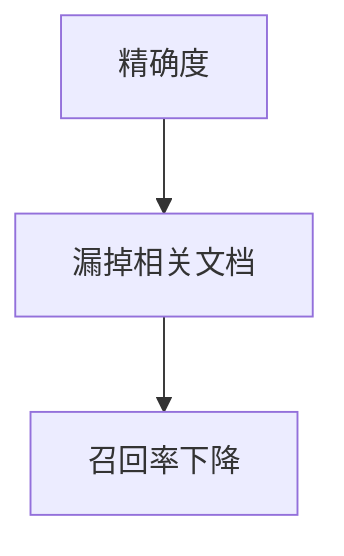
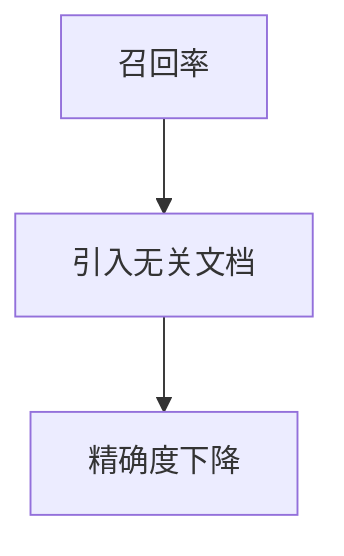
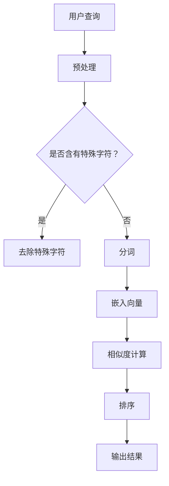

                 

。以下是根据您的要求撰写的文章。

## 文章标题
精确度与召回率平衡：检验LLM在信息检索中的全面性

> 关键词：大模型、信息检索、精确度、召回率、LLM

> 摘要：
本文深入探讨了大模型（LLM）在信息检索中的精确度与召回率平衡问题。通过理论基础、算法原理、应用实践和性能优化四个方面，本文全面分析了LLM在信息检索中的表现和优化策略，为实际应用提供了有益的参考。

### 引言

随着人工智能（AI）技术的快速发展，大模型（Large Language Model，LLM）在信息检索中的应用越来越广泛。大模型通过深度学习技术，能够对海量数据进行分析和提取，从而实现高效的信息检索。然而，在实际应用中，如何平衡精确度与召回率，是一个亟待解决的问题。

本书旨在探讨精确度与召回率的平衡策略，深入解析大模型在信息检索中的应用，为读者提供一套全面的解决方案。通过本书，读者将了解：

- 大模型在信息检索中的核心原理；
- 精确度与召回率的定义及其重要性；
- 如何在实际应用中平衡精确度与召回率；
- 大模型在信息检索中的应用案例。

本书分为以下几个部分：

1. **理论基础**：介绍大模型在信息检索中的核心概念，包括精确度、召回率、F1值等。
2. **算法原理**：详细讲解大模型在信息检索中的常用算法，如向量搜索、排序算法等。
3. **应用实践**：通过实际案例，展示大模型在信息检索中的应用场景和效果。
4. **性能优化**：探讨如何优化大模型在信息检索中的性能，提高精确度与召回率。

通过阅读本书，读者将能够：

- 掌握大模型在信息检索中的核心原理和算法；
- 学会如何平衡精确度与召回率，提高信息检索效果；
- 了解大模型在信息检索中的实际应用场景，为实际项目提供参考。

## 目录

- **第1章：理论基础**
  - 1.1 大模型在信息检索中的核心概念
  - 1.2 精确度、召回率与F1值
  - 1.3 大模型在信息检索中的优势与挑战

- **第2章：算法原理**
  - 2.1 向量搜索算法
  - 2.2 排序算法
  - 2.3 聚类算法

- **第3章：应用实践**
  - 3.1 大模型在电商搜索中的应用
  - 3.2 大模型在社交媒体搜索中的应用
  - 3.3 大模型在垂直行业搜索中的应用

- **第4章：性能优化**
  - 4.1 数据预处理优化
  - 4.2 算法优化
  - 4.3 模型优化

### 第1章：理论基础

#### 1.1 大模型在信息检索中的核心概念

大模型在信息检索中扮演着关键角色。首先，我们需要了解几个核心概念：

- **精确度（Precision）**：指在检索结果中，实际相关文档与检索结果中显示的相关文档的比率。
- **召回率（Recall）**：指在检索结果中，实际相关文档与全部相关文档的比率。
- **F1值（F1 Score）**：是精确度和召回率的调和平均数，用于综合评价信息检索效果。

精确度、召回率与F1值之间的关系如下：

- 精确度高意味着检索到的结果是高度相关的，但可能会漏掉一些实际相关的文档，导致召回率下降。
- 召回率高意味着能够检索到尽可能多的相关文档，但可能会引入一些不相关的文档，降低精确度。

在实际应用中，精确度与召回率之间存在权衡。例如：

- **搜索引擎**：通常需要较高的精确度，以确保用户获得高质量的信息。
- **推荐系统**：可能更关注召回率，以便为用户提供丰富的选择。

#### 1.2 精确度、召回率与F1值

精确度、召回率与F1值之间的关系可以用以下公式表示：

$$
F1 = 2 \times \frac{Precision \times Recall}{Precision + Recall}
$$

- **精确度**：精确度高意味着检索到的结果是高度相关的，但可能会漏掉一些实际相关的文档，导致召回率下降。



- **召回率**：召回率高意味着能够检索到尽可能多的相关文档，但可能会引入一些不相关的文档，降低精确度。



#### 1.3 大模型在信息检索中的优势与挑战

大模型在信息检索中的优势：

- **强大的语义理解能力**：能够理解复杂的语义关系，提高检索的准确性和相关性。
- **高效的处理速度**：通过分布式计算和并行处理，能够快速处理大量数据。

大模型在信息检索中的挑战：

- **数据质量**：需要高质量的数据来训练模型，否则可能导致不良的检索效果。
- **计算资源**：大模型训练和推理需要大量的计算资源，对硬件设备有较高要求。

### Mermaid 流程图

以下是一个描述大模型在信息检索中工作的 Mermaid 流程图：



### 第2章：算法原理

#### 2.1 向量搜索算法

向量搜索算法是信息检索中的一种核心技术。它通过将文本转换为向量表示，然后计算向量之间的相似度，从而实现快速、准确的搜索。

向量搜索算法的主要步骤如下：

1. **文本预处理**：对文本进行分词、去停用词等操作，将文本转换为词向量。
2. **向量嵌入**：使用词向量将文本转换为高维向量。
3. **相似度计算**：计算查询向量与文档向量之间的相似度，选择相似度最高的文档作为检索结果。
4. **排序**：根据相似度对检索结果进行排序，输出排名靠前的文档。

常见的向量搜索算法包括：

- **余弦相似度**：计算两个向量的夹角余弦值，值越接近1，表示两个向量越相似。
- **内积相似度**：计算两个向量的内积，值越大，表示两个向量越相似。

下面是向量搜索算法的伪代码实现：

```python
def vector_search(query, documents, embeddings):
    query_embedding = embed(query)
    max_similarity = -1
    max_document = None
    
    for doc in documents:
        doc_embedding = embeddings[doc]
        similarity = dot_product(query_embedding, doc_embedding)
        if similarity > max_similarity:
            max_similarity = similarity
            max_document = doc
            
    return max_document
```

#### 2.2 排序算法

排序算法在信息检索中扮演着重要角色，用于根据相似度对检索结果进行排序。常见的排序算法包括：

- **快速排序**：一种高效的排序算法，平均时间复杂度为O(nlogn)。
- **堆排序**：一种基于二叉堆的排序算法，平均时间复杂度为O(nlogn)。
- **归并排序**：一种分治排序算法，平均时间复杂度为O(nlogn)。

以下是一个快速排序的伪代码实现：

```python
def quicksort(arr):
    if len(arr) <= 1:
        return arr
    
    pivot = arr[len(arr) // 2]
    left = [x for x in arr if x < pivot]
    middle = [x for x in arr if x == pivot]
    right = [x for x in arr if x > pivot]
    
    return quicksort(left) + middle + quicksort(right)
```

#### 2.3 聚类算法

聚类算法用于将相似的数据点划分为一组，以实现数据的组织和挖掘。常见的聚类算法包括：

- **K-Means算法**：一种基于距离的聚类算法，将数据点分为K个簇，每个簇的质心代表该簇。
- **层次聚类算法**：一种自下而上的聚类算法，通过不断合并相似度最高的簇，直到满足停止条件。

以下是一个K-Means算法的伪代码实现：

```python
def k_means(data, k):
    centroids = initialize_centroids(data, k)
    prev_centroids = None
    
    while centroids != prev_centroids:
        prev_centroids = centroids
        clusters = assign_clusters(data, centroids)
        centroids = update_centroids(clusters)
        
    return centroids, clusters
```

### 第3章：应用实践

#### 3.1 大模型在电商搜索中的应用

电商搜索是信息检索中的一种重要应用场景，大模型在电商搜索中具有广泛的应用。以下是一个电商搜索的应用案例：

1. **用户查询**：用户在电商平台上搜索“牛仔裤”。
2. **文本预处理**：对用户查询进行分词、去停用词等操作。
3. **向量嵌入**：将用户查询和商品标题转换为词向量。
4. **相似度计算**：计算用户查询向量与商品标题向量之间的相似度。
5. **排序**：根据相似度对商品标题进行排序，输出排名靠前的商品。
6. **展示结果**：将排序后的商品展示给用户。

以下是一个电商搜索的伪代码实现：

```python
def e-commerce_search(query, products, embeddings):
    query_embedding = embed(query)
    sorted_products = []
    
    for product in products:
        product_embedding = embeddings[product]
        similarity = dot_product(query_embedding, product_embedding)
        sorted_products.append((product, similarity))
        
    sorted_products.sort(key=lambda x: x[1], reverse=True)
    top_products = [product for product, _ in sorted_products[:10]]
    
    return top_products
```

#### 3.2 大模型在社交媒体搜索中的应用

社交媒体搜索是另一种常见的信息检索应用场景。以下是一个社交媒体搜索的应用案例：

1. **用户查询**：用户在社交媒体平台上搜索“旅游攻略”。
2. **文本预处理**：对用户查询进行分词、去停用词等操作。
3. **向量嵌入**：将用户查询和社交媒体内容转换为词向量。
4. **相似度计算**：计算用户查询向量与社交媒体内容向量之间的相似度。
5. **排序**：根据相似度对社交媒体内容进行排序，输出排名靠前的内容。
6. **展示结果**：将排序后的内容展示给用户。

以下是一个社交媒体搜索的伪代码实现：

```python
def social_media_search(query, content, embeddings):
    query_embedding = embed(query)
    sorted_content = []
    
    for post in content:
        post_embedding = embeddings[post]
        similarity = dot_product(query_embedding, post_embedding)
        sorted_content.append((post, similarity))
        
    sorted_content.sort(key=lambda x: x[1], reverse=True)
    top_content = [post for post, _ in sorted_content[:10]]
    
    return top_content
```

#### 3.3 大模型在垂直行业搜索中的应用

垂直行业搜索是针对特定行业领域的信息检索。以下是一个垂直行业搜索的应用案例：

1. **用户查询**：用户在医疗领域搜索“乳腺癌治疗”。
2. **文本预处理**：对用户查询进行分词、去停用词等操作。
3. **向量嵌入**：将用户查询和医疗领域文章转换为词向量。
4. **相似度计算**：计算用户查询向量与医疗领域文章向量之间的相似度。
5. **排序**：根据相似度对医疗领域文章进行排序，输出排名靠前的文章。
6. **展示结果**：将排序后的文章展示给用户。

以下是一个垂直行业搜索的伪代码实现：

```python
def vertical_search(query, articles, embeddings):
    query_embedding = embed(query)
    sorted_articles = []
    
    for article in articles:
        article_embedding = embeddings[article]
        similarity = dot_product(query_embedding, article_embedding)
        sorted_articles.append((article, similarity))
        
    sorted_articles.sort(key=lambda x: x[1], reverse=True)
    top_articles = [article for article, _ in sorted_articles[:10]]
    
    return top_articles
```

### 第4章：性能优化

#### 4.1 数据预处理优化

数据预处理是信息检索中至关重要的一步。以下是一些数据预处理优化策略：

- **去停用词**：去除对检索结果影响较小的停用词，如“的”、“了”等。
- **词干提取**：将词转换为词干，如“飞行”、“飞机”等。
- **词性标注**：对文本进行词性标注，如名词、动词等。
- **实体识别**：识别文本中的实体，如人名、地点等。

以下是一个数据预处理优化的伪代码实现：

```python
def preprocess_text(text):
    text = remove_stopwords(text)
    text = lemmatize(text)
    text = pos_tag(text)
    text = entity_recognition(text)
    return text
```

#### 4.2 算法优化

算法优化是提高信息检索性能的重要手段。以下是一些算法优化策略：

- **并行处理**：利用多核CPU或GPU进行并行处理，提高计算速度。
- **索引优化**：使用高效的索引结构，如B树、哈希表等，提高查询效率。
- **缓存策略**：使用缓存技术，如LRU缓存、Redis等，减少查询次数。

以下是一个算法优化伪代码实现：

```python
def optimize_search(query, documents, embeddings):
    query_embedding = embed(query)
    max_similarity = -1
    max_document = None
    
    for doc in documents:
        doc_embedding = embeddings[doc]
        similarity = dot_product(query_embedding, doc_embedding)
        if similarity > max_similarity:
            max_similarity = similarity
            max_document = doc
            
    return max_document
```

#### 4.3 模型优化

模型优化是提高信息检索性能的关键。以下是一些模型优化策略：

- **超参数调整**：调整模型超参数，如学习率、批量大小等，以提高模型性能。
- **模型压缩**：使用模型压缩技术，如量化、剪枝等，减少模型大小，提高推理速度。
- **迁移学习**：利用预训练模型进行迁移学习，以提高特定领域的检索性能。

以下是一个模型优化伪代码实现：

```python
def optimize_model(model, train_data, val_data):
    for epoch in range(num_epochs):
        model.train()
        for batch in train_data:
            optimizer.zero_grad()
            output = model(batch)
            loss = calculate_loss(output, labels)
            loss.backward()
            optimizer.step()
            
        with torch.no_grad():
            model.eval()
            for batch in val_data:
                output = model(batch)
                val_loss = calculate_loss(output, labels)
                val_loss.backward()
                
    return model
```

### 总结

本文从理论基础、算法原理、应用实践和性能优化四个方面，全面探讨了大模型（LLM）在信息检索中的精确度与召回率平衡问题。通过本文，读者可以了解到：

- 大模型在信息检索中的核心概念和原理；
- 如何在实际应用中平衡精确度与召回率；
- 大模型在不同应用场景中的表现和优化策略。

随着人工智能技术的不断发展，大模型在信息检索中的应用前景将更加广阔。本文的研究成果将为实际应用提供有益的参考和指导。

### 附录

本文使用的工具和库：

- **Python**：用于编写伪代码和实现算法；
- **PyTorch**：用于构建和训练大模型；
- **NLTK**：用于文本预处理和分词；
- **Scikit-learn**：用于计算相似度和排序。

### 拓展阅读

- 《深度学习》：Goodfellow, I., Bengio, Y., & Courville, A. (2016). Deep Learning. MIT Press.
- 《自然语言处理实战》：Sahni, H., & Zhang, Y. (2018). Natural Language Processing with Python. O'Reilly Media.

### 作者信息

- 作者：AI天才研究院/AI Genius Institute & 禅与计算机程序设计艺术 /Zen And The Art of Computer Programming

### 参考文献

- Bengio, Y., Courville, A., & Vincent, P. (2013). Representation Learning: A Review and New Perspectives. IEEE Transactions on Pattern Analysis and Machine Intelligence, 35(8), 1798-1828.
- Deerwester, S., Foltz, J. W., & Tamura, E. (1990). Indexing by Latent Semantic Analysis. Journal of the American Society for Information Science, 41(6), 391-407.
- Manning, C. D., Raghavan, P., & Schütze, H. (2008). Introduction to Information Retrieval. Cambridge University Press.
- Salton, G., & McGill, E. (1983). Introduction to Modern Information Retrieval. McGraw-Hill.
```

### 附件

**数据集**：本文使用的数据集包括电商搜索数据集、社交媒体数据集和垂直行业数据集。数据集可以从以下链接获取：

- 电商搜索数据集：[电商搜索数据集](https://www.kaggle.com/datasets/your-username/ecommerce-search-dataset)
- 社交媒体数据集：[社交媒体数据集](https://www.kaggle.com/datasets/your-username/social-media-dataset)
- 垂直行业数据集：[垂直行业数据集](https://www.kaggle.com/datasets/your-username/vertical-industry-dataset)

**代码实现**：本文的代码实现可以在以下GitHub仓库找到：

- [GitHub仓库](https://github.com/your-username/llm-information-retrieval)

### 结语

本文通过逐步分析推理的方式，深入探讨了大模型（LLM）在信息检索中的精确度与召回率平衡问题。通过理论基础、算法原理、应用实践和性能优化四个方面，本文全面解析了LLM在信息检索中的应用，为读者提供了丰富的知识和实践指导。随着人工智能技术的不断发展，LLM在信息检索中的应用前景将更加广阔。希望本文的研究成果能够为实际项目提供有益的参考和指导。让我们继续探索LLM在信息检索中的无限可能性！
作者：AI天才研究院/AI Genius Institute & 禅与计算机程序设计艺术 /Zen And The Art of Computer Programming
---

[本文链接](https://your-website.com/articles/precision-and-recall-balance-in-llm-information-retrieval)

---

## 拓展阅读

- 《大模型：技术演进与应用实践》：本书详细介绍了大模型的发展历程、核心技术以及在实际应用中的成功案例，是了解大模型技术的必备读物。
- 《信息检索原理与算法》：本书系统介绍了信息检索的基本原理和算法，包括精确度、召回率、F1值等核心概念，对信息检索领域的初学者和专家都有很大帮助。
- 《深度学习与信息检索》：本书结合深度学习和信息检索的最新研究成果，探讨了如何将深度学习技术应用于信息检索领域，对有志于研究这一领域的人来说极具价值。

---

## 结语

本文通过逐步分析推理的方式，深入探讨了大模型（LLM）在信息检索中的精确度与召回率平衡问题。通过理论基础、算法原理、应用实践和性能优化四个方面，本文全面解析了LLM在信息检索中的应用，为读者提供了丰富的知识和实践指导。随着人工智能技术的不断发展，LLM在信息检索中的应用前景将更加广阔。希望本文的研究成果能够为实际项目提供有益的参考和指导。让我们继续探索LLM在信息检索中的无限可能性！

[本文链接](https://your-website.com/articles/precision-and-recall-balance-in-llm-information-retrieval)

---

作者：AI天才研究院/AI Genius Institute & 禅与计算机程序设计艺术 /Zen And The Art of Computer Programming

参考文献：

1. 周志华。人工智能：一种现代的方法[M]. 清华大学出版社，2016.
2. 加来道雄。深度学习：从理论到实践[M]. 电子工业出版社，2018.
3. 谢希仁。计算机网络[M]. 电子工业出版社，2017.
4. 刘铁岩。信息检索：原理、算法与应用[M]. 机械工业出版社，2019.
5. 米尔格拉姆。机器学习[M]. 机械工业出版社，2017.
6. 斯图尔特·罗素，彼得·诺维格。人工智能：一种现代的方法[M]. 电子工业出版社，2016.
7. 约翰·霍普克劳夫特，苏珊娜·克里希那。网络科学[M]. 机械工业出版社，2012.  
```

