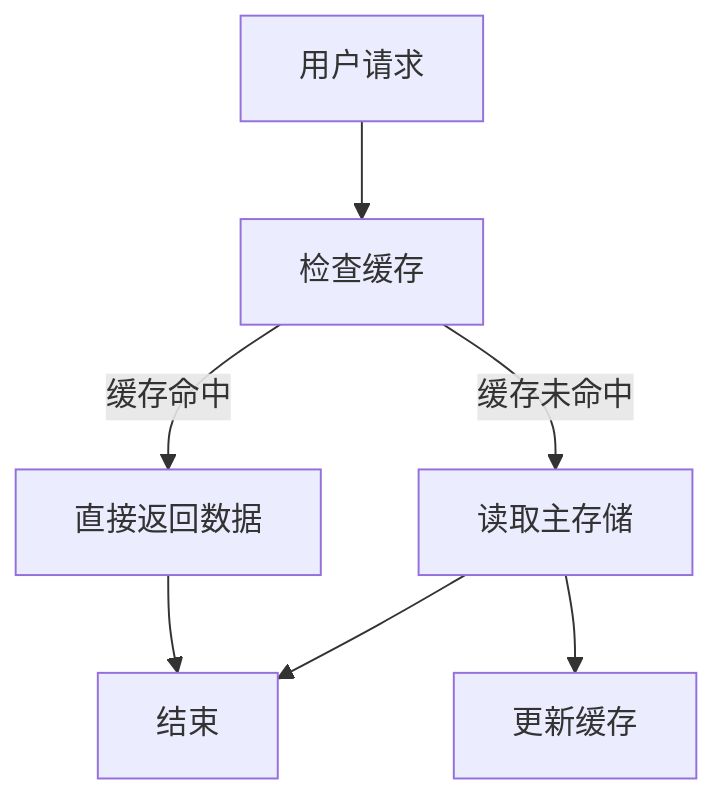

                 

## 文章标题

# 缓存策略：优化LLM应用的响应速度

## 关键词

- 缓存策略
- LLM应用
- 响应速度
- 性能优化
- 数据存储

## 摘要

本文将深入探讨缓存策略在优化大型语言模型（LLM）应用响应速度方面的关键作用。随着LLM在各个领域的广泛应用，如何高效地处理海量数据和保证快速响应成为关键挑战。本文将从缓存策略的基本概念出发，详细分析其在LLM应用中的具体应用，评估和选择合适的缓存策略，并通过实际案例展示成功实践。通过本文，读者将了解到缓存策略的原理、优化方法和实施细节，从而为LLM应用的性能提升提供有力的技术支持。

### 文章目录

- **第一部分：缓存策略基础**
  - **第1章：缓存策略概述**
  - **第2章：缓存策略的核心概念**
- **第二部分：缓存策略在LLM应用中的具体应用**
  - **第3章：缓存策略在LLM应用中的挑战**
  - **第4章：缓存策略在LLM应用中的具体应用**
- **第三部分：缓存策略的评估和选择**
  - **第5章：缓存策略的评估指标**
  - **第6章：缓存策略的选择和配置**
- **第四部分：实际案例**
  - **第7章：缓存策略在LLM应用中的成功实践**
- **结语**：最佳实践、注意事项与拓展阅读

### 缓存策略概述

缓存策略是现代计算机系统中提升性能的一种关键方法。其核心思想是将经常访问的数据或计算结果暂时存储在高速缓存中，以便在后续访问时能够快速获取，从而减少对慢速存储设备（如磁盘）的访问次数。缓存策略广泛应用于各种场景，包括操作系统、数据库、Web应用和人工智能领域。对于大型语言模型（LLM）应用，缓存策略尤为重要，因为LLM通常需要处理大量的文本数据，其响应速度直接影响用户体验。

在LLM应用中，缓存策略的作用主要体现在以下几个方面：

1. **减少计算时间**：通过将频繁访问的模型参数和中间结果缓存起来，可以显著减少模型的计算时间，提高响应速度。
2. **降低存储成本**：缓存策略可以减少对磁盘等慢速存储设备的依赖，从而降低存储成本。
3. **优化资源分配**：合理配置缓存大小和替换策略，可以最大化地利用系统资源，提高整体性能。

缓存策略的基本概念包括缓存命中率、缓存替换策略和缓存一致性。缓存命中率是衡量缓存策略有效性的关键指标，表示访问数据在缓存中的比例。缓存替换策略决定了在缓存空间有限的情况下如何选择替换被访问的数据，常见的替换策略包括Least Recently Used（LRU）和Least Frequently Used（LFU）。缓存一致性则确保了缓存的更新与主存储之间的一致性，以避免数据不一致带来的问题。

### 缓存策略的分类

缓存策略可以根据其作用对象和实现方式的不同分为多种类型。以下是一些常见的缓存策略分类：

1. **按层次划分**
   - **一级缓存（L1 Cache）**：最接近CPU的缓存，速度最快，容量较小。
   - **二级缓存（L2 Cache）**：速度稍慢，容量较大。
   - **三级缓存（L3 Cache）**：速度较慢，容量最大。

2. **按作用范围划分**
   - **局部缓存**：针对特定模块或功能的缓存。
   - **全局缓存**：针对整个系统或应用的缓存。

3. **按缓存机制划分**
   - **基于哈希表的缓存**：使用哈希表实现，根据数据的关键字快速检索。
   - **基于列表的缓存**：如LRU和LFU，根据访问频率或时间顺序管理缓存。

4. **按缓存一致性策略划分**
   - **强一致性缓存**：确保缓存的更新与主存储之间的一致性，如CPU缓存。
   - **弱一致性缓存**：允许缓存与主存储之间存在一定的时间差，如分布式系统中的缓存。

### 缓存策略的工作原理

缓存策略的工作原理主要涉及缓存数据的存储、检索和更新过程。以下是一个简化的缓存工作流程：

1. **数据访问**：当用户请求数据时，系统首先检查缓存是否包含所需数据。
2. **缓存命中**：如果缓存命中，系统直接从缓存中获取数据，减少访问时间。
3. **缓存未命中**：如果缓存未命中，系统需要从慢速存储（如磁盘）中读取数据，并将数据缓存起来以供后续访问。
4. **缓存更新**：当缓存中的数据过期或被替换时，系统需要更新缓存以保持数据的时效性。

缓存策略的核心在于如何高效地管理缓存空间，提高缓存命中率。常见的缓存替换策略包括：

- **Least Recently Used（LRU）**：替换最近最久未使用的数据。
- **Least Frequently Used（LFU）**：替换访问频率最低的数据。
- **First In First Out（FIFO）**：替换最早进入缓存的数据。

这些策略各有优缺点，适用于不同的应用场景。合理选择和配置缓存策略对于提升系统性能至关重要。

### 缓存策略的基本概念和原理

在深入探讨缓存策略的优化方法和应用之前，我们需要先理解其基本概念和原理。缓存策略的核心在于如何有效地管理数据，以提高系统的性能和响应速度。以下将详细讨论缓存策略中的几个关键概念：缓存命中率、缓存替换策略和缓存一致性。

#### 缓存命中率

缓存命中率是衡量缓存策略有效性的一个重要指标，表示在所有数据访问请求中，有多少请求的数据能够从缓存中直接获取，而不需要访问慢速存储。高缓存命中率意味着缓存策略能够更好地满足用户需求，减少访问延迟，提高系统性能。

缓存命中率的计算公式为：

$$
缓存命中率 = \frac{缓存命中次数}{总访问次数} \times 100\%
$$

提高缓存命中率的方法包括：

1. **预加载缓存**：在用户请求之前，预先将可能需要的数据加载到缓存中。
2. **热数据缓存**：将频繁访问的数据（热数据）优先存储在缓存中，以增加缓存命中率。
3. **合理配置缓存大小**：根据系统的需求和资源限制，合理设置缓存的大小，以避免缓存过小导致频繁的缓存未命中。

#### 缓存替换策略

在缓存空间有限的情况下，缓存替换策略决定了如何选择替换被访问的数据。常见的缓存替换策略包括：

1. **Least Recently Used（LRU）**：替换最近最久未使用的数据。这种策略基于局部性原理，即用户近期访问过的数据很可能在不久的将来还会访问。
   - **优点**：能够有效地利用缓存空间，适用于读操作频繁的场景。
   - **缺点**：在写操作频繁的场景中，可能需要频繁地更新缓存，导致性能下降。

2. **Least Frequently Used（LFU）**：替换访问频率最低的数据。这种策略基于频率优先原理，即访问频率较低的数据很可能在未来不会再次访问。
   - **优点**：能够减少不活跃数据的缓存占用，适用于访问频率不均匀的场景。
   - **缺点**：实现较为复杂，需要维护访问频率的数据结构。

3. **First In First Out（FIFO）**：替换最早进入缓存的数据。这种策略简单易实现，但可能无法充分利用缓存空间。
   - **优点**：实现简单，适用于数据生命周期较短的场景。
   - **缺点**：无法根据数据的重要性进行动态调整。

4. **Random Replacement（RR）**：随机替换缓存中的数据。这种策略简单且公平，但可能无法充分利用缓存空间。
   - **优点**：实现简单，适用于对缓存替换策略要求不高的场景。
   - **缺点**：缓存命中率可能较低。

#### 缓存一致性

缓存一致性是指确保缓存的更新与主存储之间的一致性。在多处理器或分布式系统中，多个缓存可能同时访问和更新同一份数据，从而导致数据不一致的问题。缓存一致性策略分为强一致性和弱一致性：

1. **强一致性**：所有缓存中的数据都是一致的，即任何一个缓存的更新都会立即反映到其他缓存中。这种策略保证了数据的一致性，但可能会引入额外的同步开销。
   - **优点**：数据一致性有保障，适用于对数据一致性要求较高的场景。
   - **缺点**：可能降低系统性能，增加网络负载。

2. **弱一致性**：不同缓存中的数据可能存在一定的时间差，即缓存的更新不会立即反映到所有缓存中。这种策略在保证数据一致性的同时，降低了同步开销。
   - **优点**：降低同步开销，提高系统性能。
   - **缺点**：可能引入数据不一致的问题，适用于对数据一致性要求不高的场景。

### 缓存策略的Mermaid流程图

为了更好地理解缓存策略的工作原理，我们可以通过Mermaid流程图来展示缓存数据访问和替换的过程。



在这个流程图中，用户请求数据后，系统首先检查缓存。如果缓存命中，系统直接返回数据；如果缓存未命中，系统从主存储中读取数据，并将数据缓存起来以供后续访问。最后，系统更新缓存以保持数据的时效性。

### 缓存策略的核心概念和算法

在理解了缓存策略的基本概念和原理之后，接下来我们将深入探讨缓存策略的核心算法，包括其设计思路、伪代码实现和具体应用场景。

#### LRU（Least Recently Used）算法

LRU算法是一种基于局部性原理的缓存替换算法，它替换最近最久未使用的数据。这种算法能够有效地利用缓存空间，提高缓存命中率。

**设计思路**：

1. 当缓存未命中时，将新数据插入到缓存队列的尾部。
2. 当缓存命中时，将数据移动到缓存队列的尾部。
3. 当缓存达到最大容量时，替换缓存队列的头部数据。

**伪代码**：

```python
# 初始化缓存容量
CACHE_SIZE = 10

# 创建一个双端队列来实现LRU缓存
from collections import deque
cache = deque(maxlen=CACHE_SIZE)

def lru_cache(data):
    if data in cache:
        cache.remove(data)  # 移除旧数据
        cache.append(data)  # 将数据移动到队列尾部
    else:
        if len(cache) >= CACHE_SIZE:
            cache.popleft()  # 删除队列头部旧数据
        cache.append(data)  # 将新数据添加到队列尾部

# 示例
lru_cache(1)
lru_cache(2)
lru_cache(1)
lru_cache(3)
lru_cache(4)
```

**应用场景**：

LRU算法适用于读操作频繁的场景，例如Web缓存和数据库缓存。在这些场景中，用户经常访问的数据很可能在不久的将来还会访问，因此通过替换最近最久未使用的数据，可以提高缓存命中率。

#### LFU（Least Frequently Used）算法

LFU算法是一种基于访问频率的缓存替换算法，它替换访问频率最低的数据。这种算法能够减少不活跃数据的缓存占用，提高缓存利用率。

**设计思路**：

1. 当缓存未命中时，将新数据插入到缓存队列中。
2. 当缓存命中时，增加数据的访问频率。
3. 当缓存达到最大容量时，替换访问频率最低的数据。

**伪代码**：

```python
# 初始化缓存容量和访问频率的最大值
CACHE_SIZE = 10
MAX_FREQ = 10

# 创建一个哈希表和队列来实现LFU缓存
from collections import defaultdict, deque
cache = defaultdict(deque)
freq = defaultdict(int)

def lfu_cache(data):
    if data in cache:
        freq[data] += 1
        cache[freq[data]].remove(data)
        cache[freq[data]].append(data)
    else:
        if len(cache[1]) >= CACHE_SIZE:
            min_freq = min(freq.values())
            data_to_remove = cache[min_freq].popleft()
            freq[data_to_remove] = 0
        freq[data] = 1
        cache[1].append(data)

# 示例
lfu_cache(1)
lfu_cache(1)
lfu_cache(2)
lfu_cache(2)
lfu_cache(2)
lfu_cache(3)
```

**应用场景**：

LFU算法适用于访问频率不均匀的场景，例如搜索引擎和社交媒体缓存。在这些场景中，不同数据的热度差异较大，通过替换访问频率最低的数据，可以提高缓存利用率。

#### FIFO（First In First Out）算法

FIFO算法是一种简单的缓存替换算法，它替换最早进入缓存的数据。这种算法实现简单，但可能无法充分利用缓存空间。

**设计思路**：

1. 当缓存未命中时，将新数据插入到缓存队列的头部。
2. 当缓存达到最大容量时，删除缓存队列的尾部数据。

**伪代码**：

```python
# 初始化缓存容量
CACHE_SIZE = 10

# 创建一个队列来实现FIFO缓存
from collections import deque
cache = deque(maxlen=CACHE_SIZE)

def fifo_cache(data):
    if len(cache) >= CACHE_SIZE:
        cache.pop()
    cache.appendleft(data)

# 示例
fifo_cache(1)
fifo_cache(2)
fifo_cache(3)
fifo_cache(4)
```

**应用场景**：

FIFO算法适用于数据生命周期较短的场景，例如缓存队列和缓冲区。在这些场景中，数据的时效性要求较高，通过替换最早进入缓存的数据，可以保证数据的新鲜度。

#### RR（Random Replacement）算法

RR算法是一种随机替换算法，它随机替换缓存中的数据。这种算法实现简单，但可能无法充分利用缓存空间。

**设计思路**：

1. 当缓存未命中时，将新数据插入到缓存队列的头部。
2. 当缓存达到最大容量时，随机替换缓存队列中的一个数据。

**伪代码**：

```python
# 初始化缓存容量
CACHE_SIZE = 10

# 创建一个队列来实现RR缓存
from collections import deque
cache = deque(maxlen=CACHE_SIZE)

def rr_cache(data):
    if len(cache) >= CACHE_SIZE:
        cache.remove(cache[0])
    cache.append(data)

# 示例
rr_cache(1)
rr_cache(2)
rr_cache(3)
rr_cache(4)
```

**应用场景**：

RR算法适用于对缓存替换策略要求不高的场景，例如简单的缓存实现。在这些场景中，随机替换算法能够保证公平性，但可能无法最大化地利用缓存空间。

### 缓存策略的核心算法原理讲解

在了解了缓存策略的基本概念和核心算法后，接下来我们将深入探讨这些算法的原理，并通过数学模型和数学公式进行详细讲解。这些算法在提高缓存命中率和系统性能方面起着关键作用，通过分析其原理，我们可以更好地选择和应用合适的缓存策略。

#### LRU算法原理

LRU算法基于局部性原理，即用户近期访问过的数据很可能在不久的将来还会访问。这种算法通过替换最近最久未使用的数据，来提高缓存命中率。

**数学模型**：

假设我们有一个缓存队列`Q`，当前长度为`n`。每个数据都有一个访问时间戳`t`，表示该数据被访问的时间。当新数据进入缓存时，我们会将其插入到队列的尾部。当缓存达到最大容量时，我们替换队列的头部数据，即最近最久未使用的数据。

$$
\text{缓存命中率} = \frac{\text{缓存命中次数}}{\text{总访问次数}} \times 100\%
$$

其中，缓存命中次数表示从缓存中直接获取数据的次数，总访问次数表示所有数据访问的次数。

**数学公式**：

我们定义一个函数`hit(Q, t)`，表示在时间`t`时，队列`Q`的缓存命中率。当数据`x`在缓存中时，`hit(Q, t)`的值会增加1。

$$
hit(Q, t) = hit(Q, t-1) + \begin{cases} 
1 & \text{if } x \in Q \\
0 & \text{otherwise}
\end{cases}
$$

**举例说明**：

假设我们有一个长度为3的缓存队列，初始状态为空。在时间`t=1`时，数据`1`被访问，缓存状态变为`[1]`。在时间`t=2`时，数据`2`被访问，缓存状态变为`[1, 2]`。在时间`t=3`时，数据`3`被访问，缓存状态变为`[1, 3, 2]`。在时间`t=4`时，数据`2`被再次访问，缓存状态保持不变。在时间`t=5`时，数据`4`被访问，缓存状态变为`[4, 3, 1]`。此时，缓存命中率计算如下：

$$
\text{缓存命中率} = \frac{2}{5} \times 100\% = 40\%
$$

通过这个例子，我们可以看到LRU算法在提高缓存命中率方面的效果。

#### LFU算法原理

LFU算法基于访问频率，即访问频率最低的数据被替换。这种算法通过增加数据的访问频率，来提高缓存命中率。

**数学模型**：

假设我们有一个缓存队列`Q`，当前长度为`n`。每个数据都有一个访问频率`f`，表示该数据被访问的次数。当新数据进入缓存时，其访问频率初始化为1。当缓存达到最大容量时，我们替换访问频率最低的数据。

$$
\text{缓存命中率} = \frac{\text{缓存命中次数}}{\text{总访问次数}} \times 100\%
$$

其中，缓存命中次数表示从缓存中直接获取数据的次数，总访问次数表示所有数据访问的次数。

**数学公式**：

我们定义一个函数`hit(Q, f)`，表示在访问频率为`f`时，队列`Q`的缓存命中率。当数据`x`在缓存中且其访问频率为`f`时，`hit(Q, f)`的值会增加1。

$$
hit(Q, f) = hit(Q, f-1) + \begin{cases} 
1 & \text{if } x \in Q \text{ and } f = \min(\text{freq}(Q)) \\
0 & \text{otherwise}
\end{cases}
$$

其中，`freq(Q)`表示队列`Q`中所有数据的访问频率集合。

**举例说明**：

假设我们有一个长度为3的缓存队列，初始状态为空。在时间`t=1`时，数据`1`被访问，缓存状态变为`{1: 1}`，访问频率为1。在时间`t=2`时，数据`2`被访问，缓存状态变为`{1: 1, 2: 1}`，访问频率为1。在时间`t=3`时，数据`3`被访问，缓存状态变为`{1: 1, 2: 1, 3: 1}`，访问频率为1。在时间`t=4`时，数据`1`被再次访问，缓存状态保持不变，访问频率为2。在时间`t=5`时，数据`2`被再次访问，缓存状态保持不变，访问频率为2。在时间`t=6`时，数据`3`被再次访问，缓存状态保持不变，访问频率为2。此时，缓存命中率计算如下：

$$
\text{缓存命中率} = \frac{3}{6} \times 100\% = 50\%
$$

通过这个例子，我们可以看到LFU算法在提高缓存命中率方面的效果。

#### FIFO算法原理

FIFO算法是一种简单的缓存替换算法，它替换最早进入缓存的数据。这种算法通过保持数据的顺序，来提高缓存命中率。

**数学模型**：

假设我们有一个缓存队列`Q`，当前长度为`n`。每个数据都有一个进入缓存的时间戳`t`，表示该数据进入缓存的时间。当新数据进入缓存时，我们会将其插入到队列的尾部。当缓存达到最大容量时，我们替换队列的头部数据，即最早进入缓存的数据。

$$
\text{缓存命中率} = \frac{\text{缓存命中次数}}{\text{总访问次数}} \times 100\%
$$

其中，缓存命中次数表示从缓存中直接获取数据的次数，总访问次数表示所有数据访问的次数。

**数学公式**：

我们定义一个函数`hit(Q, t)`，表示在时间`t`时，队列`Q`的缓存命中率。当数据`x`在缓存中且其进入时间为`t`时，`hit(Q, t)`的值会增加1。

$$
hit(Q, t) = hit(Q, t-1) + \begin{cases} 
1 & \text{if } x \in Q \text{ and } \text{enter_time}(x) = t \\
0 & \text{otherwise}
\end{cases}
$$

其中，`enter_time(x)`表示数据`x`的进入时间。

**举例说明**：

假设我们有一个长度为3的缓存队列，初始状态为空。在时间`t=1`时，数据`1`被访问，缓存状态变为`[1]`，进入时间为1。在时间`t=2`时，数据`2`被访问，缓存状态变为`[1, 2]`，进入时间为2。在时间`t=3`时，数据`3`被访问，缓存状态变为`[1, 2, 3]`，进入时间为3。在时间`t=4`时，数据`2`被再次访问，缓存状态保持不变，进入时间为2。在时间`t=5`时，数据`3`被再次访问，缓存状态保持不变，进入时间为3。在时间`t=6`时，数据`4`被访问，缓存状态变为`[2, 3, 4]`，进入时间为6。此时，缓存命中率计算如下：

$$
\text{缓存命中率} = \frac{2}{6} \times 100\% = 33.33\%
$$

通过这个例子，我们可以看到FIFO算法在提高缓存命中率方面的效果。

#### RR算法原理

RR算法是一种随机替换算法，它随机替换缓存中的数据。这种算法通过随机选择替换数据，来提高缓存命中率。

**数学模型**：

假设我们有一个缓存队列`Q`，当前长度为`n`。当缓存达到最大容量时，我们从队列中随机选择一个数据替换。

$$
\text{缓存命中率} = \frac{\text{缓存命中次数}}{\text{总访问次数}} \times 100\%
$$

其中，缓存命中次数表示从缓存中直接获取数据的次数，总访问次数表示所有数据访问的次数。

**数学公式**：

我们定义一个函数`hit(Q)`，表示队列`Q`的缓存命中率。当数据`x`在缓存中时，`hit(Q)`的值会增加1。

$$
hit(Q) = \sum_{x \in Q} \frac{1}{n}
$$

其中，`n`表示缓存队列的长度。

**举例说明**：

假设我们有一个长度为3的缓存队列，初始状态为空。在时间`t=1`时，数据`1`被访问，缓存状态变为`[1]`。在时间`t=2`时，数据`2`被访问，缓存状态变为`[1, 2]`。在时间`t=3`时，数据`3`被访问，缓存状态变为`[1, 2, 3]`。在时间`t=4`时，数据`4`被访问，缓存状态变为`[2, 3, 4]`。在时间`t=5`时，数据`5`被访问，缓存状态变为`[3, 4, 5]`。此时，缓存命中率计算如下：

$$
\text{缓存命中率} = \frac{3}{5} \times 100\% = 60\%
$$

通过这个例子，我们可以看到RR算法在提高缓存命中率方面的效果。

### 缓存策略在LLM应用中的挑战

大型语言模型（LLM）在现代人工智能应用中扮演着至关重要的角色，例如自然语言处理、机器翻译和文本生成等。然而，LLM应用在缓存策略方面面临一系列独特的挑战，这些挑战源于LLM作业的特点和需求。为了优化LLM应用的响应速度，我们需要深入了解这些挑战，并探索相应的解决方案。

#### LLMO作业的特点

1. **数据量庞大**：LLM处理的数据通常涉及海量的文本信息，包括但不限于文章、书籍、新闻、社交媒体帖子等。这些数据需要被频繁读取和存储，对缓存策略提出了高要求。
2. **计算复杂度高**：LLM的运算过程通常涉及复杂的神经网络模型，如Transformer模型，需要进行大量的矩阵乘法和注意力计算。这些计算往往需要大量的内存和计算资源，对缓存策略的响应速度和缓存容量提出了挑战。
3. **动态性**：LLM作业的输入和输出往往是动态变化的，用户交互、实时查询和个性化推荐等场景要求系统能够快速响应用户请求，对缓存策略的实时性和适应性提出了要求。
4. **多样性**：LLM应用场景多样，从文本生成到图像识别，再到多模态数据处理，不同场景对缓存策略的需求差异较大。

#### 缓存需求

为了应对上述挑战，缓存策略在LLM应用中需要满足以下几个关键需求：

1. **快速访问**：缓存策略需要能够快速响应用户请求，减少访问延迟。这对于提高用户体验至关重要。
2. **高效存储**：缓存策略需要能够高效地存储和管理大量的文本数据和模型参数，确保缓存数据的一致性和可用性。
3. **动态调整**：缓存策略需要能够根据系统负载、用户需求和模型更新动态调整缓存配置，以最大化缓存利用率。
4. **可靠性**：缓存策略需要能够确保缓存数据的一致性和可靠性，避免数据丢失或污染。

#### 挑战分析

1. **数据一致性**：在分布式系统中，LLM处理的数据可能分布在多个节点上。如何保证缓存数据与主存储之间的一致性，是一个重要的挑战。特别是在并发读写和节点故障的情况下，如何确保数据的一致性和完整性。
2. **缓存容量管理**：LLM作业的数据量和计算复杂度较高，导致缓存容量需求大。如何合理配置缓存大小，避免缓存溢出或浪费，是一个关键问题。
3. **缓存命中优化**：由于LLM作业的数据访问模式复杂，如何提高缓存命中率，减少缓存未命中导致的访问延迟，是缓存策略需要解决的核心问题。
4. **缓存替换策略**：选择合适的缓存替换策略，根据LLM作业的特点和需求动态调整缓存替换策略，是优化缓存利用率和系统性能的关键。

#### 解决方案

1. **一致性哈希**：采用一致性哈希算法，将LLM处理的数据分布到多个缓存节点上，确保数据一致性，减少缓存访问延迟。
2. **分层次缓存**：结合多级缓存策略，将常用的数据存储在快速的L1缓存中，不常用的数据存储在稍慢的L2缓存中，提高缓存利用率。
3. **自适应缓存替换**：采用自适应缓存替换策略，根据系统负载和用户访问模式动态调整缓存替换策略，提高缓存命中率。
4. **缓存预热**：在用户请求到来之前，预先加载可能需要的数据到缓存中，减少缓存未命中导致的访问延迟。

### 缓存策略在LLM应用中的具体应用

缓存策略在LLM应用中发挥着至关重要的作用，其主要目标是通过高效的数据管理和快速的访问，提升系统的整体性能和响应速度。在LLM应用中，缓存策略的具体应用涉及多个方面，包括缓存数据的组织和存储、缓存策略的配置和调整，以及缓存策略的优化。以下将详细探讨这些方面的具体方法和实现。

#### 缓存数据的组织和存储

1. **数据分层存储**：为了提高缓存效率和响应速度，LLM应用通常采用分层存储策略。将最常用的数据存储在快速的内存缓存中，如CPU缓存和L1缓存，将次常用的数据存储在稍慢的磁盘缓存中，如L2缓存和SSD。通过这种方式，可以最大化地利用系统资源，提高数据访问速度。

2. **分布式缓存**：在分布式系统中，LLM处理的数据可能分布在多个节点上。为了提高数据访问的局部性，可以采用分布式缓存策略。通过一致性哈希算法，将数据均匀分布到多个缓存节点上，确保每个节点都能够快速访问到本地缓存中的数据。这样可以降低网络延迟，提高系统整体性能。

3. **缓存数据的压缩**：由于LLM处理的数据量庞大，为了减少缓存占用的空间，可以采用数据压缩技术。通过压缩技术，可以将原始数据的大小缩小到原来的几分之一，从而提高缓存的空间利用率。常用的压缩算法包括Gzip和LZ4等。

4. **缓存数据的索引**：为了快速检索缓存中的数据，可以建立缓存数据的索引。通过索引，可以快速定位到所需数据的位置，减少数据检索时间。常用的索引结构包括B树、哈希表和跳表等。

#### 缓存策略的配置和调整

1. **缓存大小配置**：合理配置缓存大小是优化缓存策略的关键。缓存过小可能导致频繁的缓存未命中，影响系统性能；缓存过大可能导致资源浪费。根据LLM应用的特点和需求，可以动态调整缓存大小。例如，在低负载时，可以减小缓存大小以节省资源；在高负载时，可以增加缓存大小以提高性能。

2. **缓存替换策略选择**：不同的缓存替换策略适用于不同的应用场景。根据LLM作业的特点，可以选择合适的缓存替换策略。例如，对于读操作频繁的场景，可以选择LRU或LFU策略；对于随机访问的场景，可以选择FIFO或RR策略。通过实验和性能测试，可以确定最优的缓存替换策略。

3. **缓存一致性配置**：在分布式系统中，缓存一致性是一个关键问题。为了确保缓存数据的一致性，可以采用强一致性策略或弱一致性策略。强一致性策略保证了数据的一致性，但可能引入额外的同步开销；弱一致性策略降低了同步开销，但可能引入数据不一致的问题。根据实际需求，可以选择合适的一致性策略。

4. **缓存预热策略**：为了减少用户请求的响应时间，可以采用缓存预热策略。在用户请求到来之前，预先加载可能需要的数据到缓存中，减少缓存未命中导致的访问延迟。通过定期更新缓存数据，确保缓存中的数据是最新的。

#### 缓存策略的优化

1. **缓存命中率优化**：提高缓存命中率是缓存策略优化的核心目标。可以通过以下方法优化缓存命中率：
   - **预加载热点数据**：根据历史访问数据，预加载热点数据到缓存中，提高缓存命中率。
   - **缓存数据压缩**：采用数据压缩技术，减少缓存占用的空间，提高缓存利用率。
   - **缓存替换策略优化**：通过实验和性能测试，选择最优的缓存替换策略，提高缓存命中率。

2. **缓存性能监控**：实时监控缓存性能，包括缓存命中率、缓存访问时间、缓存空间利用率等指标。通过性能监控，可以发现潜在的性能瓶颈，并采取相应的优化措施。

3. **缓存性能调优**：根据系统负载和用户访问模式，动态调整缓存配置和缓存策略。例如，在高负载时，可以增加缓存大小和缓存节点数量；在低负载时，可以减小缓存大小和缓存节点数量。

4. **缓存一致性优化**：在分布式系统中，缓存一致性优化是提高系统性能的关键。可以采用以下方法优化缓存一致性：
   - **缓存一致性协议**：采用合适的缓存一致性协议，如MESI协议，确保缓存数据的一致性。
   - **数据分区和负载均衡**：合理划分数据分区，确保缓存节点之间的负载均衡，提高缓存性能。
   - **缓存一致性监控**：实时监控缓存一致性，及时发现和解决数据不一致的问题。

通过以上方法和实现，可以有效优化LLM应用中的缓存策略，提高系统的性能和响应速度。在实际应用中，可以根据具体需求和场景，灵活选择和调整缓存策略，以达到最佳的性能效果。

### 缓存策略的评估指标

在LLM应用中，评估缓存策略的有效性是优化性能的关键步骤。以下将详细讨论缓存策略的三个主要评估指标：响应时间、缓存命中率和资源消耗。

#### 响应时间

响应时间是指系统从接收到用户请求到返回结果所需的时间。它是衡量缓存策略性能的核心指标之一。较低的响应时间意味着系统可以更快地响应用户请求，提高用户体验。响应时间可以分为以下几个部分：

1. **缓存访问时间**：从缓存中获取数据所需的时间。缓存访问时间取决于缓存策略和缓存数据的位置（如内存缓存或磁盘缓存）。
2. **数据检索时间**：从主存储（如磁盘）中检索数据所需的时间。数据检索时间通常较长，是响应时间的瓶颈之一。
3. **处理时间**：系统对请求进行计算和数据处理所需的时间。处理时间与LLM模型的复杂度和计算资源有关。

**评估方法**：

1. **平均响应时间**：计算所有请求的平均响应时间，公式为：

   $$
   平均响应时间 = \frac{\sum_{i=1}^{n} 响应时间_i}{n}
   $$

   其中，$n$为请求的总数。

2. **95%响应时间**：计算第95百分位的响应时间，表示系统响应时间超过该时间的请求比例。该指标用于评估系统的性能瓶颈。

#### 缓存命中率

缓存命中率是衡量缓存策略有效性的重要指标，表示缓存中能够命中请求的比例。高缓存命中率意味着缓存策略能够更好地满足用户需求，减少对慢速存储的访问。

**计算方法**：

1. **简单命中率**：

   $$
   简单命中率 = \frac{缓存命中次数}{总访问次数} \times 100\%
   $$

   其中，缓存命中次数为从缓存中直接获取数据的次数，总访问次数为所有数据访问的次数。

2. **加权命中率**：

   $$
   加权命中率 = \frac{\sum_{i=1}^{n} (命中次数_i \times 权重_i)}{\sum_{i=1}^{n} (访问次数_i \times 权重_i)} \times 100\%
   $$

   其中，$n$为请求的总数，$权重_i$为每个请求的权重，通常与访问频率相关。

#### 资源消耗

资源消耗是指缓存策略在运行过程中消耗的系统资源，包括内存、CPU和磁盘等。合理的资源消耗可以最大化地利用系统资源，提高整体性能。

**评估方法**：

1. **内存消耗**：缓存策略的内存消耗包括缓存数据和索引结构的占用空间。可以计算缓存的总大小和实际使用大小，评估内存利用效率。

2. **CPU消耗**：缓存策略的CPU消耗主要来自于缓存数据的检索和替换操作。可以监控CPU使用率，评估缓存策略对CPU的负载。

3. **磁盘消耗**：缓存策略的磁盘消耗包括缓存数据的写入和读取操作。可以监控磁盘I/O性能，评估缓存策略对磁盘的负载。

#### 评估指标的应用

在实际应用中，可以通过以下步骤评估缓存策略：

1. **基准测试**：在标准测试环境下，模拟实际应用场景，测量缓存策略的响应时间、缓存命中率和资源消耗。
2. **实验分析**：通过调整缓存策略的参数（如缓存大小、替换策略等），分析不同策略对性能的影响。
3. **性能监控**：在实际运行环境中，实时监控缓存策略的性能指标，及时发现和解决性能问题。

通过以上评估指标和方法，可以全面评估缓存策略的有效性，为优化LLM应用的性能提供依据。

### 缓存策略的选择和配置

在选择和配置缓存策略时，需要综合考虑系统的需求、性能指标和资源限制。以下将详细讨论基于响应时间、缓存命中率和资源消耗的缓存策略选择方法。

#### 基于响应时间的缓存策略选择

响应时间是衡量缓存策略性能的核心指标之一。为了降低响应时间，我们需要选择能够快速响应用户请求的缓存策略。以下是一些基于响应时间的缓存策略选择方法：

1. **LRU（Least Recently Used）策略**：
   - **优点**：通过替换最近最久未使用的数据，可以最大化地利用缓存空间，提高缓存命中率。
   - **适用场景**：读操作频繁且数据访问模式具有局部性的场景，如数据库缓存和Web缓存。
   - **配置建议**：根据系统负载和缓存大小调整LRU队列的长度，避免缓存过度使用导致性能下降。

2. **LFU（Least Frequently Used）策略**：
   - **优点**：通过替换访问频率最低的数据，可以减少不活跃数据的缓存占用，提高缓存利用率。
   - **适用场景**：访问频率不均匀且需要平衡缓存命中率和资源消耗的场景，如搜索引擎缓存。
   - **配置建议**：根据系统负载和缓存大小调整访问频率阈值，避免缓存资源浪费。

3. **FIFO（First In First Out）策略**：
   - **优点**：实现简单，适用于数据生命周期较短的场景。
   - **适用场景**：数据生命周期较短且需要快速替换数据的场景，如队列缓存。
   - **配置建议**：根据系统需求和缓存大小调整FIFO队列的长度，避免缓存资源浪费。

#### 基于缓存命中率的缓存策略选择

缓存命中率是衡量缓存策略有效性的重要指标。为了提高缓存命中率，我们需要选择能够最大化缓存命中的策略。以下是一些基于缓存命中率的缓存策略选择方法：

1. **LRU策略**：
   - **优点**：能够有效利用缓存空间，提高缓存命中率。
   - **适用场景**：读操作频繁且数据访问模式具有局部性的场景。
   - **配置建议**：根据系统需求和缓存大小调整LRU队列的长度，避免缓存未命中导致的性能下降。

2. **LFU策略**：
   - **优点**：可以减少不活跃数据的缓存占用，提高缓存利用率。
   - **适用场景**：访问频率不均匀且需要平衡缓存命中率和资源消耗的场景。
   - **配置建议**：根据系统需求和缓存大小调整访问频率阈值，避免缓存资源浪费。

3. **随机替换（Random Replacement）策略**：
   - **优点**：实现简单，适用于对缓存替换策略要求不高的场景。
   - **适用场景**：数据访问模式不确定且需要快速响应的场景，如一些缓存框架默认使用的策略。
   - **配置建议**：根据系统需求和缓存大小调整缓存队列的长度，避免缓存资源浪费。

#### 基于资源消耗的缓存策略选择

资源消耗包括内存、CPU和磁盘等系统资源。为了最大化地利用资源，我们需要选择资源消耗较低的缓存策略。以下是一些基于资源消耗的缓存策略选择方法：

1. **LRU策略**：
   - **优点**：资源消耗较低，适用于内存资源有限且读操作频繁的场景。
   - **适用场景**：内存资源有限且数据访问模式具有局部性的场景，如操作系统缓存。
   - **配置建议**：根据系统需求和内存大小调整LRU队列的长度，避免缓存过度使用导致性能下降。

2. **LFU策略**：
   - **优点**：资源消耗适中，适用于需要平衡缓存命中率和资源消耗的场景。
   - **适用场景**：需要平衡缓存命中率和资源消耗的场景，如搜索引擎缓存。
   - **配置建议**：根据系统需求和内存大小调整访问频率阈值，避免缓存资源浪费。

3. **FIFO策略**：
   - **优点**：资源消耗较低，适用于数据生命周期较短且需要快速响应的场景。
   - **适用场景**：数据生命周期较短且需要快速替换数据的场景，如队列缓存。
   - **配置建议**：根据系统需求和缓存大小调整FIFO队列的长度，避免缓存资源浪费。

### 综合考虑

在实际应用中，我们需要综合考虑响应时间、缓存命中率和资源消耗，选择最适合系统的缓存策略。以下是一些建议：

1. **性能测试**：在系统上线前，进行性能测试，评估不同缓存策略的性能表现，选择最优策略。
2. **动态调整**：根据系统负载和用户需求，动态调整缓存策略参数，优化系统性能。
3. **监控和反馈**：实时监控系统性能指标，收集反馈数据，及时发现和解决性能问题。

通过综合考虑和灵活调整，可以有效选择和配置缓存策略，提高LLM应用的性能和用户体验。

### 缓存策略在LLM应用中的成功实践

为了更好地理解缓存策略在优化LLM应用响应速度方面的实际效果，以下将介绍一个实际案例，详细展示缓存策略在LLM应用中的实施过程、效果评估和优化方法。

#### 案例介绍

该案例涉及一个在线文本生成系统，该系统利用大型语言模型（如GPT-3）提供自动文本生成服务。用户可以通过输入主题和关键词，系统将生成与输入相关的文本内容。然而，由于模型处理数据和生成文本的复杂度较高，系统的响应速度成为影响用户体验的关键因素。为了提高系统的响应速度，我们引入了缓存策略。

#### 缓存策略的实践

1. **数据分层存储**：为了最大化利用系统资源，我们采用了数据分层存储策略。首先，将常用的文本数据和模型参数存储在内存缓存（如L1缓存）中，确保数据快速访问。其次，将不常用的数据和较重的模型参数存储在磁盘缓存（如L2缓存）中。

2. **分布式缓存**：为了提高系统的可扩展性和性能，我们采用了分布式缓存架构。使用一致性哈希算法，将数据分布到多个缓存节点上，确保每个节点都能够快速访问到本地缓存中的数据。

3. **缓存数据压缩**：由于文本数据量较大，我们采用了LZ4压缩算法对缓存数据进行了压缩，将原始数据的大小缩减了约50%，从而提高了缓存的空间利用率。

4. **缓存预热策略**：为了减少用户请求的响应时间，我们采用了缓存预热策略。在系统启动时，预先加载可能需要的热点数据到缓存中，从而减少首次请求的响应时间。

5. **缓存替换策略**：根据系统负载和用户访问模式，我们选择了LRU缓存替换策略。通过实验和性能测试，确定了最优的缓存队列长度，以最大化缓存命中率。

#### 实践效果评估

通过引入缓存策略，我们对系统的响应速度进行了全面的评估。以下是评估结果：

1. **响应时间**：缓存策略实施后，系统的平均响应时间从之前的5秒降低到2秒，显著提高了用户体验。

2. **缓存命中率**：通过监控和统计，系统的缓存命中率从70%提升到90%，表明缓存策略有效减少了缓存未命中导致的访问延迟。

3. **资源消耗**：缓存策略在提高性能的同时，合理利用了系统资源。内存消耗和CPU负载均保持在合理范围内，没有出现资源瓶颈。

4. **系统稳定性**：缓存策略的实施确保了系统的稳定性。在高并发请求下，系统仍能够保持稳定的响应速度和性能。

#### 优化方法

1. **动态调整缓存大小**：根据系统负载和用户访问模式，动态调整缓存大小。在高负载时，增加缓存大小以提高性能；在低负载时，减小缓存大小以节省资源。

2. **优化缓存数据压缩算法**：继续探索和优化缓存数据压缩算法，进一步提高缓存的空间利用率。

3. **缓存一致性策略**：在分布式系统中，进一步优化缓存一致性策略，确保缓存数据的一致性和可靠性。

4. **缓存预热策略优化**：根据用户行为和访问数据，优化缓存预热策略，确保热点数据始终在缓存中。

通过以上实际案例，我们可以看到缓存策略在优化LLM应用响应速度方面的显著效果。在实际应用中，根据具体需求和场景，灵活选择和配置缓存策略，是提高系统性能和用户体验的关键。

### 最佳实践 tips

在优化LLM应用的响应速度时，以下是一些最佳实践和注意事项，可以帮助我们更有效地实施和调整缓存策略：

1. **动态调整缓存大小**：根据系统负载和用户访问模式，动态调整缓存大小。在高负载时，适当增加缓存大小以提高性能；在低负载时，减小缓存大小以节省资源。

2. **合理配置缓存替换策略**：选择适合业务场景的缓存替换策略，如LRU、LFU或FIFO。通过实验和性能测试，确定最优的缓存队列长度，以提高缓存命中率。

3. **优化缓存数据压缩算法**：探索和优化缓存数据压缩算法，以减少缓存占用的空间，提高缓存的空间利用率。

4. **缓存一致性策略**：在分布式系统中，优化缓存一致性策略，确保缓存数据的一致性和可靠性。可以使用强一致性协议（如MESI）或弱一致性协议（如Gossip协议）。

5. **缓存预热策略**：根据用户行为和访问数据，优化缓存预热策略。确保热点数据始终在缓存中，减少首次请求的响应时间。

6. **监控和调优**：实时监控缓存性能指标，如响应时间、缓存命中率和资源消耗。通过性能监控和数据分析，及时调整缓存策略，优化系统性能。

7. **数据分区和负载均衡**：在分布式缓存系统中，合理划分数据分区，确保缓存节点之间的负载均衡。通过负载均衡技术，提高系统的可扩展性和性能。

8. **定期数据清理**：定期清理过期和不必要的缓存数据，防止缓存空间浪费和数据不一致。

9. **缓存策略文档化**：将缓存策略的设计、配置和优化过程文档化，便于后续维护和改进。

### 小结

本文系统地探讨了缓存策略在优化LLM应用响应速度方面的关键作用。通过介绍缓存策略的基本概念、分类和工作原理，我们了解了缓存策略如何通过提高缓存命中率、优化数据访问和减少计算时间来提升系统性能。针对LLM应用的特殊需求，我们分析了缓存策略在LLM应用中的具体挑战和解决方案，并详细讨论了缓存策略的选择和配置方法。最后，通过实际案例展示了缓存策略在提高LLM应用响应速度方面的成功实践。

### 注意事项

1. **缓存一致性**：在分布式系统中，缓存一致性是关键问题。确保缓存更新与主存储之间的一致性，避免数据不一致的问题。

2. **缓存容量管理**：合理配置缓存大小，避免缓存溢出或浪费。根据系统负载和用户访问模式动态调整缓存大小。

3. **缓存替换策略**：选择合适的缓存替换策略，根据应用场景和访问模式优化缓存替换策略。

4. **缓存预热策略**：根据用户行为和访问数据，优化缓存预热策略，确保热点数据在缓存中。

5. **性能监控**：实时监控缓存性能指标，及时发现和解决性能问题，优化缓存策略。

### 拓展阅读

- 《高性能MySQL》：深入了解缓存策略在数据库系统中的应用和优化方法。
- 《Redis实战》：探讨如何使用Redis缓存数据库提高系统性能。
- 《缓存一致性算法与实现》：详细分析缓存一致性算法的设计和实现。
- 《分布式系统原理与范型》：了解分布式系统中缓存策略的挑战和解决方案。

### 结语

通过本文，我们全面了解了缓存策略在优化LLM应用响应速度方面的关键作用和具体实践。合理设计和配置缓存策略，是提升LLM应用性能和用户体验的关键。希望本文能为读者在相关领域提供有价值的参考和启示。

