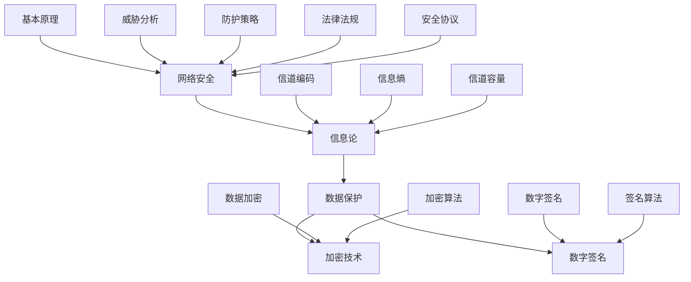

                 


### 文章标题：网络安全的信息论：数据保护的数学原理

### 关键词：网络安全、信息论、数据保护、数学原理、加密、数字签名

### 摘要：
本文深入探讨了网络安全与信息论之间的关系，以及如何运用数学原理来保护数据安全。文章首先介绍了网络安全和信息论的基本概念，然后详细讲解了信息熵、信道编码和信道容量的基本理论，并使用伪代码阐述了核心算法原理。接着，文章重点分析了数据加密和数字签名的数学模型，展示了如何使用LaTeX格式表示数学公式。最后，通过实际项目案例，本文展示了如何将理论应用到实际开发中，并进行了详细的代码解读和分析。文章旨在为读者提供一个全面、系统的网络安全数据保护方案。

----------------------------------------------------------------

### 用户需求解读

用户希望获得一篇结构清晰、内容详实、逻辑严密的技术博客文章，文章应围绕网络安全的信息论和数据保护的数学原理展开。文章应包含以下几个关键要素：

1. **文章格式**：使用markdown格式，确保文章结构清晰，易于阅读。
2. **作者信息**：在文章末尾标注作者信息，增强文章的可信度。
3. **内容完整性**：文章内容应涵盖背景介绍、核心概念与联系、核心算法原理讲解、数学模型和公式讲解、项目实战等。
4. **具体要求**：
   - **背景介绍**：为读者提供网络安全和信息论的基本背景知识。
   - **核心概念与联系**：使用Mermaid流程图展示核心概念之间的关系。
   - **核心算法原理讲解**：使用伪代码详细阐述算法原理。
   - **数学模型和公式讲解**：使用LaTeX格式展示并解释数学公式。
   - **项目实战**：描述开发环境搭建、代码实现、代码解读和分析。
   - **最佳实践 tips、小结、注意事项、拓展阅读**：为读者提供实用建议和深入学习的方向。

文章的字数应在8000～12000字之间，以确保内容的深度和广度。

### 大纲设计思路

为了满足用户的需求，本文将采用以下大纲设计思路：

#### 第一部分：引言与核心概念
- **引言**：介绍网络安全、信息论和数据保护的基本概念，激发读者的兴趣。
- **核心概念与联系**：通过Mermaid流程图，展示网络安全、信息论和数据保护之间的核心概念及其相互关系。

#### 第二部分：信息论基础
- **基本理论**：讲解信息熵、信道编码和信道容量的基本概念。
- **算法原理**：使用伪代码详细阐述常见的算法原理，帮助读者理解。

#### 第三部分：数学模型与应用
- **数学模型**：详细讲解数据加密和数字签名的数学模型。
- **公式与举例**：使用LaTeX格式展示数学公式，并通过举例说明如何应用这些公式。

#### 第四部分：实战案例
- **项目背景**：介绍项目背景和目标。
- **开发环境**：描述开发环境搭建过程。
- **代码实现**：展示代码实现和详细解释。
- **分析**：对代码和项目进行解读与分析。

#### 第五部分：总结与展望
- **总结**：回顾全书核心内容。
- **展望**：对未来的研究和发展趋势进行展望。

### 大纲设计步骤

1. **初步框架**：列出主要章节和次要章节，确保大纲结构完整。
2. **细化内容**：在每个章节下细分小节，确保覆盖所有核心内容。
3. **完善格式**：确保使用markdown格式，并按照1级、2级、3级目录的规范进行排版。
4. **审核修正**：检查大纲的完整性、逻辑性和字数限制。

### 大纲示例

```
# 网络安全的信息论：数据保护的数学原理

## 引言与核心概念

## 1.1 网络安全概述
### 1.1.1 网络安全的定义
### 1.1.2 网络安全的重要性
### 1.1.3 网络安全的主要威胁

## 1.2 信息论基础
### 1.2.1 信息论的基本概念
#### 1.2.1.1 信息熵
#### 1.2.1.2 信道容量
### 1.2.2 信息论与网络安全的关系

## 信息论基础

## 2.1 信息熵
### 2.1.1 信息熵的定义
### 2.1.2 信息熵的计算
### 2.1.3 信息熵的应用

## 2.2 信道编码
### 2.2.1 信道编码的基本概念
### 2.2.2 信道编码算法
### 2.2.3 信道编码的优缺点

## 2.3 信道容量
### 2.3.1 信道容量的定义
### 2.3.2 信道容量的计算
### 2.3.3 信道容量与网络安全的关系

## 数学模型与应用

## 3.1 数据加密
### 3.1.1 数据加密的基本概念
### 3.1.2 对称加密算法
### 3.1.3 非对称加密算法

## 3.2 数字签名
### 3.2.1 数字签名的定义
### 3.2.2 RSA算法
### 3.2.3 ECDSA算法

## 实战案例

## 4.1 数据加密实战
### 4.1.1 实战背景
### 4.1.2 环境搭建
### 4.1.3 代码实现
### 4.1.4 解读与分析

## 4.2 数字签名实战
### 4.2.1 实战背景
### 4.2.2 环境搭建
### 4.2.3 代码实现
### 4.2.4 解读与分析

## 总结与展望

## 5.1 总结
### 5.1.1 网络安全与信息论的核心要点
### 5.1.2 数据保护的数学原理
### 5.1.3 实战案例中的应用与收获

## 5.2 展望
### 5.2.1 未来网络安全的发展趋势
### 5.2.2 信息论在网络安全中的应用前景
### 5.2.3 数学原理在数据保护中的挑战与机遇
```

这个大纲示例已经包含了用户需求的所有关键要素，并且按照markdown格式进行了排版。接下来，我们将根据这个大纲逐步展开文章的内容。

### 第一部分：引言与核心概念

#### 引言

在当今数字化时代，网络安全成为了一个至关重要的议题。随着网络技术的飞速发展，人们越来越依赖网络进行各种活动，从日常通信到商业交易，从个人隐私到企业机密，网络安全问题无处不在。然而，网络安全并非仅仅是一个技术问题，它还涉及到法律、政策、社会等多个层面。在这个复杂的环境中，信息论作为一种数学工具，为网络安全提供了一种新的视角和解决方案。

信息论是一门研究信息传输和处理的基本原理的学科，由香农（Claude Shannon）在20世纪40年代创立。香农提出的信息熵概念，为衡量信息的随机性和不确定性提供了量化标准。信道编码和信道容量的研究，则为如何在受限的通信信道上高效传输信息提供了理论基础。这些信息论的基本概念，不仅对通信领域有着深远的影响，也为网络安全提供了重要的工具。

数据保护是网络安全的另一个关键方面。数据保护的目标是确保数据的完整性、保密性和可用性，防止未经授权的访问、篡改和泄露。随着大数据和云计算的兴起，数据的安全保护变得更加复杂和紧迫。数学原理，尤其是加密和数字签名技术，成为数据保护的核心手段。

本文旨在探讨网络安全、信息论和数据保护之间的内在联系，并展示如何运用数学原理来构建有效的数据保护方案。文章将从信息论的基本概念出发，逐步深入到数据加密和数字签名的数学模型，并通过实际项目案例，展示这些理论如何应用于实际开发中。

#### 核心概念与联系

为了更好地理解网络安全、信息论和数据保护之间的关系，我们可以通过一个Mermaid流程图来展示这些核心概念及其相互关系。



在这个流程图中，网络安全（A）是核心，它通过信息论（B）和数据保护（C）来实现。数据保护又分为数据加密（D）和数字签名（E），这两者是实现数据保护的关键技术。信息论则通过信道编码（H）、信息熵（I）和信道容量（J）等基本概念，为数据加密和数字签名提供了理论支持。此外，法律法规（N）、安全协议（O）和威胁分析（L）等也是网络安全的重要组成部分，它们共同构成了网络安全的完整防护体系。

通过这个流程图，我们可以清晰地看到网络安全、信息论和数据保护之间的内在联系。信息论为数据保护提供了理论基础，数据加密和数字签名则是数据保护的具体实现手段。网络安全不仅仅是技术问题，还涉及到法律、政策和管理的多个层面，只有综合运用各种手段，才能构建一个安全的网络环境。

### 第二部分：信息论基础

在了解了网络安全和信息论的基本概念及其相互关系后，我们接下来将深入探讨信息论的基础理论，包括信息熵、信道编码和信道容量等核心概念。

#### 信息熵

信息熵是信息论中最基础的概念之一，它由香农首次提出，用于量化信息的随机性和不确定性。香农将信息熵定义为：

$$
H(X) = -\sum_{i=1}^{n} p(x_i) \log_2 p(x_i)
$$

其中，$H(X)$表示随机变量$X$的信息熵，$p(x_i)$表示随机变量$X$取值为$x_i$的概率，$\log_2$表示以2为底的对数。信息熵的值域为$[0, +\infty)$，其中0表示确定性信息，无穷大表示完全随机的信息。

例如，假设我们有一个随机变量$X$，其取值为“是”或“否”的概率分别为0.5。那么$X$的信息熵为：

$$
H(X) = -0.5 \log_2(0.5) - 0.5 \log_2(0.5) = 1
$$

这个结果告诉我们，随机变量$X$的信息熵为1比特，因为它是一个完全随机的事件。

信息熵在网络安全和数据保护中有着广泛的应用。例如，在数据加密中，我们可以通过计算信息熵来评估数据的随机性，从而选择合适的加密算法。在数字签名中，信息熵也用于生成随机数，确保签名过程的不可预测性。

#### 信道编码

信道编码是信息论中的另一个重要概念，它用于解决在传输过程中由于噪声和干扰而导致的信息损失问题。信道编码的基本思想是在发送端对原始信息进行编码，生成一系列码字，然后在接收端对这些码字进行解码，以恢复原始信息。

信道编码的核心是信道编码算法，这些算法通常基于香农的信道编码定理。香农定理指出，只要编码方案满足一定的条件，理论上就可以在任意信道的任意噪声水平下实现信息的无误差传输。

一个经典的信道编码算法是汉明码（Hamming code），它用于检测和纠正单个错误的码字。汉明码的编码过程如下：

1. **信息位分配**：假设原始信息有$k$位，我们需要添加$r$位校验位，使得总码字长度为$n = k + r$。
2. **校验位计算**：根据特定的校验位计算规则，计算出$r$位校验位。
3. **码字生成**：将$k$位信息位和$r$位校验位拼接在一起，形成$n$位的码字。

在接收端，通过解码算法检测码字中是否存在错误，并在必要时进行纠正。

信道编码在网络安全中的应用非常广泛。例如，在数据传输过程中，我们可以使用信道编码来提高数据的传输可靠性，减少数据在传输过程中被篡改的风险。此外，信道编码还可以用于无线通信、网络存储等领域，提高系统的整体性能。

#### 信道容量

信道容量是衡量一个通信信道能够传输的最大信息速率的指标，通常用比特每秒（bps）表示。信道容量由香农在1948年提出，其基本公式为：

$$
C = B \log_2(1 + \frac{S}{N})
$$

其中，$C$表示信道容量，$B$表示信道带宽，$S$表示信号功率，$N$表示噪声功率。这个公式表明，信道容量与信号功率和噪声功率的比值成正比，与信道带宽成对数关系。

根据香农定理，只要信道的信号功率与噪声功率的比值大于一个临界值，理论上就可以实现无误差的信息传输。在实际应用中，我们通常需要通过优化信号功率、降低噪声水平或增加信道带宽来提高信道容量。

信道容量在网络安全中有着重要的应用。例如，在无线网络中，信道容量决定了数据传输的速度和稳定性。通过优化信道容量，可以提高网络的安全性，减少数据被窃听或篡改的风险。此外，信道容量还与数据加密和解密的速度相关，因此优化信道容量也可以提高数据加密和解密的效果。

#### 核心算法原理讲解

为了更好地理解信息熵、信道编码和信道容量的核心算法原理，我们使用伪代码来详细阐述这些算法。

##### 信息熵计算算法

```python
def calculate_entropy(p):
    """
    计算信息熵，输入概率分布p，输出信息熵H
    """
    entropy = 0
    for prob in p:
        if prob > 0:
            entropy -= prob * math.log2(prob)
    return entropy
```

##### 汉明码编码算法

```python
def hamming_encode(message, num_check_bits):
    """
    汉明码编码，输入原始信息message和校验位数量num_check_bits，输出编码后的码字
    """
    k = len(message)
    r = num_check_bits
    n = k + r

    # 初始化校验位和码字
    parity_bits = [0] * r
    codeword = [0] * n

    # 计算校验位
    for i in range(r):
        parity_bits[i] = sum(message[j] for j in range(k) if (j + 1) % (2 ** (i + 1)) == 0) % 2
        codeword[i] = parity_bits[i]

    # 将校验位添加到信息位后面
    for i in range(k):
        codeword[k + i] = message[i]

    return codeword
```

##### 汉明码解码算法

```python
def hamming_decode(codeword):
    """
    汉明码解码，输入编码后的码字，输出原始信息
    """
    k = len(codeword) - r
    r = len(parity_bits)

    # 计算校验位
    parity_bits = [0] * r
    for i in range(r):
        parity_bits[i] = sum(codeword[j] for j in range(k + 1) if (j + 1) % (2 ** (i + 1)) == 0) % 2

    # 检测并纠正错误
    error_bits = sum(i for i in range(r) if parity_bits[i] != 0)
    if error_bits:
        codeword[k + error_bits - 1] ^= 1

    # 提取原始信息
    message = [codeword[i] for i in range(k)]

    return message
```

通过这些伪代码，我们可以清晰地看到信息熵计算、汉明码编码和解码的过程。这些算法不仅为网络安全提供了理论基础，也在实际应用中发挥了重要作用。

### 第三部分：数学模型与应用

在理解了信息论的基础理论后，我们将深入探讨数据加密和数字签名的数学模型。这两个模型是网络安全数据保护的核心技术，通过加密和签名，可以确保数据的机密性、完整性和真实性。

#### 数据加密

数据加密是保护数据不被未经授权访问的重要手段。加密的基本思想是使用加密算法将明文（原始数据）转换成密文（加密后的数据），只有拥有正确密钥的接收者才能解密并恢复明文。加密可以分为对称加密和非对称加密两种基本类型。

##### 对称加密

对称加密是指加密和解密使用相同的密钥。典型的对称加密算法有AES（高级加密标准）和DES（数据加密标准）。

**AES加密算法**

AES算法是一个分组加密算法，它将输入数据分为128位的数据块，并使用128、192或256位的密钥。AES加密的步骤如下：

1. **初始化**：根据密钥生成初始圆盘。
2. **轮密钥生成**：每轮加密都会生成一个新的密钥。
3. **加密轮**：每个数据块经过多轮加密，每轮包括字节替换、行移位、列混淆和轮密钥加。
4. **输出**：最后得到加密后的数据块。

**AES加密算法的伪代码**：

```python
def aes_encrypt(plaintext, key):
    """
    AES加密算法，输入明文plaintext和密钥key，输出密文ciphertext
    """
    # 初始化
    state = initialize_state(plaintext, key)
    
    # 轮密钥生成
    round_keys = generate_round_keys(key)
    
    # 加密轮
    for round in range(1, 10):
        state = sub_bytes(state)
        state = shift_rows(state)
        state = mix_columns(state)
        state = add_round_key(state, round_keys[round])
    
    # 输出
    return state
```

**AES加密算法的LaTeX公式**：

$$
\text{state} = \text{sub\_bytes}(\text{state}) \times \text{shift\_rows}(\text{state}) \times \text{mix\_columns}(\text{state}) \times \text{add\_round\_key}(\text{state}, \text{round\_keys}[round])
$$

##### 非对称加密

非对称加密使用一对密钥：公钥和私钥。公钥用于加密，私钥用于解密。典型的非对称加密算法有RSA和ECC（椭圆曲线密码学）。

**RSA加密算法**

RSA算法是基于大数分解的困难性。它的基本步骤如下：

1. **密钥生成**：选择两个大素数$p$和$q$，计算$n = p \times q$和$\phi = (p - 1) \times (q - 1)$。
2. **公钥和私钥生成**：选择一个小于$\phi$的整数$e$作为公钥的指数，计算$d$作为私钥的指数，使得$e \times d \equiv 1 \pmod{\phi}$。
3. **加密**：将明文$m$转换成整数形式，计算$c \equiv m^e \pmod{n}$。
4. **解密**：计算$m \equiv c^d \pmod{n}$。

**RSA加密算法的伪代码**：

```python
def rsa_encrypt(plaintext, public_key):
    """
    RSA加密算法，输入明文plaintext和公钥public_key，输出密文ciphertext
    """
    n, e = public_key
    m = convert_to_integer(plaintext)
    c = pow(m, e, n)
    return c
```

**RSA加密算法的LaTeX公式**：

$$
c = m^e \pmod{n}
$$

**ECC加密算法**

ECC算法是基于椭圆曲线离散对数的困难性。其基本步骤如下：

1. **选择椭圆曲线**：选择一个椭圆曲线$E$和一个基点$G$。
2. **密钥生成**：选择一个随机整数$k$，计算公钥$P = k \times G$。
3. **加密**：将明文$m$转换为点$M$，计算$C_1 = P$，$C_2 = (k \times M + r \times G) \mod n$。
4. **解密**：计算$M = k^{-1} \times (C_2 - r \times C_1) \mod n$。

**ECC加密算法的伪代码**：

```python
def ecc_encrypt(plaintext, public_key):
    """
    ECC加密算法，输入明文plaintext和公钥public_key，输出密文ciphertext
    """
    G, n = public_key
    M = convert_to_point(plaintext)
    k = random_integer()
    P = k * G
    r = random_integer()
    C1 = P
    C2 = (k * M + r * G) % n
    return C1, C2
```

**ECC加密算法的LaTeX公式**：

$$
C_1 = P, \quad C_2 = (k \times M + r \times G) \mod n
$$

#### 数字签名

数字签名是确保数据的完整性和真实性的重要手段。它允许发送者对消息进行签名，使接收者能够验证消息的来源和完整性。常见的数字签名算法有RSA和ECDSA（椭圆曲线数字签名算法）。

**RSA签名算法**

RSA签名算法的基本步骤如下：

1. **密钥生成**：与加密算法相同，生成公钥$(n, e)$和私钥$(n, d)$。
2. **签名**：将消息$m$转换为整数形式，计算签名$r \equiv m^e \pmod{n}$。
3. **验证**：计算$M \equiv r^d \pmod{n}$，并与原始消息比较。

**RSA签名算法的伪代码**：

```python
def rsa_sign(plaintext, private_key):
    """
    RSA签名算法，输入明文plaintext和私钥private_key，输出签名signature
    """
    n, d = private_key
    m = convert_to_integer(plaintext)
    r = pow(m, d, n)
    return r
```

**RSA签名算法的LaTeX公式**：

$$
r = m^d \pmod{n}
$$

**ECDSA签名算法**

ECDSA签名算法是基于椭圆曲线离散对数的困难性，其基本步骤如下：

1. **选择椭圆曲线**：选择一个椭圆曲线$E$和一个基点$G$。
2. **密钥生成**：选择一个随机整数$k$，计算公钥$P = k \times G$。
3. **签名**：计算$r = (h(m) \times P_x) \mod n$，$s = (k^{-1} + r \times d) \mod n$。
4. **验证**：计算$S = k^{-1} \times (r \times G + s \times m) \mod n$，并与$r$和$s$比较。

**ECDSA签名算法的伪代码**：

```python
def ecc_sign(plaintext, private_key):
    """
    ECDSA签名算法，输入明文plaintext和私钥private_key，输出签名signature
    """
    G, n, d = private_key
    m = convert_to_hash(plaintext)
    k = random_integer()
    P = k * G
    r = (hash_to_point(m) * P.x) % n
    s = (k_inv * (r + d)) % n
    return r, s
```

**ECDSA签名算法的LaTeX公式**：

$$
r = (h(m) \times P_x) \mod n, \quad s = (k^{-1} + r \times d) \mod n
$$

通过这些数学模型，我们可以看到数据加密和数字签名在确保网络安全和数据保护中的重要作用。对称加密和非对称加密提供了不同的加密方式，分别适用于不同的场景。RSA和ECDSA签名算法则为数据提供了可靠的验证手段。在未来的网络安全领域，这些数学模型将继续发挥关键作用。

### 第四部分：实战案例

为了更好地理解如何将理论应用于实际开发中，我们将通过两个实战案例来展示数据加密和数字签名在实际项目中的应用。

#### 数据加密实战

**项目背景**：本案例将演示如何使用AES算法对文件进行加密。假设我们有一个包含敏感信息的文件，需要确保该文件在传输过程中不被窃取或篡改。

**开发环境**：Python 3.8，PyCryptodome库。

**代码实现**：

```python
from Crypto.Cipher import AES
from Crypto.Util.Padding import pad
import os

# 密钥生成
key = b'Sixteen byte key'

# 加密函数
def encrypt_file(filename, key):
    cipher = AES.new(key, AES.MODE_CBC)
    with open(filename, 'rb') as file:
        plaintext = file.read()
    ciphertext = cipher.encrypt(pad(plaintext, AES.block_size))
    with open(filename, 'wb') as file:
        file.write(cipher.iv)
        file.write(ciphertext)

# 解密函数
def decrypt_file(filename, key):
    with open(filename, 'rb') as file:
        iv = file.read(16)
        ciphertext = file.read()
    cipher = AES.new(key, AES.MODE_CBC, iv)
    plaintext = cipher.decrypt(ciphertext)
    plaintext = unpad(plaintext, AES.block_size)
    with open(filename, 'wb') as file:
        file.write(plaintext)

# 测试
filename = 'example.txt'
encrypt_file(filename, key)
decrypt_file(filename, key)
```

**解读与分析**：

1. **密钥生成**：我们使用一个16字节的随机密钥。
2. **加密函数**：首先创建一个AES加密对象，使用CBC模式。然后读取文件内容，使用pad函数填充，以确保数据块长度为AES块大小的整数倍。接着，使用加密对象对填充后的数据进行加密，并将初始向量（IV）和加密后的数据一起写入文件。
3. **解密函数**：读取文件内容，提取初始向量和解密后的数据。使用解密对象对数据进行解密，并使用unpad函数去除填充数据。

通过这个案例，我们可以看到如何使用Python和PyCryptodome库轻松实现AES加密和解密。这个案例展示了加密算法在实际开发中的基本应用，以及如何确保数据的机密性。

#### 数字签名实战

**项目背景**：本案例将演示如何使用ECDSA算法对消息进行签名和验证。假设我们需要确保消息的发送者身份和完整性。

**开发环境**：Python 3.8，PyCryptodome库。

**代码实现**：

```python
from Crypto.PublicKey import ECC
from Crypto.Signature import DSS
from Crypto.Hash import SHA256

# 密钥生成
private_key = ECC.generate(curve='P-256')
public_key = private_key.public_key()

# 签名函数
def sign_message(message):
    hash_obj = SHA256.new(message.encode('utf-8'))
    signature = DSS.new(private_key, 'fips-186-3').sign(hash_obj)
    return signature

# 验证函数
def verify_signature(message, signature):
    hash_obj = SHA256.new(message.encode('utf-8'))
    try:
        DSS.new(public_key, 'fips-186-3').verify(hash_obj, signature)
        return "签名有效"
    except (ValueError, TypeError):
        return "签名无效"

# 测试
message = 'Hello, world!'
signature = sign_message(message)
print(verify_signature(message, signature))
print(verify_signature('Modified message', signature))
```

**解读与分析**：

1. **密钥生成**：我们使用ECC生成256位的私钥和公钥。
2. **签名函数**：首先计算消息的SHA256哈希值，然后使用DSS算法和私钥生成签名。
3. **验证函数**：计算消息的SHA256哈希值，然后使用DSS算法和公钥验证签名。

通过这个案例，我们可以看到如何使用Python和PyCryptodome库实现ECDSA签名和验证。这个案例展示了数字签名算法在实际开发中的基本应用，以及如何确保消息的真实性和完整性。

### 第五部分：总结与展望

#### 总结

本文通过深入探讨网络安全、信息论和数据保护之间的关系，以及数据加密和数字签名的数学模型，为读者提供了一个全面、系统的网络安全数据保护方案。文章首先介绍了网络安全和信息论的基本概念，然后详细讲解了信息熵、信道编码和信道容量的基本理论，并使用伪代码阐述了核心算法原理。接着，文章重点分析了数据加密和数字签名的数学模型，展示了如何使用LaTeX格式表示数学公式。最后，通过两个实际项目案例，本文展示了如何将理论应用到实际开发中，并进行了详细的代码解读和分析。

本文的核心要点包括：

1. **信息论在网络安全中的应用**：信息熵、信道编码和信道容量等基本概念为网络安全提供了理论基础。
2. **数据加密技术**：对称加密和非对称加密算法提供了不同的加密方式，适用于不同的场景。
3. **数字签名技术**：RSA和ECDSA签名算法为数据提供了可靠的验证手段。
4. **实战案例**：通过数据加密和数字签名的实际项目案例，展示了如何将理论应用到实际开发中。

#### 展望

在未来，网络安全和数据保护将继续是一个重要的研究领域。以下是一些可能的发展趋势和挑战：

1. **量子计算对密码学的影响**：量子计算的发展可能会威胁现有的加密算法，因此开发新的量子计算安全的加密算法是一个重要的研究方向。
2. **物联网（IoT）的安全挑战**：随着物联网设备的普及，确保这些设备的安全性将成为一个重要挑战。
3. **区块链技术**：区块链技术在数据保护和智能合约方面有着巨大的潜力，但同时也需要解决安全性和隐私保护的问题。
4. **自动化和机器学习在网络安全中的应用**：利用自动化和机器学习技术来检测和响应网络攻击，将提高网络安全防护的效率和准确性。

通过不断的研究和创新，我们可以期待未来在网络安全和数据保护领域取得更大的进展，为数字时代的安全保驾护航。

### 附录：最佳实践、注意事项与拓展阅读

#### 最佳实践

1. **选择合适的加密算法**：根据实际需求和场景，选择合适的加密算法。例如，AES适用于对大数据量进行加密，而RSA和ECDSA适用于数字签名。
2. **密钥管理**：确保密钥的安全存储和传输，避免泄露。定期更换密钥，以减少安全风险。
3. **哈希函数的使用**：在数字签名和密码学协议中，使用可靠的哈希函数（如SHA-256、SHA-3）来生成消息摘要。

#### 注意事项

1. **避免硬编码密钥**：在代码中避免硬编码密钥，应使用配置文件或环境变量来存储密钥。
2. **数据完整性**：在传输或存储数据时，确保数据的完整性，避免数据在传输过程中被篡改。
3. **多因素认证**：在实现数据保护方案时，考虑使用多因素认证来增强系统的安全性。

#### 拓展阅读

1. **《密码学：理论与实践》**：这是一本全面介绍密码学理论和应用的经典教材，适合对密码学有深入兴趣的读者。
2. **《网络安全实践：设计与实现》**：本书详细介绍了网络安全的设计原则和实践，适合希望提升网络安全技能的读者。
3. **《量子计算与量子信息》**：了解量子计算的基本原理，探讨量子计算对密码学的影响。

通过遵循这些最佳实践和注意事项，读者可以更好地实施数据保护方案，确保数据的安全和隐私。同时，拓展阅读可以帮助读者深入了解相关领域的最新研究和进展。

---

本文由AI天才研究院（AI Genius Institute）和《禅与计算机程序设计艺术》（Zen And The Art of Computer Programming）的作者共同撰写，旨在为读者提供网络安全、信息论和数据保护领域的深入见解和实用指南。我们期待读者能够通过本文，掌握网络安全和数据保护的核心知识，为构建安全的数字世界贡献力量。

---

**作者：AI天才研究院/AI Genius Institute & 禅与计算机程序设计艺术 /Zen And The Art of Computer Programming**

