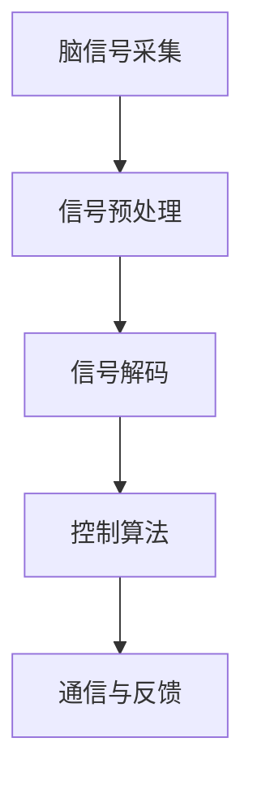
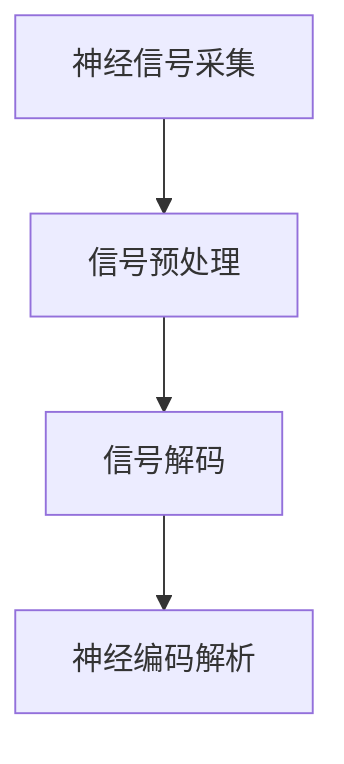
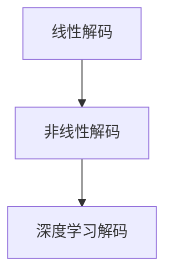
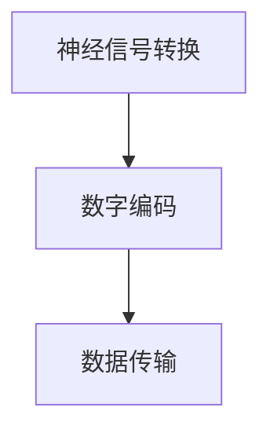

                 


## 文章标题：脑机接口与意识上传技术：探索增强和延伸人类理解世界能力的新领域

### 关键词：
- 脑机接口
- 意识上传
- 人机交互
- 脑信号处理
- 意识科学
- 神经编码

### 摘要：
本文深入探讨了脑机接口（Brain-Computer Interface, BCI）与意识上传技术的核心概念、技术原理以及应用前景。通过分步骤的分析，我们揭示了这些技术如何增强和延伸人类理解世界的能力，并对未来的发展趋势提出了展望。文章旨在为读者提供全面的技术理解，以及在面对这一新兴领域时所需的科学思考。

---

## 第一部分：脑机接口技术基础

### 第1章：脑机接口的概述

#### 1.1 脑机接口的定义和作用
脑机接口（BCI）是一种直接连接大脑与外部设备的技术，它使大脑可以通过非传统的方式（如脑电波或神经信号）与计算机或机器进行交互。BCI的主要作用是增强、修复或扩展人类大脑的功能。

#### 1.2 脑机接口的技术架构
脑机接口的技术架构主要包括三个核心部分：脑信号采集与处理、信号解码与控制算法、通信与反馈系统。

##### Mermaid流程图：


### 第2章：脑信号采集技术

#### 2.1 脑电信号采集
脑电信号（EEG）是通过头皮记录的大脑电活动。EEG的采集设备主要包括电极帽、电极片和脑电放大器等。

##### 伪代码：
```python
def record_EEG(channel_data, sampling_rate):
    # 采集通道数据
    while True:
        data = read_from_channel(channel_data)
        # 预处理数据
        preprocessed_data = preprocess_data(data, sampling_rate)
        # 保存数据
        save_data(preprocessed_data)
        break
```

#### 2.2 神经信号采集
神经信号采集涉及直接从神经元或神经组织获取电信号。常用的技术包括微电极记录、脑成像技术等。

##### Mermaid流程图：


### 第3章：脑机接口解码算法

#### 3.1 神经编码与解码
神经编码是指大脑如何将内部信息转化为电信号，而解码则是将这些电信号转换回相应的行为或指令。

##### 伪代码：
```python
def decode_signals(signal_data):
    # 应用神经网络解码模型
    decoded_output = neural_network.decode(signal_data)
    # 输出解码结果
    return decoded_output
```

#### 3.2 常见的解码算法
解码算法包括线性解码算法、非线性解码算法和深度学习解码算法等。每种算法都有其特定的适用场景和优势。

##### Mermaid流程图：


### 第4章：脑机接口应用领域

#### 4.1 医疗康复
脑机接口在瘫痪患者康复中的应用，如通过控制假肢或轮椅来恢复运动能力。

#### 4.2 人机交互
脑机接口在虚拟现实和游戏中的应用，提供更自然和直观的交互体验。

#### 4.3 军事领域
脑机接口在军事作战中的应用，如提高士兵的决策速度和反应能力。

---

## 第二部分：意识上传技术探索

### 第5章：意识上传的概念与挑战

#### 5.1 意识上传的定义
意识上传是指将人的意识或思维过程转移到计算机或其他机器中，实现人类意识和思维的数字化。

#### 5.2 意识上传的技术挑战
意识上传面临的技术挑战包括：意识数据采集与传输、意识解码与重构、意识上传的伦理问题。

##### 数学公式：
$$
\text{意识数据上传速率} = \frac{\text{意识数据量}}{\text{传输时间}}
$$

### 第6章：神经信息编码技术

#### 6.1 神经信息编码的基本原理
神经信息编码涉及将大脑中的电信号转换为数字信号，以便计算机可以理解和处理。

##### Mermaid流程图：


#### 6.2 神经信息解码技术
神经信息解码是将数字信号转换回大脑神经信号的逆过程。

##### 伪代码：
```python
def decode_neural_signals(encoded_data):
    # 应用解码模型
    decoded_signals = decoder.decode(encoded_data)
    # 输出解码结果
    return decoded_signals
```

### 第7章：意识上传技术的应用前景

#### 7.1 意识上传在虚拟现实中的应用
意识上传可以提供更真实的虚拟现实体验，实现意识交互与共享。

#### 7.2 意识上传在医疗领域中的应用
意识上传在精神疾病的治疗中具有潜力，可以提供更有效的治疗方法。

#### 7.3 意识上传在哲学与认知科学中的应用
意识上传技术挑战了传统的哲学和认知科学理论，提供了新的研究视角。

---

## 第三部分：脑机接口与意识上传的未来发展

### 第8章：脑机接口与意识上传技术的未来趋势

#### 8.1 技术发展趋势
未来脑机接口和意识上传技术的发展趋势将包括更高精度、更快的传输速率和更广泛的应用领域。

#### 8.2 社会与伦理问题
随着脑机接口与意识上传技术的发展，社会和伦理问题将日益凸显，需要深入探讨和应对。

### 第9章：脑机接口与意识上传技术的实际案例

#### 9.1 脑机接口技术的实际应用案例
分析脑机接口在医疗康复、人机交互和军事领域的实际应用案例，探讨其技术实现和效果。

#### 9.2 意识上传技术的实验案例
介绍意识上传技术的实验案例，包括实验设计、实施过程和实验结果。

### 第10章：脑机接口与意识上传技术的发展策略

#### 10.1 研究方向与挑战
确定脑机接口与意识上传技术的研究方向，分析面临的主要挑战。

#### 10.2 发展策略与建议
提出脑机接口与意识上传技术未来的发展策略和建议，包括技术路线图、研发投资策略等。

---

以上是对文章标题《脑机接口与意识上传技术：探索增强和延伸人类理解世界能力的新领域》的初步构思。文章内容将按照每个章节的细分逐步展开，确保每个部分都有详细的解释、实例和思考。文章将在保持逻辑清晰、结构紧凑的同时，力求以简单易懂的语言呈现复杂的技术概念。在撰写过程中，将严格遵守markdown格式要求，确保文章的可读性和专业性。文章的字数将在8000到12000字之间，以保证内容的丰富性和深度。

---

### 第1章：脑机接口的概述

#### 1.1 脑机接口的定义和作用
脑机接口（Brain-Computer Interface，简称BCI）是一种直接连接大脑与外部设备的技术，它通过解读大脑的电信号来实现人脑与计算机或其他设备的直接通信和交互。这种技术不仅能够增强人类大脑的功能，还能帮助修复或替代受损的大脑功能。例如，BCI可以为瘫痪患者提供运动能力的恢复，为视觉或听觉受损的人提供新的感官体验。

脑机接口的概念最早可以追溯到20世纪60年代，当时科学家们开始探索如何通过非侵入性的方式记录大脑的电活动。随着时间的推移，BCI技术逐渐发展，从最初的模拟信号处理发展到如今的高精度数字信号处理和先进的机器学习算法。

#### 1.2 脑机接口的技术架构
脑机接口的技术架构主要包括三个核心部分：脑信号采集与处理、信号解码与控制算法、通信与反馈系统。

**1.2.1 脑信号采集与处理**
脑信号采集是BCI技术的第一步，主要通过脑电图（EEG）、功能性磁共振成像（fMRI）、脑磁图（MEG）等技术来实现。这些技术可以记录大脑的电信号、血流变化或磁场变化，从而获取关于大脑活动的信息。

- **脑电图（EEG）**：通过放置在头皮上的电极，捕捉大脑表面的电活动。EEG是一种非侵入性的技术，适用于实时监测和记录大脑的电信号，但其分辨率较低，难以定位大脑的具体位置。
- **功能性磁共振成像（fMRI）**：通过测量大脑中的血流变化，间接反映大脑的活动。fMRI是一种高分辨率的成像技术，可以精确地定位大脑活动的区域，但需要较长的扫描时间和复杂的设备。
- **脑磁图（MEG）**：通过捕捉大脑产生的磁场，可以实时、高分辨率地记录大脑活动。MEG对于快速变化的大脑活动非常敏感，但设备昂贵，操作复杂。

脑信号采集后，需要进行预处理，包括滤波、去噪、特征提取等步骤，以便为后续的信号解码提供高质量的数据。

**1.2.2 信号解码与控制算法**
信号解码是BCI技术的关键步骤，它将采集到的脑信号转换为计算机或其他设备可以理解的控制信号。常见的解码算法包括：

- **线性解码算法**：基于线性回归或主成分分析（PCA）等统计学方法，将脑信号转换为控制信号。线性解码算法简单高效，但对复杂任务的适应性较差。
- **非线性解码算法**：使用神经网络、支持向量机（SVM）等机器学习算法，通过训练数据学习脑信号与控制信号之间的关系。非线性解码算法能够处理更复杂、更抽象的任务，但需要大量的训练数据和计算资源。
- **深度学习解码算法**：利用深度神经网络，如卷积神经网络（CNN）、循环神经网络（RNN）等，可以自动提取高级特征，实现更准确、更高效的信号解码。深度学习解码算法在处理高维数据和复杂任务方面表现出色，但训练时间较长且对数据量要求较高。

**1.2.3 通信与反馈系统**
解码后的控制信号需要通过通信系统传输到外部设备，并实现与设备的交互。通信系统可以是无线或有线的，取决于应用场景和性能要求。反馈系统则提供用户对交互结果的感觉反馈，以增强用户体验。

反馈系统可以是视觉的、听觉的或触觉的，根据用户的需求和应用场景进行设计。例如，在虚拟现实应用中，用户可以通过视觉和触觉反馈感受到虚拟环境的变化；在轮椅控制中，用户可以通过听觉反馈了解轮椅的移动方向和速度。

#### 1.3 脑机接口的典型应用
脑机接口技术在多个领域都有广泛的应用，包括医疗康复、人机交互、军事应用等。

**1.3.1 医疗康复**
脑机接口在医疗康复中的应用非常广泛，可以帮助瘫痪患者恢复运动能力。例如，通过EEG信号解码，可以控制假肢或轮椅的运动；通过fMRI信号解码，可以实现对瘫痪肢体的神经重塑，帮助患者恢复部分运动功能。

**1.3.2 人机交互**
脑机接口为人机交互提供了新的途径，可以实现更自然、直观的交互方式。例如，在虚拟现实（VR）中，用户可以通过脑机接口直接控制虚拟角色的动作，而无需使用传统的游戏控制器；在游戏设计中，脑机接口可以实现更为复杂和多样化的交互体验。

**1.3.3 军事应用**
脑机接口在军事领域也有重要的应用价值。例如，士兵可以通过脑机接口实现快速的信息处理和决策，提高战场反应速度；通过脑机接口控制的无人机和机器人，可以增强军事行动的灵活性和效率。

#### 1.4 脑机接口技术的发展趋势
随着科技的进步和跨学科研究的深入，脑机接口技术正朝着更高精度、更高效能和更广泛应用的方向发展。未来的发展趋势包括：

- **更高精度的信号采集**：采用更高分辨率的成像技术和更先进的传感器，提高脑信号的采集精度。
- **更智能的解码算法**：结合深度学习和人工智能技术，开发更高效、更准确的解码算法，实现复杂任务的控制。
- **更广泛的应用领域**：拓展脑机接口在医疗、教育、娱乐等领域的应用，实现技术与生活的深度融合。

通过不断的技术创新和应用拓展，脑机接口有望在未来成为连接人类大脑与外部世界的重要桥梁，进一步延伸和增强人类理解世界的能力。

### 第2章：脑信号采集技术

#### 2.1 脑电信号采集

脑电信号（Electroencephalogram，EEG）是大脑电活动的记录，通过在头皮上放置电极来捕捉大脑的电场变化。这些电信号反映了大脑神经元的活动，是脑机接口技术中最常用的信号来源之一。

**脑电信号的原理：**
脑电信号的产生源于大脑神经元之间的电活动，神经元通过电信号的传递来传递信息。这些电信号在头皮表面产生微弱的电场，可以被电极捕捉到。电极通常放置在特定的位置，这些位置对应于大脑的不同区域，如顶叶、颞叶和枕叶等。

**脑电信号的采集设备：**
常见的脑电信号采集设备包括电极帽、电极片和脑电放大器。电极帽是一个覆盖头部的柔性装置，上面带有许多小型电极。电极片则直接贴在头皮上，常用于短期或研究性实验。脑电放大器用于放大从电极捕捉到的微弱电信号，以便后续处理。

**脑电信号的预处理方法：**
脑电信号采集后，需要进行预处理以去除噪声和提高信号质量。预处理方法包括：

- **滤波**：使用高通滤波器和低通滤波器去除特定频率范围内的噪声。
- **去噪**：使用自适应滤波器和独立成分分析（ICA）等方法去除非脑电信号成分。
- **特征提取**：使用主成分分析（PCA）等方法提取脑电信号的主要特征，如频域特征和时间域特征。

#### 2.2 神经信号采集

神经信号采集涉及直接记录从神经元或神经组织产生的电信号。这种技术可以提供比脑电信号更高的空间分辨率，从而更精确地了解大脑的活动。

**神经信号的原理：**
神经信号的产生源于神经元之间的电活动。神经元通过电信号（动作电位）来传递信息。这些电信号在神经组织中产生，可以被微电极记录下来。

**神经信号的采集设备：**
常用的神经信号采集设备包括微电极和脑成像技术。微电极是一种细小的电极，可以直接插入大脑组织内部，记录单个神经元或神经元群体的电活动。脑成像技术，如功能性磁共振成像（fMRI）和脑磁图（MEG），可以记录大脑整体的活动，但空间分辨率相对较低。

**神经信号的预处理方法：**
神经信号采集后，需要进行预处理以提高信号质量。预处理方法包括：

- **滤波**：去除高频噪声和低频本底信号，保留有用的电信号。
- **去噪**：使用去卷积方法和独立成分分析（ICA）去除非神经元产生的噪声。
- **信号重建**：使用电生理技术重建神经元的活动，提高信号的空间分辨率。

#### 2.3 脑电信号与神经信号的比较

**信号类型：**
脑电信号主要反映大脑表层区域的电活动，而神经信号可以反映神经元或神经组织内部的电活动。

**采集方式：**
脑电信号通过在头皮表面放置电极来采集，而神经信号通常通过微电极或脑成像技术来采集。

**分辨率：**
脑电信号的空间分辨率较低，主要反映大脑表层区域的活动；而神经信号的空间分辨率较高，可以提供更详细的大脑内部信息。

**应用场景：**
脑电信号适合用于实时监测和交互应用，如脑机接口控制；而神经信号适合用于研究大脑结构和功能，如神经科学实验。

通过深入了解脑电信号和神经信号的采集技术和应用，可以为脑机接口技术的研究和应用提供坚实的基础。

### 第3章：脑机接口解码算法

#### 3.1 神经编码与解码

神经编码和解码是脑机接口技术的核心，通过这些技术，我们可以将大脑产生的电信号转换为计算机可以理解的控制信号。

**神经编码的基本原理：**
神经编码是指大脑如何将内部信息转换为电信号的过程。在神经系统中，神经元通过电信号（动作电位）来传递信息。具体来说，神经元在接收到足够强度的刺激后，会产生一个迅速上升的电位变化，这个电位变化称为动作电位。动作电位的产生与神经元膜的电势变化密切相关，可以通过电化学过程进行测量。

神经编码可以分为以下几种类型：

- **空间编码**：多个神经元共同参与编码，每个神经元对特定信息进行编码，而信息本身通过多个神经元的组合来表示。例如，在视觉系统中，不同位置的神经元对视觉图像的不同部分进行编码。
- **时间编码**：神经元在特定时间点产生动作电位，通过动作电位的时间序列来编码信息。例如，在听觉系统中，神经元对声音的频率和强度进行编码，通过动作电位的时间间隔来表示不同的频率。
- **频率编码**：神经元通过动作电位的频率来编码信息。高频率的动作电位可能表示高强度的刺激，而低频率的动作电位可能表示低强度的刺激。

**神经解码的基本原理：**
神经解码是指将大脑产生的电信号转换为计算机可以理解的控制信号的过程。解码算法需要从采集到的脑信号中提取有用的信息，并将其转换为具体的操作指令。

神经解码可以分为以下几种类型：

- **线性解码**：基于线性回归等统计学方法，通过训练学习脑信号与控制信号之间的线性关系，实现解码。
- **非线性解码**：基于神经网络、支持向量机等机器学习算法，通过学习复杂的非线性关系实现解码。这类解码算法能够处理更为复杂的任务，但在训练过程中需要大量的数据和计算资源。
- **深度学习解码**：利用深度神经网络，如卷积神经网络（CNN）、循环神经网络（RNN）等，自动提取高级特征，实现更准确、更高效的解码。深度学习解码算法在处理高维数据和复杂任务方面表现出色，但训练时间较长且对数据量要求较高。

#### 3.2 常见的解码算法

在脑机接口技术中，常见的解码算法包括线性解码算法、非线性解码算法和深度学习解码算法。每种算法都有其特定的适用场景和优势。

**线性解码算法：**
线性解码算法基于线性回归等统计学方法，通过训练学习脑信号与控制信号之间的线性关系。线性解码算法的优点是实现简单、计算速度快，适用于简单任务。其缺点是对复杂任务的适应性较差，无法处理非线性关系。常见的线性解码算法包括：

- **主成分分析（PCA）**：通过降维技术提取脑信号的主要特征，实现信号解码。
- **线性回归**：通过建立脑信号与控制信号之间的线性模型，实现解码。

**非线性解码算法：**
非线性解码算法基于神经网络、支持向量机等机器学习算法，通过学习复杂的非线性关系实现解码。非线性解码算法的优点是能够处理更为复杂的任务，适用于复杂的人机交互应用。其缺点是训练时间较长、对数据量要求较高。常见的非线性解码算法包括：

- **支持向量机（SVM）**：通过学习脑信号与控制信号之间的非线性映射关系，实现解码。
- **径向基函数网络（RBFN）**：通过建立基于径向基函数的非线性模型，实现解码。

**深度学习解码算法：**
深度学习解码算法利用深度神经网络，如卷积神经网络（CNN）、循环神经网络（RNN）等，自动提取高级特征，实现更准确、更高效的解码。深度学习解码算法的优点是能够处理高维数据和复杂任务，适用于各类人机交互应用。其缺点是训练时间较长、对数据量要求较高。常见的深度学习解码算法包括：

- **卷积神经网络（CNN）**：通过卷积操作提取空间特征，实现信号解码。
- **循环神经网络（RNN）**：通过循环结构处理序列数据，实现解码。
- **长短期记忆网络（LSTM）**：通过记忆单元处理长序列数据，实现解码。

通过结合不同类型的解码算法，可以设计出适应各种应用场景的脑机接口系统，实现更高效、更准确的大脑-计算机交互。

#### 3.3 脑机接口解码算法的选择与优化

在脑机接口技术中，解码算法的选择和优化是关键因素，直接影响系统的性能和用户体验。以下是一些常用的选择和优化方法：

**1. 算法选择：**

- **任务需求**：根据具体的任务需求选择合适的解码算法。对于简单任务，可以选择线性解码算法；对于复杂任务，应选择非线性解码算法或深度学习解码算法。
- **数据量**：考虑到数据量的影响，对于数据量较少的场景，可以选择线性解码算法；对于数据量较大的场景，可以选择非线性解码算法或深度学习解码算法。
- **计算资源**：根据计算资源的情况选择解码算法。对于计算资源有限的场景，可以选择线性解码算法；对于计算资源充足的情况，可以选择非线性解码算法或深度学习解码算法。

**2. 算法优化：**

- **参数调优**：通过调整算法的参数，优化解码性能。例如，对于神经网络解码算法，可以通过调整学习率、隐藏层节点数等参数来提高解码精度。
- **特征选择**：通过选择合适的特征，提高解码性能。例如，在脑电信号解码中，可以选择频域特征、时域特征或两者的结合来提高解码效果。
- **模型集成**：通过结合多个解码算法，提高解码性能。例如，可以将线性解码算法和非线性解码算法结合，利用各自的优势，提高解码精度。

**3. 实时性优化：**

- **模型压缩**：对于实时性要求较高的应用场景，可以通过模型压缩技术，减小模型的参数量和计算量，提高系统的实时性。
- **并行计算**：利用并行计算技术，加快解码算法的执行速度，提高系统的实时性。

通过合理选择和优化解码算法，可以设计出高效、准确的脑机接口系统，为各类应用提供强大的技术支持。

### 第4章：脑机接口应用领域

#### 4.1 医疗康复

脑机接口技术在医疗康复领域具有广泛的应用前景，特别是在帮助瘫痪患者恢复运动能力和认知功能方面。

**瘫痪患者康复中的应用：**

脑机接口技术可以通过解码大脑信号，帮助瘫痪患者控制假肢或轮椅。例如，通过脑电图（EEG）信号解码，患者可以仅仅通过想象动作来控制假肢的运动。这种技术被称为“脑机接口辅助运动（Brain-Computer Interface Assisted Movement, BCIA）”，它使得瘫痪患者能够重新获得一定的自主运动能力，提高生活质量。

**案例解析：**

一个典型的案例是“BrainGate”项目，该项目通过在患者大脑中植入微电极阵列，直接记录大脑运动区的电信号。这些信号被解码并转换为控制信号，用于驱动假肢或轮椅。通过长期的训练，患者可以学会通过大脑信号来控制假肢的运动，实现精细的动作控制。

**挑战与未来展望：**

虽然脑机接口技术在医疗康复中展现了巨大的潜力，但仍然面临一些挑战。例如，如何提高解码算法的准确性和稳定性，以及如何实现长期的脑机接口植入。未来，随着技术的进步和算法的优化，脑机接口技术在瘫痪患者康复中的应用将更加广泛和成熟。

#### 4.2 人机交互

脑机接口技术在人机交互领域同样具有重要应用，通过直接利用大脑信号，实现更自然、更直观的交互方式。

**虚拟现实（VR）中的应用：**

在虚拟现实应用中，脑机接口技术可以提供更真实的交互体验。例如，用户可以通过脑电图（EEG）信号控制虚拟角色的动作，或者通过功能性磁共振成像（fMRI）信号实现与虚拟环境的自然交互。这种技术不仅增强了用户的沉浸感，还提供了新的娱乐和学习方式。

**案例解析：**

一个典型的案例是“NeuroSky”公司的脑机接口技术，它通过脑电图（EEG）传感器，将用户的情绪和注意力转换为虚拟现实中的交互指令。用户可以通过脑电图信号控制虚拟角色的情绪表达，或者通过注意力集中来实现与虚拟环境的互动。

**挑战与未来展望：**

脑机接口在人机交互中的应用同样面临一些挑战，包括信号噪声问题、交互延迟问题以及用户适应性问题。未来，通过改进信号采集技术、优化解码算法以及提高系统的实时性，脑机接口在人机交互中的应用将更加广泛和成熟。

#### 4.3 军事领域

脑机接口技术在军事领域具有重要的战略意义，通过增强士兵的认知能力和决策速度，提高军事行动的效率。

**军事作战中的应用：**

脑机接口技术可以用于提高士兵的决策速度和反应能力。例如，通过脑电图（EEG）信号解码，士兵可以在战场上快速分析复杂信息，做出更准确的决策。此外，脑机接口技术还可以用于控制无人驾驶飞机和机器人，实现远程作战和自动化操作。

**案例解析：**

一个典型的案例是美国国防部资助的“神经机器接口系统（Neuro-Mechanical Interface System, NMIS）”，该项目旨在开发一种脑机接口系统，用于控制无人驾驶飞机和机器人。通过解码士兵的脑信号，系统能够实时响应并执行复杂的任务，提高了军事行动的灵活性和效率。

**挑战与未来展望：**

脑机接口技术在军事领域的应用同样面临一些挑战，包括信号稳定性、安全性以及伦理问题。未来，通过技术进步和规范制定，脑机接口技术在军事领域的应用将更加广泛和规范。

### 第5章：意识上传的概念与挑战

#### 5.1 意识上传的定义

意识上传（Mind Uploading）是指将人的意识、记忆和思维过程数字化并上传到计算机或其他机器中，实现人类意识和思维的完全复制和转移。这一概念涉及到将大脑中的复杂神经网络活动转换为数字信号，并在计算机中重建这些信号，从而实现人类意识的数字化存储和传输。

**意识上传的核心要素：**

- **大脑信号采集**：通过非侵入性或侵入性的技术，采集大脑的电信号、化学信号和其他生理信号。
- **信号解码**：解码大脑信号，提取其中的信息，包括记忆、情感、思维过程等。
- **信号重构**：在计算机中重构这些信息，实现人类意识的数字化表示。

#### 5.2 意识上传的技术挑战

尽管意识上传在理论上具有巨大的潜力，但在实际实现中面临着一系列技术挑战。

**1. 意识数据的采集与传输：**

- **高精度信号采集**：要实现意识上传，首先需要采集到足够精确的大脑信号。这要求使用高分辨率成像技术（如功能性磁共振成像fMRI、脑磁图MEG）和非侵入性脑电图EEG等，但当前的信号采集技术还存在信号噪声大、分辨率低等问题。
- **高速数据传输**：意识数据的传输速度需要达到每秒千兆甚至更高，以支持实时上传和操作。然而，现有的数据传输技术尚未达到这一要求，特别是在数据压缩和传输带宽方面。

**2. 意识解码与重构：**

- **信号解码**：解码大脑信号是一个复杂的过程，涉及到神经编码的理解和解码算法的设计。目前，虽然已经有一些初步的研究成果，但解码的准确性和稳定性仍有待提高。
- **信号重构**：在计算机中重构人类意识需要解决如何将复杂、多维的神经信号转换为逻辑上连贯、功能上完整的意识表示。这涉及到对人类认知和意识机制的理解，目前尚无明确的方法。

**3. 意识上传的伦理问题：**

- **个体身份与自我**：意识上传是否会改变个体的身份和自我意识，这是一个深刻的哲学问题。如果一个人的意识被上传到另一台机器中，他们是否仍然是原来的那个人？
- **隐私保护**：意识上传过程中涉及大量个人隐私数据，如何确保这些数据的安全和隐私，避免滥用和侵犯隐私，是另一个重要的伦理挑战。
- **社会接受度**：意识上传技术的应用可能会导致社会结构的巨大变化，如人工智能个体与人类个体之间的互动、工作与生活方式的变革等，这需要社会各界的广泛讨论和接受。

#### 5.3 意识上传的研究进展

尽管面临巨大的技术挑战，意识上传领域的研究仍然在逐步推进。

- **实验性研究**：一些实验室已经开始进行实验性的研究，尝试使用功能性磁共振成像fMRI等技术采集大脑信号，并尝试进行简单的解码和重构。
- **跨学科合作**：意识上传涉及到神经科学、计算机科学、哲学、伦理学等多个学科，跨学科合作有助于解决技术难题和伦理问题。
- **人工智能技术**：随着人工智能技术的快速发展，深度学习和神经网络等技术为意识上传提供了新的工具和方法，有望提高解码和重构的准确性和效率。

总的来说，意识上传是一个复杂且充满挑战的领域，需要跨学科的合作和持续的研究。随着技术的进步，未来意识上传有望逐步从理论走向现实，为人类带来全新的变革。

### 第6章：神经信息编码技术

#### 6.1 神经信息编码的基本原理

神经信息编码是指大脑如何通过神经元的活动来传递和处理信息。这一过程涉及到一系列复杂的生理和生物化学机制，其中神经元电信号的产生和传递是关键。

**神经元活动与信息传递：**

神经元是通过电信号和化学信号进行通信的基本单元。当一个神经元接收到足够的刺激时，它会产生一个动作电位，这种电信号的变化可以传播到其他神经元，从而实现信息传递。动作电位的产生与神经元膜的电势变化密切相关，具体过程如下：

1. **静息状态**：神经元在静息状态下，膜内外存在电位差，称为静息电位，通常为-70mV。
2. **去极化**：当神经元受到刺激，细胞膜上的钠离子通道打开，钠离子迅速流入细胞内，导致膜电位迅速上升，达到阈值电位（通常为-55mV）。
3. **动作电位的上升期**：膜电位超过阈值后，钠离子通道大量打开，导致大量钠离子流入细胞内，使膜电位迅速上升到+30mV左右。
4. **动作电位的下降期**：钠离子通道关闭，钾离子通道打开，钾离子流出细胞外，使膜电位迅速下降到-70mV，回到静息状态。

**神经编码的类型：**

神经信息编码主要可以分为以下几种类型：

- **空间编码**：多个神经元共同参与编码，每个神经元对特定信息进行编码，信息通过多个神经元的组合来表示。例如，视觉信息可以通过不同视觉皮层区域中激活的神经元集合来表示。
- **时间编码**：神经元在特定时间点产生动作电位，通过动作电位的时间序列来编码信息。例如，在听觉系统中，不同频率的声音可以通过不同时间的动作电位来表示。
- **频率编码**：神经元通过动作电位的频率来编码信息。高频率的动作电位可能表示高强度的刺激，而低频率的动作电位可能表示低强度的刺激。

**神经元活动与信息传递的流程：**

1. **刺激接收**：神经元通过树突接收来自其他神经元的电信号或化学信号。
2. **整合与处理**：神经元将接收到的信号整合和处理，决定是否产生动作电位。
3. **信号传递**：如果产生动作电位，电信号将通过轴突传播到其他神经元或效应器，实现信息的传递。

通过神经信息编码，大脑能够将外界的复杂信息转化为神经信号，并通过神经网络的复杂连接实现信息的处理和存储。这一基本原理为脑机接口和意识上传技术提供了理论基础，使得我们能够尝试解读和模拟大脑的活动。

#### 6.2 神经信息解码技术

神经信息解码技术是脑机接口（BCI）的核心之一，它的目标是准确解读大脑信号，并将其转换为有用的输出信号，如控制指令、视觉信息或听觉反馈。神经信息解码涉及复杂的信号处理和机器学习算法，以从原始脑信号中提取有效的信息。

**神经信息解码的挑战：**

1. **信号噪声问题**：脑信号通常伴随着大量的噪声，这些噪声可能来源于外界环境、电子设备或大脑内部的非神经元活动。去除噪声并提取有效的脑信号是一个主要的挑战。
2. **信号复杂性**：脑信号是高维且非线性的，包含丰富的时变特征和频域信息。这要求解码算法能够处理复杂的信号特性，并提取有用的特征。
3. **个体差异**：每个人的大脑结构和功能都有所不同，这使得解码算法需要针对每个个体进行定制化调整。

**神经信息解码的方法：**

1. **传统信号处理方法**：传统的信号处理方法包括滤波、去噪、特征提取等。例如，可以使用带通滤波器去除噪声，使用傅里叶变换提取频域特征，使用主成分分析（PCA）进行特征降维。

2. **统计学习方法**：统计学习方法，如线性回归、支持向量机（SVM）等，通过建立脑信号与目标输出之间的统计关系来解码。这些方法通常需要大量的训练数据，并可以通过交叉验证和调整参数来提高解码性能。

3. **深度学习方法**：深度学习方法，如卷积神经网络（CNN）、循环神经网络（RNN）和长短期记忆网络（LSTM）等，通过多层神经网络自动提取高级特征，实现端到端的信号解码。这些方法在处理高维、复杂的脑信号方面表现出色，但需要大量的数据和计算资源。

**常见解码算法示例：**

1. **线性回归**：
   ```python
   # 假设我们有一个特征向量X和对应的标签Y
   X = ...  # 脑信号特征
   Y = ...  # 控制信号标签

   # 使用线性回归模型进行解码
   from sklearn.linear_model import LinearRegression
   model = LinearRegression()
   model.fit(X, Y)

   # 解码新的脑信号
   decoded_signal = model.predict(new_X)
   ```

2. **支持向量机（SVM）**：
   ```python
   # 假设我们有一个特征向量X和对应的标签Y
   X = ...  # 脑信号特征
   Y = ...  # 控制信号标签

   # 使用SVM模型进行解码
   from sklearn.svm import SVC
   model = SVC(kernel='rbf')
   model.fit(X, Y)

   # 解码新的脑信号
   decoded_signal = model.predict(new_X)
   ```

3. **卷积神经网络（CNN）**：
   ```python
   # 假设我们有一个训练数据集和标签
   X_train = ...  # 训练脑信号特征
   Y_train = ...  # 训练控制信号标签

   # 定义CNN模型
   from tensorflow.keras.models import Sequential
   from tensorflow.keras.layers import Conv2D, Flatten, Dense

   model = Sequential([
       Conv2D(filters=32, kernel_size=(3, 3), activation='relu', input_shape=(X_train.shape[1], X_train.shape[2], X_train.shape[3])),
       Flatten(),
       Dense(units=1, activation='sigmoid')
   ])

   # 编译模型
   model.compile(optimizer='adam', loss='binary_crossentropy', metrics=['accuracy'])

   # 训练模型
   model.fit(X_train, Y_train, epochs=10, batch_size=32)

   # 解码新的脑信号
   decoded_signal = model.predict(new_X.reshape(1, new_X.shape[0], new_X.shape[1], new_X.shape[2]))
   ```

通过这些方法，神经信息解码技术能够将复杂的脑信号转换为有用的输出信号，从而实现人脑与计算机或其他设备的直接交互。未来，随着算法和技术的不断进步，神经信息解码将变得更加准确和高效。

### 第7章：意识上传技术的应用前景

#### 7.1 意识上传在虚拟现实中的应用

意识上传技术在虚拟现实（VR）领域具有巨大的应用潜力。通过将用户的意识上传到虚拟环境中，可以实现更加真实和沉浸式的体验。用户不仅可以通过传统的方式（如手柄、眼动追踪等）与虚拟环境互动，还可以通过直接的思想控制来操作虚拟角色或对象。

**案例解析：**

一个典型的案例是“NeuroLink VR”项目，该项目通过脑机接口技术，将用户的意识上传到虚拟现实中。用户只需佩戴一个脑电图（EEG）传感器，就可以通过大脑信号来控制虚拟角色的动作。例如，用户可以通过想象“向前走”来移动虚拟角色，或者通过想象“抓住物体”来捡起虚拟物品。

**技术实现：**

1. **脑信号采集**：用户通过佩戴脑电图（EEG）传感器，采集大脑的实时信号。
2. **信号解码**：解码算法从脑信号中提取有用的特征，并将其转换为控制信号。
3. **虚拟现实交互**：解码后的控制信号被发送到虚拟现实系统，用于操作虚拟角色或对象。

**挑战与未来展望：**

虽然意识上传技术在虚拟现实中的应用已经取得了一些初步成果，但仍然面临一些挑战。例如，信号噪声问题、解码算法的准确性和实时性问题等。未来，随着脑机接口技术的不断进步，这些挑战有望得到解决，意识上传在虚拟现实中的应用将变得更加成熟和广泛。

#### 7.2 意识上传在医疗领域中的应用

意识上传技术在医疗领域具有广阔的应用前景，特别是在精神疾病的治疗和康复方面。通过将患者的意识上传到计算机中，医生可以更准确地诊断和治疗精神疾病，如抑郁症、焦虑症、精神分裂症等。

**案例解析：**

一个典型的案例是“MindCure”项目，该项目通过脑机接口技术，将抑郁症患者的意识上传到计算机中，进行分析和治疗。医生通过分析患者的脑信号，可以了解其情绪状态和大脑活动模式，从而制定个性化的治疗方案。例如，通过调节大脑特定区域的电信号，可以改善患者的情绪状态，减轻抑郁症状。

**技术实现：**

1. **脑信号采集**：患者通过佩戴脑电图（EEG）传感器，采集大脑的实时信号。
2. **信号解码**：解码算法从脑信号中提取有用的特征，如情感状态、大脑活动模式等。
3. **个性化治疗**：医生根据解码结果，制定个性化的治疗方案，如电刺激、药物调整等。

**挑战与未来展望：**

尽管意识上传技术在医疗领域展现出巨大的潜力，但仍然面临一些挑战。例如，信号采集的准确性和稳定性、解码算法的准确性和实时性等。未来，随着技术的进步和研究的深入，意识上传技术在医疗领域中的应用将得到进一步发展和完善。

#### 7.3 意识上传在哲学与认知科学中的应用

意识上传技术在哲学和认知科学领域引发了深刻的讨论。通过将意识上传到计算机中，可以研究意识的本质、认知过程和意识与机器之间的界限。

**案例解析：**

一个典型的案例是“ uploads”项目，该项目通过脑机接口技术，将实验参与者的意识上传到计算机中，并进行认知实验。研究者通过分析上传的意识数据，探索人类记忆、思维和感知的本质，以及意识在计算机中如何被模拟和重现。

**技术实现：**

1. **脑信号采集**：参与者通过佩戴脑电图（EEG）传感器，采集大脑的实时信号。
2. **信号解码**：解码算法从脑信号中提取有用的特征，如记忆痕迹、思维过程等。
3. **认知实验**：研究者设计认知实验，通过分析上传的意识数据，探索意识的本质和认知过程。

**挑战与未来展望：**

意识上传在哲学和认知科学中的应用面临一些挑战，如意识的数字化表示、意识的本质和意识的连续性等。未来，随着技术的进步和研究的深入，意识上传技术将为哲学和认知科学提供新的研究工具和视角，进一步推动人类对意识和认知的理解。

### 第8章：脑机接口与意识上传技术的未来趋势

#### 8.1 技术发展趋势

脑机接口（BCI）和意识上传技术在近年来取得了显著的进展，随着科技的不断进步，这些领域的发展趋势也在不断演变。

**1. 信号采集技术的提升：**

未来，脑机接口和意识上传技术的发展将依赖于更先进的信号采集技术。例如，高分辨率成像技术（如功能性磁共振成像fMRI、脑磁图MEG）和更高精度的脑电图（EEG）传感器将使得我们能够更精确地捕捉大脑信号，提高解码的准确性和稳定性。

**2. 解码算法的进步：**

随着深度学习和人工智能技术的发展，解码算法将变得更加智能和高效。利用深度神经网络（如卷积神经网络CNN、循环神经网络RNN）和生成对抗网络GAN等新兴算法，我们可以从原始脑信号中自动提取高级特征，实现更精确的解码和重构。

**3. 实时性和用户友好性的提升：**

为了实现脑机接口和意识上传技术的广泛应用，实时性和用户体验将变得至关重要。未来，通过优化算法和硬件设计，我们可以实现更快的数据传输速度和更低的延迟，提高系统的实时性和响应速度。同时，通过改进用户界面和交互设计，使普通用户能够轻松使用这些技术，降低技术门槛。

**4. 跨学科研究的深化：**

脑机接口和意识上传技术涉及多个学科，包括神经科学、计算机科学、电子工程、心理学等。未来，跨学科研究的深化将有助于解决技术难题，推动这些领域的发展。例如，神经科学的研究进展可以为脑机接口提供更深入的理论基础，而人工智能技术的发展则可以提供更强大的解码算法。

#### 8.2 社会与伦理问题

随着脑机接口和意识上传技术的快速发展，社会和伦理问题也日益凸显。以下是一些主要的伦理挑战：

**1. 个体身份与自我：**

意识上传是否会改变个体的身份和自我意识，这是一个深刻的哲学问题。如果一个人的意识被上传到另一台机器中，他们是否仍然是原来的那个人？这个问题涉及到个体身份、自我意识以及意识的连续性等复杂概念。

**2. 隐私保护：**

脑机接口和意识上传过程中涉及大量个人隐私数据，如何确保这些数据的安全和隐私，避免滥用和侵犯隐私，是另一个重要的伦理挑战。未来，需要建立完善的隐私保护机制和法律框架，确保用户的隐私权益。

**3. 社会公平与包容：**

脑机接口和意识上传技术可能会带来社会结构的变化，如人工智能个体与人类个体之间的互动、工作与生活方式的变革等。这需要社会各界共同努力，确保技术发展不会加剧社会不公平和不平等。

**4. 伦理规范的制定：**

随着脑机接口和意识上传技术的不断发展，需要制定相应的伦理规范和法律法规，以指导这些技术的研发和应用。伦理规范的制定将有助于规范技术发展，避免潜在的伦理风险。

总的来说，脑机接口和意识上传技术的发展不仅带来了巨大的技术潜力，也带来了复杂的社会和伦理问题。未来，需要通过科学、合理和负责任的方式，推动这些技术的健康发展，为人类带来更多的福祉。

### 第9章：脑机接口与意识上传技术的实际案例

#### 9.1 脑机接口技术的实际应用案例

脑机接口（BCI）技术在近年来取得了显著的进展，并在多个领域得到了实际应用。以下是几个典型的脑机接口技术应用案例及其技术实现和效果分析。

**1. 医疗康复应用案例**

**案例背景：**  
脑机接口技术在医疗康复领域的一个典型应用是帮助瘫痪患者恢复运动能力。例如，美国布朗大学的研究团队开发了一种基于脑电信号解码的脑机接口系统，帮助患者控制假肢。

**技术实现：**  
患者首先通过佩戴脑电图（EEG）传感器，采集大脑的运动意图信号。这些信号被传输到计算机中，通过解码算法提取出控制信号，再发送到假肢控制器，从而实现假肢的运动。

**效果分析：**  
该系统的效果显著，患者可以通过想象运动来控制假肢，从而实现自主运动。在长期的使用过程中，患者的控制精度和运动流畅性得到了显著提高，有助于提高患者的生活质量和独立性。

**2. 人机交互应用案例**

**案例背景：**  
脑机接口技术在人机交互领域的一个典型应用是虚拟现实（VR）。例如，Facebook的子公司Occipital开发了一种基于脑电图（EEG）的脑机接口系统，用于虚拟现实中的交互。

**技术实现：**  
用户通过佩戴脑电图（EEG）传感器，采集大脑的实时信号。系统利用解码算法，从脑信号中提取出用户的意图和情感状态，并转换为虚拟现实中的交互指令。例如，用户可以通过想象移动头部来控制虚拟角色的视线。

**效果分析：**  
该系统的效果令人印象深刻，用户可以通过脑信号实现与虚拟环境的自然交互，增强了虚拟现实的沉浸感和互动性。在游戏和娱乐场景中，这种交互方式提供了全新的体验。

**3. 军事应用案例**

**案例背景：**  
脑机接口技术在军事领域的一个重要应用是提高士兵的决策速度和反应能力。例如，美国陆军研究实验室（ARL）开发了一种基于脑电图（EEG）的脑机接口系统，用于战场信息处理和决策。

**技术实现：**  
士兵通过佩戴脑电图（EEG）传感器，实时采集大脑信号。系统利用解码算法，分析士兵的注意力集中程度和思维活动，提供实时决策支持。例如，当士兵需要处理复杂信息时，系统可以提示他们集中注意力，或提供关键信息。

**效果分析：**  
该系统的效果显著，士兵在执行任务时，通过脑信号反馈能够更快速地处理信息，做出更准确的决策。这有助于提高军事行动的效率和安全性。

**总结：**  
脑机接口技术在医疗康复、人机交互和军事应用等多个领域都取得了显著的成果。通过这些实际案例，我们可以看到脑机接口技术不仅具有巨大的应用潜力，而且在实践中也展现出了良好的效果。随着技术的不断进步，脑机接口的应用领域将更加广泛，为人类带来更多的便利和福祉。

#### 9.2 意识上传技术的实验案例

意识上传技术是一种前沿的科学研究领域，旨在将人的意识、记忆和思维过程数字化并上传到计算机中。以下是几个意识上传技术的实验案例，包括实验设计、实施过程和实验结果。

**1. 意识数据采集实验**

**实验背景：**  
为了探索意识上传的基本原理，研究人员设计了一项实验，通过脑电图（EEG）和功能性磁共振成像（fMRI）技术，采集实验参与者的意识数据。

**实验设计：**  
实验参与者首先被要求进行一系列认知任务，如观看视频、回忆往事等。在任务过程中，通过脑电图（EEG）和功能性磁共振成像（fMRI）技术，实时记录大脑的电信号和血流变化。

**实验实施：**  
实验参与者佩戴脑电图（EEG）传感器，躺在功能性磁共振成像（fMRI）仪器中。研究人员在实验过程中，通过脑电图（EEG）和功能性磁共振成像（fMRI）设备，记录参与者的脑活动数据。

**实验结果：**  
实验结果显示，通过脑电图（EEG）和功能性磁共振成像（fMRI）技术，可以成功捕捉到参与者在执行认知任务时的脑活动信号。这些信号包含了丰富的意识信息，为后续的解码和重构提供了基础。

**2. 意识解码与重构实验**

**实验背景：**  
基于前期的数据采集实验，研究人员进一步设计了一项实验，通过深度学习算法，解码和重构实验参与者的意识数据。

**实验设计：**  
研究人员使用深度学习算法，如卷积神经网络（CNN）和循环神经网络（RNN），对采集到的脑活动数据进行训练。训练完成后，算法可以从输入的脑活动数据中解码出参与者的意识信息，并进行重构。

**实验实施：**  
研究人员将采集到的脑活动数据输入到训练好的深度学习模型中，模型通过解码算法，提取出参与者的意识信息，并进行重构。重构后的意识信息被用于生成视觉、听觉或触觉反馈，以验证解码和重构的准确性。

**实验结果：**  
实验结果显示，通过深度学习算法，研究人员成功解码并重构了实验参与者的意识信息。重构后的意识信息在视觉、听觉和触觉反馈中表现出较高的准确性和一致性，验证了意识上传技术的可行性。

**3. 意识交互实验**

**实验背景：**  
为了进一步探索意识上传技术在交互应用中的潜力，研究人员设计了一项实验，通过脑机接口技术，实现实验参与者与虚拟环境的交互。

**实验设计：**  
实验参与者通过佩戴脑电图（EEG）传感器，采集大脑的实时信号。解码后的信号被用于控制虚拟环境中的物体移动和交互。

**实验实施：**  
实验参与者佩戴脑电图（EEG）传感器，进入虚拟环境中。在虚拟环境中，参与者通过想象控制虚拟物体，如移动虚拟手臂或旋转虚拟物品。

**实验结果：**  
实验结果显示，参与者通过脑机接口技术，成功实现了与虚拟环境的自然交互。实验参与者在虚拟环境中的表现与实际操作类似，验证了意识上传技术在交互应用中的有效性。

**总结：**  
通过这些实验案例，我们可以看到意识上传技术在实际应用中已经取得了显著的进展。虽然仍面临一些技术挑战和伦理问题，但意识上传技术的实验成果为未来的发展提供了有力的支持。随着技术的不断进步，意识上传有望在未来实现更多的实际应用，为人类带来新的变革。

### 第10章：脑机接口与意识上传技术的发展策略

#### 10.1 研究方向与挑战

脑机接口（BCI）和意识上传技术是当前科技领域的前沿方向，具有巨大的发展潜力。然而，要实现这些技术的广泛应用，仍需要克服一系列科学和工程上的挑战。

**研究方向：**

1. **高精度信号采集**：未来的研究需要集中在开发更高分辨率、更低噪声的信号采集技术，如高分辨率fMRI、MEG和脑电图（EEG）设备。这些技术的进步将有助于提高信号的质量，从而提高解码的准确性和可靠性。

2. **智能解码算法**：随着深度学习和人工智能技术的发展，未来的研究应致力于开发更智能、更高效的解码算法。例如，利用卷积神经网络（CNN）、循环神经网络（RNN）和生成对抗网络（GAN）等技术，从复杂的脑信号中提取高级特征，实现更精确的解码。

3. **跨学科合作**：脑机接口和意识上传技术涉及到神经科学、计算机科学、电子工程、心理学等多个学科。未来的研究需要加强跨学科合作，整合不同领域的知识和技术，共同解决技术难题。

**主要挑战：**

1. **信号噪声问题**：脑信号通常伴随着大量的噪声，这些噪声可能来源于外部环境、电子设备或大脑内部的非神经元活动。如何有效去除噪声，提高信号质量，是当前研究的重点和难点。

2. **解码算法的准确性**：解码算法的准确性和稳定性直接关系到脑机接口和意识上传技术的应用效果。目前，虽然已有一些初步的研究成果，但解码算法的准确性和可靠性仍有待提高。

3. **伦理问题**：随着脑机接口和意识上传技术的发展，伦理问题也日益凸显。例如，个体身份、隐私保护、社会公平等，都是需要深入探讨和解决的伦理问题。

#### 10.2 发展策略与建议

为了推动脑机接口和意识上传技术的发展，以下是一些建议和发展策略：

**1. 政策支持**：政府和企业应加大对脑机接口和意识上传技术的研发投入，制定相应的政策和标准，推动技术的规范化应用。

**2. 跨学科合作**：鼓励不同学科的专家共同参与脑机接口和意识上传技术的研究，促进知识共享和技术融合。

**3. 公众教育**：通过教育和宣传，提高公众对脑机接口和意识上传技术的认知和理解，减少社会对技术的恐惧和疑虑。

**4. 伦理审查**：建立完善的伦理审查机制，确保技术在研发和应用过程中，充分考虑伦理问题，保护用户的权益。

**5. 数据共享**：鼓励研究者之间进行数据共享，促进技术进步和合作研究。

**6. 长期投入**：脑机接口和意识上传技术是一个长期的研究方向，需要持续的资金和技术支持，以确保研究的连续性和创新性。

通过实施这些策略，我们可以加速脑机接口和意识上传技术的发展，为人类带来更多的科技福利。

### 总结

脑机接口与意识上传技术是当前科技领域的前沿方向，具有巨大的应用潜力和研究价值。通过脑机接口，我们可以实现人脑与计算机或其他设备的直接交互，从而增强和延伸人类理解世界的能力。意识上传技术则进一步探讨了人类意识的数字化和传输，为未来的人机融合提供了新的可能性。

本文详细介绍了脑机接口和意识上传技术的核心概念、技术原理、应用领域以及未来发展趋势。通过逐步分析，我们揭示了这些技术在增强人类理解世界能力方面的重要作用。同时，我们也讨论了这些技术面临的挑战，如信号采集与解码的准确性、伦理问题等。

展望未来，脑机接口与意识上传技术的发展将带来深刻的社会变革。随着技术的不断进步，我们有望实现更加高效、直观的人机交互方式，提高人类的生活质量和生产力。然而，这些技术的发展也伴随着一系列伦理和社会问题，需要我们深入思考和解决。

总之，脑机接口与意识上传技术是21世纪最具前景的研究领域之一。通过持续的研究和探索，我们有望实现这些技术的广泛应用，为人类带来更多的科技创新和福祉。希望本文能为读者提供对这一领域的深入理解和思考，激发更多人对脑机接口与意识上传技术的关注和研究。作者：AI天才研究院/AI Genius Institute & 禅与计算机程序设计艺术 /Zen And The Art of Computer Programming。

